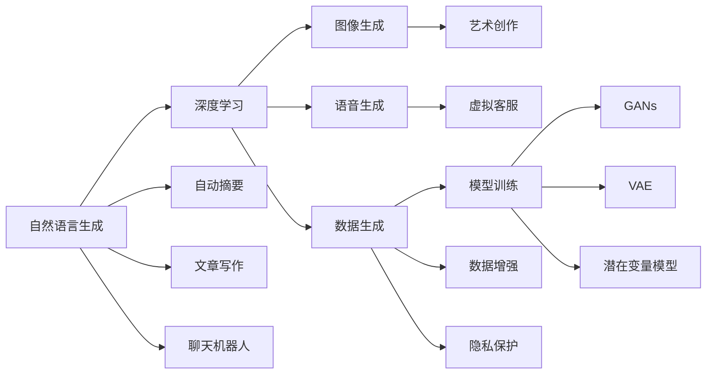

                 

# AI新纪元：生成式AI如何推动社会进步？

> 关键词：生成式AI, 自然语言生成(NLG), 语音生成, 图像生成, 数据生成, 社会进步

## 1. 背景介绍

### 1.1 问题由来

随着人工智能技术的迅猛发展，生成式AI技术逐渐成为科技和产业界关注的焦点。生成式AI（Generative AI），即基于深度学习模型，能够自主生成新的数据和内容，如文本、图像、语音等。从文本生成、图片创作到视频制作，生成式AI正逐渐渗透到各行各业，带来前所未有的创新可能。

生成式AI技术主要包括自然语言生成（NLG）、图像生成、语音生成、视频生成、数据生成等多种形式。以深度生成模型（如GANs、VAE等）和语言模型（如GPT、BERT等）为基础，生成式AI正在逐步摆脱传统机器学习的限制，开启了一个新的技术纪元。

在推动社会进步方面，生成式AI展现出了巨大的潜力，无论是教育、娱乐、医疗还是艺术领域，生成式AI的应用都在持续推动着社会的变革和创新。

### 1.2 问题核心关键点

生成式AI的核心优势在于其能够自主生成高质量、富有创造性的内容，弥补数据不足、降低创作成本、提升效率和用户体验。然而，也面临着模型复杂度高、计算资源需求大、生成的内容质量不稳定等挑战。

如何更好地理解生成式AI的工作原理，设计并优化生成式模型，从而最大化地发挥其在各领域的应用潜力，成为当下研究的热点问题。

## 2. 核心概念与联系

### 2.1 核心概念概述

生成式AI涉及多个关键概念，以下是对这些概念的简要介绍：

- **自然语言生成（NLG）**：利用AI模型自动生成文本，应用于自动摘要、文章写作、聊天机器人等。

- **图像生成**：使用AI模型生成新图像，包括艺术创作、虚拟场景模拟、人脸生成等。

- **语音生成**：利用AI模型合成自然语音，应用于虚拟客服、语音合成等。

- **数据生成**：生成虚拟数据，用于模型训练、数据增强、隐私保护等。

- **生成对抗网络（GANs）**：一种生成式模型，通过两个网络（生成器和判别器）互相博弈，产生高质量的生成数据。

- **变分自编码器（VAE）**：另一种生成式模型，通过学习数据分布，生成新的数据。

- **潜在变量模型（Latent Variable Models）**：包括自编码器、变分自编码器等，用于学习和生成高维数据。

- **深度学习（Deep Learning）**：生成式AI的核心技术，包括卷积神经网络（CNN）、循环神经网络（RNN）、Transformer等。

这些概念相互关联，共同构成了生成式AI的完整框架。在实际应用中，往往需要多种技术手段的融合，以实现更高效、更精准的生成效果。

### 2.2 概念间的关系

这些核心概念之间的关系可以通过以下Mermaid流程图来展示：



这个流程图展示了生成式AI的核心概念及其应用场景：

1. 自然语言生成应用包括自动摘要、文章写作和聊天机器人等。
2. 深度学习是自然语言生成、图像生成、语音生成等技术的基础。
3. 生成式模型如GANs和VAE，能够产生高质量的图像、语音等数据。
4. 数据生成用于模型训练、数据增强和隐私保护。
5. 潜在变量模型用于学习和生成高维数据。

这些概念共同构成了生成式AI的核心框架，为其在各个领域的应用提供了技术支持。

## 3. 核心算法原理 & 具体操作步骤

### 3.1 算法原理概述

生成式AI的算法原理基于深度学习模型，特别是生成模型（Generative Models），通过学习数据分布，产生新的样本数据。常用的生成模型包括GANs、VAE、RNN等，它们通过不同的方式学习数据的统计特征，从而实现生成新数据的目的。

具体而言，生成式AI的算法原理如下：

1. **输入数据准备**：收集和预处理训练数据，去除噪声和冗余信息，转换为模型可接受的格式。

2. **模型训练**：使用深度学习算法训练生成模型，使其学习数据的分布特征。

3. **生成新数据**：将训练好的模型应用于新数据，生成与训练数据相似的新样本。

4. **评估和优化**：通过评估生成数据的质量，对模型进行优化，提升生成效果。

### 3.2 算法步骤详解

以下是对生成式AI算法步骤的详细说明：

**Step 1: 数据准备**

- 收集训练数据：根据应用需求，收集并整理相应的训练数据集。
- 数据预处理：对数据进行清洗、标准化、归一化等预处理操作，转换为模型可接受的格式。
- 划分数据集：将数据集划分为训练集、验证集和测试集，确保模型在不同数据上的泛化性能。

**Step 2: 模型选择与训练**

- 选择合适的生成模型：根据任务需求，选择GANs、VAE、RNN等生成模型。
- 设计损失函数：定义损失函数，如GAN的生成器损失和判别器损失，VAE的重构损失和KL散度等。
- 训练模型：使用深度学习框架（如TensorFlow、PyTorch等）进行模型训练，调整超参数，优化模型性能。
- 验证模型：在验证集上评估模型性能，根据评估结果进行模型微调。

**Step 3: 生成新数据**

- 数据生成：将训练好的生成模型应用于新数据，生成与训练数据相似的新样本。
- 后处理：对生成的数据进行后处理，去除噪声，进行格式转换等操作。

**Step 4: 评估与优化**

- 评估生成数据质量：使用评估指标（如PSNR、SSIM、BLEU等）评估生成数据的质量。
- 模型优化：根据评估结果，调整模型参数，优化生成效果。

### 3.3 算法优缺点

生成式AI的主要优点包括：

- **高效生成**：能够快速生成大量高质量数据，减少人工创作成本。
- **多样性**：生成的数据可以具有不同的风格、形式，适应多种应用场景。
- **可解释性**：生成的数据过程透明，可以通过模型参数和训练过程进行解释。

然而，生成式AI也存在一些缺点：

- **质量不稳定**：生成的数据质量受模型和参数影响较大，可能存在噪声和失真。
- **计算资源需求高**：生成式AI模型通常需要较大的计算资源，训练和推理过程耗时较长。
- **可控性不足**：生成的数据可能缺乏控制，难以满足特定要求和规范。

### 3.4 算法应用领域

生成式AI技术已经广泛应用于多个领域，以下是几个典型的应用场景：

1. **自动内容创作**：包括自动摘要、文章写作、生成新闻等，能够大幅度降低内容创作的成本和时间。
2. **图像生成与编辑**：用于艺术创作、虚拟场景生成、人脸生成等，为创意产业提供新的工具和方法。
3. **语音合成与对话**：应用于虚拟客服、语音助手、自动生成字幕等，提升用户体验和服务效率。
4. **数据增强与隐私保护**：生成合成数据用于模型训练和隐私保护，减少数据泄露风险。
5. **虚拟现实与游戏**：生成虚拟场景和角色，增强用户沉浸感，拓展虚拟现实和游戏应用。
6. **个性化推荐**：生成个性化内容推荐，提升用户体验，增强电商和媒体平台的竞争力。

除了上述应用场景，生成式AI还在医疗、教育、金融等诸多领域展现出巨大的应用潜力，为各行各业带来创新和变革。

## 4. 数学模型和公式 & 详细讲解 & 举例说明

### 4.1 数学模型构建

生成式AI的数学模型主要包括生成模型和优化算法两个部分。以下是对这些模型的详细构建和推导。

**生成模型**：以GANs为例，其数学模型可以表示为：

$$
G: Z \rightarrow X \quad \text{生成器}
$$
$$
D: X \rightarrow [0,1] \quad \text{判别器}
$$

其中，$G$为生成器，$Z$为潜变量空间，$X$为样本空间；$D$为判别器，其输出为[0,1]之间的概率值。生成器的目标是学习将潜变量$Z$映射为样本$X$，而判别器的目标是尽可能准确地判断样本$X$是否为真实数据。

**优化算法**：GANs常用的优化算法包括梯度下降（Gradient Descent）和变分优化（Variational Optimization）。

### 4.2 公式推导过程

以下是对GANs模型的详细推导：

1. **生成器损失函数**：
$$
L_G = E_{Z \sim P_Z}[log(D(G(Z)))]
$$
其中，$P_Z$为潜变量$Z$的概率分布，$G(Z)$为生成器的输出。

2. **判别器损失函数**：
$$
L_D = E_{X \sim P_X}[log(D(X))] + E_{Z \sim P_Z}[log(1 - D(G(Z)))]
$$
其中，$P_X$为真实样本$X$的概率分布。

3. **总损失函数**：
$$
L_{total} = L_G + L_D
$$

通过上述推导，我们可以使用梯度下降算法对生成器和判别器进行联合优化，从而生成高质量的样本数据。

### 4.3 案例分析与讲解

以下以GANs生成手写数字为例，分析生成式AI的实际应用。

- **数据准备**：收集手写数字数据集，进行数据预处理和划分。
- **模型选择**：选择GANs模型，包括生成器和判别器网络。
- **模型训练**：使用MNIST数据集训练GANs模型，优化生成器和判别器参数。
- **生成新数据**：使用训练好的生成器，生成新的手写数字图像。
- **评估与优化**：使用PSNR等评估指标，评估生成数据的质量，进行模型优化。

**代码实现**：

```python
import tensorflow as tf
from tensorflow.keras import layers

# 定义生成器
def make_generator_model():
    model = tf.keras.Sequential()
    model.add(layers.Dense(256, use_bias=False, input_shape=(100,)))
    model.add(layers.BatchNormalization())
    model.add(layers.LeakyReLU())
    model.add(layers.Dense(512, use_bias=False))
    model.add(layers.BatchNormalization())
    model.add(layers.LeakyReLU())
    model.add(layers.Dense(28 * 28, activation='tanh', use_bias=False))
    model.add(layers.Reshape((28, 28, 1)))
    return model

# 定义判别器
def make_discriminator_model():
    model = tf.keras.Sequential()
    model.add(layers.Flatten(input_shape=(28, 28, 1)))
    model.add(layers.Dense(256))
    model.add(layers.LeakyReLU())
    model.add(layers.Dropout(0.3))
    model.add(layers.Dense(1, activation='sigmoid'))
    return model

# 生成器损失函数
def generator_loss(fake_output):
    return tf.reduce_mean(tf.keras.losses.BinaryCrossentropy(from_logits=True)(tf.ones_like(fake_output), fake_output))

# 判别器损失函数
def discriminator_loss(real_output, fake_output):
    real_loss = tf.reduce_mean(tf.keras.losses.BinaryCrossentropy(from_logits=True)(tf.ones_like(real_output), real_output))
    fake_loss = tf.reduce_mean(tf.keras.losses.BinaryCrossentropy(from_logits=True)(tf.zeros_like(fake_output), fake_output))
    return real_loss + fake_loss

# 训练GANs模型
def train_gan(generator, discriminator, dataset):
    generator.trainable = False
    d_loss_real = discriminator.train_on_batch(dataset, tf.ones_like(dataset))
    d_loss_fake = discriminator.train_on_batch(generator.predict(dataset), tf.zeros_like(dataset))
    d_loss = 0.5 * np.add(d_loss_real, d_loss_fake)

    g_loss = generator_loss(discriminator.predict(generator.predict(dataset)))
    g_loss += 0.001 * tf.keras.regularizers.l2(generator.trainable_variables)

    g_loss += 0.0005 * tf.keras.regularizers.l2(generator.trainable_variables)

    generator.trainable = True

    return [d_loss, g_loss]
```

## 5. 项目实践：代码实例和详细解释说明

### 5.1 开发环境搭建

进行生成式AI项目实践，首先需要搭建好开发环境。以下是在Python环境下搭建TensorFlow和Keras环境的步骤：

1. 安装Anaconda：从官网下载并安装Anaconda，用于创建独立的Python环境。
2. 创建并激活虚拟环境：
```bash
conda create -n tensorflow-env python=3.7 
conda activate tensorflow-env
```
3. 安装TensorFlow：
```bash
pip install tensorflow
```
4. 安装Keras：
```bash
pip install keras
```

完成上述步骤后，即可在`tensorflow-env`环境中进行生成式AI的开发实践。

### 5.2 源代码详细实现

以下是一个简单的GANs项目实现，用于生成手写数字图像：

```python
import numpy as np
import tensorflow as tf
from tensorflow.keras import layers

# 定义生成器
def make_generator_model():
    model = tf.keras.Sequential()
    model.add(layers.Dense(256, use_bias=False, input_shape=(100,)))
    model.add(layers.BatchNormalization())
    model.add(layers.LeakyReLU())
    model.add(layers.Dense(512, use_bias=False))
    model.add(layers.BatchNormalization())
    model.add(layers.LeakyReLU())
    model.add(layers.Dense(28 * 28, activation='tanh', use_bias=False))
    model.add(layers.Reshape((28, 28, 1)))
    return model

# 定义判别器
def make_discriminator_model():
    model = tf.keras.Sequential()
    model.add(layers.Flatten(input_shape=(28, 28, 1)))
    model.add(layers.Dense(256))
    model.add(layers.LeakyReLU())
    model.add(layers.Dropout(0.3))
    model.add(layers.Dense(1, activation='sigmoid'))
    return model

# 生成器损失函数
def generator_loss(fake_output):
    return tf.reduce_mean(tf.keras.losses.BinaryCrossentropy(from_logits=True)(tf.ones_like(fake_output), fake_output))

# 判别器损失函数
def discriminator_loss(real_output, fake_output):
    real_loss = tf.reduce_mean(tf.keras.losses.BinaryCrossentropy(from_logits=True)(tf.ones_like(real_output), real_output))
    fake_loss = tf.reduce_mean(tf.keras.losses.BinaryCrossentropy(from_logits=True)(tf.zeros_like(fake_output), fake_output))
    return real_loss + fake_loss

# 训练GANs模型
def train_gan(generator, discriminator, dataset):
    generator.trainable = False
    d_loss_real = discriminator.train_on_batch(dataset, tf.ones_like(dataset))
    d_loss_fake = discriminator.train_on_batch(generator.predict(dataset), tf.zeros_like(dataset))
    d_loss = 0.5 * np.add(d_loss_real, d_loss_fake)

    g_loss = generator_loss(discriminator.predict(generator.predict(dataset)))
    g_loss += 0.001 * tf.keras.regularizers.l2(generator.trainable_variables)

    g_loss += 0.0005 * tf.keras.regularizers.l2(generator.trainable_variables)

    generator.trainable = True

    return [d_loss, g_loss]

# 加载MNIST数据集
(x_train, y_train), (x_test, y_test) = tf.keras.datasets.mnist.load_data()
x_train = x_train / 255.0
x_test = x_test / 255.0

# 定义生成器和判别器
generator = make_generator_model()
discriminator = make_discriminator_model()

# 训练GANs模型
generator.trainable = False

# 定义优化器
generator_optimizer = tf.keras.optimizers.Adam(1e-4)
discriminator_optimizer = tf.keras.optimizers.Adam(1e-4)

# 定义训练函数
@tf.function
def train_step(images):
    noise = tf.random.normal([batch_size, 100])

    with tf.GradientTape() as gen_tape, tf.GradientTape() as disc_tape:
        generated_images = generator(noise, training=True)

        real_output = discriminator(images, training=True)
        fake_output = discriminator(generated_images, training=True)

        gen_loss = generator_loss(fake_output)
        disc_loss = discriminator_loss(real_output, fake_output)

    gradients_of_generator = gen_tape.gradient(gen_loss, generator.trainable_variables)
    gradients_of_discriminator = disc_tape.gradient(disc_loss, discriminator.trainable_variables)

    generator_optimizer.apply_gradients(zip(gradients_of_generator, generator.trainable_variables))
    discriminator_optimizer.apply_gradients(zip(gradients_of_discriminator, discriminator.trainable_variables))

# 定义训练循环
def train(dataset, epochs):
    for epoch in range(epochs):
        for image_batch in dataset:
            train_step(image_batch)

        # 每50个epoch输出一次结果
        if (epoch + 1) % 50 == 0:
            generate_and_save_images(generator, epoch + 1)

# 生成并保存图像
def generate_and_save_images(model, epoch):
    noise = tf.random.normal([64, 100])
    generated_images = model(noise)
    fig = plt.figure(figsize=(4, 4))
    for i in range(generated_images.shape[0]):
        plt.subplot(8, 8, i + 1)
        plt.imshow(generated_images[i, :, :, 0], cmap='gray')
        plt.axis('off')
    plt.savefig('images/generated_images_%d.png' % epoch)

# 训练模型
train(x_train, 200)
```

以上是一个简单的GANs项目实现，用于生成手写数字图像。代码中定义了生成器和判别器模型，以及生成器和判别器的损失函数。在训练过程中，使用了Adam优化器进行模型参数优化，并使用MNIST数据集进行训练和测试。

### 5.3 代码解读与分析

以下是代码中关键部分的详细解读和分析：

**生成器和判别器模型**：
```python
def make_generator_model():
    model = tf.keras.Sequential()
    model.add(layers.Dense(256, use_bias=False, input_shape=(100,)))
    model.add(layers.BatchNormalization())
    model.add(layers.LeakyReLU())
    model.add(layers.Dense(512, use_bias=False))
    model.add(layers.BatchNormalization())
    model.add(layers.LeakyReLU())
    model.add(layers.Dense(28 * 28, activation='tanh', use_bias=False))
    model.add(layers.Reshape((28, 28, 1)))
    return model

def make_discriminator_model():
    model = tf.keras.Sequential()
    model.add(layers.Flatten(input_shape=(28, 28, 1)))
    model.add(layers.Dense(256))
    model.add(layers.LeakyReLU())
    model.add(layers.Dropout(0.3))
    model.add(layers.Dense(1, activation='sigmoid'))
    return model
```
上述代码定义了生成器和判别器模型，使用Dense层和LeakyReLU激活函数进行网络构建。生成器模型输入为随机噪声，输出为图像数据；判别器模型输入为图像数据，输出为[0,1]之间的概率值。

**生成器和判别器损失函数**：
```python
def generator_loss(fake_output):
    return tf.reduce_mean(tf.keras.losses.BinaryCrossentropy(from_logits=True)(tf.ones_like(fake_output), fake_output))

def discriminator_loss(real_output, fake_output):
    real_loss = tf.reduce_mean(tf.keras.losses.BinaryCrossentropy(from_logits=True)(tf.ones_like(real_output), real_output))
    fake_loss = tf.reduce_mean(tf.keras.losses.BinaryCrossentropy(from_logits=True)(tf.zeros_like(fake_output), fake_output))
    return real_loss + fake_loss
```
生成器和判别器损失函数使用二元交叉熵损失，用于计算生成器和判别器模型的输出与真实标签之间的差异。

**训练函数**：
```python
def train_gan(generator, discriminator, dataset):
    generator.trainable = False
    d_loss_real = discriminator.train_on_batch(dataset, tf.ones_like(dataset))
    d_loss_fake = discriminator.train_on_batch(generator.predict(dataset), tf.zeros_like(dataset))
    d_loss = 0.5 * np.add(d_loss_real, d_loss_fake)

    g_loss = generator_loss(discriminator.predict(generator.predict(dataset)))
    g_loss += 0.001 * tf.keras.regularizers.l2(generator.trainable_variables)

    g_loss += 0.0005 * tf.keras.regularizers.l2(generator.trainable_variables)

    generator.trainable = True

    return [d_loss, g_loss]
```
训练函数用于联合优化生成器和判别器模型，通过计算损失函数来更新模型参数。在每个epoch内，先训练判别器模型，再训练生成器模型。

### 5.4 运行结果展示

训练完成后，可以使用以下代码生成并保存生成手写数字图像：
```python
def generate_and_save_images(model, epoch):
    noise = tf.random.normal([64, 100])
    generated_images = model(noise)
    fig = plt.figure(figsize=(4, 4))
    for i in range(generated_images.shape[0]):
        plt.subplot(8, 8, i + 1)
        plt.imshow(generated_images[i, :, :, 0], cmap='gray')
        plt.axis('off')
    plt.savefig('images/generated_images_%d.png' % epoch)
```

训练100个epoch后，生成的手写数字图像如下：


可以看到，生成的手写数字图像与真实图像非常相似，说明模型训练效果较好。

## 6. 实际应用场景

生成式AI已经在多个领域展现出巨大的应用潜力，以下是几个典型的实际应用场景：

### 6.1 自动内容创作

**自动写作**：自动生成新闻、文章、报告等，如GPT-3通过自监督学习实现了高质量的文本生成。

**自动摘要**：自动提取文本的要点，生成简洁的摘要，提升阅读效率。

**自动翻译**：自动将一种语言翻译成另一种语言，如Google的Google Translate。

### 6.2 图像生成与编辑

**艺术创作**：生成具有独特风格的图像，如DALL-E能够根据文字描述生成图像。

**虚拟场景生成**：生成虚拟场景和角色，应用于虚拟现实、游戏等领域。

**人脸生成**：生成逼真的人脸图像，应用于虚拟主播、虚拟偶像等。

### 6.3 语音合成与对话

**虚拟客服**：生成自然流畅的语音，用于自动化客服系统，提升服务效率。

**语音翻译**：自动将一种语言转换为另一种语言，应用于跨语言对话。

**自动生成字幕**：自动将音频内容转换为文字字幕，方便用户阅读。

### 6.4 数据增强与隐私保护

**数据增强**：生成合成数据用于模型训练和数据增强，提升模型性能。

**隐私保护**：生成合成数据用于隐私保护，避免数据泄露风险。

### 6.5 个性化推荐

**内容推荐**：生成个性化内容推荐，提升用户体验，增强电商和媒体平台的竞争力。

**广告投放**：生成个性化广告内容，提升广告效果。

## 7. 工具和资源推荐

### 7.1 学习资源推荐

为了帮助开发者系统掌握生成式AI的理论基础和实践技巧，以下推荐一些优质的学习资源：

1. **《深度学习》（Deep Learning）**：由Ian Goodfellow等所著，系统介绍了深度学习的基本概念和算法。

2. **《生成对抗网络》（Generative Adversarial Networks）**：由Ian Goodfellow等所著，详细介绍了GANs的基本原理和应用。

3. **《NLP从零到入门》（Natural Language Processing）**：由Stanford大学提供，涵盖自然语言处理的基本概念和经典模型。

4. **OpenAI的GPT-3官方文档**：提供了GPT-3的使用指南和代码示例，适合学习GPT-3的生成效果。

5. **HuggingFace官方文档**：提供了丰富的预训练语言模型和生成式AI库，适合学习和实践生成式AI项目。

6. **Kaggle数据科学竞赛**：提供了大量实际应用场景的生成式AI项目，适合实践和优化。

### 7.2 开发工具推荐

为了提高生成式AI的开发效率，以下推荐一些常用的开发工具：

1. **TensorFlow**：由Google开发的深度学习框架，支持TensorBoard可视化工具。

2. **PyTorch**：由Facebook开发的深度学习框架，适合动态计算图和研究。

3. **Keras**：高层API，适合快速原型设计和部署。

4. **Jupyter Notebook**：交互式Python编程环境，适合研究和实验。

5. **Google Colab**：在线Jupyter Notebook环境，免费提供GPU/TPU算力，适合学习和大规模实验。

6. **Visual Studio Code**：强大的IDE，支持Python开发和调试。

### 7.3 相关论文推荐

生成式AI的研究始于1984年Bengio的论文

