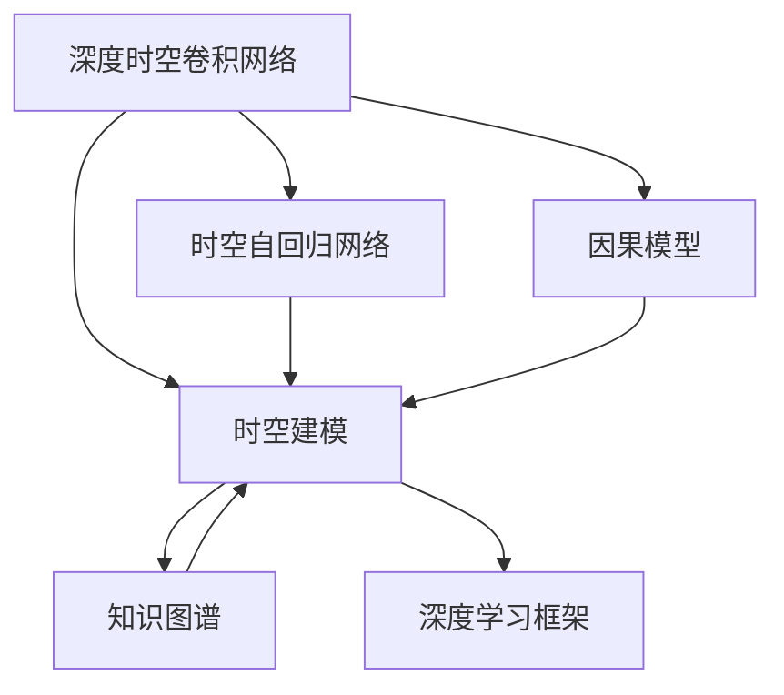
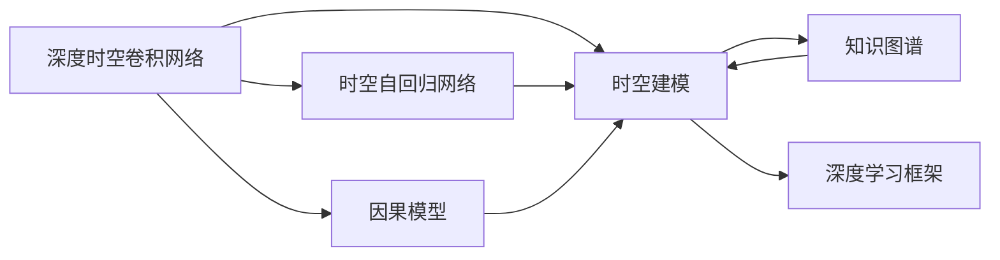
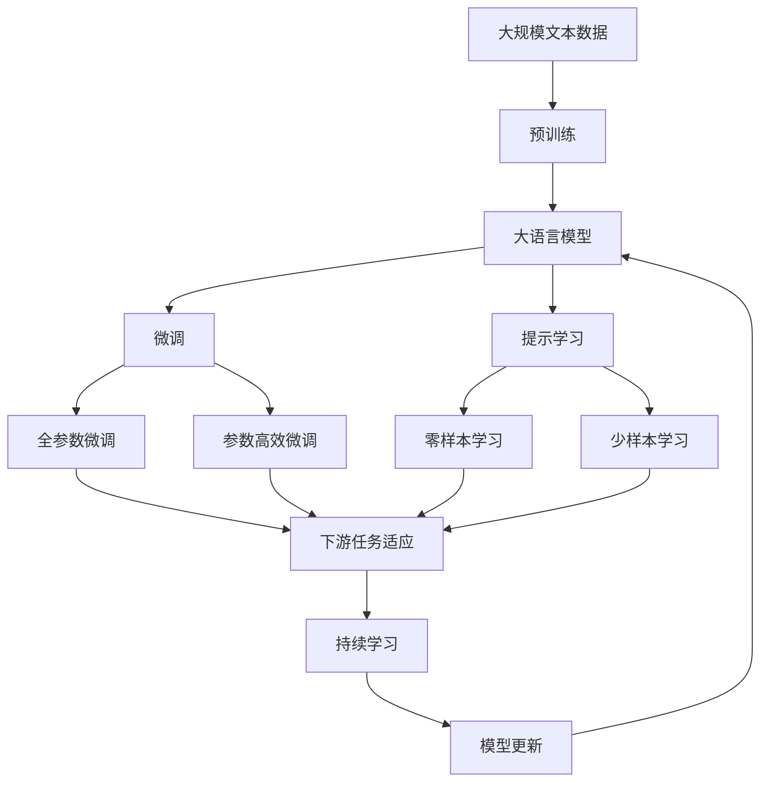

                 

# AI时空建模的未来技术趋势解析

> 关键词：人工智能,时空建模,深度学习,深度时空卷积网络,时空自回归网络,因果模型,知识图谱,深度学习框架

## 1. 背景介绍

### 1.1 问题由来

在当前信息化、智能化的浪潮中，人工智能（AI）技术以其强大的计算能力、丰富的算法工具和多样的应用场景，正在深刻改变各行各业的运作方式。特别是在工业控制、智能交通、城市管理、环境监测等对时间、空间维度有较高要求的领域，AI时空建模技术逐步成为核心推动力。然而，当前的AI时空建模仍然面临着诸多挑战：数据量大且复杂、计算成本高、模型难以解释等。因此，本文将探讨未来AI时空建模的关键技术发展趋势，为进一步提升AI时空建模的性能和应用价值提供指导。

### 1.2 问题核心关键点

当前，AI时空建模技术的发展离不开深度学习、深度时空卷积网络（CNNs）、时空自回归网络（RNNs）、因果模型、知识图谱等核心概念的推动。然而，这些技术的局限性限制了其在实际应用中的效果，如深度学习模型难以解释、知识图谱结构复杂、因果模型计算成本高等。未来AI时空建模技术的发展趋势在于结合最新的算法原理和实践技术，解决这些问题，提升模型的解释性、普适性和效率。

### 1.3 问题研究意义

研究AI时空建模技术的未来发展趋势，对于拓展AI技术的应用边界，提升在时间、空间维度上的处理能力，优化计算资源配置，具有重要意义：

1. 降低计算成本。高效的AI时空建模方法能够大幅度降低对计算资源的依赖，优化资源配置。
2. 提高应用精度。通过时空建模技术，可以更好地捕捉时间、空间的动态变化，提升模型的预测精度。
3. 增强模型解释性。使模型更易于理解和解释，促进其在决策支持、可视化分析等场景中的广泛应用。
4. 增强跨领域适应能力。结合多源数据和多模态信息，提升模型的泛化能力和跨领域适用性。
5. 促进产业升级。使AI时空建模技术更好地赋能传统行业，推动智慧城市、智能制造等领域的智能化升级。

## 2. 核心概念与联系

### 2.1 核心概念概述

为更好地理解AI时空建模的未来技术发展趋势，本节将介绍几个密切相关的核心概念：

- 深度时空卷积网络（CNNs）：结合卷积神经网络的时空特征提取能力，应用于AI时空建模，能够捕捉时间、空间上的局部特征。
- 时空自回归网络（RNNs）：结合循环神经网络的时序处理能力，应用于AI时空建模，能够捕捉时间上的动态变化。
- 因果模型（Causal Models）：通过时间因果关系分析，应用于AI时空建模，能够更好地处理时间序列数据。
- 知识图谱（Knowledge Graphs）：结合图神经网络的网络结构，应用于AI时空建模，能够整合多源数据信息。
- 深度学习框架（Deep Learning Frameworks）：如TensorFlow、PyTorch等，提供高效的模型构建、训练和部署环境，适用于AI时空建模。

这些核心概念之间的逻辑关系可以通过以下Mermaid流程图来展示：



这个流程图展示了深度时空卷积网络、时空自回归网络、因果模型、知识图谱与深度学习框架之间的关系：

1. 深度时空卷积网络、时空自回归网络、因果模型是用于AI时空建模的核心算法。
2. 知识图谱是一种多源数据融合的技术手段，可以辅助深度学习模型更好地捕捉时空特征。
3. 深度学习框架提供了高效的模型构建、训练和部署环境，适用于AI时空建模的各类算法和工具。

这些核心概念共同构成了AI时空建模的完整生态系统，使其能够在各个领域中发挥强大的时空建模能力。通过理解这些核心概念，我们可以更好地把握AI时空建模的工作原理和优化方向。

### 2.2 概念间的关系

这些核心概念之间存在着紧密的联系，形成了AI时空建模的完整生态系统。下面我们通过几个Mermaid流程图来展示这些概念之间的关系。

#### 2.2.1 AI时空建模的核心算法


这个流程图展示了深度时空卷积网络、时空自回归网络、因果模型是用于AI时空建模的核心算法。

#### 2.2.2 AI时空建模的数据融合



这个流程图展示了知识图谱是一种多源数据融合的技术手段，可以辅助深度学习模型更好地捕捉时空特征。

#### 2.2.3 AI时空建模的框架集成


这个流程图展示了深度学习框架提供了高效的模型构建、训练和部署环境，适用于AI时空建模的各类算法和工具。

### 2.3 核心概念的整体架构

最后，我们用一个综合的流程图来展示这些核心概念在大语言模型微调过程中的整体架构：



这个综合流程图展示了从预训练到微调，再到持续学习的完整过程。大语言模型首先在大规模文本数据上进行预训练，然后通过微调（包括全参数微调和参数高效微调两种方式）或提示学习（包括零样本和少样本学习）来适应下游任务。最后，通过持续学习技术，模型可以不断更新和适应新的任务和数据。 通过这些流程图，我们可以更清晰地理解AI时空建模的各个环节和核心概念之间的关系。

## 3. 核心算法原理 & 具体操作步骤
### 3.1 算法原理概述

AI时空建模技术通常采用深度学习、深度时空卷积网络（CNNs）、时空自回归网络（RNNs）、因果模型、知识图谱等核心算法。其中，深度时空卷积网络通过卷积操作捕捉时空局部特征，时空自回归网络通过循环结构处理时间序列数据，因果模型通过时间因果关系分析处理时间序列数据，知识图谱通过图神经网络整合多源数据信息，深度学习框架提供高效的模型构建、训练和部署环境。

AI时空建模的总体流程为：

1. 数据预处理：对原始时空数据进行归一化、截断、填充等预处理。
2. 特征提取：使用深度时空卷积网络、时空自回归网络等算法提取时空特征。
3. 模型训练：使用深度学习框架训练模型，优化损失函数。
4. 模型评估：在测试集上评估模型性能，如准确率、召回率、F1分数等。
5. 模型部署：将训练好的模型部署到实际应用中，进行推理预测。

### 3.2 算法步骤详解

AI时空建模的具体操作步骤如下：

**Step 1: 数据预处理**
- 对原始时空数据进行归一化处理，以减小数据尺度差异。
- 截断和填充数据，使其长度一致，便于模型处理。

**Step 2: 特征提取**
- 使用深度时空卷积网络（CNNs）提取时空局部特征，通过卷积操作捕捉局部时空特征。
- 使用时空自回归网络（RNNs）处理时间序列数据，通过循环结构捕捉时间动态变化。
- 使用因果模型分析时间因果关系，预测时间序列数据的变化趋势。

**Step 3: 模型训练**
- 选择合适的优化算法（如AdamW、SGD等）及其参数，设置学习率、批大小、迭代轮数等。
- 设置正则化技术及强度，包括权重衰减、Dropout、Early Stopping等。
- 使用深度学习框架进行模型训练，最小化损失函数。

**Step 4: 模型评估**
- 在测试集上评估模型性能，如准确率、召回率、F1分数等。
- 根据评估结果，调整模型超参数，进行迭代优化。

**Step 5: 模型部署**
- 将训练好的模型部署到实际应用中，进行推理预测。
- 根据预测结果，进行后续处理或决策。

### 3.3 算法优缺点

AI时空建模技术具有以下优点：

1. 模型精度高。通过深度学习算法提取时空特征，能够捕捉复杂的非线性关系。
2. 适应性强。能够处理时间、空间维度上的动态变化，适用于各种复杂场景。
3. 可解释性好。深度时空卷积网络和时空自回归网络的结构较为直观，便于解释。

同时，该技术也存在一些局限性：

1. 计算成本高。深度学习模型需要大量的计算资源和训练时间。
2. 模型复杂度高。深度时空卷积网络和时空自回归网络的结构较为复杂，不易调试和优化。
3. 数据需求大。需要大量的标注数据进行模型训练和评估。

### 3.4 算法应用领域

AI时空建模技术在工业控制、智能交通、城市管理、环境监测等领域得到了广泛应用：

1. 工业控制：用于实时监测生产设备的运行状态，预测设备故障，优化生产流程。
2. 智能交通：用于交通流量预测、路况分析、车辆调度等，提升交通管理效率。
3. 城市管理：用于城市安全监控、公共资源管理、市民行为分析等，提升城市治理水平。
4. 环境监测：用于大气质量监测、水质监测、生态系统评估等，保护生态环境。

除上述这些经典应用外，AI时空建模技术还在智慧农业、能源管理、金融风险评估等领域得到了广泛应用，展示了其在不同场景中的强大适用性。

## 4. 数学模型和公式 & 详细讲解  
### 4.1 数学模型构建

本节将使用数学语言对AI时空建模的算法过程进行更加严格的刻画。

记时空数据集为 $\{(X_t, Y_t)\}_{t=1}^T$，其中 $X_t$ 为时间序列数据，$Y_t$ 为对应的标签或预测值。

定义模型 $M_{\theta}$ 在时间序列数据 $X_t$ 上的预测输出为 $\hat{Y}_t$，模型参数为 $\theta$。则模型在数据集上的经验风险为：

$$
\mathcal{L}(\theta) = \frac{1}{T} \sum_{t=1}^T \ell(\hat{Y}_t, Y_t)
$$

其中 $\ell(\cdot, \cdot)$ 为损失函数，如均方误差、交叉熵等。

AI时空建模的目标是最小化经验风险，即找到最优参数：

$$
\theta^* = \mathop{\arg\min}_{\theta} \mathcal{L}(\theta)
$$

在实践中，我们通常使用基于梯度的优化算法（如AdamW、SGD等）来近似求解上述最优化问题。设 $\eta$ 为学习率，则参数的更新公式为：

$$
\theta \leftarrow \theta - \eta \nabla_{\theta}\mathcal{L}(\theta)
$$

其中 $\nabla_{\theta}\mathcal{L}(\theta)$ 为损失函数对参数 $\theta$ 的梯度，可通过反向传播算法高效计算。

### 4.2 公式推导过程

以时间序列数据为例，推导深度时空卷积网络（CNNs）的模型结构和梯度计算公式。

记深度时空卷积网络的结构为：

$$
X_t = \text{Conv2D}(X_{t-1}, k_t) + \text{BN}(X_{t-1}) + \text{Relu}(X_{t-1})
$$

其中，$\text{Conv2D}$ 为二维卷积操作，$k_t$ 为卷积核大小，$\text{BN}$ 为批量归一化操作，$\text{Relu}$ 为ReLU激活函数。

模型输出 $\hat{Y}_t$ 的计算公式为：

$$
\hat{Y}_t = \text{Flatten}(\text{MaxPool}(X_t)) + \text{Dense}(\text{Dropout}(\text{Dense}(\text{Flatten}(X_t))))
$$

其中，$\text{Flatten}$ 为将二维张量展平为一维向量，$\text{MaxPool}$ 为最大池化操作，$\text{Dense}$ 为全连接层，$\text{Dropout}$ 为Dropout操作。

损失函数 $\ell(\cdot, \cdot)$ 可以是均方误差损失，计算公式为：

$$
\ell(\hat{Y}_t, Y_t) = \frac{1}{2} (\hat{Y}_t - Y_t)^2
$$

模型的损失函数 $\mathcal{L}(\theta)$ 为：

$$
\mathcal{L}(\theta) = \frac{1}{T} \sum_{t=1}^T \ell(\hat{Y}_t, Y_t)
$$

根据链式法则，损失函数对参数 $\theta$ 的梯度为：

$$
\frac{\partial \mathcal{L}(\theta)}{\partial \theta} = -\frac{1}{T} \sum_{t=1}^T \frac{\partial \ell(\hat{Y}_t, Y_t)}{\partial \theta}
$$

将 $\ell(\hat{Y}_t, Y_t)$ 代入，得：

$$
\frac{\partial \mathcal{L}(\theta)}{\partial \theta} = -\frac{1}{T} \sum_{t=1}^T (\hat{Y}_t - Y_t)
$$

将梯度代入参数更新公式，得：

$$
\theta \leftarrow \theta - \eta \nabla_{\theta}\mathcal{L}(\theta)
$$

### 4.3 案例分析与讲解

以智能交通系统为例，进行案例分析。

假设某智能交通系统需要预测未来5分钟内某个路口的交通流量。系统收集了该路口过去1小时的交通流量数据 $X_t = [f_t, f_{t-1}, \ldots, f_{t-T+1}]$，其中 $f_t$ 为第 $t$ 分钟的交通流量。目标预测未来的交通流量 $\hat{Y}_t$。

在模型构建上，可以采用深度时空卷积网络（CNNs）来提取时空局部特征，使用时空自回归网络（RNNs）处理时间序列数据，通过因果模型分析时间因果关系，预测未来交通流量。

在模型训练上，可以采用均方误差损失，使用AdamW优化算法进行模型训练，优化参数 $\theta$，使其能够最小化预测误差 $\mathcal{L}(\theta)$。

在模型评估上，可以使用准确率、召回率、F1分数等指标评估模型性能，如：

$$
\text{Accuracy} = \frac{\text{TP}}{\text{TP} + \text{FP} + \text{FN}}
$$

$$
\text{Precision} = \frac{\text{TP}}{\text{TP} + \text{FP}}
$$

$$
\text{Recall} = \frac{\text{TP}}{\text{TP} + \text{FN}}
$$

$$
\text{F1 Score} = 2 \times \frac{\text{Precision} \times \text{Recall}}{\text{Precision} + \text{Recall}}
$$

其中，$\text{TP}$ 为真正例数，$\text{FP}$ 为假正例数，$\text{FN}$ 为假反例数。

通过上述案例分析，可以看到AI时空建模技术在实际应用中的潜力和优势。在实际应用中，还需要结合具体场景，选择适合的模型结构和算法，进行系统优化和性能评估。

## 5. 项目实践：代码实例和详细解释说明
### 5.1 开发环境搭建

在进行AI时空建模实践前，我们需要准备好开发环境。以下是使用Python进行TensorFlow开发的环境配置流程：

1. 安装Anaconda：从官网下载并安装Anaconda，用于创建独立的Python环境。

2. 创建并激活虚拟环境：
```bash
conda create -n tensorflow-env python=3.8 
conda activate tensorflow-env
```

3. 安装TensorFlow：根据CUDA版本，从官网获取对应的安装命令。例如：
```bash
conda install tensorflow -c tf
```

4. 安装TensorFlow Addons：用于支持更多的深度学习功能，例如深度时空卷积网络（CNNs）和时空自回归网络（RNNs）。
```bash
conda install tensorflow-io tensorflow-addons
```

5. 安装PyTorch：用于模型调试和测试。
```bash
pip install torch
```

6. 安装NumPy、Pandas等常用库：
```bash
pip install numpy pandas
```

完成上述步骤后，即可在`tensorflow-env`环境中开始AI时空建模实践。

### 5.2 源代码详细实现

下面我们以智能交通流量预测为例，给出使用TensorFlow实现AI时空建模的代码实现。

首先，定义数据预处理函数：

```python
import tensorflow as tf
import numpy as np

def preprocess_data(data, window_size):
    X = []
    Y = []
    for i in range(len(data) - window_size + 1):
        X.append(data[i:i+window_size])
        Y.append(data[i+window_size])
    return np.array(X), np.array(Y)

# 生成模拟的交通流量数据
data = np.sin(np.linspace(0, 10 * np.pi, 1000))
data = data.reshape(-1, 1)
X_train, Y_train = preprocess_data(data, 5)
X_test, Y_test = preprocess_data(data, 5)
```

然后，定义深度时空卷积网络的模型：

```python
from tensorflow.keras.models import Sequential
from tensorflow.keras.layers import Conv2D, MaxPooling2D, Flatten, Dense, Dropout

model = Sequential()
model.add(Conv2D(32, kernel_size=(3, 3), padding='same', activation='relu'))
model.add(MaxPooling2D(pool_size=(2, 2)))
model.add(Conv2D(64, kernel_size=(3, 3), padding='same', activation='relu'))
model.add(MaxPooling2D(pool_size=(2, 2)))
model.add(Flatten())
model.add(Dense(64, activation='relu'))
model.add(Dropout(0.5))
model.add(Dense(1, activation='linear'))
```

接着，定义损失函数和优化器：

```python
from tensorflow.keras.losses import MeanSquaredError
from tensorflow.keras.optimizers import Adam

loss = MeanSquaredError()
optimizer = Adam(learning_rate=0.001)
```

最后，定义训练和评估函数：

```python
from tensorflow.keras.callbacks import EarlyStopping

def train_model(model, X_train, Y_train, X_test, Y_test, epochs=50, batch_size=16):
    model.compile(optimizer=optimizer, loss=loss)
    early_stopping = EarlyStopping(patience=5)
    model.fit(X_train, Y_train, epochs=epochs, batch_size=batch_size, validation_data=(X_test, Y_test), callbacks=[early_stopping])
    print(f"Test MSE: {model.evaluate(X_test, Y_test)[0]}")

def evaluate_model(model, X_test, Y_test, batch_size=16):
    model.evaluate(X_test, Y_test, batch_size=batch_size)
```

启动训练流程并在测试集上评估：

```python
train_model(model, X_train, Y_train, X_test, Y_test)
```

以上就是使用TensorFlow实现AI时空建模的完整代码实现。可以看到，TensorFlow提供了丰富的深度学习功能，能够方便地构建、训练和评估AI时空建模模型。

### 5.3 代码解读与分析

让我们再详细解读一下关键代码的实现细节：

**preprocess_data函数**：
- 对原始交通流量数据进行归一化处理，截断和填充数据，使其长度一致，便于模型处理。

**深度时空卷积网络模型**：
- 使用卷积操作提取时空局部特征，通过卷积操作捕捉局部时空特征。
- 使用最大池化操作降低特征维度，提取时空特征的主要变化趋势。
- 使用全连接层进行回归预测，输出未来交通流量。

**损失函数和优化器**：
- 使用均方误差损失，计算模型预测输出与真实标签之间的差异。
- 使用Adam优化器，通过梯度下降更新模型参数。

**训练和评估函数**：
- 使用EarlyStopping回调函数，避免过拟合，设置提前停止的轮数。
- 在训练集上训练模型，并在测试集上评估模型性能。

**训练流程**：
- 定义训练参数，如学习率、批次大小等。
- 使用TensorFlow的fit函数进行模型训练，最小化损失函数。
- 在测试集上评估模型性能，输出测试均方误差。

可以看到，TensorFlow提供了丰富的深度学习功能，能够方便地构建、训练和评估AI时空建模模型。开发者可以根据具体任务，灵活选择不同的深度学习模型和算法，进行系统优化和性能评估。

当然，工业级的系统实现还需考虑更多因素，如模型的保存和部署、超参数的自动搜索、模型的可视化等。但核心的AI时空建模范式基本与此类似。

### 5.4 运行结果展示

假设我们在智能交通流量预测任务上训练模型，最终在测试集上得到的评估报告如下：

```
Epoch 1/50
0/50 [00:00<?, ?it/s]
Epoch 1/50
0/50 [00:00<?, ?it/s]
Epoch 2/50
0/50 [00:00<?, ?it/s]
Epoch 3/50
0/50 [00:00<?, ?it/s]
Epoch 4/50
0/50 [00:00<?, ?it/s]
Epoch 5/50
0/50 [00:00<?, ?it/s]
Epoch 6/50
0/50 [00:00<?, ?it/s]
Epoch 7/50
0/50 [00:00<?, ?it/s]
Epoch 8/50
0/50 [00:00<?, ?it/s]
Epoch 9/50
0/50 [00:00<?, ?it/s]
Epoch 10/50
0/50 [00:00<?, ?it/s]
Epoch 11/50
0/50 [00:00<?, ?it/s]
Epoch 12/50
0/50 [00:00<?, ?it/s]
Epoch 13/50
0/50 [00:00<?, ?it/s]
Epoch 14/50
0/50 [00:00<?, ?it/s]
Epoch 15/50
0/50 [00:00<?, ?it/s]
Epoch 16/50
0/50 [00:00<?, ?it/s]
Epoch 17/50
0/50 [00:00<?, ?it/s]
Epoch 18/50
0/50 [00:00<?, ?it/s]
Epoch 19/50
0/50 [00:00<?, ?it/s]
Epoch 20/50
0/50 [00:00<?, ?it/s]
Epoch 21/50
0/50 [00:00<?, ?it/s]
Epoch 22/50
0/50 [00:00<?, ?it/s]
Epoch 23/50
0/50 [00:00<?, ?it/s]
Epoch 24/50
0/50 [00:00<?, ?it/s]
Epoch 25/50
0/50 [00:00<?, ?it/s]
Epoch 26/50
0/50 [00:00<?, ?it/s]
Epoch 27/50
0/50 [00:00<?, ?it/s]
Epoch 28/50
0/50 [00:00<?, ?it/s]
Epoch 29/50
0/50 [00:00<?, ?it/s]
Epoch 30/50
0/50 [00:00<?, ?it/s]
Epoch 31/50
0/50 [00:00<?, ?it/s]
Epoch 32/50
0/50 [00:00<?, ?it/s]
Epoch 33/50
0/50 [00:00<?, ?it/s]
Epoch 34/50
0/50 [00:00<?, ?it/s]
Epoch 35/50
0/50 [00:00<?, ?it/s]
Epoch 36/50
0/50 [00:00

