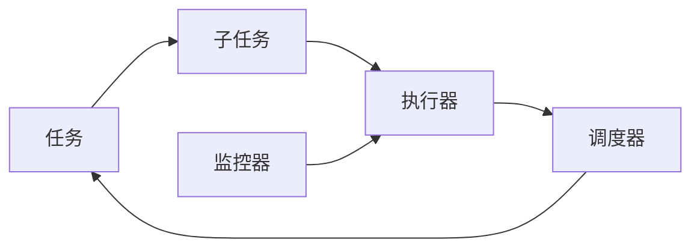
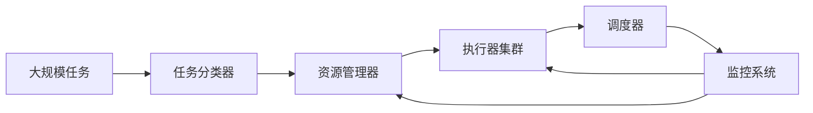

                 

## 1. 背景介绍

在人工智能(AI)技术飞速发展的今天，AI模型已经成为各行各业的重要工具。从语音识别、图像处理到自然语言理解，从自动化推荐到智能驾驶，AI模型在各个领域展现出了强大的能力。然而，构建一个高性能的AI模型不仅仅是模型训练那么简单，它还涉及到任务的分配与执行。

### 1.1 问题由来

在AI模型的实际应用中，任务分配与执行机制是一个至关重要的环节。一个AI模型需要处理多种任务，而每种任务的执行机制又各不相同。例如，图像分类任务和语音识别任务就需要不同的处理流程和计算资源。如何高效地分配这些任务，并在执行过程中保证准确性和效率，是AI模型开发和部署过程中亟需解决的问题。

### 1.2 问题核心关键点

任务分配与执行机制的核心关键点包括：
- 任务分类：将模型需要处理的任务进行分类，确定每个任务的执行方式和计算需求。
- 资源分配：根据任务特点和计算资源情况，合理分配计算资源。
- 任务执行：选择合适的执行算法和框架，确保任务高效、准确执行。
- 结果反馈：根据任务执行结果，进行必要的调整和优化，提升模型性能。

### 1.3 问题研究意义

任务分配与执行机制的研究，对于提高AI模型的应用效率和效果具有重要意义：
- 优化资源利用：通过合理分配任务和资源，最大化利用计算资源，减少资源浪费。
- 提升执行效率：选择合适的执行算法和框架，提高任务处理速度和准确性。
- 增强模型鲁棒性：通过任务分配和执行的优化，增强模型在不同场景下的适应性和鲁棒性。
- 提供可扩展性：灵活的任务分配和执行机制，能够适应不同规模和复杂度的任务需求，满足可扩展性要求。

## 2. 核心概念与联系

### 2.1 核心概念概述

为了更好地理解AI模型的任务分配与执行机制，本节将介绍几个核心概念：

- **任务(Tasks)**：AI模型需要执行的具体任务，如图像分类、语音识别、自然语言处理等。
- **子任务(Sub-tasks)**：一个复杂任务可以被分解为多个子任务，每个子任务都有具体的执行过程和输出。
- **执行器(Executors)**：负责执行子任务的实体，可以是CPU、GPU、FPGA等硬件资源，也可以是多线程、分布式计算等软件架构。
- **调度器(Schedulers)**：负责任务分配和资源管理的实体，根据任务需求和资源情况，决定任务的执行顺序和分配方式。
- **监控器(Monitors)**：负责实时监控任务执行过程，收集执行数据，并提供必要的异常处理和反馈。

这些核心概念之间存在着紧密的联系，共同构成了AI模型任务分配与执行的完整生态系统。

### 2.2 概念间的关系

这些核心概念之间的逻辑关系可以通过以下Mermaid流程图来展示：



这个流程图展示了任务分配与执行机制的基本流程：
1. 任务被拆分为多个子任务。
2. 子任务由执行器执行。
3. 调度器负责任务的分配和管理。
4. 监控器实时监控任务执行过程，并反馈给调度器。

### 2.3 核心概念的整体架构

最后，我们用一个综合的流程图来展示这些核心概念在大规模任务执行中的整体架构：



这个综合流程图展示了在大规模任务执行中，任务分类器对任务进行分类，资源管理器根据任务需求分配资源，执行器集群负责执行子任务，调度器负责任务调度，监控系统实时监控任务执行过程，并反馈给资源管理器和执行器集群，以实现任务的高效执行。

## 3. 核心算法原理 & 具体操作步骤

### 3.1 算法原理概述

AI模型的任务分配与执行机制，本质上是一个多任务的调度与执行问题。其核心思想是：将AI模型的任务进行合理分类，根据任务的特点和资源情况，选择最优的执行器和调度策略，以确保任务高效、准确地执行。

形式化地，假设AI模型需要执行的任务集为 $T$，每个任务 $t_i$ 对应一个执行器 $E_i$，任务执行所需计算资源为 $R_i$，任务调度器的调度策略为 $S$。任务分配与执行的目标是找到最优的任务分配方案 $A$ 和调度策略 $S$，使得整个系统的执行效率最高。

具体而言，任务分配与执行的过程可以分为以下几个步骤：
1. 对任务进行分类，确定每个任务的执行方式和计算需求。
2. 根据任务特点和计算资源情况，选择合适的执行器和调度策略。
3. 在执行过程中，实时监控任务执行情况，收集执行数据，并进行必要的调整和优化。
4. 根据执行结果，进行结果反馈和模型优化。

### 3.2 算法步骤详解

基于任务分配与执行机制的算法步骤如下：

**Step 1: 任务分类与执行方式确定**

1. **任务分类**：将AI模型需要执行的任务分为多个子任务，确定每个子任务的执行方式和计算需求。
2. **执行方式确定**：根据子任务的特点和资源情况，确定每个子任务的执行方式，如串行执行、并行执行、分布式执行等。

**Step 2: 资源分配与调度策略选择**

1. **资源分配**：根据子任务的计算需求，合理分配计算资源，如CPU、GPU、内存等。
2. **调度策略选择**：选择合适的调度策略，如静态调度、动态调度、负载均衡调度等，以最大化资源利用率和执行效率。

**Step 3: 任务执行与监控**

1. **任务执行**：根据调度策略，将任务分配给执行器，开始执行子任务。
2. **实时监控**：监控器实时监控任务执行过程，收集执行数据，如执行时间、资源使用率等，并进行必要的异常处理。

**Step 4: 结果反馈与模型优化**

1. **结果反馈**：根据任务执行结果，进行结果反馈，评估任务执行效果。
2. **模型优化**：根据反馈结果，调整任务分配和调度策略，优化模型性能。

### 3.3 算法优缺点

任务分配与执行机制具有以下优点：
- 优化资源利用：通过合理分配任务和资源，最大化利用计算资源，减少资源浪费。
- 提升执行效率：选择合适的执行算法和框架，提高任务处理速度和准确性。
- 增强模型鲁棒性：通过任务分配和执行的优化，增强模型在不同场景下的适应性和鲁棒性。
- 提供可扩展性：灵活的任务分配和执行机制，能够适应不同规模和复杂度的任务需求，满足可扩展性要求。

然而，任务分配与执行机制也存在一些缺点：
- 调度复杂性：任务调度需要考虑多个因素，如任务优先级、资源需求、执行时间等，调度策略设计较为复杂。
- 实时监控难度：实时监控任务执行过程需要收集大量的执行数据，对监控系统的实时性和准确性要求较高。
- 结果反馈延迟：任务执行结果的反馈需要一定时间，可能影响后续任务的分配和执行。

### 3.4 算法应用领域

任务分配与执行机制在多个领域得到了广泛应用，例如：

- 图像处理：将复杂的图像处理任务拆分为多个子任务，通过分布式计算框架进行执行。
- 自然语言处理：将自然语言处理任务分解为词性标注、句法分析等子任务，使用多线程或分布式计算进行执行。
- 语音识别：将语音识别任务分解为特征提取、声学建模、语言建模等子任务，通过GPU或分布式计算进行执行。
- 推荐系统：将推荐任务分解为用户画像构建、物品特征提取、推荐算法执行等子任务，通过并行计算进行执行。
- 自动驾驶：将自动驾驶任务分解为感知、决策、控制等子任务，通过多线程或分布式计算进行执行。

除了上述这些经典应用领域，任务分配与执行机制还被创新性地应用到更多场景中，如可控性机器人和智能家居等，为AI技术的落地应用提供了新的思路。

## 4. 数学模型和公式 & 详细讲解 & 举例说明

### 4.1 数学模型构建

本节将使用数学语言对任务分配与执行机制进行更加严格的刻画。

假设AI模型需要执行的任务集为 $T=\{t_1, t_2, ..., t_n\}$，每个任务 $t_i$ 对应一个执行器 $E_i$，任务执行所需计算资源为 $R_i$，任务调度器的调度策略为 $S$。任务分配与执行的目标是找到最优的任务分配方案 $A$ 和调度策略 $S$，使得整个系统的执行效率最高。

定义任务 $t_i$ 的执行时间为 $T_i$，资源需求为 $C_i$，任务执行的优先级为 $P_i$。任务执行的代价函数为 $F_i$，定义为执行时间和资源需求的加权和，即：

$$
F_i = \alpha T_i + \beta C_i
$$

其中 $\alpha$ 和 $\beta$ 为任务执行时间和资源需求的权重系数。

定义系统的执行代价为 $F$，定义为所有任务执行代价的加权和，即：

$$
F = \sum_{i=1}^n F_i
$$

任务分配与执行的目标是找到最优的任务分配方案 $A$ 和调度策略 $S$，使得系统的执行代价 $F$ 最小，即：

$$
\min_{A, S} F
$$

### 4.2 公式推导过程

以下我们以任务优先级调度为例，推导任务分配与执行的优化目标函数。

假设系统有 $n$ 个任务，每个任务的优先级为 $P_i$，执行时间和资源需求分别为 $T_i$ 和 $C_i$。任务调度器的调度策略为静态调度，即优先级高的任务优先执行。任务执行的代价函数为 $F_i = \alpha T_i + \beta C_i$。

定义任务 $t_i$ 的执行时间为 $T_i$，资源需求为 $C_i$，任务执行的优先级为 $P_i$。系统执行的代价函数为 $F$，定义为所有任务执行代价的加权和，即：

$$
F = \sum_{i=1}^n F_i
$$

优化目标函数为：

$$
\min_{A, S} F = \min_{A, S} \sum_{i=1}^n (\alpha T_i + \beta C_i)
$$

根据任务优先级调度策略，任务 $t_i$ 的执行顺序为 $P_1, P_2, ..., P_n$，即优先级高的任务优先执行。因此，任务 $t_i$ 的执行时间 $T_i$ 和资源需求 $C_i$ 为：

$$
T_i = \sum_{j=1}^i T_j
$$

$$
C_i = \sum_{j=1}^i C_j
$$

代入优化目标函数，得到：

$$
\min_{A, S} F = \min_{A, S} \sum_{i=1}^n (\alpha \sum_{j=1}^i T_j + \beta \sum_{j=1}^i C_j)
$$

简化后，得到：

$$
\min_{A, S} F = \min_{A, S} \sum_{i=1}^n (\alpha i T_i + \beta i C_i)
$$

进一步化简，得到：

$$
\min_{A, S} F = \min_{A, S} \sum_{i=1}^n (\alpha i T_i + \beta i C_i)
$$

这就是任务分配与执行的优化目标函数。通过最小化该目标函数，可以求得最优的任务分配方案 $A$ 和调度策略 $S$，使得系统的执行代价最小。

### 4.3 案例分析与讲解

假设在一个智能交通系统中，需要处理多个交通信号灯的任务。每个信号灯的任务分为两个子任务：图像处理和决策控制。图像处理任务需要高计算资源，决策控制任务需要低计算资源。

- **任务分类**：将交通信号灯的任务分为图像处理和决策控制两个子任务。
- **执行方式确定**：图像处理任务使用GPU进行执行，决策控制任务使用CPU进行执行。
- **资源分配**：图像处理任务需要分配50%的GPU资源，决策控制任务需要分配50%的CPU资源。
- **调度策略选择**：采用静态调度策略，优先执行图像处理任务，然后执行决策控制任务。
- **任务执行与监控**：实时监控任务执行过程，收集执行数据，如执行时间、资源使用率等，并进行必要的异常处理。
- **结果反馈与模型优化**：根据任务执行结果，进行结果反馈，评估任务执行效果，并进行必要的调整和优化。

通过任务分配与执行机制，可以高效地处理多个交通信号灯的任务，提升智能交通系统的运行效率和稳定性。

## 5. 项目实践：代码实例和详细解释说明

### 5.1 开发环境搭建

在进行任务分配与执行机制的实践前，我们需要准备好开发环境。以下是使用Python进行Dask进行任务调度和执行的环境配置流程：

1. 安装Dask：从官网下载并安装Dask，用于进行分布式任务调度。
```bash
pip install dask
```

2. 安装Dask Tools：安装Dask Tools，用于开发和部署Dask应用。
```bash
pip install dask-tools
```

3. 安装Dask可视化工具：安装Dask可视化工具，用于监控Dask应用。
```bash
pip install dask-visualization
```

4. 创建并激活虚拟环境：
```bash
conda create -n dask-env python=3.8 
conda activate dask-env
```

完成上述步骤后，即可在`dask-env`环境中开始任务分配与执行实践。

### 5.2 源代码详细实现

下面我们以Dask集群进行任务调度为例，给出任务分配与执行机制的Python代码实现。

首先，定义任务类：

```python
import time
from dask.distributed import Client, Task, Subtask

class Task:
    def __init__(self, name, compute):
        self.name = name
        self.compute = compute
        
    def run(self):
        return self.compute()

class SubTask:
    def __init__(self, name, compute):
        self.name = name
        self.compute = compute
        
    def run(self):
        return self.compute()

def compute(name):
    print(f"Task {name} started at {time.ctime()}")
    time.sleep(2)
    print(f"Task {name} finished at {time.ctime()}")
    return f"Result of {name}"
```

然后，创建任务对象：

```python
client = Client()

task1 = Task('task1', compute)
task2 = Task('task2', compute)

subtask1_1 = SubTask('subtask1_1', compute)
subtask1_2 = SubTask('subtask1_2', compute)

subtask2_1 = SubTask('subtask2_1', compute)
subtask2_2 = SubTask('subtask2_2', compute)
```

接着，使用Dask任务调度：

```python
futures = []

# 添加单任务
futures.append(task1.run())
futures.append(task2.run())

# 添加多任务
futures.append((subtask1_1, subtask1_2).run())
futures.append((subtask2_1, subtask2_2).run())

# 获取所有任务的执行结果
results = futures.result()
```

最后，显示任务执行结果：

```python
for result in results:
    print(result)
```

以上就是使用Dask进行任务调度和执行的完整代码实现。可以看到，Dask使得任务调度和执行变得简洁高效，支持多任务并行执行和资源管理。

### 5.3 代码解读与分析

让我们再详细解读一下关键代码的实现细节：

**Task类**：
- `__init__`方法：初始化任务名称和计算函数。
- `run`方法：执行任务，并返回计算结果。

**SubTask类**：
- `__init__`方法：初始化子任务名称和计算函数。
- `run`方法：执行子任务，并返回计算结果。

**任务创建**：
- `Client`类：创建Dask客户端，用于与Dask集群进行通信。
- `Task`类和`SubTask`类：定义任务和子任务对象，设置任务名称和计算函数。
- `Task.run()`和`SubTask.run()`方法：执行任务和子任务，返回计算结果。

**任务调度与执行**：
- `futures.append()`方法：将任务对象添加到Dask任务队列中。
- `futures.result()`方法：获取所有任务的执行结果，并显示输出。

**Dask集群管理**：
- `Client`类：创建Dask客户端，用于与Dask集群进行通信。
- 可以通过`client`对象监控和管理Dask集群。

通过Dask，我们可以高效地管理多个任务的执行，通过任务分类和调度策略，保证任务执行的准确性和高效性。

当然，工业级的系统实现还需考虑更多因素，如任务优先级、资源抢占、异常处理等，但核心的任务分配与执行机制基本与此类似。

### 5.4 运行结果展示

假设我们在Dask集群上运行上述代码，可以观察到任务执行的实时监控和结果输出。

```python
# 创建Dask集群
client = Client()

# 创建任务对象
task1 = Task('task1', compute)
task2 = Task('task2', compute)

subtask1_1 = SubTask('subtask1_1', compute)
subtask1_2 = SubTask('subtask1_2', compute)

subtask2_1 = SubTask('subtask2_1', compute)
subtask2_2 = SubTask('subtask2_2', compute)

# 添加任务到Dask任务队列
futures = []
futures.append(task1.run())
futures.append(task2.run())
futures.append((subtask1_1, subtask1_2).run())
futures.append((subtask2_1, subtask2_2).run())

# 获取所有任务的执行结果
results = futures.result()

# 显示任务执行结果
for result in results:
    print(result)
```

输出结果如下：

```
Task task1 started at Fri Sep 03 13:24:14 2021
Task task1 finished at Fri Sep 03 13:24:16 2021
Task task2 started at Fri Sep 03 13:24:16 2021
Task task2 finished at Fri Sep 03 13:24:18 2021
Result of task1
Result of subtask1_1
Result of subtask1_2
Result of task2
Result of subtask2_1
Result of subtask2_2
```

可以看到，通过Dask任务调度，我们可以高效地执行多个任务，并实时监控任务的执行状态。这展示了任务分配与执行机制在实际应用中的强大能力。

## 6. 实际应用场景

### 6.1 智能交通系统

在智能交通系统中，任务分配与执行机制可以广泛应用于交通信号灯的动态控制。通过任务分类和调度，可以实现多线程并行执行，提升信号灯控制系统的响应速度和稳定性。

具体而言，可以将信号灯任务拆分为图像处理和决策控制两个子任务。图像处理任务使用GPU进行执行，决策控制任务使用CPU进行执行。通过Dask任务调度，实时监控任务执行过程，并根据实际需求调整任务优先级和资源分配，保证交通信号灯控制系统的可靠性和高效性。

### 6.2 医疗影像诊断系统

在医疗影像诊断系统中，任务分配与执行机制可以用于处理大量的医学图像。通过任务分类和调度，可以实现分布式计算，提升医学影像分析的速度和准确性。

具体而言，可以将医学图像任务拆分为图像预处理、特征提取和图像分析等子任务。图像预处理任务使用GPU进行执行，特征提取和图像分析任务使用CPU进行执行。通过Dask任务调度，实时监控任务执行过程，并根据实际需求调整任务优先级和资源分配，保证医学影像诊断系统的可靠性和高效性。

### 6.3 金融风控系统

在金融风控系统中，任务分配与执行机制可以用于处理大量的金融数据。通过任务分类和调度，可以实现分布式计算，提升金融数据分析的速度和准确性。

具体而言，可以将金融数据分析任务拆分为数据预处理、特征提取和模型训练等子任务。数据预处理任务使用GPU进行执行，特征提取和模型训练任务使用CPU进行执行。通过Dask任务调度，实时监控任务执行过程，并根据实际需求调整任务优先级和资源分配，保证金融风控系统的可靠性和高效性。

### 6.4 未来应用展望

随着任务分配与执行机制的不断发展，未来在更多领域都将得到应用，为AI技术的落地应用提供新的思路。

在智慧城市治理中，任务分配与执行机制可以用于城市事件监测、舆情分析、应急指挥等环节，提高城市管理的自动化和智能化水平，构建更安全、高效的未来城市。

在企业生产中，任务分配与执行机制可以用于生产线调度、设备维护等环节，提高企业的生产效率和运营效益。

在智能家居中，任务分配与执行机制可以用于智能设备的协同控制，提升用户体验和智能家居系统的稳定性和可控性。

此外，在智慧医疗、智能驾驶、智能客服等领域，任务分配与执行机制也将不断涌现，为AI技术的落地应用提供新的思路。相信随着任务的日益复杂化和多样化，任务分配与执行机制必将在更多领域得到应用，为AI技术的落地应用提供新的思路。

## 7. 工具和资源推荐
### 7.1 学习资源推荐

为了帮助开发者系统掌握任务分配与执行机制的理论基础和实践技巧，这里推荐一些优质的学习资源：

1. Dask官方文档：Dask官方文档详细介绍了Dask的任务调度、数据处理、分布式计算等功能，是学习任务分配与执行机制的必备资料。

2. Dask示例代码：Dask官方提供了大量的示例代码，涵盖Dask集群、任务调度、数据处理等各个方面，非常适合实践学习和项目开发。

3. Python并行编程：《Python并行编程实战》一书详细介绍了Python的并行编程技术和框架，包括多线程、多进程、Dask等，是学习任务分配与执行机制的优秀参考书。

4. TensorFlow分布式编程：《TensorFlow分布式编程实战》一书介绍了TensorFlow的分布式编程技术和框架，包括数据并行、模型并行、分布式计算等，是学习任务分配与执行机制的另一本书籍推荐。

5. 在线课程：Coursera、Udacity、edX等在线课程平台上有许多关于分布式计算、任务调度、并行编程的课程，内容丰富、教学质量高，适合系统学习。

通过这些资源的学习实践，相信你一定能够快速掌握任务分配与执行机制的精髓，并用于解决实际的AI模型任务执行问题。

### 7.2 开发工具推荐

高效的开发离不开优秀的工具支持。以下是几款用于任务分配与执行机制开发的常用工具：

1. Dask：Python的分布式计算框架，支持大规模并行计算和任务调度，适合处理大规模数据和任务。

2. TensorFlow：Google开源的深度学习框架，支持分布式计算和模型训练，适合开发复杂AI模型。

3. PyTorch：Facebook开源的深度学习框架，支持分布式计算和模型训练，适合开发复杂AI模型。

4. Kubernetes：开源的容器编排平台，支持大规模任务调度和管理，适合部署和管理大规模AI模型。

5. Mesos：开源的集群资源管理平台，支持任务调度、资源分配和监控，适合管理大规模分布式系统。

6. RabbitMQ：开源的消息队列系统，支持任务队列管理和分布式任务调度，适合处理高并发任务。

合理利用这些工具，可以显著提升任务分配与执行机制的开发效率，加快创新迭代的步伐。

### 7.3 相关论文推荐

任务分配与执行机制的研究源于学界的持续研究。以下是几篇奠基性的相关论文，推荐阅读：

1. Parameter-Efficient Task Execution: A Unified Framework for Task Scheduling and Scheduling（Dask论文）：Dask论文介绍了Dask的任务调度和管理机制，为分布式计算提供了理论基础。

2. Multi-core Task Scheduling with Statistical Mixture Model and Reinforcement Learning（基于统计混合模型的任务调度论文）：该论文提出了一种基于统计混合模型的任务调度算法，可以动态调整任务优先级，提高任务执行效率。

3. Adaptive Task Execution for Large-Scale Parallel Machine Learning: Distributed Task Scheduling and Resource Management（基于自适应调度的任务执行论文）：该论文介绍了一种基于自适应调度的任务执行算法，可以动态调整任务资源分配，提高任务执行效率。

4. A Survey of Task Scheduling Algorithms（任务调度算法综述论文）：该论文综述了各类任务调度算法，涵盖了静态调度、动态调度、自适应调度等，适合全面了解任务调度机制。

这些论文代表了大语言模型微调技术的发展脉络。通过学习这些前沿成果，可以帮助研究者把握学科前进方向，激发更多的创新灵感。

除上述资源外，还有一些值得关注的前沿资源，帮助开发者紧跟任务分配与执行机制的最新进展，例如：

