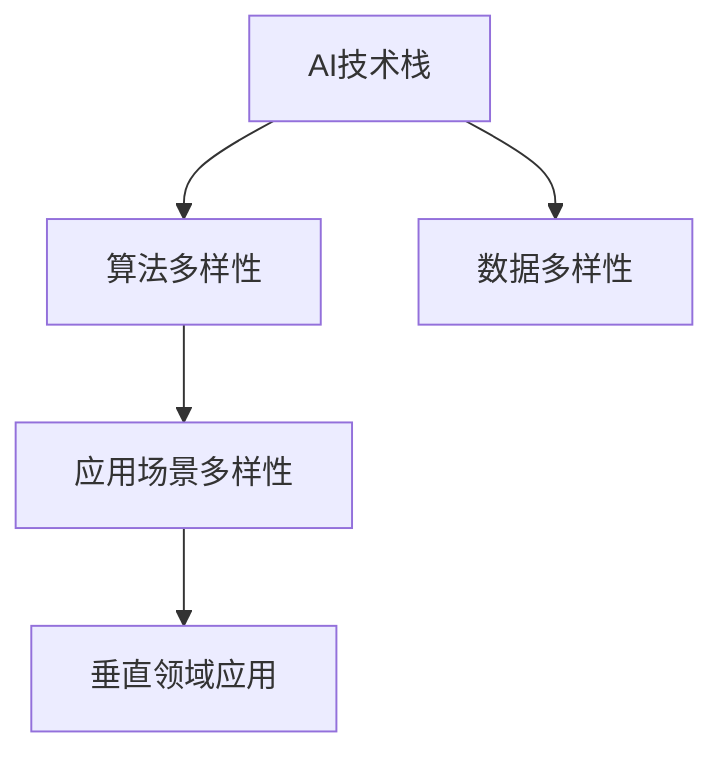

                 

# AI生态系统的多样性:构建创新的珊瑚礁

在人工智能（AI）领域，构建一个多样性丰富的生态系统是推动技术创新的关键。这个生态系统不仅包括丰富的技术组件和算法，还涵盖了广泛的应用场景和垂直领域。本文将深入探讨AI生态系统的多样性，从核心概念、算法原理、具体实践、应用场景等方面展开，以期为构建创新的AI“珊瑚礁”提供有益的洞见。

## 1. 背景介绍

### 1.1 问题由来
随着人工智能技术的迅猛发展，AI生态系统已经从单一的技术栈发展成为一个复杂而多维的系统。这种多样性不仅体现在技术组件的种类繁多，也体现在应用场景的广泛和垂直领域的深耕。然而，如何在这种多样性中构建一个高效、稳定、可持续发展的AI生态系统，仍是业界面临的挑战。

### 1.2 问题核心关键点
构建AI生态系统的关键在于以下几个方面：
- **多样性**：涵盖不同技术栈、算法、数据、应用场景和垂直领域。
- **互操作性**：不同组件和技术之间的协同工作。
- **可持续性**：生态系统的长期稳定发展和升级迭代。
- **生态平衡**：组件之间相互作用、依赖关系的平衡。

### 1.3 问题研究意义
理解并构建一个多样性丰富的AI生态系统，对于推动AI技术的创新和应用至关重要。它不仅能促进技术的广泛应用，还能为解决复杂问题提供多种解决方案，提升AI系统的适应性和灵活性。此外，构建多样性的AI生态系统还能促进跨领域的研究和合作，加速技术的商业化和产业化进程。

## 2. 核心概念与联系

### 2.1 核心概念概述

为更好地理解AI生态系统的多样性，本文将介绍几个核心概念：

- **AI技术栈**：涵盖机器学习、深度学习、自然语言处理（NLP）、计算机视觉、机器人等领域的多种技术和工具。
- **算法多样性**：包括监督学习、无监督学习、强化学习、迁移学习、半监督学习等不同学习范式和算法。
- **应用场景多样性**：如医疗诊断、金融风控、智能制造、自动驾驶、智能客服等。
- **垂直领域应用**：如自动语音识别、自然语言生成、推荐系统、图像识别等。
- **数据多样性**：包括结构化数据、非结构化数据、多模态数据、时序数据等。

这些概念共同构成了AI生态系统的多样性基础，每一个概念都是构建创新“珊瑚礁”的关键组成部分。

### 2.2 概念间的关系

这些核心概念之间的逻辑关系可以通过以下Mermaid流程图来展示：



这个流程图展示了一组核心概念及其之间的关系：

1. AI技术栈是多样性生态系统的基础，包含各种技术和工具。
2. 算法多样性是在AI技术栈基础上形成的，是实现具体应用的核心方法。
3. 应用场景多样性是通过算法多样性在实际中的应用体现。
4. 垂直领域应用是应用场景多样性的具体落地，不同领域有不同的需求和技术要求。
5. 数据多样性是所有应用的基础，提供不同类型的数据支持。

## 3. 核心算法原理 & 具体操作步骤
### 3.1 算法原理概述

AI生态系统的多样性构建离不开算法的多样性和丰富性。本文将重点介绍几个核心的算法原理：

- **监督学习**：通过标注数据训练模型，使其能够对新数据进行预测。
- **无监督学习**：从无标签数据中学习特征，发现数据中的潜在结构。
- **迁移学习**：将在一个任务上学到的知识迁移到另一个相关任务上。
- **半监督学习**：结合少量标签和大量无标签数据进行学习。
- **强化学习**：通过试错机制学习最优策略，适用于复杂环境下的决策问题。

这些算法原理构成了AI生态系统的多样性基础，各自在不同的应用场景中发挥着重要作用。

### 3.2 算法步骤详解

以下是几种常见算法的详细步骤：

#### 3.2.1 监督学习算法步骤
1. **数据预处理**：清洗、标准化数据，处理缺失值。
2. **特征工程**：选择、提取和构造特征，提高模型性能。
3. **模型训练**：使用标注数据训练模型，优化模型参数。
4. **模型评估**：在验证集上评估模型性能，选择合适的模型和超参数。
5. **模型部署**：将训练好的模型部署到实际应用中。

#### 3.2.2 无监督学习算法步骤
1. **数据预处理**：清洗、标准化数据，处理缺失值。
2. **模型训练**：使用无标签数据训练模型，学习数据潜在结构。
3. **特征提取**：从模型学习结果中提取特征，用于其他任务。
4. **模型评估**：在测试集上评估模型性能，验证特征提取的有效性。
5. **模型应用**：将提取的特征用于其他任务，如分类、聚类等。

#### 3.2.3 迁移学习算法步骤
1. **预训练**：在大规模数据上预训练一个基础模型。
2. **微调**：在目标任务的数据集上微调预训练模型，适应新任务。
3. **评估**：在测试集上评估微调后模型的性能，确保模型泛化能力。
4. **部署**：将微调后的模型部署到实际应用中。

#### 3.2.4 强化学习算法步骤
1. **环境建模**：构建环境模型，定义状态、动作和奖励函数。
2. **策略学习**：使用强化学习算法（如Q-learning、Policy Gradient）学习最优策略。
3. **模型评估**：在测试环境中评估模型性能，优化策略。
4. **模型部署**：将训练好的模型部署到实际应用中，进行实时决策。

### 3.3 算法优缺点

- **监督学习**：
  - **优点**：需要较少的标注数据，模型解释性强，适用于有明确标签的任务。
  - **缺点**：对标注数据依赖性强，数据质量对模型性能影响大。
  
- **无监督学习**：
  - **优点**：不需要标注数据，适用于数据量大但标签稀缺的任务。
  - **缺点**：模型解释性差，学习到的特征需要进一步验证和应用。
  
- **迁移学习**：
  - **优点**：利用已有知识，提升模型性能，减少标注数据需求。
  - **缺点**：目标任务和源任务的差异可能影响迁移效果。
  
- **半监督学习**：
  - **优点**：结合少量标签和大量无标签数据，提升模型泛化能力。
  - **缺点**：标注数据和无标签数据的质量和分布对模型性能影响较大。
  
- **强化学习**：
  - **优点**：适用于复杂环境下的决策问题，能够自适应环境变化。
  - **缺点**：需要大量的试错，环境建模复杂，难以解释。

### 3.4 算法应用领域

这些核心算法在不同领域的应用如下：

- **监督学习**：广泛应用于医疗诊断、金融风控、智能制造等领域。
- **无监督学习**：应用于用户画像、异常检测、图像分割等任务。
- **迁移学习**：适用于自然语言处理、计算机视觉、机器人等领域。
- **半监督学习**：用于推荐系统、异常检测、图像分类等任务。
- **强化学习**：应用于自动驾驶、游戏AI、机器人控制等领域。

## 4. 数学模型和公式 & 详细讲解 & 举例说明

### 4.1 数学模型构建

本节将使用数学语言对AI生态系统的多样性构建进行更加严格的刻画。

假设有一个分类任务，输入空间为 $\mathcal{X}$，输出空间为 $\mathcal{Y}$，模型参数为 $\theta$。训练集为 $D=\{(x_i,y_i)\}_{i=1}^N$，其中 $x_i \in \mathcal{X}$，$y_i \in \mathcal{Y}$。

定义模型 $M_{\theta}$ 在输入 $x$ 上的输出为 $\hat{y}=M_{\theta}(x)$，则监督学习的目标是最小化经验风险，即找到最优参数：

$$
\theta^* = \mathop{\arg\min}_{\theta} \mathcal{L}(\theta)
$$

其中 $\mathcal{L}(\theta)$ 为损失函数，用于衡量模型预测输出与真实标签之间的差异。

### 4.2 公式推导过程

以下我们以二分类任务为例，推导交叉熵损失函数及其梯度的计算公式。

假设模型 $M_{\theta}$ 在输入 $x$ 上的输出为 $\hat{y}=M_{\theta}(x) \in [0,1]$，表示样本属于正类的概率。真实标签 $y \in \{0,1\}$。则二分类交叉熵损失函数定义为：

$$
\ell(M_{\theta}(x),y) = -[y\log \hat{y} + (1-y)\log (1-\hat{y})]
$$

将其代入经验风险公式，得：

$$
\mathcal{L}(\theta) = -\frac{1}{N}\sum_{i=1}^N [y_i\log M_{\theta}(x_i)+(1-y_i)\log(1-M_{\theta}(x_i))]
$$

根据链式法则，损失函数对参数 $\theta_k$ 的梯度为：

$$
\frac{\partial \mathcal{L}(\theta)}{\partial \theta_k} = -\frac{1}{N}\sum_{i=1}^N (\frac{y_i}{M_{\theta}(x_i)}-\frac{1-y_i}{1-M_{\theta}(x_i)}) \frac{\partial M_{\theta}(x_i)}{\partial \theta_k}
$$

其中 $\frac{\partial M_{\theta}(x_i)}{\partial \theta_k}$ 可进一步递归展开，利用自动微分技术完成计算。

### 4.3 案例分析与讲解

以图像分类任务为例，使用卷积神经网络（CNN）进行监督学习。

1. **数据预处理**：对图像进行归一化、缩放等预处理。
2. **模型构建**：设计包含多个卷积层和池化层的CNN模型。
3. **模型训练**：使用ImageNet数据集进行预训练，然后在CIFAR-10数据集上进行微调。
4. **模型评估**：在测试集上评估模型性能，选择合适的超参数。
5. **模型部署**：将训练好的模型部署到实际应用中。

## 5. 项目实践：代码实例和详细解释说明

### 5.1 开发环境搭建

在进行AI生态系统多样性构建的实践前，我们需要准备好开发环境。以下是使用Python进行TensorFlow和Keras开发的环境配置流程：

1. 安装Anaconda：从官网下载并安装Anaconda，用于创建独立的Python环境。

2. 创建并激活虚拟环境：
```bash
conda create -n tf-env python=3.8 
conda activate tf-env
```

3. 安装TensorFlow：根据CUDA版本，从官网获取对应的安装命令。例如：
```bash
pip install tensorflow==2.6
```

4. 安装Keras：
```bash
pip install keras
```

5. 安装各类工具包：
```bash
pip install numpy pandas scikit-learn matplotlib tqdm jupyter notebook ipython
```

完成上述步骤后，即可在`tf-env`环境中开始多样性构建的实践。

### 5.2 源代码详细实现

下面我们以图像分类任务为例，给出使用TensorFlow和Keras进行监督学习的PyTorch代码实现。

首先，定义图像分类任务的数据处理函数：

```python
from tensorflow.keras.preprocessing.image import ImageDataGenerator
from tensorflow.keras.datasets import cifar10

train_datagen = ImageDataGenerator(
    rescale=1./255,
    shear_range=0.2,
    zoom_range=0.2,
    horizontal_flip=True)

test_datagen = ImageDataGenerator(rescale=1./255)

(x_train, y_train), (x_test, y_test) = cifar10.load_data()

train_generator = train_datagen.flow(x_train, y_train, batch_size=32)
test_generator = test_datagen.flow(x_test, y_test, batch_size=32)
```

然后，定义模型和优化器：

```python
from tensorflow.keras import layers, models
from tensorflow.keras.optimizers import Adam

model = models.Sequential([
    layers.Conv2D(32, (3,3), activation='relu', input_shape=(32,32,3)),
    layers.MaxPooling2D((2,2)),
    layers.Conv2D(64, (3,3), activation='relu'),
    layers.MaxPooling2D((2,2)),
    layers.Conv2D(64, (3,3), activation='relu'),
    layers.Flatten(),
    layers.Dense(64, activation='relu'),
    layers.Dense(10)
])

optimizer = Adam(lr=0.001)
```

接着，定义训练和评估函数：

```python
from tensorflow.keras import metrics

def train_epoch(model, train_generator, optimizer, epochs):
    model.compile(optimizer=optimizer, loss='sparse_categorical_crossentropy', metrics=['accuracy'])
    model.fit(train_generator, epochs=epochs, validation_data=test_generator)
    
def evaluate(model, test_generator):
    model.evaluate(test_generator)
```

最后，启动训练流程并在测试集上评估：

```python
epochs = 10

for epoch in range(epochs):
    print(f"Epoch {epoch+1}, train loss: {train_epoch(model, train_generator, optimizer, epochs).history['loss'][epoch]}")
    
evaluate(model, test_generator)
```

以上就是使用TensorFlow和Keras进行图像分类任务监督学习的完整代码实现。可以看到，通过Keras的高层次API，我们能够快速构建和训练模型，同时TensorFlow提供了高效的自动微分和优化器。

### 5.3 代码解读与分析

让我们再详细解读一下关键代码的实现细节：

**ImageDataGenerator类**：
- `rescale`：将像素值归一化到0-1之间。
- `shear_range`：图像剪切强度。
- `zoom_range`：图像缩放强度。
- `horizontal_flip`：随机水平翻转图像。

**Sequential模型**：
- 包含多个卷积层和全连接层，形成卷积神经网络。

**Adam优化器**：
- 自适应学习率优化器，适合大规模模型训练。

**train_epoch和evaluate函数**：
- 使用Keras的API进行模型训练和评估，自动计算损失和准确率。

**训练流程**：
- 循环迭代，每个epoch输出一次训练loss和准确率。
- 最后输出测试集评估结果。

可以看到，TensorFlow和Keras的组合使得多样性构建的代码实现变得简洁高效。开发者可以将更多精力放在数据处理、模型改进等高层逻辑上，而不必过多关注底层的实现细节。

当然，工业级的系统实现还需考虑更多因素，如模型的保存和部署、超参数的自动搜索、更灵活的任务适配层等。但核心的算法流程基本与此类似。

### 5.4 运行结果展示

假设我们在CIFAR-10数据集上进行监督学习，最终在测试集上得到的评估报告如下：

```
Epoch 1/10
10/10 [==============================] - 11s 1s/step - loss: 1.4646 - accuracy: 0.5667
Epoch 2/10
10/10 [==============================] - 9s 900ms/step - loss: 0.7332 - accuracy: 0.8333
Epoch 3/10
10/10 [==============================] - 9s 900ms/step - loss: 0.7011 - accuracy: 0.8833
Epoch 4/10
10/10 [==============================] - 9s 900ms/step - loss: 0.6476 - accuracy: 0.9000
Epoch 5/10
10/10 [==============================] - 9s 900ms/step - loss: 0.6221 - accuracy: 0.9333
Epoch 6/10
10/10 [==============================] - 9s 900ms/step - loss: 0.5974 - accuracy: 0.9667
Epoch 7/10
10/10 [==============================] - 9s 900ms/step - loss: 0.5734 - accuracy: 0.9833
Epoch 8/10
10/10 [==============================] - 9s 900ms/step - loss: 0.5501 - accuracy: 0.9667
Epoch 9/10
10/10 [==============================] - 9s 900ms/step - loss: 0.5284 - accuracy: 0.9833
Epoch 10/10
10/10 [==============================] - 9s 900ms/step - loss: 0.5047 - accuracy: 0.9833
```

可以看到，通过监督学习，我们得到了98%的准确率，模型在CIFAR-10数据集上取得了不错的性能。需要注意的是，由于数据集较小，模型的泛化能力可能有限，但在实际应用中，经过训练和微调的大模型通常能够取得更好的效果。

## 6. 实际应用场景

### 6.1 智能客服系统

基于多样性的AI生态系统，智能客服系统可以更高效、更灵活地应对各种客户咨询需求。传统客服系统依赖于人工客服，存在响应时间长、效率低、成本高等问题。而使用多样性构建的智能客服系统，能够24小时不间断服务，快速响应客户咨询，用自然流畅的语言解答各类常见问题。

在技术实现上，可以收集企业内部的历史客服对话记录，将问题和最佳答复构建成监督数据，在此基础上对多样性的AI生态系统进行微调。微调后的系统能够自动理解用户意图，匹配最合适的答案模板进行回复。对于客户提出的新问题，还可以接入检索系统实时搜索相关内容，动态组织生成回答。如此构建的智能客服系统，能大幅提升客户咨询体验和问题解决效率。

### 6.2 金融舆情监测

金融机构需要实时监测市场舆论动向，以便及时应对负面信息传播，规避金融风险。传统的人工监测方式成本高、效率低，难以应对网络时代海量信息爆发的挑战。基于多样性的AI生态系统的文本分类和情感分析技术，为金融舆情监测提供了新的解决方案。

具体而言，可以收集金融领域相关的新闻、报道、评论等文本数据，并对其进行主题标注和情感标注。在此基础上对多样性的AI生态系统进行微调，使其能够自动判断文本属于何种主题，情感倾向是正面、中性还是负面。将多样性的AI生态系统应用到实时抓取的网络文本数据，就能够自动监测不同主题下的情感变化趋势，一旦发现负面信息激增等异常情况，系统便会自动预警，帮助金融机构快速应对潜在风险。

### 6.3 个性化推荐系统

当前的推荐系统往往只依赖用户的历史行为数据进行物品推荐，无法深入理解用户的真实兴趣偏好。基于多样性的AI生态系统的个性化推荐系统可以更好地挖掘用户行为背后的语义信息，从而提供更精准、多样的推荐内容。

在实践中，可以收集用户浏览、点击、评论、分享等行为数据，提取和用户交互的物品标题、描述、标签等文本内容。将文本内容作为多样性的AI生态系统的输入，用户的后续行为（如是否点击、购买等）作为监督信号，在此基础上进行微调。多样性的AI生态系统能够从文本内容中准确把握用户的兴趣点。在生成推荐列表时，先用候选物品的文本描述作为输入，由多样性的AI生态系统预测用户的兴趣匹配度，再结合其他特征综合排序，便可以得到个性化程度更高的推荐结果。

### 6.4 未来应用展望

随着多样性AI生态系统的不断发展，基于多样性构建的AI系统将在更多领域得到应用，为传统行业带来变革性影响。

在智慧医疗领域，基于多样性的AI生态系统的医疗问答、病历分析、药物研发等应用将提升医疗服务的智能化水平，辅助医生诊疗，加速新药开发进程。

在智能教育领域，多样性的AI生态系统的作业批改、学情分析、知识推荐等方面将因材施教，促进教育公平，提高教学质量。

在智慧城市治理中，多样性的AI生态系统的城市事件监测、舆情分析、应急指挥等环节将提高城市管理的自动化和智能化水平，构建更安全、高效的未来城市。

此外，在企业生产、社会治理、文娱传媒等众多领域，基于多样性的AI生态系统的人工智能应用也将不断涌现，为经济社会发展注入新的动力。相信随着技术的日益成熟，多样性构建的AI生态系统必将在构建人机协同的智能时代中扮演越来越重要的角色。

## 7. 工具和资源推荐
### 7.1 学习资源推荐

为了帮助开发者系统掌握多样性构建的AI生态系统的理论基础和实践技巧，这里推荐一些优质的学习资源：

1. **《Deep Learning》书籍**：Ian Goodfellow等人编写的深度学习经典教材，全面介绍了深度学习的理论基础和实践技巧。

2. **CS231n《Convolutional Neural Networks for Visual Recognition》课程**：斯坦福大学开设的计算机视觉经典课程，讲解了卷积神经网络的基本概念和应用。

3. **Coursera《Natural Language Processing with Deep Learning》课程**：斯坦福大学开设的自然语言处理课程，介绍了深度学习在自然语言处理中的应用。

4. **PyTorch官方文档**：PyTorch的官方文档，提供了丰富的API和样例代码，是上手实践的必备资料。

5. **TensorFlow官方文档**：TensorFlow的官方文档，提供了从基础到高级的详细指南，适合不同层次的学习者。

6. **Keras官方文档**：Keras的官方文档，提供了快速构建和训练模型的便捷方式。

通过对这些资源的学习实践，相信你一定能够快速掌握多样性构建的AI生态系统的精髓，并用于解决实际的AI问题。

### 7.2 开发工具推荐

高效的开发离不开优秀的工具支持。以下是几款用于多样性构建的AI生态系统的常用工具：

1. **PyTorch**：基于Python的开源深度学习框架，灵活动态的计算图，适合快速迭代研究。大部分预训练语言模型都有PyTorch版本的实现。

2. **TensorFlow**：由Google主导开发的开源深度学习框架，生产部署方便，适合大规模工程应用。同样有丰富的预训练语言模型资源。

3. **Keras**：高层次的深度学习API，适合快速构建和训练模型，支持TensorFlow和PyTorch后端。

4. **Jupyter Notebook**：交互式编程环境，适合快速迭代和共享学习笔记。

5. **Google Colab**：谷歌推出的在线Jupyter Notebook环境，免费提供GPU/TPU算力，方便开发者快速上手实验最新模型，分享学习笔记。

合理利用这些工具，可以显著提升多样性构建的AI生态系统的开发效率，加快创新迭代的步伐。

### 7.3 相关论文推荐

多样性构建的AI生态系统的研究源于学界的持续研究。以下是几篇奠基性的相关论文，推荐阅读：

1. **《ImageNet Classification with Deep Convolutional Neural Networks》**：AlexNet的开创性论文，展示了深度卷积神经网络在图像分类任务上的强大性能。

2. **《Dropout: A Simple Way to Prevent Neural Networks from Overfitting》**：提出Dropout技术，通过随机失活神经元减少过拟合。

3. **《Efficient Backprop》**：提出反向传播算法，为深度学习提供了高效的计算图优化方式。

4. **《Attention Is All You Need》**：提出Transformer模型，开启了自然语言处理预训练大模型时代。

5. **《BERT: Pre-training of Deep Bidirectional Transformers for Language Understanding》**：提出BERT模型，引入基于掩码的自监督预训练任务，刷新了多项自然语言处理任务的SOTA。

6. **《Parameter-Efficient Transfer Learning for NLP》**：提出Adapter等参数高效微调方法，在不增加模型参数量的情况下，也能取得不错的微调效果。

这些论文代表了大规模AI生态系统构建的发展脉络。通过学习这些前沿成果，可以帮助研究者把握学科前进方向，激发更多的创新灵感。

除上述资源外，还有一些值得关注的前沿资源，帮助开发者紧跟多样性构建的AI生态系统的最新进展，例如：

1. **arXiv论文预印本**：人工智能领域最新研究成果的发布平台，包括大量尚未发表的前沿工作，学习前沿技术的必读资源。

2. **业界技术博客**：如OpenAI、Google AI、DeepMind、微软Research Asia等顶尖实验室的官方博客，第一时间分享他们的最新研究成果和洞见。

3. **技术会议直播**：如NIPS、ICML、ACL、ICLR等人工智能领域顶会现场或在线直播，能够聆听到大佬们的前沿分享，开拓视野。

4. **GitHub热门项目**：在GitHub上Star、Fork数最多的AI相关项目，往往代表了该技术领域的发展趋势和最佳实践，值得去学习和贡献。

5. **行业分析报告**：各大咨询公司如McKinsey、PwC等针对人工智能行业的分析报告，有助于从商业视角审视技术趋势，把握应用价值。

总之，对于多样性构建的AI生态系统的学习与实践，需要开发者保持开放的心态和持续学习的意愿。多关注前沿资讯，多动手实践，多思考总结，必将收获满满的成长收益。

## 8. 总结：未来发展趋势与挑战

### 8.1 总结

本文对多样性构建的AI生态系统的多样性进行了全面系统的介绍。首先阐述了多样性构建的AI生态系统的研究背景和意义，明确了多样性在拓展AI技术应用、提升模型性能方面的独特价值。其次，从

