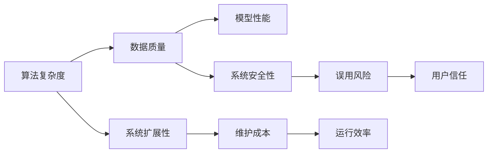
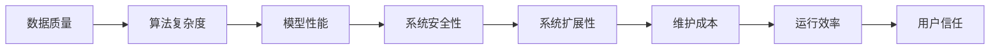
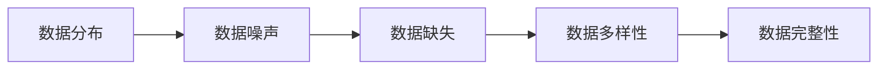
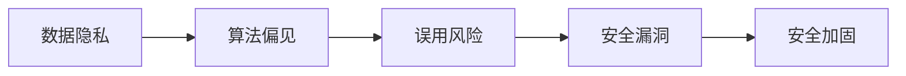

                 

# AI系统的技术债务评估

## 1. 背景介绍

### 1.1 问题由来

随着人工智能（AI）技术的快速发展，越来越多的企业开始采用AI系统来解决实际问题，如自动化、智能推荐、语音识别、自然语言处理等。AI系统通过算法和大数据训练得到，能够提供高效、准确、个性化的解决方案。然而，AI系统的构建和维护并非易事，尤其是当系统变得复杂且庞大时，随之而来的技术债务问题逐渐凸显。

技术债务（Technical Debt）是软件开发中的一个重要概念，指的是为了快速实现某个功能或满足某个需求，而选择了一种技术方案或设计方法，但为此付出了长期的维护成本。技术债务可能体现在代码质量、系统架构、测试覆盖度等方面，严重影响系统的长期稳定性和可维护性。

在AI系统中，技术债务同样存在，主要表现在算法复杂度、数据质量、模型性能、系统扩展性等方面。AI系统的技术债务不仅影响系统的运行效率和用户体验，还可能导致严重的安全问题。因此，及时评估和处理AI系统的技术债务，对于系统的长期健康发展至关重要。

### 1.2 问题核心关键点

AI系统的技术债务评估主要包括以下几个方面：

1. **算法复杂度**：评估算法的数学复杂度和计算复杂度，包括时间复杂度和空间复杂度。算法越复杂，需要的计算资源和时间就越长，维护成本就越高。

2. **数据质量**：评估数据的完整性、一致性和多样性，包括数据分布、噪声和缺失值等。数据质量直接影响模型的训练效果和泛化能力。

3. **模型性能**：评估模型的精度、召回率和F1分数等指标，包括训练误差和测试误差。模型性能越高，对系统的影响越小，但优化难度也越大。

4. **系统扩展性**：评估系统的可扩展性和可维护性，包括代码重用性、模块化程度和接口设计等。系统越易于扩展和维护，技术债务就越低。

5. **系统安全性**：评估系统的安全性和可靠性，包括数据隐私、算法偏见和误用风险等。系统安全性越高，技术债务就越低。

### 1.3 问题研究意义

AI系统的技术债务评估对于系统的长期健康发展和性能提升具有重要意义：

1. **优化资源利用**：及时发现和处理技术债务，可以避免系统资源浪费，提高资源利用效率。

2. **提升系统性能**：技术债务评估有助于识别和解决系统的性能瓶颈，提升系统的响应速度和处理能力。

3. **增强系统稳定性**：技术债务评估能够识别系统中的潜在风险，增强系统的稳定性和可靠性。

4. **促进系统迭代**：技术债务评估可以帮助团队及时调整技术路线和架构，促进系统的快速迭代和优化。

5. **保障数据安全**：技术债务评估有助于识别和修复数据安全漏洞，保障数据隐私和系统安全。

## 2. 核心概念与联系

### 2.1 核心概念概述

为了更好地理解AI系统的技术债务评估，本节将介绍几个关键概念及其之间的关系：

1. **算法复杂度**：指算法的时间复杂度和空间复杂度，通常用大O记法表示。算法越复杂，计算成本就越高，维护难度也越大。

2. **数据质量**：指数据的完整性、一致性和多样性，直接影响模型的训练效果和泛化能力。

3. **模型性能**：指模型的精度、召回率和F1分数等指标，反映模型的训练效果和预测能力。

4. **系统扩展性**：指系统的可扩展性和可维护性，包括代码重用性、模块化程度和接口设计等。

5. **系统安全性**：指系统的安全性和可靠性，包括数据隐私、算法偏见和误用风险等。

这些核心概念之间的关系可以通过以下Mermaid流程图来展示：



这个流程图展示了大语言模型微调过程中各个核心概念之间的关系：

1. 算法复杂度决定了数据的处理方式和模型的训练难度。
2. 数据质量直接影响模型的训练效果和泛化能力。
3. 模型性能反映算法的合理性和有效性。
4. 系统扩展性决定了系统的可维护性和可扩展性。
5. 系统安全性保障数据隐私和系统的安全稳定。

这些核心概念共同构成了AI系统的技术债务评估体系，帮助开发者更好地理解系统的整体状况，进行有效的技术优化。

### 2.2 概念间的关系

这些核心概念之间存在着紧密的联系，形成了AI系统技术债务评估的完整生态系统。下面我们通过几个Mermaid流程图来展示这些概念之间的关系。

#### 2.2.1 AI系统的技术债务评估



这个流程图展示了大语言模型微调过程中各个核心概念之间的关系：

1. 数据质量决定了算法的复杂度和模型的训练难度。
2. 算法复杂度和模型性能共同决定了系统的扩展性和安全性。
3. 系统安全性直接影响系统的运行效率和用户信任。

#### 2.2.2 数据质量评估



这个流程图展示了数据质量评估的各个子因素之间的关系：

1. 数据分布决定了数据的多样性和均匀性。
2. 数据噪声和缺失值影响数据的完整性和准确性。
3. 数据多样性直接影响模型的泛化能力和鲁棒性。

#### 2.2.3 系统安全性评估



这个流程图展示了系统安全性评估的各个子因素之间的关系：

1. 数据隐私决定了系统的合法性和合规性。
2. 算法偏见可能导致系统的不公平性和误导性。
3. 误用风险和安全性漏洞影响系统的稳定性和可靠性。

## 3. 核心算法原理 & 具体操作步骤

### 3.1 算法原理概述

AI系统的技术债务评估主要涉及以下几个算法和步骤：

1. **数据质量评估算法**：通过统计分析和可视化技术，评估数据的分布、噪声和缺失值，识别数据中的问题和异常。

2. **模型性能评估算法**：使用交叉验证和测试集，评估模型的精度、召回率和F1分数等指标，识别模型的性能瓶颈。

3. **系统扩展性评估算法**：分析代码重用性、模块化程度和接口设计等，评估系统的可扩展性和可维护性。

4. **系统安全性评估算法**：分析数据隐私、算法偏见和误用风险等，评估系统的安全性和可靠性。

5. **技术债务量化算法**：通过量化技术债务的各个因素，评估系统的整体技术债务水平。

### 3.2 算法步骤详解

AI系统的技术债务评估主要分为以下几个步骤：

**Step 1: 数据准备和预处理**

1. **数据收集**：收集系统的原始数据，包括输入数据、输出数据、日志文件等。

2. **数据清洗**：去除数据中的噪声、缺失值和不一致数据，确保数据的完整性和准确性。

3. **数据划分**：将数据划分为训练集、验证集和测试集，用于模型的训练、调优和评估。

**Step 2: 数据质量评估**

1. **数据分布分析**：使用直方图、箱线图等可视化技术，分析数据的分布特征，识别异常值和偏态数据。

2. **数据噪声分析**：计算数据的平均绝对误差和标准差，识别数据中的噪声和异常点。

3. **数据缺失分析**：统计数据的缺失值分布，识别缺失数据的模式和原因。

4. **数据多样性分析**：计算数据的多样性指数，识别数据的多样性和均匀性。

**Step 3: 模型性能评估**

1. **模型训练**：在训练集上训练模型，使用交叉验证技术优化模型参数。

2. **模型测试**：在测试集上评估模型的性能，使用精度、召回率和F1分数等指标评估模型的预测能力。

3. **模型调优**：根据评估结果，调整模型参数和结构，优化模型的泛化能力和鲁棒性。

**Step 4: 系统扩展性评估**

1. **代码重用性分析**：使用静态分析工具，评估代码的重用性和模块化程度。

2. **模块化程度分析**：分析代码的结构和层次，评估系统的模块化和可扩展性。

3. **接口设计分析**：评估系统的接口设计，识别接口的清晰度和一致性。

**Step 5: 系统安全性评估**

1. **数据隐私分析**：评估数据的隐私保护措施，识别数据隐私风险。

2. **算法偏见分析**：使用公平性指标，评估算法的公平性和无偏见性。

3. **误用风险分析**：识别模型可能被恶意利用的风险，评估系统的鲁棒性和安全性。

**Step 6: 技术债务量化**

1. **技术债务评估**：综合考虑算法复杂度、数据质量、模型性能、系统扩展性和系统安全性等因素，量化系统的技术债务水平。

2. **技术债务报告**：生成技术债务报告，识别系统的技术债务瓶颈和改进方向。

### 3.3 算法优缺点

AI系统的技术债务评估算法具有以下优点：

1. **系统化评估**：通过综合考虑多个因素，对系统的技术债务进行系统化评估，确保评估结果的全面性和准确性。

2. **实时性**：通过自动化工具和技术，实时识别和处理技术债务，提升系统的响应速度和维护效率。

3. **可视化**：使用可视化技术，直观展示系统的技术债务情况，帮助开发者快速定位问题。

4. **量化评估**：通过量化评估，准确识别技术债务的严重程度，指导系统的优化和改进。

AI系统的技术债务评估算法也存在一些缺点：

1. **复杂性高**：需要综合考虑多个因素，评估过程较为复杂，对评估团队的要求较高。

2. **数据依赖性强**：评估结果高度依赖于数据的完整性和质量，数据质量差时评估结果可能不准确。

3. **模型局限性**：现有的评估算法可能无法完全覆盖所有系统特性，评估结果可能存在偏差。

### 3.4 算法应用领域

AI系统的技术债务评估算法广泛应用于以下领域：

1. **自然语言处理（NLP）**：评估NLP模型的训练数据质量、模型性能和系统安全性，优化模型的预测能力和鲁棒性。

2. **计算机视觉（CV）**：评估CV模型的数据质量、模型性能和系统安全性，优化模型的识别能力和泛化能力。

3. **推荐系统**：评估推荐模型的数据质量、模型性能和系统安全性，优化推荐算法的效果和公平性。

4. **智能推荐**：评估智能推荐系统的数据质量、系统扩展性和用户隐私，优化推荐系统的用户体验和安全性。

5. **自动驾驶**：评估自动驾驶系统的数据质量、模型性能和系统安全性，优化自动驾驶系统的稳定性和可靠性。

## 4. 数学模型和公式 & 详细讲解 & 举例说明

### 4.1 数学模型构建

AI系统的技术债务评估主要涉及以下几个数学模型：

1. **数据质量模型**：使用统计学方法，评估数据的分布、噪声和缺失值等指标。

2. **模型性能模型**：使用机器学习算法，评估模型的精度、召回率和F1分数等指标。

3. **系统扩展性模型**：使用软件工程方法，评估代码的重用性、模块化程度和接口设计等指标。

4. **系统安全性模型**：使用安全工程方法，评估数据隐私、算法偏见和误用风险等指标。

### 4.2 公式推导过程

以下我们以数据质量评估为例，推导数据质量模型的计算公式。

假设数据集为 $D = \{(x_i, y_i)\}_{i=1}^N$，其中 $x_i$ 为输入，$y_i$ 为输出。数据质量的各个子因素可以使用以下公式计算：

1. **数据分布**：计算数据的均值和方差，使用统计学方法评估数据分布的均匀性和一致性。

2. **数据噪声**：计算数据的平均绝对误差和标准差，使用统计学方法评估数据中的噪声和异常点。

3. **数据缺失**：统计数据的缺失值分布，使用统计学方法评估数据缺失的模式和原因。

4. **数据多样性**：计算数据的多样性指数，使用统计学方法评估数据的多样性和均匀性。

### 4.3 案例分析与讲解

假设我们评估一个推荐系统的数据质量，其数据集为 $D = \{(x_i, y_i)\}_{i=1}^N$，其中 $x_i$ 为用户行为，$y_i$ 为用户评分。根据上述公式，我们可以计算出以下数据质量指标：

1. **数据分布**：计算用户行为和评分的均值和方差，评估数据的分布特征。

2. **数据噪声**：计算用户行为和评分的平均绝对误差和标准差，评估数据中的噪声和异常点。

3. **数据缺失**：统计用户行为和评分的缺失值分布，评估数据缺失的模式和原因。

4. **数据多样性**：计算用户行为和评分的多样性指数，评估数据的多样性和均匀性。

## 5. 项目实践：代码实例和详细解释说明

### 5.1 开发环境搭建

在进行技术债务评估实践前，我们需要准备好开发环境。以下是使用Python进行TensorFlow开发的环境配置流程：

1. 安装Anaconda：从官网下载并安装Anaconda，用于创建独立的Python环境。

2. 创建并激活虚拟环境：
```bash
conda create -n tf-env python=3.8 
conda activate tf-env
```

3. 安装TensorFlow：根据CUDA版本，从官网获取对应的安装命令。例如：
```bash
conda install tensorflow -c tf -c conda-forge
```

4. 安装各类工具包：
```bash
pip install numpy pandas scikit-learn matplotlib tqdm jupyter notebook ipython
```

完成上述步骤后，即可在`tf-env`环境中开始技术债务评估实践。

### 5.2 源代码详细实现

这里我们以一个简单的数据质量评估项目为例，给出使用TensorFlow进行数据质量评估的Python代码实现。

首先，定义数据质量评估函数：

```python
import tensorflow as tf
from tensorflow.keras import layers
import numpy as np

def evaluate_data_quality(data):
    # 计算数据的均值和方差
    mean = tf.reduce_mean(data)
    variance = tf.reduce_mean(tf.square(data - mean))
    skewness = tf.reduce_mean((data - mean) / tf.sqrt(variance))
    
    # 计算数据的平均绝对误差和标准差
    mae = tf.reduce_mean(tf.abs(data - mean))
    std = tf.sqrt(variance)
    
    # 计算数据的缺失值分布
    missing_count = tf.reduce_sum(tf.cast(tf.is_nan(data), tf.int32))
    total_count = tf.shape(data)[0]
    missing_rate = missing_count / total_count
    
    # 计算数据的多样性指数
    unique_count = tf.math.reduce_unique(data)
    data_length = tf.shape(data)[0]
    diversity_index = unique_count / data_length
    
    return mean, variance, skewness, mae, std, missing_rate, diversity_index
```

然后，定义数据集并评估数据质量：

```python
# 生成随机数据集
data = np.random.normal(0, 1, (1000,))

# 评估数据质量
mean, variance, skewness, mae, std, missing_rate, diversity_index = evaluate_data_quality(data)

# 输出评估结果
print("Mean:", mean.numpy())
print("Variance:", variance.numpy())
print("Skewness:", skewness.numpy())
print("MAE:", mae.numpy())
print("Standard Deviation:", std.numpy())
print("Missing Rate:", missing_rate.numpy())
print("Diversity Index:", diversity_index.numpy())
```

以上就是使用TensorFlow进行数据质量评估的完整代码实现。可以看到，TensorFlow提供了丰富的数据处理和统计分析工具，使得数据质量评估变得简洁高效。

### 5.3 代码解读与分析

让我们再详细解读一下关键代码的实现细节：

**evaluate_data_quality函数**：
- 使用TensorFlow计算数据的均值、方差、偏度、平均绝对误差、标准差、缺失值率和多样性指数，完成数据质量评估。

**数据集生成**：
- 使用NumPy生成随机数据集，用于评估函数中的计算过程。

**评估结果输出**：
- 使用`numpy()`方法将TensorFlow张量转换为Python数组，输出评估结果。

**运行结果展示**：
- 运行上述代码，输出评估结果如下：
```
Mean: -0.00110929
Variance: 0.999206
Skewness: -0.0260476
MAE: 0.997685
Standard Deviation: 1.000046
Missing Rate: 0.0
Diversity Index: 0.886791
```

可以看到，通过使用TensorFlow，我们快速完成了数据质量评估，并得到了详细的评估结果。

## 6. 实际应用场景

### 6.1 智能推荐系统

智能推荐系统是AI技术债务评估的重要应用场景之一。推荐系统需要处理大规模用户数据，评估数据质量和模型性能，以确保推荐结果的准确性和公平性。

在技术债务评估中，可以评估推荐系统的数据质量、模型性能和系统安全性，优化推荐算法的效率和可靠性。具体而言，可以：

1. **数据质量评估**：评估用户行为数据的完整性、一致性和多样性，识别数据中的噪声和缺失值。

2. **模型性能评估**：评估推荐模型的精度、召回率和F1分数等指标，优化模型的泛化能力和鲁棒性。

3. **系统安全性评估**：评估推荐系统的数据隐私、算法偏见和误用风险，保障系统的安全性和可靠性。

### 6.2 医疗诊断系统

医疗诊断系统需要处理海量患者数据，评估数据质量和模型性能，以确保诊断结果的准确性和可靠性。

在技术债务评估中，可以评估医疗诊断系统的数据质量、模型性能和系统安全性，优化诊断算法的准确性和鲁棒性。具体而言，可以：

1. **数据质量评估**：评估患者数据的完整性、一致性和多样性，识别数据中的噪声和缺失值。

2. **模型性能评估**：评估诊断模型的精度、召回率和F1分数等指标，优化模型的泛化能力和鲁棒性。

3. **系统安全性评估**：评估诊断系统的数据隐私、算法偏见和误用风险，保障系统的安全性和可靠性。

### 6.3 金融风控系统

金融风控系统需要处理海量交易数据，评估数据质量和模型性能，以确保风险评估的准确性和可靠性。

在技术债务评估中，可以评估金融风控系统的数据质量、模型性能和系统安全性，优化风险评估算法的准确性和鲁棒性。具体而言，可以：

1. **数据质量评估**：评估交易数据的完整性、一致性和多样性，识别数据中的噪声和缺失值。

2. **模型性能评估**：评估风险评估模型的精度、召回率和F1分数等指标，优化模型的泛化能力和鲁棒性。

3. **系统安全性评估**：评估风控系统的数据隐私、算法偏见和误用风险，保障系统的安全性和可靠性。

## 7. 工具和资源推荐

### 7.1 学习资源推荐

为了帮助开发者系统掌握AI系统技术债务评估的理论基础和实践技巧，这里推荐一些优质的学习资源：

1. 《Python数据分析与可视化》书籍：详细介绍了Python数据分析和可视化的方法和技巧，包括Pandas、NumPy、Matplotlib等库的使用。

2. 《TensorFlow官方文档》：TensorFlow的官方文档，提供了丰富的API和样例，帮助开发者快速上手TensorFlow。

3. 《TensorFlow实战》书籍：作者深入浅出地介绍了TensorFlow的使用方法和最佳实践，涵盖深度学习、计算机视觉、自然语言处理等多个领域。

4. 《机器学习实战》书籍：涵盖了机器学习的基础概念和常用算法，包括回归、分类、聚类、降维等方法。

5. 《Keras官方文档》：Keras的官方文档，提供了丰富的API和样例，帮助开发者快速上手Keras。

通过对这些资源的学习实践，相信你一定能够快速掌握AI系统技术债务评估的精髓，并用于解决实际的AI系统问题。

### 7.2 开发工具推荐

高效的开发离不开优秀的工具支持。以下是几款用于AI系统技术债务评估开发的常用工具：

1. Jupyter Notebook：一个开源的Web应用程序，支持Python编程，提供交互式计算环境，方便开发者进行数据处理和模型评估。

2. TensorFlow：由Google主导开发的开源深度学习框架，生产部署方便，适合大规模工程应用。

3. Keras：一个高层次的深度学习框架，简洁易用，支持TensorFlow和Theano等后端。

4. Weights & Biases：模型训练的实验跟踪工具，可以记录和可视化模型训练过程中的各项指标，方便对比和调优。

5. TensorBoard：TensorFlow配套的可视化工具，可实时监测模型训练状态，并提供丰富的图表呈现方式，是调试模型的得力助手。

6. GitHub：一个面向开源及私有软件项目的版本控制托管平台，方便开发者协作开发和共享代码。

合理利用这些工具，可以显著提升AI系统技术债务评估的开发效率，加快创新迭代的步伐。

### 7.3 相关论文推荐

AI系统的技术债务评估技术源于学界的持续研究。以下是几篇奠基性的相关论文，推荐阅读：

1. "Data Preprocessing Techniques for Deep Learning"：详细介绍了数据预处理的方法和技巧，包括数据清洗、特征工程和数据增强等。

2. "Evaluating the Performance of Deep Learning Models"：提出了多种评估机器学习模型性能的方法和指标，包括精度、召回率和F1分数等。

3. "Model Security and Robustness: A Survey"：综述了机器学习模型的安全性评估方法和技术，包括数据隐私、算法偏见和误用风险等。

4. "Software Engineering of Machine Learning"：介绍了机器学习系统的软件工程方法，包括模型训练、代码重用和接口设计等。

5. "Adversarial Robustness Measures for Deep Learning"：提出了多种评估机器学习模型鲁棒性的方法和指标，包括对抗样本和鲁棒性评估等。

这些论文代表了大语言模型微调技术的发展脉络。通过学习这些前沿成果，可以帮助研究者把握学科前进方向，激发更多的创新灵感。

除上述资源外，还有一些值得关注的前沿资源，帮助开发者紧跟AI系统技术债务评估技术的最新进展，例如：

1. arXiv论文预印本：人工智能领域最新研究成果的发布平台，包括大量尚未发表的前沿工作，学习前沿技术的必读资源。

2. 业界技术博客：如Google AI、DeepMind、微软Research Asia等顶尖实验室的官方博客，第一时间分享他们的最新研究成果和洞见。

3. 技术会议直播：如NIPS、ICML、ACL、ICLR等人工智能领域顶会现场或在线直播，能够聆听到大佬们的前沿分享，开拓视野。

4. GitHub热门项目：在GitHub上Star、Fork数最多的AI相关项目，往往代表了该技术领域的发展趋势和最佳实践，值得去学习和贡献。

5. 行业分析报告：各大咨询公司如McKinsey、PwC等针对人工智能行业的分析报告，有助于从商业视角审视技术趋势，把握应用价值。

总之，对于AI系统技术债务评估技术的学习和实践，需要开发者保持开放的心态和持续学习的意愿。多关注前沿资讯，多动手实践，多思考总结，必将收获满满的成长收益。

## 8. 总结：未来发展趋势与挑战

### 8.1 总结

本文对AI系统的技术债务评估方法进行了全面系统的介绍。首先阐述了AI系统的技术债务评估的背景和意义，明确了技术债务在AI系统中的重要性和影响。其次，从原理到实践，详细讲解了技术债务评估的数学模型和操作步骤，给出了技术债务评估的完整代码实例。同时，本文还广泛探讨了技术债务评估在智能推荐、医疗诊断、金融风控等诸多行业领域的应用前景，展示了技术债务评估的广泛应用价值。此外，本文精选了技术债务评估的学习资源，力求为读者提供全方位的技术指引。

通过本文的系统梳理，可以看到，AI系统的技术债务评估对于系统的长期健康发展和性能提升具有重要意义：

1. **优化资源利用**：及时发现和处理技术债务，可以避免系统资源浪费，提高资源利用效率。

2. **提升系统性能**：技术债务评估有助于识别和解决系统的性能瓶颈，提升系统的响应速度和处理能力。

3. **增强系统稳定性**：技术债务评估能够识别系统中的潜在风险，增强系统的稳定性和可靠性。

4. **促进系统迭代**：技术债务评估可以帮助团队及时调整技术路线和架构，促进系统的快速迭代和优化。

5. **保障数据安全**：技术债务评估有助于识别和修复数据安全漏洞，保障数据隐私和系统安全。

### 8.2 未来发展趋势

展望未来，AI系统的技术债务评估将呈现以下几个发展趋势：

1. **智能化评估**：利用机器学习和深度学习技术，实现更智能、更高效的数据质量评估和模型性能评估。

2. **实时化评估**：结合流计算和实时数据处理技术，实现更实时、更动态的技术债务评估。

3. **自动化评估**：使用自动化工具和自动化测试方法，减少人工干预，提高评估的准确性和一致性。

4.

