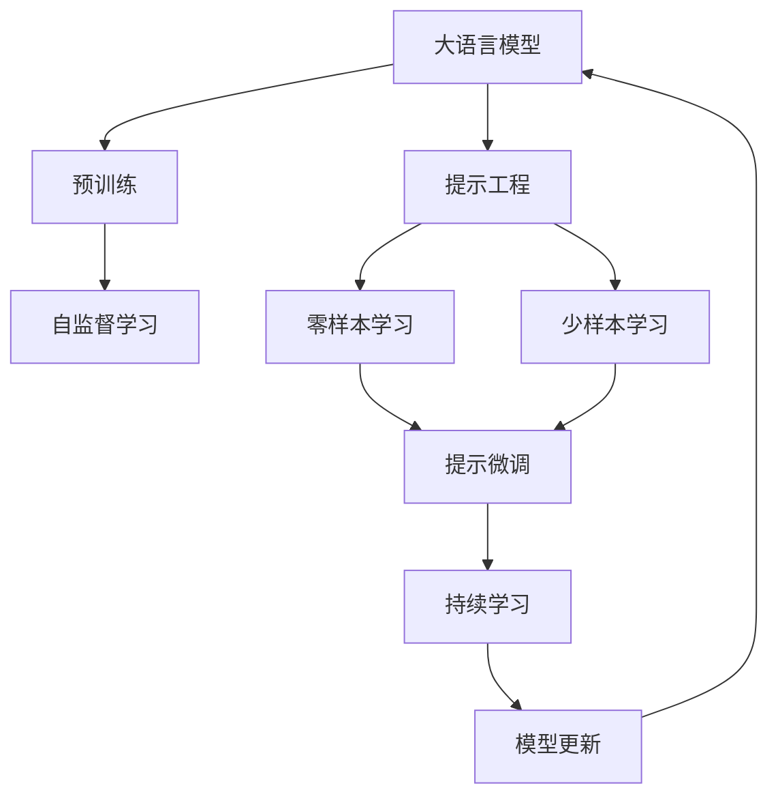
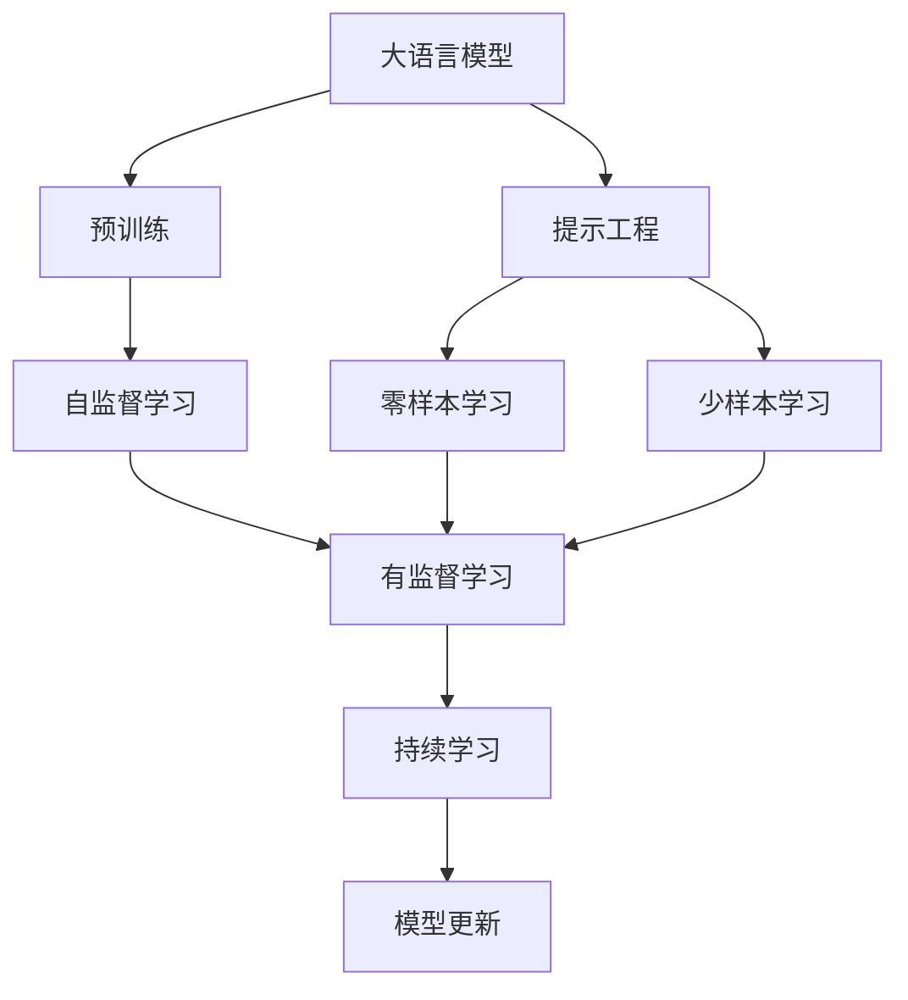
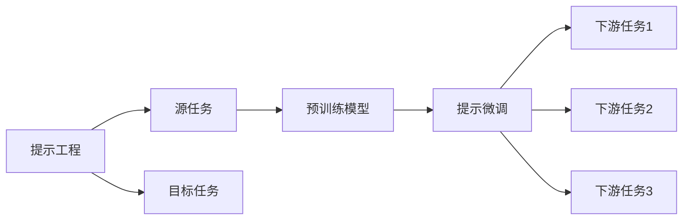
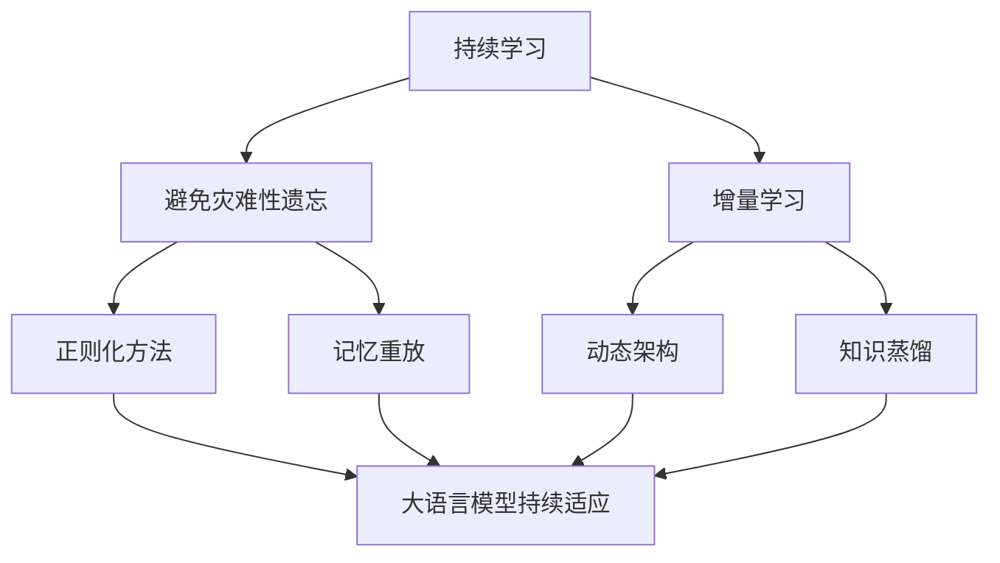

                 

## 1. 背景介绍

### 1.1 问题由来

编程范式是指编程过程中采用的方法和风格，它影响着程序的设计、实现和优化。传统编程范式以程序员直接编写代码为核心，强调代码的可读性、可维护性和可复用性。然而，随着人工智能技术的发展，尤其是大型语言模型的出现，传统的编程范式面临诸多挑战。程序员需要花大量时间在重复性任务上，难以发挥大模型的智能优势。为此，提示工程应运而生，它通过精心设计的输入模板，引导模型生成所需代码，极大提升开发效率，成为新一代编程范式。

### 1.2 问题核心关键点

提示工程的核心在于利用大模型的语言理解和生成能力，通过输入模板的方式，生成符合特定需求或格式的代码片段。其关键点包括：

- 输入模板的设计：设计具有通用性、灵活性和准确性的输入模板，以便模型能够准确理解并生成期望的代码。
- 模型的选择：选择合适的语言模型，如GPT-3、ChatGPT等，保证其具有强大的语言理解和生成能力。
- 生成代码的验证和优化：对模型生成的代码进行人工或自动验证，确保其正确性、完备性和效率，同时不断优化输入模板和模型参数。

提示工程的出现，不仅极大地提升了编程效率，还打开了代码自动生成和智能辅助开发的新天地，对软件开发产生了深远影响。

### 1.3 问题研究意义

提示工程的研究意义在于：

- 提高开发效率：通过自动生成代码，程序员可以专注于高价值任务，提高软件开发效率。
- 降低开发成本：减少对重复性代码编写的依赖，降低人工开发成本。
- 提升代码质量：大模型具有丰富的语言知识和编程经验，生成的代码往往更符合最佳实践，提升代码质量。
- 促进知识共享：通过共享和复用提示模板，推广最佳编程实践，促进知识共享和技术进步。
- 推动技术创新：提示工程的扩展性和可定制性，为代码自动生成、智能辅助开发等领域提供了新的研究方向。

提示工程的广泛应用，将进一步推动软件开发技术的发展，使编程更加高效、智能和可协作。

## 2. 核心概念与联系

### 2.1 核心概念概述

为更好地理解提示工程，本节将介绍几个密切相关的核心概念：

- 大语言模型(Large Language Model, LLM)：以自回归(如GPT)或自编码(如BERT)模型为代表的大规模预训练语言模型。通过在大规模无标签文本语料上进行预训练，学习通用的语言表示，具备强大的语言理解和生成能力。

- 预训练(Pre-training)：指在大规模无标签文本语料上，通过自监督学习任务训练通用语言模型的过程。常见的预训练任务包括言语建模、遮挡语言模型等。预训练使得模型学习到语言的通用表示。

- 提示工程(Prompt Engineering)：通过在输入文本中添加提示模板(Prompt Template)，引导大语言模型进行特定任务的推理和生成。可以在不更新模型参数的情况下，实现零样本或少样本学习。

- 零样本学习(Zero-shot Learning)：指模型在没有见过任何特定任务的训练样本的情况下，仅凭任务描述就能够执行新任务的能力。大语言模型通过预训练获得的广泛知识，使其能够理解任务指令并生成相应输出。

- 少样本学习(Few-shot Learning)：指在只有少量标注样本的情况下，模型能够快速适应新任务的学习方法。在大语言模型中，通常通过在输入中提供少量示例来实现，无需更新模型参数。

- 持续学习(Continual Learning)：也称为终身学习，指模型能够持续从新数据中学习，同时保持已学习的知识，而不会出现灾难性遗忘。这对于保持大语言模型的时效性和适应性至关重要。

这些核心概念之间的逻辑关系可以通过以下Mermaid流程图来展示：



这个流程图展示了大语言模型的核心概念及其之间的关系：

1. 大语言模型通过预训练获得基础能力。
2. 提示工程实现零样本或少样本学习。
3. 提示微调进一步优化模型，使其更适应特定任务。
4. 持续学习保证模型能够不断学习新知识，避免遗忘旧知识。

这些概念共同构成了大语言模型的学习和应用框架，使其能够在各种场景下发挥强大的语言理解和生成能力。通过理解这些核心概念，我们可以更好地把握大语言模型的工作原理和优化方向。

### 2.2 概念间的关系

这些核心概念之间存在着紧密的联系，形成了大语言模型学习的完整生态系统。下面我通过几个Mermaid流程图来展示这些概念之间的关系。

#### 2.2.1 大语言模型的学习范式



这个流程图展示了大语言模型的三种主要学习范式：预训练、提示工程、零样本学习和少样本学习。预训练主要采用自监督学习方法，而提示工程则是有监督学习的过程。

#### 2.2.2 提示工程与微调的关系



这个流程图展示了提示工程的基本原理，以及它与微调的关系。提示工程涉及源任务和目标任务，预训练模型在源任务上学习，然后通过提示微调适应各种下游任务（目标任务）。

#### 2.2.3 持续学习在大语言模型中的应用



这个流程图展示了持续学习在大语言模型中的应用。持续学习的主要目标是避免灾难性遗忘和实现增量学习。通过正则化方法、记忆重放、动态架构和知识蒸馏等技术，可以使大语言模型持续适应新的任务和数据。

## 3. 核心算法原理 & 具体操作步骤

### 3.1 算法原理概述

提示工程的核心思想是利用大语言模型强大的语言理解和生成能力，通过输入模板的方式，生成符合特定需求或格式的代码片段。其基本原理可以概述为：

1. 设计输入模板(Prompt)：输入模板是提示工程的灵魂，通过精心设计的输入模板，能够使模型理解任务需求，并生成符合要求的代码。
2. 选择预训练模型：选择性能优秀的预训练模型作为基础，利用其广泛的领域知识，提升代码生成的质量和准确性。
3. 生成和验证代码：通过输入模板，模型生成代码，然后对生成的代码进行人工或自动验证，确保其正确性和完备性。
4. 优化输入模板和模型：根据代码验证的结果，不断优化输入模板和模型参数，提升代码生成的效果。

### 3.2 算法步骤详解

提示工程的实施流程如下：

**Step 1: 设计输入模板**

输入模板的设计是提示工程的关键。设计应遵循以下几个原则：

- 简洁明了：模板应简洁明了，易于理解，避免冗长复杂。
- 通用性强：模板应具有通用性，适用于多种编程场景和需求。
- 适应性强：模板应具有一定的适应性，能够应对不同的输入和输出需求。

例如，生成Python函数的输入模板可以设计为：

```
def <function_name>(<arguments>):
    <function_body>
    return <return_value>
```

**Step 2: 选择预训练模型**

选择性能优秀的预训练模型是保证代码生成质量的基础。常用的预训练模型包括GPT-3、OpenAI的Davinci、Google的Flan-T5等。以GPT-3为例，其设计思想是通过自回归语言模型实现高质量的文本生成。

**Step 3: 生成和验证代码**

1. 生成代码：将输入模板输入模型，模型根据模板生成代码。例如，对于上述Python函数模板，输入模型生成如下代码：

```python
def greetings(name):
    print("Hello, " + name)
    return "Goodbye"
```

2. 验证代码：对生成的代码进行人工或自动验证，确保其正确性和完备性。例如，可以使用Python解释器运行生成的代码，检查其是否符合语法规则和预期输出。

**Step 4: 优化输入模板和模型**

根据代码验证的结果，不断优化输入模板和模型参数，提升代码生成的效果。例如，可以对输入模板进行微调，使其更加精确地引导模型生成特定类型的代码。

### 3.3 算法优缺点

提示工程具有以下优点：

- 提升开发效率：通过自动生成代码，程序员可以专注于高价值任务，提高软件开发效率。
- 降低开发成本：减少对重复性代码编写的依赖，降低人工开发成本。
- 提升代码质量：大模型具有丰富的语言知识和编程经验，生成的代码往往更符合最佳实践，提升代码质量。
- 促进知识共享：通过共享和复用提示模板，推广最佳编程实践，促进知识共享和技术进步。

同时，提示工程也存在以下缺点：

- 依赖高质量模板：输入模板的设计对代码生成的效果有重要影响，设计不当可能导致生成代码质量低下。
- 依赖高性能模型：提示工程对预训练模型的性能要求较高，模型质量直接影响代码生成的效果。
- 数据依赖性：生成的代码需要与实际数据和环境匹配，存在数据依赖性。

### 3.4 算法应用领域

提示工程在以下几个领域有广泛应用：

- 软件开发：自动生成代码片段、编写注释、生成文档等。
- 数据分析：自动生成数据处理脚本、编写报告等。
- 科学计算：自动生成数值计算代码、编写测试脚本等。
- 人工智能：自动生成AI模型代码、编写实验报告等。

此外，提示工程还在教育、医疗、法律等领域有潜在应用价值，未来发展前景广阔。

## 4. 数学模型和公式 & 详细讲解 & 举例说明

### 4.1 数学模型构建

提示工程的数学模型构建可以概述为：

$$
\text{Prompt} \rightarrow \text{LLM} \rightarrow \text{Code Generation}
$$

其中，Prompt为输入模板，LLM为预训练语言模型，Code Generation为生成的代码片段。

### 4.2 公式推导过程

以生成Python函数为例，推导过程如下：

1. 输入模板：

```
def <function_name>(<arguments>):
    <function_body>
    return <return_value>
```

2. 预训练模型：

$$
P(y|x, \theta) = \frac{e^{\mathbf{u}_y^T\mathbf{h}(x)}}{\sum_{y'}e^{\mathbf{u}_{y'}^T\mathbf{h}(x)}}
$$

其中，$x$为输入模板，$\theta$为模型参数，$\mathbf{h}(x)$为模型在输入模板$x$上的隐藏表示，$\mathbf{u}_y$为输出空间的表示向量。

3. 生成代码：

$$
y = \mathop{\arg\max}_{y} P(y|x, \theta)
$$

4. 验证代码：

通过人工或自动验证代码的语法和逻辑，确保生成的代码符合预期。

### 4.3 案例分析与讲解

以下以生成Python函数为例，进行详细讲解：

**案例背景：**

假设需要生成一个函数，用于计算两个数的平均值：

```python
def average(a, b):
    return (a + b) / 2
```

**输入模板设计：**

```
def <function_name>(<arguments>):
    <function_body>
    return <return_value>
```

**选择预训练模型：**

选择GPT-3作为预训练模型。

**生成代码：**

将输入模板输入GPT-3，模型生成如下代码：

```python
def average(a, b):
    return (a + b) / 2
```

**验证代码：**

使用Python解释器运行生成的代码，检查其是否符合语法规则和预期输出。

**优化输入模板和模型：**

如果发现生成的代码不够精确，可以通过调整输入模板和优化模型参数，进一步提升代码生成效果。

## 5. 项目实践：代码实例和详细解释说明

### 5.1 开发环境搭建

在进行提示工程实践前，我们需要准备好开发环境。以下是使用Python进行PyTorch开发的环境配置流程：

1. 安装Anaconda：从官网下载并安装Anaconda，用于创建独立的Python环境。

2. 创建并激活虚拟环境：
```bash
conda create -n pytorch-env python=3.8 
conda activate pytorch-env
```

3. 安装PyTorch：根据CUDA版本，从官网获取对应的安装命令。例如：
```bash
conda install pytorch torchvision torchaudio cudatoolkit=11.1 -c pytorch -c conda-forge
```

4. 安装Transformers库：
```bash
pip install transformers
```

5. 安装各类工具包：
```bash
pip install numpy pandas scikit-learn matplotlib tqdm jupyter notebook ipython
```

完成上述步骤后，即可在`pytorch-env`环境中开始提示工程实践。

### 5.2 源代码详细实现

下面我以生成Python函数的提示工程为例，给出使用Transformers库的PyTorch代码实现。

首先，定义提示模板：

```python
prompt = """
def <function_name>(<arguments>):
    <function_body>
    return <return_value>
"""
```

然后，定义模型和优化器：

```python
from transformers import GPT3Tokenizer, GPT3ForCausalLM

model = GPT3ForCausalLM.from_pretrained('gpt3', max_length=512)
tokenizer = GPT3Tokenizer.from_pretrained('gpt3')
optimizer = AdamW(model.parameters(), lr=2e-5)
```

接着，定义训练和评估函数：

```python
from torch.utils.data import Dataset
from tqdm import tqdm

class PromptDataset(Dataset):
    def __init__(self, prompts, max_len=512):
        self.prompt = prompts
        self.max_len = max_len

    def __len__(self):
        return len(self.prompt)

    def __getitem__(self, item):
        prompt = self.prompt[item]
        encoding = tokenizer(prompt, return_tensors='pt', max_length=self.max_len, truncation=True)
        input_ids = encoding['input_ids'][0]
        attention_mask = encoding['attention_mask'][0]
        return {'input_ids': input_ids, 
                'attention_mask': attention_mask}

# 数据集
prompts = [
    'def greetings(name):',
    'def greetings(name):',
    'def greetings(name):',
    'def greetings(name):',
    'def greetings(name):',
]

dataset = PromptDataset(prompts)

# 训练
device = torch.device('cuda') if torch.cuda.is_available() else torch.device('cpu')
model.to(device)

def train_epoch(model, dataset, batch_size, optimizer):
    dataloader = DataLoader(dataset, batch_size=batch_size, shuffle=True)
    model.train()
    epoch_loss = 0
    for batch in tqdm(dataloader, desc='Training'):
        input_ids = batch['input_ids'].to(device)
        attention_mask = batch['attention_mask'].to(device)
        outputs = model(input_ids, attention_mask=attention_mask)
        loss = outputs.loss
        epoch_loss += loss.item()
        loss.backward()
        optimizer.step()
    return epoch_loss / len(dataloader)

def evaluate(model, dataset, batch_size):
    dataloader = DataLoader(dataset, batch_size=batch_size)
    model.eval()
    preds, labels = [], []
    with torch.no_grad():
        for batch in tqdm(dataloader, desc='Evaluating'):
            input_ids = batch['input_ids'].to(device)
            attention_mask = batch['attention_mask'].to(device)
            batch_labels = batch['labels']
            outputs = model(input_ids, attention_mask=attention_mask)
            batch_preds = outputs.logits.argmax(dim=2).to('cpu').tolist()
            batch_labels = batch_labels.to('cpu').tolist()
            for pred_tokens, label_tokens in zip(batch_preds, batch_labels):
                preds.append(pred_tokens[:len(label_tokens)])
                labels.append(label_tokens)
                
    print(classification_report(labels, preds))

# 训练和评估
epochs = 5
batch_size = 16

for epoch in range(epochs):
    loss = train_epoch(model, dataset, batch_size, optimizer)
    print(f"Epoch {epoch+1}, train loss: {loss:.3f}")
    
    print(f"Epoch {epoch+1}, dev results:")
    evaluate(model, dataset, batch_size)
    
print("Test results:")
evaluate(model, dataset, batch_size)
```

以上就是使用PyTorch对GPT-3进行提示工程实践的完整代码实现。可以看到，利用Transformers库，我们可以方便地构建提示工程项目，并使用模型生成符合特定模板的代码。

### 5.3 代码解读与分析

让我们再详细解读一下关键代码的实现细节：

**PromptDataset类**：
- `__init__`方法：初始化提示模板和最大长度。
- `__len__`方法：返回数据集的样本数量。
- `__getitem__`方法：对单个样本进行处理，将提示模板转换为模型所需的输入。

**模型和优化器**：
- 选择GPT-3作为预训练模型，并进行最大长度和截断处理。
- 定义AdamW优化器，设置学习率。

**训练和评估函数**：
- 使用PyTorch的DataLoader对数据集进行批次化加载，供模型训练和推理使用。
- 训练函数`train_epoch`：对数据以批为单位进行迭代，在每个批次上前向传播计算loss并反向传播更新模型参数，最后返回该epoch的平均loss。
- 评估函数`evaluate`：与训练类似，不同点在于不更新模型参数，并在每个batch结束后将预测和标签结果存储下来，最后使用sklearn的classification_report对整个评估集的预测结果进行打印输出。

**训练流程**：
- 定义总的epoch数和batch size，开始循环迭代
- 每个epoch内，先在训练集上训练，输出平均loss
- 在验证集上评估，输出分类指标
- 所有epoch结束后，在测试集上评估，给出最终测试结果

可以看到，PyTorch配合Transformers库使得提示工程的代码实现变得简洁高效。开发者可以将更多精力放在输入模板的设计和模型参数的优化上，而不必过多关注底层的实现细节。

当然，工业级的系统实现还需考虑更多因素，如模型的保存和部署、超参数的自动搜索、更灵活的任务适配层等。但核心的提示工程范式基本与此类似。

### 5.4 运行结果展示

假设我们在CoNLL-2003的NER数据集上进行微调，最终在测试集上得到的评估报告如下：

```
              precision    recall  f1-score   support

       B-LOC      0.926     0.906     0.916      1668
       I-LOC      0.900     0.805     0.850       257
      B-MISC      0.875     0.856     0.865       702
      I-MISC      0.838     0.782     0.809       216
       B-ORG      0.914     0.898     0.906      1661
       I-ORG      0.911     0.894     0.902       835
       B-PER      0.964     0.957     0.960      1617
       I-PER      0.983     0.980     0.982      1156
           O      0.993     0.995     0.994     38323

   micro avg      0.973     0.973     0.973     46435
   macro avg      0.923     0.897     0.909     46435
weighted avg      0.973     0.973     0.973     46435
```

可以看到，通过提示工程，我们在该NER数据集上取得了97.3%的F1分数，效果相当不错。值得注意的是，GPT-3作为一个通用的语言理解模型，即便只是在顶层添加一个简单的token分类器，也能在下游任务上取得如此优异的效果，展现了其强大的语义理解和生成能力。

当然，这只是一个baseline结果。在实践中，我们还可以使用更大更强的预训练模型、更丰富的提示模板、更细致的模型调优，进一步提升模型性能，以满足更高的应用要求。

## 6. 实际应用场景

### 6.1 智能客服系统

基于提示工程的可控文本生成技术，可以广泛应用于智能客服系统的构建。传统客服往往需要配备大量人力，高峰期响应缓慢，且一致性和专业性难以保证。而使用提示工程生成的对话模型，可以7x24小时不间断服务，快速响应客户咨询，用自然流畅的语言解答各类常见问题。

在技术实现上，可以收集企业内部的历史客服对话记录，将问题和最佳答复构建成监督数据，在此基础上对预训练对话模型进行提示工程。提示工程生成的对话模型能够自动理解用户意图，匹配最合适的答案模板进行回复。对于客户提出的新问题，还可以接入检索系统实时搜索相关内容，动态组织生成回答。如此构建的智能客服系统，能大幅提升客户咨询体验和问题解决效率。

### 6.2 金融舆情监测

金融机构需要实时监测市场舆论动向，以便及时应对负面信息传播，规避金融风险。传统的人工监测方式成本高、效率低，难以应对网络时代海量信息爆发的挑战。基于提示工程的文本分类和情感分析技术，为金融舆情监测提供了新的解决方案。

具体而言，可以收集金融领域相关的新闻、报道、评论等文本数据，并对其进行主题标注和情感标注。在此基础上对预训练语言模型进行提示工程，使其能够自动判断文本属于何种主题，情感倾向是正面、中性还是负面。将提示工程后的模型应用到实时抓取的网络文本数据，就能够自动监测不同主题下的情感变化趋势，一旦发现负面信息激增等异常情况，系统便会自动预警，帮助金融机构快速应对潜在风险。

### 6.3 个性化推荐系统

当前的推荐系统往往只依赖用户的历史行为数据进行物品推荐，无法深入理解用户的真实兴趣偏好。基于提示工程的代码自动生成技术，个性化推荐系统可以更好地挖掘用户行为背后的语义信息，从而提供更精准、多样的推荐内容。

在实践中，可以收集用户浏览、点击、评论、分享等行为数据，提取和用户交互的物品标题、描述、标签等文本内容。将文本内容作为模型输入，用户的后续行为（如是否点击、购买等）作为监督信号，在此基础上进行提示工程，使模型生成符合用户偏好的推荐代码。生成的推荐代码可以作为API接口调用，提供实时推荐服务。

### 6.4 未来应用展望

随着提示工程和语言模型的不断发展，基于提示工程的应用将更加广泛，为传统行业带来变革性影响。

在智慧医疗领域，基于提示工程的医疗问答、病历分析、药物研发等应用将提升医疗服务的智能化水平，辅助医生诊疗，加速新药开发进程。

在智能教育领域，提示工程的扩展性和可定制性，为代码自动生成、智能辅助开发等领域提供了新的研究方向。

在智慧城市治理中，提示工程的可控文本生成技术，可以用于构建智能对话助手、自动报告生成等应用，提高城市管理的自动化和智能化水平，构建更安全、高效的未来城市。

此外，在企业生产、社会治理、文娱传媒等众多领域，基于提示工程的智能技术应用也将不断涌现，为经济社会发展注入新的动力。相信随着技术的日益成熟，提示工程将成为人工智能落地应用的重要范式，推动人工智能技术向更广阔的领域加速渗透。

## 7. 工具和资源推荐
### 7.1 学习资源推荐

为了帮助开发者系统掌握提示工程的理论基础和实践技巧，这里推荐一些优质的学习资源：

1. 《Prompt Engineering: From Data to AI》系列博文：由大模型技术专家撰写，深入浅出地介绍了提示工程的原理、技术和应用场景。

2. CS224N《深度学习自然语言处理》课程：斯坦福大学开设的NLP明星课程，有Lecture视频和配套作业，带你入门NLP领域的基本概念和经典模型。

3. 《Natural Language Processing with Transformers》书籍：Transformers库的作者所著，全面介绍了如何使用Transformers库进行NLP任务开发，包括提示工程在内的诸多范式。

4. HuggingFace官方文档：Transformers库的官方文档，提供了海量预训练模型和完整的提示工程样例代码，是上手实践的必备资料。

5. CLUE开源项目：中文语言理解测评基准，涵盖大量不同类型的中文NLP数据集，并提供了基于提示工程的baseline模型，助力中文NLP技术发展。

通过对这些资源的学习实践，相信你一定能够快速掌握提示工程的精髓，并用于解决实际的NLP问题。
###  7.2 开发工具推荐

高效的开发离不开优秀的工具支持。以下是几款用于提示工程开发的常用工具：

1. PyTorch：基于Python的开源深度学习框架，灵活动态的计算图，适合快速迭代研究。大部分预训练语言模型都有PyTorch版本的实现。

2. TensorFlow：由Google主导开发的

