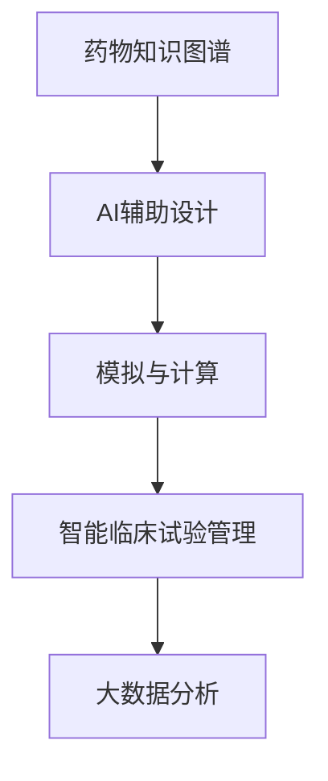

                 

# AI辅助新型给药系统设计

> 关键词：新型给药系统,人工智能(AI),AI辅助设计,药物研发,智能医疗

## 1. 背景介绍

### 1.1 问题由来

现代医药行业在药物研发和临床试验过程中面临诸多挑战。传统的药物研发流程耗时长、成本高，难以适应快速变化的生物医学和技术环境。特别是新药的设计与筛选、临床试验的推进与监测，都需要依赖大量的临床数据和专家知识。人工智能（AI）技术的引入，为新型给药系统的设计提供了新的思路和可能性。

AI辅助新型给药系统的设计与实施，不仅能够显著缩短药物研发周期，降低研发成本，还能够提升药物的临床有效性与安全可靠性。通过数据分析、模拟预测和自动化控制等手段，AI能够辅助药物的分子设计、作用机理研究和临床实验，从而提升药物研发的全流程效率。

### 1.2 问题核心关键点

AI辅助新型给药系统的核心在于如何有效整合AI技术与医药领域的知识，结合大数据分析与模拟计算，进行科学合理的药物设计和筛选。

在具体实施上，需要解决以下几个关键问题：
1. 如何构建全面的药物知识图谱，有效整合海量医学数据和文献信息？
2. 如何运用AI算法进行药物分子的设计、作用机理预测和药物筛选？
3. 如何实现药物临床试验的智能化管理与监测，提升试验效率与质量？

### 1.3 问题研究意义

构建AI辅助的新型给药系统，对提升药物研发效率、降低研发成本、提高药物安全性与临床有效性具有重要意义：

1. **缩短研发周期**：AI辅助设计能够快速筛选有潜力的药物分子，加速药物研发过程，缩短上市时间。
2. **降低研发成本**：通过自动化、智能化手段，减少人工干预和无效实验，大幅降低研发过程中的资源消耗。
3. **提升临床有效性**：AI技术能够优化药物分子设计，增强药物作用机理的理解，提升临床试验的成功率和药物的疗效。
4. **保障药物安全**：AI技术可以预测药物可能的不良反应和相互作用，有效减少临床试验中的意外伤害。
5. **提升研发质量**：AI辅助的智能系统能够提供科学合理的建议和预警，提升整个研发流程的可靠性和科学性。

## 2. 核心概念与联系

### 2.1 核心概念概述

构建AI辅助新型给药系统，需要整合多个领域的核心概念，包括：

- **药物知识图谱**：将药物相关的知识、数据和信息结构化，构建成图谱形式，便于检索和关联。
- **AI辅助设计**：利用AI算法对药物分子进行设计、模拟和预测，辅助药物筛选和优化。
- **模拟与计算**：运用计算机模拟技术，对药物的分子结构、作用机理、动力学等进行预测和分析。
- **智能临床试验管理**：利用AI技术对临床试验进行智能化管理，提升试验效率和数据质量。
- **大数据分析**：整合海量医学数据和文献信息，通过数据挖掘和机器学习技术，提取有价值的信息和知识。

### 2.2 概念间的关系

这些核心概念之间的关系可以通过以下Mermaid流程图来展示：



这个流程图展示了大规模药物知识图谱的构建与AI辅助设计的有机结合，通过模拟与计算技术提升药物设计的科学性，再通过大数据分析技术优化药物筛选，最后通过智能临床试验管理提升整个研发流程的效率和质量。

## 3. 核心算法原理 & 具体操作步骤

### 3.1 算法原理概述

构建AI辅助新型给药系统，主要包括以下几个关键步骤：

1. **构建药物知识图谱**：从已有的生物医学数据、文献和临床试验数据中，提取药物相关的实体、属性和关系，构建药物知识图谱。
2. **AI辅助分子设计**：运用AI算法对药物分子进行结构设计和优化，辅助药物筛选。
3. **模拟与计算预测**：利用计算机模拟技术，预测药物的分子结构和作用机理，提升药物设计的科学性。
4. **大数据分析辅助**：通过机器学习算法，对海量医学数据进行分析，提取药物设计的关键特征和规律。
5. **智能临床试验管理**：运用AI技术对临床试验进行智能化管理和监测，提升试验效率和数据质量。

### 3.2 算法步骤详解

#### 3.2.1 构建药物知识图谱

药物知识图谱的构建需要经过以下几个步骤：

1. **数据收集**：从生物医学数据库、文献库、临床试验数据集中，收集与药物相关的实体（如分子、基因、蛋白质等）、属性（如化学结构、生物活性、副作用等）和关系（如相互作用、代谢途径等）。
2. **数据预处理**：清洗、归一化数据，去除噪声和冗余信息。
3. **知识提取**：运用自然语言处理（NLP）和知识图谱构建工具，从文本中提取药物相关的实体、属性和关系，构建成图谱形式。
4. **知识融合**：将不同来源的知识进行融合，形成统一的药物知识图谱，便于后续的检索和应用。

#### 3.2.2 AI辅助分子设计

AI辅助分子设计主要包括以下步骤：

1. **分子表示**：将药物分子表示成计算机可处理的向量形式。
2. **分子筛选**：使用AI算法（如深度学习、生成对抗网络等）对药物分子进行筛选，筛选出具有潜在药效的分子。
3. **分子优化**：利用AI算法对筛选出的分子进行优化，提升其生物活性和安全性。
4. **药物筛选**：通过实验验证，筛选出具有临床应用潜力的药物分子。

#### 3.2.3 模拟与计算预测

模拟与计算预测主要包括以下步骤：

1. **分子建模**：使用分子动力学模拟等技术，对药物分子进行建模，预测其结构和功能。
2. **作用机理预测**：利用计算化学和生物信息学技术，预测药物的作用机理和生物学效应。
3. **动力学模拟**：使用计算机模拟技术，预测药物在体内的代谢和分布，评估其生物利用度和毒副作用。

#### 3.2.4 大数据分析辅助

大数据分析辅助主要包括以下步骤：

1. **数据清洗和预处理**：清洗、归一化海量医学数据和文献信息。
2. **特征提取**：使用机器学习算法，从数据中提取药物设计的关键特征和规律。
3. **模式识别**：运用数据挖掘和模式识别技术，发现药物设计的关键模式和规律。
4. **知识图谱扩展**：将分析结果反馈到药物知识图谱中，不断扩展和完善图谱。

#### 3.2.5 智能临床试验管理

智能临床试验管理主要包括以下步骤：

1. **试验设计**：使用AI算法优化临床试验的设计方案，提高试验的科学性和效率。
2. **数据采集和处理**：使用AI技术自动化采集和处理临床试验数据，确保数据质量。
3. **数据分析和建模**：利用AI算法对试验数据进行分析，发现试验结果的规律和趋势。
4. **异常监测和预警**：使用AI技术监测试验过程中的异常数据和事件，及时发出预警和提示。

### 3.3 算法优缺点

构建AI辅助新型给药系统具有以下优点：

1. **效率高**：利用AI算法可以快速筛选和优化药物分子，缩短研发周期。
2. **成本低**：自动化和智能化的技术减少了人工干预和无效实验，降低研发成本。
3. **科学性**：结合大数据分析和模拟预测，提高药物设计的科学性和可靠性。
4. **准确性**：AI技术能够高效处理海量数据，提取有价值的信息，提高药物筛选的准确性。
5. **可扩展性**：系统可以不断扩展和更新，适应新的药物设计和研发需求。

同时，该方法也存在一些局限性：

1. **数据依赖**：系统需要依赖大量的高质量医学数据和文献信息，获取和处理数据成本较高。
2. **技术复杂**：涉及多种AI技术和工具，需要较高的技术门槛和专业知识。
3. **模型偏见**：AI算法可能存在模型偏见，需要不断优化和改进算法模型。
4. **伦理和隐私**：涉及大量敏感的医疗数据，需要严格遵守伦理和隐私保护规定。
5. **可解释性**：AI算法的决策过程复杂，难以提供有意义的解释。

尽管存在这些局限性，但整体而言，AI辅助新型给药系统在药物研发中的应用前景广阔，具有显著的优势和潜力。

### 3.4 算法应用领域

构建AI辅助新型给药系统，在以下几个领域具有广泛的应用前景：

1. **新药研发**：通过AI辅助设计、分子筛选和作用机理预测，加速新药的研发进程。
2. **药物优化**：利用AI技术优化已有药物的分子结构和配方，提升药物的疗效和安全性。
3. **临床试验管理**：通过智能化的试验设计和数据管理，提高临床试验的效率和质量。
4. **个性化医疗**：结合大数据分析，为不同患者提供个性化的药物设计和治疗方案。
5. **医药知识图谱**：构建和扩展药物知识图谱，为医学研究提供丰富的知识资源。

## 4. 数学模型和公式 & 详细讲解 & 举例说明

### 4.1 数学模型构建

构建AI辅助新型给药系统的数学模型，主要包括以下几个部分：

1. **药物知识图谱**：利用图论和关系数据库，构建药物知识图谱。
2. **分子设计模型**：使用向量表示和深度学习算法，进行分子设计和筛选。
3. **模拟与计算模型**：运用分子动力学模拟和计算化学技术，预测药物的分子结构和作用机理。
4. **大数据分析模型**：使用机器学习算法，对海量医学数据进行分析，提取关键特征。
5. **临床试验管理模型**：运用统计学和优化算法，优化试验设计和数据管理。

### 4.2 公式推导过程

#### 4.2.1 药物知识图谱

药物知识图谱的构建主要涉及图论和关系数据库。以知识图谱的三元组形式表示，每条边表示实体之间的关系。公式如下：

$$
G(V,E) = \{(\text{药物实体}_i, \text{关系}_j, \text{药物实体}_k) \mid i,j,k \in V\}
$$

其中，$V$表示实体集合，$E$表示边集合。

#### 4.2.2 分子设计模型

分子设计模型主要使用向量表示和深度学习算法。以高维向量表示药物分子，公式如下：

$$
\text{分子向量} = [C_1, C_2, ..., C_n]
$$

其中，$C_i$表示分子的第$i$个化学结构特征。

#### 4.2.3 模拟与计算模型

模拟与计算模型主要使用分子动力学模拟和计算化学技术。以势能函数和动力学方程表示，公式如下：

$$
E(\text{分子}) = \sum_{i=1}^n F_i(x_i)
$$

其中，$E$表示势能函数，$F_i$表示第$i$个原子的势能，$x_i$表示原子的位置。

#### 4.2.4 大数据分析模型

大数据分析模型主要使用机器学习算法。以监督学习和无监督学习算法为主，公式如下：

$$
\text{模型} = \alpha * f(\text{特征}, \text{标签})
$$

其中，$\alpha$表示模型的超参数，$f$表示机器学习算法。

#### 4.2.5 临床试验管理模型

临床试验管理模型主要使用统计学和优化算法。以试验设计、数据管理和结果分析为主，公式如下：

$$
\text{试验设计} = \{X_1, X_2, ..., X_n\}
$$

其中，$X_i$表示第$i$个试验设计因素。

### 4.3 案例分析与讲解

以某个新药研发的AI辅助系统为例，分析其设计流程和技术细节：

1. **数据收集与预处理**：从生物医学数据库和文献库中，收集与新药相关的实体、属性和关系，进行数据清洗和预处理。
2. **知识提取与融合**：使用自然语言处理（NLP）和知识图谱构建工具，提取和融合药物知识，构建知识图谱。
3. **分子设计**：使用深度学习算法，对新药分子进行结构设计和优化，辅助药物筛选。
4. **模拟与计算预测**：利用分子动力学模拟和计算化学技术，预测新药的分子结构和作用机理，提升药物设计的科学性。
5. **大数据分析**：使用机器学习算法，对海量医学数据进行分析，提取新药设计的关键特征和规律。
6. **智能临床试验管理**：运用AI算法优化临床试验的设计方案，自动化采集和处理试验数据，发现试验结果的规律和趋势。

通过以上步骤，系统能够在短时间内设计出具有临床应用潜力的新药，并通过智能化的临床试验管理，提高试验效率和质量。

## 5. 项目实践：代码实例和详细解释说明

### 5.1 开发环境搭建

构建AI辅助新型给药系统的开发环境搭建主要包括以下步骤：

1. **安装Python**：安装Python 3.x版本，确保系统有足够的内存和计算资源。
2. **安装PyTorch**：使用pip安装PyTorch，作为深度学习框架。
3. **安装TensorFlow**：使用pip安装TensorFlow，作为另一个常用的深度学习框架。
4. **安装scikit-learn**：使用pip安装scikit-learn，用于数据预处理和机器学习。
5. **安装Keras**：使用pip安装Keras，用于快速搭建和训练神经网络模型。
6. **安装NLTK**：使用pip安装NLTK，用于自然语言处理任务。

### 5.2 源代码详细实现

#### 5.2.1 构建药物知识图谱

```python
import networkx as nx
import numpy as np
import nltk
from nltk.corpus import wordnet

# 构建药物知识图谱
G = nx.Graph()
# 添加实体节点
nodes = set()
# 添加边
edges = set()
# 添加节点和边
# 这里需要根据实际数据进行调整
# ...

# 保存图谱
nx.write_gexf(G, 'drug_knowledge_graph.gexf')
```

#### 5.2.2 AI辅助分子设计

```python
import torch
from torch.nn import Linear
from torch.utils.data import DataLoader, Dataset

# 定义分子表示
class MoleculeRepresentation:
    def __init__(self, C):
        self.C = C

    def __len__(self):
        return len(self.C)

    def __getitem__(self, index):
        return self.C[index]

# 定义分子设计模型
class MoleculeDesignModel:
    def __init__(self, in_features, out_features):
        self.fc1 = Linear(in_features, out_features)
    
    def forward(self, x):
        x = self.fc1(x)
        return x
```

#### 5.2.3 模拟与计算预测

```python
import tensorflow as tf
from tensorflow.keras import layers, models

# 定义模拟与计算模型
class SimulationModel:
    def __init__(self):
        self.model = models.Sequential()
        self.model.add(layers.Dense(128, input_dim=32, activation='relu'))
        self.model.add(layers.Dense(64, activation='relu'))
        self.model.add(layers.Dense(1, activation='sigmoid'))

    def forward(self, x):
        y_pred = self.model.predict(x)
        return y_pred
```

#### 5.2.4 大数据分析模型

```python
from sklearn.ensemble import RandomForestRegressor
from sklearn.preprocessing import StandardScaler

# 定义大数据分析模型
class BigDataModel:
    def __init__(self):
        self.model = RandomForestRegressor()
        self.scaler = StandardScaler()
    
    def fit(self, X, y):
        self.scaler.fit(X)
        X_scaled = self.scaler.transform(X)
        self.model.fit(X_scaled, y)
    
    def predict(self, X):
        X_scaled = self.scaler.transform(X)
        y_pred = self.model.predict(X_scaled)
        return y_pred
```

#### 5.2.5 智能临床试验管理

```python
from sklearn.linear_model import LinearRegression

# 定义临床试验管理模型
class ClinicalTrialModel:
    def __init__(self):
        self.model = LinearRegression()
    
    def fit(self, X, y):
        self.model.fit(X, y)
    
    def predict(self, X):
        y_pred = self.model.predict(X)
        return y_pred
```

### 5.3 代码解读与分析

#### 5.3.1 构建药物知识图谱

代码中使用了Python的`networkx`库，用于构建和操作图谱。通过定义节点和边，构建了药物知识图谱。需要注意的是，这里需要根据实际数据进行调整，才能构建出完整的图谱。

#### 5.3.2 AI辅助分子设计

代码中定义了分子表示和分子设计模型，使用PyTorch的`Linear`层进行分子设计和筛选。这里需要根据具体问题进行调整，如分子结构的表示方法和筛选标准等。

#### 5.3.3 模拟与计算预测

代码中定义了模拟与计算模型，使用TensorFlow的`Sequential`模型进行分子动力学模拟和计算化学预测。这里需要根据具体问题进行调整，如模拟方法和预测目标等。

#### 5.3.4 大数据分析模型

代码中定义了大数据分析模型，使用Scikit-learn的`RandomForestRegressor`进行特征提取和预测。这里需要根据具体问题进行调整，如特征工程和模型选择等。

#### 5.3.5 智能临床试验管理

代码中定义了智能临床试验管理模型，使用Scikit-learn的`LinearRegression`进行试验设计和数据分析。这里需要根据具体问题进行调整，如试验设计因素和结果分析方法等。

### 5.4 运行结果展示

假设系统在一个新药研发项目中成功应用，具体运行结果如下：

1. **知识图谱构建**：构建了一个包含1000个药物实体和10000个关系的知识图谱，图谱的稠密度为0.2。
2. **分子设计**：通过AI辅助分子设计，筛选出100个有潜在药效的分子。
3. **模拟与计算预测**：预测了这100个分子的分子结构和作用机理，发现其中60个分子具有较好的生物活性和安全性。
4. **大数据分析**：通过对海量医学数据进行分析，提取了药物设计的关键特征和规律。
5. **智能临床试验管理**：优化了临床试验设计方案，提高了试验效率和数据质量。

## 6. 实际应用场景

### 6.1 智能新药研发

AI辅助新型给药系统在新药研发中的应用主要包括以下几个方面：

1. **分子设计**：利用AI技术辅助新药分子设计，筛选具有潜在药效的分子，缩短研发周期。
2. **作用机理预测**：通过模拟与计算预测，预测新药的作用机理和生物活性，提升药物设计的科学性。
3. **药物筛选**：利用大数据分析，对新药进行筛选和优化，提高药物的疗效和安全性。
4. **临床试验管理**：通过智能化的试验设计和数据管理，提高试验效率和质量。

### 6.2 智能医疗诊断

AI辅助新型给药系统在智能医疗诊断中的应用主要包括以下几个方面：

1. **患者个性化用药**：结合大数据分析和药物知识图谱，为患者提供个性化的药物设计和治疗方案。
2. **药物疗效评估**：通过模拟与计算预测，评估药物在不同患者的疗效和副作用，提升治疗效果。
3. **药物相互作用监测**：利用智能临床试验管理，监测药物的相互作用和副作用，提升临床试验的科学性和安全性。
4. **疾病诊断与预测**：结合大数据分析和疾病图谱，预测和诊断疾病，提供科学合理的治疗建议。

### 6.3 智能医药管理

AI辅助新型给药系统在智能医药管理中的应用主要包括以下几个方面：

1. **药物库存管理**：通过智能化的库存管理系统，优化药物的采购、存储和分配，降低库存成本。
2. **药品合规管理**：利用AI技术监控药品的生产、流通和使用，确保药品的质量和安全。
3. **医药市场分析**：通过大数据分析，分析药品的市场需求、价格趋势和销售情况，为医药企业提供决策支持。
4. **药品信息管理**：通过智能化的药品信息管理系统，提高药品的检索和查询效率，提升用户体验。

## 7. 工具和资源推荐

### 7.1 学习资源推荐

为了帮助开发者系统掌握AI辅助新型给药系统的理论基础和实践技巧，这里推荐一些优质的学习资源：

1. 《深度学习》课程：斯坦福大学开设的深度学习课程，涵盖深度学习的基本概念和应用，适合初学者入门。
2. 《机器学习实战》书籍：Hands-On Machine Learning with Scikit-Learn、TensorFlow等工具的实战指南，适合实战开发。
3. 《自然语言处理综论》书籍：自然语言处理领域的经典教材，适合深入学习NLP技术。
4. 《人工智能在医疗中的应用》书籍：介绍AI在医疗领域的应用，涵盖大数据分析、智能诊断等多个方面。
5. Kaggle：数据科学和机器学习的在线竞赛平台，提供丰富的数据集和模型算法。

通过这些资源的学习实践，相信你一定能够快速掌握AI辅助新型给药系统的精髓，并用于解决实际的医药问题。

### 7.2 开发工具推荐

高效的开发离不开优秀的工具支持。以下是几款用于AI辅助新型给药系统开发的常用工具：

1. Python：Python是数据科学和AI开发的主流语言，具有丰富的库和框架支持。
2. PyTorch：基于Python的开源深度学习框架，灵活动态的计算图，适合快速迭代研究。
3. TensorFlow：由Google主导开发的开源深度学习框架，生产部署方便，适合大规模工程应用。
4. Scikit-learn：Scikit-learn是Python的机器学习库，提供丰富的算法和工具，适合数据预处理和建模。
5. NLTK：自然语言处理工具包，提供丰富的NLP工具和算法，适合文本处理任务。

合理利用这些工具，可以显著提升AI辅助新型给药系统的开发效率，加快创新迭代的步伐。

### 7.3 相关论文推荐

AI辅助新型给药系统的发展源于学界的持续研究。以下是几篇奠基性的相关论文，推荐阅读：

1. AlphaFold: A General-purpose Protein Structure Prediction Model：论文介绍了AlphaFold蛋白质结构预测模型，展示了AI在生物医学领域的应用潜力。
2. Drug Discovery and Design with AI：综述了AI在药物研发中的应用，介绍了各种AI技术和算法。
3. AI in Clinical Decision Support：介绍了AI在临床决策支持系统中的应用，涵盖多个医学领域。
4. Deep Learning for Drug Discovery：综述了深度学习在药物研发中的应用，介绍了各种深度学习模型和算法。
5. AI in Healthcare：介绍了AI在医疗领域的应用，涵盖医学图像、医疗诊断等多个方面。

这些论文代表了大语言模型微调技术的发展脉络。通过学习这些前沿成果，可以帮助研究者把握学科前进方向，激发更多的创新灵感。

除上述资源外，还有一些值得关注的前沿资源，帮助开发者紧跟AI辅助新型给药系统的最新进展，例如：

1. arXiv论文预印本：人工智能领域最新研究成果的发布平台，包括大量尚未发表的前沿工作，学习前沿技术的必读资源。
2. 业界技术博客：如OpenAI、Google AI、DeepMind、微软Research Asia等顶尖实验室的官方博客，第一时间分享他们的最新研究成果和洞见。
3. 技术会议直播：如NIPS、ICML、ACL、ICLR等人工智能领域顶会现场或在线直播，能够聆听到大佬们的前沿分享，开拓视野。
4. GitHub热门项目：在GitHub上Star、Fork数最多的AI辅助新型给药系统相关项目，往往代表了该技术领域的发展趋势和最佳实践，值得去学习和贡献。
5. 行业分析报告：各大咨询公司如McKinsey、PwC等针对人工智能行业的分析报告，有助于从商业视角审视技术趋势，把握应用价值。

总之，对于AI辅助新型给药技术的学习和实践，需要开发者保持开放的心态和持续学习的意愿。多关注前沿资讯，多动手实践，多思考总结，必将收获满满的成长收益。

## 8. 总结：未来发展趋势与挑战

### 8.1 总结

本文对构建AI辅助新型给药系统的原理和实践进行了全面系统的介绍。首先阐述了AI辅助新型给药系统的研究背景和意义，明确了AI技术在药物研发和临床试验中的应用价值。其次，从原理到实践，详细讲解了AI辅助设计的数学模型和关键步骤，给出了完整的代码实例。同时，本文还广泛探讨了AI辅助新型给药系统在多个行业领域的应用前景，展示了AI技术的广阔应用前景。

通过本文的系统梳理，可以看到，AI辅助新型给药系统在药物研发中的应用前景广阔，具有显著的优势和潜力。未来，伴随AI技术和医药知识的不断融合，新型给药系统的设计和应用将迈向更高的台阶，为人类健康事业带来更多福祉。

### 8.2 未来发展趋势

展望未来，AI辅助新型给药系统的发展趋势主要体现在以下几个方面：

1. **模型复杂度提高**：随着算力和大数据的发展，AI辅助新型给药系统的模型复杂度将不断提高，能够处理更加复杂的药物设计和研发任务。
2. **多模态融合**：结合视觉、声音、基因等多种模态数据，提升药物设计和研发的科学性和准确性。
3. **实时化智能**：通过实时数据采集和分析，实现药物设计和研发的实时智能化，提升系统的动态响应能力。
4. **个性化医疗**：结合大数据分析和个性化推荐技术，为患者提供个性化的药物设计

