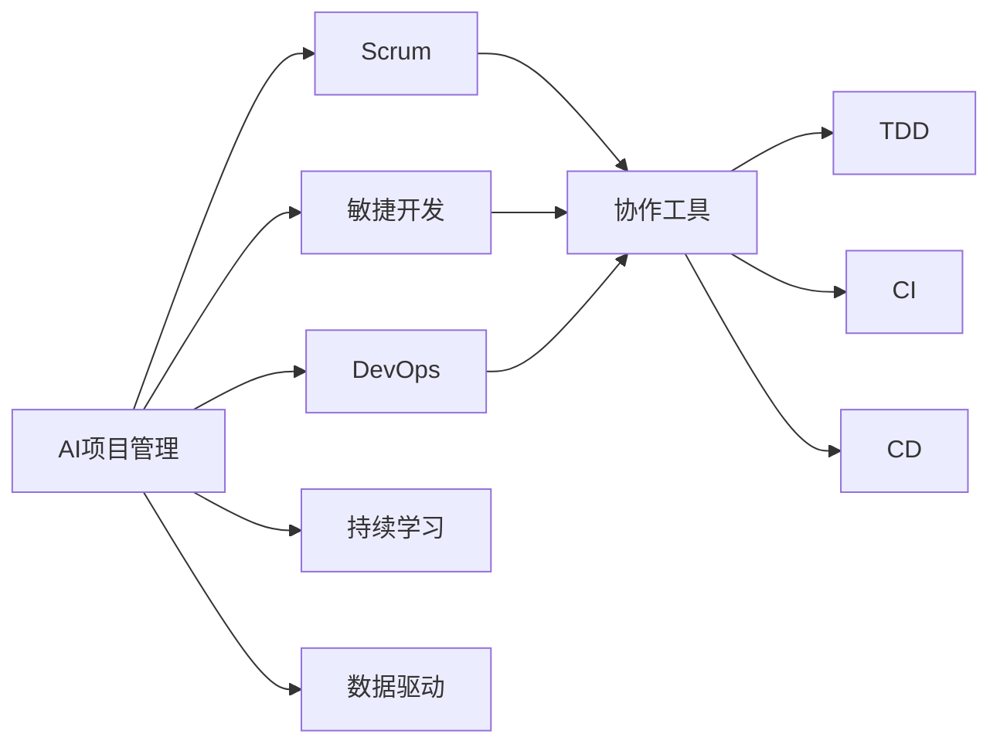

                 

# AI项目管理与团队协作原理与代码实战案例讲解

> 关键词：AI项目管理,团队协作,敏捷开发,Scrum,DevOps,协作工具,测试驱动开发(TDD),持续集成(CI),持续部署(CD),案例分析

## 1. 背景介绍

### 1.1 问题由来
在人工智能(AI)领域，随着技术的飞速发展，项目规模不断扩大，团队协作和项目管理变得愈加复杂。从项目启动到部署上线，需要跨越多个阶段，涉及众多角色和资源。如何高效地协调这些元素，最大化项目产出，同时保证质量和交付时间，成为每一个AI项目经理和团队成员都必须面对的挑战。

本博客将围绕AI项目管理与团队协作，探讨核心概念、核心算法原理和具体操作步骤，并通过实际案例展示，详细介绍如何通过敏捷开发、Scrum、DevOps等工具和实践，实现高效的项目管理和团队协作。

## 2. 核心概念与联系

### 2.1 核心概念概述
- **AI项目管理**：指通过系统化的方法和工具，对AI项目进行规划、执行、监控和评估的过程，旨在提升项目效率和产出。
- **团队协作**：指项目团队成员之间的有效沟通和协作，确保每个人都在正确的方向上工作，并能够相互支持和共享资源。
- **敏捷开发**：一种迭代、增量的软件开发方法，强调快速反馈和持续改进。
- **Scrum**：一种敏捷框架，通过短周期的Sprint迭代，实现快速交付和持续改进。
- **DevOps**：一种跨文化和跨学科的实践，旨在结合开发和运维流程，实现持续交付和自动化。
- **协作工具**：如JIRA、Confluence、Slack等，用于任务跟踪、文档管理和即时沟通。
- **测试驱动开发(TDD)**：一种软件开发方法，强调在编写代码前先编写测试用例，确保代码质量。
- **持续集成(CI)**：一种开发实践，通过自动化测试和集成，确保代码稳定性和可集成性。
- **持续部署(CD)**：一种部署实践，通过自动化部署流程，快速将代码部署到生产环境。

### 2.2 核心概念间的关系
通过以下Mermaid流程图展示这些核心概念之间的联系：



这个流程图展示了核心概念之间的基本关系：

- **AI项目管理**是整个系统的中心，通过敏捷开发、Scrum和DevOps等实践，实现高效的项目管理和团队协作。
- **敏捷开发、Scrum和DevOps**是具体的项目管理实践，确保项目以增量和迭代的方式高效推进。
- **协作工具**支持敏捷开发和DevOps的实施，促进任务管理和团队沟通。
- **测试驱动开发、持续集成和持续部署**是实现高质量软件交付的关键实践。
- **持续学习和数据驱动**是保持项目持续改进和高效运营的必要条件。

## 3. 核心算法原理 & 具体操作步骤
### 3.1 算法原理概述

**敏捷开发**：
敏捷开发的核心在于**迭代和增量**。项目被划分为多个短周期的Sprint，每个Sprint包含一组可交付的功能，并以此为依据进行回顾和改进。敏捷开发通过快速反馈和持续改进，确保项目能够快速适应变化和需求变更。

**Scrum**：
Scrum是一种敏捷框架，通过Scrum Master和Product Owner的协作，确保项目团队按照预定节奏和目标推进。Scrum包括**Sprint计划、Daily Scrum、Sprint评审和Sprint回顾**四个核心仪式，通过团队自组织和迭代反馈，实现高效的项目管理和团队协作。

**DevOps**：
DevOps旨在打破开发和运维之间的壁垒，实现持续交付和自动化。DevOps的实现依赖于**自动化测试、持续集成和持续部署**等关键实践，通过跨文化和跨学科的合作，提升软件交付的速度和质量。

### 3.2 算法步骤详解

**敏捷开发步骤**：
1. **需求收集和分析**：通过用户访谈和需求文档收集项目需求，并进行详细的分析和规划。
2. **划分Sprint**：根据需求和资源，将项目划分为多个Sprint，每个Sprint包含1-4周的任务。
3. **Sprint计划**：每个Sprint开始前，进行Sprint计划仪式，确定Sprint目标和任务分配。
4. **任务执行**：团队成员按照任务分配，进行开发和测试。
5. **每日站会**：团队每天举行15分钟的站会，更新任务进展，解决阻塞问题。
6. **Sprint评审**：Sprint结束时，进行Sprint评审仪式，展示和评审Sprint成果。
7. **Sprint回顾**：进行Sprint回顾仪式，总结Sprint中的经验教训，并改进下一Sprint。

**Scrum步骤**：
1. **创建Scrum团队**：确定Scrum Master和Product Owner，组建Scrum团队。
2. **制定产品待办列表**：由Product Owner制定产品待办列表，确定项目目标和需求。
3. **划分Sprint**：将产品待办列表划分为多个Sprint，每个Sprint包含1-4周的任务。
4. **Sprint计划**：每个Sprint开始前，进行Sprint计划仪式，确定Sprint目标和任务分配。
5. **任务执行**：团队成员按照任务分配，进行开发和测试。
6. **每日站会**：团队每天举行15分钟的站会，更新任务进展，解决阻塞问题。
7. **Sprint评审**：Sprint结束时，进行Sprint评审仪式，展示和评审Sprint成果。
8. **Sprint回顾**：进行Sprint回顾仪式，总结Sprint中的经验教训，并改进下一Sprint。

**DevOps步骤**：
1. **持续集成**：通过自动化测试和集成，确保代码稳定性和可集成性。
2. **持续部署**：通过自动化部署流程，快速将代码部署到生产环境。
3. **监控和反馈**：通过持续监控和反馈，及时发现和解决问题，确保系统稳定运行。

### 3.3 算法优缺点

**敏捷开发**：
- **优点**：快速反馈和持续改进，适应需求变更能力强。
- **缺点**：对团队成员的要求较高，需要良好的沟通和协作能力。

**Scrum**：
- **优点**：高度透明度和自组织，提升团队协作和效率。
- **缺点**：需要严格遵循Scrum仪式和规则，灵活性相对较低。

**DevOps**：
- **优点**：提高交付速度和质量，提升系统可靠性和可用性。
- **缺点**：需要跨文化和跨学科的协作，实施难度较大。

### 3.4 算法应用领域

敏捷开发、Scrum和DevOps等方法，广泛应用于各种规模和类型的项目中，特别是在AI和软件研发领域。具体应用领域包括：

- **AI项目开发**：通过敏捷开发和Scrum，确保AI项目的高效推进和质量保证。
- **软件研发**：通过DevOps实践，实现软件的高质量持续交付和自动化部署。
- **数据分析和机器学习项目**：通过敏捷开发和Scrum，快速响应需求变化，提升数据分析和机器学习模型的开发效率。
- **企业IT系统建设**：通过DevOps实践，实现企业IT系统的稳定运行和快速迭代。

## 4. 数学模型和公式 & 详细讲解 & 举例说明

### 4.1 数学模型构建
我们可以用数学模型来描述敏捷开发、Scrum和DevOps的流程。

**敏捷开发数学模型**：
- **迭代周期**：$T$（周）
- **任务数量**：$N$（个）
- **任务完成时间**：$t_i$（小时）
- **任务优先级**：$p_i$（高、中、低）

**Scrum数学模型**：
- **Sprint长度**：$S$（周）
- **产品待办列表**：$P$（项）
- **任务分配**：$A$（项）
- **每日站会时间**：$W$（小时）

**DevOps数学模型**：
- **持续集成周期**：$C$（小时）
- **持续部署周期**：$D$（小时）
- **监控周期**：$M$（小时）

### 4.2 公式推导过程
敏捷开发、Scrum和DevOps的具体数学模型和推导过程相对复杂，这里仅以敏捷开发为例进行简单介绍。

**敏捷开发公式**：
- **任务完成时间**：$t_i = \frac{N}{\text{总时间}} \times t_{\text{总}}$
- **任务优先级调整**：$p_i = \frac{t_i}{t_{\text{总}}}$
- **任务进度跟踪**：$P_i(t) = \frac{t_i \times t}{t_{\text{总}}}$

**敏捷开发案例**：
假设一个AI项目团队，每次Sprint包含4周的任务，每次任务平均需要40小时完成。

- **需求分析**：需求数量为50项，其中优先级为高、中、低的比例为1:2:1。
- **Sprint计划**：每次Sprint计划时间为1小时，需求分配为10项高优先级、20项中优先级、10项低优先级。

**每日站会**：每日站会时间为15分钟，持续1周。

**任务完成时间**：总时间为280小时，每个任务平均需要40小时完成。

**任务进度跟踪**：
- **第1周**：完成任务进度为25%。
- **第2周**：完成任务进度为50%。
- **第3周**：完成任务进度为75%。
- **第4周**：完成任务进度为100%。

### 4.3 案例分析与讲解

**AI项目案例**：
某AI公司开发一个语音识别系统，项目团队采用敏捷开发和Scrum方法。项目分为10个Sprint，每个Sprint包含4周的任务。每个任务需要10小时完成。

**敏捷开发案例**：
- **Sprint 1**：完成需求分析和Sprint计划，计划10项任务，实际完成8项。
- **Sprint 2**：进行任务执行和每日站会，实际完成8项任务。
- **Sprint 3**：进行任务执行和每日站会，实际完成9项任务。
- **Sprint 4**：进行Sprint评审和回顾，总结经验教训。

## 5. 项目实践：代码实例和详细解释说明

### 5.1 开发环境搭建
在进行项目实践前，需要准备好开发环境。以下是使用Python进行Scrum项目管理的开发环境配置流程：

1. **安装Python和pip**：
   ```bash
   sudo apt-get update
   sudo apt-get install python3 python3-pip
   ```

2. **安装Scrum工具**：
   ```bash
   pip install scrum-english
   ```

3. **创建Scrum项目**：
   ```bash
   scrum init project_name
   ```

4. **创建Sprint**：
   ```bash
   scrum sprint project_name start_date end_date
   ```

5. **添加任务**：
   ```bash
   scrum add task project_name task_name description priority estimated_time
   ```

### 5.2 源代码详细实现
**Sprint计划**：
```python
# 初始化项目和Sprint
project_name = "AI_Project"
start_date = "2022-04-01"
end_date = "2022-04-28"

# 创建项目和Sprint
scrum.init_project(project_name)
scrum.start_sprint(project_name, start_date, end_date)

# 添加任务
scrum.add_task(project_name, "Task1", "编写算法代码", 40, 3)
scrum.add_task(project_name, "Task2", "测试算法代码", 30, 2)
scrum.add_task(project_name, "Task3", "编写文档", 20, 1)
```

**每日站会**：
```python
# 每日站会，更新任务状态
scrum.daily_standup(project_name, "2022-04-05")
```

**Sprint评审**：
```python
# 完成Sprint，进行评审
scrum.complete_sprint(project_name)
```

### 5.3 代码解读与分析
通过上述代码，我们展示了如何使用Scrum工具进行项目管理和任务执行。具体步骤如下：

1. **项目初始化**：通过`scrum.init_project`方法，创建一个项目。
2. **Sprint创建**：通过`scrum.start_sprint`方法，创建一个Sprint，并指定开始和结束日期。
3. **任务添加**：通过`scrum.add_task`方法，添加任务，包括任务名称、描述、优先级和预计完成时间。
4. **每日站会**：通过`scrum.daily_standup`方法，更新每日站会状态，确保团队成员及时反馈任务进展。
5. **Sprint评审**：通过`scrum.complete_sprint`方法，完成Sprint，进行评审和总结。

### 5.4 运行结果展示
假设我们在上述项目中运行代码，得到以下输出结果：

**Sprint 1**：
```
Sprint 1 started on 2022-04-01
```

**每日站会（第5天）**：
```
Daily standup on 2022-04-05
```

**Sprint 1完成**：
```
Sprint 1 completed on 2022-04-28
```

通过这些输出，我们可以清楚地看到Sprint的创建、每日站会进度和Sprint完成情况，确保项目按照计划推进。

## 6. 实际应用场景

### 6.1 智能客服系统
在智能客服系统中，敏捷开发和Scrum方法可以确保系统快速迭代和功能更新。通过每日站会，客服团队可以及时反馈问题，确保系统稳定运行。通过持续集成和持续部署，系统可以快速上线新功能，提升用户体验。

### 6.2 金融舆情监测
在金融舆情监测系统中，敏捷开发和Scrum方法可以确保系统快速响应市场变化和数据更新。通过每日站会，团队可以及时解决问题，提升系统可靠性。通过持续集成和持续部署，系统可以实时处理和分析舆情数据，提升金融风险管理能力。

### 6.3 个性化推荐系统
在个性化推荐系统中，敏捷开发和Scrum方法可以确保推荐算法和系统功能的快速迭代和优化。通过每日站会，团队可以及时反馈算法性能和用户体验，提升推荐准确性。通过持续集成和持续部署，推荐系统可以快速上线新算法，提升推荐效果。

### 6.4 未来应用展望
随着AI技术的不断进步，敏捷开发、Scrum和DevOps等方法将在更多领域得到应用。未来，基于这些方法的AI项目管理与团队协作，将进一步提升项目的效率和产出，推动AI技术的广泛应用。

## 7. 工具和资源推荐

### 7.1 学习资源推荐
- **Scrum指南**：官方文档，详细介绍Scrum的原理和实践。
- **敏捷项目管理**：相关书籍，如《敏捷项目管理》，系统介绍敏捷开发和Scrum方法。
- **DevOps实践指南**：相关书籍，如《DevOps实践指南》，介绍DevOps的最佳实践。
- **JIRA官方文档**：详细介绍JIRA的功能和使用方式。

### 7.2 开发工具推荐
- **JIRA**：任务管理和项目协作工具，支持Scrum和敏捷开发。
- **Confluence**：团队协作和知识管理工具，支持文档管理和团队沟通。
- **Slack**：即时通讯工具，支持团队协作和实时沟通。
- **Git**：版本控制工具，支持代码管理和持续集成。

### 7.3 相关论文推荐
- **敏捷开发的数学模型**：研究敏捷开发过程的数学建模和优化方法。
- **Scrum的效率和适应性**：研究Scrum在不同项目中的应用效果和改进方法。
- **DevOps的实践和挑战**：研究DevOps的实施效果和面临的挑战，提出改进建议。

## 8. 总结：未来发展趋势与挑战

### 8.1 研究成果总结
本文系统介绍了敏捷开发、Scrum和DevOps等AI项目管理与团队协作的核心概念和核心算法原理，并通过实际案例展示了具体的具体操作步骤和运行结果。

### 8.2 未来发展趋势
未来，随着AI技术的不断发展，敏捷开发、Scrum和DevOps等方法将在更多领域得到应用。以下是几个未来发展趋势：

- **全生命周期管理**：将项目管理、测试、部署和运维等全生命周期环节进行整合，提升项目整体效率。
- **跨团队协作**：通过敏捷开发和DevOps方法，实现跨部门、跨团队的协作和沟通，提升团队协作能力。
- **智能化项目管理**：引入AI和自动化工具，提升项目管理效率和准确性。
- **云原生架构**：通过云原生架构，实现高效的资源管理和部署，提升项目交付速度和质量。

### 8.3 面临的挑战
尽管敏捷开发、Scrum和DevOps等方法在项目管理与团队协作中表现出色，但仍然面临一些挑战：

- **文化差异**：不同团队和文化背景下的协作难度较大，需要加强跨团队沟通和协作。
- **资源限制**：项目规模和资源限制，可能导致敏捷开发和Scrum方法的效果受限。
- **技术栈差异**：不同技术栈的协作和整合，需要更多的技术协调和管理。
- **流程优化**：敏捷开发和Scrum方法需要不断优化和改进，才能适应不同的项目需求。

### 8.4 研究展望
未来，需要通过更多的研究和实践，不断完善敏捷开发、Scrum和DevOps等方法，使其更加适应不同项目的需求。以下是几个研究展望：

- **新方法和新工具的引入**：引入新的项目管理方法和协作工具，提升项目管理的效率和效果。
- **人工智能的引入**：引入AI和自动化技术，提升项目管理过程的智能化水平。
- **跨领域应用**：将敏捷开发、Scrum和DevOps等方法应用于更多领域，如医疗、金融、制造等。
- **最佳实践的总结和传播**：总结和传播敏捷开发、Scrum和DevOps等方法的典型案例和最佳实践，推动项目管理与团队协作的普及和提升。

总之，AI项目管理与团队协作是一个不断发展的领域，需要我们持续学习和探索。通过不断优化和改进，我们可以更好地应对AI项目管理的挑战，提升项目效率和产出，推动AI技术的广泛应用。

## 9. 附录：常见问题与解答

**Q1: 敏捷开发和Scrum的核心区别是什么？**

A: 敏捷开发是一种整体的软件开发方法，强调快速反馈和持续改进，而Scrum是一种敏捷框架，通过Sprint迭代和仪式，实现高效的团队协作和项目管理。

**Q2: DevOps的核心是什么？**

A: DevOps的核心是打破开发和运维之间的壁垒，实现持续交付和自动化。它包括持续集成、持续部署、持续监控等关键实践，通过跨文化和跨学科的协作，提升软件交付的速度和质量。

**Q3: 敏捷开发和Scrum在实践中需要注意哪些问题？**

A: 在实践中，敏捷开发和Scrum需要注意以下几点：
- **团队协作**：确保团队成员之间的有效沟通和协作，避免信息不对称和误解。
- **仪式和规则**：严格遵守Scrum仪式和规则，确保Sprint的透明度和可控性。
- **灵活性**：根据项目需求和团队特点，灵活调整敏捷开发和Scrum的实施方式。
- **持续改进**：通过Sprint评审和回顾，不断总结经验教训，提升项目管理效率和质量。

**Q4: DevOps在实施过程中有哪些常见挑战？**

A: DevOps在实施过程中，可能面临以下挑战：
- **跨团队协作**：不同部门和文化背景下的协作难度较大，需要加强沟通和协作。
- **技术栈差异**：不同技术栈的协作和整合，需要更多的技术协调和管理。
- **自动化工具**：引入自动化工具和实践，需要团队成员的协作和配合。
- **持续监控和反馈**：持续监控和反馈需要实时数据和分析，对系统稳定性和运维要求较高。

总之，AI项目管理与团队协作是一个不断发展的领域，需要我们持续学习和探索。通过不断优化和改进，我们可以更好地应对AI项目管理的挑战，提升项目效率和产出，推动AI技术的广泛应用。

---

作者：禅与计算机程序设计艺术 / Zen and the Art of Computer Programming

