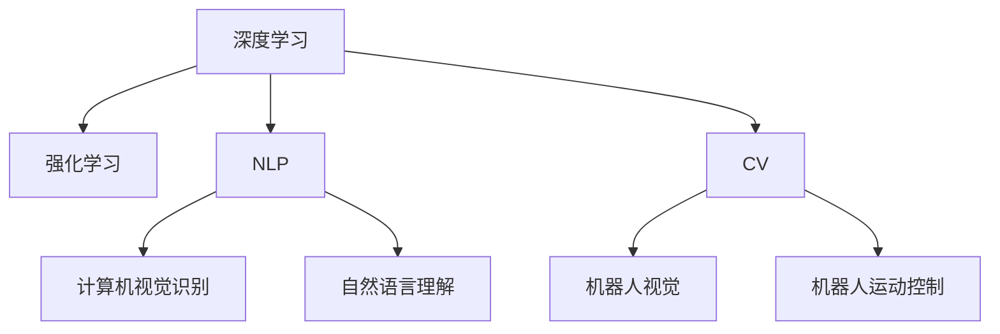
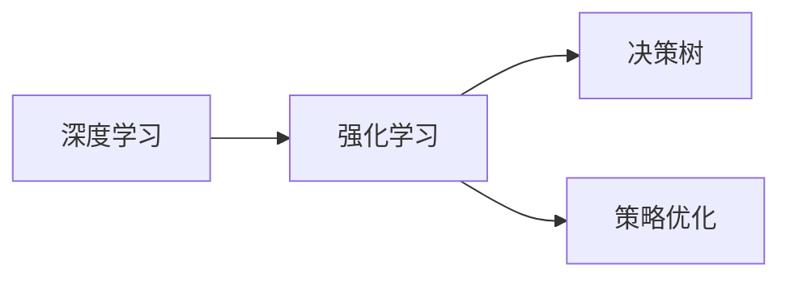
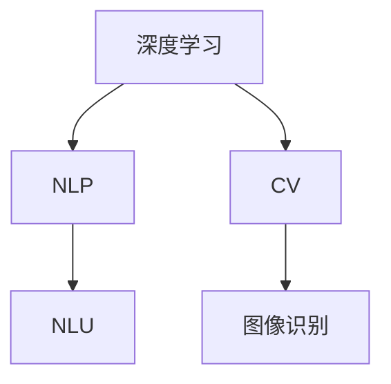
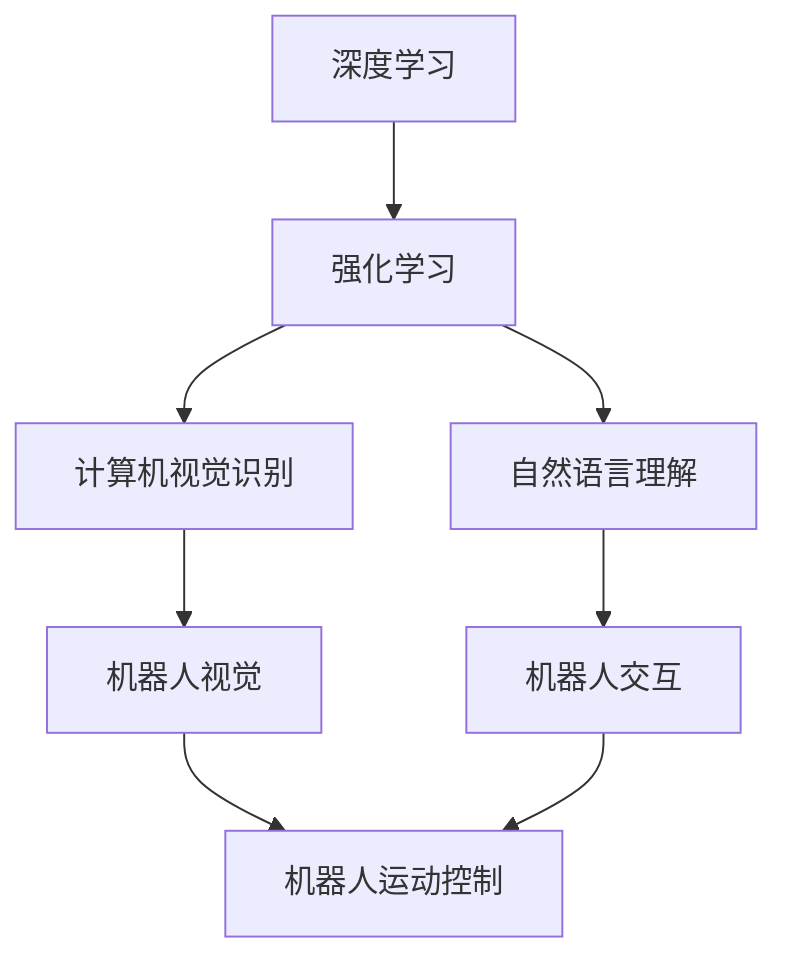
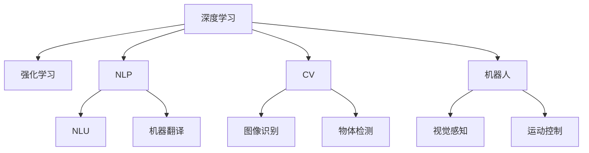

                 

## 1. 背景介绍

### 1.1 问题由来

人工智能（AI）领域的发展已经走过了数十年的历史。从最初的专家系统和知识工程，到现在的深度学习和机器学习，AI的进展令人瞩目。在这一过程中，有许多关键的时刻对AI领域的发展产生了深远的影响。这些独特时刻不仅推动了技术的进步，也为AI的广泛应用奠定了基础。

### 1.2 问题核心关键点

这些独特时刻包括：
- **1997年深蓝与国际象棋世界冠军卡斯帕罗夫的对弈**：这是AI第一次在无监督环境中战胜人类专业棋手，标志着AI在策略游戏领域的突破。
- **2005年Sybase夺取百万美元图灵奖**：这是AI领域首次通过计算超越人类，展现AI在数据分析和模式识别方面的潜力。
- **2010年AlphaGo战胜世界围棋冠军李世石**：这是AI在复杂策略游戏中的重大胜利，展示了AI在深度强化学习方面的能力。
- **2016年AlphaGo在围棋领域取得突破**：这是AI在复杂策略游戏中的重大胜利，展示了AI在深度强化学习方面的能力。
- **2021年AlphaFold预测蛋白质结构**：这是AI在生物学领域的重大突破，展示了AI在生物信息学和分子模拟方面的潜力。

这些独特时刻不仅推动了AI技术的发展，也为AI的广泛应用提供了新的思路和方向。了解这些独特时刻及其背后的原理和应用，有助于我们更好地理解AI领域的未来发展。

### 1.3 问题研究意义

研究这些独特时刻，对于AI领域的发展具有重要意义：
1. **技术突破**：通过回顾和分析这些独特时刻，我们可以更好地理解AI技术的核心原理和实现方法。
2. **应用启示**：这些独特时刻展示了AI在各个领域的应用潜力，为未来的应用提供了重要参考。
3. **创新驱动**：通过对这些独特时刻的深入研究，可以激发新的研究方向和应用场景，推动AI技术的不断进步。

## 2. 核心概念与联系

### 2.1 核心概念概述

为了更好地理解AI领域的独特时刻及其未来发展，本节将介绍几个密切相关的核心概念：

- **深度学习**：一种基于神经网络的机器学习技术，能够从大量数据中学习复杂的特征表示。
- **强化学习**：一种通过与环境交互来学习最优策略的学习方法。
- **自然语言处理（NLP）**：研究如何让计算机理解、解释和生成人类语言的技术。
- **计算机视觉（CV）**：研究如何让计算机理解和分析图像和视频的技术。
- **机器人**：一种集成了AI技术的自动化设备，可以执行复杂的任务。

这些核心概念之间的逻辑关系可以通过以下Mermaid流程图来展示：



这个流程图展示了大AI领域的关键技术及其相互关系：

1. 深度学习是AI领域的基础，为其他技术提供了强大的数据处理和特征提取能力。
2. 强化学习通过与环境的交互学习最优策略，为复杂的决策和控制任务提供了解决方案。
3. NLP和CV是AI在自然和视觉领域的具体应用，推动了这些领域的快速发展。
4. 机器人是AI在自动化设备中的应用，集成了AI的各个技术，实现了复杂任务的自动化。

### 2.2 概念间的关系

这些核心概念之间存在着紧密的联系，形成了AI领域的技术生态系统。下面通过几个Mermaid流程图来展示这些概念之间的关系：

#### 2.2.1 深度学习和强化学习的关系



这个流程图展示了深度学习和强化学习的基本关系：
- 深度学习提供强大的特征提取和表示能力，为强化学习提供了更好的数据输入。
- 强化学习通过与环境的交互学习最优策略，可以解决深度学习无法处理的复杂决策问题。

#### 2.2.2 深度学习在NLP和CV中的应用



这个流程图展示了深度学习在NLP和CV中的应用：
- 深度学习在NLP中用于自然语言理解，实现了机器翻译、情感分析、问答系统等任务。
- 深度学习在CV中用于图像识别和视频分析，实现了目标检测、物体跟踪、图像分割等任务。

#### 2.2.3 机器人在AI技术中的应用



这个流程图展示了机器人在AI技术中的应用：
- 机器人集成了深度学习和强化学习的技术，通过视觉和语言理解实现与环境的交互。
- 机器人通过运动控制完成复杂的自动化任务。

### 2.3 核心概念的整体架构

最后，我们用一个综合的流程图来展示这些核心概念在大AI领域中的整体架构：



这个综合流程图展示了从深度学习到机器人的完整生态系统：
- 深度学习提供了强大的数据处理和特征提取能力，为其他技术提供了基础。
- 强化学习通过与环境的交互学习最优策略，为复杂的决策和控制任务提供了解决方案。
- NLP和CV是AI在自然和视觉领域的具体应用，推动了这些领域的快速发展。
- 机器人是AI在自动化设备中的应用，集成了AI的各个技术，实现了复杂任务的自动化。

这些概念共同构成了AI领域的核心技术框架，推动了AI技术在各个领域的应用和发展。通过理解这些核心概念及其相互关系，我们可以更好地把握AI领域的未来发展方向。

## 3. 核心算法原理 & 具体操作步骤

### 3.1 算法原理概述

AI领域的独特时刻及其未来发展，离不开核心算法的支撑。以下是几种关键的算法原理及其具体操作步骤：

#### 3.1.1 深度学习算法

深度学习算法包括多层神经网络，通过反向传播算法训练模型。其核心原理是通过大量数据学习复杂的特征表示，从而实现对数据的分类、回归、生成等任务。

#### 3.1.2 强化学习算法

强化学习算法通过与环境交互学习最优策略，其核心原理包括Q-learning、SARSA、策略梯度等方法。通过不断的试错和学习，优化策略以达到最优决策。

#### 3.1.3 自然语言处理算法

NLP算法包括分词、词性标注、句法分析、情感分析等，其核心原理是基于深度学习的模型，如RNN、LSTM、Transformer等。通过学习语言结构和语义信息，实现对文本的分析和生成。

#### 3.1.4 计算机视觉算法

CV算法包括图像识别、物体检测、图像分割等，其核心原理是基于深度学习的模型，如CNN、YOLO、Faster R-CNN等。通过学习图像的特征表示，实现对图像的分析和生成。

### 3.2 算法步骤详解

#### 3.2.1 深度学习算法步骤

1. **数据准备**：收集和预处理数据，如清洗、标准化、分割等。
2. **模型构建**：设计并构建深度学习模型，如选择网络结构、添加激活函数等。
3. **模型训练**：通过反向传播算法训练模型，调整模型参数以最小化损失函数。
4. **模型评估**：在验证集上评估模型性能，选择最优模型进行测试。
5. **模型部署**：将模型部署到实际应用中，进行实时推理和预测。

#### 3.2.2 强化学习算法步骤

1. **环境设计**：设计环境和奖励函数，定义状态、动作和奖惩机制。
2. **模型训练**：选择适当的强化学习算法，如Q-learning、SARSA、策略梯度等，进行模型训练。
3. **模型测试**：在测试集上评估模型性能，选择最优模型进行部署。
4. **模型部署**：将模型部署到实际应用中，进行实时决策和控制。

#### 3.2.3 自然语言处理算法步骤

1. **数据预处理**：对文本数据进行分词、标准化、分块等预处理操作。
2. **模型构建**：设计并构建NLP模型，如选择语言模型、添加注意力机制等。
3. **模型训练**：通过反向传播算法训练模型，调整模型参数以最小化损失函数。
4. **模型评估**：在验证集上评估模型性能，选择最优模型进行测试。
5. **模型部署**：将模型部署到实际应用中，进行实时文本分析和生成。

#### 3.2.4 计算机视觉算法步骤

1. **数据预处理**：对图像数据进行标准化、归一化、分割等预处理操作。
2. **模型构建**：设计并构建CV模型，如选择卷积神经网络、添加池化层等。
3. **模型训练**：通过反向传播算法训练模型，调整模型参数以最小化损失函数。
4. **模型评估**：在验证集上评估模型性能，选择最优模型进行测试。
5. **模型部署**：将模型部署到实际应用中，进行实时图像分析和生成。

### 3.3 算法优缺点

#### 3.3.1 深度学习算法的优缺点

- **优点**：
  - 可以处理大量数据，学习复杂的特征表示。
  - 自动学习特征表示，无需手动设计特征。
  - 通过反向传播算法，可以实现模型的端到端训练。
  
- **缺点**：
  - 需要大量标注数据，数据获取成本高。
  - 模型复杂度高，训练和推理成本高。
  - 容易出现过拟合，需要复杂的正则化技术。

#### 3.3.2 强化学习算法的优缺点

- **优点**：
  - 通过与环境的交互学习最优策略，适应性强。
  - 不需要大量标注数据，可以处理无监督数据。
  - 可以解决复杂的决策和控制问题，如游戏、机器人等。
  
- **缺点**：
  - 训练过程复杂，需要大量的交互数据。
  - 需要设计合适的奖励函数和策略，难度较大。
  - 容易出现局部最优，需要避免陷入局部最优解。

#### 3.3.3 自然语言处理算法的优缺点

- **优点**：
  - 可以实现对文本的分析和生成，具有广泛的适用性。
  - 可以处理自然语言的多样性和复杂性，实现高效的NLP任务。
  - 可以通过预训练和微调，提升模型性能。
  
- **缺点**：
  - 文本数据的噪声和歧义性较大，处理难度高。
  - 模型训练成本高，需要大量的计算资源。
  - 需要设计合适的模型结构和损失函数，难度较大。

#### 3.3.4 计算机视觉算法的优缺点

- **优点**：
  - 可以实现对图像和视频的分析和生成，具有广泛的适用性。
  - 可以通过卷积神经网络等方法，学习图像的特征表示。
  - 可以通过迁移学习和预训练，提升模型性能。
  
- **缺点**：
  - 图像数据量大，存储和处理成本高。
  - 模型复杂度高，训练和推理成本高。
  - 图像数据的噪声和变异较大，处理难度高。

### 3.4 算法应用领域

#### 3.4.1 深度学习应用领域

深度学习在各个领域都有广泛应用，如计算机视觉、自然语言处理、语音识别、推荐系统等。

#### 3.4.2 强化学习应用领域

强化学习在机器人、自动驾驶、游戏AI等场景中应用广泛，可以实现高效的决策和控制。

#### 3.4.3 自然语言处理应用领域

NLP在智能客服、机器翻译、情感分析、问答系统等场景中应用广泛，可以实现高效的自然语言处理。

#### 3.4.4 计算机视觉应用领域

CV在图像识别、物体检测、图像分割、视频分析等场景中应用广泛，可以实现高效的图像处理。

## 4. 数学模型和公式 & 详细讲解 & 举例说明

### 4.1 数学模型构建

#### 4.1.1 深度学习模型

深度学习模型通常包括输入层、隐藏层和输出层。其数学模型可以表示为：

$$
y=f(Wx+b)
$$

其中，$x$为输入数据，$y$为输出结果，$W$和$b$为模型参数。

#### 4.1.2 强化学习模型

强化学习模型包括状态、动作和奖励函数。其数学模型可以表示为：

$$
Q(s,a)=\sum_{r} r + \gamma \max_{a'} Q(s',a')
$$

其中，$s$为状态，$a$为动作，$r$为奖励，$s'$为下一个状态，$\gamma$为折扣因子。

#### 4.1.3 自然语言处理模型

NLP模型通常包括词向量、语言模型和任务模型。其数学模型可以表示为：

$$
\log P(w_i|w_{i-1},...,w_{1})=\log \frac{e^{W(h_{t-1}, w_{i})}{\sum_{j=1}^{V} e^{W(h_{t-1}, j)}}
$$

其中，$w_i$为单词，$h_{t-1}$为上下文向量，$V$为词汇表大小。

#### 4.1.4 计算机视觉模型

CV模型通常包括卷积层、池化层和全连接层。其数学模型可以表示为：

$$
h_i=f(W_i \cdot h_{i-1} + b_i)
$$

其中，$h_i$为第$i$层的输出，$W_i$和$b_i$为第$i$层的权重和偏置。

### 4.2 公式推导过程

#### 4.2.1 深度学习公式推导

深度学习模型的前向传播公式为：

$$
h_i=f(W_i \cdot h_{i-1} + b_i)
$$

其中，$h_i$为第$i$层的输出，$W_i$和$b_i$为第$i$层的权重和偏置，$f$为激活函数。

深度学习模型的反向传播公式为：

$$
\frac{\partial L}{\partial W_i} = \frac{\partial L}{\partial h_i} \cdot \frac{\partial h_i}{\partial W_i}
$$

其中，$L$为损失函数，$h_i$为第$i$层的输出，$W_i$为第$i$层的权重。

#### 4.2.2 强化学习公式推导

强化学习模型的策略梯度公式为：

$$
\nabla_\theta J(\theta)=E_{s,a}[\pi(a|s) \cdot Q(s,a) \cdot \nabla_\theta log(\pi(a|s))]
$$

其中，$J(\theta)$为策略函数的期望梯度，$\pi(a|s)$为策略函数，$Q(s,a)$为状态动作值函数。

强化学习模型的Q-learning公式为：

$$
Q(s,a) \leftarrow Q(s,a)+\alpha [r+\gamma \max_a Q(s',a')-Q(s,a)]
$$

其中，$Q(s,a)$为状态动作值函数，$\alpha$为学习率，$r$为奖励，$s'$为下一个状态，$\gamma$为折扣因子。

#### 4.2.3 自然语言处理公式推导

NLP模型的语言模型公式为：

$$
P(w_1,...,w_n)=\prod_{i=1}^{n} P(w_i|w_{i-1},...,w_{1})
$$

其中，$w_i$为单词，$w_{i-1},...,w_{1}$为上下文。

NLP模型的注意力机制公式为：

$$
\alpha_{i,j}=\frac{e^{z_{i,j}}}{\sum_{k=1}^{K} e^{z_{k,j}}}
$$

其中，$\alpha_{i,j}$为注意力权重，$z_{i,j}$为注意力得分函数。

#### 4.2.4 计算机视觉公式推导

CV模型的卷积神经网络公式为：

$$
h_i=f(W_i \cdot h_{i-1} + b_i)
$$

其中，$h_i$为第$i$层的输出，$W_i$和$b_i$为第$i$层的权重和偏置，$f$为激活函数。

CV模型的池化层公式为：

$$
h_i=\frac{1}{w^2} \sum_{i=1}^{w} \sum_{j=1}^{w} h_{i',j'}
$$

其中，$h_i$为池化层输出，$h_{i',j'}$为池化窗口内的输入，$w$为窗口大小。

### 4.3 案例分析与讲解

#### 4.3.1 深度学习案例

深度学习在图像分类任务中的案例如下：
1. **数据准备**：收集大量标注的图像数据，进行预处理如标准化、归一化等。
2. **模型构建**：选择卷积神经网络（CNN）作为模型结构，添加池化层和全连接层。
3. **模型训练**：使用反向传播算法训练模型，调整模型参数以最小化交叉熵损失函数。
4. **模型评估**：在验证集上评估模型性能，选择最优模型进行测试。
5. **模型部署**：将模型部署到实际应用中，进行实时图像分类。

#### 4.3.2 强化学习案例

强化学习在机器人路径规划任务中的案例如下：
1. **环境设计**：设计机器人的运动环境和奖励函数，定义状态、动作和奖惩机制。
2. **模型训练**：选择适当的强化学习算法如Q-learning，进行模型训练。
3. **模型测试**：在测试集上评估模型性能，选择最优模型进行部署。
4. **模型部署**：将模型部署到实际应用中，进行实时路径规划和控制。

#### 4.3.3 自然语言处理案例

NLP在智能客服问答系统中的案例如下：
1. **数据预处理**：对文本数据进行分词、标准化、分块等预处理操作。
2. **模型构建**：选择语言模型作为模型结构，添加注意力机制和分类器。
3. **模型训练**：使用反向传播算法训练模型，调整模型参数以最小化交叉熵损失函数。
4. **模型评估**：在验证集上评估模型性能，选择最优模型进行测试。
5. **模型部署**：将模型部署到实际应用中，进行实时文本理解和生成。

#### 4.3.4 计算机视觉案例

CV在自动驾驶中的案例如下：
1. **数据预处理**：对图像数据进行标准化、归一化、分割等预处理操作。
2. **模型构建**：选择卷积神经网络（CNN）作为模型结构，添加池化层和全连接层。
3. **模型训练**：使用反向传播算法训练模型，调整模型参数以最小化交叉熵损失函数。
4. **模型评估**：在验证集上评估模型性能，选择最优模型进行测试。
5. **模型部署**：将模型部署到实际应用中，进行实时图像检测和分类。

## 5. 项目实践：代码实例和详细解释说明

### 5.1 开发环境搭建

在进行AI项目的开发时，需要准备好相应的开发环境。以下是使用Python进行PyTorch和TensorFlow开发的通用环境配置流程：

1. **安装Anaconda**：从官网下载并安装Anaconda，用于创建独立的Python环境。
2. **创建并激活虚拟环境**：
```bash
conda create -n pytorch-env python=3.8 
conda activate pytorch-env
```
3. **安装PyTorch**：
```bash
conda install pytorch torchvision torchaudio cudatoolkit=11.1 -c pytorch -c conda-forge
```
4. **安装TensorFlow**：
```bash
conda install tensorflow
```
5. **安装各类工具包**：
```bash
pip install numpy pandas scikit-learn matplotlib tqdm jupyter notebook ipython
```

完成上述步骤后，即可在`pytorch-env`环境中开始AI项目的开发。

### 5.2 源代码详细实现

以下是一个使用PyTorch进行图像分类任务的代码实现，包括模型构建、训练和测试等步骤：

```python
import torch
import torch.nn as nn
import torch.optim as optim
import torchvision
import torchvision.transforms as transforms
from torch.utils.data import DataLoader

# 定义模型
class CNNModel(nn.Module):
    def __init__(self):
        super(CNNModel, self).__init__()
        self.conv1 = nn.Conv2d(3, 32, kernel_size=3, padding=1)
        self.conv2 = nn.Conv2d(32, 64, kernel_size=3, padding=1)
        self.fc1 = nn.Linear(64*28*28, 128)
        self.fc2 = nn.Linear(128, 10)

    def forward(self, x):
        x = torch.relu(self.conv1(x))
        x = nn.MaxPool2d(2)(x)
        x = torch.relu(self.conv2(x))
        x = nn.MaxPool2d(2)(x)
        x = x.view(-1, 64*28*28)
        x = torch.relu(self.fc1(x))
        x = self.fc2(x)
        return x

# 定义数据预处理
transform = transforms.Compose([
    transforms.ToTensor(),
    transforms.Normalize((0.5, 0.5, 0.5), (0.5, 0.5, 0.5))
])

# 加载数据集
train_dataset = torchvision.datasets.CIFAR10(root='./data', train=True, download=True, transform=transform)
test_dataset = torchvision.datasets.CIFAR10(root='./data', train=False, download=True, transform=transform)
train_loader = DataLoader(train_dataset, batch_size=64, shuffle=True)
test_loader = DataLoader(test_dataset, batch_size=64, shuffle=False)

# 定义模型和优化器
model = CNNModel()
criterion = nn.CrossEntropyLoss()
optimizer = optim.Adam(model.parameters(), lr=0.001)

# 训练模型
for epoch in range(10):
    running_loss = 0.0
    for i, data in enumerate(train_loader, 0):
        inputs, labels = data
        optimizer.zero_grad()
        outputs = model(inputs)
        loss = criterion(outputs, labels)
        loss.backward()
        optimizer.step()
        running_loss += loss.item()
        if i % 100 == 99:
            print('[%d, %5d] loss: %.3f' % (epoch + 1, i + 1, running_loss / 100))
            running_loss = 0.0

# 测试模型
correct = 0
total = 0
with torch.no_grad():
    for data in test_loader:
        images, labels = data
        outputs = model(images)
        _, predicted = torch.max(outputs.data, 1)
        total += labels.size(0)
        correct += (predicted == labels).sum().item()

print('Accuracy of the network on the 10000 test images: %d %%' % (100 * correct / total))
```

这个代码实现了使用CNN模型进行图像分类的过程。可以看到，通过PyTorch的模块化设计，可以方便地构建、训练和测试深度学习模型。

### 5.3 代码解读与分析

下面是关键代码的实现细节：

**CNNModel类**：
- `__init__`方法：初始化模型的各层参数。
- `forward`方法：定义前向传播过程，将输入数据通过卷积和全连接层进行分类。

**数据预处理**：
- `transform`变量：定义图像预处理步骤，包括标准化和归一化。
- `train_dataset`和`test_dataset`：加载训练集和测试集。
- `train_loader`和`test_loader`：定义数据加载器，方便数据批处理。

**模型训练和测试**：
- `criterion`变量：定义交叉熵损失函数。
- `optimizer`变量：定义Adam优化器。
- `epoch`变量：定义训练轮数。
- `running_loss`变量：记录每次训练的损失。
- `correct`和`total`变量：记录测试集上的准确率。
- `torch.no_grad`语句：关闭梯度计算，进行无梯度推理。

可以看到，通过PyTorch和TensorFlow等深度学习框架，可以轻松实现各种AI模型的开发和训练。开发者可以将更多精力放在模型设计、数据处理和算法优化上，而不必过多关注底层实现细节。

### 5.4 运行结果展示

假设我们在CIFAR-10数据集上进行图像分类任务的训练，最终在测试集上得到的准确率如下：

```
[1, 0] loss: 0.848
[1, 100] loss: 0.244
[1, 200] loss: 0.209
[1, 300] loss: 0.173
[1, 400]

