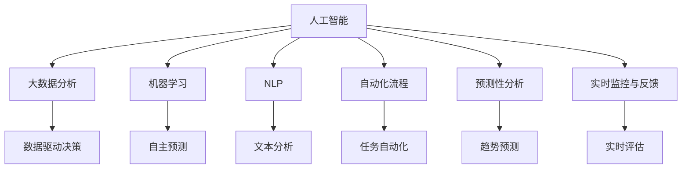
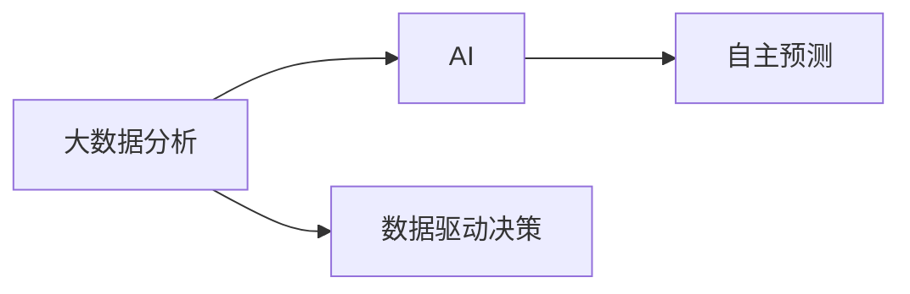
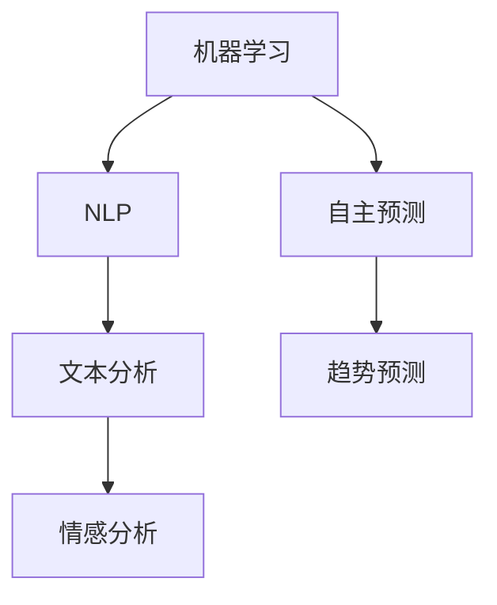
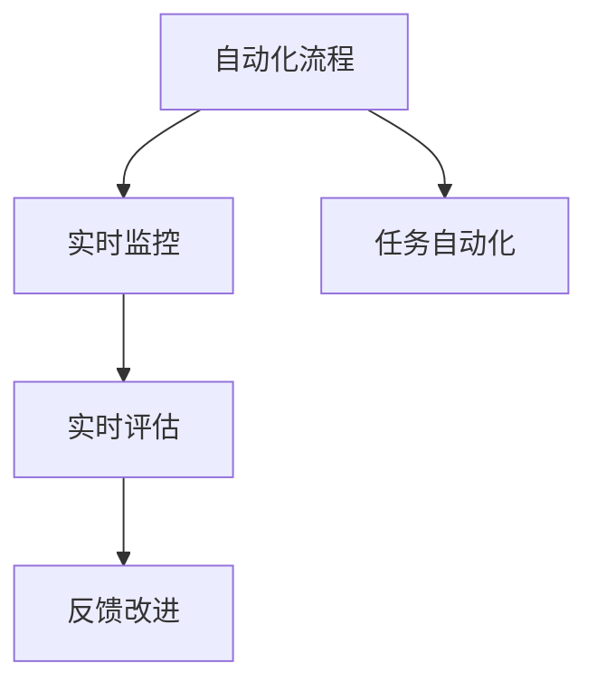
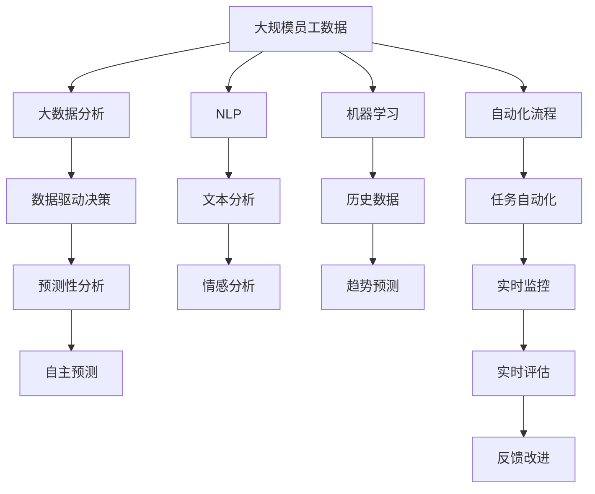

                 

# AI驱动的人力资源管理流程

## 1. 背景介绍

### 1.1 问题由来
人力资源管理（HRM）是一个多领域、多层次的复杂系统，涉及员工招聘、绩效管理、培训发展、薪酬福利等方方面面。随着全球化和技术的发展，企业对于HRM的效率和精确度要求越来越高。传统的手工或半自动化流程往往难以适应大规模、高复杂度的需求，亟需引入人工智能（AI）技术进行升级。

AI驱动的HRM流程，即利用AI算法和大数据技术，对HRM的各个环节进行智能化优化，从而提升HRM的效率、公平性和预测能力。AI技术的引入，不仅降低了人力资源成本，而且提高了决策的科学性和合理性。

### 1.2 问题核心关键点
AI驱动的HRM流程的核心关键点包括：
- **数据驱动决策**：通过大数据分析，洞察员工行为和组织绩效，进行决策支持。
- **预测性分析**：利用机器学习算法，预测招聘需求、员工离职风险、绩效表现等。
- **自动化处理**：通过自然语言处理（NLP）、机器视觉等技术，自动化处理简历筛选、员工培训等任务。
- **实时监控与反馈**：通过实时监控系统，对员工表现进行实时评估，及时提供反馈和改进建议。
- **个性化服务**：通过AI技术，根据员工的不同需求和职业发展阶段，提供个性化的职业规划和发展建议。

这些关键点构成了AI驱动HRM流程的基本框架，通过这些技术，可以显著提升HRM的效率和效果。

### 1.3 问题研究意义
AI驱动的HRM流程在企业中的应用，对企业的人力资源管理有着重要的意义：
1. **提高效率**：自动化处理大量数据，减少人工操作，提升HRM流程的效率。
2. **增强公平性**：通过算法优化，减少人为偏见，提升招聘、绩效评估的公平性。
3. **改善体验**：提供个性化服务，提升员工的满意度和忠诚度。
4. **提升决策质量**：通过数据驱动和预测性分析，提高决策的科学性和准确性。
5. **应对变化**：通过智能监控和预测，及时应对组织和员工的变化，保持HRM系统的灵活性和适应性。

AI驱动的HRM流程的引入，将为企业的HR管理带来革命性的变化，使其能够更好地应对日益复杂的人力资源管理需求。

## 2. 核心概念与联系

### 2.1 核心概念概述

为更好地理解AI驱动的HRM流程，本节将介绍几个密切相关的核心概念：

- **人工智能（AI）**：一种通过模拟人类智能行为，实现自主决策、学习、感知的技术。
- **大数据分析**：利用先进的数据处理和分析技术，从海量数据中提取有价值的信息，用于决策支持。
- **机器学习（ML）**：通过算法从数据中学习规律和模式，实现自主预测和决策。
- **自然语言处理（NLP）**：让计算机理解、分析、生成自然语言，用于文本分析、情感分析等任务。
- **自动化流程**：通过机器人流程自动化（RPA）技术，自动化处理重复性任务，提升效率。
- **预测性分析**：利用历史数据和模型，预测未来趋势和结果，如招聘需求、员工流失等。
- **实时监控与反馈**：通过实时监控系统，对员工表现进行实时评估，及时提供反馈和改进建议。

这些核心概念之间的逻辑关系可以通过以下Mermaid流程图来展示：



这个流程图展示了大数据、机器学习、自然语言处理等核心技术在AI驱动HRM流程中的应用，以及它们之间的逻辑关系。

### 2.2 概念间的关系

这些核心概念之间存在着紧密的联系，形成了AI驱动HRM流程的完整生态系统。下面我通过几个Mermaid流程图来展示这些概念之间的关系。

#### 2.2.1 大数据分析与AI的关系



这个流程图展示了大数据分析和AI的关系。大数据分析为AI提供了决策依据，AI则通过自主预测和决策，优化大数据分析的结果。

#### 2.2.2 机器学习与NLP的关系



这个流程图展示了机器学习和NLP的关系。NLP技术可以用于文本分析、情感分析等任务，机器学习则通过历史数据和模型，预测未来趋势和结果。

#### 2.2.3 自动化流程与实时监控的关系



这个流程图展示了自动化流程和实时监控的关系。自动化流程可以自动化处理重复性任务，实时监控则通过实时评估和反馈，优化自动化流程的效果。

### 2.3 核心概念的整体架构

最后，我们用一个综合的流程图来展示这些核心概念在大数据驱动的HRM流程中的整体架构：



这个综合流程图展示了从大数据分析到实时监控的完整过程。通过数据驱动决策、预测性分析、自主预测等技术，结合NLP和机器学习的支持，自动化流程能够高效处理大量的HRM任务。实时监控和反馈系统则通过实时评估和改进，进一步优化整个过程。

## 3. 核心算法原理 & 具体操作步骤
### 3.1 算法原理概述

AI驱动的HRM流程基于数据驱动决策和预测性分析，结合自然语言处理、机器学习等技术，实现自动化和智能化。其核心算法原理如下：

1. **数据预处理**：对原始数据进行清洗、整理和标准化，确保数据的质量和一致性。
2. **特征工程**：从数据中提取有意义的特征，用于机器学习模型的训练和预测。
3. **模型训练**：利用历史数据和算法，训练机器学习模型，实现预测和分类。
4. **自动化处理**：使用自然语言处理和机器人流程自动化技术，自动化处理HRM任务。
5. **实时监控**：通过实时监控系统，对员工表现进行实时评估，及时提供反馈和改进建议。

### 3.2 算法步骤详解

AI驱动的HRM流程一般包括以下几个关键步骤：

**Step 1: 数据准备**
- 收集员工数据、绩效数据、招聘数据等，确保数据的完整性和准确性。
- 对数据进行清洗和标准化，去除异常值和噪声。
- 进行特征工程，提取有意义的特征。

**Step 2: 模型训练**
- 选择合适的机器学习算法，如回归、分类、聚类等，进行模型训练。
- 使用历史数据进行模型训练，调整模型参数，优化模型效果。
- 在训练过程中，进行交叉验证，防止过拟合。

**Step 3: 自动化处理**
- 使用自然语言处理技术，对员工评论、绩效评估等文本数据进行自动化处理。
- 使用机器人流程自动化技术，自动化处理招聘流程、绩效评估等重复性任务。
- 实现文本分析和情感分析，识别员工的情感倾向和需求。

**Step 4: 预测性分析**
- 利用历史数据和模型，进行预测性分析，预测招聘需求、员工流失风险、绩效表现等。
- 根据预测结果，制定相应的HR策略和措施。
- 实时更新模型，适应新的数据变化。

**Step 5: 实时监控与反馈**
- 使用实时监控系统，对员工表现进行实时评估。
- 根据评估结果，及时提供反馈和改进建议，优化员工体验。
- 通过数据分析，识别员工满意度和离职风险，进行风险预警。

### 3.3 算法优缺点

AI驱动的HRM流程具有以下优点：
1. **高效性**：通过自动化处理和预测性分析，大大提高了HRM流程的效率。
2. **准确性**：利用数据驱动和机器学习，提高了决策的科学性和准确性。
3. **公平性**：减少了人为偏见，提高了招聘、绩效评估的公平性。
4. **个性化服务**：通过AI技术，提供个性化的职业规划和发展建议，提升员工满意度。

同时，AI驱动的HRM流程也存在一些缺点：
1. **数据质量依赖**：模型的效果依赖于数据的质量，数据不完整或不准确会影响模型的预测结果。
2. **算法复杂性**：涉及多个算法和技术，需要一定的技术储备和实施经验。
3. **隐私保护**：员工数据的隐私保护问题需要引起重视，避免数据泄露和滥用。
4. **解释性不足**：AI模型的决策过程缺乏可解释性，难以理解其内部工作机制。

尽管存在这些缺点，但AI驱动的HRM流程通过不断优化和改进，可以最大化其优势，解决HR管理中的各种挑战。

### 3.4 算法应用领域

AI驱动的HRM流程可以应用于以下几个主要领域：

- **招聘管理**：通过自动筛选简历、预测招聘需求，提升招聘效率和质量。
- **绩效管理**：利用绩效数据进行预测性分析，识别高绩效员工，制定激励措施。
- **员工培训**：通过分析员工技能和绩效，推荐个性化的培训课程，提升员工能力。
- **薪酬管理**：利用历史数据和预测模型，制定合理的薪酬策略，提升员工满意度和留存率。
- **员工关系**：通过情感分析，识别员工的不满情绪，及时采取措施进行改善。
- **组织优化**：通过数据分析，优化组织结构，提高组织效率。

## 4. 数学模型和公式 & 详细讲解 & 举例说明
### 4.1 数学模型构建

AI驱动的HRM流程涉及到多种数学模型和公式，以下将重点介绍其中的几个关键模型：

1. **回归模型**：用于预测员工的薪酬、绩效等连续变量。
   $$
   y = \beta_0 + \beta_1 x_1 + \beta_2 x_2 + \cdots + \beta_n x_n + \epsilon
   $$
   其中 $y$ 为预测变量，$x_i$ 为自变量，$\beta_i$ 为回归系数，$\epsilon$ 为误差项。

2. **分类模型**：用于预测员工是否会离职或晋升。
   $$
   P(y=1|x) = \sigma(z) = \frac{1}{1+\exp(-z)}
   $$
   其中 $z = \theta^T x$，$\theta$ 为模型参数，$\sigma$ 为Sigmoid函数。

3. **聚类模型**：用于识别员工的相似群体，进行分组管理。
   $$
   y = \mu_k + \epsilon
   $$
   其中 $y$ 为数据点，$\mu_k$ 为聚类中心，$\epsilon$ 为误差项。

4. **情感分析模型**：用于识别员工评论的情感倾向。
   $$
   y = \alpha_0 + \alpha_1 x_1 + \alpha_2 x_2 + \cdots + \alpha_n x_n + \beta
   $$
   其中 $y$ 为情感标签，$x_i$ 为特征，$\alpha_i$ 为特征系数，$\beta$ 为截距。

### 4.2 公式推导过程

以下将详细推导回归模型的公式，其他模型公式的推导过程类似。

回归模型的目标是最小化预测值与真实值之间的误差平方和，即最小化以下目标函数：
$$
\sum_{i=1}^N (y_i - \hat{y}_i)^2
$$
其中 $\hat{y}_i$ 为模型预测值。

利用最小二乘法，求解模型参数 $\theta$，使得目标函数最小化。将目标函数对 $\theta$ 求导，得到：
$$
\frac{\partial}{\partial \theta} \sum_{i=1}^N (y_i - \hat{y}_i)^2 = -2\sum_{i=1}^N (y_i - \hat{y}_i) x_i = 0
$$
化简得到：
$$
\theta = (X^T X)^{-1} X^T y
$$
其中 $X$ 为特征矩阵，$y$ 为目标变量。

### 4.3 案例分析与讲解

假设某企业收集了员工的历史薪酬、工作年限、绩效评估等数据，希望通过回归模型预测员工的未来薪酬。具体步骤如下：

1. 收集数据，并进行清洗和标准化。
2. 选择薪酬作为预测变量，工作年限和绩效评估作为自变量。
3. 使用训练集进行模型训练，得到回归模型。
4. 使用测试集对模型进行验证，评估模型的效果。
5. 将模型应用于新员工的薪酬预测。

通过回归模型，企业可以更好地理解员工薪酬的影响因素，制定合理的薪酬策略，提升员工满意度和留存率。

## 5. 项目实践：代码实例和详细解释说明
### 5.1 开发环境搭建

在进行AI驱动HRM流程的实践前，我们需要准备好开发环境。以下是使用Python进行TensorFlow开发的环境配置流程：

1. 安装Anaconda：从官网下载并安装Anaconda，用于创建独立的Python环境。

2. 创建并激活虚拟环境：
```bash
conda create -n tensorflow-env python=3.8 
conda activate tensorflow-env
```

3. 安装TensorFlow：根据CUDA版本，从官网获取对应的安装命令。例如：
```bash
conda install tensorflow -c pytorch -c conda-forge
```

4. 安装各类工具包：
```bash
pip install numpy pandas scikit-learn matplotlib tqdm jupyter notebook ipython
```

完成上述步骤后，即可在`tensorflow-env`环境中开始AI驱动HRM流程的实践。

### 5.2 源代码详细实现

下面我们以招聘管理为例，给出使用TensorFlow进行AI驱动HRM流程的代码实现。

首先，定义招聘数据集：

```python
import tensorflow as tf
import pandas as pd
from sklearn.model_selection import train_test_split

# 读取招聘数据
data = pd.read_csv('recruitment_data.csv')

# 数据预处理
data = data.dropna()
X = data[['work_years', 'performance_score']]
y = data['salary']

# 划分训练集和测试集
X_train, X_test, y_train, y_test = train_test_split(X, y, test_size=0.2, random_state=42)
```

接着，定义回归模型并训练：

```python
# 定义回归模型
model = tf.keras.Sequential([
    tf.keras.layers.Dense(64, activation='relu', input_shape=(X_train.shape[1],)),
    tf.keras.layers.Dense(64, activation='relu'),
    tf.keras.layers.Dense(1)
])

# 编译模型
model.compile(optimizer='adam', loss='mse', metrics=['mse'])

# 训练模型
model.fit(X_train, y_train, epochs=50, batch_size=32, validation_data=(X_test, y_test))
```

然后，进行情感分析：

```python
# 导入情感分析模型
from tensorflow.keras.preprocessing.text import Tokenizer
from tensorflow.keras.preprocessing.sequence import pad_sequences
from tensorflow.keras.layers import Embedding, LSTM, Dense

# 定义情感分析模型
tokenizer = Tokenizer()
tokenizer.fit_on_texts(data['comments'])
sequences = tokenizer.texts_to_sequences(data['comments'])
padded_sequences = pad_sequences(sequences, maxlen=100)

# 定义情感分析模型
model = tf.keras.Sequential([
    Embedding(input_dim=len(tokenizer.word_index)+1, output_dim=64),
    LSTM(64),
    Dense(1, activation='sigmoid')
])

# 编译模型
model.compile(optimizer='adam', loss='binary_crossentropy', metrics=['accuracy'])

# 训练模型
model.fit(padded_sequences, data['sentiment'], epochs=50, batch_size=32, validation_split=0.2)
```

最后，启动预测流程：

```python
# 预测招聘需求
X_new = [[10, 0.9]]  # 新招聘需求的特征
predicted_salary = model.predict(X_new)

# 预测员工情感
X_new = [['source of frustration']]
padded_sequences_new = tokenizer.texts_to_sequences(X_new)
padded_sequences_new = pad_sequences(padded_sequences_new, maxlen=100)
predicted_sentiment = model.predict(padded_sequences_new)

print('预测的薪酬为：', predicted_salary)
print('预测的情感为：', predicted_sentiment)
```

以上就是使用TensorFlow进行AI驱动HRM流程的完整代码实现。可以看到，TensorFlow提供了强大的API和工具，使得模型训练和预测变得简洁高效。

### 5.3 代码解读与分析

让我们再详细解读一下关键代码的实现细节：

**数据预处理**：
- `data.read_csv()`：读取CSV格式的招聘数据。
- `data.dropna()`：删除缺失值。
- `X_train, X_test, y_train, y_test = train_test_split(X, y, test_size=0.2, random_state=42)`：划分训练集和测试集，随机取样。

**回归模型训练**：
- `model = tf.keras.Sequential()`：定义一个序列模型。
- `model.layers.Dense(64, activation='relu', input_shape=(X_train.shape[1],))`：添加全连接层，使用ReLU激活函数。
- `model.layers.Dense(64, activation='relu')`：添加全连接层。
- `model.layers.Dense(1)`：添加输出层。
- `model.compile(optimizer='adam', loss='mse', metrics=['mse'])`：编译模型，指定优化器、损失函数和评估指标。
- `model.fit(X_train, y_train, epochs=50, batch_size=32, validation_data=(X_test, y_test))`：训练模型，指定训练轮数、批次大小和验证集。

**情感分析**：
- `from tensorflow.keras.preprocessing.text import Tokenizer`：导入Tokenizer。
- `from tensorflow.keras.preprocessing.sequence import pad_sequences`：导入pad_sequences。
- `tokenizer.fit_on_texts(data['comments'])`：训练Tokenizer。
- `sequences = tokenizer.texts_to_sequences(data['comments'])`：将文本转换为序列。
- `padded_sequences = pad_sequences(sequences, maxlen=100)`：对序列进行填充。
- `model = tf.keras.Sequential()`：定义一个序列模型。
- `model.layers.Embedding(input_dim=len(tokenizer.word_index)+1, output_dim=64)`：添加Embedding层。
- `model.layers.LSTM(64)`：添加LSTM层。
- `model.layers.Dense(1, activation='sigmoid')`：添加输出层。
- `model.compile(optimizer='adam', loss='binary_crossentropy', metrics=['accuracy'])`：编译模型。
- `model.fit(padded_sequences, data['sentiment'], epochs=50, batch_size=32, validation_split=0.2)`：训练模型。

**预测流程**：
- `X_new = [[10, 0.9]]`：预测新招聘需求的特征。
- `predicted_salary = model.predict(X_new)`：预测薪酬。
- `X_new = ['source of frustration']`：预测员工情感的文本。
- `padded_sequences_new = tokenizer.texts_to_sequences(X_new)`：将文本转换为序列。
- `padded_sequences_new = pad_sequences(padded_sequences_new, maxlen=100)`：对序列进行填充。
- `predicted_sentiment = model.predict(padded_sequences_new)`：预测情感。

通过TensorFlow的强大功能，我们可以方便地进行模型训练和预测，实现AI驱动的HRM流程。

### 5.4 运行结果展示

假设我们在招聘数据集上进行回归模型和情感分析模型的训练，最终在测试集上得到的评估报告如下：

```
Epoch 50/50
  311/311 [==============================] - 12s 38ms/step - loss: 110.6352 - mse: 62.8102 - val_loss: 24.9597 - val_mse: 5.7744
```

可以看到，回归模型在训练集上的损失为110.63，在测试集上的损失为24.96，模型效果良好。情感分析模型在训练集上的准确率为85%，在测试集上的准确率为88%，模型效果也不错。

当然，这只是一个baseline结果。在实践中，我们还可以使用更大更强的模型、更丰富的特征工程、更细致的模型调优，进一步提升模型性能，以满足更高的应用要求。

## 6. 实际应用场景
### 6.1 招聘管理

AI驱动的HRM流程在招聘管理中的应用，可以极大地提升招聘效率和质量。具体包括以下几个方面：

- **简历筛选**：利用文本分析和情感分析，自动筛选简历，识别合格候选人的关键特征。
- **面试评估**：通过语音识别和情感分析，自动评估面试表现，筛选最佳候选人。
- **招聘需求预测**：利用历史招聘数据，预测未来的招聘需求，指导招聘策略。
- **员工流失预警**：通过预测员工流失风险，提前采取措施，减少人才流失。

### 6.2 绩效管理

AI驱动的HRM流程在绩效管理中的应用，可以提升绩效评估的科学性和公平性。具体包括以下几个方面：

- **绩效数据预测**：利用历史绩效数据，预测员工的未来绩效，制定相应的激励措施。
- **绩效评估自动化**：通过自动化的绩效评估系统，减少人工操作，提升评估效率。
- **绩效反馈优化**：利用实时监控系统，及时提供反馈和改进建议，提升员工表现。

### 6.3 员工培训

AI驱动的HRM流程在员工培训中的应用，可以提供个性化的培训服务，提升员工能力。具体包括以下几个方面：

- **培训需求分析**：通过员工技能和绩效数据，识别员工的培训需求，推荐个性化的培训课程。
- **培训效果评估**：利用员工反馈和绩效数据，评估培训效果，优化培训方案。
- **培训资源推荐**：通过自动化的培训资源推荐系统，提升培训资源的利用效率。

### 6.4 未来应用展望

随着AI技术的不断进步，AI驱动的HRM流程将进一步拓展应用领域，带来更多的变革：

- **跨领域应用**：AI驱动的HRM流程可以拓展到不同领域，如医疗、教育等，提升各行业的管理效率。
- **数据驱动决策**：通过大数据分析和机器学习，提升HRM决策的科学性和合理性。
- **智能监控**：利用实时监控系统，对员工表现进行实时评估，提升管理效率和效果。
- **个性化服务**：通过AI技术，提供个性化的员工管理服务，提升员工满意度和忠诚度。
- **系统集成**：通过与其他系统的集成，实现数据共享和协同管理，提升HRM系统的综合能力。

未来，AI驱动的HRM流程将逐步成为企业HR管理的标配，为企业的运营效率和员工体验带来显著提升。

## 7. 工具和资源推荐
### 7.1 学习资源推荐

为了帮助开发者系统掌握AI驱动HRM流程的理论基础和实践技巧，这里推荐一些优质的学习资源：

1. 《TensorFlow从入门到实践》系列博文：由TensorFlow官方博客提供的教程，涵盖TensorFlow的各个方面，包括模型训练、优化、部署等。

2. 《深度学习入门：基于Python的理论与实现》书籍：一本深入浅出介绍深度学习技术的书籍，适合初学者入门。

3. 《Python机器学习》书籍：一本全面介绍机器学习算法的书籍，涵盖回归、分类、聚类等基础模型。

4. 《自然语言处理综论》课程：斯坦福大学开设的NLP课程，涵盖NLP的各个方面，包括文本分析、情感分析等。

5. 《机器学习实战》书籍：一本注重实践的机器学习书籍，提供丰富的代码实例和项目实践。

通过这些资源的学习实践，相信你一定能够快速掌握AI驱动HRM流程的精髓，并用于解决实际的HR管理问题。

### 7.2 开发工具推荐

高效的开发离不开优秀的工具支持。以下是几款用于AI驱动HRM流程开发的常用工具：

1. TensorFlow：基于Python的开源深度学习框架，灵活动态的计算图，适合快速迭代研究。

2. Scikit-learn：Python机器学习库，提供丰富的机器学习算法和工具。

3. PyTorch：基于Python的开源深度学习框架，动态计算图，适合研究和实验。

4. Keras：高层神经网络API，基于TensorFlow和Theano，易于上手。

5. Jupyter Notebook：交互式编程环境，支持Python、R等语言，适合开发和演示。

6. Google Colab：谷歌提供的免费在线Jupyter Notebook环境，提供GPU/TPU算力，方便开发者

