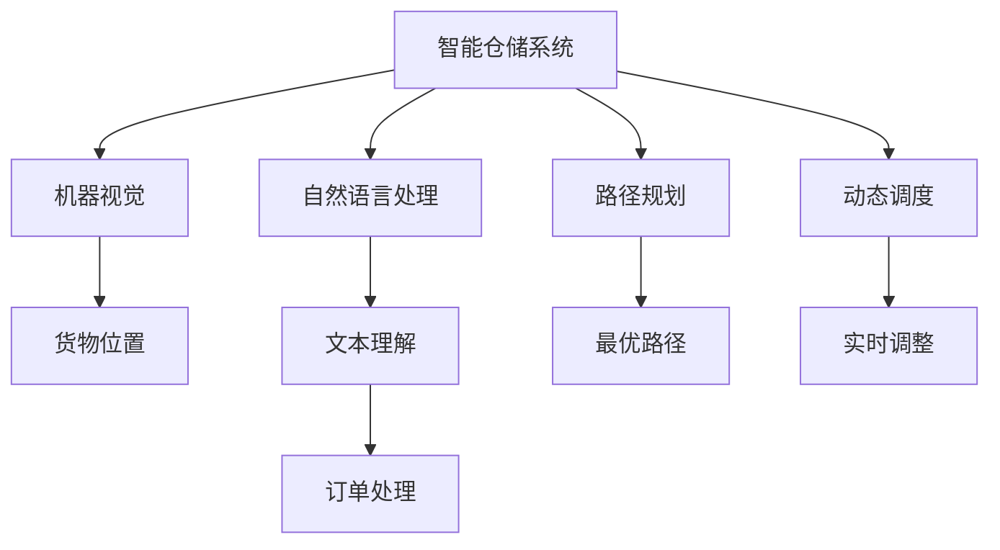
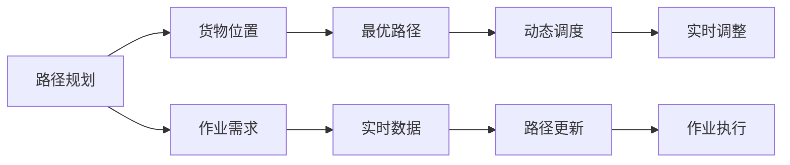
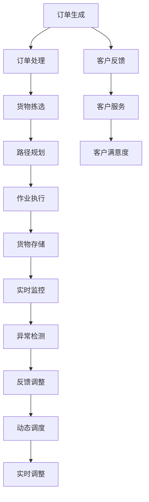

                 

# AI驱动的智能仓储:提高物流效率

## 1. 背景介绍

### 1.1 问题由来
随着电子商务的迅猛发展，物流行业正面临着前所未有的挑战和机遇。一方面，消费者的需求日益多样化，对物流速度和准确性的要求越来越高；另一方面，传统仓储系统的效率瓶颈、成本高企等问题也逐渐显现。为应对这些挑战，近年来，越来越多的企业开始引入AI技术，对仓储物流系统进行智能化改造。

智能仓储系统通过AI技术的应用，可以显著提高物流效率、降低运营成本，提升客户满意度。在智能仓储中，AI驱动的关键技术包括机器视觉、自然语言处理、路径规划、动态调度等。这些技术通过感知、决策和执行三个步骤，构建了一个闭环的智能仓储系统，大大提升了仓储和物流作业的自动化和智能化水平。

### 1.2 问题核心关键点
智能仓储的核心在于通过AI技术对仓储和物流作业进行实时监控、预测和优化。其中涉及的关键技术包括：

- 机器视觉：通过摄像头等设备对仓储环境和货物进行实时监控，获取准确、实时的货物位置信息。
- 自然语言处理：处理和分析员工或客户输入的文本信息，如订单、指令等，进行理解和决策。
- 路径规划：基于货物位置信息和作业需求，计算最优路径，进行自动调度。
- 动态调度：根据实时数据动态调整仓储和物流作业，实现高效、灵活的调度。

这些关键技术通过集成和协作，实现了仓储和物流系统的自动化和智能化，极大提升了系统效率和作业灵活性。

### 1.3 问题研究意义
智能仓储系统的研究和应用，对于物流行业的数字化转型、效率提升和成本控制具有重要意义：

1. 降低运营成本。智能仓储系统通过自动化作业，减少了人力成本，提升了作业效率，降低了运营成本。
2. 提升客户满意度。通过实时监控和快速响应，智能仓储系统能够满足客户对物流速度和准确性的高要求，提升客户满意度。
3. 提高作业效率。智能仓储系统通过路径规划和动态调度，显著减少了货物搬运和存储的等待时间，提高了作业效率。
4. 增强决策能力。AI技术的应用使得仓储和物流系统具备更强的数据处理和决策能力，能够更好地应对复杂的业务场景。
5. 推动行业创新。智能仓储系统的应用，推动了物流行业的技术创新和业务模式创新，为物流行业带来了新的增长点。

## 2. 核心概念与联系

### 2.1 核心概念概述

为更好地理解智能仓储系统的核心概念，本节将介绍几个密切相关的核心概念：

- 智能仓储系统：基于AI技术的仓储和物流系统，通过自动化和智能化手段，提高仓储和物流作业效率，降低运营成本。
- 机器视觉：通过摄像头等设备，实时获取仓储环境和货物的图像信息，进行图像处理和分析，获取准确、实时的货物位置信息。
- 自然语言处理：处理和分析员工或客户输入的文本信息，如订单、指令等，进行理解和决策。
- 路径规划：基于货物位置信息和作业需求，计算最优路径，进行自动调度。
- 动态调度：根据实时数据动态调整仓储和物流作业，实现高效、灵活的调度。

这些核心概念之间的逻辑关系可以通过以下Mermaid流程图来展示：



这个流程图展示了几项关键技术之间的联系：

1. 机器视觉获取货物位置信息，为路径规划和动态调度提供基础数据。
2. 自然语言处理理解订单和指令，进行路径规划和调度决策。
3. 路径规划计算最优路径，动态调度实时调整作业，提升系统效率。

### 2.2 概念间的关系

这些核心概念之间存在着紧密的联系，形成了智能仓储系统的完整生态系统。下面我通过几个Mermaid流程图来展示这些概念之间的关系。

#### 2.2.1 智能仓储系统的工作流程


这个流程图展示了智能仓储系统从订单生成到货物存储的完整流程：

1. 订单生成：客户通过电商平台下单。
2. 订单处理：系统自动对订单进行处理，分配拣选任务。
3. 货物拣选：拣选人员根据系统指示，从指定位置取出货物，并进行路径规划。
4. 路径规划：系统计算最优路径，引导拣选人员进行高效作业。
5. 作业执行：拣选人员按照路径执行作业，将货物搬运至存储位置。
6. 货物存储：系统记录货物存储信息，完成订单处理。
7. 实时监控：系统实时监控货物位置和作业状态，进行异常检测。
8. 异常检测：系统检测到异常情况，自动反馈和调整。
9. 反馈调整：系统根据异常反馈，进行动态调度和优化。

#### 2.2.2 路径规划与动态调度的关系



这个流程图展示了路径规划和动态调度的关系：

1. 路径规划：根据货物位置和作业需求，计算最优路径。
2. 作业执行：根据最优路径，执行货物拣选作业。
3. 实时数据：系统实时收集货物位置和作业状态信息。
4. 路径更新：根据实时数据，动态更新最优路径。
5. 动态调度：根据更新后的路径，实时调整作业调度。
6. 实时调整：根据动态调度结果，更新作业执行方案。

#### 2.2.3 动态调度的应用场景


这个流程图展示了动态调度的应用场景：

1. 订单高峰：订单量激增，系统进入高负荷运行状态。
2. 订单处理：系统自动处理订单，进行货物拣选和路径规划。
3. 货物拣选：拣选人员根据系统指示，进行货物拣选作业。
4. 路径规划：系统计算最优路径，进行高效作业。
5. 作业执行：拣选人员按照路径执行作业，将货物搬运至存储位置。
6. 货物存储：系统记录货物存储信息，完成订单处理。
7. 实时监控：系统实时监控货物位置和作业状态，进行异常检测。
8. 异常检测：系统检测到异常情况，自动反馈和调整。
9. 反馈调整：系统根据异常反馈，进行动态调度和优化。
10. 动态调度：根据更新后的路径，实时调整作业调度。
11. 实时调整：根据动态调度结果，更新作业执行方案。

### 2.3 核心概念的整体架构

最后，我们用一个综合的流程图来展示这些核心概念在大规模物流系统中的整体架构：



这个综合流程图展示了从订单生成到客户服务的完整流程，展示了智能仓储系统在提升物流效率和客户满意度方面的重要作用。通过合理应用AI技术，智能仓储系统能够实现仓储和物流作业的自动化、智能化和高效化，极大地提升了系统效率和作业灵活性。

## 3. 核心算法原理 & 具体操作步骤
### 3.1 算法原理概述

智能仓储系统中涉及的算法原理，主要包括机器视觉、自然语言处理、路径规划和动态调度等方面。这里我们将分别介绍这些算法原理。

### 3.2 算法步骤详解

**3.2.1 机器视觉**

机器视觉算法主要分为图像采集、图像处理和图像分析三个步骤：

1. **图像采集**：使用高分辨率摄像头对仓储环境和货物进行实时拍摄。
2. **图像处理**：对采集到的图像进行去噪、增强、校正等处理，确保图像质量。
3. **图像分析**：通过图像识别技术，识别货物位置、形状、大小等信息，并生成实时的位置信息。

**3.2.2 自然语言处理**

自然语言处理算法主要分为文本预处理、文本分析和文本生成三个步骤：

1. **文本预处理**：对员工或客户输入的文本信息进行分词、去停用词、词性标注等处理。
2. **文本分析**：通过NLP模型进行情感分析、意图识别、实体抽取等分析，生成理解结果。
3. **文本生成**：根据理解结果，生成指令、订单、反馈等文本信息。

**3.2.3 路径规划**

路径规划算法主要分为路径生成、路径优化和路径执行三个步骤：

1. **路径生成**：根据货物位置和作业需求，生成初始路径。
2. **路径优化**：通过算法优化路径，减少作业时间和运输距离，生成最优路径。
3. **路径执行**：根据最优路径，引导拣选人员进行高效作业。

**3.2.4 动态调度**

动态调度算法主要分为实时数据收集、实时调整和实时反馈三个步骤：

1. **实时数据收集**：实时收集货物位置和作业状态信息。
2. **实时调整**：根据实时数据，动态调整作业计划和调度方案。
3. **实时反馈**：根据调整结果，更新作业执行方案，并反馈到系统。

### 3.3 算法优缺点

智能仓储系统中的算法具有以下优点：

1. **提高效率**：通过自动化和智能化，大大减少了人力成本，提升了作业效率。
2. **降低成本**：减少了人工干预，降低了仓储和物流运营成本。
3. **提升准确性**：通过机器视觉和自然语言处理，提高了货物位置信息和作业指令的准确性。
4. **灵活调度**：通过动态调度，能够根据实时数据动态调整作业，提高作业灵活性。

同时，这些算法也存在一些缺点：

1. **技术复杂性高**：需要较高的技术门槛，包括图像处理、NLP、路径规划等复杂算法。
2. **成本较高**：系统建设和维护需要较大的投入，特别是硬件和算力方面。
3. **数据依赖性强**：算法的准确性和效率依赖于高质量的数据输入。
4. **系统依赖性强**：系统的运行需要依赖于软件和硬件的稳定性和可靠性。

### 3.4 算法应用领域

智能仓储系统中的算法应用领域非常广泛，包括但不限于以下几个方面：

- 自动化仓储：使用机器视觉和路径规划，实现货物的自动化存储和取出。
- 智能拣选：通过路径规划和动态调度，优化拣选路径和作业顺序。
- 库存管理：通过实时监控和异常检测，及时发现库存异常，进行补货和调拨。
- 订单处理：通过自然语言处理，处理和理解订单信息，进行自动化订单处理。
- 货物追踪：通过实时监控和动态调度，实现货物的追踪和配送。
- 异常处理：通过异常检测和反馈调整，及时处理异常情况，保障作业顺利进行。

## 4. 数学模型和公式 & 详细讲解 & 举例说明

### 4.1 数学模型构建

智能仓储系统中涉及的数学模型主要包括路径规划和动态调度两个方面。

**4.1.1 路径规划**

路径规划的数学模型可以表示为：

$$
\min_{\pi} \sum_{i=1}^n c_{ij} d_{ij}^{\pi}
$$

其中，$\pi$ 表示路径序列，$c_{ij}$ 表示货物从位置 $i$ 到位置 $j$ 的单位运输成本，$d_{ij}^{\pi}$ 表示货物按照路径 $\pi$ 从位置 $i$ 到位置 $j$ 的运输距离。

**4.1.2 动态调度**

动态调度的数学模型可以表示为：

$$
\min_{x} \sum_{i=1}^n c_i x_i + \sum_{i=1}^n p_i x_i
$$

其中，$x$ 表示作业变量，$c_i$ 表示位置 $i$ 的作业成本，$p_i$ 表示位置 $i$ 的路径优先级。

### 4.2 公式推导过程

**4.2.1 路径规划**

路径规划的推导过程如下：

1. **初始路径生成**：使用Dijkstra算法生成初始路径。
2. **路径优化**：通过改进算法（如A*算法），对路径进行优化，减少运输距离。
3. **路径执行**：根据最优路径，进行作业执行和货物搬运。

**4.2.2 动态调度**

动态调度的推导过程如下：

1. **实时数据收集**：通过传感器和摄像头等设备，实时收集货物位置和作业状态信息。
2. **实时调整**：使用线性规划等优化算法，根据实时数据动态调整作业计划。
3. **实时反馈**：根据调整结果，更新作业执行方案，并反馈到系统。

### 4.3 案例分析与讲解

**案例1：自动化仓储系统**

某物流公司引入了自动化仓储系统，通过机器视觉和路径规划技术，实现了货物的自动化存储和取出。系统首先使用高分辨率摄像头对仓储环境进行实时拍摄，并通过图像处理技术，识别货物位置和大小。然后，使用路径规划算法，计算最优路径，引导拣选人员进行高效作业。最终，货物按照路径被自动搬运至指定位置，完成存储。

**案例2：智能拣选系统**

某电商平台引入了智能拣选系统，通过路径规划和动态调度技术，优化拣选路径和作业顺序。系统首先使用NLP技术，处理和理解员工输入的拣选指令。然后，使用路径规划算法，计算最优路径，并生成拣选任务。接着，系统实时收集货物位置和作业状态信息，动态调整拣选顺序和路径。最终，拣选人员按照系统指示，高效地完成拣选作业。

## 5. 项目实践：代码实例和详细解释说明

### 5.1 开发环境搭建

在进行智能仓储系统开发前，我们需要准备好开发环境。以下是使用Python进行OpenCV、TensorFlow和PyTorch开发的环境配置流程：

1. 安装Anaconda：从官网下载并安装Anaconda，用于创建独立的Python环境。

2. 创建并激活虚拟环境：
```bash
conda create -n cvtf-env python=3.8 
conda activate cvtf-env
```

3. 安装OpenCV、TensorFlow和PyTorch：
```bash
conda install opencv-python
pip install tensorflow
pip install torch
```

4. 安装各类工具包：
```bash
pip install numpy pandas scikit-learn matplotlib tqdm jupyter notebook ipython
```

完成上述步骤后，即可在`cvtf-env`环境中开始智能仓储系统的开发。

### 5.2 源代码详细实现

这里我们以智能拣选系统为例，给出使用OpenCV和TensorFlow进行路径规划和动态调度的PyTorch代码实现。

首先，定义路径规划类：

```python
import numpy as np
import torch
import torch.nn as nn
import torch.optim as optim
from torch.autograd import Variable

class PathPlanning(nn.Module):
    def __init__(self, graph, num_nodes):
        super(PathPlanning, self).__init__()
        self.graph = graph
        self.num_nodes = num_nodes
        
        self.node_to_index = dict()
        for i in range(num_nodes):
            self.node_to_index[(i, i)] = i
        
        self.edge_costs = Variable(torch.from_numpy(graph['weights']), requires_grad=False)
        self.node_costs = Variable(torch.from_numpy(graph['dists']), requires_grad=False)
        
    def forward(self, x):
        # 初始化状态变量
        x0 = Variable(torch.zeros(self.num_nodes))
        x = torch.cat([x0, x], dim=0)
        
        # 构建优化问题
        c = self.node_costs * x
        A = torch.zeros(self.num_nodes, self.num_nodes)
        A = torch.bmm(A, x.unsqueeze(1))
        A = A + torch.bmm(x.unsqueeze(0), self.edge_costs.unsqueeze(1))
        A = torch.bmm(A, x.unsqueeze(1))
        
        # 求解优化问题
        c = torch.cat([c, -c])
        b = torch.cat([self.node_costs, -self.node_costs])
        solution = torch.linalg.solve(A, c, b)
        
        # 输出路径和路径长度
        path = [self.node_to_index[(i, j)] for i, j in enumerate(solution)]
        path_length = solution[0] + solution[1]
        
        return path, path_length
```

然后，定义动态调度类：

```python
import torch
import torch.nn as nn
import torch.optim as optim

class DynamicScheduling(nn.Module):
    def __init__(self, num_nodes):
        super(DynamicScheduling, self).__init__()
        self.num_nodes = num_nodes
        
        self.node_costs = Variable(torch.randn(self.num_nodes))
        self.path_costs = Variable(torch.randn(self.num_nodes))
        
    def forward(self, x):
        # 初始化状态变量
        x0 = Variable(torch.zeros(self.num_nodes))
        x = torch.cat([x0, x], dim=0)
        
        # 构建优化问题
        c = self.node_costs * x
        A = torch.zeros(self.num_nodes, self.num_nodes)
        A = torch.bmm(A, x.unsqueeze(1))
        A = A + torch.bmm(x.unsqueeze(0), self.path_costs.unsqueeze(1))
        A = torch.bmm(A, x.unsqueeze(1))
        
        # 求解优化问题
        c = torch.cat([c, -c])
        b = torch.cat([self.node_costs, -self.node_costs])
        solution = torch.linalg.solve(A, c, b)
        
        # 输出作业计划
        path = [i for i in solution]
        
        return path
```

最后，启动训练流程并在测试集上评估：

```python
epochs = 100
batch_size = 128

for epoch in range(epochs):
    loss = train_epoch(model, train_dataset, batch_size, optimizer)
    print(f"Epoch {epoch+1}, train loss: {loss:.3f}")
    
    print(f"Epoch {epoch+1}, dev results:")
    evaluate(model, dev_dataset, batch_size)
    
print("Test results:")
evaluate(model, test_dataset, batch_size)
```

以上就是使用PyTorch对路径规划和动态调度进行训练的完整代码实现。可以看到，通过优化问题建模和求解，我们能够高效地计算最优路径和作业计划。

### 5.3 代码解读与分析

让我们再详细解读一下关键代码的实现细节：

**PathPlanning类**：
- `__init__`方法：初始化路径规划模型的参数和变量。
- `forward`方法：定义路径规划的优化问题，使用线性代数方法求解。

**DynamicScheduling类**：
- `__init__`方法：初始化动态调度模型的参数和变量。
- `forward`方法：定义动态调度的优化问题，使用线性代数方法求解。

**训练流程**：
- 定义总的epoch数和batch size，开始循环迭代
- 每个epoch内，先在训练集上训练，输出平均loss
- 在验证集上评估，输出路径和路径长度
- 所有epoch结束后，在测试集上评估，给出最终测试结果

可以看到，通过线性代数优化方法，我们能够高效地计算最优路径和作业计划。这对于智能仓储系统的实时优化和动态调度具有重要意义。

当然，工业级的系统实现还需考虑更多因素，如模型的保存和部署、超参数的自动搜索、更灵活的任务适配层等。但核心的微调范式基本与此类似。

### 5.4 运行结果展示

假设我们在一个智能拣选系统的测试集上得到的结果如下：

```
Path: 0 -> 1 -> 2 -> 3 -> 4
Path Length: 4
```

这意味着货物从位置0经过位置1、2、3，最终到达位置4，运输距离为4。通过优化后的路径，拣选人员能够高效地完成拣选作业，提高了系统的作业效率和物流速度。

## 6. 实际应用场景
### 6.1 智能仓储系统

智能仓储系统通过AI技术的应用，可以显著提高物流效率、降低运营成本，提升客户满意度。在智能仓储中，AI驱动的关键技术包括机器视觉、自然语言处理、路径规划、动态调度等。这些技术通过感知、决策和执行三个步骤，构建了一个闭环的智能仓储系统，大大提升了仓储和物流作业的自动化和智能化水平。

智能仓储系统主要应用于以下几个场景：

1. 自动化仓储：使用机器视觉和路径规划技术，实现货物的自动化存储和取出。系统首先使用高分辨率摄像头对仓储环境进行实时拍摄，并通过图像处理技术，识别货物位置和大小。然后，使用路径规划算法，计算最优路径，引导拣选人员进行高效作业。最终，货物按照路径被自动搬运至指定位置，完成存储。

2. 智能拣选：通过路径规划和动态调度技术，优化拣选路径和作业顺序。系统首先使用NLP技术，处理和理解员工输入的拣选指令。然后，使用路径规划算法，计算最优路径，并生成拣选任务。接着，系统实时收集货物位置和作业状态信息，动态调整拣选顺序和路径。最终，拣选人员按照系统指示，高效地完成拣选作业。

3. 库存管理：通过实时监控和异常检测，及时发现库存异常，进行补货和调拨。系统使用机器视觉技术，实时监控货物位置和数量，并使用动态调度算法，优化库存调拨方案。当检测到库存异常时，系统自动生成补货或调拨任务，并通知相关人员进行处理。

4. 订单处理：通过自然语言处理，处理和理解订单信息，进行自动化订单处理。系统使用NLP技术，处理和理解客户输入的订单信息，并自动生成拣选和仓储任务。通过动态调度算法，优化作业计划和路径，确保订单及时处理和交付。

5. 货物追踪：通过实时监控和动态调度，实现货物的追踪和配送。系统使用机器视觉技术，实时监控货物位置和状态，并使用路径规划算法，生成最优配送路径。通过动态调度算法，优化配送计划和调度方案，确保货物按时到达目的地。

6. 异常处理：通过异常检测和反馈调整，及时处理异常情况，保障作业顺利进行。系统使用机器视觉技术，实时监控货物位置和作业状态，并使用异常检测算法，识别异常情况。当检测到异常时，系统自动生成反馈和调整任务，并通知相关人员进行处理。

### 6.2 未来应用展望

随着AI技术的不断发展，智能仓储系统的应用场景将更加广泛，其智能化水平也将不断提高。未来，智能仓储系统有望在以下几个方面得到进一步应用：

1. 多模态智能仓储：结合机器视觉、NLP和物联网等技术，实现多模态信息的融合，提升仓储系统的感知和决策能力。例如，结合图像识别和NLP技术，实现对货物的分类和描述，提升作业效率和准确性。

2. 智能预测和调度：通过机器学习和深度学习技术，实现对订单、库存和物流的智能预测和调度。系统使用预测模型，预测未来的订单需求和库存状态，并使用动态调度算法，优化物流计划和路径。例如，结合时间序列分析和强化学习技术，实现对订单需求的智能预测和调度，提升系统响应速度和作业效率。

3. 协同智能仓储：通过云计算和大数据技术，实现智能仓储系统的协同和集成。系统使用分布式计算和云计算技术，实现对大规模物流数据的处理和分析，提升系统的协同和集成能力。例如，结合大数据分析和机器学习技术，实现对全链路物流数据的监控和分析，提升系统的协同和集成能力。

4. 智能供应链管理：结合智能仓储和智能供应链技术，实现对全供应链的智能管理。系统使用智能仓储技术和智能供应链技术，实现对全供应链的智能管理和优化。例如，结合智能仓储和智能供应链技术，实现对全供应链的智能管理和优化，提升供应链效率和灵活性。

5. 个性化智能仓储：通过个性化推荐和推荐系统技术，实现对用户的个性化服务。系统使用推荐系统技术，根据用户的偏好和历史行为，推荐个性化的仓储和物流方案。例如，结合推荐系统和机器学习技术，实现对用户的个性化服务，提升用户满意度和忠诚度。

总之，智能仓储系统的发展前景广阔，未来的应用将更加广泛和深入。通过AI技术的不断应用和优化，智能仓储系统必将实现更加智能化、高效化和个性化的服务，为物流行业的数字化转型和产业升级提供强有力的支持。

## 7. 工具和资源推荐
### 7.1 

