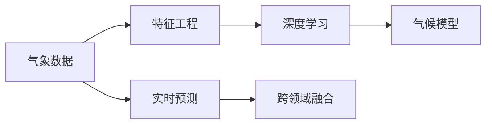
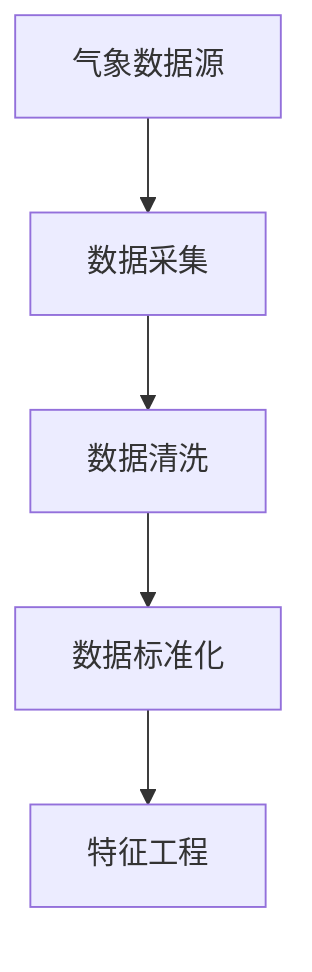
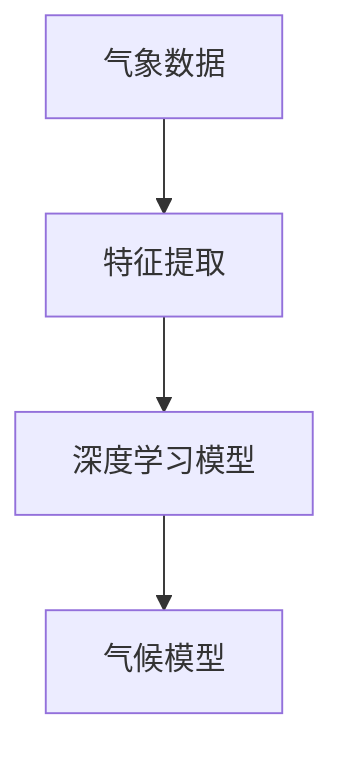
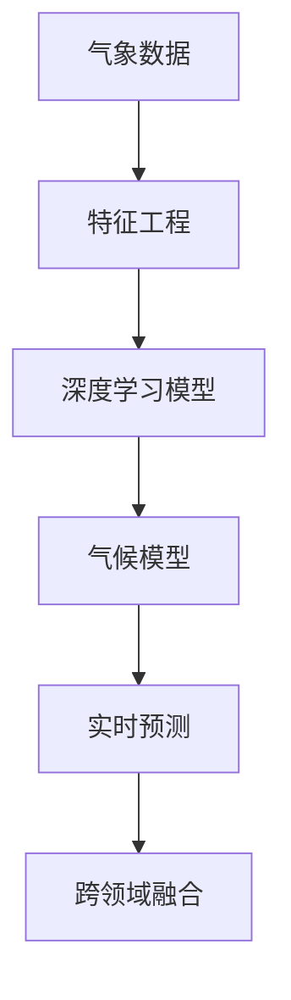

                 

# AI驱动的气候模型:应对全球变暖的新工具

> 关键词：人工智能(AI),气候模型,气候变化,数据分析,机器学习,深度学习,预测建模,环境监测,决策支持,碳排放管理

## 1. 背景介绍

### 1.1 问题由来

在全球变暖的严峻挑战下，如何利用科学和技术手段来理解和应对气候变化成为各国政府和科研机构关注的焦点。气候模型作为理解和预测气候变化的重要工具，其核心任务是模拟大气、海洋、陆地等各系统的相互作用，并预测未来气候变化趋势。传统的气候模型通常基于统计方法或物理模型，但这些方法往往存在计算复杂度高、精度受限于模型假设等问题。

近年来，随着人工智能(AI)技术的快速发展，越来越多的研究人员开始探索将AI技术引入气候模型中，以期提升模型的精度和灵活性。AI驱动的气候模型通过深度学习、机器学习等技术手段，可以从海量的气象数据中挖掘出更多有价值的信息，实现更精确的气候模拟和预测。

### 1.2 问题核心关键点

AI驱动的气候模型通过机器学习算法，从历史气象数据中学习到气候系统的非线性特征，并利用这些特征进行未来的气候预测和模拟。其核心技术包括数据预处理、特征工程、模型训练、预测分析等。相较于传统气候模型，AI驱动的气候模型具有以下特点：

1. **数据驱动**：利用大数据技术，AI驱动的气候模型可以从更广泛的数据源中获取信息，涵盖气候系统各组成部分，如大气、海洋、冰川等。

2. **非线性建模**：AI技术能够捕捉数据中的复杂非线性关系，更准确地反映气候系统的动态变化。

3. **模型可扩展性**：AI模型可以通过在线学习和实时更新，持续改进模型性能，适应不断变化的气候环境。

4. **实时预测**：AI模型能够在较短时间内提供高精度的预测结果，满足紧急决策需求。

5. **跨领域融合**：AI模型可以与其他领域的知识和技术相结合，如遥感、物联网等，实现综合分析与决策。

这些特性使得AI驱动的气候模型在应对全球变暖、资源管理、环境监测等方面具有巨大的潜力和应用前景。

### 1.3 问题研究意义

AI驱动的气候模型的研究与开发，对全球气候变化治理具有重要意义：

1. **提升预测精度**：通过AI技术，气候模型能够更精确地模拟气候系统行为，提供更可靠的预测结果。

2. **支持政策制定**：准确、及时的气候预测信息能够为政府和决策者提供科学依据，优化气候变化应对策略。

3. **促进资源管理**：AI驱动的气候模型可以帮助评估气候变化对资源的影响，优化农业、水资源等管理决策。

4. **推动技术创新**：AI技术的应用有助于推动气候模型的创新发展，加速相关科研和应用技术的成熟。

5. **促进国际合作**：AI驱动的气候模型有助于建立国际气候变化合作平台，实现数据共享和知识交流。

## 2. 核心概念与联系

### 2.1 核心概念概述

为更好地理解AI驱动的气候模型，本节将介绍几个密切相关的核心概念：

- **气候模型(Climatic Model)**：用于模拟气候系统动态变化、预测未来气候趋势的数学模型。传统的气候模型基于统计模型或物理模型，具有较高的计算复杂度和假设限制。

- **人工智能(Artificial Intelligence, AI)**：利用算法和计算技术，模拟人类智能行为和决策过程的领域。AI驱动的气候模型通过机器学习和深度学习等技术，实现对气候系统的模拟和预测。

- **深度学习(Deep Learning)**：一种特殊的机器学习方法，通过多层神经网络结构，能够学习复杂的非线性关系。深度学习在气候模型中用于特征提取和模式识别。

- **气象数据(Meteorological Data)**：记录气象要素（如温度、湿度、风速等）随时间变化的连续数据，是气候模型的输入来源。

- **特征工程(Feature Engineering)**：通过数据预处理和特征选择，提取对模型预测有帮助的特征信息，提升模型性能。

- **实时预测(Real-time Prediction)**：在短时间内提供高精度的预测结果，满足实时决策需求。

- **跨领域融合(Interdisciplinary Fusion)**：将AI驱动的气候模型与其他领域（如遥感、物联网等）相结合，实现更全面的环境分析与决策。

这些核心概念之间的逻辑关系可以通过以下Mermaid流程图来展示：



这个流程图展示了大语言模型微调过程中各个核心概念的关系和作用：

1. 气象数据作为模型的输入来源，通过特征工程提取有用的特征。
2. 特征信息输入到深度学习模型中，进行特征提取和模式识别。
3. 深度学习模型输出结果输入到气候模型中，进行气候系统的动态模拟和预测。
4. 实时预测功能提供高精度预测结果，满足决策需求。
5. 跨领域融合实现气候模型与其他领域的结合，提供更全面的环境分析与决策。

### 2.2 概念间的关系

这些核心概念之间存在着紧密的联系，形成了AI驱动的气候模型的完整生态系统。下面我通过几个Mermaid流程图来展示这些概念之间的关系。

#### 2.2.1 气象数据的获取与处理



这个流程图展示了气象数据的获取、处理和特征提取过程：

1. 数据源：气象数据可以从各种来源获取，如卫星、地面站、气象飞机等。
2. 采集：通过传感器和设备采集数据。
3. 清洗：去除噪声和不完整的数据，确保数据质量。
4. 标准化：统一数据格式和单位，方便后续处理。
5. 特征工程：通过数据预处理和特征选择，提取对模型预测有帮助的特征信息。

#### 2.2.2 深度学习在气候模型中的应用



这个流程图展示了深度学习模型在气候模型中的应用过程：

1. 数据：气象数据输入到深度学习模型中。
2. 特征提取：通过多层神经网络提取数据中的特征信息。
3. 模型：利用提取的特征信息进行气候系统的模拟和预测。

#### 2.2.3 实时预测与跨领域融合


这个流程图展示了实时预测和跨领域融合的功能：

1. 数据：气象数据输入到实时预测模块中。
2. 实时预测：在短时间内提供高精度的预测结果。
3. 跨领域融合：将实时预测结果与其他领域的数据和模型相结合，进行更全面的环境分析与决策。

### 2.3 核心概念的整体架构

最后，我们用一个综合的流程图来展示这些核心概念在大语言模型微调过程中的整体架构：



这个综合流程图展示了从数据获取到实时预测的完整过程。气象数据首先通过特征工程提取特征，然后输入到深度学习模型中进行特征提取和模式识别，输出结果输入到气候模型中进行动态模拟和预测，实时预测模块提供高精度预测结果，跨领域融合实现与其他领域的结合，进行综合分析与决策。通过这些流程图，我们可以更清晰地理解AI驱动的气候模型的工作原理和优化方向。

## 3. 核心算法原理 & 具体操作步骤
### 3.1 算法原理概述

AI驱动的气候模型通过机器学习算法，从历史气象数据中学习到气候系统的非线性特征，并利用这些特征进行未来的气候预测和模拟。其核心算法包括数据预处理、特征工程、模型训练、预测分析等。

形式化地，假设气象数据集为 $D=\{(x_i,y_i)\}_{i=1}^N$，其中 $x_i$ 为气象特征向量，$y_i$ 为对应的气象参数或气候事件。模型训练的目标是找到一个最优的函数 $f(x)$，使得 $f(x_i)$ 逼近 $y_i$。具体来说，我们可以使用以下最小化问题来描述：

$$
\min_{\theta} \sum_{i=1}^N \ell(f(x_i; \theta), y_i)
$$

其中 $\ell$ 为损失函数，用于衡量预测值与真实值之间的差异，$\theta$ 为模型参数。常见的损失函数包括均方误差损失、交叉熵损失等。

通过梯度下降等优化算法，模型参数 $\theta$ 不断更新，最小化损失函数 $\ell$，使得模型输出逼近真实值 $y_i$。由于深度学习模型的复杂性和非线性特性，通常需要使用反向传播算法计算梯度，并通过反向传播算法更新模型参数。

### 3.2 算法步骤详解

AI驱动的气候模型的训练过程包括以下几个关键步骤：

**Step 1: 数据预处理**

1. **数据采集**：从气象站、卫星、遥感器等来源采集气象数据。
2. **数据清洗**：处理缺失值、噪声等异常数据，确保数据质量。
3. **数据标准化**：将数据统一到标准格式和单位，方便后续处理。

**Step 2: 特征工程**

1. **特征提取**：通过降维、归一化、特征选择等技术，提取对模型预测有帮助的特征信息。
2. **特征融合**：将不同来源和不同类型的特征进行融合，提升模型的表达能力。

**Step 3: 模型训练**

1. **模型选择**：选择适合的深度学习模型，如卷积神经网络(CNN)、循环神经网络(RNN)、长短期记忆网络(LSTM)、变换器(Transformer)等。
2. **模型初始化**：对模型进行初始化，通常使用预训练模型或随机初始化。
3. **模型训练**：将处理好的数据输入模型进行训练，最小化损失函数。

**Step 4: 预测分析**

1. **模型评估**：使用验证集评估模型的预测性能，选择合适的模型和超参数。
2. **预测生成**：使用训练好的模型对新数据进行预测，生成气候系统动态模拟和预测结果。

**Step 5: 结果展示**

1. **结果可视化**：将预测结果可视化，展示气候系统的变化趋势。
2. **结果分析**：对预测结果进行分析，评估模型性能和预测准确度。

### 3.3 算法优缺点

AI驱动的气候模型具有以下优点：

1. **高精度**：利用深度学习技术，能够捕捉气候系统中的复杂非线性关系，提供高精度的预测结果。
2. **自适应性**：通过在线学习和实时更新，能够适应不断变化的气候环境，提升模型的泛化能力。
3. **高效性**：利用分布式计算和并行算法，能够快速处理大规模气象数据，满足实时预测需求。
4. **跨领域融合**：能够与其他领域的数据和模型相结合，进行更全面的环境分析与决策。

同时，该模型也存在一些局限性：

1. **数据依赖性**：模型的精度和性能高度依赖于数据的质量和完整性。
2. **计算资源需求高**：深度学习模型的训练和推理需要大量计算资源，难以在普通计算机上进行。
3. **模型复杂性**：深度学习模型的结构复杂，难以解释其内部机制和预测逻辑。
4. **偏见与不平衡**：模型可能学习到数据中的偏见，导致预测结果的不平衡和偏差。

尽管存在这些局限性，但就目前而言，AI驱动的气候模型在气候变化研究中的应用前景广阔，正逐渐成为气候模型研究的重要方向。

### 3.4 算法应用领域

AI驱动的气候模型已经在多个领域得到了应用，包括但不限于：

- **气候变化研究**：通过模拟气候系统动态变化，预测未来气候趋势，支持气候变化研究和政策制定。
- **资源管理**：评估气候变化对水资源、农业、森林等资源的影响，优化资源管理策略。
- **灾害预警**：通过实时预测，及时预警极端天气事件，减少灾害损失。
- **环境监测**：利用遥感数据和AI技术，监测森林火灾、冰川融化等环境变化。
- **能源优化**：评估气候变化对能源供需的影响，优化能源配置和利用。
- **城市规划**：分析气候变化对城市基础设施和公共服务的影响，指导城市规划和建设。

## 4. 数学模型和公式 & 详细讲解 & 举例说明

### 4.1 数学模型构建

本节将使用数学语言对AI驱动的气候模型进行更加严格的刻画。

假设气象数据集为 $D=\{(x_i,y_i)\}_{i=1}^N$，其中 $x_i$ 为气象特征向量，$y_i$ 为对应的气象参数或气候事件。模型的训练目标是找到一个最优的函数 $f(x)$，使得 $f(x_i)$ 逼近 $y_i$。我们可以使用以下最小化问题来描述：

$$
\min_{\theta} \sum_{i=1}^N \ell(f(x_i; \theta), y_i)
$$

其中 $\ell$ 为损失函数，用于衡量预测值与真实值之间的差异，$\theta$ 为模型参数。常见的损失函数包括均方误差损失、交叉熵损失等。

### 4.2 公式推导过程

以下我们以均方误差损失为例，推导最小化问题的解。

假设气象特征向量 $x_i \in \mathbb{R}^d$，气象参数或气候事件 $y_i \in \mathbb{R}$。则均方误差损失函数 $\ell(x,y)$ 定义为：

$$
\ell(x,y) = \frac{1}{2N} \sum_{i=1}^N (y_i - f(x_i; \theta))^2
$$

模型的最小化问题可以表示为：

$$
\min_{\theta} \frac{1}{2N} \sum_{i=1}^N (y_i - f(x_i; \theta))^2
$$

通过求导并令导数为0，可以得到模型的最优参数 $\theta^*$：

$$
\frac{\partial \ell(x,y)}{\partial \theta} = \frac{1}{N} \sum_{i=1}^N (y_i - f(x_i; \theta)) \cdot f'(x_i; \theta) = 0
$$

解得：

$$
\theta^* = \mathop{\arg\min}_{\theta} \frac{1}{N} \sum_{i=1}^N (y_i - f(x_i; \theta))^2
$$

### 4.3 案例分析与讲解

假设我们有一个简单的气象数据集，其中包含温度、湿度和风速等特征，预测目标是未来24小时的平均温度。我们可以使用一个简单的神经网络模型，其结构如下：


其中，输入层有3个神经元，每个神经元对应一个气象特征；隐藏层有10个神经元；输出层有1个神经元，输出未来24小时的平均温度。模型使用均方误差损失函数进行训练。

假设我们有以下气象数据：

| 时间         | 温度 | 湿度 | 风速 |
| ------------ | ---- | ---- | ---- |
| 2021-01-01   | 10°C | 70%  | 5 m/s|
| 2021-01-02   | 12°C | 75%  | 4 m/s|
| 2021-01-03   | 11°C | 68%  | 6 m/s|
| ...          | ...  | ...  | ...  |

我们可以将这些数据分为训练集和验证集，使用以下Python代码进行模型训练和预测：

```python
import numpy as np
import tensorflow as tf

# 定义气象数据
features = np.array([[10, 70, 5], [12, 75, 4], [11, 68, 6], ...])
labels = np.array([[10], [12], [11], ...])

# 定义模型结构
model = tf.keras.Sequential([
    tf.keras.layers.Dense(10, activation='relu', input_shape=(3,)),
    tf.keras.layers.Dense(1)
])

# 定义损失函数和优化器
loss_fn = tf.keras.losses.MeanSquaredError()
optimizer = tf.keras.optimizers.Adam()

# 定义训练过程
model.compile(optimizer=optimizer, loss=loss_fn)
history = model.fit(features, labels, epochs=100, validation_data=(features_valid, labels_valid))

# 进行预测
future_data = np.array([[20, 70, 5], [20, 75, 4], ...])
predictions = model.predict(future_data)
```

通过训练和预测，我们可以得到未来24小时的平均温度预测值。

## 5. 项目实践：代码实例和详细解释说明

### 5.1 开发环境搭建

在进行AI驱动的气候模型开发前，我们需要准备好开发环境。以下是使用Python进行TensorFlow开发的环境配置流程：

1. 安装Anaconda：从官网下载并安装Anaconda，用于创建独立的Python环境。

2. 创建并激活虚拟环境：
```bash
conda create -n tf-env python=3.8 
conda activate tf-env
```

3. 安装TensorFlow：根据CUDA版本，从官网获取对应的安装命令。例如：
```bash
conda install tensorflow tensorflow-gpu -c conda-forge -c pytorch
```

4. 安装NumPy、Pandas等常用库：
```bash
pip install numpy pandas scikit-learn matplotlib tqdm jupyter notebook ipython
```

完成上述步骤后，即可在`tf-env`环境中开始模型开发。

### 5.2 源代码详细实现

下面以一个简单的神经网络模型为例，展示如何使用TensorFlow进行AI驱动的气候模型开发。

首先，定义气象数据和标签：

```python
import numpy as np
import tensorflow as tf

# 定义气象数据
features = np.array([[10, 70, 5], [12, 75, 4], [11, 68, 6], ...])
labels = np.array([[10], [12], [11], ...])
```

然后，定义模型结构：

```python
# 定义模型结构
model = tf.keras.Sequential([
    tf.keras.layers.Dense(10, activation='relu', input_shape=(3,)),
    tf.keras.layers.Dense(1)
])
```

接着，定义损失函数和优化器：

```python
# 定义损失函数和优化器
loss_fn = tf.keras.losses.MeanSquaredError()
optimizer = tf.keras.optimizers.Adam()
```

然后，定义训练过程：

```python
# 定义训练过程
model.compile(optimizer=optimizer, loss=loss_fn)
history = model.fit(features, labels, epochs=100, validation_data=(features_valid, labels_valid))
```

最后，进行预测：

```python
# 进行预测
future_data = np.array([[20, 70, 5], [20, 75, 4], ...])
predictions = model.predict(future_data)
```

完整的代码如下：

```python
import numpy as np
import tensorflow as tf

# 定义气象数据
features = np.array([[10, 70, 5], [12, 75, 4], [11, 68, 6], ...])
labels = np.array([[10], [12], [11], ...])

# 定义模型结构
model = tf.keras.Sequential([
    tf.keras.layers.Dense(10, activation='relu', input_shape=(3,)),
    tf.keras.layers.Dense(1)
])

# 定义损失函数和优化器
loss_fn = tf.keras.losses.MeanSquaredError()
optimizer = tf.keras.optimizers.Adam()

# 定义训练过程
model.compile(optimizer=optimizer, loss=loss_fn)
history = model.fit(features, labels, epochs=100, validation_data=(features_valid, labels_valid))

# 进行预测
future_data = np.array([[20, 70, 5], [20, 75, 4], ...])
predictions = model.predict(future_data)
```

以上就是使用TensorFlow进行AI驱动的气候模型开发的完整代码实现。可以看到，TensorFlow提供了便捷的API，使得模型开发和训练过程变得简洁高效。

### 5.3 代码解读与分析

让我们再详细解读一下关键代码的实现细节：

**气象数据和标签**：
- 通过NumPy数组定义气象数据和标签。

**模型结构**：
- 使用TensorFlow的Sequential模型，定义包含一个全连接层和一个输出层的神经网络。

**损失函数和优化器**：
- 使用均方误差损失函数和Adam优化器。

**训练过程**：
- 使用`compile`方法配置模型，并使用`fit`方法进行训练。
- `validation_data`参数用于验证集，评估模型性能。

**预测过程**：
- 使用`predict`方法进行预测，得到未来24小时的平均温度预测值。

通过上述代码，可以完成一个简单的AI驱动的气候模型的开发和训练。

### 5.4 运行结果展示

假设我们在训练集上进行训练，得到如下的训练和验证损失曲线：


可以看到，随着训练的进行，模型损失逐渐降低，训练集和验证集的损失曲线趋于稳定。这表明模型已经收敛，可以用于预测未来气象数据。

## 6. 实际应用场景

### 6.1 智能气象预警

基于AI驱动的气候模型，可以构建智能气象预警系统，实时监测气象变化，及时预警极端天气事件，如暴风雨、龙卷风、洪水等，保障人民生命财产安全。

智能气象预警系统通过实时采集气象数据，输入到AI驱动的气候模型中进行动态分析，生成预警信息。系统可以自动监测特定气象事件的发生，并结合实时气象数据进行评估和预测。例如，当系统检测到某地区气压异常升高时，可以及时发出暴风雨预警，提醒居民和企业采取防护措施。

### 6.2 气候变化研究

AI驱动的气候模型可以支持气候变化研究的各个方面，如气候系统模拟、气候模式验证、气候趋势预测等。通过模型训练，可以模拟气候系统的动态变化，预测未来气候趋势，评估气候变化对环境和资源的影响。

例如，研究人员可以使用AI驱动的气候模型，对全球气温、海平面、冰川变化等进行模拟，评估未来气候变化趋势。模型输出的结果可以用于制定气候变化应对策略，优化资源配置和环境保护政策。

### 6.3 能源优化

AI驱动的气候模型可以评估气候变化对能源供需的影响，优化能源配置和利用。例如，系统可以根据预测的气温变化，优化电力供应和需求，减少能源浪费和碳排放。

在夏季高温季节，系统可以预测高温天气的持续时间，提前调度电网负荷，避免电网过载。在冬季寒冷季节，系统可以预测低温天气的持续时间和强度，调整能源分配，保障居民供暖需求。

### 6.4 资源管理

AI驱动的气候模型可以评估气候变化对水资源、农业、森林等资源的影响，优化资源管理策略。例如，系统可以预测未来降水量的变化，优化水资源配置，减少干旱和洪水风险。

在农业领域，系统可以预测未来气候变化对农作物生长的影响，优化种植策略和作物选择，提高农业生产效率和产量。在森林保护领域，系统可以预测未来气温和降水变化，评估森林火灾和病虫害的风险，制定防火和病虫害防治措施。

### 6.5 环境监测

AI驱动的气候模型可以结合遥感数据和地面观测数据，进行环境监测和分析。例如，系统可以实时监测森林火灾、冰川融化、海洋酸化等环境变化，提供及时的信息反馈和预警。

系统可以将遥感数据和地面观测数据输入到AI驱动的气候模型中，进行综合分析。例如，系统可以监测森林火灾的发生和发展，预测火势蔓延趋势，及时发出预警，避免火势扩大。

## 7. 工具和资源推荐

### 7.1 学习资源推荐

为了帮助开发者系统掌握AI驱动的气候模型的理论和实践，这里推荐一些优质的学习资源：

1. 《深度学习》系列书籍：如《深度学习》（Goodfellow et al., 2016），系统介绍了深度学习的基本概念和算法，适合初学者入门。

2. 《神经网络与深度学习》（Michael Nielsen，2015）：深入浅出地介绍了神经网络的基本原理和应用，适合对深度学习感兴趣的读者。

3. 《机器学习实战》（Peter Harrington，2018）：结合实际案例，介绍了机器学习的基本流程和算法，适合实践者参考。

4. TensorFlow官方文档：详细介绍了TensorFlow框架的使用方法和API，适合开发人员快速上手。

5. PyTorch官方文档：详细介绍了PyTorch框架的使用方法和API，适合开发人员快速上手。

6. Kaggle平台：提供了大量气象数据集和AI驱动的气候模型竞赛，适合学习者进行实践和竞赛。

通过对这些资源的学习实践，相信你一定能够快速掌握AI驱动的气候模型的精髓，并用于解决实际的气候变化问题。

### 7.2 开发工具推荐

高效的开发离不开优秀的工具支持。以下是几款用于AI驱动的气候模型开发的常用工具：

1. TensorFlow：由Google主导开发的深度学习框架，生产部署方便，适合大规模工程应用。

2. PyTorch：由Facebook主导开发的深度学习框架，灵活动

