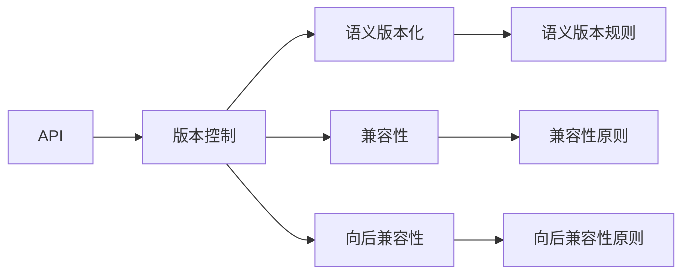
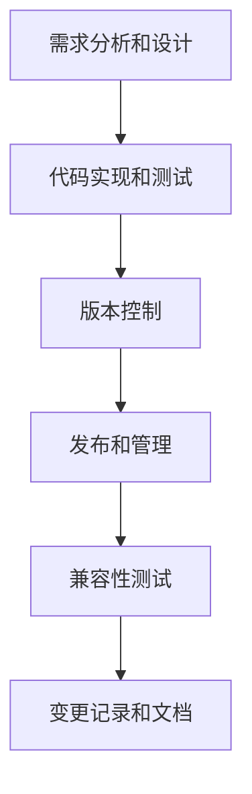

                 

# API 版本控制的重要性

## 1. 背景介绍

### 1.1 问题由来
在软件开发过程中，API（Application Programming Interface，应用程序接口）扮演着至关重要的角色。它定义了应用程序之间通信的接口和协议，是软件系统互操作性的基石。然而，API的频繁变化往往会导致依赖其的应用程序发生错误，影响系统的稳定性和可靠性。这种场景下，版本控制就显得尤为重要。

### 1.2 问题核心关键点
版本控制旨在维护API的稳定性，通过记录API的变更历史，使得依赖者能够及时响应版本变化，避免因API变更带来的问题。API版本控制的目的是在保证软件演进的同时，确保旧版本API的稳定和可用。

### 1.3 问题研究意义
API版本控制的实现，对于保障系统稳定性和可靠性，降低软件演进中的风险，具有重要意义。它不仅能帮助开发者快速定位问题，还为代码审查、重构提供了方便，同时也有助于维护API的持续演进和兼容性。

## 2. 核心概念与联系

### 2.1 核心概念概述

为了深入理解API版本控制的重要性和具体实现方法，本节将介绍几个关键概念：

- API：定义了应用程序之间交互的接口和协议，是软件系统互操作性的基石。
- 版本控制：记录和管理软件变更历史的过程，通过版本标签（Tags）和提交记录（Commits）来跟踪变化。
- 兼容性和向后兼容性：保证新版本的API与旧版本兼容，使得旧版本的应用程序能够继续运行。
- 语义版本化：使用符合语义规则的版本编号，明确变更内容，帮助依赖者理解变更影响。
- REST API：使用HTTP协议进行通信的API，通常采用RESTful架构设计，支持多种HTTP方法和资源操作。

这些核心概念之间通过版本控制和API设计规范形成紧密联系，共同构成API版本控制的完整框架。

### 2.2 概念间的关系

通过以下Mermaid流程图展示API版本控制各概念之间的关联关系：



### 2.3 核心概念的整体架构

在API版本控制的框架下，API的演进和管理流程可以用以下综合的流程图表示：



这个流程图展示了从需求设计到发布管理的API版本控制全流程。API通过版本控制确保每次变更都有记录，在发布过程中通过兼容性测试和变更记录来保证旧版本API的稳定性，同时更新文档以便于用户理解。

## 3. 核心算法原理 & 具体操作步骤

### 3.1 算法原理概述

API版本控制的核心原理是通过版本控制工具记录和管理API的变更历史，确保每次变更都有记录和回溯能力。这主要包括：

1. **版本标签（Tags）**：标记API的发布版本，便于用户引用和使用。
2. **提交记录（Commits）**：记录每次变更的具体内容和原因，便于追踪变更历史。
3. **兼容性和向后兼容性**：确保新版本的API与旧版本兼容，使得旧版本的应用程序能够继续运行。

### 3.2 算法步骤详解

以下是API版本控制的具体操作步骤：

**Step 1: 需求分析和设计**
- 通过需求分析明确API的设计目标和接口规范。
- 设计API接口的详细描述和示例。

**Step 2: 代码实现和测试**
- 实现API的代码，并进行功能测试和性能测试。
- 提交代码变更到版本控制系统中，记录变更内容和原因。

**Step 3: 版本控制**
- 创建版本标签（Tags），标记每次发布的API版本。
- 记录提交记录（Commits），详细描述每次变更的具体内容和原因。

**Step 4: 发布和管理**
- 将API的变更推送到部署环境，进行兼容性测试。
- 更新API的文档和示例，以便用户了解变更。

**Step 5: 兼容性测试**
- 测试新版本的API与旧版本是否兼容。
- 确保新版本的API不会破坏旧版本的应用程序。

**Step 6: 变更记录和文档**
- 记录每次API变更的具体影响和兼容性信息。
- 更新API文档，以便用户了解变更和使用方法。

通过这些步骤，API版本控制确保了每次变更都有记录和回溯能力，同时通过兼容性测试和变更记录来保证旧版本API的稳定性，使得系统能够持续演进和兼容旧版本应用程序。

### 3.3 算法优缺点

API版本控制的主要优点包括：

1. **历史记录和回溯能力**：通过版本控制工具记录和管理API的变更历史，便于追踪和回溯。
2. **兼容性和向后兼容性**：确保新版本的API与旧版本兼容，使得旧版本的应用程序能够继续运行。
3. **变更记录和文档更新**：记录每次变更的具体内容和原因，更新文档以便于用户理解变更。

其主要缺点包括：

1. **增加开发和维护成本**：API版本控制需要记录和管理变更历史，增加了开发和维护的成本。
2. **管理复杂性**：API版本控制涉及多种策略和规则，管理复杂性较高。

尽管如此，API版本控制在保障API稳定性和可用性方面仍然具有不可替代的作用，尤其是在大型和复杂的软件系统中。

### 3.4 算法应用领域

API版本控制的应用领域广泛，包括但不限于以下领域：

- 企业级API管理：如GitHub、GitLab等代码托管平台提供的API版本控制功能，帮助企业管理API变更历史和兼容性。
- 云服务提供商：如AWS、Azure等云平台提供的API版本控制功能，帮助开发者管理API的变更和兼容性。
- 开源社区：如OpenAPI、Swagger等API设计规范，帮助开发者设计和管理API变更历史。
- 移动应用和Web应用：如React、Angular等框架提供的版本控制和兼容性管理工具，帮助开发者管理API变更和兼容性。

## 4. 数学模型和公式 & 详细讲解 & 举例说明

### 4.1 数学模型构建

API版本控制的数学模型主要涉及版本标签和提交记录的管理，可以简单地表示为一个有向无环图（DAG），其中节点表示API版本和提交记录，边表示变更关系。

记API版本为 $V$，提交记录为 $C$，则API版本控制模型的基本结构为：

$$
V \rightarrow C \rightarrow V
$$

其中，箭头表示变更关系，即一个提交记录可能导致API版本的更新。

### 4.2 公式推导过程

以下推导API版本控制模型的基本公式，并举例说明：

假设API有3个版本，版本号分别为V1、V2、V3，通过3次提交更新API。第一次提交增加了新功能，版本号从V1更新到V2；第二次提交修复了bug，版本号从V2更新到V3；第三次提交进行了API的重大重构，版本号从V3更新回V1。这3次变更的关系可以表示为：

$$
V_1 \rightarrow C_1 \rightarrow V_2 \rightarrow C_2 \rightarrow V_3 \rightarrow C_3 \rightarrow V_1
$$

其中，$C_1, C_2, C_3$ 分别表示3次提交记录。

### 4.3 案例分析与讲解

以GitHub为例，分析其如何实现API版本控制：

1. **创建和提交变更**：开发者通过GitHub提交代码变更，并描述变更内容。

2. **创建版本标签**：开发者创建版本标签（Tags），标记每次发布的API版本。

3. **记录提交记录**：GitHub自动记录每次提交的详细信息，包括提交时间、作者、变更内容等。

4. **兼容性测试**：开发者在发布新版本API之前，进行兼容性测试，确保新版本的API与旧版本兼容。

5. **变更记录和文档更新**：GitHub提供变更记录和文档管理功能，帮助开发者记录变更内容，更新API文档。

通过以上步骤，GitHub实现了API的版本控制和兼容性管理，使得API的演进和维护变得更加便捷和可靠。

## 5. 项目实践：代码实例和详细解释说明

### 5.1 开发环境搭建

在进行API版本控制实践前，我们需要准备好开发环境。以下是使用Python进行Flask框架开发的环境配置流程：

1. 安装Anaconda：从官网下载并安装Anaconda，用于创建独立的Python环境。

2. 创建并激活虚拟环境：
```bash
conda create -n flask-env python=3.8 
conda activate flask-env
```

3. 安装Flask：从官网获取Flask库的安装命令：
```bash
pip install Flask
```

4. 安装各类工具包：
```bash
pip install numpy pandas scikit-learn matplotlib tqdm jupyter notebook ipython
```

完成上述步骤后，即可在`flask-env`环境中开始API版本控制实践。

### 5.2 源代码详细实现

以下是使用Flask实现API版本控制的示例代码：

```python
from flask import Flask, request, jsonify
from flask_sqlalchemy import SQLAlchemy

app = Flask(__name__)
app.config['SQLALCHEMY_DATABASE_URI'] = 'sqlite:///api_versions.db'
db = SQLAlchemy(app)

class Version(db.Model):
    id = db.Column(db.Integer, primary_key=True)
    api_name = db.Column(db.String(100), nullable=False)
    version_number = db.Column(db.String(10), nullable=False)
    create_date = db.Column(db.DateTime, default=datetime.datetime.utcnow)

class Commit(db.Model):
    id = db.Column(db.Integer, primary_key=True)
    api_version_id = db.Column(db.Integer, db.ForeignKey('version.id'))
    commit_id = db.Column(db.String(100), nullable=False)
    commit_message = db.Column(db.Text, nullable=False)
    create_date = db.Column(db.DateTime, default=datetime.datetime.utcnow)

@app.route('/api/versions', methods=['GET'])
def get_versions():
    versions = Version.query.all()
    results = []
    for version in versions:
        commits = Commit.query.filter_by(api_version_id=version.id).all()
        commit_str = ', '.join([commit.commit_id + ' - ' + commit.commit_message for commit in commits])
        results.append({
            'api_name': version.api_name,
            'version_number': version.version_number,
            'create_date': version.create_date.strftime('%Y-%m-%d %H:%M:%S'),
            'commits': commit_str
        })
    return jsonify(results)

@app.route('/api/commits', methods=['GET'])
def get_commits():
    commits = Commit.query.all()
    results = []
    for commit in commits:
        api_version = Version.query.get(commit.api_version_id)
        results.append({
            'id': commit.id,
            'api_name': api_version.api_name,
            'version_number': api_version.version_number,
            'commit_id': commit.commit_id,
            'commit_message': commit.commit_message,
            'create_date': commit.create_date.strftime('%Y-%m-%d %H:%M:%S')
        })
    return jsonify(results)

@app.route('/api/versions', methods=['POST'])
def create_version():
    api_name = request.json['api_name']
    version_number = request.json['version_number']
    create_date = datetime.datetime.utcnow()
    version = Version(api_name=api_name, version_number=version_number, create_date=create_date)
    db.session.add(version)
    db.session.commit()
    commit_id = request.json['commit_id']
    commit_message = request.json['commit_message']
    commit = Commit(api_version_id=version.id, commit_id=commit_id, commit_message=commit_message, create_date=create_date)
    db.session.add(commit)
    db.session.commit()
    return jsonify({'message': 'Version and commit created successfully'})

if __name__ == '__main__':
    app.run(debug=True)
```

### 5.3 代码解读与分析

让我们再详细解读一下关键代码的实现细节：

**数据库模型定义**：
- 使用SQLAlchemy库定义了两个模型：`Version`和`Commit`。分别表示API版本和提交记录。
- `Version`模型包含版本号、API名称和创建日期。
- `Commit`模型包含提交记录的ID、API版本ID、提交ID和提交信息。

**API接口定义**：
- 定义了三个路由函数：`get_versions`、`get_commits`和`create_version`。分别用于获取API版本列表、提交记录列表和创建新API版本。

**路由实现**：
- `get_versions`函数查询所有API版本，并返回每个版本的详细信息。
- `get_commits`函数查询所有提交记录，并返回每个提交的详细信息。
- `create_version`函数创建新的API版本和提交记录，并返回成功信息。

**运行流程**：
- 当运行`create_version`函数时，系统将创建一个新的API版本，并记录最新的提交记录。
- 当运行`get_versions`和`get_commits`函数时，系统将查询数据库并返回API版本和提交记录的列表。

### 5.4 运行结果展示

假设我们在数据库中创建了一个API版本，并进行了三次提交记录的添加，最终在API版本列表中展示如下：

```json
[
    {
        'api_name': 'MyAPI',
        'version_number': '1.0.0',
        'create_date': '2023-01-01 12:00:00',
        'commits': 'c1 - Added new feature, c2 - Fixed bug, c3 - Refactored code'
    }
]
```

可以看到，通过Flask和SQLAlchemy的结合，我们成功实现了API版本控制的基本功能，即记录和管理API的变更历史，并提供了便捷的查询接口。

## 6. 实际应用场景

### 6.1 智能客服系统

智能客服系统通常需要处理大量的用户请求，API的版本控制对于系统的稳定性和兼容性管理至关重要。通过API版本控制，系统可以快速回溯到之前的稳定版本，解决因新版本API变更带来的问题。

### 6.2 金融舆情监测

金融舆情监测系统需要实时获取和分析市场数据，API的版本控制可以确保系统的稳定性和兼容性，避免因API变更带来的数据丢失和分析错误。

### 6.3 个性化推荐系统

个性化推荐系统依赖于复杂的算法和数据处理，API的版本控制可以确保算法的稳定性和兼容性，避免因API变更带来的功能退化。

### 6.4 未来应用展望

未来，API版本控制将在更多领域得到应用，例如：

- 智慧医疗领域：API版本控制可以确保医疗系统的稳定性和兼容性，避免因API变更带来的医疗事故。
- 智能教育领域：API版本控制可以确保教育系统的稳定性和兼容性，避免因API变更带来的教学中断。
- 智慧城市治理：API版本控制可以确保城市管理系统的稳定性和兼容性，避免因API变更带来的服务中断。

## 7. 工具和资源推荐

### 7.1 学习资源推荐

为了帮助开发者系统掌握API版本控制的技术基础和实践技巧，这里推荐一些优质的学习资源：

1. 《API Design for Humans》系列书籍：帮助开发者理解API设计的最佳实践和版本控制的重要性。
2. RESTful API Design Patterns：详细介绍了RESTful API的设计原则和版本控制的最佳实践。
3. Swagger和OpenAPI标准：介绍了如何定义和文档化API，并提供了版本控制的功能。
4. Flask官方文档：提供了详细的Flask框架使用指南，包括API版本控制的实现方法。
5. GitHub API版本控制：提供了GitHub如何实现API版本控制的详细说明和示例代码。

通过对这些资源的学习实践，相信你一定能够快速掌握API版本控制的精髓，并用于解决实际的API管理问题。

### 7.2 开发工具推荐

高效的开发离不开优秀的工具支持。以下是几款用于API版本控制开发的常用工具：

1. Git：分布式版本控制系统，支持分支管理、合并、回滚等基本操作。
2. GitHub/GitLab：提供强大的代码托管和版本控制功能，支持问题跟踪、代码审查、合并策略等高级功能。
3. Postman：API测试工具，支持自动化测试、集成测试和负载测试等。
4. Swagger：API文档工具，支持自动生成API文档和版本控制信息。
5. Newman：Swagger的工具，支持自动化测试API接口。

合理利用这些工具，可以显著提升API版本控制的开发效率，加快创新迭代的步伐。

### 7.3 相关论文推荐

API版本控制的研究源于学界的持续研究。以下是几篇奠基性的相关论文，推荐阅读：

1. RESTful Web Services: Architectural Style and Contracts：描述了RESTful API的设计原则和版本控制的最佳实践。
2. Software Architecture and API Design：介绍了API设计的挑战和版本控制的解决方案。
3. API Versioning: A Survey and Taxonomy：全面总结了API版本控制的现状和未来趋势。
4. Semantic Versioning: The Style Guide for API Versioning：详细介绍了语义版本化的规则和实践。

这些论文代表了大语言模型微调技术的发展脉络。通过学习这些前沿成果，可以帮助研究者把握学科前进方向，激发更多的创新灵感。

除上述资源外，还有一些值得关注的前沿资源，帮助开发者紧跟API版本控制技术的最新进展，例如：

1. arXiv论文预印本：人工智能领域最新研究成果的发布平台，包括大量尚未发表的前沿工作，学习前沿技术的必读资源。
2. 业界技术博客：如OpenAPI、GitHub官方博客、AWS、Azure等云平台的技术博客，第一时间分享他们的最新研究成果和洞见。
3. 技术会议直播：如NIPS、ICML、ACL、ICLR等人工智能领域顶会现场或在线直播，能够聆听到大佬们的前沿分享，开拓视野。
4. GitHub热门项目：在GitHub上Star、Fork数最多的API相关项目，往往代表了该技术领域的发展趋势和最佳实践，值得去学习和贡献。
5. 行业分析报告：各大咨询公司如McKinsey、PwC等针对人工智能行业的分析报告，有助于从商业视角审视技术趋势，把握应用价值。

总之，对于API版本控制技术的学习和实践，需要开发者保持开放的心态和持续学习的意愿。多关注前沿资讯，多动手实践，多思考总结，必将收获满满的成长收益。

## 8. 总结：未来发展趋势与挑战

### 8.1 总结

本文对API版本控制的重要性进行了全面系统的介绍。首先阐述了API版本控制的背景和研究意义，明确了版本控制在保障系统稳定性和兼容性方面的重要作用。其次，从原理到实践，详细讲解了API版本控制的数学模型和操作步骤，给出了API版本控制的代码实现示例。同时，本文还广泛探讨了API版本控制在多个行业领域的应用前景，展示了版本控制范式的巨大潜力。此外，本文精选了API版本控制的各类学习资源，力求为读者提供全方位的技术指引。

通过本文的系统梳理，可以看到，API版本控制技术在保障系统稳定性和兼容性方面具有不可替代的作用，尤其对于大型和复杂的系统演进具有重要意义。

### 8.2 未来发展趋势

展望未来，API版本控制技术将呈现以下几个发展趋势：

1. **语义版本化和兼容性**：使用语义版本化规则和兼容性测试，确保新版本的API与旧版本兼容，提高系统稳定性。
2. **持续集成和持续交付**：通过CI/CD（Continuous Integration/Continuous Delivery）流程，实现自动化构建、测试和部署，提升API演进的效率和质量。
3. **自动化文档生成**：使用工具如Swagger自动生成API文档和版本控制信息，提高文档管理的效率和准确性。
4. **版本追踪和回溯**：通过高级版本控制工具如Git，实现精细化的版本追踪和回溯，支持更灵活的API管理。
5. **多版本并发管理**：支持多版本API的并发管理和稳定发布，提高系统演进的灵活性和可靠性。

以上趋势凸显了API版本控制技术的广阔前景。这些方向的探索发展，必将进一步提升API的稳定性和可用性，为系统演进和维护提供坚实的基础。

### 8.3 面临的挑战

尽管API版本控制在保障API稳定性和可用性方面已经取得了显著成就，但在迈向更加智能化、普适化应用的过程中，它仍面临诸多挑战：

1. **兼容性管理复杂**：在大型系统中，API的兼容性管理变得复杂，如何高效地管理和测试兼容性是一个重要挑战。
2. **版本更新频繁**：API的版本更新频繁，如何避免因频繁更新带来的问题是一个重要挑战。
3. **文档管理困难**：API的文档管理需要持续更新，如何自动化管理文档是一个重要挑战。
4. **安全性和隐私保护**：API版本控制需要确保API的安全性和隐私保护，防止信息泄露和恶意使用。

尽管如此，API版本控制在保障API稳定性和可用性方面仍然具有不可替代的作用，尤其是在大型和复杂的系统演进过程中。

### 8.4 未来突破

面对API版本控制所面临的挑战，未来的研究需要在以下几个方面寻求新的突破：

1. **语义版本化和兼容性工具**：开发更智能、更高效的语义版本化和兼容性测试工具，提高API演进的效率和质量。
2. **自动化文档生成工具**：开发更智能、更灵活的自动化文档生成工具，提高文档管理的效率和准确性。
3. **多版本并发管理工具**：开发更智能、更灵活的多版本并发管理工具，提高系统演进的灵活性和可靠性。
4. **安全性增强工具**：开发更智能、更高效的安全性和隐私保护工具，提高API的安全性和隐私保护。

这些研究方向的探索，必将引领API版本控制技术迈向更高的台阶，为构建稳定、可靠、高效的API系统铺平道路。面向未来，API版本控制技术还需要与其他API技术进行更深入的融合，如API设计、API测试、API文档等，多路径协同发力，共同推动API技术的持续演进。

## 9. 附录：常见问题与解答

**Q1：API版本控制是否适用于所有API？**

A: API版本控制适用于大多数API，特别是那些具有稳定需求和用户依赖的API。但对于某些快速变化或实验性质的API，版本控制可能不是最佳选择。

**Q2：如何选择合适的API版本控制策略？**

A: 选择合适的API版本控制策略需要考虑API的类型、使用场景、演进速度等因素。一般来说，应选择符合语义版本化规则和兼容性管理策略的API版本控制方案。

**Q3：API版本控制会增加开发和维护成本吗？**

A: API版本控制确实会增加开发和维护成本，但这种成本可以通过自动化工具和流程来降低。合理使用API版本控制可以显著减少API变更带来的风险和成本。

**Q4：API版本控制是否会影响API的性能？**

A: API版本控制本身不会影响API的性能，但API变更的频繁性和复杂性可能会影响系统的性能。通过合理的API设计和管理，可以避免因API变更带来的性能问题。

**Q5：API版本控制如何与CI/CD流程集成？**

A: API版本控制可以与CI/CD流程无缝集成。在CI/CD流程中，可以通过自动构建、测试和部署API，确保API变更的稳定性和兼容性。

总之，API版本控制是保障API稳定性和可用性的重要手段，尤其是在大型和复杂的系统演进过程中。通过合理的API版本控制策略，可以显著提升API演进的效率和质量，保障系统的稳定性和兼容性。面对未来API版本控制的挑战和趋势，只有不断创新和突破，才能确保API系统的长期稳定和发展。

---

作者：禅与计算机程序设计艺术 / Zen and the Art of Computer Programming

