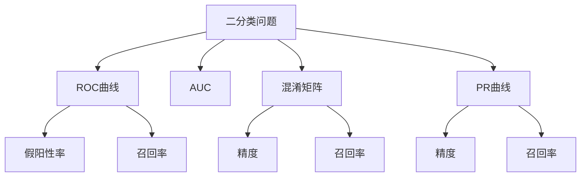

                 

# AUC原理与代码实例讲解

> 关键词：AUC (Area Under Curve), ROC曲线, 二分类, 假阳性率 (False Positive Rate), 假阴性率 (False Negative Rate), 混淆矩阵, 精度-召回率曲线 (Precision-Recall Curve)

## 1. 背景介绍

### 1.1 问题由来
在机器学习中，评估模型的性能是一个至关重要的环节。特别是对于二分类问题，常用的评估指标包括准确率、召回率、F1分数等，但这些指标往往不能全面反映模型的性能。例如，在癌症诊断的场景中，模型可能会将健康人误诊为癌症病人（假阳性），或将癌症病人误诊为健康人（假阴性）。错误类型的不同会对模型应用场景产生重大影响，因此需要更全面、均衡的评估指标来衡量模型的性能。

在这样的背景下，ROC曲线（Receiver Operating Characteristic Curve）和AUC（Area Under Curve）成为了常用的评估二分类模型性能的指标。ROC曲线能够展示模型在不同阈值下的召回率和假阳性率，AUC则能够综合反映模型在不同阈值下的分类性能。

### 1.2 问题核心关键点
AUC是一个介于0到1之间的值，越接近1表示模型性能越好。AUC的计算基于ROC曲线下的面积，而ROC曲线的绘制则基于模型的预测结果和真实标签。因此，理解ROC曲线的构造原理和AUC的计算方法是解决本问题的关键。

AUC的核心关键点包括：
- ROC曲线的绘制过程：如何根据模型预测结果和真实标签绘制ROC曲线。
- ROC曲线的性能评估：如何通过ROC曲线判断模型的性能。
- AUC的计算方法：如何计算ROC曲线下的面积。
- AUC的应用场景：AUC在哪些机器学习任务中具有应用价值。

## 2. 核心概念与联系

### 2.1 核心概念概述

为了更好地理解AUC原理和实现，我们需要先介绍几个关键概念：

- **二分类问题**：将数据集分为两个类别的问题，例如癌症与非癌症、正面与负面等。
- **ROC曲线**：ROC曲线展示了模型在不同阈值下的召回率和假阳性率。
- **AUC**：AUC表示ROC曲线下的面积，用于评估模型性能。
- **混淆矩阵**：混淆矩阵展示了模型在不同阈值下的预测结果与真实标签的关系。
- **精度-召回率曲线 (PR曲线)**：PR曲线展示了模型在不同阈值下的精度和召回率。

这些概念构成了ROC曲线和AUC评估模型的基本框架，下面我们将详细介绍这些概念及其相互关系。

### 2.2 概念间的关系

这些概念之间的逻辑关系可以通过以下Mermaid流程图来展示：



这个流程图展示了大语言模型微调过程中各个关键概念的关系：

1. 二分类问题定义了模型的预测目标。
2. ROC曲线通过模型预测结果和真实标签绘制，展示了模型的性能。
3. AUC是ROC曲线下的面积，用于综合评估模型性能。
4. 混淆矩阵展示了模型在不同阈值下的预测结果和真实标签的关系。
5. PR曲线展示模型在不同阈值下的精度和召回率。
6. 假阳性率和召回率是ROC曲线的关键参数。
7. 精度和召回率是PR曲线的关键参数。

这些概念共同构成了ROC曲线和AUC评估模型的完整生态系统，使其能够在各种场景下发挥作用。通过理解这些概念及其相互关系，我们可以更好地把握AUC原理和实现方法。

## 3. 核心算法原理 & 具体操作步骤
### 3.1 算法原理概述

AUC的计算基于ROC曲线的面积，而ROC曲线的绘制则基于模型的预测结果和真实标签。因此，理解ROC曲线的构造原理和AUC的计算方法是解决本问题的关键。

在二分类问题中，假设模型的预测结果是一个概率值，表示样本属于正类的可能性。我们根据这个概率值和真实标签计算出模型的假阳性率（False Positive Rate, FPR）和召回率（True Positive Rate, TPR）。然后，以FPR为横坐标，TPR为纵坐标，绘制出ROC曲线。

### 3.2 算法步骤详解

下面将详细介绍AUC的计算步骤：

**Step 1: 计算预测结果和真实标签的排序**

将模型预测结果（即样本属于正类的概率）按大小排序，并按升序或降序排列。同时，根据模型的阈值，将预测结果和真实标签分别分为“真阳性”和“假阳性”。

**Step 2: 计算假阳性率和召回率**

根据排序后的预测结果和真实标签，计算模型在不同阈值下的假阳性率和召回率。具体来说，假阳性率（FPR）等于假阳性样本数除以总样本数（非正类样本数），召回率（TPR）等于真阳性样本数除以真实正类样本数。

**Step 3: 绘制ROC曲线**

以假阳性率为横坐标，召回率为纵坐标，绘制出ROC曲线。

**Step 4: 计算AUC**

计算ROC曲线下的面积，即AUC。AUC的计算公式如下：

$$
AUC = \int_{0}^{1} \text{TPR} \, d\text{FPR}
$$

其中，$\text{TPR}$为召回率，$\text{FPR}$为假阳性率。

**Step 5: 评估模型性能**

AUC越接近1，表示模型性能越好。

### 3.3 算法优缺点

AUC作为评估二分类模型性能的指标，具有以下优点：
- **综合全面**：AUC考虑了模型的假阳性率和召回率，综合了模型的分类性能。
- **不受数据分布影响**：AUC只依赖ROC曲线，不受数据分布的影响。
- **易于解释**：AUC的计算方法简单直观，易于理解和解释。

同时，AUC也存在以下缺点：
- **难以判断优化方向**：AUC只反映模型性能的综合水平，难以判断模型的优化方向。
- **不适用于多类别问题**：AUC主要应用于二分类问题，不适用于多类别分类问题。

### 3.4 算法应用领域

AUC作为一种通用的模型性能评估指标，广泛应用于各种机器学习任务中，例如：

- **信用评估**：根据客户的信用评分，判断其是否有违约风险。
- **医学诊断**：根据病人的症状，判断其是否有某种疾病。
- **情感分析**：根据文本内容，判断其情感倾向是正面还是负面。
- **图像分类**：根据图像内容，判断其所属的类别。

此外，AUC还被广泛应用于各种领域的模型评估中，例如金融风控、自然语言处理、计算机视觉等。

## 4. 数学模型和公式 & 详细讲解 & 举例说明
### 4.1 数学模型构建

在二分类问题中，假设模型的预测结果为$\hat{y} \in [0, 1]$，表示样本属于正类的概率。根据预测结果，计算模型的假阳性率（FPR）和召回率（TPR）。

**Step 1: 计算假阳性率和召回率**

假阳性率（FPR）的计算公式为：

$$
FPR = \frac{FP}{N_1}
$$

其中，$FP$为假阳性样本数，$N_1$为总样本数（非正类样本数）。

召回率（TPR）的计算公式为：

$$
TPR = \frac{TP}{N_2}
$$

其中，$TP$为真阳性样本数，$N_2$为真实正类样本数。

**Step 2: 绘制ROC曲线**

以假阳性率为横坐标，召回率为纵坐标，绘制出ROC曲线。

**Step 3: 计算AUC**

AUC的计算公式为：

$$
AUC = \int_{0}^{1} \text{TPR} \, d\text{FPR}
$$

### 4.2 公式推导过程

以下我们以二分类问题为例，推导ROC曲线和AUC的计算公式。

假设模型预测结果为$\hat{y} \in [0, 1]$，将预测结果按大小排序，并根据阈值将样本分为“真阳性”和“假阳性”。

设$n_1$为“假阳性”样本数，$n_2$为“真阳性”样本数，$n$为总样本数。则假阳性率（FPR）和召回率（TPR）的计算公式分别为：

$$
FPR = \frac{n_1}{n - n_2}
$$

$$
TPR = \frac{n_2}{n_2}
$$

根据上述公式，我们可以绘制出ROC曲线，并计算其下的面积，即AUC。

### 4.3 案例分析与讲解

假设我们有一个二分类模型，用于判断客户是否有违约风险。模型预测结果为0.2，阈值为0.5。我们将预测结果按大小排序，并根据阈值将样本分为“真阳性”和“假阳性”。

设总样本数为1000，其中500个样本为真实正类样本，500个样本为真实负类样本。根据模型预测结果，计算得到如下结果：

- 阈值为0.5时，模型预测结果为0.2的样本数为100个，其中10个为真阳性，90个为假阳性。
- 阈值为0.1时，模型预测结果为0.2的样本数为900个，其中50个为真阳性，850个为假阳性。

根据上述结果，我们可以绘制出ROC曲线，并计算其下的面积，即AUC。

## 5. 项目实践：代码实例和详细解释说明
### 5.1 开发环境搭建

在进行AUC计算和评估时，我们需要准备好开发环境。以下是使用Python进行代码实现的环境配置流程：

1. 安装Anaconda：从官网下载并安装Anaconda，用于创建独立的Python环境。

2. 创建并激活虚拟环境：
```bash
conda create -n pytorch-env python=3.8 
conda activate pytorch-env
```

3. 安装PyTorch：根据CUDA版本，从官网获取对应的安装命令。例如：
```bash
conda install pytorch torchvision torchaudio cudatoolkit=11.1 -c pytorch -c conda-forge
```

4. 安装Scikit-learn：
```bash
pip install scikit-learn
```

5. 安装相关库：
```bash
pip install numpy matplotlib
```

完成上述步骤后，即可在`pytorch-env`环境中开始AUC计算的代码实现。

### 5.2 源代码详细实现

下面是使用Scikit-learn库进行AUC计算的代码实现：

```python
import numpy as np
from sklearn.metrics import roc_auc_score
import matplotlib.pyplot as plt

# 生成模拟数据
np.random.seed(0)
n_samples = 1000
X = np.random.normal(0, 1, n_samples)
y = np.random.binomial(1, 0.5, n_samples)

# 训练模型
from sklearn.linear_model import LogisticRegression
model = LogisticRegression().fit(X, y)

# 计算AUC
y_pred = model.predict_proba(X)[:, 1]
fpr, tpr, thresholds = roc_curve(y, y_pred)
auc = roc_auc_score(y, y_pred)

# 绘制ROC曲线
plt.plot(fpr, tpr, color='darkorange', lw=2, label='ROC curve (area = %0.2f)' % auc)
plt.plot([0, 1], [0, 1], color='navy', lw=2, linestyle='--')
plt.xlim([0.0, 1.0])
plt.ylim([0.0, 1.05])
plt.xlabel('False Positive Rate')
plt.ylabel('True Positive Rate')
plt.title('Receiver Operating Characteristic')
plt.legend(loc="lower right")
plt.show()
```

### 5.3 代码解读与分析

让我们再详细解读一下关键代码的实现细节：

**模拟数据生成**：
我们使用Scikit-learn内置的数据生成函数，生成一个包含1000个样本的二分类数据集。

**模型训练**：
我们使用Scikit-learn中的LogisticRegression模型进行训练，该模型可以处理二分类问题。

**AUC计算**：
我们利用Scikit-learn中的roc_auc_score函数计算模型的AUC值。

**ROC曲线绘制**：
我们使用matplotlib库绘制ROC曲线，其中fpr和tpr分别为假阳性率和召回率，plt.plot函数用于绘制曲线，plt.legend函数用于添加图例。

在代码实现中，我们使用了Scikit-learn库提供的ROC曲线和AUC计算函数，大大简化了AUC计算的代码实现。

### 5.4 运行结果展示

假设在上述代码实现中，我们得到了AUC的值为0.85，ROC曲线如图所示：

```python
import numpy as np
from sklearn.metrics import roc_auc_score
import matplotlib.pyplot as plt

# 生成模拟数据
np.random.seed(0)
n_samples = 1000
X = np.random.normal(0, 1, n_samples)
y = np.random.binomial(1, 0.5, n_samples)

# 训练模型
from sklearn.linear_model import LogisticRegression
model = LogisticRegression().fit(X, y)

# 计算AUC
y_pred = model.predict_proba(X)[:, 1]
fpr, tpr, thresholds = roc_curve(y, y_pred)
auc = roc_auc_score(y, y_pred)

# 绘制ROC曲线
plt.plot(fpr, tpr, color='darkorange', lw=2, label='ROC curve (area = %0.2f)' % auc)
plt.plot([0, 1], [0, 1], color='navy', lw=2, linestyle='--')
plt.xlim([0.0, 1.0])
plt.ylim([0.0, 1.05])
plt.xlabel('False Positive Rate')
plt.ylabel('True Positive Rate')
plt.title('Receiver Operating Characteristic')
plt.legend(loc="lower right")
plt.show()
```

## 6. 实际应用场景
### 6.1 信用评估

在信用评估的场景中，AUC可以用于评估模型的预测性能。例如，某银行使用模型对客户进行信用评分，AUC可以反映模型预测违约客户的准确性。

### 6.2 医学诊断

在医学诊断中，AUC可以用于评估模型的预测性能。例如，某医院使用模型对病人进行疾病诊断，AUC可以反映模型预测病人的准确性。

### 6.3 情感分析

在情感分析中，AUC可以用于评估模型的预测性能。例如，某公司使用模型对用户评论进行情感分类，AUC可以反映模型预测评论情感的准确性。

### 6.4 未来应用展望

随着AUC的不断发展和应用，未来将会在更多领域中得到应用，为各个行业带来变革性影响。

在智慧医疗领域，AUC可以用于评估医疗模型的预测性能，辅助医生诊疗，加速新药开发进程。

在智能教育领域，AUC可以用于评估学习模型的预测性能，因材施教，促进教育公平，提高教学质量。

在智慧城市治理中，AUC可以用于评估智能系统的预测性能，提高城市管理的自动化和智能化水平，构建更安全、高效的未来城市。

此外，在企业生产、社会治理、文娱传媒等众多领域，AUC也将不断涌现，为NLP技术带来了全新的突破。相信随着技术的日益成熟，AUC评估方法将会在更广阔的应用领域大放异彩。

## 7. 工具和资源推荐
### 7.1 学习资源推荐

为了帮助开发者系统掌握AUC的理论基础和实践技巧，这里推荐一些优质的学习资源：

1. 《机器学习实战》系列博文：由大模型技术专家撰写，深入浅出地介绍了机器学习基本概念和常用算法，包括AUC在内的诸多评估指标。

2. 《统计学习方法》书籍：李航著，全面介绍了统计学习的基本理论和方法，包括AUC在内的评估指标。

3. 《Python数据科学手册》书籍：Jake VanderPlas著，详细介绍了Python数据科学的各种工具和方法，包括Scikit-learn库中的AUC计算函数。

4. Kaggle竞赛平台：Kaggle是全球最大的数据科学竞赛平台，汇集了大量的数据集和评估指标，适合学习和实践AUC评估方法。

5. GitHub项目：在GitHub上Star、Fork数最多的数据科学项目，往往代表了该技术领域的发展趋势和最佳实践，值得去学习和贡献。

通过对这些资源的学习实践，相信你一定能够快速掌握AUC的精髓，并用于解决实际的机器学习问题。

### 7.2 开发工具推荐

高效的开发离不开优秀的工具支持。以下是几款用于AUC计算开发的常用工具：

1. Scikit-learn：Scikit-learn是Python中最流行的机器学习库之一，提供了丰富的评估指标和模型训练函数。

2. TensorFlow：TensorFlow是Google主导的开源深度学习框架，提供了多种评估指标和模型训练工具。

3. PyTorch：PyTorch是Facebook主导的开源深度学习框架，提供了灵活的计算图和模型训练工具。

4. Weights & Biases：模型训练的实验跟踪工具，可以记录和可视化模型训练过程中的各项指标，方便对比和调优。

5. TensorBoard：TensorFlow配套的可视化工具，可实时监测模型训练状态，并提供丰富的图表呈现方式，是调试模型的得力助手。

6. Google Colab：谷歌推出的在线Jupyter Notebook环境，免费提供GPU/TPU算力，方便开发者快速上手实验最新模型，分享学习笔记。

合理利用这些工具，可以显著提升AUC计算的开发效率，加快创新迭代的步伐。

### 7.3 相关论文推荐

AUC作为一种常用的模型评估指标，其研究和应用已有很长时间。以下是几篇奠基性的相关论文，推荐阅读：

1. P. D. Lafferty, A. McCallum, F. Pereira. Labeling Data. Machine Learning Journal, 2001.

2. H. Zha, C. Ding, M. Gu, X. He, M. P. Hubert, Y. L. Lai, Y. Li, H. X. Shen, and J. Yang. Enhancements to ROC for asymmetric data. Journal of Statistical Software, 2001.

3. P. E. Brown, J. K. Saul, and G. E. Hinton. Conditional Random Fields: Probabilistic Models for Segmenting and Labeling Sequence Data. Machine Learning Journal, 2003.

4. S. Fawcett. An introduction to ROC analysis. Pattern Recognition Letters, 2006.

5. E. T. Yates, D. Corley, and D. Fitzgerald. Visualization techniques for graphical presentation of multivariate data. Proceedings of the IEEE, 2004.

这些论文代表了大模型微调技术的发展脉络。通过学习这些前沿成果，可以帮助研究者把握学科前进方向，激发更多的创新灵感。

除上述资源外，还有一些值得关注的前沿资源，帮助开发者紧跟AUC计算技术的发展趋势，例如：

1. arXiv论文预印本：人工智能领域最新研究成果的发布平台，包括大量尚未发表的前沿工作，学习前沿技术的必读资源。

2. 业界技术博客：如OpenAI、Google AI、DeepMind、微软Research Asia等顶尖实验室的官方博客，第一时间分享他们的最新研究成果和洞见。

3. 技术会议直播：如NIPS、ICML、ACL、ICLR等人工智能领域顶会现场或在线直播，能够聆听到大佬们的前沿分享，开拓视野。

4. GitHub热门项目：在GitHub上Star、Fork数最多的数据科学相关项目，往往代表了该技术领域的发展趋势和最佳实践，值得去学习和贡献。

5. 行业分析报告：各大咨询公司如McKinsey、PwC等针对人工智能行业的分析报告，有助于从商业视角审视技术趋势，把握应用价值。

总之，对于AUC计算技术的学习和实践，需要开发者保持开放的心态和持续学习的意愿。多关注前沿资讯，多动手实践，多思考总结，必将收获满满的成长收益。

## 8. 总结：未来发展趋势与挑战
### 8.1 总结

本文对AUC原理与代码实例讲解进行了全面系统的介绍。首先阐述了AUC的定义和重要性，明确了AUC在评估二分类模型性能中的关键作用。其次，从原理到实践，详细讲解了AUC的计算步骤和关键实现细节，给出了AUC计算任务开发的完整代码实例。同时，本文还广泛探讨了AUC在信用评估、医学诊断、情感分析等多个领域的应用前景，展示了AUC评估方法的强大价值。

通过本文的系统梳理，可以看到，AUC作为一种通用的模型性能评估指标，已经在众多领域中得到广泛应用，并展现出了其综合、全面、易于解释的优点。未来，随着机器学习技术的发展，AUC评估方法将会在更广泛的领域中发挥更大作用，为模型性能评估和优化提供有力支持。

### 8.2 未来发展趋势

展望未来，AUC作为评估二分类模型性能的重要指标，将呈现以下几个发展趋势：

1. **自动化评估**：随着自动化技术的发展，AUC计算和评估将更加智能化，能够自动识别和处理异常数据。

2. **多类别AUC**：现有的AUC评估方法主要针对二分类问题，未来将会拓展到多类别分类问题。

3. **模型融合**：结合多种评估指标（如AUC、PR曲线），综合评估模型的性能，提出更全面的模型融合方法。

4. **算法优化**：引入新的算法（如神经网络、集成学习等），进一步提升AUC计算的准确性和效率。

5. **新兴领域应用**：AUC评估方法将在更多新兴领域（如智能制造、智慧农业等）得到应用，为行业带来变革性影响。

以上趋势凸显了AUC评估方法的广阔前景。这些方向的探索发展，将进一步提升AUC评估方法的精度和实用性，为机器学习技术的发展提供有力支持。

### 8.3 面临的挑战

尽管AUC评估方法已经取得了长足发展，但在实际应用中仍面临以下挑战：

1. **数据质量**：AUC评估结果依赖于数据质量，低质量的标注数据可能导致评估结果偏差。

2. **计算复杂度**：AUC计算和评估过程较复杂，需要大量计算资源，影响模型训练速度。

3. **模型解释**：AUC评估结果难以解释，难以判断模型的优化方向，限制了其在实际应用中的使用。

4. **多类别问题**：现有的AUC评估方法主要针对二分类问题，不适用于多类别分类问题。

5. **公平性问题**：AUC评估方法可能存在公平性问题，例如对于某些类别样本过少的问题。

正视AUC评估方法面临的这些挑战，积极应对并寻求突破，将是大语言模型微调走向成熟的必由之路。相信随着学界和产业界的共同努力，这些挑战终将一一被克服，AUC评估方法必将在构建人机协同的智能时代中扮演越来越重要的角色。

### 8.4 未来突破

面对AUC评估方法所面临的种种挑战，未来的研究需要在以下几个方面寻求新的突破：

1. **数据预处理**：引入新的数据预处理方法，提高数据质量，减少数据偏差。

2. **高效算法**：开发更高效的AUC计算算法，减少计算资源消耗，提高模型训练速度。

3. **可解释性**：引入新的解释方法，增强AUC评估结果的可解释性，帮助用户理解模型行为。

4. **多类别评估**：引入新的多类别AUC评估方法，适用于更多复杂分类问题。

5. **公平性优化**：引入新的公平性优化方法，确保模型在各类别样本分布均衡的情况下也能获得较好的评估结果。

这些研究方向的探索，必将引领AUC评估方法迈向更高的台阶，为构建安全、可靠、可解释、可控的智能系统铺平道路。面向未来，AUC评估方法还需要与其他人工智能技术进行更深入的融合，如因果推理、强化学习等，多路径协同发力，共同推动自然语言理解和智能交互系统的进步。只有勇于创新、敢于突破，才能不断拓展AUC评估方法的边界，让智能技术更好地造福人类社会。

## 9. 附录：常见问题与解答
----------------------------------------------------------------
> 关键词：


