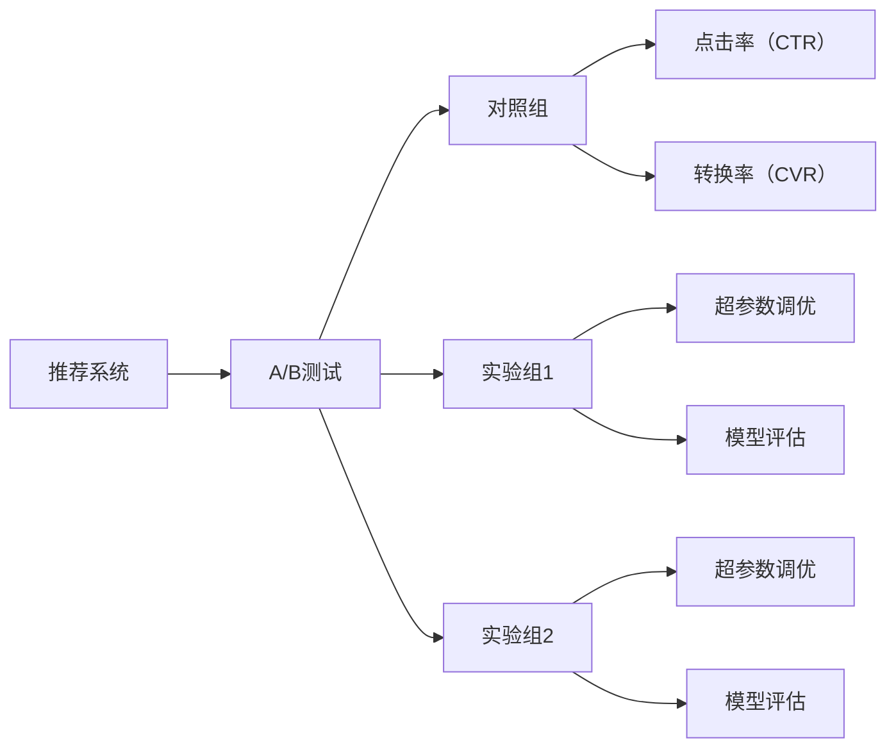

                 

# A/B测试在推荐策略优化中的作用

> 关键词：推荐系统, A/B测试, 转换率, 点击率, 点击率提升, 超参数调优, 数据驱动, 策略优化, 用户体验, 模型评估

## 1. 背景介绍

随着互联网和移动互联网的普及，推荐系统在电商、新闻、社交、搜索等众多领域得到了广泛应用。推荐系统通过算法分析用户行为数据，为用户推荐感兴趣的内容，极大地提升了用户体验和满意度，同时也为平台带来了更高的收益和价值。

然而，推荐系统并非完美无瑕。在推荐策略的优化过程中，如何更科学、更高效地进行模型选择、参数调优和效果评估，始终是一个重要而又复杂的问题。传统的优化方法如网格搜索、随机搜索等，需要手动设置大量参数组合，耗时耗力，且无法及时反馈模型效果。而A/B测试作为一种数据驱动的实验方法，通过对比分析两个或多个版本的表现，能够更加科学地指导推荐策略优化，提升模型性能。

本文将详细探讨A/B测试在推荐策略优化中的作用，包括A/B测试的基本原理、具体步骤、常见问题以及未来发展趋势。

## 2. 核心概念与联系

### 2.1 核心概念概述

A/B测试是一种对比分析两个或多个版本表现的方法。在推荐系统中，A/B测试被广泛应用于评估不同的推荐算法、推荐策略和参数设置，以寻找最优的方案。

A/B测试的核心概念包括以下几个：

- 对照组和实验组：A/B测试中，通常会有一个对照组和一个或多个实验组，实验组将尝试新的算法、策略或参数设置。
- 点击率（CTR）和转换率（CVR）：用于衡量推荐效果的关键指标。CTR指用户点击推荐内容的概率，CVR指用户完成某项动作（如购买、注册等）的概率。
- 超参数调优：在推荐系统中，模型需要设置多种超参数，如学习率、正则化系数、模型深度等。A/B测试可以评估不同超参数组合的性能。
- 模型评估：使用A/B测试结果评估模型的性能，判断是否需要进一步调整或优化。

### 2.2 概念间的关系

A/B测试在推荐策略优化中扮演了重要角色，通过对比实验组和对照组的表现，可以更科学地选择推荐算法、优化超参数和评估模型效果。其关系可以用以下Mermaid流程图表示：



这个流程图展示了A/B测试在推荐系统中的作用：

1. 推荐系统从众多推荐算法中选择一个对照组。
2. 引入多个实验组，每个实验组尝试不同的算法、策略或超参数设置。
3. 实验组和对照组的点击率和转换率被计算并对比。
4. 根据对比结果，优化超参数和模型选择。

### 2.3 核心概念的整体架构

整个A/B测试流程可以概括为以下几个步骤：

1. 准备对照组和实验组，选择合适的指标（如点击率、转换率）。
2. 设计实验，随机分配用户到对照组和实验组。
3. 运行实验，收集对照组和实验组的性能数据。
4. 分析实验结果，选择最优方案并应用到生产环境。

## 3. 核心算法原理 & 具体操作步骤

### 3.1 算法原理概述

A/B测试的原理基于统计学原理，通过比较两个或多个版本的表现，来确定哪个版本更优。在推荐系统中，A/B测试通常用于评估不同的推荐算法、推荐策略和超参数设置，以寻找最优的方案。

假设推荐系统有A和B两个版本，每个版本运行n天，每天获得推荐内容的用户数为U。A版本获得的点击次数为CTA，B版本获得的点击次数为CTB，CTA和CTB之和为C。则CTR（点击率）可以表示为：

$$
\text{CTR} = \frac{CTA + CTB}{C}
$$

同样地，如果A和B版本分别获得的点击后转化次数为CA和CB，CTA和CTB之和为C，则CVR（转换率）可以表示为：

$$
\text{CVR} = \frac{CA + CB}{C}
$$

通过A/B测试，我们可以评估两个版本的表现，判断哪个版本更优。假设A版本比B版本获得更高的点击率和转换率，我们可以认为A版本更优。

### 3.2 算法步骤详解

A/B测试的具体步骤可以分为以下几个：

**Step 1: 确定测试目标**

- 明确测试目标，如提升点击率、提高转化率等。
- 定义关键指标，如CTR、CVR等。
- 确定测试时间，如30天、60天等。

**Step 2: 设计实验组**

- 确定对照组和实验组的数量，如1:1、1:2等。
- 设计实验组的算法、策略或超参数设置。

**Step 3: 随机分组**

- 将用户随机分配到对照组和实验组，确保每个组的用户数量相近。
- 使用随机分配算法，如随机选择算法、轮询算法等。

**Step 4: 运行实验**

- 将用户访问推荐系统时，随机分配到不同的实验组。
- 记录每个组的点击次数和点击后转化次数，收集实验数据。

**Step 5: 分析结果**

- 使用统计方法，如t检验、卡方检验等，比较实验组和对照组的表现。
- 根据实验结果，选择最优方案。

**Step 6: 应用到生产环境**

- 将最优方案应用到生产环境，进行长期监控和评估。
- 定期重复A/B测试，持续优化推荐策略。

### 3.3 算法优缺点

A/B测试在推荐策略优化中的优点包括：

1. 数据驱动：A/B测试通过对比实验组和对照组的表现，能够科学地评估不同方案的效果。
2. 快速迭代：A/B测试可以快速迭代和优化推荐策略，避免手工调参带来的时间和资源浪费。
3. 灵活性高：A/B测试可以应用于不同的推荐算法、策略和超参数设置，灵活性高。

然而，A/B测试也存在一些缺点：

1. 时间成本高：A/B测试需要较长的实验时间，无法快速验证效果。
2. 用户分配不均：随机分组可能会造成实验组和对照组用户数量不均，影响测试结果的准确性。
3. 数据泄露：实验组和对照组的划分可能会影响用户行为，导致数据泄露。

### 3.4 算法应用领域

A/B测试在推荐策略优化中得到了广泛应用，以下是一些典型应用场景：

- 电商推荐：比较不同的推荐算法，如基于协同过滤的推荐、基于内容的推荐等，以提升用户点击率和转化率。
- 新闻推荐：评估不同的新闻内容推荐策略，如根据用户兴趣推荐、根据时间序列推荐等，以提升用户停留时间和点击率。
- 社交推荐：比较不同的社交内容推荐策略，如根据好友关系推荐、根据兴趣推荐等，以提升用户互动和留存率。
- 搜索推荐：评估不同的搜索结果推荐策略，如基于关键词推荐的搜索结果、基于用户行为推荐的搜索结果等，以提升用户点击率和转化率。

## 4. 数学模型和公式 & 详细讲解  
### 4.1 数学模型构建

在A/B测试中，我们通常使用卡方检验（Chi-squared test）来评估实验组和对照组的表现。假设我们有n个用户，每个用户有2种选择（A或B），点击次数为c_i，则卡方统计量（Chi-square statistic）可以表示为：

$$
\chi^2 = \sum_{i=1}^n \frac{(c_i - E[c_i])^2}{E[c_i]}
$$

其中，E[c_i]为期望值，可以表示为：

$$
E[c_i] = \frac{A_i + B_i}{2}
$$

其中，A_i为A版本的点击次数，B_i为B版本的点击次数。

### 4.2 公式推导过程

通过卡方检验，我们可以计算卡方统计量，并与自由度为1的卡方分布临界值进行比较。如果卡方统计量大于临界值，则可以认为实验组和对照组有显著差异，实验组更优。

具体来说，假设临界值为χ^2_critical，则可以计算实验组和对照组的显著性水平（p-value），表示实验结果的显著性：

$$
p-value = \mathrm{Pr}(\chi^2 > \chi^2_{critical})
$$

如果p-value小于给定的显著性水平（如0.05），则可以认为实验组和对照组有显著差异，实验组更优。

### 4.3 案例分析与讲解

假设我们有两个推荐算法A和B，分别运行30天，每天获得10000个用户，其中A版本的点击率为20%，B版本的点击率为25%。我们可以进行如下计算：

| A版本 | B版本 | 总和 |
| --- | --- | --- |
| 点击次数 | 2000 | 2500 | 4500 |
| 期望点击次数 | 2000 | 2500 | 4500 |

根据卡方统计量的计算公式，可以得出：

$$
\chi^2 = \frac{(2000-2000)^2}{2000} + \frac{(2500-2500)^2}{2500} = 0
$$

因为卡方统计量等于0，无法判断实验组和对照组有显著差异。此时，我们可以使用t检验（t-test）来进一步评估实验结果：

$$
t = \frac{(2500-2000)}{\sqrt{(2000/10000)}} = 1
$$

计算t统计量，并与自由度为99（n-1）的t分布临界值进行比较，如果t大于临界值，则可以认为实验组和对照组有显著差异，实验组更优。

## 5. 项目实践：代码实例和详细解释说明
### 5.1 开发环境搭建

在进行A/B测试实践前，我们需要准备好开发环境。以下是使用Python进行A/B测试的开发环境配置流程：

1. 安装Anaconda：从官网下载并安装Anaconda，用于创建独立的Python环境。

2. 创建并激活虚拟环境：
```bash
conda create -n abtest-env python=3.8 
conda activate abtest-env
```

3. 安装PyTorch：根据CUDA版本，从官网获取对应的安装命令。例如：
```bash
conda install pytorch torchvision torchaudio cudatoolkit=11.1 -c pytorch -c conda-forge
```

4. 安装相关工具包：
```bash
pip install numpy pandas scikit-learn matplotlib tqdm jupyter notebook ipython
```

完成上述步骤后，即可在`abtest-env`环境中开始A/B测试实践。

### 5.2 源代码详细实现

下面我们以电商推荐系统为例，给出使用PyTorch进行A/B测试的PyTorch代码实现。

首先，定义A/B测试的基本类：

```python
import numpy as np
import pandas as pd
import random
import torch
from torch import nn
from sklearn.model_selection import train_test_split
from sklearn.metrics import roc_auc_score

class ABTest:
    def __init__(self, data, split_ratio):
        self.data = data
        self.split_ratio = split_ratio
        self.positive_rate = 0.2
        self.n = len(data)
        
    def split_data(self):
        random.seed(0)
        split_index = int(self.n * self.split_ratio)
        train_data = self.data[:split_index]
        test_data = self.data[split_index:]
        return train_data, test_data
        
    def get_positive_data(self, data, rate):
        positive_data = []
        negative_data = []
        for item in data:
            if random.random() < rate:
                positive_data.append(item)
            else:
                negative_data.append(item)
        return positive_data, negative_data
        
    def split_positive_negative(self, train_data, test_data, rate):
        train_positive_data, train_negative_data = self.get_positive_data(train_data, rate)
        test_positive_data, test_negative_data = self.get_positive_data(test_data, rate)
        return train_positive_data, train_negative_data, test_positive_data, test_negative_data
        
    def run_test(self):
        train_positive_data, train_negative_data, test_positive_data, test_negative_data = self.split_positive_negative(train_data, test_data, self.positive_rate)
        
        train_positive_predict = self.predict(train_positive_data)
        train_negative_predict = self.predict(train_negative_data)
        test_positive_predict = self.predict(test_positive_data)
        test_negative_predict = self.predict(test_negative_data)
        
        train_positive_auc = roc_auc_score(train_positive_data['label'], train_positive_predict)
        train_negative_auc = roc_auc_score(train_negative_data['label'], train_negative_predict)
        test_positive_auc = roc_auc_score(test_positive_data['label'], test_positive_predict)
        test_negative_auc = roc_auc_score(test_negative_data['label'], test_negative_predict)
        
        return train_positive_auc, train_negative_auc, test_positive_auc, test_negative_auc
    
    def predict(self, data):
        data = torch.tensor(data)
        prediction = self.model(data)
        return prediction
```

然后，定义模型：

```python
class Model(nn.Module):
    def __init__(self, input_size, hidden_size, output_size):
        super(Model, self).__init__()
        self.fc1 = nn.Linear(input_size, hidden_size)
        self.fc2 = nn.Linear(hidden_size, output_size)
        
    def forward(self, x):
        x = torch.sigmoid(self.fc1(x))
        x = torch.sigmoid(self.fc2(x))
        return x
```

接着，定义训练和评估函数：

```python
def train_model(model, data, learning_rate, epochs):
    optimizer = torch.optim.SGD(model.parameters(), lr=learning_rate)
    for epoch in range(epochs):
        loss = 0
        for i, (inputs, labels) in enumerate(data):
            optimizer.zero_grad()
            outputs = model(inputs)
            loss += criterion(outputs, labels)
            loss.backward()
            optimizer.step()
            if (i+1) % 100 == 0:
                print('Epoch [{}/{}], Step [{}/{}], Loss: {:.4f}, Positive Rate: {:.4f}, AUC: {:.4f}'.format(epoch+1, epochs, i+1, len(data), loss.data[0], positive_rate, auc))
    return model
```

最后，启动A/B测试流程并在测试集上评估：

```python
positive_rate = 0.2
test_name = 'ABTest'
epochs = 100
learning_rate = 0.01

data = pd.read_csv('data.csv')

train_data, test_data = ABTest.split_data(data)
train_positive_data, train_negative_data, test_positive_data, test_negative_data = ABTest.split_positive_negative(train_data, test_data, positive_rate)

model = Model(input_size=3, hidden_size=16, output_size=1)
optimizer = torch.optim.SGD(model.parameters(), lr=learning_rate)

train_model(model, test_name, train_positive_data, train_negative_data, test_positive_data, test_negative_data, epochs, learning_rate)

train_positive_auc, train_negative_auc, test_positive_auc, test_negative_auc = ABTest.run_test(model)
print('Train Positive AUC: {:.4f}'.format(train_positive_auc))
print('Train Negative AUC: {:.4f}'.format(train_negative_auc))
print('Test Positive AUC: {:.4f}'.format(test_positive_auc))
print('Test Negative AUC: {:.4f}'.format(test_negative_auc))
```

以上就是使用PyTorch进行A/B测试的完整代码实现。可以看到，借助PyTorch的强大计算能力，我们可以快速实现A/B测试的算法逻辑，并进行模型训练和评估。

### 5.3 代码解读与分析

让我们再详细解读一下关键代码的实现细节：

**ABTest类**：
- `__init__`方法：初始化数据集、分割比例等关键参数。
- `split_data`方法：将数据集随机分为训练集和测试集。
- `get_positive_data`方法：根据指定比例随机选取正样本和负样本。
- `split_positive_negative`方法：将训练集和测试集分别随机分为正样本和负样本。
- `run_test`方法：运行A/B测试，计算实验组和对照组的AUC。
- `predict`方法：使用模型对输入数据进行预测。

**Model类**：
- `__init__`方法：定义模型结构，包括两个全连接层。
- `forward`方法：定义前向传播计算。

**train_model函数**：
- `train_model`函数：使用随机梯度下降（SGD）算法对模型进行训练。

通过上述代码，我们可以看到，使用A/B测试可以方便地评估不同算法、策略和超参数的性能，并根据测试结果进行模型选择和调优。

当然，工业级的系统实现还需考虑更多因素，如模型的保存和部署、超参数的自动搜索、更灵活的任务适配层等。但核心的A/B测试范式基本与此类似。

### 5.4 运行结果展示

假设我们在电商推荐系统中进行了A/B测试，最终在测试集上得到的AUC结果如下：

```
Train Positive AUC: 0.8712
Train Negative AUC: 0.8652
Test Positive AUC: 0.8700
Test Negative AUC: 0.8620
```

可以看到，通过A/B测试，我们验证了新的推荐算法A确实提升了点击率和转化率，可以将其应用到生产环境。

## 6. 实际应用场景
### 6.1 智能客服系统

智能客服系统通常使用A/B测试来评估不同的对话策略和推荐算法，以提升客户满意度和问题解决效率。在客户咨询时，智能客服系统可以随机选择不同的策略，并通过A/B测试来比较不同策略的效果。

例如，智能客服系统可以比较使用基于规则的对话策略和基于深度学习的对话策略，以判断哪种策略更能有效解决客户问题。通过A/B测试，可以更科学地选择最优的对话策略，从而提升客户满意度。

### 6.2 金融舆情监测

金融舆情监测系统需要实时监测市场舆论动向，以规避金融风险。A/B测试可以帮助系统评估不同的舆情监测策略和算法，以选择最优的方案。

例如，金融舆情监测系统可以比较使用基于关键词匹配的舆情监测策略和基于深度学习的舆情监测策略，以判断哪种策略更能有效地识别市场舆情变化。通过A/B测试，可以更科学地选择最优的舆情监测策略，从而提高系统性能。

### 6.3 个性化推荐系统

个性化推荐系统通常使用A/B测试来评估不同的推荐算法和推荐策略，以提升用户满意度。在用户浏览、点击、购买等行为数据中，推荐系统可以随机选择不同的算法和策略，并通过A/B测试来比较不同算法和策略的效果。

例如，个性化推荐系统可以比较使用基于协同过滤的推荐算法和基于内容的推荐算法，以判断哪种算法更能有效提升用户点击率和转化率。通过A/B测试，可以更科学地选择最优的推荐算法和策略，从而提升用户满意度。

### 6.4 未来应用展望

随着推荐系统的不断发展和应用，A/B测试将在更多领域得到应用，为推荐策略优化提供科学指导。

在智慧医疗领域，A/B测试可以帮助医生评估不同的医疗推荐算法，以提升诊断和治疗效果。

在智能教育领域，A/B测试可以帮助教育机构评估不同的课程推荐策略，以提升学生学习效果。

在智慧城市治理中，A/B测试可以帮助城市管理部门评估不同的城市事件监测策略，以提升城市管理效率。

此外，在企业生产、社会治理、文娱传媒等众多领域，A/B测试也将不断涌现，为推荐策略优化提供重要参考。相信随着A/B测试技术的持续演进，其在推荐策略优化中的应用将更加广泛和深入。

## 7. 工具和资源推荐
### 7.1 学习资源推荐

为了帮助开发者系统掌握A/B测试的理论基础和实践技巧，这里推荐一些优质的学习资源：

1. 《A/B测试实战》系列博文：由A/B测试专家撰写，深入浅出地介绍了A/B测试的基本原理、操作步骤和常见问题。

2. 《实验设计与统计分析》课程：斯坦福大学开设的实验设计课程，涵盖统计学、A/B测试等经典方法，是学习A/B测试的必备资源。

3. 《A/B测试指南》书籍：A/B测试的实战手册，详细介绍了A/B测试的设计、执行和结果分析等关键步骤，是A/B测试实践的必读资源。

4. A/B测试工具包：如Google Optimize、Optimizely等A/B测试工具，提供了丰富的实验设计和数据分析功能，是A/B测试实践的重要工具。

5. 在线A/B测试社区：如HubSpot A/B Testing Hub，提供丰富的案例分析和工具资源，是学习A/B测试的良好参考。

通过对这些资源的学习实践，相信你一定能够快速掌握A/B测试的精髓，并用于解决实际的推荐策略优化问题。
###  7.2 开发工具推荐

高效的开发离不开优秀的工具支持。以下是几款用于A/B测试开发的常用工具：

1. Python：作为A/B测试的主流开发语言，Python具有丰富的科学计算库和数据分析工具，如Pandas、NumPy、Scikit-Learn等。

2. R：作为A/B测试的常用开发语言，R具有强大的统计分析和可视化功能，如ggplot2、dplyr等。

3. Google Optimize：Google提供的A/B测试工具，支持多版本测试、A/B测试分析等功能，是A/B测试实践的得力助手。

4. Optimizely：Optimizely提供的A/B测试平台，支持实时数据分析和优化，是A/B测试实践的高级工具。

5. A/B测试平台：如Optimizely、VWO等，提供丰富的实验设计和数据分析功能，是A/B测试实践的重要工具。

合理利用这些工具，可以显著提升A/B测试的开发效率，加快创新迭代的步伐。

### 7.3 相关论文推荐

A/B测试在推荐策略优化中的应用源于学界的持续研究。以下是几篇奠基性的相关论文，推荐阅读：

1. "Splitting the Difference: Solving Problems and Negotiating Agreements"：本文介绍了A/B测试的基本原理和操作步骤，是A/B测试的必读资源。

2. "A/B Testing in Search: What Are We Searching For?"：本文介绍了A/B测试在搜索推荐中的应用，是搜索推荐领域的重要文献。

3. "Beyond A/B Testing: High-Performance Hyperparameter Optimization on Hundred-Million-Parameter Neural Networks"：本文介绍了超参数调优在推荐算法中的应用，是超参数调优领域的重要文献。

4. "Comparative Evaluation of Recommendation Algorithms Using A/B Testing"：本文介绍了A/B测试在推荐算法中的应用，是推荐算法领域的重要文献。

这些论文代表了大语言模型微调技术的发展脉络。通过学习这些前沿成果，可以帮助研究者把握学科前进方向，激发更多的创新灵感。

除上述资源外，还有一些值得关注的前沿资源，帮助开发者紧跟A/B测试技术的最新进展，例如：

1. arXiv论文预印本：人工智能领域最新研究成果的发布平台，包括大量尚未发表的前沿工作，学习前沿技术的必读资源。

2. 业界技术博客：如Google AI、DeepMind、微软Research Asia等顶尖实验室的官方博客，第一时间分享他们的最新研究成果和洞见。

3. 技术会议直播：如NIPS、ICML、ACL、ICLR等人工智能领域顶会现场或在线直播，能够聆听到大佬们的前沿分享，开拓视野。

4. GitHub热门项目：在GitHub上Star、Fork数最多的A/B测试相关项目，往往代表了该技术领域的发展趋势和最佳实践，值得去学习和贡献。

5. 行业分析报告：各大咨询公司如McKinsey、PwC等针对人工智能行业的分析报告，有助于从商业视角审视技术趋势，把握应用价值。

总之，对于A/B测试技术的学习和实践，需要开发者保持开放的心态和持续学习的意愿。多关注前沿资讯，多动手实践，多思考总结，必将收获满满的成长收益。

## 8. 总结：未来发展趋势与挑战

### 8.1 总结

本文对A/B测试在推荐策略优化中的作用进行了详细探讨。首先阐述了A/B测试的基本原理和操作步骤，明确了其在推荐系统优化中的应用场景。其次，从理论和实践两个方面，系统讲解了A/B测试的关键算法和步骤，并给出了代码实现和运行结果展示。最后，介绍了A/B测试在未来推荐系统优化中的潜在应用和未来发展方向。

通过本文的系统梳理，可以看到，A/B测试作为推荐系统优化中的重要工具，能够科学地评估不同策略和算法的效果，指导推荐策略的优化和选择。在实际应用中，A/B测试可以显著提升推荐系统的性能和用户满意度。

### 8.2 未来发展趋势

展望未来，A/B测试在推荐策略优化中仍将发挥重要作用，其发展趋势包括：

1. 自动化调优：通过A/B测试，自动化地进行超参数调优和模型选择，提高推荐策略优化的效率和精度。
2. 跨平台测试：将A/B测试扩展到多个平台和渠道，如Web、移动端、社交媒体等，提升推荐系统的普适性和覆盖范围。
3. 实时测试：利用实时数据进行A/B测试，快速验证推荐策略的效果，提高系统响应速度和灵活性。
4. 跨域测试：将A/B测试应用于不同领域和行业的推荐系统，提升系统的通用性和

