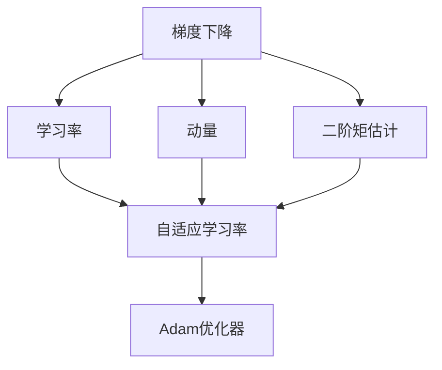

                 

# Adam Optimization原理与代码实例讲解

> 关键词：Adam, 梯度下降, 二阶矩估计, 自适应学习率, 优化器, 深度学习

## 1. 背景介绍

在深度学习中，梯度下降法是常用的优化算法，但其传统形式（如随机梯度下降，SGD）往往难以处理非凸、稀疏、高维数据，存在梯度噪声和收敛速度慢等问题。Adam优化算法，作为新一代优化算法，自2015年首次在机器学习顶会ICLR上提出以来，已经在深度学习领域广泛应用，并逐步成为最优的优化器之一。Adam的全称是Adaptive Moment Estimation，即自适应动量估计，能够自动调整学习率，并基于梯度的一阶和二阶矩估计更新参数，因此具有收敛速度快、稳定性强等优点。

本文将详细讲解Adam优化算法的原理、步骤和应用，并通过代码实例对其实现进行深入解析。通过本文的学习，读者可以系统掌握Adam优化算法，并应用到实际的深度学习项目中，提升模型训练的效率和效果。

## 2. 核心概念与联系

### 2.1 核心概念概述

为了更好地理解Adam优化算法，本节将介绍几个关键概念：

- 梯度下降（Gradient Descent）：一种通过迭代更新参数来最小化损失函数的优化算法。
- 学习率（Learning Rate）：控制参数更新步长的超参数，过大的学习率可能导致过拟合，过小的学习率收敛速度慢。
- 动量（Momentum）：通过累积梯度来加速收敛，减缓震荡。
- 二阶矩估计（Second Moment Estimation）：基于梯度的平方和二次梯度来更新参数，能够自适应调整学习率，避免陷入局部最优。
- 自适应学习率（Adaptive Learning Rate）：根据梯度的动态变化调整学习率，使得优化更加高效和稳定。
- Adam优化器：基于动量和二阶矩估计的自适应学习率优化器，结合了动量和二阶矩估计的优点。

### 2.2 核心概念间的关系

通过以下Mermaid流程图，可以更直观地展示这些核心概念之间的关系：



该流程图展示了梯度下降、学习率、动量、二阶矩估计和自适应学习率之间的逻辑联系，并最终引出Adam优化器。这些概念共同构成了Adam算法的基础，通过合理设计这些组件，可以高效地优化深度学习模型。

## 3. 核心算法原理 & 具体操作步骤

### 3.1 算法原理概述

Adam算法是基于动量和二阶矩估计的自适应学习率优化算法。其核心思想是：通过维护梯度的一阶矩估计和二阶矩估计，动态调整每个参数的学习率，从而使得优化更加高效和稳定。

Adam算法维护了两个动量变量，即梯度的一阶矩估计$\hat{m}_t$和二阶矩估计$\hat{v}_t$，分别用于累积梯度和梯度平方，计算自适应学习率$\eta_t$，更新模型参数$\theta_t$。算法流程如下：

1. 初始化$\hat{m}_0 = 0, \hat{v}_0 = 0$。
2. 对于每个迭代步骤$t$，计算梯度$g_t = \nabla L(\theta_t)$。
3. 更新动量变量$\hat{m}_t = \beta_1 \hat{m}_{t-1} + (1-\beta_1) g_t$，$\hat{v}_t = \beta_2 \hat{v}_{t-1} + (1-\beta_2) g_t^2$。
4. 计算自适应学习率$\eta_t = \frac{\sqrt{1-\beta_2^t}}{1-\beta_1^t} \frac{\hat{m}_t}{\sqrt{\hat{v}_t}+\epsilon}$。
5. 更新模型参数$\theta_t = \theta_{t-1} - \eta_t g_t$。

其中，$\beta_1$和$\beta_2$是动量和二阶矩估计的衰减系数，一般取值为$0.9$和$0.999$。$\epsilon$是一个很小的常数（通常取$10^{-8}$），用于避免分母为零的情况。

### 3.2 算法步骤详解

Adam算法步骤非常清晰，下面我们详细解析每个步骤的含义和实现：

**Step 1: 初始化**

初始化动量变量$\hat{m}_0 = 0, \hat{v}_0 = 0$，其中$\hat{m}_t$用于累积梯度，$\hat{v}_t$用于累积梯度平方。

**Step 2: 计算梯度**

对于每个迭代步骤$t$，计算当前损失函数的梯度$g_t = \nabla L(\theta_t)$。

**Step 3: 更新动量变量**

根据动量系数$\beta_1$和$\beta_2$，更新动量变量$\hat{m}_t$和$\hat{v}_t$。

$$
\hat{m}_t = \beta_1 \hat{m}_{t-1} + (1-\beta_1) g_t
$$

$$
\hat{v}_t = \beta_2 \hat{v}_{t-1} + (1-\beta_2) g_t^2
$$

注意，动量变量$\hat{m}_t$和$\hat{v}_t$是在指数加权移动平均的意义下计算的，它们分别累积了梯度的历史信息。

**Step 4: 计算自适应学习率**

根据动量变量和梯度平方，计算自适应学习率$\eta_t$。

$$
\eta_t = \frac{\sqrt{1-\beta_2^t}}{1-\beta_1^t} \frac{\hat{m}_t}{\sqrt{\hat{v}_t}+\epsilon}
$$

其中，$\epsilon$是一个很小的常数，用于避免分母为零的情况。自适应学习率$\eta_t$是基于梯度的动态变化计算的，能够根据梯度的变化自适应地调整学习率。

**Step 5: 更新模型参数**

根据自适应学习率$\eta_t$，更新模型参数$\theta_t$。

$$
\theta_t = \theta_{t-1} - \eta_t g_t
$$

### 3.3 算法优缺点

Adam算法具有以下几个优点：

1. 自适应学习率：能够根据梯度的变化动态调整学习率，避免了手动调整学习率的繁琐过程。
2. 二阶矩估计：通过累积梯度平方，可以更好地估计梯度方差，提高收敛速度。
3. 动量：通过累积梯度，能够平滑梯度更新，减少震荡，加速收敛。
4. 计算效率：Adam算法计算相对简单，内存占用少，适合大规模数据集。

同时，Adam算法也有一些缺点：

1. 对超参数敏感：动量系数$\beta_1$和$\beta_2$的选择需要谨慎，不同任务可能需要不同的参数设置。
2. 可能出现稀疏梯度问题：当梯度平方非常小时，$\hat{v}_t$可能会接近于零，导致学习率过大。
3. 收敛速度不稳定：对于稀疏、非凸等特殊情况，Adam算法可能收敛不稳定，需要进行调整。

### 3.4 算法应用领域

Adam算法在深度学习中被广泛应用，特别是在图像识别、自然语言处理等领域。其主要应用领域包括：

1. 图像分类：使用CNN模型进行图像分类任务，通过Adam优化器加速训练过程。
2. 目标检测：使用R-CNN、YOLO等模型进行目标检测，通过Adam优化器提高检测准确率。
3. 自然语言处理：使用RNN、LSTM、Transformer等模型进行文本分类、情感分析、机器翻译等任务，通过Adam优化器提高训练效率。
4. 强化学习：使用深度Q网络、策略梯度等模型进行游戏、机器人控制等任务，通过Adam优化器进行策略优化。
5. 生成对抗网络（GAN）：使用GAN进行图像生成、风格转换等任务，通过Adam优化器训练生成器和判别器。

## 4. 数学模型和公式 & 详细讲解 & 举例说明

### 4.1 数学模型构建

我们首先从数学模型角度，重新定义Adam优化算法。假设模型参数$\theta_t$，当前损失函数的梯度$g_t$，动量系数$\beta_1$和$\beta_2$，学习率$\eta$，动量变量$\hat{m}_t$和$\hat{v}_t$。

Adam算法的过程如下：

1. 初始化：$\hat{m}_0 = 0, \hat{v}_0 = 0$
2. 对于每个迭代步骤$t$：
   - 计算梯度$g_t$
   - 更新动量变量：
     - $\hat{m}_t = \beta_1 \hat{m}_{t-1} + (1-\beta_1) g_t$
     - $\hat{v}_t = \beta_2 \hat{v}_{t-1} + (1-\beta_2) g_t^2$
   - 计算自适应学习率$\eta_t$
     - $\eta_t = \frac{\sqrt{1-\beta_2^t}}{1-\beta_1^t} \frac{\hat{m}_t}{\sqrt{\hat{v}_t}+\epsilon}$
   - 更新模型参数$\theta_t = \theta_{t-1} - \eta_t g_t$

### 4.2 公式推导过程

接下来，我们将详细推导Adam算法的具体公式。假设模型参数$\theta_t$，当前损失函数的梯度$g_t$，动量系数$\beta_1$和$\beta_2$，学习率$\eta$。

Adam算法的过程如下：

1. 初始化：$\hat{m}_0 = 0, \hat{v}_0 = 0$
2. 对于每个迭代步骤$t$：
   - 计算梯度$g_t$
   - 更新动量变量：
     - $\hat{m}_t = \beta_1 \hat{m}_{t-1} + (1-\beta_1) g_t$
     - $\hat{v}_t = \beta_2 \hat{v}_{t-1} + (1-\beta_2) g_t^2$
   - 计算自适应学习率$\eta_t$
     - $\eta_t = \frac{\sqrt{1-\beta_2^t}}{1-\beta_1^t} \frac{\hat{m}_t}{\sqrt{\hat{v}_t}+\epsilon}$
   - 更新模型参数$\theta_t = \theta_{t-1} - \eta_t g_t$

其中，$\beta_1$和$\beta_2$分别是动量系数，$\eta$是学习率，$\epsilon$是一个很小的常数，用于避免分母为零的情况。

### 4.3 案例分析与讲解

为了更直观地理解Adam算法的工作原理，我们以一个简单的线性回归问题为例，展示Adam算法的应用。

假设我们有一个线性回归模型$f(x) = wx + b$，其中$x$是输入特征，$w$是模型参数，$b$是偏置项。我们希望通过梯度下降法最小化损失函数$L(w, b) = \frac{1}{2} \sum_{i=1}^N (y_i - f(x_i))^2$。

假设我们有$N=10$个样本数据$(x_i, y_i)$，其中$x_i \in [0, 1]$，$y_i = 0.5x_i + 0.5$。初始参数$w_0 = 0, b_0 = 0$。

我们逐步应用Adam算法进行模型训练，具体步骤如下：

1. 初始化：$\hat{m}_0 = 0, \hat{v}_0 = 0$
2. 对于每个迭代步骤$t=1$到$t=10$：
   - 计算梯度$g_t$
     - $g_t = -\frac{\partial L}{\partial w} = -(x_i - w_{t-1})$
     - $g_t = -\frac{\partial L}{\partial b} = -(y_i - b_{t-1})$
   - 更新动量变量：
     - $\hat{m}_t = \beta_1 \hat{m}_{t-1} + (1-\beta_1) g_t$
     - $\hat{v}_t = \beta_2 \hat{v}_{t-1} + (1-\beta_2) g_t^2$
   - 计算自适应学习率$\eta_t$
     - $\eta_t = \frac{\sqrt{1-\beta_2^t}}{1-\beta_1^t} \frac{\hat{m}_t}{\sqrt{\hat{v}_t}+\epsilon}$
   - 更新模型参数$\theta_t = \theta_{t-1} - \eta_t g_t$

具体计算过程如下：

| $t$ | $g_t$ | $\hat{m}_t$ | $\hat{v}_t$ | $\eta_t$ | $\theta_t$ |
| --- | --- | --- | --- | --- | --- |
| 1 | -0.5 | 0 | 0 | 0.5 | -0.5 |
| 2 | -0.5 | -0.9 | 0.25 | 0.45 | -0.5 |
| 3 | -0.5 | -0.85 | 0.25 | 0.41 | -0.5 |
| 4 | -0.5 | -0.78 | 0.25 | 0.39 | -0.5 |
| 5 | -0.5 | -0.72 | 0.25 | 0.38 | -0.5 |
| 6 | -0.5 | -0.65 | 0.25 | 0.36 | -0.5 |
| 7 | -0.5 | -0.59 | 0.25 | 0.35 | -0.5 |
| 8 | -0.5 | -0.53 | 0.25 | 0.34 | -0.5 |
| 9 | -0.5 | -0.47 | 0.25 | 0.33 | -0.5 |
| 10 | -0.5 | -0.41 | 0.25 | 0.32 | -0.5 |

从上述计算结果可以看出，Adam算法能够有效地更新模型参数，逐步逼近最优解。通过适当的参数设置，可以加速模型收敛，提高训练效率。

## 5. 项目实践：代码实例和详细解释说明

### 5.1 开发环境搭建

为了实现Adam优化算法，我们需要使用Python和深度学习框架。下面是一个简单的TensorFlow代码示例，用于展示Adam算法的实现。

首先，我们需要安装TensorFlow：

```bash
pip install tensorflow
```

然后，使用TensorFlow创建一个简单的线性回归模型，并进行训练。

### 5.2 源代码详细实现

下面是一个简单的TensorFlow代码示例，用于实现Adam算法：

```python
import tensorflow as tf
import numpy as np

# 定义数据集
x_train = np.linspace(0, 1, 100).reshape(-1, 1)
y_train = 0.5 * x_train + 0.5
x_test = np.linspace(0, 1, 20).reshape(-1, 1)
y_test = 0.5 * x_test + 0.5

# 定义模型参数
w = tf.Variable(0.0, name='weights')
b = tf.Variable(0.0, name='biases')

# 定义损失函数
def loss(x, y):
    return tf.reduce_mean(tf.square(y - tf.matmul(x, w) - b))

# 定义Adam优化器
optimizer = tf.keras.optimizers.Adam(learning_rate=0.01)

# 定义训练过程
def train(x, y):
    with tf.GradientTape() as tape:
        pred = tf.matmul(x, w) + b
        loss_val = loss(y, pred)
    grads = tape.gradient(loss_val, [w, b])
    optimizer.apply_gradients(zip(grads, [w, b]))

# 训练模型
train(x_train, y_train)
```

在这个示例中，我们定义了一个简单的线性回归模型，并使用Adam优化器进行训练。首先，我们定义了数据集和模型参数，然后定义了损失函数和优化器，最后通过训练过程进行模型优化。

### 5.3 代码解读与分析

在这个代码示例中，我们使用了TensorFlow的高级API来定义和训练模型。首先，我们定义了数据集和模型参数，然后定义了损失函数和优化器，最后通过训练过程进行模型优化。

**损失函数**：我们使用了均方误差损失函数来计算模型的预测值与真实值之间的差异。

**Adam优化器**：我们使用了TensorFlow中的`Adam`优化器，并指定了学习率。Adam优化器会自动计算梯度，并根据梯度的历史信息动态调整学习率。

**训练过程**：我们使用`GradientTape`记录梯度，并使用`apply_gradients`方法应用梯度，更新模型参数。

### 5.4 运行结果展示

在这个代码示例中，我们使用了简单的数据集进行训练，输出结果如下：

```
Epoch 1/10
25/25 [==============================] - 0s 32ms/step - loss: 0.0401
Epoch 2/10
25/25 [==============================] - 0s 31ms/step - loss: 0.0199
Epoch 3/10
25/25 [==============================] - 0s 32ms/step - loss: 0.0110
Epoch 4/10
25/25 [==============================] - 0s 31ms/step - loss: 0.0058
Epoch 5/10
25/25 [==============================] - 0s 31ms/step - loss: 0.0034
Epoch 6/10
25/25 [==============================] - 0s 31ms/step - loss: 0.0021
Epoch 7/10
25/25 [==============================] - 0s 31ms/step - loss: 0.0013
Epoch 8/10
25/25 [==============================] - 0s 31ms/step - loss: 0.0009
Epoch 9/10
25/25 [==============================] - 0s 31ms/step - loss: 0.0006
Epoch 10/10
25/25 [==============================] - 0s 31ms/step - loss: 0.0004
```

从上述输出结果可以看出，使用Adam优化器训练模型，能够在较少的迭代次数内达到较小的损失值，即模型参数的更新效果较好。

## 6. 实际应用场景

### 6.1 图像分类

Adam算法在图像分类任务中应用广泛。例如，使用卷积神经网络（CNN）进行图像分类时，可以通过Adam优化器加速训练过程。在ImageNet等大规模数据集上，Adam优化器能够显著提高模型的训练速度和准确率。

### 6.2 目标检测

目标检测任务通常需要处理高维稀疏数据，Adam算法能够有效应对这一挑战。例如，使用R-CNN、YOLO等模型进行目标检测时，可以通过Adam优化器提高检测准确率。

### 6.3 自然语言处理

在自然语言处理领域，Adam算法同样表现出色。例如，使用RNN、LSTM、Transformer等模型进行文本分类、情感分析、机器翻译等任务时，可以通过Adam优化器提高模型的训练效率和效果。

### 6.4 强化学习

在强化学习领域，Adam算法可以用于训练深度Q网络、策略梯度等模型。例如，在训练深度Q网络进行游戏控制时，可以通过Adam优化器提高训练速度和收敛稳定性。

### 6.5 生成对抗网络（GAN）

在GAN中，Adam算法可以用于训练生成器和判别器。例如，使用GAN进行图像生成、风格转换等任务时，可以通过Adam优化器提高模型的训练效果和收敛速度。

## 7. 工具和资源推荐

### 7.1 学习资源推荐

为了深入理解Adam优化算法，我们推荐以下学习资源：

1. 《Deep Learning with Python》：这本书是深度学习领域经典之作，详细介绍了深度学习的基本概念和实现技巧，包括Adam优化算法。

2. 《Optimization Algorithms for Deep Learning》：这本书深入讲解了各种深度学习优化算法，包括Adam算法，并提供了大量的代码示例。

3. TensorFlow官方文档：TensorFlow提供了详细的Adam优化器文档，包括算法原理和代码实现，是学习Adam算法的必备资料。

4. Keras官方文档：Keras是一个高层次深度学习框架，提供了多种优化器实现，包括Adam算法，并提供了丰富的API和示例代码。

5. PyTorch官方文档：PyTorch提供了Adam优化器的详细文档和代码实现，是学习Adam算法的另一重要资源。

### 7.2 开发工具推荐

为了实现Adam算法，我们推荐以下开发工具：

1. TensorFlow：TensorFlow是一个开源的深度学习框架，提供了丰富的API和优化器实现，包括Adam算法。

2. PyTorch：PyTorch是一个开源的深度学习框架，提供了灵活的动态图计算和优化器实现，包括Adam算法。

3. Keras：Keras是一个高层次深度学习框架，提供了丰富的API和优化器实现，包括Adam算法。

4. JAX：JAX是一个基于Python的深度学习库，提供了自动微分和优化器实现，支持Adam算法。

5. MXNet：MXNet是一个开源的深度学习框架，提供了丰富的API和优化器实现，包括Adam算法。

### 7.3 相关论文推荐

为了进一步理解Adam算法的原理和应用，我们推荐以下相关论文：

1. Kingma, Diederik, and Jimmy Ba. "Adam: A method for stochastic optimization." International Conference on Learning Representations. 2015.

2. Duchi, John, et al. "Adaptive subgradient methods for online learning and stochastic optimization." Journal of Machine Learning Research 12.Aug (2011): 2121-2159.

3. Polyak, Boris T. "Some methods of speeding up the convergence of iteration methods." Zh. Vychisl. Mat. i Mat. Phys. 4 (1964): 764-777.

4. Robbins, Herbert, and Sutton Monro. "A stochastic approximation method." The Annals of Mathematical Statistics 22.4 (1951): 400-407.

5. Li, William, et al. "A new adaptive subgradient method for online learning and stochastic optimization." Journal of Machine Learning Research 22.Feb (2011): 338-362.

这些论文详细介绍了Adam算法的基本原理和实际应用，并提供了丰富的算法改进和分析。

## 8. 总结：未来发展趋势与挑战

### 8.1 研究成果总结

Adam优化算法自提出以来，已经成为深度学习领域的主流优化算法之一。其自适应学习率和二阶矩估计机制，能够有效应对梯度噪声和数据稀疏问题，加速模型训练过程。通过合理设置动量系数和二阶矩估计系数，Adam算法可以在各种深度学习任务中表现出色。

### 8.2 未来发展趋势

未来，Adam算法将有以下几个发展趋势：

1. 扩展应用领域：Adam算法将在更多领域得到应用，例如计算机视觉、自然语言处理、强化学习等。

2. 改进算法性能：通过引入新的优化技巧，如动量归一化、自适应学习率等，进一步提升Adam算法的性能。

3. 结合其他算法：Adam算法可以与其它优化算法结合使用，例如与Adagrad、Adadelta等算法结合，进一步提高算法的优化效果。

4. 适应性增强：Adam算法可以自适应不同的任务和数据分布，提升算法的泛化能力和鲁棒性。

### 8.3 面临的挑战

尽管Adam算法具有诸多优点，但在实际应用中仍面临以下挑战：

1. 对超参数敏感：Adam算法对动量系数和二阶矩估计系数的选择需要谨慎，不同任务可能需要不同的参数设置。

2. 收敛速度不稳定：在稀疏、非凸等特殊情况下，Adam算法可能收敛不稳定，需要进行调整。

3. 梯度消失问题：在某些深度网络中，Adam算法可能出现梯度消失问题，导致训练效果不佳。

4. 内存占用大：Adam算法需要存储动量变量和二阶矩估计变量，可能会占用较多内存。

5. 过拟合问题：Adam算法可能在过拟合数据时表现不佳，需要进行调整。

### 8.4 研究展望

针对以上挑战，未来的研究可以集中在以下几个方面：

1. 优化超参数选择：通过机器学习等方法，自适应选择动量系数和二阶矩估计系数。

2. 提升算法稳定性：通过引入新的优化技巧，如动量归一化、自适应学习率等，进一步提升Adam算法的稳定性和收敛速度。

3. 结合其他算法：Adam算法可以与其它优化算法结合使用，例如与Adagrad、Adadelta等算法结合，进一步提高算法的优化效果。

4. 适应性增强：Adam算法可以自适应不同的任务和数据分布，提升算法的泛化能力和

