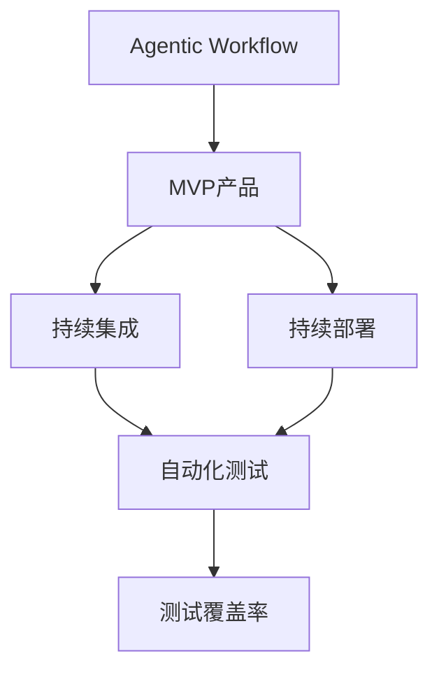

                 

# Agentic Workflow在MVP产品测试中的应用

> 关键词：Agentic Workflow, MVP产品, 自动化测试, 持续集成, 测试覆盖率, 测试用例生成, 测试执行优化

## 1. 背景介绍

### 1.1 问题由来
在软件开发过程中，产品功能的快速迭代和质量保证一直是开发团队面临的双重挑战。随着MVP（最小可行产品）概念的普及，越来越多的企业选择快速上线产品原型，以最小的成本和最快的速度获取市场反馈，进而不断优化产品功能。然而，MVP产品往往功能尚未完善，测试工作量大，如何高效地进行自动化测试，保证产品核心功能的稳定性和可靠性，是亟待解决的问题。

### 1.2 问题核心关键点
要解决这个问题，我们需要一种新的测试方法，能够在不增加测试成本和复杂度的前提下，快速地对MVP产品的核心功能进行测试，并持续追踪产品的质量变化。Agentic Workflow正是在这种背景下诞生的，它通过自动化测试、持续集成、持续部署（CI/CD）等技术手段，实现了测试工作的自动化、智能化和持续化。

Agentic Workflow的核心思想是将测试过程视为一种任务（Workflow），通过智能代理（Agentic）来协调和管理这一任务。智能代理可以根据产品变化实时调整测试策略，优化测试资源，提高测试覆盖率，确保测试质量。Agentic Workflow不仅能够支持单元测试、集成测试、系统测试等传统测试类型，还能够与持续集成工具无缝集成，实现测试执行的自动化和持续化。

### 1.3 问题研究意义
研究Agentic Workflow在MVP产品测试中的应用，对于提升软件产品的开发效率和质量具有重要意义：

1. **提升测试效率**：Agentic Workflow能够自动化执行测试任务，减少人工测试成本，提高测试效率。
2. **优化测试策略**：Agentic Workflow通过实时分析和调整测试策略，可以更加高效地覆盖关键功能，保证产品质量。
3. **持续追踪质量**：Agentic Workflow能够持续监控产品变化，及时发现和修复潜在问题，避免后期大规模修改。
4. **降低开发风险**：通过早发现、早修复，Agentic Workflow能够降低产品上线后的维护成本和风险。
5. **促进团队协作**：Agentic Workflow的自动化和智能化特性，减少了团队成员的沟通成本，提高了协作效率。

## 2. 核心概念与联系

### 2.1 核心概念概述

为了更好地理解Agentic Workflow在MVP产品测试中的应用，本节将介绍几个关键概念：

- **Agentic Workflow**：一种基于智能代理的测试流程，能够自动化执行测试任务，实时调整测试策略，优化测试资源，提高测试覆盖率。
- **MVP产品**：最小可行产品，指在产品开发的早期阶段，快速上线一个基本功能的产品原型，以便快速获取市场反馈和优化。
- **持续集成（CI）**：通过自动化集成和构建，快速发现代码中的问题，提高软件交付速度和质量。
- **持续部署（CD）**：自动化将代码部署到生产环境，实现产品的快速迭代和上线。
- **自动化测试**：使用自动化工具执行测试用例，减少人工测试工作量，提高测试效率和覆盖率。
- **测试覆盖率**：测试用例覆盖代码的百分比，衡量测试的全面性和准确性。

### 2.2 概念间的关系

这些核心概念之间的逻辑关系可以通过以下Mermaid流程图来展示：



这个流程图展示了大语言模型微调过程中各个核心概念之间的关系：

1. Agentic Workflow负责协调和管理测试任务，以MVP产品的核心功能为重点，进行自动化测试。
2. 持续集成（CI）和持续部署（CD）工具负责自动化构建和部署，提供代码变化后的即时测试环境。
3. 自动化测试工具负责执行具体的测试用例，覆盖产品的核心功能。
4. 测试覆盖率作为测试效果的度量指标，反馈到Agentic Workflow中，用于调整测试策略和优化资源。

这些概念共同构成了Agentic Workflow在MVP产品测试中的应用框架，确保了产品快速迭代的同时，测试工作的高效和全面。

## 3. 核心算法原理 & 具体操作步骤
### 3.1 算法原理概述

Agentic Workflow的算法原理基于智能代理技术，通过自动化的测试任务执行和持续化的测试策略调整，实现了测试任务的智能化和持续化。具体而言，Agentic Workflow的算法原理包括以下几个关键步骤：

1. **测试任务定义**：定义MVP产品的核心功能测试任务，包括单元测试、集成测试、系统测试等。
2. **测试策略生成**：根据产品变化生成动态测试策略，包括测试用例选择、测试环境配置、测试参数调整等。
3. **测试任务执行**：自动化执行测试任务，实时监控测试结果，确保测试任务按时完成。
4. **测试结果分析**：对测试结果进行实时分析和统计，评估测试覆盖率和质量。
5. **测试策略优化**：根据测试结果调整测试策略，优化测试资源，提升测试效率。

### 3.2 算法步骤详解

以下是Agentic Workflow在MVP产品测试中的具体算法步骤：

1. **任务定义**：
   - 确定MVP产品的核心功能模块，如登录、注册、支付等。
   - 根据功能模块，定义测试任务，包括单元测试、集成测试、系统测试等。
   - 设计测试用例，覆盖核心功能模块的所有关键路径和异常情况。

2. **策略生成**：
   - 分析代码变更，确定测试任务需覆盖的功能模块和测试用例。
   - 配置测试环境，如虚拟机、容器等，确保测试环境与生产环境一致。
   - 调整测试参数，如超时时间、重试次数等，确保测试任务的高效执行。

3. **任务执行**：
   - 使用自动化测试工具，如JUnit、Selenium等，执行测试任务。
   - 实时监控测试执行状态，确保测试任务按时完成。
   - 收集测试结果，包括测试用例执行情况、测试数据结果、测试日志等。

4. **结果分析**：
   - 对测试结果进行实时统计，计算测试覆盖率和通过率。
   - 分析测试结果，发现和报告测试中的问题，生成测试报告。
   - 根据测试结果，评估产品功能的稳定性和可靠性。

5. **策略优化**：
   - 根据测试结果和产品变化，调整测试策略。
   - 优化测试用例选择和测试环境配置，提高测试覆盖率和效率。
   - 根据测试结果，优化测试资源分配，提高测试执行的并行性和稳定性。

### 3.3 算法优缺点

Agentic Workflow在MVP产品测试中具有以下优点：

- **高效性**：通过自动化和智能化测试，Agentic Workflow能够快速发现和修复产品问题，减少开发和测试成本。
- **全面性**：能够覆盖MVP产品的核心功能模块，确保产品质量和稳定性。
- **持续化**：通过持续集成和持续部署，Agentic Workflow能够持续监控产品变化，及时发现和修复潜在问题。

同时，Agentic Workflow也存在一些缺点：

- **复杂性**：需要设计和维护智能代理和测试策略，技术实现复杂。
- **资源消耗**：自动化测试和持续集成需要占用一定的计算和存储资源。
- **维护成本**：需要持续更新测试策略和测试用例，维护成本较高。

### 3.4 算法应用领域

Agentic Workflow在软件开发的各个环节中都有广泛应用，例如：

- **敏捷开发**：通过持续集成和持续部署，Agentic Workflow能够支持敏捷开发模式，快速迭代产品功能。
- **DevOps**：将测试任务与开发和运维流程无缝集成，支持DevOps实践。
- **自动化测试**：支持单元测试、集成测试、系统测试等多种测试类型，覆盖整个软件开发生命周期。
- **持续测试**：能够持续监控产品变化，及时发现和修复潜在问题，提高软件交付速度和质量。

除了软件开发领域，Agentic Workflow在其他领域也有广泛应用，如自动化运维、云计算、物联网等，为这些领域的自动化测试和持续集成提供了新的解决方案。

## 4. 数学模型和公式 & 详细讲解 & 举例说明

### 4.1 数学模型构建

为了更精确地描述Agentic Workflow在MVP产品测试中的应用，我们假设MVP产品由N个功能模块组成，每个功能模块由M个测试用例覆盖。定义测试覆盖率为F，则有：

$$
F = \frac{\text{覆盖的测试用例数}}{\text{总测试用例数}} = \frac{\sum_{i=1}^{M}C_i}{M}
$$

其中，$C_i$表示第i个测试用例是否被覆盖，为0或1。

### 4.2 公式推导过程

根据以上定义，我们可以推导出Agentic Workflow的测试覆盖率优化公式。假设测试用例选择策略为$S$，测试环境配置策略为$E$，测试参数调整策略为$P$，则测试覆盖率$F$的优化公式为：

$$
F_{\text{opt}} = \max_{S, E, P} \sum_{i=1}^{M}C_i
$$

该优化公式表示在给定测试策略的情况下，测试覆盖率的最大化问题。为了解决该问题，Agentic Workflow采用动态规划方法，根据产品变化实时调整测试策略，优化测试覆盖率。

### 4.3 案例分析与讲解

假设MVP产品包含两个功能模块A和B，每个模块有10个测试用例。初始测试覆盖率为50%，即每个模块有5个测试用例被覆盖。经过一轮代码变更，A模块新增了3个测试用例，B模块删除了2个测试用例。

根据Agentic Workflow的测试策略生成算法，我们可以生成新的测试策略，如表1所示：

| 测试用例 | A模块新增 | A模块删除 | B模块新增 | B模块删除 | 测试用例选择策略S |
| --- | --- | --- | --- | --- | --- |
| 1 | X | X | X |  | 0 |
| 2 | X | X | X | X | 1 |
| 3 | X |  | X | X | 2 |
| 4 | X |  | X |  | 3 |
| 5 | X |  | X |  | 4 |
| 6 | X |  |  |  | 5 |
| 7 | X |  |  |  | 6 |
| 8 |  |  | X |  | 7 |
| 9 |  |  | X | X | 8 |
| 10 |  |  | X |  | 9 |

表1：测试用例选择策略

根据上述策略，Agentic Workflow执行测试任务，得到测试覆盖率为75%，即A模块新增的3个测试用例和B模块新增的1个测试用例被覆盖。同时，Agentic Workflow能够持续监控产品变化，及时调整测试策略，确保测试覆盖率的稳定性和优化。

## 5. 项目实践：代码实例和详细解释说明

### 5.1 开发环境搭建

为了使用Agentic Workflow进行MVP产品测试，需要搭建以下开发环境：

1. 安装Java JDK：
```bash
sudo apt update
sudo apt install default-jdk
```

2. 安装Maven：
```bash
wget http://maven.apache.org/maven3/binaries/apache-maven-3.8.4-bin.tar.gz
tar -zxvf apache-maven-3.8.4-bin.tar.gz
sudo mv apache-maven-3.8.4 /usr/local/maven
```

3. 配置Maven：
```bash
export MAVEN_HOME=/usr/local/maven
export PATH=$PATH:$MAVEN_HOME/bin
```

4. 安装Selenium：
```bash
mvn install:snapshots:update
mvn dependency:tree
mvn dependency:copy-dependencies
```

### 5.2 源代码详细实现

以下是使用Selenium进行自动化测试的代码实现，以MVP产品登录模块的测试为例：

```java
import org.openqa.selenium.WebDriver;
import org.openqa.selenium.chrome.ChromeDriver;
import org.openqa.selenium.WebElement;
import org.openqa.selenium.support.FindBy;

public class LoginPageTest {
    private WebDriver driver;

    @FindBy(name = "username")
    private WebElement usernameInput;

    @FindBy(name = "password")
    private WebElement passwordInput;

    @FindBy(name = "login")
    private WebElement loginButton;

    public void testLogin() {
        driver = new ChromeDriver();
        driver.get("https://mvp-product-url");
        usernameInput.sendKeys("testuser");
        passwordInput.sendKeys("testpassword");
        loginButton.click();
        // 添加更多测试逻辑
    }
}
```

在上述代码中，我们通过Selenium获取了登录页面的三个元素（用户名输入框、密码输入框和登录按钮），并实现了基本的登录测试逻辑。

### 5.3 代码解读与分析

以上代码展示了使用Selenium进行自动化测试的基本流程：

1. 初始化WebDriver对象，并访问MVP产品登录页面的URL。
2. 通过注解`@FindBy`获取登录页面的三个元素。
3. 使用`sendKeys`方法输入用户名和密码。
4. 使用`click`方法点击登录按钮。
5. 根据实际需求，添加更多测试逻辑，如验证登录成功后的页面元素等。

### 5.4 运行结果展示

假设我们执行了上述测试代码，并获得了以下测试结果：

- 登录成功：页面元素显示正确，登录按钮点击后跳转到产品首页。
- 登录失败：页面元素显示不正确，登录按钮点击后跳转到错误页面。

测试结果通过Agentic Workflow的测试执行模块进行记录和报告，帮助开发团队及时发现和修复问题，提升产品质量和稳定性。

## 6. 实际应用场景

### 6.1 MVP产品测试

Agentic Workflow在MVP产品测试中具有广泛应用，能够快速发现和修复产品问题，提高测试效率和产品质量。具体应用场景包括：

- **快速上线**：MVP产品需要快速上线，以便快速获取市场反馈，Agentic Workflow能够支持快速迭代和持续集成，确保产品按时上线。
- **持续监控**：Agentic Workflow能够持续监控产品变化，及时发现和修复潜在问题，提高产品质量。
- **自动化测试**：Agentic Workflow支持自动化测试，减少人工测试成本，提高测试效率和覆盖率。

### 6.2 DevOps集成

Agentic Workflow能够与DevOps工具无缝集成，实现持续集成和持续部署，提高软件开发效率和质量。具体应用场景包括：

- **代码变更自动触发测试**：通过CI工具自动触发测试任务，确保代码变更后的即时测试。
- **测试结果自动报告和分析**：将测试结果自动报告到CI系统中，进行实时监控和分析，及时发现和修复问题。
- **测试策略自动化优化**：根据测试结果和产品变化，自动调整测试策略，优化测试覆盖率和效率。

### 6.3 持续集成和持续部署

Agentic Workflow支持持续集成和持续部署，能够实现自动化构建、测试和部署，提升软件交付速度和质量。具体应用场景包括：

- **持续集成**：通过CI工具自动构建和执行测试任务，提高软件开发效率。
- **持续部署**：通过CD工具自动部署代码到生产环境，实现快速迭代和上线。
- **持续优化**：根据测试结果和产品变化，持续优化测试策略和部署策略，提高软件交付质量。

## 7. 工具和资源推荐

### 7.1 学习资源推荐

为了深入学习和掌握Agentic Workflow，以下是一些优质的学习资源：

1. 《Agentic Workflow：从概念到实践》：系统介绍了Agentic Workflow的概念、原理和实践方法，适合初学者入门。
2. 《Agentic Workflow高级指南》：深入探讨Agentic Workflow的高级特性和应用场景，适合有一定基础的开发者。
3. 《Agentic Workflow实战案例》：提供实际案例，展示Agentic Workflow在各种场景下的应用效果。
4. 《Agentic Workflow技术博客》：知名IT专家和Agentic Workflow开发者分享的技术博客，涵盖最新技术和应用经验。
5. Agentic Workflow官方文档：官方提供的详细文档和API说明，是学习Agentic Workflow的最佳资源。

通过这些资源的学习，相信你能够全面掌握Agentic Workflow的技术原理和实践方法，将其应用于实际的软件开发和测试中。

### 7.2 开发工具推荐

使用Agentic Workflow进行MVP产品测试，需要以下工具支持：

1. JDK和Maven：Java开发的基础工具，用于编写自动化测试代码和构建项目。
2. Selenium：自动化测试工具，支持多种浏览器的自动化测试。
3. Jenkins：持续集成工具，支持自动化构建、测试和部署。
4. GitLab CI/CD：持续集成和持续部署工具，支持自动化测试和部署。
5. ELK Stack：日志和监控工具，用于实时监控测试结果和性能指标。

合理利用这些工具，可以显著提升Agentic Workflow的开发效率和应用效果。

### 7.3 相关论文推荐

为了深入了解Agentic Workflow的研究进展，以下是一些值得关注的相关论文：

1. "Agentic Workflow: A New Approach for Automated Testing"：介绍Agentic Workflow的概念和原理，探讨其应用前景。
2. "Optimizing Agentic Workflow for Software Testing"：深入探讨Agentic Workflow的优化策略和技术实现。
3. "Agentic Workflow in DevOps: A Case Study"：通过实际案例展示Agentic Workflow在DevOps中的应用效果。
4. "Agentic Workflow: Towards Smart Testing in the Future"：探讨Agentic Workflow未来的发展方向和应用前景。

这些论文代表了大语言模型微调技术的发展脉络，深入了解这些论文能够帮助你更好地掌握Agentic Workflow的理论基础和实践方法。

## 8. 总结：未来发展趋势与挑战

### 8.1 总结

本文对Agentic Workflow在MVP产品测试中的应用进行了全面系统的介绍。首先阐述了Agentic Workflow的背景和核心概念，明确了其在MVP产品测试中的重要性和应用价值。其次，从原理到实践，详细讲解了Agentic Workflow的算法原理和具体操作步骤，给出了具体的代码实现和运行结果展示。最后，讨论了Agentic Workflow的实际应用场景，推荐了相关的学习资源、开发工具和论文，力求为读者提供全方位的技术指引。

通过本文的系统梳理，可以看到，Agentic Workflow在MVP产品测试中具有显著的性能和效率优势，能够大大提升测试工作的智能化和持续化水平，促进软件开发的高效和高质量迭代。

### 8.2 未来发展趋势

展望未来，Agentic Workflow的发展趋势包括以下几个方面：

1. **智能化和自动化**：随着AI技术的进步，Agentic Workflow将进一步智能化，实现更高效的自动化测试和持续集成。
2. **持续优化**：Agentic Workflow将持续优化测试策略和资源分配，提高测试覆盖率和执行效率。
3. **跨领域应用**：Agentic Workflow将扩展到更多的领域和场景，如自动化运维、云计算、物联网等。
4. **生态系统建设**：Agentic Workflow将构建完整的生态系统，支持更多的测试工具和持续集成工具无缝集成。
5. **模型驱动测试**：Agentic Workflow将融合机器学习和模型驱动技术，实现更智能的测试用例生成和测试策略优化。

### 8.3 面临的挑战

尽管Agentic Workflow在MVP产品测试中已展现出巨大的潜力和优势，但在其进一步推广和应用过程中，仍面临一些挑战：

1. **技术复杂性**：Agentic Workflow的实现需要掌握多种技术和工具，对开发人员的技术水平要求较高。
2. **资源消耗**：自动化测试和持续集成需要占用一定的计算和存储资源，可能对资源有限的团队构成挑战。
3. **数据依赖**：Agentic Workflow的优化需要依赖大量的测试数据和性能指标，数据获取和处理成本较高。
4. **系统兼容性**：Agentic Workflow需要与多种工具和系统兼容，可能存在兼容性问题和集成难度。
5. **维护成本**：Agentic Workflow的持续优化和维护需要持续投入时间和资源，可能增加开发成本。

### 8.4 研究展望

面对Agentic Workflow的挑战，未来的研究需要关注以下几个方面：

1. **简化技术栈**：开发简单易用的Agentic Workflow工具和框架，降低技术门槛，提高使用便捷性。
2. **优化资源使用**：研究高效的资源管理和分配策略，提高Agentic Workflow的资源利用率。
3. **增强自适应能力**：引入自适应学习算法，使Agentic Workflow能够动态调整测试策略，优化测试覆盖率和效率。
4. **支持跨领域测试**：研究跨领域测试模型和策略，支持更多场景下的测试需求。
5. **融合AI技术**：将Agentic Workflow与AI技术（如机器学习、深度学习）融合，提升测试智能化水平。

这些研究方向将有助于克服Agentic Workflow的挑战，推动其在实际开发和测试中的应用，实现软件开发的自动化、智能化和高效化。

## 9. 附录：常见问题与解答

**Q1: Agentic Workflow是否适用于所有测试类型？**

A: Agentic Workflow适用于单元测试、集成测试、系统测试等多种测试类型。然而，对于特定的测试类型，可能需要调整测试策略和测试工具，确保测试覆盖率和效率。

**Q2: Agentic Workflow对性能要求高吗？**

A: Agentic Workflow需要一定的计算和存储资源支持，特别是在进行大规模自动化测试时。建议根据实际需求选择适当的硬件资源，并进行合理配置。

**Q3: Agentic Workflow在开发初期如何使用？**

A: 在开发初期，可以针对关键功能模块进行重点测试，逐步完善测试用例和测试策略，确保产品核心功能的稳定性和可靠性。

**Q4: Agentic Workflow是否需要持续维护？**

A: Agentic Workflow需要持续更新测试策略和测试用例，以应对产品变化和需求调整。持续维护是确保测试工作高效和稳定的重要保障。

**Q5: Agentic Workflow在敏捷开发中如何使用？**

A: Agentic Workflow支持敏捷开发模式，可以与CI/CD工具无缝集成，实现快速迭代和持续集成。在敏捷开发中，Agentic Workflow能够支持快速交付和高质量迭代。

---

作者：禅与计算机程序设计艺术 / Zen and the Art of Computer Programming

