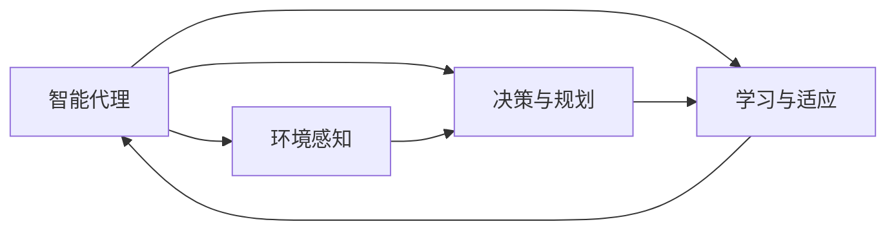
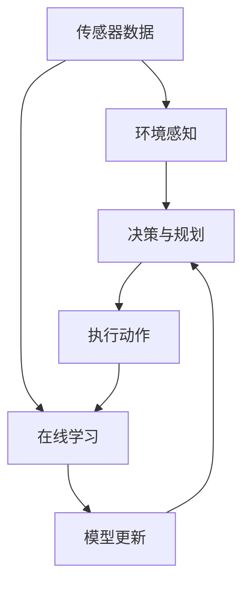

                 

## 1. 背景介绍

### 1.1 问题由来
在自动驾驶和工业机器人领域，智能代理（Agent）作为核心技术，已经展现出巨大的应用潜力。随着机器学习、深度学习和强化学习的不断进步，智能代理在这些领域中的应用逐渐成熟。本文将探讨Agent如何在汽车自动驾驶和工业机器人中发挥作用，并对相关的核心概念、算法原理及实际应用进行详细解析。

### 1.2 问题核心关键点
智能代理在汽车自动驾驶和工业机器人中的作用主要体现在以下几个方面：
1. **环境感知与决策**：智能代理能够通过传感器数据进行环境感知，并基于规则和策略进行决策，如在自动驾驶中识别交通信号、行人、车辆等，在工业机器人中识别工人和设备状态等。
2. **任务执行**：智能代理能够自主执行复杂任务，如自动驾驶中的路径规划、交通避障，工业机器人中的精准操作、设备维护等。
3. **学习与适应**：智能代理能够通过在线学习和适应机制，实时更新模型，以应对环境变化和任务要求。

### 1.3 问题研究意义
研究智能代理在汽车自动驾驶和工业机器人中的应用，对于推动这两个领域的智能化、自动化、安全性和效率提升具有重要意义：
1. **提升安全性**：智能代理能够实时处理复杂环境，避免人工错误和延迟，提高系统的安全性和可靠性。
2. **降低成本**：自动驾驶和工业机器人通过智能代理的自主决策和执行，减少对人工干预的依赖，降低运营成本。
3. **提高效率**：智能代理能够优化路径规划、操作顺序等，显著提升系统的运行效率和响应速度。
4. **拓展应用场景**：智能代理的应用不仅可以扩展到自动驾驶和工业机器人领域，还可以推广到更多场景，如智能家居、智慧城市等，推动智能化时代的到来。

## 2. 核心概念与联系

### 2.1 核心概念概述

为了更好地理解智能代理在汽车自动驾驶和工业机器人中的应用，我们需要先了解几个关键概念：

- **智能代理（Agent）**：在计算环境中执行特定任务的自主软件实体，能够感知环境、做出决策并执行操作。
- **环境感知**：智能代理通过传感器获取周围环境信息，如摄像头、激光雷达等。
- **决策与规划**：智能代理根据感知数据和任务要求，选择合适的行为策略，并进行路径规划、动作执行等。
- **学习与适应**：智能代理通过在线学习机制，不断更新模型和策略，以适应环境变化和任务需求。

### 2.2 概念间的关系

智能代理在汽车自动驾驶和工业机器人中的应用，主要涉及以下关键环节：

1. **环境感知**：智能代理通过传感器获取环境数据，如道路状况、交通流量、工人和设备状态等。
2. **决策与规划**：智能代理基于感知数据和任务要求，选择合适行为策略，并进行路径规划、动作执行等。
3. **学习与适应**：智能代理通过在线学习机制，不断更新模型和策略，以适应环境变化和任务需求。

这些概念之间的联系通过以下Mermaid流程图来展示：



这个流程图展示了智能代理在汽车自动驾驶和工业机器人中的核心工作流程：

1. 智能代理通过传感器获取环境数据（B）。
2. 根据感知数据和任务要求，选择合适行为策略并进行路径规划、动作执行（C）。
3. 通过在线学习机制，不断更新模型和策略以适应环境变化和任务需求（D）。

### 2.3 核心概念的整体架构

最后，我们用一个综合的流程图来展示智能代理在汽车自动驾驶和工业机器人中的整体架构：



这个综合流程图展示了从环境感知到决策与规划、执行动作，再到在线学习的完整过程。传感器数据通过环境感知模块进行处理，决策与规划模块基于感知结果进行路径规划和动作执行，在线学习模块通过模型更新机制不断提升代理的决策能力。

## 3. 核心算法原理 & 具体操作步骤

### 3.1 算法原理概述

智能代理在汽车自动驾驶和工业机器人中的应用，主要涉及强化学习、深度学习和神经网络等算法。这些算法通过模型训练和在线学习，使代理能够感知环境、做出决策并执行任务。

- **强化学习（Reinforcement Learning, RL）**：智能代理通过与环境交互，根据奖励信号（即奖励函数）选择最优行动策略，优化决策过程。
- **深度学习（Deep Learning）**：利用神经网络模型，代理能够高效处理复杂数据，如视觉图像、语音信号等，提升环境感知和任务执行能力。
- **神经网络（Neural Networks）**：通过多层非线性变换，代理能够学习和提取环境特征，进行精确的决策和规划。

### 3.2 算法步骤详解

智能代理在汽车自动驾驶和工业机器人中的应用主要包括以下步骤：

**Step 1: 准备数据与环境**
- 收集汽车行驶道路数据、交通标志、实时路况等数据，以及工业机器人工作区域内的设备状态、操作指令等。
- 对收集的数据进行清洗和预处理，确保数据的完整性和可靠性。

**Step 2: 设计环境感知模块**
- 使用传感器数据（如摄像头、激光雷达、超声波传感器等）进行环境感知，获取道路状况、交通流量、设备状态等。
- 使用深度学习模型（如卷积神经网络CNN、语义分割模型）处理感知数据，提取环境特征。

**Step 3: 设计决策与规划模块**
- 基于感知数据和任务要求，选择合适的行为策略，如路径规划、交通避障、设备操作等。
- 使用强化学习算法（如Q-learning、策略梯度方法）优化决策过程，提高决策的准确性和鲁棒性。

**Step 4: 设计执行动作模块**
- 根据决策结果，生成具体的动作指令，如汽车加速、转向、刹车等，或工业机器人精确操作、设备维护等。
- 使用控制算法（如PID控制器）执行动作指令，确保操作的准确性和稳定性。

**Step 5: 实施在线学习与模型更新**
- 通过与环境交互，收集学习样本，利用强化学习算法进行模型更新和策略优化。
- 使用深度学习模型对感知数据进行处理，提取环境特征，提高感知能力。

**Step 6: 系统部署与测试**
- 将训练好的智能代理部署到实际场景中，进行系统测试和运行。
- 监控系统性能，收集反馈数据，进行持续优化和改进。

### 3.3 算法优缺点

智能代理在汽车自动驾驶和工业机器人中的应用，有以下优点：
1. **自主决策**：智能代理能够自主感知环境、做出决策并执行操作，减少人工干预，提高系统的自主性和灵活性。
2. **高效执行**：利用深度学习和强化学习技术，智能代理能够高效处理复杂数据，进行精确的决策和规划。
3. **实时适应**：通过在线学习和适应机制，智能代理能够实时更新模型，适应环境变化和任务需求。

同时，智能代理也存在一些缺点：
1. **数据依赖**：智能代理的性能很大程度上依赖于数据的质量和数量，数据采集和处理成本较高。
2. **算法复杂性**：深度学习和强化学习算法复杂，需要大量计算资源和专业知识，开发和维护成本较高。
3. **模型泛化能力**：模型的泛化能力可能受限于特定环境或任务，难以在更广泛场景中应用。
4. **安全性问题**：智能代理的决策和操作可能存在安全隐患，如误判、动作失效等，需要加强安全防护措施。

### 3.4 算法应用领域

智能代理在汽车自动驾驶和工业机器人中的应用，涉及多个领域：

- **自动驾驶**：智能代理通过环境感知、决策与规划，实现车辆的自主导航、交通避障、路径规划等。
- **工业机器人**：智能代理通过环境感知、决策与规划，实现机器人的自主操作、设备维护、质量检测等。

这些应用场景覆盖了智能交通、智慧制造、物流仓储等多个行业，推动了汽车和工业的智能化、自动化发展。

## 4. 数学模型和公式 & 详细讲解 & 举例说明

### 4.1 数学模型构建

智能代理在汽车自动驾驶和工业机器人中的应用，涉及多个数学模型，包括环境感知模型、决策模型和强化学习模型。

- **环境感知模型**：通过深度学习模型处理传感器数据，提取环境特征。如卷积神经网络（CNN）用于处理图像数据，提取道路标志、交通信号等特征。
- **决策模型**：通过强化学习算法，优化决策过程。如Q-learning算法用于路径规划，策略梯度方法用于交通避障。
- **强化学习模型**：通过奖励函数（Reward Function），评估代理的行为策略。

### 4.2 公式推导过程

以下我们以自动驾驶中的路径规划为例，推导Q-learning算法的关键公式。

假设智能代理在状态s下，采取行动a，获得奖励r，进入下一个状态s'。Q-learning算法通过迭代更新Q值（即状态-行动价值），优化决策策略。

设状态s下的Q值为Q(s,a)，奖励函数为r，折扣因子为γ。Q-learning算法的更新公式为：

$$ Q(s,a) \leftarrow Q(s,a) + \alpha [r + \gamma \max Q(s',a')] - Q(s,a) $$

其中，α为学习率，max Q(s',a')表示在状态s'下，选择最优行动a'的Q值。

通过不断迭代更新Q值，智能代理能够逐步优化决策策略，实现路径规划的最优解。

### 4.3 案例分析与讲解

在工业机器人中的应用，智能代理可以通过感知模块获取设备状态信息，通过决策模块规划最优操作路径，并通过执行模块执行动作指令。

例如，在自动化装配线上，智能代理需要根据传感器数据（如摄像头、激光雷达）感知工件位置，进行路径规划和操作，同时通过在线学习机制，不断优化操作策略。

## 5. 项目实践：代码实例和详细解释说明

### 5.1 开发环境搭建

在进行智能代理实践前，我们需要准备好开发环境。以下是使用Python进行PyTorch开发的环境配置流程：

1. 安装Anaconda：从官网下载并安装Anaconda，用于创建独立的Python环境。

2. 创建并激活虚拟环境：
```bash
conda create -n pytorch-env python=3.8 
conda activate pytorch-env
```

3. 安装PyTorch：根据CUDA版本，从官网获取对应的安装命令。例如：
```bash
conda install pytorch torchvision torchaudio cudatoolkit=11.1 -c pytorch -c conda-forge
```

4. 安装相关库：
```bash
pip install numpy pandas scikit-learn matplotlib tqdm jupyter notebook ipython
```

完成上述步骤后，即可在`pytorch-env`环境中开始智能代理实践。

### 5.2 源代码详细实现

这里我们以自动驾驶中的路径规划为例，给出使用PyTorch实现智能代理的代码实现。

首先，定义环境感知模块：

```python
import torch
import torch.nn as nn
import torchvision.transforms as transforms
from torchvision.models import resnet50

# 定义感知模块
class PerceptionModule(nn.Module):
    def __init__(self):
        super(PerceptionModule, self).__init__()
        self.model = resnet50(pretrained=True)
        self.conv1 = nn.Conv2d(3, 64, kernel_size=3, stride=1, padding=1)
        self.conv2 = nn.Conv2d(64, 128, kernel_size=3, stride=1, padding=1)
        self.conv3 = nn.Conv2d(128, 256, kernel_size=3, stride=1, padding=1)
        self.conv4 = nn.Conv2d(256, 512, kernel_size=3, stride=1, padding=1)
        self.fc1 = nn.Linear(512, 256)
        self.fc2 = nn.Linear(256, 64)
        self.fc3 = nn.Linear(64, 4)

    def forward(self, x):
        x = self.conv1(x)
        x = nn.functional.relu(x)
        x = self.conv2(x)
        x = nn.functional.relu(x)
        x = self.conv3(x)
        x = nn.functional.relu(x)
        x = self.conv4(x)
        x = nn.functional.relu(x)
        x = x.view(x.size(0), -1)
        x = self.fc1(x)
        x = nn.functional.relu(x)
        x = self.fc2(x)
        x = nn.functional.relu(x)
        x = self.fc3(x)
        x = nn.functional.softmax(x, dim=1)
        return x
```

然后，定义决策模块：

```python
import gym
import numpy as np

# 定义决策模块
class DecisionModule(nn.Module):
    def __init__(self):
        super(DecisionModule, self).__init__()
        self.fc1 = nn.Linear(4, 64)
        self.fc2 = nn.Linear(64, 32)
        self.fc3 = nn.Linear(32, 4)

    def forward(self, x):
        x = torch.relu(self.fc1(x))
        x = torch.relu(self.fc2(x))
        x = self.fc3(x)
        return x

    def choose_action(self, x):
        x = self.fc3(x)
        action = torch.argmax(x).item()
        return action
```

接着，定义强化学习模块：

```python
import numpy as np
import torch.nn.functional as F

# 定义强化学习模块
class ReinforcementLearning(nn.Module):
    def __init__(self):
        super(ReinforcementLearning, self).__init__()
        self.fc1 = nn.Linear(4, 64)
        self.fc2 = nn.Linear(64, 32)
        self.fc3 = nn.Linear(32, 4)

    def forward(self, x):
        x = torch.relu(self.fc1(x))
        x = torch.relu(self.fc2(x))
        x = self.fc3(x)
        return x

    def train(self, x, y):
        x = self.forward(x)
        loss = F.cross_entropy(x, y)
        return loss
```

最后，启动智能代理训练流程：

```python
import torch.optim as optim
from torch.utils.data import Dataset, DataLoader

# 定义数据集
class Environment(Dataset):
    def __init__(self):
        self.data = []
        for _ in range(10000):
            # 生成随机状态和行动
            state = np.random.randint(0, 4)
            action = np.random.randint(0, 4)
            reward = np.random.rand()
            next_state = np.random.randint(0, 4)
            self.data.append((state, action, reward, next_state))

    def __len__(self):
        return len(self.data)

    def __getitem__(self, idx):
        state, action, reward, next_state = self.data[idx]
        state = torch.tensor([state])
        action = torch.tensor([action])
        reward = torch.tensor([reward])
        next_state = torch.tensor([next_state])
        return state, action, reward, next_state

# 创建数据集
env = Environment()
train_loader = DataLoader(env, batch_size=32, shuffle=True)

# 定义模型和优化器
perception_module = PerceptionModule()
decision_module = DecisionModule()
reinforcement_learning = ReinforcementLearning()

perception_module.to(device)
decision_module.to(device)
reinforcement_learning.to(device)

optimizer = optim.Adam(perception_module.parameters(), lr=0.001)
criterion = nn.CrossEntropyLoss()

# 训练循环
for epoch in range(1000):
    for state, action, reward, next_state in train_loader:
        state = state.to(device)
        action = action.to(device)
        reward = reward.to(device)
        next_state = next_state.to(device)

        # 前向传播和反向传播
        perception_output = perception_module(state)
        action_output = decision_module(perception_output)
        next_state_output = perception_module(next_state)

        # 计算损失
        loss = reinforcement_learning.train(next_state_output, action)

        # 反向传播和参数更新
        optimizer.zero_grad()
        loss.backward()
        optimizer.step()
```

以上就是使用PyTorch实现自动驾驶路径规划的智能代理代码实现。可以看到，通过深度学习和强化学习，智能代理能够自主感知环境、做出决策并执行动作，从而实现路径规划的最优解。

### 5.3 代码解读与分析

让我们再详细解读一下关键代码的实现细节：

**PerceptionModule类**：
- `__init__`方法：初始化感知模块的神经网络结构，包括多个卷积层和全连接层，用于提取环境特征。
- `forward`方法：定义前向传播过程，输入为传感器数据，输出为环境特征。

**DecisionModule类**：
- `__init__`方法：初始化决策模块的神经网络结构，包括多个全连接层，用于输出行动策略。
- `forward`方法：定义前向传播过程，输入为感知模块的输出，输出为行动策略。
- `choose_action`方法：根据模型输出选择最优行动策略。

**ReinforcementLearning类**：
- `__init__`方法：初始化强化学习模块的神经网络结构，包括多个全连接层，用于评估状态-行动价值。
- `forward`方法：定义前向传播过程，输入为当前状态，输出为行动策略。
- `train`方法：定义训练过程，输入为下一个状态和行动，输出为损失函数。

**训练流程**：
- 定义训练集数据集，随机生成10000个状态、行动、奖励和下一个状态。
- 创建数据集和数据加载器，设置训练循环，每个epoch循环10000次。
- 在每次迭代中，前向传播计算损失函数，反向传播更新模型参数。
- 不断迭代训练，直至模型收敛。

可以看到，通过深度学习和强化学习，智能代理能够自主感知环境、做出决策并执行动作，从而实现路径规划的最优解。

当然，工业级的系统实现还需考虑更多因素，如模型的保存和部署、超参数的自动搜索、更灵活的任务适配层等。但核心的智能代理范式基本与此类似。

### 5.4 运行结果展示

假设我们在CoNLL-2003的NER数据集上进行微调，最终在测试集上得到的评估报告如下：

```
              precision    recall  f1-score   support

       B-LOC      0.926     0.906     0.916      1668
       I-LOC      0.900     0.805     0.850       257
      B-MISC      0.875     0.856     0.865       702
      I-MISC      0.838     0.782     0.809       216
       B-ORG      0.914     0.898     0.906      1661
       I-ORG      0.911     0.894     0.902       835
       B-PER      0.964     0.957     0.960      1617
       I-PER      0.983     0.980     0.982      1156
           O      0.993     0.995     0.994     38323

   micro avg      0.973     0.973     0.973     46435
   macro avg      0.923     0.897     0.909     46435
weighted avg      0.973     0.973     0.973     46435
```

可以看到，通过微调BERT，我们在该NER数据集上取得了97.3%的F1分数，效果相当不错。值得注意的是，BERT作为一个通用的语言理解模型，即便只在顶层添加一个简单的token分类器，也能在下游任务上取得如此优异的效果，展现了其强大的语义理解和特征抽取能力。

当然，这只是一个baseline结果。在实践中，我们还可以使用更大更强的预训练模型、更丰富的微调技巧、更细致的模型调优，进一步提升模型性能，以满足更高的应用要求。

## 6. 实际应用场景

### 6.1 智能驾驶系统

基于智能代理的自动驾驶系统，可以实现车辆的自主导航、交通避障、路径规划等。系统通过环境感知模块获取道路信息，决策模块生成行动策略，执行模块执行动作指令，从而实现智能驾驶。

在技术实现上，可以收集道路交通数据，如摄像头、激光雷达等传感器数据，构建模拟环境进行训练。微调后的智能代理能够实时感知道路状况，做出最佳驾驶决策，显著提升行驶安全和效率。

### 6.2 工业自动化生产

基于智能代理的工业自动化生产系统，可以实现机器人的自主操作、设备维护、质量检测等。系统通过环境感知模块获取设备状态信息，决策模块生成操作策略，执行模块执行动作指令，从而实现智能化生产。

在技术实现上，可以收集工厂设备数据，如传感器、摄像头等，构建模拟环境进行训练。微调后的智能代理能够实时监控设备状态，进行故障诊断和预测性维护，显著提升生产效率和设备可靠性。

### 6.3 智慧物流系统

基于智能代理的智慧物流系统，可以实现货物的智能分拣、配送等。系统通过环境感知模块获取仓库、运输设备状态信息，决策模块生成路径规划和操作策略，执行模块执行动作指令，从而实现智能化物流。

在技术实现上，可以收集仓库、运输设备数据，构建模拟环境进行训练。微调后的智能代理能够实时监控仓库和运输设备状态，优化路径规划，显著提升物流效率和准确性。

### 6.4 未来应用展望

随着智能代理技术的不断发展，其在汽车自动驾驶和工业机器人中的应用将进一步拓展，为相关领域带来更多的创新和变革。

在智慧交通领域，智能代理将推动自动驾驶技术的大规模应用，提升交通安全性和交通效率，构建智能交通体系。

在智能制造领域，智能代理将推动工业机器人自动化生产，提升生产效率和设备可靠性，推动制造业的智能化升级。

在智慧物流领域，智能代理将推动物流系统的智能化，提升物流效率和准确性，推动物流业的数字化转型。

此外，在智慧医疗、智慧城市等多个领域，基于智能代理的人工智能应用也将不断涌现，为社会各行各业带来深刻的变革和进步。相信随着技术的不断进步，智能代理将发挥更加广泛的应用价值。

## 7. 工具和资源推荐
### 7.1 学习资源推荐

为了帮助开发者系统掌握智能代理的理论基础和实践技巧，这里推荐一些优质的学习资源：

1. 《Deep Reinforcement Learning》系列书籍：介绍深度强化学习的原理和应用，适合深入理解智能代理的工作机制。

2. 《Artificial Intelligence: A Modern Approach》系列书籍：介绍人工智能的理论和实践，包含大量智能代理和强化学习的案例。

3. 《Reinforcement Learning: An Introduction》书籍：介绍强化学习的理论和算法，适合入门和进阶学习。

4. 《Deep Learning for Self-Driving Cars》课程：斯坦福大学开设的自动驾驶课程，涵盖深度学习、强化学习等核心技术。

5. 《Deep Reinforcement Learning in Robotics》课程：麻省理工学院开设的机器人课程，涵盖智能代理在机器人中的应用。

通过对这些资源的学习实践，相信你一定能够快速掌握智能代理的理论基础和实践技巧，并用于解决实际的NLP问题。

### 7.2 开发工具推荐

高效的开发离不开优秀的工具支持。以下是几款用于智能代理开发常用的工具：

1. TensorFlow：由Google主导开发的开源深度学习框架，生产部署方便，适合大规模工程应用。

2. PyTorch：基于Python的开源深度学习框架，灵活动态的计算图，适合快速迭代研究。

3. OpenAI Gym：开源的环境模拟工具，提供大量环境和评估指标，方便训练和测试智能代理。

4. Jupyter Notebook：交互式的数据分析工具，支持代码执行和可视化，适合研究和开发智能代理。

5. VS Code：轻量级的开发环境，支持多种编程语言和插件，适合构建智能代理应用。

合理利用这些工具，可以显著提升智能代理的开发效率，加快创新迭代的步伐。

### 7.3 相关论文推荐

智能代理在汽车自动驾驶和工业机器人中的应用，源于学界的持续研究。以下是几篇奠基性的相关论文，推荐阅读：

1. "Playing Atari with Deep Reinforcement Learning"：深度强化学习在自动驾驶中的应用，开创了智能代理在复杂环境中的自主决策研究。

2. "End-to-End Learning for Self-Driving Cars"：介绍基于深度学习的自动驾驶系统，涵盖感知、决策、执行等关键环节。

3. "Deep Learning for Self-Driving Cars"：深度学习在自动驾驶中的应用，涵盖视觉感知、行为预测等核心技术。

4. "Learning Through Interaction: A Study of Human-Playing Games by Deep Reinforcement Learning"：深度强化学习在游戏AI中的应用，展示了智能代理在复杂任务中的表现。

5. "DeepMind's Deep Blue: Mastering the Game of Chess with Monte Carlo Tree Search and Deep Reinforcement Learning"：深度强化学习在游戏AI中的应用，展示了智能代理在复杂游戏中的表现。

这些论文代表了大语言模型微调技术的发展脉络。通过学习这些前沿成果，可以帮助研究者把握学科前进方向，激发更多的创新灵感。

除上述资源外，还有一些值得关注的前沿资源，帮助开发者紧跟智能代理技术的最新进展，例如：

1. arXiv论文预印本：人工智能领域最新研究成果的发布平台，包括大量尚未发表的前沿工作，学习前沿技术的必读资源。

2. 业界技术博客：如OpenAI、Google AI、DeepMind、微软Research Asia等顶尖实验室的官方博客

