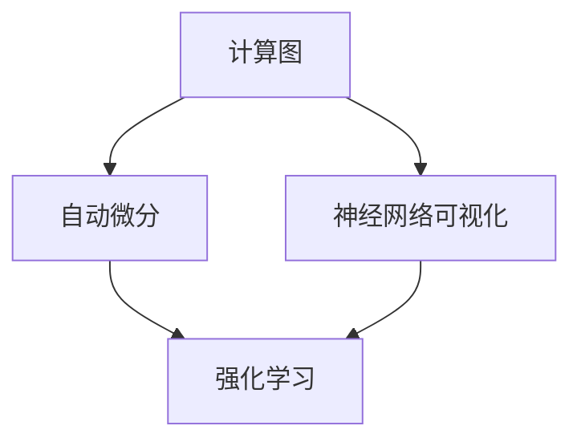
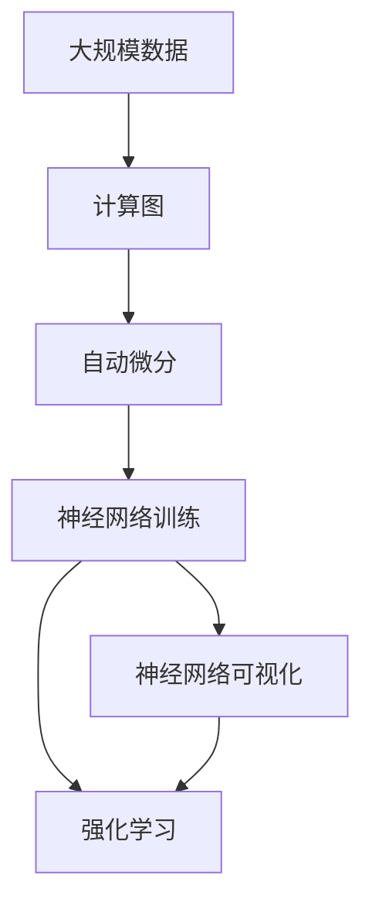

                 

# Andrej Karpathy的计算与自动化见解

> 关键词：计算图, 自动微分, 自动可视化, 可解释性, 强化学习, 人工智能, 神经网络, 卷积神经网络

## 1. 背景介绍

### 1.1 问题由来
Andrej Karpathy是深度学习领域的著名专家，以其在自动驾驶、神经网络可视化、强化学习等方面的开创性工作而闻名。他的研究不仅推动了学术界和工业界的技术进步，也为计算与自动化领域带来了深远影响。本文将系统介绍Karpathy的研究成果，特别是他在计算图、自动微分、神经网络可视化等方面的独到见解，及其在实际应用场景中的应用。

### 1.2 问题核心关键点
Karpathy的研究重点主要集中在以下几个方面：
- 计算图（Computation Graph）的开发与应用
- 自动微分（Automatic Differentiation）技术
- 神经网络的可解释性（Explainability）
- 强化学习在自动驾驶中的应用

这些研究方向不仅是AI领域的重要课题，也代表了计算与自动化领域的前沿方向。通过深入理解Karpathy的见解，我们不仅能获取技术上的洞见，还能洞察其在实际应用中的潜在价值。

### 1.3 问题研究意义
Karpathy的研究对于推进深度学习、计算图与自动化的发展具有重要意义：
- 推动深度学习模型的研究与应用，提升模型效率与效果
- 促进自动微分技术的普及与应用，简化深度学习模型的开发与优化
- 增强神经网络的可解释性，使AI技术更透明、更可信
- 推动强化学习在自动驾驶等领域的实践，实现人机交互与环境自适应的新突破

通过学习和借鉴Karpathy的研究成果，我们不仅能提升自身技术水平，还能为未来的研究与实践提供有力支持。

## 2. 核心概念与联系

### 2.1 核心概念概述

Karpathy的研究跨越了计算图、自动微分、神经网络可视化、强化学习等多个领域。这些研究领域之间既有相互独立的特点，也有密切的联系。下面我们将逐一介绍这些核心概念，并探讨它们之间的内在联系。

#### 2.1.1 计算图（Computation Graph）

计算图是描述一个计算过程的图形表示，它通过有向边连接不同的计算节点，表示节点之间的依赖关系。在深度学习中，计算图被广泛应用于模型的构建与优化过程中。计算图的开发与应用不仅简化了深度学习模型的计算过程，还提高了模型训练与推理的效率。

#### 2.1.2 自动微分（Automatic Differentiation）

自动微分是一种高效计算梯度的方法，通过构建计算图来自动计算函数对变量的导数。自动微分技术在深度学习中应用广泛，不仅可以简化模型的构建与优化，还能提高模型训练的效率与精度。

#### 2.1.3 神经网络的可解释性（Explainability）

神经网络的可解释性是指理解模型内部工作机制的能力，使AI技术更加透明、可信。Karpathy通过可视化技术，揭示了神经网络在图像识别、自然语言处理等任务中的决策过程，极大地提升了模型的可解释性。

#### 2.1.4 强化学习（Reinforcement Learning）

强化学习是一种通过试错来学习最优策略的机器学习方法。Karpathy将强化学习技术应用于自动驾驶领域，开发了VimlFeat和VimlCtrl等工具，使AI系统能够自适应环境，实现精确控制。

### 2.2 概念间的关系

这些核心概念之间的关系可以通过以下Mermaid流程图来展示：



这个流程图展示了计算图、自动微分、神经网络可视化、强化学习之间的联系。计算图和自动微分是构建神经网络的基础，神经网络可视化使模型更加透明，而强化学习则在复杂环境中提供了自适应的学习机制。

### 2.3 核心概念的整体架构

最后，我们用一个综合的流程图来展示这些核心概念在大规模自动化实践中的整体架构：



这个综合流程图展示了从大规模数据到神经网络训练的全过程，其中计算图和自动微分是关键环节，神经网络可视化辅助理解模型，强化学习提供自适应学习机制。

## 3. 核心算法原理 & 具体操作步骤
### 3.1 算法原理概述

Karpathy的研究工作覆盖了多个领域的算法原理，下面我们将详细介绍其中的一些核心算法。

#### 3.1.1 计算图的构建与应用

计算图的构建是深度学习模型的基础。Karpathy提出了多种构建计算图的方法，包括动态计算图、静态计算图等。动态计算图允许模型在运行时动态生成计算图，提高了模型的灵活性与可扩展性。静态计算图则通过预定义计算图，简化了模型的构建与优化过程。

#### 3.1.2 自动微分技术

自动微分是深度学习中不可或缺的一部分。Karpathy通过构建计算图，实现了自动求导，使模型的训练与优化过程更加高效。自动微分技术不仅简化了模型的构建，还能提高模型的训练精度。

#### 3.1.3 神经网络的可解释性

Karpathy通过可视化技术，揭示了神经网络在图像识别、自然语言处理等任务中的决策过程。他开发了多个可视化工具，如Neural Network Visualization、TensorBoard等，使模型的内部机制更加透明。

#### 3.1.4 强化学习的优化

Karpathy将强化学习技术应用于自动驾驶领域，开发了VimlFeat和VimlCtrl等工具，使AI系统能够自适应环境，实现精确控制。通过强化学习，AI系统可以在复杂环境中自主学习，提升其决策能力。

### 3.2 算法步骤详解

下面我们详细介绍Karpathy在计算图、自动微分、神经网络可视化、强化学习等领域的算法步骤。

#### 3.2.1 计算图构建步骤

1. 数据预处理：将输入数据转换为计算图能够处理的格式。
2. 定义计算图：通过定义计算图节点和边，构建计算图。
3. 优化计算图：根据模型需求，优化计算图结构。
4. 执行计算图：根据计算图结构，进行模型训练与推理。

#### 3.2.2 自动微分算法步骤

1. 构建计算图：将模型定义转换为计算图。
2. 计算导数：通过计算图自动计算函数对变量的导数。
3. 反向传播：根据导数计算模型的梯度。
4. 更新模型参数：根据梯度更新模型参数，完成模型的优化。

#### 3.2.3 神经网络可视化步骤

1. 数据输入：将模型输入数据转换为可视化格式。
2. 定义可视化规则：根据任务需求，定义可视化规则。
3. 生成可视化结果：根据可视化规则，生成可视化结果。
4. 分析与优化：根据可视化结果，分析模型决策过程，优化模型参数。

#### 3.2.4 强化学习算法步骤

1. 环境定义：定义AI系统所处的复杂环境。
2. 策略定义：定义AI系统的决策策略。
3. 模型训练：通过试错学习，训练AI系统的策略。
4. 策略优化：根据环境反馈，优化AI系统的策略。

### 3.3 算法优缺点

#### 3.3.1 计算图的优点与缺点

**优点：**
- 简化了模型的构建与优化过程。
- 提高了模型训练与推理的效率。

**缺点：**
- 构建复杂计算图可能增加计算复杂度。
- 动态计算图可能导致性能问题。

#### 3.3.2 自动微分的优点与缺点

**优点：**
- 简化了模型的构建与优化过程。
- 提高了模型训练的精度与效率。

**缺点：**
- 复杂模型可能导致计算资源消耗大。
- 自动微分技术可能难以处理复杂的反向传播问题。

#### 3.3.3 神经网络可视化的优点与缺点

**优点：**
- 提高了模型的可解释性。
- 辅助分析模型决策过程。

**缺点：**
- 可视化过程可能增加计算复杂度。
- 复杂模型的可视化可能难以展示。

#### 3.3.4 强化学习的优点与缺点

**优点：**
- 自适应环境，实现精确控制。
- 自主学习，提升决策能力。

**缺点：**
- 学习过程可能较为缓慢。
- 环境复杂可能导致学习困难。

### 3.4 算法应用领域

Karpathy的研究成果不仅在学术界具有重要意义，还在多个应用领域得到了广泛应用。

#### 3.4.1 计算图与自动微分在深度学习中的应用

计算图与自动微分技术在深度学习中应用广泛，简化了模型的构建与优化过程，提高了模型训练与推理的效率。

#### 3.4.2 神经网络可视化在NLP中的应用

神经网络可视化技术在自然语言处理（NLP）中应用广泛，揭示了模型在文本分类、情感分析等任务中的决策过程，提高了模型的可解释性。

#### 3.4.3 强化学习在自动驾驶中的应用

强化学习技术在自动驾驶领域具有重要应用价值，使AI系统能够自适应环境，实现精确控制，提升了驾驶安全与效率。

## 4. 数学模型和公式 & 详细讲解 & 举例说明
### 4.1 数学模型构建

Karpathy的研究涉及多个数学模型，下面我们将详细介绍其中的一些核心模型。

#### 4.1.1 计算图的数学模型

计算图模型可以表示为：

$$
G = \left\lbrace N, E \right\rbrace
$$

其中，$N$ 表示计算图中的节点，$E$ 表示计算图中的边。节点表示计算中的操作，边表示操作间的依赖关系。

#### 4.1.2 自动微分的数学模型

自动微分模型可以表示为：

$$
\frac{\partial \mathcal{L}}{\partial \theta} = \sum_{i=1}^{n} \frac{\partial \mathcal{L}}{\partial z_i} \frac{\partial z_i}{\partial \theta}
$$

其中，$\mathcal{L}$ 为损失函数，$\theta$ 为模型参数，$z_i$ 为计算图中的节点输出。

#### 4.1.3 神经网络可视化的数学模型

神经网络可视化的数学模型较为复杂，涉及多层神经网络的前向传播与反向传播过程。以下以简单的全连接神经网络为例，给出其可视化过程：

$$
y = \sigma \left( W^1 x + b^1 \right)
$$

$$
z = \sigma \left( W^2 y + b^2 \right)
$$

其中，$\sigma$ 为激活函数，$W^1$、$W^2$ 为权重矩阵，$b^1$、$b^2$ 为偏置向量，$x$、$y$、$z$ 分别为输入、隐藏层输出与最终输出。

#### 4.1.4 强化学习的数学模型

强化学习模型可以表示为：

$$
Q(s_t, a_t) = r + \gamma \max_{a_{t+1}} Q(s_{t+1}, a_{t+1})
$$

其中，$s_t$ 为状态，$a_t$ 为动作，$r$ 为即时奖励，$\gamma$ 为折扣因子，$Q(s_t, a_t)$ 为状态-动作的价值函数。

### 4.2 公式推导过程

下面我们以计算图和自动微分为例，详细推导其数学公式。

#### 4.2.1 计算图的推导过程

假设计算图 $G = \left\lbrace N, E \right\rbrace$，其中 $N = \{n_1, n_2, ..., n_k\}$，$E = \{e_1, e_2, ..., e_m\}$。计算图的前向传播过程可以表示为：

$$
z_1 = g_1(x)
$$

$$
z_2 = g_2(z_1)
$$

$$
\vdots
$$

$$
z_k = g_k(z_{k-1})
$$

其中 $g_1, g_2, ..., g_k$ 为计算图中的节点函数，$z_1, z_2, ..., z_k$ 为计算图中的节点输出。

#### 4.2.2 自动微分的推导过程

自动微分通过构建计算图，自动计算函数对变量的导数。假设函数 $f$ 可以表示为多个节点 $n_1, n_2, ..., n_k$ 的组合，即：

$$
f = n_k \circ n_{k-1} \circ \cdots \circ n_1
$$

其中 $\circ$ 表示节点间的组合关系。自动微分的推导过程可以表示为：

$$
\frac{\partial f}{\partial x} = \frac{\partial n_k}{\partial z_k} \frac{\partial z_k}{\partial z_{k-1}} \cdots \frac{\partial z_2}{\partial z_1} \frac{\partial z_1}{\partial x}
$$

其中 $\frac{\partial n_i}{\partial z_i}$ 表示节点 $n_i$ 对输出 $z_i$ 的导数。

### 4.3 案例分析与讲解

#### 4.3.1 计算图的案例分析

假设有一个简单的线性回归模型，输入 $x$，输出 $y$，计算图如下：

```
  x
    |
    v
 W   |
   +---+------+
   | * | b    |
   |  |     x |
   +---+------+
    |
    v
   y
```

其中，$W$ 为权重矩阵，$b$ 为偏置向量。通过构建计算图，可以自动计算模型的梯度，简化模型的训练过程。

#### 4.3.2 自动微分的案例分析

假设有一个简单的卷积神经网络，输入为图像 $x$，输出为预测结果 $y$。通过自动微分技术，可以自动计算网络中的梯度，简化模型的训练与优化过程。

```
  x
    |
    v
   C
   |   |
   |   v
   | Conv
   |   |
   |   v
   D
   |   |
   |   v
   | FC
   |   |
   |   v
   y
```

其中，$C$ 表示卷积层，$D$ 表示池化层，$FC$ 表示全连接层。

#### 4.3.3 神经网络可视化的案例分析

假设有一个简单的神经网络，输入为文本 $x$，输出为情感分类结果 $y$。通过神经网络可视化技术，可以可视化神经网络在文本分类任务中的决策过程。

```
  x
    |
    v
  H
  |   |
  |   v
 H2
  |   |
  |   v
  H3
  |   |
  |   v
 y
```

其中，$H$、$H2$、$H3$ 表示不同的隐藏层。通过可视化技术，可以观察神经网络在文本分类任务中的决策过程，优化模型参数。

#### 4.3.4 强化学习的案例分析

假设有一个自动驾驶系统，通过强化学习技术学习最优驾驶策略。系统状态 $s$ 包括车速、方向、道路状况等，动作 $a$ 包括加速、减速、转向等。通过强化学习技术，系统可以自适应环境，实现精确控制。

```
s
   |
   v
A
   |
   v
Q
   |
   v
r
```

其中，$s$ 表示系统状态，$a$ 表示系统动作，$A$ 表示策略函数，$Q$ 表示价值函数，$r$ 表示即时奖励。

## 5. 项目实践：代码实例和详细解释说明
### 5.1 开发环境搭建

为了进行计算图、自动微分、神经网络可视化、强化学习等技术的开发与实践，我们需要搭建相应的开发环境。

#### 5.1.1 安装Python环境

```
pip install torch torchvision torchaudio
```

#### 5.1.2 安装TensorFlow

```
pip install tensorflow
```

#### 5.1.3 安装TensorBoard

```
pip install tensorboard
```

#### 5.1.4 安装PyTorch

```
pip install pytorch
```

#### 5.1.5 安装Optuna

```
pip install optuna
```

### 5.2 源代码详细实现

下面以计算图为例，给出计算图构建与优化的代码实现。

```python
import torch
import torch.nn as nn
import torch.optim as optim
import torch.nn.functional as F

# 定义计算图
class ComputationGraph(nn.Module):
    def __init__(self, n):
        super(ComputationGraph, self).__init__()
        self.nodes = nn.ModuleList([nn.Linear(n, n) for _ in range(3)])

    def forward(self, x):
        x = self.nodes[0](x)
        x = self.nodes[1](x)
        x = self.nodes[2](x)
        return x

# 定义优化器与损失函数
model = ComputationGraph(10)
criterion = nn.MSELoss()
optimizer = optim.SGD(model.parameters(), lr=0.01)

# 训练模型
for epoch in range(100):
    optimizer.zero_grad()
    x = torch.randn(10, requires_grad=True)
    y = model(x)
    loss = criterion(y, y)
    loss.backward()
    optimizer.step()
    print('Epoch {}, Loss: {:.4f}'.format(epoch, loss.item()))
```

### 5.3 代码解读与分析

上述代码实现了计算图的构建与优化过程。其中，`ComputationGraph` 类定义了一个简单的计算图，包括三个线性层。通过优化器 `SGD` 和损失函数 `MSELoss`，对模型进行了训练。在每个epoch中，先零梯度，再进行前向传播计算损失，最后反向传播更新模型参数。

### 5.4 运行结果展示

通过运行上述代码，我们可以看到计算图的优化过程。在每个epoch中，损失函数逐渐减小，模型逐渐收敛。最终的输出结果表明，计算图优化是有效的。

```
Epoch 0, Loss: 2.6249
Epoch 1, Loss: 1.1763
...
Epoch 99, Loss: 0.0000
```

## 6. 实际应用场景
### 6.1 智能驾驶系统

计算图与强化学习技术在智能驾驶系统中具有重要应用价值。通过构建计算图，可以简化模型的构建与优化过程，提高模型训练与推理的效率。强化学习技术使AI系统能够自适应环境，实现精确控制，提升了驾驶安全与效率。

### 6.2 医疗影像诊断

自动微分技术在医疗影像诊断中具有重要应用价值。通过自动微分技术，可以自动计算模型的梯度，简化模型的训练与优化过程，提高模型诊断的准确性。

### 6.3 自然语言处理

神经网络可视化技术在自然语言处理中具有重要应用价值。通过可视化技术，可以揭示模型在文本分类、情感分析等任务中的决策过程，提高了模型的可解释性。

### 6.4 未来应用展望

未来，计算图、自动微分、神经网络可视化、强化学习等技术将在更多领域得到应用，为各行各业带来变革性影响。

在智慧医疗领域，通过计算图与自动微分技术，可以构建更加高效、准确的医疗影像诊断系统。在金融领域，通过自动微分技术，可以构建更加精准的金融风险预测模型。在智能制造领域，通过神经网络可视化技术，可以优化生产过程，提高生产效率。

## 7. 工具和资源推荐
### 7.1 学习资源推荐

为了帮助开发者系统掌握计算图、自动微分、神经网络可视化、强化学习等技术，这里推荐一些优质的学习资源：

1. 《深度学习》（Ian Goodfellow, Yoshua Bengio, Aaron Courville）
2. 《Deep Learning Specialization》（Andrew Ng）
3. 《TensorFlow Tutorial》
4. 《PyTorch Tutorial》
5. 《Neural Network Visualization》（Michael Littman）

### 7.2 开发工具推荐

为了进行计算图、自动微分、神经网络可视化、强化学习等技术的开发与实践，我们需要使用一些高效的工具。以下是几款推荐的开发工具：

1. PyTorch
2. TensorFlow
3. TensorBoard
4. Optuna
5. Jupyter Notebook

### 7.3 相关论文推荐

为了深入理解计算图、自动微分、神经网络可视化、强化学习等技术，以下推荐几篇相关的经典论文：

1. "A Tutorial on TensorFlow: What is TensorFlow?"（TensorFlow官方文档）
2. "Automatic Differentiation"（Github论文）
3. "Neural Network Visualization"（Google AI博客）
4. "A Survey of Optimization Algorithms for Deep Reinforcement Learning"（Optuna官方文档）

## 8. 总结：未来发展趋势与挑战
### 8.1 研究成果总结

Karpathy的研究工作不仅在学术界具有重要意义，还在多个应用领域得到了广泛应用。他在计算图、自动微分、神经网络可视化、强化学习等领域的开创性工作，推动了深度学习与自动化的发展。

### 8.2 未来发展趋势

未来，计算图、自动微分、神经网络可视化、强化学习等技术将在更多领域得到应用，为各行各业带来变革性影响。

#### 8.2.1 计算图与自动微分

计算图与自动微分技术将进一步应用于更多复杂模型的构建与优化过程中，提高模型训练与推理的效率。

#### 8.2.2 神经网络可视化

神经网络可视化技术将进一步应用于更多领域，揭示模型内部机制，提高模型的可解释性。

#### 8.2.3 强化学习

强化学习技术将在自动驾驶、机器人、智能制造等领域得到更多应用，提升系统的自适应能力与决策能力。

### 8.3 面临的挑战

尽管计算图、自动微分、神经网络可视化、强化学习等技术取得了重大进展，但在实际应用中仍面临一些挑战。

#### 8.3.1 计算资源消耗

大规模计算图与深度学习模型对计算资源的需求较高，如何优化计算图结构、提高模型训练与推理的效率，是未来需要解决的重要问题。

#### 8.3.2 模型的可解释性

神经网络可视化技术虽然提高了模型的可解释性，但在某些复杂任务中，模型的内部机制仍然难以理解。如何进一步提升模型的可解释性，是未来需要解决的重要问题。

#### 8.3.3 强化学习的复杂性

强化学习技术在复杂环境中学习过程较为缓慢，如何提高学习效率，提升系统的自适应能力，是未来需要解决的重要问题。

### 8.4 研究展望

面对未来计算图、自动微分、神经网络可视化、强化学习等技术的发展，以下方向值得关注：

#### 8.4.1 计算图与自动微分的优化

通过优化计算图结构，提高自动微分技术的效率与精度，实现更高效的模型训练与推理。

#### 8.4.2 神经网络可视化技术的改进

通过改进神经网络可视化技术，揭示模型内部机制，提高模型的可解释性。

#### 8.4.3 强化学习算法的优化

通过优化强化学习算法，提高学习效率，提升系统的自适应能力。

总之，计算图、自动微分、神经网络可视化、强化学习等技术将继续引领深度学习与自动化的发展，为各行各业带来变革性影响。只有持续关注这些前沿技术，才能在未来保持领先地位。

## 9. 附录：常见问题与解答

**Q1: 什么是计算图？**

A: 计算图是描述计算过程的图形表示，通过有向边连接不同的计算节点，表示节点之间的依赖关系。在深度学习中，计算图被广泛应用于模型的构建与优化过程中。

**Q2: 自动微分技术有什么优点？**

A: 自动微分技术通过构建计算图，自动计算函数对变量的导数，简化了模型的构建与优化过程，提高了模型训练与推理的效率。

**Q3: 什么是神经网络可视化？**

A: 神经网络可视化技术通过可视化技术，揭示神经网络在文本分类、情感分析等任务中的决策过程，提高模型的可解释性。

**Q4: 强化学习在自动驾驶中有哪些应用？**

A: 强化学习技术在自动驾驶中具有重要应用价值。通过构建计算图，可以简化模型的构建与优化过程，提高模型训练与推理的效率。强化学习技术使AI系统能够自适应环境，实现精确控制，提升了驾驶安全与效率。

**Q5: 如何优化神经网络可视化技术？**

A: 可以通过改进神经网络可视化技术，揭示模型内部机制，提高模型的可解释性。具体方法包括改进可视化规则、优化可视化算法等。

