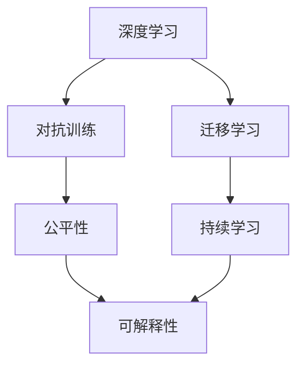
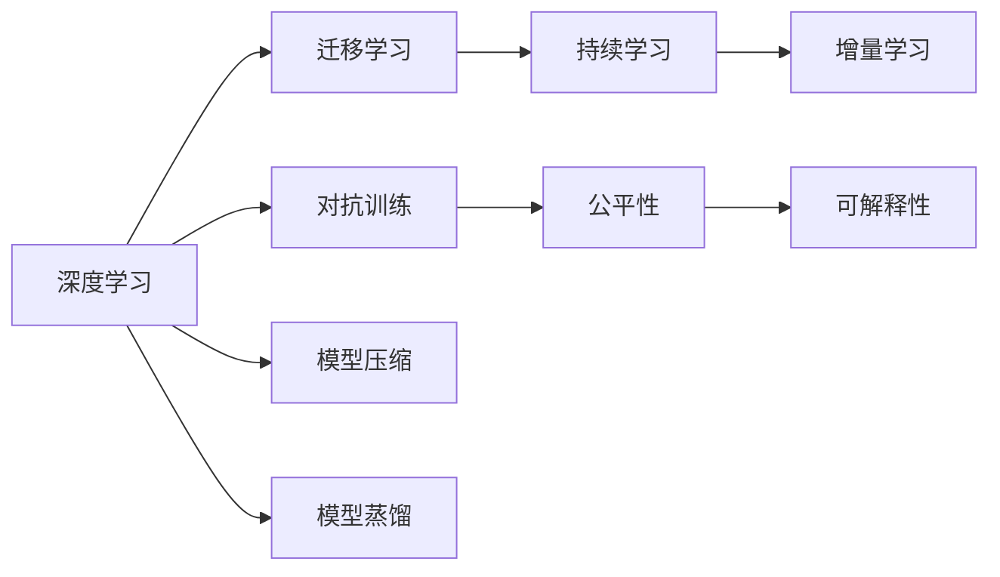
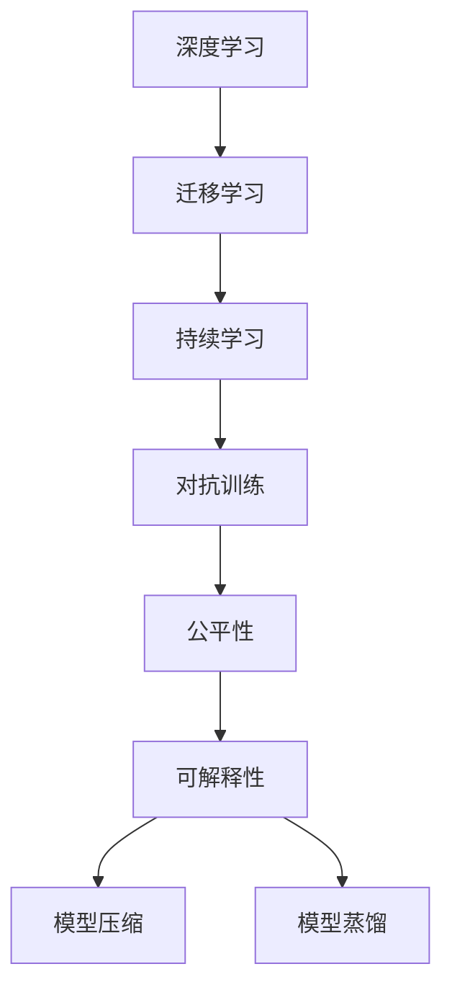

                 

## 1. 背景介绍

### 1.1 问题由来
人工智能（AI）在过去十年间取得了爆炸性的进展。从深度学习到自然语言处理，再到自动驾驶和机器人，AI技术的应用范围和深度前所未有。然而，随着技术的不断成熟，AI的发展方向和策略也面临着新的挑战和思考。在这个背景下，Andrej Karpathy，一位在深度学习、计算机视觉和自动驾驶等领域有着广泛影响力的AI专家，提出了自己对于AI未来发展的独到见解。

### 1.2 问题核心关键点
Andrej Karpathy的讨论围绕以下几个核心问题展开：
- 深度学习模型如何应对更大规模的数据和更复杂的任务？
- 如何通过持续学习和迁移学习，提升模型的泛化能力和适应性？
- 在自动驾驶等高风险应用中，如何保证模型的可靠性和安全性？
- AI技术在医疗、金融等领域的潜在应用及其道德和社会影响。

这些问题的答案，不仅关乎AI技术的未来发展路径，也涉及到技术的广泛应用及其对社会的影响。

## 2. 核心概念与联系

### 2.1 核心概念概述

Andrej Karpathy在讨论AI未来发展时，重点涉及以下几个核心概念：

- **深度学习（Deep Learning）**：一种基于神经网络结构的机器学习技术，通过多层非线性映射，从数据中自动学习特征表示，用于分类、回归、生成等任务。
- **迁移学习（Transfer Learning）**：利用已训练好的模型，在新任务上快速适应的技术，旨在避免从头开始训练模型，从而节省时间和资源。
- **持续学习（Continual Learning）**：模型在不断接受新数据的过程中，保持原有知识的同时，学习新知识，防止遗忘。
- **对抗训练（Adversarial Training）**：通过引入对抗样本，提高模型对抗攻击的鲁棒性，确保模型在不同环境下的稳定性。
- **公平性（Fairness）和可解释性（Explainability）**：AI模型应该保证决策的公正性和透明度，避免对特定群体的歧视和误导。

这些概念通过以下Mermaid流程图展示其相互关系：



这个流程图展示了深度学习、迁移学习、持续学习、对抗训练、公平性和可解释性等概念之间的联系，其中深度学习是基础，通过迁移学习和持续学习提升模型的泛化能力，对抗训练增强模型的鲁棒性，公平性和可解释性则确保了模型的伦理和社会责任。

### 2.2 概念间的关系

Andrej Karpathy指出，这些概念之间存在着密切的联系，形成一个相互支持的技术体系。以下图表展示了这个体系的结构：



这个图展示了深度学习、迁移学习、持续学习、对抗训练、公平性、可解释性、模型压缩和模型蒸馏等概念之间的相互关系。其中，深度学习是起点，迁移学习和持续学习帮助模型提升泛化能力，对抗训练确保模型鲁棒性，公平性和可解释性确保模型伦理，模型压缩和蒸馏则是提升模型效率的常用方法。

### 2.3 核心概念的整体架构

最终，我们将这些概念整合成一个大语言模型微调的整体架构：



这个架构展示了深度学习、迁移学习、持续学习、对抗训练、公平性、可解释性、模型压缩和模型蒸馏等概念之间的相互关系，其中深度学习是起点，迁移学习和持续学习帮助模型提升泛化能力，对抗训练确保模型鲁棒性，公平性和可解释性确保模型伦理，模型压缩和蒸馏则是提升模型效率的常用方法。

## 3. 核心算法原理 & 具体操作步骤
### 3.1 算法原理概述

基于深度学习的AI模型，其核心在于通过多层神经网络结构，从数据中自动学习特征表示。这个过程包括特征提取、模型训练和推理等多个步骤。Andrej Karpathy认为，深度学习的未来发展，需要在以下几个方面进行改进：

1. **模型规模的扩大**：通过增加模型的层数和参数数量，提高模型的表达能力和适应性。
2. **数据量的增加**：利用更大的数据集进行训练，提升模型的泛化能力。
3. **算法的创新**：探索新的算法和架构，提升模型的训练效率和性能。
4. **模型的迁移学习**：在已有模型的基础上，通过迁移学习提升新任务的性能。
5. **模型的持续学习**：通过持续学习，保持模型在新数据上的学习能力和适应性。
6. **模型的对抗训练**：通过对抗训练，提升模型的鲁棒性和安全性。
7. **模型的公平性和可解释性**：通过公平性和可解释性，确保模型的伦理和社会责任。

### 3.2 算法步骤详解

以下是对Andrej Karpathy提出的AI未来发展策略的具体步骤详解：

1. **数据准备**：收集和预处理大规模、高质量的数据集，以便进行深度学习和模型训练。
2. **模型选择**：选择合适的深度学习模型架构，如卷积神经网络（CNN）、递归神经网络（RNN）、Transformer等。
3. **模型训练**：利用深度学习算法，对模型进行训练，调整模型参数，提升模型性能。
4. **迁移学习**：在已有模型的基础上，通过微调或自监督学习，提升新任务的性能。
5. **持续学习**：在新数据到来时，更新模型参数，保持模型性能。
6. **对抗训练**：通过引入对抗样本，提升模型的鲁棒性和安全性。
7. **公平性和可解释性**：确保模型的决策过程公正透明，避免偏见和误导。

### 3.3 算法优缺点

基于深度学习的AI模型，具有以下优点：
- **表达能力**：能够处理复杂的非线性关系，适应多种任务。
- **泛化能力**：通过大规模数据训练，提升模型的泛化能力。
- **自动特征提取**：自动学习特征表示，减少手动设计特征的工作量。

但同时也存在以下缺点：
- **计算资源需求高**：需要大量的计算资源进行训练和推理。
- **模型复杂度高**：复杂的模型结构容易导致过拟合和训练困难。
- **可解释性差**：深度学习模型的决策过程难以解释，缺乏透明度。

### 3.4 算法应用领域

Andrej Karpathy认为，深度学习模型在以下领域具有广泛的应用前景：

- **计算机视觉**：图像识别、物体检测、人脸识别等任务。
- **自然语言处理**：机器翻译、情感分析、文本生成等任务。
- **自动驾驶**：环境感知、决策规划、控制等任务。
- **医疗健康**：疾病诊断、基因组分析、健康监测等任务。
- **金融科技**：风险评估、信用评分、欺诈检测等任务。
- **智能制造**：质量控制、故障诊断、工艺优化等任务。

## 4. 数学模型和公式 & 详细讲解 & 举例说明

### 4.1 数学模型构建

在深度学习中，常用的数学模型包括前馈神经网络（Feedforward Neural Network）和卷积神经网络（Convolutional Neural Network）等。以下以一个简单的前馈神经网络为例，展示其数学模型构建过程。

设输入数据为 $x \in \mathbb{R}^n$，输出数据为 $y \in \mathbb{R}^m$。前馈神经网络包含多个隐藏层，每一层由多个神经元组成。设第 $i$ 层的神经元数量为 $h_i$，激活函数为 $f(\cdot)$，则前馈神经网络的数学模型可以表示为：

$$
y = f^m(f^{m-1}(f^{m-2}(\cdots f(Wh^1 + b) + b) + b) + b)
$$

其中 $W$ 和 $b$ 为权重和偏置，$f(\cdot)$ 为激活函数。

### 4.2 公式推导过程

在深度学习中，常用反向传播算法（Backpropagation）进行模型训练。假设训练数据集为 $D = \{(x_i, y_i)\}_{i=1}^N$，目标为最小化损失函数 $L$。假设当前模型参数为 $\theta$，则反向传播算法通过链式法则计算损失函数对参数的梯度，更新模型参数。

设损失函数为 $L$，目标为最小化 $L(\theta)$，则梯度下降算法可以表示为：

$$
\theta \leftarrow \theta - \eta \nabla_{\theta}L(\theta)
$$

其中 $\eta$ 为学习率，$\nabla_{\theta}L(\theta)$ 为损失函数对参数的梯度。

### 4.3 案例分析与讲解

以下以一个简单的图像分类任务为例，展示深度学习模型的训练过程。

设输入为 $28 \times 28$ 的灰度图像，输出为 10 个类别的标签。使用卷积神经网络（CNN）进行分类。设模型包含卷积层、池化层和全连接层，训练数据集为 MNIST。假设模型参数为 $\theta$，则反向传播算法的具体步骤可以表示为：

1. 前向传播：将输入数据 $x$ 输入模型，得到输出 $y$。
2. 计算损失：计算输出 $y$ 和真实标签 $y^*$ 之间的损失 $L$。
3. 反向传播：通过链式法则计算损失函数对参数的梯度，更新模型参数 $\theta$。

## 5. 项目实践：代码实例和详细解释说明

### 5.1 开发环境搭建

以下是使用Python和TensorFlow进行深度学习模型开发的开发环境配置流程：

1. 安装Anaconda：从官网下载并安装Anaconda，用于创建独立的Python环境。
2. 创建并激活虚拟环境：
```bash
conda create -n tf-env python=3.8 
conda activate tf-env
```

3. 安装TensorFlow：根据CUDA版本，从官网获取对应的安装命令。例如：
```bash
conda install tensorflow
```

4. 安装各类工具包：
```bash
pip install numpy pandas scikit-learn matplotlib tqdm jupyter notebook ipython
```

完成上述步骤后，即可在`tf-env`环境中开始深度学习模型开发。

### 5.2 源代码详细实现

以下是一个简单的卷积神经网络（CNN）在TensorFlow中的实现，用于图像分类任务：

```python
import tensorflow as tf
from tensorflow.keras import layers

# 定义CNN模型
model = tf.keras.Sequential([
    layers.Conv2D(32, 3, activation='relu', input_shape=(28, 28, 1)),
    layers.MaxPooling2D(),
    layers.Flatten(),
    layers.Dense(10, activation='softmax')
])

# 定义损失函数和优化器
loss_fn = tf.keras.losses.SparseCategoricalCrossentropy(from_logits=True)
optimizer = tf.keras.optimizers.Adam()

# 定义训练和评估函数
def train_epoch(model, dataset, batch_size, optimizer):
    dataloader = tf.data.Dataset.from_tensor_slices((dataset.x, dataset.y)).shuffle(10000).batch(batch_size)
    model.train()
    for batch in dataloader:
        x, y = batch
        with tf.GradientTape() as tape:
            logits = model(x, training=True)
            loss = loss_fn(y, logits)
        gradients = tape.gradient(loss, model.trainable_variables)
        optimizer.apply_gradients(zip(gradients, model.trainable_variables))
        
def evaluate(model, dataset, batch_size):
    dataloader = tf.data.Dataset.from_tensor_slices((dataset.x, dataset.y)).batch(batch_size)
    model.eval()
    predictions = []
    targets = []
    for batch in dataloader:
        x, y = batch
        logits = model(x, training=False)
        predictions.append(logits.numpy())
        targets.append(y.numpy())
    return tf.math.confusion_matrix(targets, tf.argmax(predictions, axis=1))
```

这个代码实现展示了如何使用TensorFlow构建一个简单的卷积神经网络（CNN）模型，并进行训练和评估。

### 5.3 代码解读与分析

让我们再详细解读一下关键代码的实现细节：

**Sequential模型**：
- `layers.Conv2D`：定义卷积层，设置神经元数量和卷积核大小。
- `layers.MaxPooling2D`：定义池化层，对卷积层的输出进行下采样。
- `layers.Flatten`：将池化层的输出展平为一维向量。
- `layers.Dense`：定义全连接层，输出类别概率。

**loss_fn和optimizer**：
- `loss_fn`：定义损失函数，使用交叉熵损失。
- `optimizer`：定义优化器，使用Adam优化器。

**train_epoch函数**：
- 将数据集转换为TensorFlow的Dataset对象，并进行随机打乱和分批。
- 在训练过程中，对每个批次进行前向传播和反向传播，计算梯度并更新模型参数。

**evaluate函数**：
- 对模型进行评估，输出模型的预测结果和真实标签之间的混淆矩阵。

## 6. 实际应用场景

### 6.1 智能驾驶

Andrej Karpathy认为，自动驾驶技术是AI技术的典型应用之一，对深度学习模型的鲁棒性和安全性提出了更高的要求。智能驾驶系统需要实时处理复杂的环境信息，做出正确的决策。

在实际应用中，智能驾驶系统通常采用多传感器融合、实时感知和决策规划等技术。深度学习模型被用来处理传感器数据，提取特征并进行决策。通过对传感器数据和历史驾驶数据进行训练，深度学习模型可以学习到环境中的各种复杂模式，并在新环境中进行推理和决策。

### 6.2 医疗诊断

在医疗领域，深度学习模型被广泛应用于疾病诊断、医学影像分析和基因组学等领域。Andrej Karpathy指出，医疗诊断任务往往具有高风险和高精度要求，深度学习模型需要在公平性和可解释性方面进行优化。

例如，深度学习模型可以通过训练大量医学影像数据，学习到疾病的特征表示，并在新影像上进行分类诊断。在实际应用中，深度学习模型需要保证输出结果的公平性和可解释性，避免对特定群体的歧视和误导。

### 6.3 金融风控

金融科技领域，深度学习模型被用来进行风险评估、信用评分和欺诈检测等任务。Andrej Karpathy认为，金融风控任务对模型的泛化能力和鲁棒性提出了高要求，模型需要在数据分布变化的情况下保持稳定性能。

例如，深度学习模型可以通过训练大量金融交易数据，学习到交易行为的特征表示，并在新交易中进行风险评估。在实际应用中，深度学习模型需要确保输出结果的公平性和可解释性，避免对特定群体的歧视和误导。

### 6.4 未来应用展望

Andrej Karpathy认为，深度学习模型将在以下几个领域获得广泛应用：

- **计算机视觉**：在图像识别、物体检测和图像生成等任务中，深度学习模型将发挥重要作用。
- **自然语言处理**：在机器翻译、情感分析和文本生成等任务中，深度学习模型将不断优化和进步。
- **自动驾驶**：在环境感知、决策规划和控制等任务中，深度学习模型将提升自动驾驶的安全性和可靠性。
- **医疗健康**：在疾病诊断、医学影像分析和基因组学等领域，深度学习模型将提高医疗诊断的准确性和效率。
- **金融科技**：在风险评估、信用评分和欺诈检测等任务中，深度学习模型将提升金融风控的精确性和稳定性。
- **智能制造**：在质量控制、故障诊断和工艺优化等任务中，深度学习模型将提升制造业的智能化水平。

## 7. 工具和资源推荐
### 7.1 学习资源推荐

为了帮助开发者系统掌握深度学习模型开发和应用的知识，这里推荐一些优质的学习资源：

1. 《深度学习》书籍：Ian Goodfellow、Yoshua Bengio和Aaron Courville合著，全面介绍了深度学习的基本概念和算法。
2. CS231n《卷积神经网络》课程：斯坦福大学开设的计算机视觉课程，涵盖了卷积神经网络的基本原理和应用。
3. 《自然语言处理》书籍：Daniel Jurafsky和James H. Martin合著，系统介绍了自然语言处理的基本理论和实践。
4. 《自动驾驶》书籍：Andrej Karpathy著，详细介绍了自动驾驶技术的基本原理和应用。
5. 深度学习框架官网：如TensorFlow、PyTorch等框架的官方文档，提供了详细的API和使用示例。
6. arXiv预印本：人工智能领域最新研究成果的发布平台，涵盖大量尚未发表的前沿工作。

通过对这些资源的学习实践，相信你一定能够快速掌握深度学习模型开发和应用的技术，并用于解决实际的AI问题。

### 7.2 开发工具推荐

高效的开发离不开优秀的工具支持。以下是几款用于深度学习模型开发的常用工具：

1. TensorFlow：由Google主导开发的开源深度学习框架，生产部署方便，适合大规模工程应用。
2. PyTorch：基于Python的开源深度学习框架，灵活动态的计算图，适合快速迭代研究。
3. Keras：高层次的深度学习API，易于上手，适合初学者和快速原型开发。
4. Jupyter Notebook：交互式的开发环境，支持多种编程语言，方便调试和展示。
5. Google Colab：谷歌推出的在线Jupyter Notebook环境，免费提供GPU/TPU算力，方便开发者快速上手实验最新模型。

合理利用这些工具，可以显著提升深度学习模型开发的效率，加快创新迭代的步伐。

### 7.3 相关论文推荐

深度学习模型和AI技术的发展源于学界的持续研究。以下是几篇奠基性的相关论文，推荐阅读：

1. AlexNet：Hinton等人，ImageNet大规模视觉识别挑战赛的冠军模型，奠定了卷积神经网络在计算机视觉领域的基础。
2. ResNet：He等人，提出了残差网络（Residual Network），解决了深度神经网络训练中的梯度消失问题。
3. Attention is All You Need（即Transformer原论文）：Vaswani等人，提出了Transformer结构，开启了NLP领域的预训练大模型时代。
4. BERT: Pre-training of Deep Bidirectional Transformers for Language Understanding：Devlin等人，提出BERT模型，引入基于掩码的自监督预训练任务，刷新了多项NLP任务SOTA。
5. Parameter-Efficient Transfer Learning for NLP：Howard等人，提出Adapter等参数高效微调方法，在不增加模型参数量的情况下，也能取得不错的微调效果。

这些论文代表了大深度学习模型和AI技术的发展脉络。通过学习这些前沿成果，可以帮助研究者把握学科前进方向，激发更多的创新灵感。

除上述资源外，还有一些值得关注的前沿资源，帮助开发者紧跟深度学习模型和AI技术的最新进展，例如：

1. arXiv论文预印本：人工智能领域最新研究成果的发布平台，包括大量尚未发表的前沿工作，学习前沿技术的必读资源。
2. 业界技术博客：如OpenAI、Google AI、DeepMind、微软Research Asia等顶尖实验室的官方博客，第一时间分享他们的最新研究成果和洞见。
3. 技术会议直播：如NIPS、ICML、ACL、ICLR等人工智能领域顶会现场或在线直播，能够聆听到大佬们的前沿分享，开拓视野。
4. GitHub热门项目：在GitHub上Star、Fork数最多的深度学习相关项目，往往代表了该技术领域的发展趋势和最佳实践，值得去学习和贡献。
5. 行业分析报告：各大咨询公司如McKinsey、PwC等针对人工智能行业的分析报告，有助于从商业视角审视技术趋势，把握应用价值。

总之，对于深度学习模型开发和应用的学习，需要开发者保持开放的心态和持续学习的意愿。多关注前沿资讯，多动手实践，多思考总结，必将收获满满的成长收益。

## 8. 总结：未来发展趋势与挑战
### 8.1 总结

Andrej Karpathy在讨论AI未来发展时，从深度学习模型的构建和应用、迁移学习、持续学习、对抗训练、公平性和可解释性等多个方面进行了深入探讨。他认为，深度学习模型在未来的发展中，需要应对更大的数据规模和更复杂的任务，同时保证模型的鲁棒性、公平性和可解释性。

通过Andrej Karpathy的讨论，我们对于AI未来的发展方向有了更清晰的认识。深度学习模型将在多个领域发挥重要作用，但同时也面临着计算资源、模型复杂度、可解释性和伦理责任等挑战。解决这些挑战需要学界和产业界的共同努力，推动AI技术的持续进步和广泛应用。

### 8.2 未来发展趋势

Andrej Karpathy认为，深度学习模型和AI技术将在以下几个方面获得显著进展：

1. **模型规模的扩大**：通过增加模型的层数和参数数量，提高模型的表达能力和适应性。
2. **数据量的增加**：利用更大的数据集进行训练，提升模型的泛化能力。
3. **算法的创新**：探索新的算法和架构，提升模型的训练效率和性能。
4. **迁移学习的优化**：通过微调、自监督学习等方法，提升模型在新任务的性能。
5. **持续学习的普及**：在新数据到来时，更新模型参数，保持模型性能。
6. **对抗训练的加强**：通过对抗训练，提升模型的鲁棒性和安全性。
7. **公平性和可解释性的重视**：确保模型的决策过程公正透明，避免偏见和误导。

### 8.3 面临的挑战

尽管深度学习模型和AI技术已经取得了瞩目成就，但在迈向更加智能化、普适化应用的过程中，它们仍面临着诸多挑战：

1. **计算资源瓶颈**：深度学习模型需要大量的计算资源进行训练和推理。如何优化算法和模型结构，减少资源消耗，是一个重要的研究方向。
2. **模型复杂度高**：复杂的模型结构容易导致过拟合和训练困难。如何设计高效的模型架构，降低模型复杂度，是一个重要的研究方向。
3. **可解释性差**：深度学习模型的决策过程难以解释，缺乏透明度。如何提高模型的可解释性，增强用户信任，是一个重要的研究方向。
4. **伦理和安全问题**：深度学习模型可能学习到有偏见、有害的信息，通过迁移学习传递到下游任务，产生误导性、歧视性的输出。如何确保模型的伦理和安全，是一个重要的研究方向。
5. **公平性和隐私保护**：深度学习模型需要保证输出结果的公平性和隐私保护，避免对特定群体的歧视和误导。如何实现公平性和隐私保护，是一个重要的研究方向。

### 8.4 研究展望

为了解决这些挑战，未来的研究需要在以下几个方面寻求新的突破：

1. **模型压缩和稀疏化**：通过模型压缩和稀疏化，减少模型参数量和计算资源消耗，提升模型的实时性和效率。
2. **可解释性增强**：通过引入符号化知识、因果推断等方法，增强深度学习模型的可解释性，提高用户信任和模型透明性。
3. **伦理和安全约束**：在模型训练目标中引入伦理导向的评估指标，过滤和惩罚有偏见、有害的输出倾向，确保模型输出符合人类价值观和伦理道德。
4. **多模态融合**：将视觉、语音、文本等多模态信息进行融合，提升模型的感知能力和应用场景。
5. **跨领域迁移**：将模型在不同领域和任务之间进行迁移学习，提升模型的泛化能力和适应性。
6. **数据质量和多样性**：利用高质量、多样化数据进行训练，提升模型的泛化能力和鲁棒性。

总之，Andrej Karpathy关于AI未来发展的讨论，为我们提供了宝贵的视角和思路。在未来的AI研究中，我们需要积极应对计算资源、模型复杂度、可解释性和伦理责任等挑战，推动AI技术的持续进步和广泛应用。

## 9. 附录：常见问题与解答

**Q1：深度学习模型如何应对更大规模的数据和更复杂的任务？**

A: 深度学习模型可以通过增加模型的层数和参数数量，提高模型的表达能力和适应性。同时，利用更大的数据集进行训练，提升模型的泛化能力。

**Q2：如何通过持续学习和迁移学习，提升模型的泛化能力和适应性？**

A: 通过持续学习，在新数据到来时更新模型参数，保持模型性能。通过迁移学习，在已有模型的基础上，通过微调或自监督学习提升新任务的性能。

**Q3：在自动驾驶等高风险应用中，如何保证模型的可靠性和安全性？**

A: 自动驾驶系统需要多传感器融合、实时感知和决策规划等技术。深度学习模型需要保证输出结果的公平性和可解释性，避免对特定群体的歧视和误导。

**Q4：AI技术在医疗、金融等领域的潜在应用及其道德和社会影响？**

A: AI技术在医疗、金融等领域具有广泛的应用前景。在实际应用中，需要确保模型输出结果的公平性和可解释性，避免偏见和误导。同时，需要考虑伦理和社会责任，确保技术的应用符合人类价值观。

**Q5：AI技术的未来发展趋势和面临的挑战？**

A: AI技术的未来发展方向包括模型规模的扩大、数据量的增加、算

