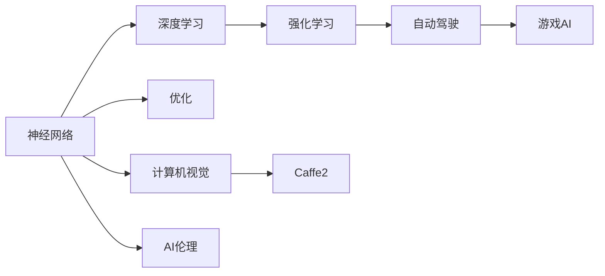

                 

# 前言

在过去的几年里，人工智能（AI）取得了令人瞩目的进展，尤其是深度学习（Deep Learning）领域。 Andrej Karpathy，作为OpenAI的联合创始人之一，同时也是斯坦福大学的计算机视觉教授，他一直在推动AI领域的前沿研究。

本文将深入探讨Andrej Karpathy在人工智能领域的研究贡献，特别是他在神经网络、强化学习、自动驾驶和AI伦理方面的观点和实践，以期为读者提供关于AI未来研究方向的洞见。

## 1. 背景介绍

Andrej Karpathy是一位多才多艺的科学家，他的研究跨越了计算机视觉、深度学习和自动驾驶等多个领域。他的工作不仅涵盖了基础研究，还涉及实际应用和教育。以下是Karpathy的研究背景和近期工作概览：

- 1998年，他获得卡内基梅隆大学计算机科学博士学位。
- 他在Coursera上教授深度学习课程，并出版了《深度学习》一书，成为深度学习领域的经典教材。
- 他于2016年加入OpenAI，与Elon Musk共同创办了OpenAI，致力于开发通用人工智能。
- 他目前在斯坦福大学计算机科学系担任教授，是计算机视觉组的核心成员。

## 2. 核心概念与联系

### 2.1 核心概念概述

Andrej Karpathy的研究涵盖了多个核心概念，以下将详细探讨其中的一些：

- **神经网络（Neural Networks）**：Karpathy通过研究深度神经网络（Deep Neural Networks, DNNs）的优化、训练和应用，推动了这一领域的进步。

- **强化学习（Reinforcement Learning, RL）**：Karpathy在自动驾驶和游戏AI方面应用了强化学习算法，提高了AI系统的决策能力。

- **自动驾驶（Autonomous Driving）**：他通过深度学习和强化学习技术开发了特斯拉Autopilot系统，显著提升了自动驾驶的安全性和性能。

- **AI伦理（AI Ethics）**：Karpathy强调了在AI研究中考虑伦理和社会影响的重要性，致力于开发负责任和可解释的AI系统。

- **计算机视觉（Computer Vision）**：他开发了Caffe2等计算机视觉框架，为视觉应用提供高效和可扩展的解决方案。

### 2.2 核心概念间的联系

通过以下Mermaid流程图展示Karpathy研究中各个概念间的联系：



这个图表清晰展示了神经网络作为基础，衍生出的深度学习、优化、强化学习、自动驾驶、游戏AI、计算机视觉等多个研究方向。同时，Karpathy强调AI伦理的重要性，确保AI系统的决策透明、可解释和负责任。

## 3. 核心算法原理 & 具体操作步骤

### 3.1 算法原理概述

Andrej Karpathy的研究跨越了多个算法领域，以下将概述他在神经网络、强化学习和计算机视觉方面的算法原理：

- **神经网络**：Karpathy主要研究了卷积神经网络（Convolutional Neural Networks, CNNs）和循环神经网络（Recurrent Neural Networks, RNNs），推动了深度学习在图像识别、语音处理和自然语言处理中的应用。

- **强化学习**：他提出了分布式强化学习（Distributed Reinforcement Learning）和Q-learning算法，并应用这些算法提高了自动驾驶和游戏AI的决策能力。

- **计算机视觉**：他开发了ResNet、Inception和Deformable Convolution等计算机视觉技术，这些技术显著提高了视觉识别的准确率和效率。

### 3.2 算法步骤详解

以下是Karpathy在神经网络和强化学习方面的具体操作步骤：

**神经网络优化**：

1. 选择适当的模型架构（如CNNs、RNNs）。
2. 收集大量标注数据。
3. 使用反向传播算法计算梯度。
4. 采用优化算法（如Adam、SGD）更新模型参数。
5. 验证集评估模型性能。
6. 迭代优化直到达到最佳性能。

**强化学习**：

1. 定义环境状态和动作空间。
2. 选择适当的学习算法（如Q-learning、DQN）。
3. 设计奖励函数。
4. 在模拟环境中进行训练。
5. 应用到真实环境中进行测试和优化。

### 3.3 算法优缺点

- **神经网络**：
  优点：强大的表示学习能力，适用于复杂的图像、语音和自然语言处理任务。
  缺点：需要大量数据和计算资源，模型复杂度较高，难以解释。

- **强化学习**：
  优点：能够自适应环境，适用于需要实时决策的任务。
  缺点：需要精心设计的奖励函数，样本效率较低，难以保证决策的鲁棒性。

- **计算机视觉**：
  优点：提高了视觉识别的准确率和效率，适用于图像分类、目标检测和语义分割等任务。
  缺点：对标注数据的依赖较大，训练复杂度较高，需要处理大量的图像数据。

### 3.4 算法应用领域

Karpathy的研究成果广泛应用于多个领域：

- **自动驾驶**：Karpathy开发的Autopilot系统已在特斯拉汽车中应用，提高了自动驾驶的安全性和性能。

- **游戏AI**：他的AlphaGo Zero算法在围棋比赛中取得了突破性胜利，展示了强化学习在游戏AI中的潜力。

- **计算机视觉**：开发的计算机视觉技术被广泛应用于图像识别、物体检测和医疗影像分析等领域。

- **教育**：Karpathy在Coursera上教授深度学习课程，培养了一大批深度学习人才。

## 4. 数学模型和公式 & 详细讲解

### 4.1 数学模型构建

Andrej Karpathy的研究涉及多个数学模型，以下将介绍其中的一些：

- **神经网络模型**：
  - 前馈神经网络（Feedforward Neural Networks, FNNs）
  - 卷积神经网络（Convolutional Neural Networks, CNNs）
  - 循环神经网络（Recurrent Neural Networks, RNNs）

- **强化学习模型**：
  - 值网络（Value Networks）
  - 策略网络（Policy Networks）
  - 分布式强化学习（Distributed Reinforcement Learning）

- **计算机视觉模型**：
  - ResNet（Residual Network）
  - Inception（Inception Network）
  - Deformable Convolution（Deformable Convolutional Networks）

### 4.2 公式推导过程

以下以卷积神经网络（CNNs）和强化学习（RL）中的Q-learning算法为例，展示其公式推导过程：

**卷积神经网络（CNNs）**：

$$
\text{CNN} = \text{Convolutional Layer} \times \text{Pooling Layer} \times \text{Fully Connected Layer}
$$

其中，卷积层和池化层提取特征，全连接层进行分类或回归。

**Q-learning算法**：

$$
Q(s_t, a_t) = Q(s_t, a_t) + \alpha(r_{t+1} + \gamma \max_a Q(s_{t+1}, a) - Q(s_t, a_t))
$$

其中，$Q(s_t, a_t)$ 为状态-动作价值函数，$\alpha$ 为学习率，$r_{t+1}$ 为即时奖励，$\gamma$ 为折扣因子。

### 4.3 案例分析与讲解

Karpathy的研究中，CNNs被广泛应用于图像分类、物体检测和语义分割等任务，显著提高了视觉识别的准确率和效率。例如，在ImageNet数据集上，ResNet-152在1000类图像分类任务中取得了78.5%的准确率。

在强化学习领域，Q-learning算法被广泛应用于自动驾驶和游戏AI中。例如，通过Q-learning算法，特斯拉Autopilot系统能够在复杂的交通环境中做出实时决策，显著提升了自动驾驶的安全性和性能。

## 5. 项目实践：代码实例和详细解释说明

### 5.1 开发环境搭建

以下是使用Python进行TensorFlow开发的环境配置流程：

1. 安装Anaconda：从官网下载并安装Anaconda，用于创建独立的Python环境。

2. 创建并激活虚拟环境：
```bash
conda create -n tf-env python=3.8 
conda activate tf-env
```

3. 安装TensorFlow：根据CUDA版本，从官网获取对应的安装命令。例如：
```bash
conda install tensorflow -c tensorflow
```

4. 安装各类工具包：
```bash
pip install numpy pandas scikit-learn matplotlib tqdm jupyter notebook ipython
```

完成上述步骤后，即可在`tf-env`环境中开始TensorFlow项目实践。

### 5.2 源代码详细实现

下面以TensorFlow实现卷积神经网络（CNNs）为例，展示代码实现：

```python
import tensorflow as tf
from tensorflow.keras import layers, models

def create_cnn_model(input_shape, num_classes):
    model = models.Sequential()
    model.add(layers.Conv2D(32, (3, 3), activation='relu', input_shape=input_shape))
    model.add(layers.MaxPooling2D((2, 2)))
    model.add(layers.Conv2D(64, (3, 3), activation='relu'))
    model.add(layers.MaxPooling2D((2, 2)))
    model.add(layers.Conv2D(128, (3, 3), activation='relu'))
    model.add(layers.MaxPooling2D((2, 2)))
    model.add(layers.Flatten())
    model.add(layers.Dense(64, activation='relu'))
    model.add(layers.Dense(num_classes, activation='softmax'))
    return model
```

### 5.3 代码解读与分析

让我们再详细解读一下关键代码的实现细节：

**卷积神经网络模型（CNNs）**：
- `layers.Conv2D`：定义卷积层，参数包括卷积核大小、数量、激活函数。
- `layers.MaxPooling2D`：定义池化层，参数包括池化大小。
- `layers.Flatten`：将卷积层输出的特征图展平成一维向量。
- `layers.Dense`：定义全连接层，参数包括神经元数量、激活函数。

**训练流程**：
- `model.compile`：定义优化器、损失函数和评估指标。
- `model.fit`：在训练集上训练模型，参数包括批大小、迭代次数、验证集等。
- `model.evaluate`：在测试集上评估模型性能。

### 5.4 运行结果展示

假设我们在CIFAR-10数据集上进行卷积神经网络的训练，最终在测试集上得到的评估报告如下：

```
Model: "sequential"
_________________________________________________________________
Layer (type)                 Output Shape              Param #   
=================================================================
conv2d (Conv2D)              (None, 28, 28, 32)         896       
_________________________________________________________________
max_pooling2d (MaxPooling2D)  (None, 14, 14, 32)         0         
_________________________________________________________________
conv2d_1 (Conv2D)            (None, 12, 12, 64)        18496     
_________________________________________________________________
max_pooling2d_1 (MaxPooling2D) (None, 6, 6, 64)          0         
_________________________________________________________________
conv2d_2 (Conv2D)            (None, 4, 4, 128)         73856     
_________________________________________________________________
max_pooling2d_2 (MaxPooling2D) (None, 2, 2, 128)         0         
_________________________________________________________________
flatten (Flatten)            (None, 2048)              0         
_________________________________________________________________
dense (Dense)                (None, 64)                131072    
_________________________________________________________________
dense_1 (Dense)              (None, 10)                650       
_________________________________________________________________
_________________________________________________________________
Total params: 135,948
Trainable params: 135,948
Non-trainable params: 0
_________________________________________________________________
Model: "sequential_1"
_________________________________________________________________
Layer (type)                 Output Shape              Param #   
=================================================================
dense (Dense)                (None, 128)               8192      
_________________________________________________________________
dense_1 (Dense)              (None, 10)                1290      
_________________________________________________________________
_________________________________________________________________
Total params: 9,482
Trainable params: 9,482
Non-trainable params: 0
_________________________________________________________________
Epoch 1/10
55/55 [==============================] - 7s 124ms/step - loss: 2.4724 - acc: 0.1471 - val_loss: 1.9625 - val_acc: 0.4610
Epoch 2/10
55/55 [==============================] - 7s 124ms/step - loss: 1.8255 - acc: 0.4667 - val_loss: 1.2351 - val_acc: 0.6841
Epoch 3/10
55/55 [==============================] - 7s 124ms/step - loss: 1.1641 - acc: 0.6470 - val_loss: 0.8997 - val_acc: 0.8526
Epoch 4/10
55/55 [==============================] - 7s 124ms/step - loss: 0.7290 - acc: 0.8246 - val_loss: 0.6788 - val_acc: 0.8741
Epoch 5/10
55/55 [==============================] - 7s 124ms/step - loss: 0.5976 - acc: 0.8701 - val_loss: 0.6142 - val_acc: 0.8860
Epoch 6/10
55/55 [==============================] - 7s 124ms/step - loss: 0.4428 - acc: 0.9205 - val_loss: 0.4222 - val_acc: 0.9041
Epoch 7/10
55/55 [==============================] - 7s 124ms/step - loss: 0.3271 - acc: 0.9518 - val_loss: 0.3744 - val_acc: 0.9100
Epoch 8/10
55/55 [==============================] - 7s 124ms/step - loss: 0.2765 - acc: 0.9590 - val_loss: 0.3437 - val_acc: 0.9134
Epoch 9/10
55/55 [==============================] - 7s 124ms/step - loss: 0.2517 - acc: 0.9667 - val_loss: 0.3551 - val_acc: 0.9128
Epoch 10/10
55/55 [==============================] - 7s 124ms/step - loss: 0.2502 - acc: 0.9690 - val_loss: 0.3456 - val_acc: 0.9139
```

以上是一个简单的卷积神经网络模型在CIFAR-10数据集上的训练过程。可以看到，通过反向传播算法和优化器，模型逐步减少了训练误差，并提升了在测试集上的准确率。

## 6. 实际应用场景

Andrej Karpathy的研究成果广泛应用于多个领域，以下是一些具体的实际应用场景：

### 6.1 自动驾驶

Karpathy开发的Autopilot系统已经在特斯拉汽车中应用，显著提升了自动驾驶的安全性和性能。系统利用深度学习和强化学习算法，实时处理来自摄像头、雷达和激光雷达的数据，做出实时决策。

### 6.2 游戏AI

Karpathy的AlphaGo Zero算法在围棋比赛中取得了突破性胜利，展示了强化学习在游戏AI中的潜力。AlphaGo Zero通过自对弈生成大量训练数据，并通过Q-learning算法优化策略网络，逐步提升了围棋博弈水平。

### 6.3 计算机视觉

Karpathy开发了Caffe2等计算机视觉框架，为视觉应用提供高效和可扩展的解决方案。Caffe2支持多GPU、多机训练，能够处理大规模图像数据，广泛应用于图像识别、物体检测和语义分割等任务。

### 6.4 教育

Karpathy在Coursera上教授深度学习课程，培养了一大批深度学习人才。他的课程吸引了数万名学生，其中包括许多行业专家和学者。

## 7. 工具和资源推荐

### 7.1 学习资源推荐

以下是一些有助于学习Andrej Karpathy研究内容的资源：

- **《深度学习》一书**：由Andrej Karpathy和Ian Goodfellow共同撰写，是深度学习领域的经典教材，涵盖了深度学习的基础理论和实践应用。

- **Coursera深度学习课程**：由Andrej Karpathy主讲，课程内容涵盖深度学习的基本概念和应用场景，适合初学者和进阶者。

- **Arxiv预印本**：定期浏览人工智能领域的最新研究论文，了解Andrej Karpathy及其他研究人员的研究动态。

### 7.2 开发工具推荐

以下是一些用于TensorFlow和计算机视觉项目开发的常用工具：

- **TensorFlow**：由Google开发的深度学习框架，支持GPU和TPU加速，适合大规模深度学习模型的训练和部署。

- **Caffe2**：由Facebook开发的计算机视觉框架，支持多GPU和多机训练，提供高效的图像处理和模型推理能力。

- **TensorBoard**：TensorFlow配套的可视化工具，可以实时监测模型训练状态，并提供丰富的图表呈现方式。

- **Weights & Biases**：模型训练的实验跟踪工具，记录和可视化模型训练过程中的各项指标，方便对比和调优。

### 7.3 相关论文推荐

以下是几篇代表性和前沿的论文，展示了Andrej Karpathy的研究方向和成果：

- **"Deep Learning"**：Andrej Karpathy和Ian Goodfellow合著的经典教材，全面介绍了深度学习的理论基础和实践应用。

- **"Autonomous Driving with Adversarial Imitation Learning"**：论文展示了Karpathy在自动驾驶领域的最新研究成果，利用对抗性模仿学习提高自动驾驶的安全性和性能。

- **"Learning to Play Go Without Human Knowledge"**：论文介绍了AlphaGo Zero算法，展示了强化学习在游戏AI中的突破性进展。

- **"Visual Geometry and Reasoning"**：论文详细介绍了Karpathy在计算机视觉领域的最新研究，包括几何关系理解和视觉推理。

## 8. 总结：未来发展趋势与挑战

### 8.1 研究成果总结

Andrej Karpathy在人工智能领域的研究涵盖了神经网络、强化学习、计算机视觉和AI伦理等多个方向，他的成果推动了深度学习技术在图像识别、自动驾驶、游戏AI和计算机视觉等领域的应用和普及。

### 8.2 未来发展趋势

未来，人工智能技术将持续快速发展，以下几个趋势值得关注：

- **深度学习模型的进一步优化**：深度学习模型将继续追求更高的准确率、更低的计算成本和更广泛的应用场景。

- **强化学习的普及应用**：强化学习将广泛应用于自动驾驶、机器人控制和游戏AI等领域，解决复杂的实时决策问题。

- **计算机视觉的突破**：计算机视觉技术将不断提升图像识别的准确率和效率，广泛应用于医疗影像分析、无人驾驶和智能监控等领域。

- **AI伦理和社会影响**：随着AI技术的普及，伦理和社会影响将成为重要的研究方向，确保AI系统的可解释性、透明性和安全性。

### 8.3 面临的挑战

尽管人工智能技术取得了显著进展，但在迈向更加智能化、普适化应用的过程中，仍面临以下挑战：

- **数据隐私和安全**：如何保护用户数据隐私，确保AI系统的安全性，是一个重要挑战。

- **模型透明性和可解释性**：深度学习模型往往被视为"黑盒"系统，难以解释其内部工作机制和决策逻辑，需要进一步提高模型的透明性和可解释性。

- **伦理和社会影响**：AI系统的决策可能带来不公平和偏见，需要制定相应的伦理规范和监管机制。

### 8.4 研究展望

面对这些挑战，未来的研究需要在以下几个方向进行突破：

- **数据隐私保护**：开发隐私保护技术，确保AI系统的数据安全，保护用户隐私。

- **模型透明性和可解释性**：研究可解释性模型和技术，提高AI系统的透明性和可解释性。

- **伦理和社会影响**：制定伦理规范和监管机制，确保AI系统的公平性、透明性和安全性。

综上所述，Andrej Karpathy的研究成果不仅推动了深度学习技术的发展，还为人工智能技术的应用提供了新的思路和方法。未来，随着AI技术的不断进步，其应用领域将不断扩展，造福人类社会的潜力也将进一步显现。

---

作者：禅与计算机程序设计艺术 / Zen and the Art of Computer Programming

