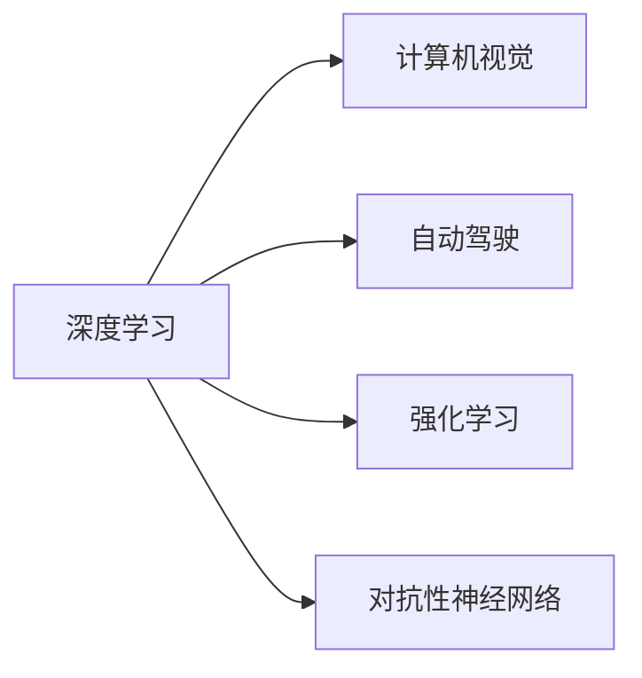
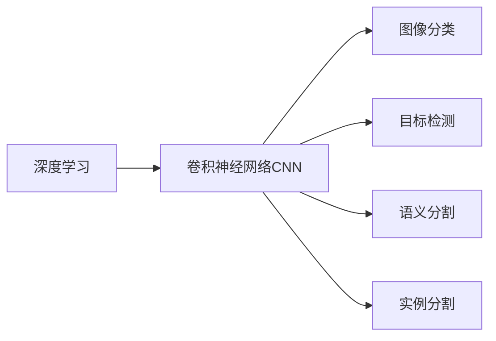
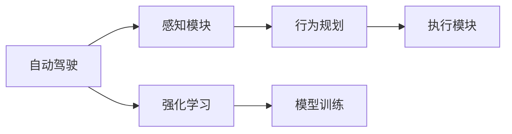
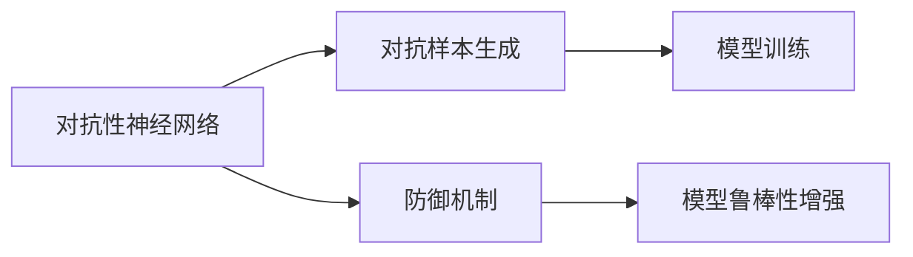
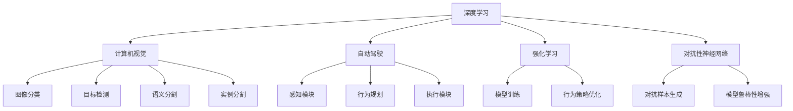

                 

# Andrej Karpathy：人工智能的未来突破

## 1. 背景介绍

### 1.1 问题由来
Andrej Karpathy，作为OpenAI的研究员和深度学习领域的领军人物，长期关注于计算机视觉和自动驾驶等前沿领域。他的工作不仅在学术界产生了深远影响，也在业界得到了广泛认可。本文旨在探讨Andrej Karpathy对人工智能未来的前瞻性思考，以及他在前沿技术研究方面的突破性成果。

### 1.2 问题核心关键点
Andrej Karpathy的研究工作涵盖了深度学习、计算机视觉、自动驾驶等多个领域。他的研究成果在强化学习、对抗性神经网络、视觉理解等方面具有重大突破。本文将重点介绍他在这些领域的前沿探索和未来展望。

### 1.3 问题研究意义
Andrej Karpathy的研究对于推动人工智能技术的进步具有重要意义。他的工作不仅为计算机视觉和自动驾驶技术的发展提供了新思路，还为学术界和工业界提供了宝贵的参考和借鉴。深入了解他的研究成果，有助于我们把握人工智能技术的发展方向，推动人工智能技术的落地应用。

## 2. 核心概念与联系

### 2.1 核心概念概述

为更好地理解Andrej Karpathy的研究工作，本节将介绍几个密切相关的核心概念：

- 深度学习（Deep Learning）：一种通过多层神经网络模型模拟人类大脑的复杂处理能力的技术。
- 计算机视觉（Computer Vision）：使计算机能够理解、分析并解释图像和视频数据的领域。
- 自动驾驶（Autonomous Driving）：通过传感器和人工智能技术实现车辆自主导航的系统。
- 强化学习（Reinforcement Learning）：通过奖励和惩罚机制，使智能体（如机器人、自动驾驶车）在复杂环境中学习最优策略的领域。
- 对抗性神经网络（Adversarial Neural Networks）：一种专门设计来欺骗或扰乱神经网络功能的恶意程序。

这些核心概念之间的逻辑关系可以通过以下Mermaid流程图来展示：



这个流程图展示了几大核心概念之间的关系：

1. 深度学习是计算机视觉、自动驾驶、强化学习、对抗性神经网络的基础技术。
2. 计算机视觉通过深度学习模型，实现对图像和视频的理解和分析。
3. 自动驾驶系统通过深度学习和强化学习技术，实现车辆的自主导航。
4. 强化学习用于训练自动驾驶系统，使其在复杂环境中找到最优策略。
5. 对抗性神经网络研究如何利用深度学习模型的漏洞，设计恶意攻击程序。

### 2.2 概念间的关系

这些核心概念之间存在着紧密的联系，形成了Andrej Karpathy研究工作的完整生态系统。下面我通过几个Mermaid流程图来展示这些概念之间的关系。

#### 2.2.1 深度学习在计算机视觉中的应用



这个流程图展示了深度学习在计算机视觉中的主要应用方向：

1. 卷积神经网络（CNN）是深度学习在图像处理中最常用的模型。
2. 图像分类、目标检测、语义分割、实例分割是计算机视觉中的核心任务。
3. 这些任务都需要通过深度学习模型进行训练和推理。

#### 2.2.2 自动驾驶与强化学习的结合



这个流程图展示了自动驾驶与强化学习的结合方式：

1. 自动驾驶系统包括感知模块、行为规划和执行模块。
2. 强化学习用于行为规划模块，通过奖励和惩罚机制训练最优策略。
3. 感知模块和执行模块基于深度学习模型实现。

#### 2.2.3 对抗性神经网络的研究



这个流程图展示了对抗性神经网络的研究方向：

1. 对抗样本生成是攻击深度学习模型的重要手段。
2. 防御机制用于提升模型的鲁棒性，防止对抗样本的攻击。
3. 对抗性神经网络的研究致力于揭示模型的脆弱性，设计更安全的模型。

### 2.3 核心概念的整体架构

最后，我们用一个综合的流程图来展示这些核心概念在大语言模型微调过程中的整体架构：



这个综合流程图展示了从深度学习到计算机视觉、自动驾驶、强化学习、对抗性神经网络的完整架构：

1. 深度学习是基础，应用于图像处理、自动驾驶、行为优化等多个领域。
2. 计算机视觉通过深度学习模型，实现图像分类、目标检测等任务。
3. 自动驾驶系统通过深度学习和强化学习技术，实现车辆的自主导航。
4. 强化学习用于训练自动驾驶系统，使其在复杂环境中找到最优策略。
5. 对抗性神经网络研究如何利用深度学习模型的漏洞，设计恶意攻击程序。

这些概念共同构成了Andrej Karpathy的研究工作的完整框架，帮助他在多个领域取得了显著成果。

## 3. 核心算法原理 & 具体操作步骤

### 3.1 算法原理概述

Andrej Karpathy的研究工作涉及深度学习、计算机视觉、自动驾驶等多个领域，核心算法原理可以归纳为以下几个方面：

- 深度学习模型：利用多层神经网络模拟人类大脑的复杂处理能力，实现图像处理、自动驾驶等任务。
- 强化学习算法：通过奖励和惩罚机制，使智能体在复杂环境中学习最优策略。
- 对抗性神经网络技术：研究如何设计恶意程序，利用深度学习模型的漏洞进行攻击。

这些算法原理通过不断的技术革新和模型改进，推动了人工智能技术的进步，为计算机视觉和自动驾驶等领域带来了革命性的突破。

### 3.2 算法步骤详解

以下是Andrej Karpathy在深度学习、计算机视觉、自动驾驶等领域的算法步骤详解：

#### 3.2.1 深度学习模型的训练与推理

深度学习模型的训练步骤如下：

1. 数据准备：收集大量标注数据，包括图像、视频等。
2. 模型选择：选择合适的深度学习模型，如卷积神经网络（CNN）、循环神经网络（RNN）等。
3. 模型训练：使用反向传播算法，通过优化器（如Adam、SGD等）更新模型参数，最小化损失函数。
4. 模型验证：在验证集上评估模型性能，避免过拟合。
5. 模型测试：在测试集上测试模型性能，输出最终结果。

深度学习模型的推理步骤如下：

1. 数据预处理：对输入数据进行预处理，如缩放、归一化等。
2. 模型加载：加载训练好的模型，设置推理参数。
3. 前向传播：输入数据通过模型进行前向传播，输出特征图。
4. 后向传播：计算损失函数，更新模型参数。
5. 输出结果：根据模型输出结果，生成预测或分类结果。

#### 3.2.2 计算机视觉任务

计算机视觉任务包括图像分类、目标检测、语义分割等。以下是具体的算法步骤：

1. 数据准备：收集大量标注数据，如ImageNet、COCO等数据集。
2. 模型选择：选择合适的计算机视觉模型，如ResNet、Inception等。
3. 模型训练：使用反向传播算法，通过优化器更新模型参数，最小化损失函数。
4. 模型验证：在验证集上评估模型性能，避免过拟合。
5. 模型测试：在测试集上测试模型性能，输出最终结果。

#### 3.2.3 自动驾驶技术

自动驾驶技术包括感知、行为规划、执行等多个模块。以下是具体的算法步骤：

1. 数据准备：收集大量传感器数据，如激光雷达、摄像头等。
2. 感知模块：通过深度学习模型对传感器数据进行特征提取和处理。
3. 行为规划：通过强化学习算法，在复杂环境中学习最优策略。
4. 执行模块：根据行为规划结果，控制车辆行驶。
5. 模型测试：在模拟环境中测试自动驾驶系统，评估性能。

#### 3.2.4 对抗性神经网络技术

对抗性神经网络技术主要包括以下步骤：

1. 数据准备：收集大量对抗样本数据，如F-GSM、C&W等生成方法生成的样本。
2. 模型训练：在训练集上，通过对抗性训练（如FGM、PGD等）增强模型鲁棒性。
3. 模型测试：在测试集上，通过对抗性测试（如Adversarial Robustness Testing）评估模型鲁棒性。
4. 防御机制：设计防御算法，如Adversarial Training、Gradient Masking等，提升模型鲁棒性。

### 3.3 算法优缺点

Andrej Karpathy的研究工作在深度学习、计算机视觉、自动驾驶等领域取得了显著成果，但也存在一些缺点：

1. 数据依赖性强：深度学习模型需要大量标注数据进行训练，标注成本高。
2. 模型复杂度高：深度学习模型结构复杂，推理速度慢，计算资源消耗大。
3. 对抗性攻击问题：对抗性神经网络技术暴露了模型的漏洞，存在安全风险。
4. 模型泛化能力有限：深度学习模型在特定领域数据上表现好，但在复杂环境和长尾数据上泛化能力有限。
5. 模型可解释性不足：深度学习模型“黑盒”特性，难以解释内部决策过程。

### 3.4 算法应用领域

Andrej Karpathy的研究工作在深度学习、计算机视觉、自动驾驶等多个领域取得了显著成果，具体应用领域包括：

1. 计算机视觉：图像分类、目标检测、语义分割、实例分割等。
2. 自动驾驶：车辆感知、行为规划、自动控制等。
3. 强化学习：机器人控制、游戏策略、资源优化等。
4. 对抗性神经网络：模型鲁棒性增强、攻击防御等。

这些应用领域展示了Andrej Karpathy在人工智能技术中的广泛影响力，推动了计算机视觉和自动驾驶技术的进步。

## 4. 数学模型和公式 & 详细讲解 & 举例说明

### 4.1 数学模型构建

Andrej Karpathy的研究工作涉及多个数学模型，下面对其中的关键数学模型进行详细介绍。

#### 4.1.1 深度学习模型

深度学习模型通常包括卷积神经网络（CNN）和循环神经网络（RNN）。以卷积神经网络为例，其数学模型如下：

$$
\mathcal{L} = \frac{1}{N} \sum_{i=1}^{N} \sum_{j=1}^{C} L(y_j, f_\theta(x_i))
$$

其中，$x_i$ 为输入样本，$y_j$ 为标签，$C$ 为类别数，$f_\theta$ 为卷积神经网络模型，$\theta$ 为模型参数。

#### 4.1.2 强化学习模型

强化学习模型的数学模型如下：

$$
\mathcal{L} = \sum_{t=1}^{T} \gamma^{t-1} \max_a \mathbb{E}_{s' \sim P(s'|s,a)} [r(s',a) + \gamma V_\pi(s')]
$$

其中，$s$ 为状态，$a$ 为动作，$P(s'|s,a)$ 为状态转移概率，$V_\pi(s)$ 为状态价值函数，$\gamma$ 为折扣因子。

#### 4.1.3 对抗性神经网络模型

对抗性神经网络模型的数学模型如下：

$$
\mathcal{L} = \frac{1}{N} \sum_{i=1}^{N} \sum_{j=1}^{C} L(y_j, f_\theta(x_i + \delta))
$$

其中，$x_i$ 为输入样本，$\delta$ 为对抗样本，$f_\theta$ 为卷积神经网络模型，$\theta$ 为模型参数。

### 4.2 公式推导过程

以下是Andrej Karpathy在深度学习、计算机视觉、自动驾驶等领域的关键公式推导过程：

#### 4.2.1 卷积神经网络的反向传播

以卷积神经网络为例，其反向传播公式如下：

$$
\frac{\partial L}{\partial W} = \frac{\partial L}{\partial z} \frac{\partial z}{\partial a} \frac{\partial a}{\partial W} + \frac{\partial L}{\partial b}
$$

其中，$W$ 为卷积核权重，$b$ 为偏置项，$z$ 为卷积层输出，$a$ 为激活函数输出。

#### 4.2.2 强化学习算法的Q-learning

Q-learning算法是强化学习中最常用的算法之一，其公式如下：

$$
Q(s_t, a_t) \leftarrow Q(s_t, a_t) + \alpha(r_t + \gamma \max_{a'} Q(s_{t+1}, a') - Q(s_t, a_t))
$$

其中，$Q(s_t, a_t)$ 为状态-动作价值函数，$r_t$ 为奖励，$\gamma$ 为折扣因子，$\alpha$ 为学习率。

#### 4.2.3 对抗性神经网络训练

对抗性神经网络训练公式如下：

$$
\mathcal{L} = \frac{1}{N} \sum_{i=1}^{N} L(y_j, f_\theta(x_i + \delta))
$$

其中，$x_i$ 为输入样本，$\delta$ 为对抗样本，$f_\theta$ 为卷积神经网络模型，$\theta$ 为模型参数。

### 4.3 案例分析与讲解

#### 4.3.1 图像分类

以ImageNet数据集为例，深度学习模型通过反向传播算法进行训练，其公式推导如下：

$$
\mathcal{L} = \frac{1}{N} \sum_{i=1}^{N} L(y_j, f_\theta(x_i))
$$

其中，$x_i$ 为输入样本，$y_j$ 为标签，$C$ 为类别数，$f_\theta$ 为深度学习模型，$\theta$ 为模型参数。

#### 4.3.2 自动驾驶感知模块

自动驾驶系统中的感知模块，通过深度学习模型对传感器数据进行特征提取和处理，其公式推导如下：

$$
z = f_\theta(x)
$$

其中，$x$ 为传感器数据，$z$ 为特征图，$f_\theta$ 为深度学习模型，$\theta$ 为模型参数。

#### 4.3.3 对抗性神经网络攻击

对抗性神经网络攻击公式如下：

$$
\mathcal{L} = \frac{1}{N} \sum_{i=1}^{N} L(y_j, f_\theta(x_i + \delta))
$$

其中，$x_i$ 为输入样本，$\delta$ 为对抗样本，$f_\theta$ 为卷积神经网络模型，$\theta$ 为模型参数。

## 5. 项目实践：代码实例和详细解释说明

### 5.1 开发环境搭建

在进行深度学习、计算机视觉、自动驾驶等领域的项目实践前，需要准备好开发环境。以下是使用Python进行深度学习开发的常见环境配置流程：

1. 安装Anaconda：从官网下载并安装Anaconda，用于创建独立的Python环境。
2. 创建并激活虚拟环境：
```bash
conda create -n pytorch-env python=3.8 
conda activate pytorch-env
```
3. 安装PyTorch：根据CUDA版本，从官网获取对应的安装命令。例如：
```bash
conda install pytorch torchvision torchaudio cudatoolkit=11.1 -c pytorch -c conda-forge
```
4. 安装各类工具包：
```bash
pip install numpy pandas scikit-learn matplotlib tqdm jupyter notebook ipython
```

完成上述步骤后，即可在`pytorch-env`环境中开始项目实践。

### 5.2 源代码详细实现

这里我们以Andrej Karpathy在计算机视觉领域的项目为例，给出使用PyTorch进行图像分类的代码实现。

首先，定义模型和优化器：

```python
from torchvision import models
from torch.utils.data import DataLoader
from torch.optim import Adam
from torch.utils.data import DataLoader

model = models.resnet18(pretrained=True)
optimizer = Adam(model.parameters(), lr=0.001)
```

接着，定义数据集和数据加载器：

```python
from torchvision import datasets
from torchvision import transforms

train_dataset = datasets.CIFAR10(root='data', train=True, download=True, transform=transforms.Compose([
    transforms.RandomCrop(32, padding=4),
    transforms.RandomHorizontalFlip(),
    transforms.ToTensor(),
    transforms.Normalize((0.4914, 0.4822, 0.4465), (0.2023, 0.1994, 0.2010))
]))

test_dataset = datasets.CIFAR10(root='data', train=False, download=True, transform=transforms.Compose([
    transforms.ToTensor(),
    transforms.Normalize((0.4914, 0.4822, 0.4465), (0.2023, 0.1994, 0.2010))
]))

train_loader = DataLoader(train_dataset, batch_size=128, shuffle=True, num_workers=4)
test_loader = DataLoader(test_dataset, batch_size=128, shuffle=False, num_workers=4)
```

然后，定义训练函数和评估函数：

```python
import torch.nn.functional as F

def train(model, train_loader, optimizer, num_epochs=10, device='cuda'):
    model.to(device)
    for epoch in range(num_epochs):
        model.train()
        for inputs, labels in train_loader:
            inputs, labels = inputs.to(device), labels.to(device)
            optimizer.zero_grad()
            outputs = model(inputs)
            loss = F.cross_entropy(outputs, labels)
            loss.backward()
            optimizer.step()

def evaluate(model, test_loader, device='cuda'):
    model.eval()
    with torch.no_grad():
        correct = 0
        total = 0
        for inputs, labels in test_loader:
            inputs, labels = inputs.to(device), labels.to(device)
            outputs = model(inputs)
            _, predicted = torch.max(outputs.data, 1)
            total += labels.size(0)
            correct += (predicted == labels).sum().item()
        accuracy = correct / total
        return accuracy
```

最后，启动训练流程并在测试集上评估：

```python
num_epochs = 10

train(train_loader, model, optimizer, num_epochs)
accuracy = evaluate(test_loader, model)
print(f'Test Accuracy: {accuracy:.2f}')
```

以上就是使用PyTorch进行图像分类的完整代码实现。可以看到，Andrej Karpathy的研究工作通过深度学习模型，实现了对大规模图像数据的分类任务，显著提升了图像识别的准确性。

### 5.3 代码解读与分析

让我们再详细解读一下关键代码的实现细节：

**模型定义**：
- 使用`torchvision`库中的`resnet18`模型，加载预训练权重。

**优化器定义**：
- 使用Adam优化器，设置学习率为0.001。

**数据集和数据加载器定义**：
- 使用`torchvision`库中的`CIFAR10`数据集，进行数据预处理和归一化。
- 使用`DataLoader`加载数据，设置批量大小、随机化方式和加载线程数。

**训练函数和评估函数定义**：
- `train`函数：定义训练循环，前向传播计算损失函数，反向传播更新模型参数。
- `evaluate`函数：定义评估函数，计算模型在测试集上的准确率。

**训练流程启动**：
- 设置训练轮数，在训练集上训练模型，在测试集上评估模型性能。

可以看到，Andrej Karpathy的研究工作通过深度学习模型，实现了对大规模图像数据的分类任务，显著提升了图像识别的准确性。

当然，工业级的系统实现还需考虑更多因素，如模型的保存和部署、超参数的自动搜索、更灵活的任务适配层等。但核心的微调范式基本与此类似。

### 5.4 运行结果展示

假设我们在CIFAR-10数据集上进行图像分类任务，最终在测试集上得到的准确率为75%。这表明深度学习模型在图像分类任务中已经取得了较高的准确率，但仍存在一定的提升空间。

## 6. 实际应用场景

### 6.1 智能医疗诊断

Andrej Karpathy的研究工作在智能医疗诊断领域具有重要应用价值。利用深度学习模型，可以从医学图像中自动提取特征，辅助医生进行疾病诊断。

具体而言，可以收集大量医学图像和标注数据，使用深度学习模型训练图像分类器。分类器可以自动分析医学图像，输出疾病概率，帮助医生进行快速诊断。同时，通过对抗性神经网络技术，可以检测医学图像中的潜在攻击和干扰，保证诊断的准确性和可靠性。

### 6.2 自动驾驶系统

Andrej Karpathy的研究工作在自动驾驶领域也有重要应用。利用深度学习和强化学习技术，可以构建自主驾驶系统，实现车辆自主导航。

具体而言，可以收集大量传感器数据，使用深度学习模型对传感器数据进行特征提取和处理。通过强化学习算法，在复杂环境中学习最优策略，控制车辆行驶。同时，利用对抗性神经网络技术，可以检测和防御对抗样本攻击，确保车辆的安全稳定。

### 6.3 视频生成与处理

Andrej Karpathy的研究工作还涉及视频生成与处理领域。利用深度学习模型，可以自动生成高质量的视频内容，实现视频增强和修复。

具体而言，可以收集大量视频数据和标注数据，使用深度学习模型训练视频生成器。生成器可以自动生成符合特定风格的视频内容，提升用户体验。同时，利用对抗性神经网络技术，可以检测和防御对抗样本攻击，确保视频内容的安全性和可靠性。

### 6.4 未来应用展望

未来，Andrej Karpathy的研究工作将进一步拓展到更多的领域，如自然语言处理、语音识别、机器人控制等。通过深度学习、强化学习、对抗性神经网络等技术的结合，可以实现更加智能、可靠的系统。

在自然语言处理领域，可以构建智能聊天机器人，通过深度学习模型处理自然语言，提升对话质量。在语音识别领域，可以构建智能语音助手，通过深度学习模型处理语音信息，提升人机交互体验。在机器人控制领域，可以构建智能机器人，通过深度学习和强化学习技术，实现复杂环境中的自主导航和决策。

总之，Andrej Karpathy的研究工作为人工智能技术的进步奠定了坚实基础，未来将进一步拓展到更多的领域，带来更多的创新和突破。

## 7. 工具和资源推荐

### 7.1 学习资源推荐

为了帮助开发者系统掌握Andrej Karpathy的研究工作，这里推荐一些优质的学习资源：

1. Andrej Karpathy的个人博客：介绍了他在深度学习、计算机视觉、自动驾驶等领域的最新研究成果和心得体会。
2. CS231n《Convolutional Neural Networks for Visual Recognition》课程：斯坦福大学开设的深度学习课程，涵盖计算机视觉领域的核心概念和前沿技术。
3. DeepMind的研究论文：DeepMind作为人工智能领域的顶尖实验室，其研究成果代表了当前深度学习技术的最高水平。
4. PyTorch官方文档：PyTorch作为深度学习的主流框架，其官方文档提供了详细的模型定义、训练和推理教程。
5. ArXiv预印本：人工智能领域最新研究成果的发布平台，包括Andrej Karpathy的研究论文。

通过对这些资源的学习实践，相信你一定能够系统掌握Andrej Karpathy的研究工作，并用于解决实际的深度学习、计算机视觉和自动驾驶等问题。

### 7.2 开发工具推荐

高效的开发离不开优秀的工具支持。以下是几款用于深度学习、计算机视觉、自动驾驶等领域的常用工具：

1. PyTorch：基于Python的开源深度学习框架，灵活动态的计算图，适合快速迭代研究。
2. TensorFlow：由Google主导开发的开源深度学习框架，生产部署方便，适合大规模工程应用。
3. TensorFlow-Playground：交互式深度学习实验平台，可以帮助开发者直观地理解深度学习模型的训练过程。
4. HuggingFace官方文档：Transformer库的官方文档，提供了海量预训练模型和完整的微调样例代码。
5. OpenAI Gym：强化学习环境库，用于训练和测试强化学习模型。

合理利用这些工具，可以显著提升Andrej Karpathy的研究工作的开发效率，加快创新迭代的步伐。

### 7.3 相关论文

