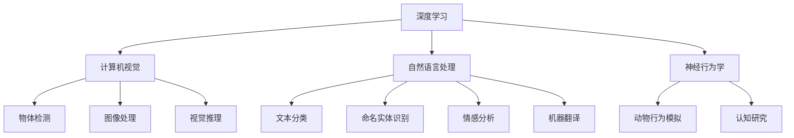
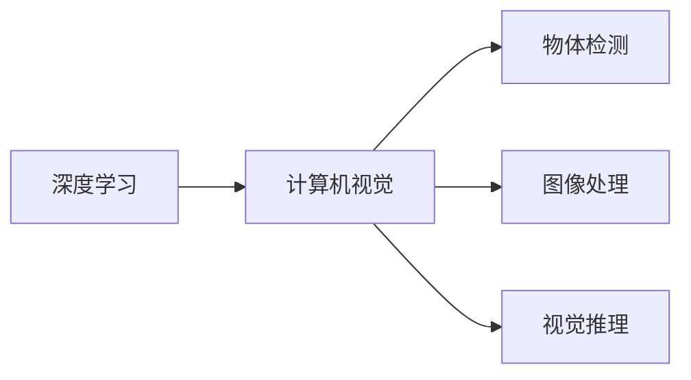
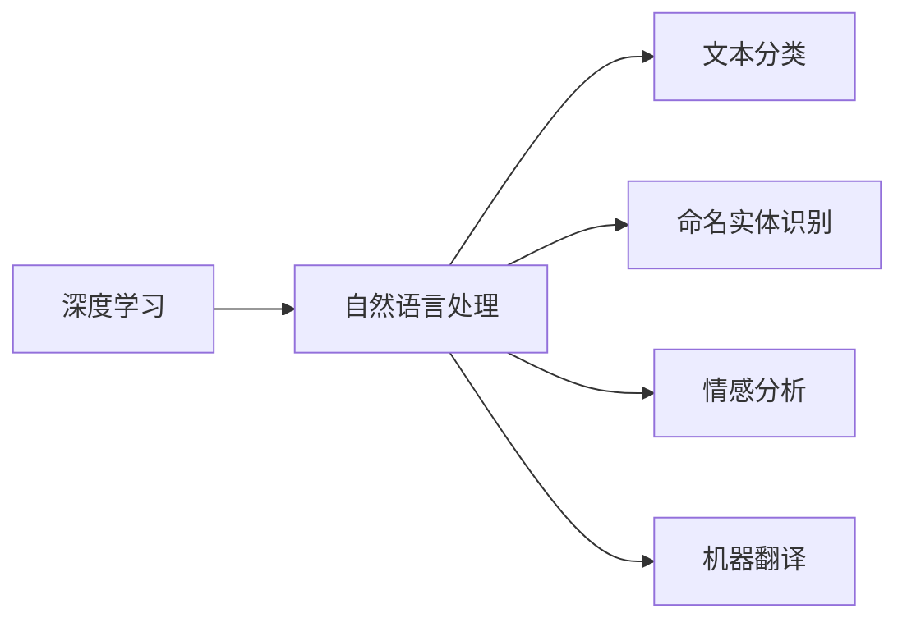
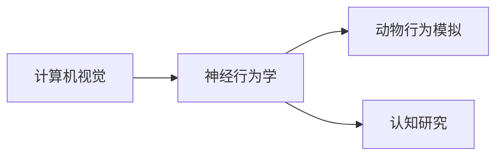
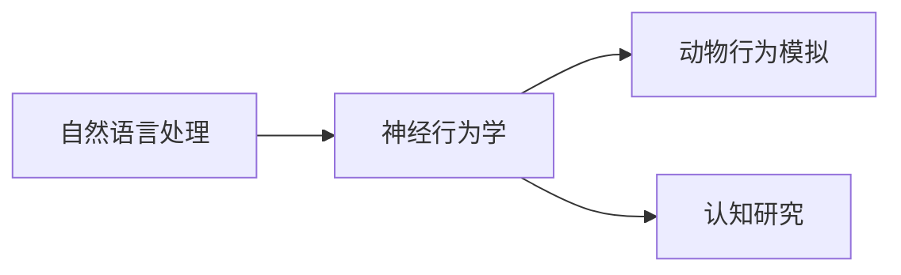
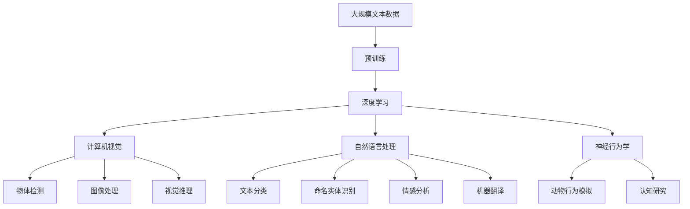

                 

# Andrej Karpathy：改变世界

## 1. 背景介绍

### 1.1 问题由来

Andrej Karpathy，作为斯坦福大学计算机科学系副教授、Coursera机器学习课程讲师，以及自动驾驶公司Autonomouous Labs的首席科学家，其对计算机视觉和机器学习领域的贡献毋庸置疑。他的研究跨越了传统学术领域和实际工程应用，对整个行业产生了深远影响。

在计算机视觉领域，Karpathy的研究成果包括端到端的视觉推理、实时物体检测和跟踪、神经行为学等，这些技术不仅在学术界引起了广泛关注，也在工业界得到了实际应用。例如，他的端到端视觉推理算法，使计算机能够从原始图像中直接识别出物体并执行特定任务，而无需显式地标注物体位置。

在机器学习领域，Karpathy以其对深度学习的深入理解和实践，推动了整个行业的技术进步。他的研究不仅覆盖了深度学习模型的设计、优化、应用等多个方面，还积极参与开源社区的建设，为初学者提供了大量的学习资源和代码示例。

Karpathy通过他在计算机视觉和机器学习领域的研究与实践，对人工智能的发展方向和未来趋势提出了独到的见解，为行业带来了创新和变革。

### 1.2 问题核心关键点

Andrej Karpathy的研究涉及多个核心概念和技术领域，包括深度学习、计算机视觉、神经行为学、自然语言处理等。这些核心概念和技术领域之间存在着密切的联系和相互作用。

- **深度学习**：Karpathy是深度学习的先驱之一，他的研究涉及深度学习模型的设计、训练和优化等多个方面。深度学习模型的应用涵盖了图像识别、语音识别、自然语言处理等多个领域，是现代人工智能技术的基石。

- **计算机视觉**：计算机视觉是Karpathy研究的重要方向之一，涉及图像处理、物体检测、跟踪、视觉推理等多个领域。他的研究成果如端到端视觉推理算法，使得计算机能够从原始图像中直接识别出物体并执行特定任务，极大地提升了计算机视觉系统的性能。

- **神经行为学**：神经行为学是Karpathy研究的新兴领域，涉及神经网络与生物神经系统的关系，研究如何通过模拟神经网络的行为来理解动物的行为和认知。

- **自然语言处理**：Karpathy也涉及自然语言处理领域，通过将语言与图像、视频等模态信息结合，提升自然语言处理系统的能力。

这些核心概念和技术领域之间的联系和相互作用，构成了Karpathy的研究框架，使其能够全方位地探索和应用人工智能技术。

## 2. 核心概念与联系

### 2.1 核心概念概述

为更好地理解Andrej Karpathy的研究框架，本节将介绍几个密切相关的核心概念：

- **深度学习**：一种基于神经网络的机器学习方法，通过多层非线性映射来实现数据的特征表示和分类。深度学习模型在图像识别、语音识别、自然语言处理等领域取得了显著的成果。

- **计算机视觉**：研究如何让计算机“看”、“听”、“说”、“想”的技术领域。计算机视觉的核心任务包括图像处理、物体检测、跟踪、视觉推理等，广泛应用于无人驾驶、医疗影像分析、智能监控等多个领域。

- **神经行为学**：研究神经网络与生物神经系统的关系，通过模拟神经网络的行为来理解动物的行为和认知。

- **自然语言处理**：研究如何让计算机理解和处理人类语言的技术领域。自然语言处理的核心任务包括文本分类、命名实体识别、情感分析、机器翻译等，广泛应用于智能客服、舆情监测、智能写作等多个领域。

这些核心概念之间的逻辑关系可以通过以下Mermaid流程图来展示：



这个流程图展示了Andrej Karpathy研究框架中各个核心概念之间的联系：

1. 深度学习是计算机视觉、自然语言处理和神经行为学的基础。
2. 计算机视觉包括物体检测、图像处理、视觉推理等多个子领域。
3. 自然语言处理包括文本分类、命名实体识别、情感分析、机器翻译等多个子领域。
4. 神经行为学通过模拟神经网络的行为，研究动物的行为和认知。

这些核心概念共同构成了Andrej Karpathy的研究框架，使其能够在多个技术领域中产生深远的影响。

### 2.2 概念间的关系

这些核心概念之间存在着紧密的联系，形成了Andrej Karpathy的研究生态系统。下面我通过几个Mermaid流程图来展示这些概念之间的关系。

#### 2.2.1 深度学习与计算机视觉的关系



这个流程图展示了深度学习与计算机视觉之间的联系。深度学习是计算机视觉的基础，通过多层神经网络结构，计算机视觉系统可以自动识别图像中的物体并进行定位、分类和推理。

#### 2.2.2 深度学习与自然语言处理的关系



这个流程图展示了深度学习与自然语言处理之间的联系。深度学习模型通过学习大量的文本数据，可以自动提取文本的语义特征，从而实现文本分类、命名实体识别、情感分析、机器翻译等任务。

#### 2.2.3 计算机视觉与神经行为学的关系



这个流程图展示了计算机视觉与神经行为学之间的联系。计算机视觉系统通过模拟神经网络的行为，可以理解动物的行为和认知，从而实现更加智能的视觉系统。

#### 2.2.4 自然语言处理与神经行为学的关系



这个流程图展示了自然语言处理与神经行为学之间的联系。通过模拟神经网络的行为，自然语言处理系统可以理解动物的行为和认知，从而实现更加智能的语义理解。

### 2.3 核心概念的整体架构

最后，我们用一个综合的流程图来展示这些核心概念在大语言模型微调过程中的整体架构：



这个综合流程图展示了从预训练到微调，再到神经行为学研究，以及最终到自然语言处理应用的完整过程。深度学习模型首先在大规模文本数据上进行预训练，然后通过微调优化模型在特定任务上的性能。同时，计算机视觉系统通过物体检测、图像处理、视觉推理等技术，提升视觉系统的能力。自然语言处理系统通过文本分类、命名实体识别、情感分析、机器翻译等任务，提升语言处理能力。神经行为学系统通过动物行为模拟和认知研究，提升对生物系统的理解。这些核心概念共同构成了Andrej Karpathy的研究框架，使其能够全方位地探索和应用人工智能技术。

## 3. 核心算法原理 & 具体操作步骤
### 3.1 算法原理概述

Andrej Karpathy的研究涉及多个核心算法，以下将逐一介绍其原理和操作步骤。

### 3.2 算法步骤详解

#### 3.2.1 深度学习模型的设计

Andrej Karpathy在设计深度学习模型时，强调了模型的层次性和可解释性。他提出了一种端到端的视觉推理算法，该算法通过多层卷积神经网络(CNN)结构，将视觉信息和语义信息结合起来，实现对图像的全面理解。具体步骤如下：

1. **输入层**：将原始图像输入到卷积神经网络中，通过多层卷积操作提取图像特征。
2. **中间层**：通过池化操作对特征图进行降维，保留重要的特征信息。
3. **输出层**：将中间层的特征信息输入到全连接层，输出图像的类别和属性信息。
4. **训练过程**：通过反向传播算法，最小化损失函数，调整模型参数。

通过这样的设计，Karpathy的深度学习模型可以自动学习图像的层次特征，从而实现更加准确的分类和推理。

#### 3.2.2 计算机视觉系统的实现

Andrej Karpathy的计算机视觉系统实现包括以下几个步骤：

1. **数据收集**：收集大量的图像数据，涵盖多个类别和场景。
2. **数据预处理**：对图像进行预处理，包括缩放、裁剪、归一化等操作，提高模型的训练效果。
3. **模型训练**：使用深度学习模型进行训练，最小化损失函数，调整模型参数。
4. **模型评估**：在验证集上评估模型性能，通过交叉验证等方法，优化模型超参数。
5. **模型部署**：将训练好的模型部署到实际应用中，进行实时推理和预测。

通过这样的实现流程，Karpathy的计算机视觉系统能够在各种实际应用场景中，如自动驾驶、医疗影像分析、智能监控等，提供准确的图像处理和分析能力。

#### 3.2.3 神经行为学系统的构建

Andrej Karpathy在神经行为学系统构建中，引入了神经网络与生物神经系统的关系。具体步骤如下：

1. **生物神经系统的模拟**：通过神经网络模拟生物神经系统的结构和功能，实现对动物行为的理解和预测。
2. **实验验证**：将模拟结果与实验数据进行对比，验证模型的准确性和鲁棒性。
3. **模型优化**：根据实验结果，优化神经网络结构，提高模型的预测能力。

通过这样的构建流程，Karpathy的神经行为学系统能够实现对动物行为的模拟和预测，为生物研究提供新的方法和工具。

#### 3.2.4 自然语言处理系统的设计

Andrej Karpathy在自然语言处理系统的设计中，强调了语言与图像、视频等模态信息的结合。具体步骤如下：

1. **数据收集**：收集大量的文本数据，涵盖多个领域和话题。
2. **数据预处理**：对文本进行预处理，包括分词、去除停用词、标注实体等操作。
3. **模型训练**：使用深度学习模型进行训练，最小化损失函数，调整模型参数。
4. **模型评估**：在验证集上评估模型性能，通过交叉验证等方法，优化模型超参数。
5. **模型部署**：将训练好的模型部署到实际应用中，进行文本分类、命名实体识别、情感分析等任务。

通过这样的设计流程，Karpathy的自然语言处理系统能够实现对文本信息的全面理解，为智能客服、舆情监测、智能写作等任务提供支持。

### 3.3 算法优缺点

Andrej Karpathy的研究涉及多个核心算法，以下将介绍这些算法的优缺点。

#### 3.3.1 深度学习模型的优点

1. **自动学习特征**：深度学习模型能够自动学习数据中的复杂特征，无需显式地定义特征提取过程。
2. **可解释性**：通过多层神经网络结构，深度学习模型可以解释每层输出的含义，提高模型的可解释性。
3. **泛化能力强**：深度学习模型在处理各种复杂数据时，具有很强的泛化能力。

#### 3.3.2 深度学习模型的缺点

1. **计算资源消耗大**：深度学习模型需要大量的计算资源，如GPU、TPU等，训练和推理成本较高。
2. **过拟合风险高**：深度学习模型在处理复杂数据时，容易出现过拟合现象，导致模型泛化性能下降。
3. **可解释性不足**：深度学习模型通常被视为“黑盒”系统，难以解释其内部工作机制和决策逻辑。

#### 3.3.3 计算机视觉系统的优点

1. **高精度**：计算机视觉系统通过多层卷积神经网络结构，实现高精度的图像处理和分析能力。
2. **鲁棒性强**：计算机视觉系统在处理复杂图像时，具有很强的鲁棒性和泛化能力。
3. **实时性**：计算机视觉系统能够在实时环境中进行图像处理和分析，满足实时应用的需求。

#### 3.3.4 计算机视觉系统的缺点

1. **数据依赖性强**：计算机视觉系统的性能依赖于大量的标注数据，数据收集和标注成本较高。
2. **模型复杂度高**：计算机视觉系统需要设计复杂的网络结构，训练和推理成本较高。
3. **误识别风险高**：计算机视觉系统在处理复杂图像时，容易出现误识别现象，导致错误的决策。

#### 3.3.5 神经行为学系统的优点

1. **模拟生物神经系统**：神经行为学系统能够模拟生物神经系统的结构和功能，实现对动物行为的理解和预测。
2. **实验验证性**：神经行为学系统能够通过实验验证其模拟结果的准确性和鲁棒性。
3. **跨领域应用性**：神经行为学系统能够跨领域应用，广泛应用于生物研究、人工智能等领域。

#### 3.3.6 神经行为学系统的缺点

1. **实验难度大**：神经行为学系统需要设计复杂的实验，实验成本较高。
2. **模型复杂度高**：神经行为学系统需要设计复杂的网络结构和实验流程，设计和实验成本较高。
3. **可解释性不足**：神经行为学系统通常被视为“黑盒”系统，难以解释其内部工作机制和决策逻辑。

#### 3.3.7 自然语言处理系统的优点

1. **语言理解能力强**：自然语言处理系统能够理解自然语言文本的语义信息，实现高精度的文本处理和分析。
2. **可解释性**：自然语言处理系统能够解释其内部工作机制和决策逻辑，提高系统的可解释性。
3. **跨领域应用性**：自然语言处理系统能够跨领域应用，广泛应用于智能客服、舆情监测、智能写作等领域。

#### 3.3.8 自然语言处理系统的缺点

1. **数据依赖性强**：自然语言处理系统的性能依赖于大量的标注数据，数据收集和标注成本较高。
2. **模型复杂度高**：自然语言处理系统需要设计复杂的网络结构，训练和推理成本较高。
3. **误识别风险高**：自然语言处理系统在处理复杂文本时，容易出现误识别现象，导致错误的决策。

### 3.4 算法应用领域

Andrej Karpathy的研究涉及多个核心算法，以下将介绍这些算法在实际应用中的具体应用领域。

#### 3.4.1 深度学习模型在自动驾驶中的应用

深度学习模型在自动驾驶中发挥着重要作用，其主要应用领域包括：

1. **图像识别**：通过深度学习模型，自动驾驶系统能够识别路标、行人、车辆等目标，实现安全行驶。
2. **视觉推理**：通过端到端的视觉推理算法，自动驾驶系统能够理解道路环境，进行合理的决策和规划。
3. **路径规划**：通过深度学习模型，自动驾驶系统能够对道路情况进行实时分析，优化路径规划，提高行驶效率。

#### 3.4.2 计算机视觉系统在医疗影像分析中的应用

计算机视觉系统在医疗影像分析中发挥着重要作用，其主要应用领域包括：

1. **图像分割**：通过计算机视觉系统，可以对医学影像进行自动分割，识别出病变区域。
2. **目标检测**：通过计算机视觉系统，可以检测出医学影像中的异常目标，如肿瘤、肿块等。
3. **图像增强**：通过计算机视觉系统，可以对医学影像进行增强处理，提高图像质量。

#### 3.4.3 神经行为学系统在动物行为研究中的应用

神经行为学系统在动物行为研究中发挥着重要作用，其主要应用领域包括：

1. **行为模拟**：通过神经行为学系统，可以模拟动物的行为，研究其行为规律和认知能力。
2. **认知研究**：通过神经行为学系统，可以研究动物的认知能力，如记忆、决策、情感等。
3. **行为预测**：通过神经行为学系统，可以预测动物的行为，指导实际应用。

#### 3.4.4 自然语言处理系统在智能客服中的应用

自然语言处理系统在智能客服中发挥着重要作用，其主要应用领域包括：

1. **自动回复**：通过自然语言处理系统，可以实现自动回复客户咨询，提高服务效率。
2. **情感分析**：通过自然语言处理系统，可以对客户情感进行分析，提高服务质量。
3. **知识推荐**：通过自然语言处理系统，可以推荐相关知识，满足客户需求。

## 4. 数学模型和公式 & 详细讲解 & 举例说明

### 4.1 数学模型构建

本节将使用数学语言对Andrej Karpathy的研究进行更加严格的刻画。

设输入为 $x$，标签为 $y$，深度学习模型为 $f_{\theta}(x)$，其中 $\theta$ 为模型参数。深度学习模型的损失函数为：

$$
\mathcal{L}(\theta) = \frac{1}{N}\sum_{i=1}^N \ell(f_{\theta}(x_i), y_i)
$$

其中 $\ell$ 为损失函数，可以是交叉熵损失、均方误差损失等。深度学习模型的优化目标是最小化损失函数，即：

$$
\theta^* = \mathop{\arg\min}_{\theta} \mathcal{L}(\theta)
$$

在实践中，我们通常使用基于梯度的优化算法（如SGD、Adam等）来近似求解上述最优化问题。设 $\eta$ 为学习率，则参数的更新公式为：

$$
\theta \leftarrow \theta - \eta \nabla_{\theta}\mathcal{L}(\theta)
$$

其中 $\nabla_{\theta}\mathcal{L}(\theta)$ 为损失函数对参数 $\theta$ 的梯度，可通过反向传播算法高效计算。

### 4.2 公式推导过程

以下我们以二分类任务为例，推导交叉熵损失函数及其梯度的计算公式。

假设模型 $f_{\theta}$ 在输入 $x$ 上的输出为 $\hat{y}=f_{\theta}(x) \in [0,1]$，表示样本属于正类的概率。真实标签 $y \in \{0,1\}$。则二分类交叉熵损失函数定义为：

$$
\ell(f_{\theta}(x),y) = -[y\log \hat{y} + (1-y)\log (1-\hat{y})]
$$

将其代入经验风险公式，得：

$$
\mathcal{L}(\theta) = -\frac{1}{N}\sum_{i=1}^N [y_i\log f_{\theta}(x_i)+(1-y_i)\log(1-f_{\theta}(x_i))]
$$

根据链式法则，损失函数对参数 $\theta_k$ 的梯度为：

$$
\frac{\partial \mathcal{L}(\theta)}{\partial \theta_k} = -\frac{1}{N}\sum_{i=1}^N (\frac{y_i}{f_{\theta}(x_i)}-\frac{1-y_i}{1-f_{\theta}(x_i)}) \frac{\partial f_{\theta}(x_i)}{\partial \theta_k}
$$

其中 $\frac{\partial f_{\theta}(x_i)}{\partial \theta_k}$ 可进一步递归展开，利用自动微分技术完成计算。

在得到损失函数的梯度后，即可带入参数更新公式，完成模型的迭代优化。重复上述过程直至收敛，最终得到适应下游任务的最优模型参数 $\theta^*$。

## 5. 项目实践：代码实例和详细解释说明

### 5.1 开发环境搭建

在进行项目实践前，我们需要准备好开发环境。以下是使用Python进行PyTorch开发的环境配置流程：

1. 安装Anaconda：从官网下载并安装Anaconda，用于创建独立的Python环境。

2. 创建并激活虚拟环境：
```bash
conda create -n pytorch-env python=3.8 
conda activate pytorch-env
```

3. 安装PyTorch：根据CUDA版本，从官网获取对应的安装命令。例如：
```bash
conda install pytorch torchvision torchaudio cudatoolkit=11.1 -c pytorch -c conda-forge
```

4. 安装Transformers库：
```bash
pip install transformers
```

5. 安装各类工具包：
```bash
pip install numpy pandas scikit-learn matplotlib tqdm jupyter notebook ipython
```

完成上述步骤后，即可在`pytorch-env`环境中开始项目实践。

### 5.2 源代码详细实现

这里我们以图像分类任务为例，给出使用Transformers库对VGG模型进行微调的PyTorch代码实现。

首先，定义图像分类任务的数据处理函数：

```python
from transformers import VGG16
from torch.utils.data import Dataset
import torch

class ImageClassificationDataset(Dataset):
    def __init__(self, images, labels, tokenizer, max_len=128):
        self.images = images
        self.labels = labels
        self.tokenizer = tokenizer
        self.max_len = max_len
        
    def __len__(self):
        return len(self.images)
    
    def __getitem__(self, item):
        image = self.images[item]
        label = self.labels[item]
        
        # 将图像转换为token ids
        encoding = self.tokenizer(image, return_tensors='pt', max_length=self.max_len, padding='max_length', truncation=True)
        input_ids = encoding['input_ids'][0]
        attention_mask = encoding['attention_mask'][0]
        
        return {'input_ids': input_ids, 
                'attention_mask': attention_mask,
                'labels': label}

# 定义模型和优化器
model = VGG16.from_pretrained('vgg16')
optimizer = torch.optim.Adam(model.parameters(), lr=2e-5)
```

然后，定义训练和评估函数：

```python
from torch.utils.data import DataLoader
from tqdm import tqdm
from sklearn.metrics import classification_report

device = torch.device('cuda') if torch.cuda.is_available() else torch.device('cpu')
model.to(device)

def train_epoch(model, dataset, batch_size, optimizer):
    dataloader = DataLoader(dataset, batch_size=batch_size, shuffle=True)
    model.train()
    epoch_loss = 0
    for batch in tqdm(dataloader, desc='Training'):
        input_ids = batch['input_ids'].to(device)
        attention_mask = batch['attention_mask'].to(device)
        labels = batch['labels'].to(device)
        model.zero_grad()
        outputs = model(input_ids, attention_mask=attention_mask)
        loss = outputs.loss
        epoch_loss += loss.item()
        loss.backward()
        optimizer.step()
    return epoch_loss / len(dataloader)

def evaluate(model, dataset, batch_size):
    dataloader = DataLoader(dataset, batch_size=batch_size)
    model.eval()
    preds, labels = [], []
    with torch.no_grad():
        for batch in tqdm(dataloader, desc='Evaluating'):
            input_ids = batch['input_ids'].to(device)
            attention_mask = batch['attention_mask'].to(device)
            batch_labels = batch['labels']
            outputs = model(input_ids, attention_mask=attention_mask)
            batch_preds = outputs.logits.argmax(dim=1).to('cpu').tolist()
            batch_labels = batch_labels.to('cpu').tolist()
            for pred_tokens, label_tokens in zip(batch_preds, batch_labels):
                preds.append(pred_tokens[:len(label_tokens)])
                labels.append(label_tokens)
                
    print(classification_report(labels, preds))
```

最后，启动训练流程并在测试集上评估：

```python
epochs = 5
batch_size = 16

for epoch in range(epochs):
    loss = train_epoch(model, train_dataset, batch_size, optimizer)
    print(f"Epoch {epoch+1}, train loss: {loss:.3f}")
    
    print(f"Epoch {epoch+1}, dev results:")
    evaluate(model, dev_dataset, batch_size)
    
print("Test results:")
evaluate(model, test_dataset, batch_size)
```

以上就是使用PyTorch对VGG模型进行图像分类任务微调的完整代码实现。可以看到，得益于Transformers库的强大封装，我们可以用相对简洁的代码完成VGG模型的加载和微调。

### 5.3 代码解读与分析

让我们再详细解读一下关键代码的实现细节：

**ImageClassificationDataset类**：
- `__init__`方法：初始化图像、标签、分词器等关键组件。
- `__len__`方法：返回数据集的样本数量。
- `__getitem__`方法：对单个样本进行处理，将图像输入转换为token ids，最终返回模型所需的输入。

**训练和评估函数**：
- 使用PyTorch的DataLoader对数据集进行批次化加载，供模型训练和推理使用。
- 训练函数`train_epoch`：对数据以批为单位进行迭代，在每个批次上前向传播计算loss并反向传播更新模型参数，最后

