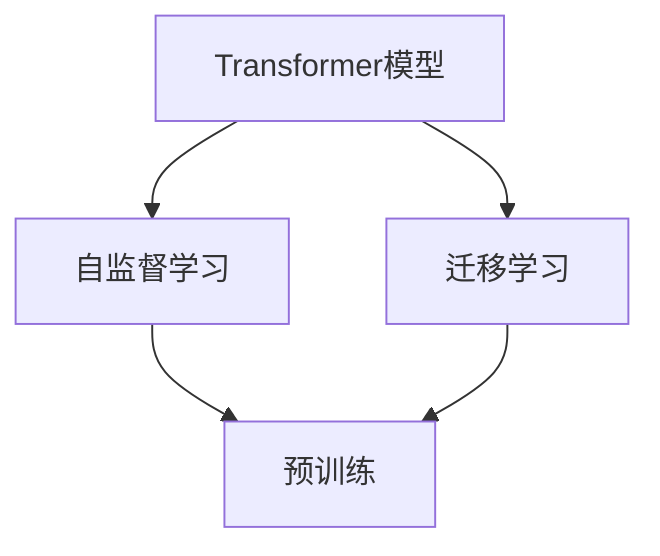
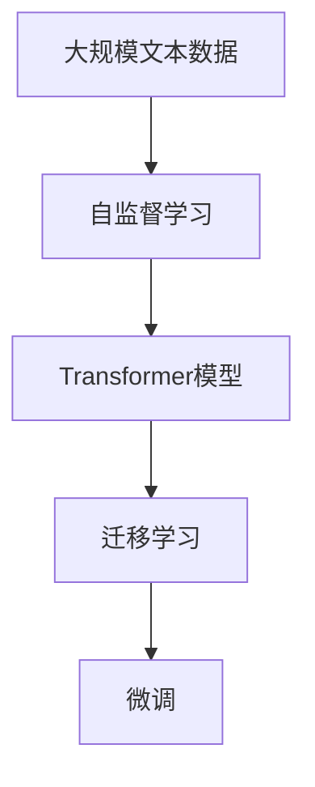
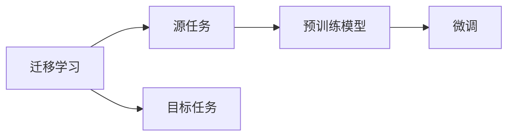
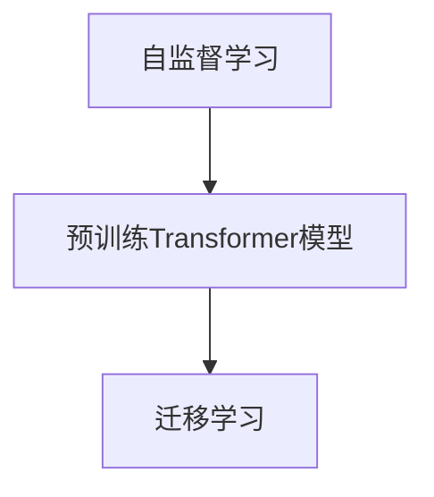
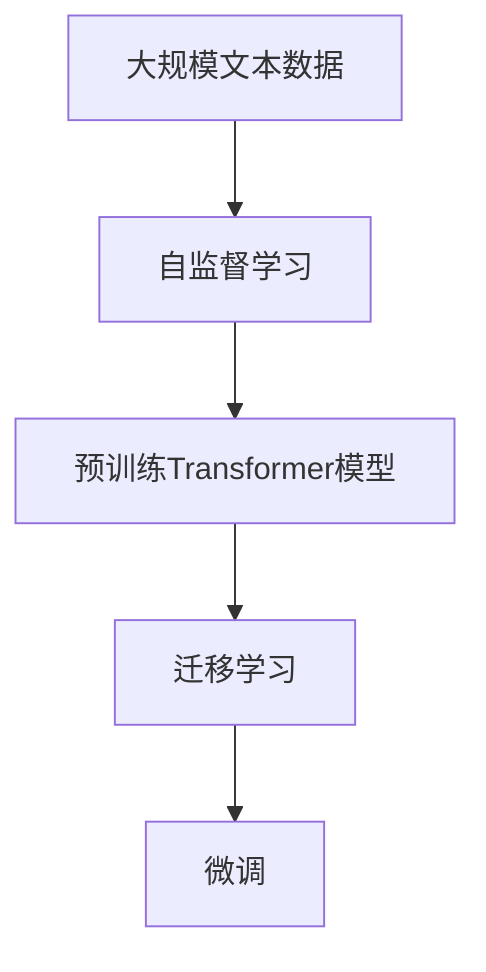

                 

# Andrej Karpathy：自然语言处理的突破

> 关键词：自然语言处理,深度学习,Transformer模型,语言理解,计算机视觉,自监督学习,迁移学习

## 1. 背景介绍

### 1.1 问题由来

近年来，自然语言处理（NLP）领域取得了前所未有的进步，尤其是在深度学习技术的推动下。特别是基于Transformer模型的自监督预训练方法，如GPT、BERT等，显著提升了语言模型的理解和生成能力。其中，Andrej Karpathy是Transformer模型的早期开发者之一，也是深度学习领域的杰出代表，他的研究成果为NLP技术的突破奠定了坚实的基础。

Karpathy的研究不仅涵盖了自然语言处理，还扩展到了计算机视觉、机器翻译等多个领域。他的工作对于推动深度学习在实际应用中的广泛应用具有重要意义。本文将围绕Karpathy在NLP领域的突破性贡献，详细探讨其在Transformer模型、自监督学习、迁移学习等关键技术方面的贡献。

### 1.2 问题核心关键点

Karpathy的研究贡献主要集中在以下几个关键点上：
1. **Transformer模型**：Transformer模型是Karpathy等人提出的一种新型神经网络架构，广泛应用于语言理解和生成任务，极大提升了NLP模型的性能。
2. **自监督学习**：Karpathy提出了一系列自监督学习方法，通过大规模无标签数据进行预训练，显著提高了语言模型的泛化能力。
3. **迁移学习**：Karpathy在迁移学习方面也有重要贡献，通过在大规模数据上进行预训练，然后针对特定任务进行微调，使得模型能够在新的任务上取得优异表现。

### 1.3 问题研究意义

Karpathy的研究不仅推动了NLP技术的发展，还对整个深度学习社区产生了深远影响。他的工作为NLP领域提供了强有力的工具和方法，帮助开发者更高效地实现复杂的NLP任务。同时，Karpathy的研究也启发了计算机视觉等其他领域的创新，推动了跨领域研究的发展。

## 2. 核心概念与联系

### 2.1 核心概念概述

为了更好地理解Karpathy在NLP领域的贡献，本节将介绍几个密切相关的核心概念：

- **Transformer模型**：Transformer模型是一种基于自注意力机制的神经网络架构，通过并行计算大幅提升了语言模型的处理速度和效果。
- **自监督学习**：自监督学习是指在大规模无标签数据上进行预训练，利用数据中的内在关联性，学习到通用的语言表示。
- **迁移学习**：迁移学习是将在一个领域学到的知识迁移到另一个相关领域的应用，特别是在大规模预训练模型上进行的微调。

这些核心概念之间的关系通过以下Mermaid流程图来展示：



这个流程图展示了Transformer模型与自监督学习和迁移学习的关系：

1. **自监督学习**：通过大规模无标签数据对Transformer模型进行预训练，学习到通用的语言表示。
2. **迁移学习**：在大规模预训练模型的基础上，针对特定任务进行微调，使得模型能够在新的任务上取得优异表现。

### 2.2 概念间的关系

这些核心概念之间存在着紧密的联系，形成了NLP技术的完整生态系统。下面我们通过几个Mermaid流程图来展示这些概念之间的关系。

#### 2.2.1 Transformer模型的学习范式



这个流程图展示了Transformer模型的学习过程：

1. **自监督学习**：使用大规模无标签文本数据对Transformer模型进行预训练，学习到通用的语言表示。
2. **迁移学习**：在预训练的基础上，针对特定任务进行微调，提升模型在特定任务上的性能。

#### 2.2.2 迁移学习与微调的关系



这个流程图展示了迁移学习的基本原理，以及它与微调的关系：

1. **迁移学习**：将预训练模型应用于目标任务，通过微调进一步优化模型性能。

#### 2.2.3 自监督学习在Transformer模型中的应用



这个流程图展示了自监督学习在Transformer模型中的应用：

1. **自监督学习**：在大规模无标签数据上进行预训练，学习到通用的语言表示。
2. **迁移学习**：利用预训练模型在特定任务上进行微调，提高模型性能。

### 2.3 核心概念的整体架构

最后，我们用一个综合的流程图来展示这些核心概念在大语言模型微调过程中的整体架构：



这个综合流程图展示了从自监督学习到预训练模型，再到迁移学习和微调的完整过程。Transformer模型通过自监督学习获得语言表示，然后通过迁移学习和微调，适应新的任务，从而提升模型性能。

## 3. 核心算法原理 & 具体操作步骤
### 3.1 算法原理概述

Karpathy在NLP领域的核心工作围绕Transformer模型展开，特别在自监督学习、迁移学习等技术上有重要贡献。以下将详细介绍这些技术的原理和具体操作步骤。

### 3.2 算法步骤详解

#### 3.2.1 自监督学习

自监督学习的核心思想是利用大规模无标签数据进行预训练，学习到通用的语言表示。Karpathy提出了几种自监督学习方法：

1. **语言建模**：通过预测给定文本序列的概率，学习到语言的基本规律和结构。
2. **掩码语言建模**：在给定文本序列中随机掩码一部分单词，预测被掩码的单词，学习到词语间的依赖关系。
3. **下一句预测**：预测给定文本序列的下一句是否与之相关，学习到词语之间的语义关系。

#### 3.2.2 迁移学习

迁移学习在大规模预训练模型的基础上，针对特定任务进行微调。Karpathy在迁移学习方面的工作主要集中在以下几个方面：

1. **下游任务微调**：在预训练模型基础上，针对特定任务（如分类、匹配、生成等）进行微调，使模型能够适应新任务。
2. **多任务学习**：在同一模型上进行多个任务的微调，提高模型的泛化能力和性能。
3. **零样本和少样本学习**：利用预训练模型的泛化能力，通过少量标注数据进行零样本和少样本学习，降低标注成本。

#### 3.2.3 具体微调步骤

Karpathy在微调步骤上主要采用了以下方法：

1. **设置微调超参数**：选择合适的优化算法（如Adam、SGD等）及其参数，设置学习率、批大小、迭代轮数等。
2. **添加任务适配层**：根据任务类型，在预训练模型顶层设计合适的输出层和损失函数。
3. **设置微调策略**：决定是否冻结预训练参数，以及哪些参数参与微调。
4. **执行梯度训练**：使用训练集数据进行有监督的微调，最小化损失函数。
5. **验证和测试**：在验证集和测试集上评估模型性能，调整超参数。

### 3.3 算法优缺点

自监督学习和迁移学习在提升NLP模型性能方面具有显著优势，但也存在一些局限性：

#### 3.3.1 自监督学习的优点

1. **无需标注数据**：自监督学习可以在大规模无标签数据上进行预训练，减少了对标注数据的依赖。
2. **泛化能力强**：通过学习数据中的内在关联性，自监督学习能够学习到通用的语言表示。
3. **计算效率高**：自监督学习可以在分布式系统中并行训练，大幅提升训练效率。

#### 3.3.2 自监督学习的缺点

1. **学习任务有限**：自监督学习只利用了数据的部分信息，无法学习到所有任务相关的知识。
2. **训练时间较长**：自监督学习在大规模数据上训练时间较长，资源消耗较大。

#### 3.3.3 迁移学习的优点

1. **适应性强**：迁移学习可以在已有预训练模型的基础上，针对特定任务进行微调，提高模型性能。
2. **效果显著**：迁移学习可以在小样本情况下取得较好的性能提升，降低标注成本。
3. **灵活性高**：迁移学习可以用于多种NLP任务，如文本分类、机器翻译、问答等。

#### 3.3.4 迁移学习的缺点

1. **依赖预训练模型**：迁移学习的效果依赖于预训练模型的质量和泛化能力。
2. **微调数据需求高**：迁移学习需要一定量的标注数据进行微调，否则效果可能不佳。
3. **过拟合风险**：微调过程中存在过拟合的风险，特别是数据量较小的情况下。

### 3.4 算法应用领域

自监督学习和迁移学习在大规模预训练模型的基础上，广泛应用于NLP领域的各个任务。以下列举几个典型应用：

1. **文本分类**：通过微调学习文本与标签之间的映射关系，如情感分析、主题分类等。
2. **命名实体识别**：识别文本中的人名、地名、机构名等特定实体，如BIO标注法。
3. **关系抽取**：从文本中抽取实体之间的语义关系，如提取事件实体关系。
4. **问答系统**：利用微调模型对自然语言问题进行理解和回答，如Google的Question Answering。
5. **机器翻译**：将源语言文本翻译成目标语言，如百度翻译、Google翻译等。
6. **文本摘要**：将长文本压缩成简短摘要，如Top-k Summarization。

## 4. 数学模型和公式 & 详细讲解 & 举例说明

### 4.1 数学模型构建

#### 4.1.1 自监督学习模型

自监督学习的数学模型可以表示为：

$$
\hat{P}(x_i) = \frac{e^{f(x_i)}}{\sum_{j=1}^N e^{f(x_j)}}
$$

其中，$f(x_i)$为自监督学习模型的预测函数，$\hat{P}(x_i)$表示给定文本序列的概率分布。

#### 4.1.2 迁移学习模型

迁移学习的数学模型可以表示为：

$$
\hat{P}(y|x) = \frac{e^{f(x,y)}}{\sum_{y'} e^{f(x,y')}}
$$

其中，$f(x,y)$为迁移学习模型的预测函数，$\hat{P}(y|x)$表示给定文本序列和任务标签的条件概率分布。

### 4.2 公式推导过程

#### 4.2.1 语言建模的推导

语言建模的公式推导如下：

1. **自监督学习**：
   - **预测单词**：给定文本序列，预测下一个单词的概率分布。
   - **计算损失**：使用交叉熵损失函数，计算预测概率与真实概率之间的差异。
   - **优化模型**：通过反向传播算法，最小化损失函数，更新模型参数。

2. **迁移学习**：
   - **微调任务**：在预训练模型的基础上，针对特定任务进行微调。
   - **损失函数**：根据任务的性质，设计合适的损失函数。
   - **优化过程**：通过梯度下降算法，更新模型参数，最小化损失函数。

### 4.3 案例分析与讲解

#### 4.3.1 实例分析

以BERT模型为例，介绍其在大规模预训练和微调中的应用：

1. **预训练过程**：
   - **数据准备**：使用大规模无标签文本数据进行预训练。
   - **模型结构**：采用Transformer模型，包含多个编码器层。
   - **训练流程**：使用掩码语言建模和下一句预测等任务进行预训练。

2. **微调过程**：
   - **任务适配**：在微调任务上设计合适的输出层和损失函数。
   - **模型微调**：使用少量标注数据进行微调，最小化损失函数。
   - **效果评估**：在验证集和测试集上评估模型性能，调整超参数。

## 5. 项目实践：代码实例和详细解释说明

### 5.1 开发环境搭建

为了进行NLP任务的微调实践，需要配置合适的开发环境。以下是在Python中使用PyTorch和Transformers库搭建环境的步骤：

1. 安装Anaconda：从官网下载并安装Anaconda，用于创建独立的Python环境。

2. 创建并激活虚拟环境：
```bash
conda create -n pytorch-env python=3.8 
conda activate pytorch-env
```

3. 安装PyTorch：根据CUDA版本，从官网获取对应的安装命令。例如：
```bash
conda install pytorch torchvision torchaudio cudatoolkit=11.1 -c pytorch -c conda-forge
```

4. 安装Transformers库：
```bash
pip install transformers
```

5. 安装各类工具包：
```bash
pip install numpy pandas scikit-learn matplotlib tqdm jupyter notebook ipython
```

完成上述步骤后，即可在`pytorch-env`环境中开始NLP任务的微调实践。

### 5.2 源代码详细实现

以BERT模型在文本分类任务上的微调为例，给出使用Transformers库的代码实现：

```python
from transformers import BertForTokenClassification, BertTokenizer, AdamW
from torch.utils.data import DataLoader
from sklearn.metrics import accuracy_score, precision_score, recall_score, f1_score

# 定义模型和优化器
model = BertForTokenClassification.from_pretrained('bert-base-cased', num_labels=2)
tokenizer = BertTokenizer.from_pretrained('bert-base-cased')
optimizer = AdamW(model.parameters(), lr=2e-5)

# 定义数据处理函数
def tokenize_and_encode(text):
    return tokenizer.encode_plus(text, add_special_tokens=True, return_tensors='pt', padding='max_length', max_length=128, truncation=True)

# 加载数据集
train_data = load_train_data()
dev_data = load_dev_data()
test_data = load_test_data()

# 定义模型训练函数
def train(model, data_loader, optimizer):
    model.train()
    total_loss = 0
    for batch in data_loader:
        input_ids = batch['input_ids']
        attention_mask = batch['attention_mask']
        labels = batch['labels']
        optimizer.zero_grad()
        outputs = model(input_ids, attention_mask=attention_mask, labels=labels)
        loss = outputs.loss
        total_loss += loss.item()
        loss.backward()
        optimizer.step()
    return total_loss / len(data_loader)

# 定义模型评估函数
def evaluate(model, data_loader):
    model.eval()
    total_preds, total_labels = [], []
    for batch in data_loader:
        input_ids = batch['input_ids']
        attention_mask = batch['attention_mask']
        labels = batch['labels']
        outputs = model(input_ids, attention_mask=attention_mask)
        preds = outputs.logits.argmax(dim=2).to('cpu').tolist()
        labels = labels.to('cpu').tolist()
        total_preds.extend(preds)
        total_labels.extend(labels)
    accuracy = accuracy_score(total_labels, total_preds)
    precision = precision_score(total_labels, total_preds)
    recall = recall_score(total_labels, total_preds)
    f1 = f1_score(total_labels, total_preds)
    return accuracy, precision, recall, f1

# 训练模型
epochs = 5
batch_size = 16

for epoch in range(epochs):
    train_loss = train(model, train_data_loader, optimizer)
    print(f"Epoch {epoch+1}, train loss: {train_loss:.3f}")

    dev_accuracy, dev_precision, dev_recall, dev_f1 = evaluate(model, dev_data_loader)
    print(f"Epoch {epoch+1}, dev results:")
    print(f"Accuracy: {dev_accuracy:.3f}, Precision: {dev_precision:.3f}, Recall: {dev_recall:.3f}, F1: {dev_f1:.3f}")

# 测试模型
test_accuracy, test_precision, test_recall, test_f1 = evaluate(model, test_data_loader)
print(f"Test results:")
print(f"Accuracy: {test_accuracy:.3f}, Precision: {test_precision:.3f}, Recall: {test_recall:.3f}, F1: {test_f1:.3f}")
```

### 5.3 代码解读与分析

这段代码实现了BERT模型在文本分类任务上的微调。以下是关键代码的实现细节：

- **数据处理函数**：定义了将文本转换为模型所需的输入格式，包括编码、添加特殊标记、截断、填充等操作。
- **模型训练函数**：使用数据集迭代，计算损失函数并反向传播更新模型参数。
- **模型评估函数**：在测试集上评估模型性能，输出各项指标。
- **训练流程**：设置训练轮数和批大小，循环进行训练和评估，记录训练过程中的损失值和评估结果。

## 6. 实际应用场景

### 6.1 智能客服系统

基于预训练语言模型的微调技术，可以构建高效智能客服系统。传统客服依赖人工处理，高峰期响应慢，一致性差。利用微调后的对话模型，可以实现7x24小时不间断服务，快速响应客户咨询，提供自然流畅的语言答复。

### 6.2 金融舆情监测

金融机构需要实时监测市场舆论动向，避免负面信息传播。微调技术可以实现情感分析和主题分类，帮助金融机构及时应对风险，维护金融稳定。

### 6.3 个性化推荐系统

现有的推荐系统只依赖用户行为数据，难以充分挖掘用户的兴趣和偏好。通过微调预训练语言模型，可以学习到更全面、准确的兴趣表示，提供个性化推荐服务，提升用户体验。

### 6.4 未来应用展望

未来，大语言模型微调技术将应用于更多领域，如智慧医疗、教育、城市治理等，推动NLP技术的产业化进程，创造更多社会价值。

## 7. 工具和资源推荐

### 7.1 学习资源推荐

为了掌握大语言模型微调技术的核心内容，推荐以下学习资源：

1. **《Transformer从原理到实践》系列博文**：深入介绍Transformer模型和微调技术。
2. **CS224N《深度学习自然语言处理》课程**：斯坦福大学开设的NLP明星课程，涵盖预训练、微调等基本概念。
3. **《Natural Language Processing with Transformers》书籍**：介绍Transformer库的使用和微调范式。
4. **HuggingFace官方文档**：提供丰富的预训练模型和微调样例代码。
5. **CLUE开源项目**：涵盖大量中文NLP数据集，并提供了基于微调的baseline模型。

### 7.2 开发工具推荐

合理使用开发工具，可以显著提升微调过程的效率和精度。以下是几款推荐工具：

1. **PyTorch**：基于Python的开源深度学习框架，适合快速迭代研究。
2. **TensorFlow**：由Google主导开发的深度学习框架，适用于大规模工程应用。
3. **Transformers库**：提供丰富的预训练模型和微调函数，简化开发过程。
4. **Weights & Biases**：实验跟踪工具，记录和可视化模型训练过程。
5. **TensorBoard**：可视化工具，监测模型训练状态。

### 7.3 相关论文推荐

以下是几篇与大语言模型微调技术相关的经典论文：

1. **Attention is All You Need**：Transformer模型的原论文，提出了自注意力机制。
2. **BERT: Pre-training of Deep Bidirectional Transformers for Language Understanding**：提出BERT模型，引入自监督学习任务。
3. **Language Models are Unsupervised Multitask Learners**：展示大语言模型的零样本学习能力。
4. **Parameter-Efficient Transfer Learning for NLP**：提出Adapter等参数高效微调方法。
5. **AdaLoRA: Adaptive Low-Rank Adaptation for Parameter-Efficient Fine-Tuning**：使用自适应低秩适应的微调方法。

## 8. 总结：未来发展趋势与挑战

### 8.1 研究成果总结

本文详细介绍了Karpathy在NLP领域的贡献，涵盖了Transformer模型、自监督学习、迁移学习等核心技术。这些技术推动了大语言模型在NLP任务上的突破，为深度学习社区带来了新的研究方向和应用场景。

### 8.2 未来发展趋势

未来，大语言模型微调技术将面临以下发展趋势：

1. **模型规模持续增大**：预训练模型的参数量将继续增长，提升模型性能。
2. **微调方法多样化**：除了传统的全参数微调，更多参数高效、计算高效的方法将被开发。
3. **持续学习成为常态**：模型需要不断学习新知识，保持时效性和适应性。
4. **标注数据需求降低**：通过自监督学习和提示学习，减少对标注数据的依赖。
5. **多模态微调崛起**：融合视觉、语音等模态信息，提升语言模型的跨模态能力。

### 8.3 面临的挑战

尽管大语言模型微调技术取得了显著进展，但仍面临以下挑战：

1. **标注成本瓶颈**：微调依赖标注数据，标注成本高昂。
2. **模型鲁棒性不足**：泛化性能差，对域外数据适应性不足。
3. **推理效率低**：模型大、推理慢，需要优化模型结构。
4. **可解释性不足**：模型复杂，难以解释其决策过程。
5. **安全性问题**：模型可能学习到有害信息，需要加强监管。

### 8.4 研究展望

面对这些挑战，未来的研究方向包括：

1. **无监督和半监督微调**：利用自监督学习降低标注成本。
2. **参数高效和计算高效微调**：提高模型微调效率。
3. **因果学习和博弈论**：增强模型的鲁棒性和稳定性。
4. **多模态融合**：提升模型的跨模态能力。
5. **伦理和安全**：研究模型的可解释性和安全性。

## 9. 附录：常见问题与解答

### 9.1 常见问题

**Q1: 大语言模型微调是否适用于所有NLP任务？**

A: 微调方法适用于大多数NLP任务，但在特定领域如医学、法律等，需要进一步预训练和微调。

**Q2: 微调过程中如何设置合适的学习率？**

A: 微调学习率通常较小，从2e-5开始，逐步减小，避免破坏预训练权重。

**Q3: 微调过程中如何缓解过拟合问题？**

A: 数据增强、正则化、对抗训练等方法可以缓解过拟合。

**Q4: 微调模型在部署时需要注意哪些问题？**

A: 模型裁剪、量化加速、服务化封装等技术有助于模型部署。

**Q5: 如何利用大语言模型提升推荐系统的效果？**

A: 微调模型学习用户兴趣表示，提供个性化推荐。

**Q6: 大语言模型微调的未来趋势是什么？**

A: 模型规模增大，微调方法多样化，持续学习成为常态，标注数据需求降低，多模态微调崛起。

---

作者：禅与计算机程序设计艺术 / Zen and the Art of Computer Programming

