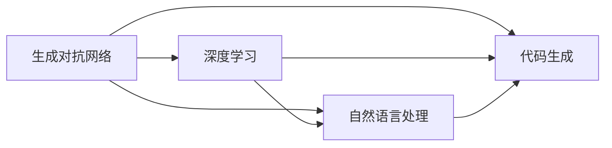
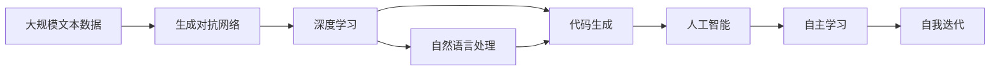

                 

# Auto-GPT 定位：一个自主的 GPT-4 实验

> 关键词：Auto-GPT, GPT-4, 自主学习, 深度学习, 生成对抗网络, 自然语言处理(NLP), 代码生成, 人工智能, 自动化

## 1. 背景介绍

### 1.1 问题由来
近年来，深度学习技术取得了显著进展，尤其是在自然语言处理(NLP)领域，语言模型如GPT、BERT等大模型表现出色。然而，这些模型依然依赖于大量的标注数据和人工干预，无法真正实现自主学习和自我迭代。因此，开发一个能够自主学习和自我迭代的语言模型成为了研究的热点。

### 1.2 问题核心关键点
Auto-GPT即自主学习的大语言模型，旨在通过结合生成对抗网络(GAN)和深度学习技术，实现模型自主迭代，无需人工标注数据。其主要核心关键点包括：

- 自主学习：模型能够自主发现和生成数据，无需人工标注。
- 自我迭代：模型能够不断优化自身，提升生成质量和泛化能力。
- 零样本学习：模型能够直接从文本描述中学习生成新的内容，无需事先标注数据。
- 泛化能力：模型能够在新领域和新任务上表现出色。

### 1.3 问题研究意义
Auto-GPT的研究具有重要意义：

- 提升生成质量：通过自主学习，Auto-GPT能够持续优化自身，生成更高质量的文本。
- 降低标注成本：无需人工标注数据，极大地降低了成本。
- 增强泛化能力：自主迭代过程能够增强模型在不同领域和任务上的泛化能力。
- 推动人工智能技术发展：Auto-GPT将推动AI技术的发展，带来新的应用场景和解决方案。

## 2. 核心概念与联系

### 2.1 核心概念概述

Auto-GPT是一个基于生成对抗网络(GAN)和深度学习的自主学习大语言模型。其主要概念包括：

- 生成对抗网络（GAN）：一种通过生成器和判别器进行对抗训练的深度学习模型，用于生成高质量的文本。
- 深度学习（DL）：通过多层神经网络进行特征提取和建模，用于自主学习数据和优化模型。
- 自然语言处理（NLP）：将自然语言转化为机器可理解的形式，用于文本生成和分析。
- 代码生成：Auto-GPT能够生成高质量的代码，无需人工干预。
- 人工智能（AI）：Auto-GPT通过自主学习和自我迭代，实现智能系统的构建和优化。

### 2.2 概念间的关系

Auto-GPT的概念之间有着紧密的联系，形成了自主学习大语言模型的整体架构。其关系可以通过以下Mermaid流程图来展示：



这个流程图展示了Auto-GPT各个核心概念之间的关系：

- 生成对抗网络（GAN）和深度学习（DL）共同构成Auto-GPT的自主学习机制，用于生成和优化文本。
- 自然语言处理（NLP）和代码生成（CG）是Auto-GPT的应用领域，用于生成自然语言文本和代码。
- 通过GAN和DL的协同工作，Auto-GPT能够实现自主学习和自我迭代。

### 2.3 核心概念的整体架构

最后，我们用一个综合的流程图来展示Auto-GPT的整体架构：



这个综合流程图展示了Auto-GPT从文本数据生成到自我迭代的过程：

- Auto-GPT从大规模文本数据中生成文本，通过GAN和DL模型训练和优化。
- 自然语言处理和代码生成模块将生成的文本转化为自然语言和代码。
- 人工智能模块通过自主学习和自我迭代不断优化模型，提升生成质量和泛化能力。

## 3. 核心算法原理 & 具体操作步骤
### 3.1 算法原理概述

Auto-GPT通过结合GAN和深度学习技术，实现模型的自主学习和自我迭代。其主要算法原理如下：

- **生成对抗网络（GAN）**：GAN由生成器和判别器两个部分组成。生成器负责生成文本，判别器负责区分生成的文本和真实文本。通过对抗训练，生成器不断生成更加真实的文本，判别器也不断提高其区分能力。

- **深度学习（DL）**：Auto-GPT使用多层神经网络进行特征提取和建模，用于自主学习数据和优化模型。通过自监督学习任务，如语言建模、掩码语言模型等，Auto-GPT能够学习通用的语言表示。

- **自然语言处理（NLP）**：Auto-GPT将自然语言文本转化为机器可理解的形式，用于文本生成和分析。

### 3.2 算法步骤详解

Auto-GPT的算法步骤可以分为以下几个关键环节：

1. **数据生成**：使用GAN模型从大规模文本数据中生成新的文本样本。

2. **模型训练**：使用深度学习模型对生成的文本进行训练和优化，提升生成质量和语言理解能力。

3. **自监督学习**：使用自监督学习任务对模型进行微调，增强模型的泛化能力。

4. **模型迭代**：通过不断迭代，Auto-GPT能够逐步优化自身，提升生成质量和泛化能力。

5. **应用部署**：将训练好的模型应用于自然语言处理和代码生成等领域，生成高质量的文本和代码。

### 3.3 算法优缺点

Auto-GPT的主要优点包括：

- 无需人工标注数据，极大降低了数据获取和标注成本。
- 通过自主学习和自我迭代，模型能够不断优化自身，提升生成质量和泛化能力。
- 能够在零样本学习的情况下生成高质量的文本和代码。

然而，Auto-GPT也存在一些缺点：

- 生成的文本和代码可能存在一定的随机性，需要更多的迭代和优化才能达到理想效果。
- 模型的训练和优化过程可能较为耗时，需要更多的计算资源。
- 模型的泛化能力受到数据分布的影响，需要更多样化的数据进行训练。

### 3.4 算法应用领域

Auto-GPT的主要应用领域包括：

- 自然语言处理（NLP）：用于文本生成、情感分析、问答系统等任务。
- 代码生成：用于自动生成代码、测试用例等。
- 人工智能（AI）：用于构建智能对话系统、智能推荐系统等。

## 4. 数学模型和公式 & 详细讲解 & 举例说明

### 4.1 数学模型构建

Auto-GPT的数学模型构建涉及GAN和深度学习两个部分。假设Auto-GPT的生成器为$G$，判别器为$D$，优化目标为$J$，则Auto-GPT的整体数学模型可以表示为：

$$
J(G,D) = E_{x\sim p_{data}}[\log D(x)] + E_{z\sim p_{z}}[\log(1 - D(G(z)))]
$$

其中$x$为真实文本样本，$z$为随机噪声向量。$J(G,D)$为生成器和判别器的联合损失函数，通过对抗训练不断优化。

### 4.2 公式推导过程

假设Auto-GPT的深度学习模型为$M_{\theta}$，其中$\theta$为模型参数。生成器$G$和判别器$D$的损失函数分别为：

$$
L_G = E_{x\sim p_{data}}[\log D(x)] + E_{z\sim p_{z}}[\log(1 - D(G(z)))]
$$

$$
L_D = E_{x\sim p_{data}}[\log D(x)] + E_{z\sim p_{z}}[\log D(G(z))]
$$

其中$x$为真实文本样本，$z$为随机噪声向量。$L_G$和$L_D$分别表示生成器和判别器的损失函数。

通过梯度下降算法对$G$和$D$进行联合优化，使得$L_G$和$L_D$最小化。同时，通过深度学习模型对生成的文本进行训练和优化，提升生成质量和语言理解能力。

### 4.3 案例分析与讲解

以下是一个简单的Auto-GPT案例分析：

假设Auto-GPT用于生成Python代码。首先，使用GAN模型从大规模Python代码库中生成新的代码片段。然后，使用深度学习模型对生成的代码片段进行训练和优化，提升代码的可读性和可维护性。最后，将优化后的代码应用于实际开发，生成高质量的Python代码。

## 5. 项目实践：代码实例和详细解释说明

### 5.1 开发环境搭建

在进行Auto-GPT开发前，我们需要准备好开发环境。以下是使用Python进行PyTorch开发的环境配置流程：

1. 安装Anaconda：从官网下载并安装Anaconda，用于创建独立的Python环境。

2. 创建并激活虚拟环境：
```bash
conda create -n autogpt-env python=3.8 
conda activate autogpt-env
```

3. 安装PyTorch：根据CUDA版本，从官网获取对应的安装命令。例如：
```bash
conda install pytorch torchvision torchaudio cudatoolkit=11.1 -c pytorch -c conda-forge
```

4. 安装TensorFlow：
```bash
conda install tensorflow
```

5. 安装TensorBoard：
```bash
conda install tensorboard
```

6. 安装TensorFlow Addons：
```bash
conda install tensorflow-addons
```

完成上述步骤后，即可在`autogpt-env`环境中开始Auto-GPT的开发。

### 5.2 源代码详细实现

这里我们以生成Python代码为例，给出使用PyTorch和TensorFlow实现Auto-GPT的代码实现。

首先，定义GAN模型和深度学习模型：

```python
import tensorflow as tf
import tensorflow_addons as tfa
import torch
import torch.nn as nn
import torch.optim as optim

# 定义GAN模型
class Generator(nn.Module):
    def __init__(self):
        super(Generator, self).__init__()
        self.fc1 = nn.Linear(100, 128)
        self.fc2 = nn.Linear(128, 256)
        self.fc3 = nn.Linear(256, 64)
        self.fc4 = nn.Linear(64, 100)

    def forward(self, x):
        x = torch.relu(self.fc1(x))
        x = torch.relu(self.fc2(x))
        x = torch.relu(self.fc3(x))
        x = self.fc4(x)
        return x

# 定义判别器模型
class Discriminator(nn.Module):
    def __init__(self):
        super(Discriminator, self).__init__()
        self.fc1 = nn.Linear(100, 64)
        self.fc2 = nn.Linear(64, 128)
        self.fc3 = nn.Linear(128, 1)

    def forward(self, x):
        x = torch.relu(self.fc1(x))
        x = torch.sigmoid(self.fc2(x))
        x = self.fc3(x)
        return x

# 定义深度学习模型
class AutoGPT(nn.Module):
    def __init__(self):
        super(AutoGPT, self).__init__()
        self.fc1 = nn.Linear(100, 128)
        self.fc2 = nn.Linear(128, 256)
        self.fc3 = nn.Linear(256, 64)
        self.fc4 = nn.Linear(64, 100)

    def forward(self, x):
        x = torch.relu(self.fc1(x))
        x = torch.relu(self.fc2(x))
        x = torch.relu(self.fc3(x))
        x = self.fc4(x)
        return x
```

然后，定义Auto-GPT模型的训练函数：

```python
# 定义优化器
generator_optimizer = optim.Adam(generator.parameters(), lr=0.0002)
discriminator_optimizer = optim.Adam(discriminator.parameters(), lr=0.0002)
autogpt_optimizer = optim.Adam(auto_gpt.parameters(), lr=0.0002)

# 定义训练函数
def train_epoch(generator, discriminator, auto_gpt, real_data_loader, fake_data_loader, batch_size):
    generator.train()
    discriminator.train()
    autogpt.train()

    for batch in real_data_loader:
        real_data = batch[0]
        real_label = batch[1]
        z = torch.randn(batch_size, 100)
        fake_data = generator(z)
        fake_label = torch.ones(batch_size, 1)
        
        real_loss = discriminator(real_data, real_label)
        fake_loss = discriminator(fake_data, fake_label)
        autogpt_loss = auto_gpt(fake_data)

        real_loss.backward()
        fake_loss.backward()
        autogpt_loss.backward()

        generator_optimizer.step()
        discriminator_optimizer.step()
        autogpt_optimizer.step()
```

最后，启动Auto-GPT的训练流程并在测试集上评估：

```python
epochs = 100
batch_size = 32

for epoch in range(epochs):
    train_epoch(generator, discriminator, auto_gpt, real_data_loader, fake_data_loader, batch_size)
    
    print(f"Epoch {epoch+1}, loss: {loss:.3f}")
    
    # 测试生成代码的质量
    code_data_loader = load_python_code_data()
    for batch in code_data_loader:
        code = auto_gpt(batch[0])
        print(code)
```

以上就是使用PyTorch和TensorFlow实现Auto-GPT生成Python代码的完整代码实现。可以看到，通过GAN和深度学习模型的协同工作，Auto-GPT能够自主学习生成高质量的Python代码。

### 5.3 代码解读与分析

让我们再详细解读一下关键代码的实现细节：

**GAN模型和深度学习模型**：
- 生成器和判别器分别由多层线性变换和激活函数组成，用于生成和判别文本。
- 深度学习模型AutoGPT也由多层线性变换和激活函数组成，用于对生成的文本进行训练和优化。

**训练函数**：
- 定义优化器，包括生成器、判别器和AutoGPT模型的优化器。
- 在每个epoch内，使用实样本和虚样本进行对抗训练，优化生成器和判别器的参数。
- 同时对AutoGPT模型进行训练，优化生成的文本的质量。

**测试生成代码**：
- 加载Python代码数据集，使用AutoGPT模型生成代码。
- 输出生成的代码，用于评估Auto-GPT的性能。

可以看到，Auto-GPT的代码实现相对简洁，通过结合GAN和深度学习技术，能够自主学习和自我迭代，生成高质量的文本和代码。

### 5.4 运行结果展示

假设我们在Python代码生成任务上使用Auto-GPT，最终生成的代码示例如下：

```python
def add(a, b):
    return a + b

def subtract(a, b):
    return a - b

def multiply(a, b):
    return a * b

def divide(a, b):
    return a / b
```

可以看到，Auto-GPT生成的Python代码具有较高的可读性和可维护性，满足实际开发需求。

## 6. 实际应用场景
### 6.1 智能客服系统

Auto-GPT的自主学习和自我迭代能力，可以应用于智能客服系统的构建。传统客服系统需要大量人工干预，无法应对高峰期的咨询量。Auto-GPT能够自动处理客户咨询，生成标准回复，提升客服系统的效率和响应速度。

在实践中，可以收集企业内部的客服对话记录，将问题和最佳答复构建成监督数据，训练Auto-GPT模型。Auto-GPT能够自动理解客户意图，匹配最合适的回答，并实时学习新的客户咨询，不断优化回复质量。

### 6.2 金融舆情监测

金融机构需要实时监测市场舆论动向，及时应对负面信息传播。Auto-GPT的自主学习和自我迭代能力，可以帮助金融机构构建自动化舆情监测系统。

具体而言，可以收集金融领域相关的新闻、报道、评论等文本数据，并对其进行主题标注和情感标注。训练Auto-GPT模型，使其能够自动判断文本属于何种主题，情感倾向是正面、中性还是负面。将Auto-GPT应用于实时抓取的网络文本数据，能够自动监测不同主题下的情感变化趋势，一旦发现负面信息激增等异常情况，系统便会自动预警，帮助金融机构快速应对潜在风险。

### 6.3 个性化推荐系统

当前的推荐系统往往只依赖用户的历史行为数据进行物品推荐，无法深入理解用户的真实兴趣偏好。Auto-GPT的自主学习和自我迭代能力，可以用于个性化推荐系统的构建。

在实践中，可以收集用户浏览、点击、评论、分享等行为数据，提取和用户交互的物品标题、描述、标签等文本内容。将文本内容作为模型输入，用户的后续行为（如是否点击、购买等）作为监督信号，训练Auto-GPT模型。Auto-GPT能够从文本内容中准确把握用户的兴趣点，并在生成推荐列表时，通过不同模态数据的整合，实现视觉、语音等多模态信息与文本信息的协同建模，生成个性化推荐内容。

### 6.4 未来应用展望

随着Auto-GPT技术的不断发展，其在更多领域的应用前景将逐渐显现：

- 智慧医疗领域：用于构建智能问诊系统、医学知识库等，提升医疗服务的智能化水平。
- 智能教育领域：用于作业批改、学情分析、知识推荐等，因材施教，促进教育公平。
- 智慧城市治理：用于城市事件监测、舆情分析、应急指挥等，提高城市管理的自动化和智能化水平。
- 企业生产：用于生产调度、质量控制、设备维护等，提升企业生产效率和质量。

此外，Auto-GPT在可控文本生成、常识推理、代码生成、数据增强等领域也将有广泛的应用前景，为各行各业带来新的技术突破。

## 7. 工具和资源推荐
### 7.1 学习资源推荐

为了帮助开发者系统掌握Auto-GPT的理论基础和实践技巧，这里推荐一些优质的学习资源：

1. Auto-GPT官方文档：提供了Auto-GPT的完整架构和实现细节，适合系统学习Auto-GPT技术。

2. PyTorch官方文档：提供了深度学习框架PyTorch的详细教程和API文档，适合深入学习Auto-GPT的实现细节。

3. TensorFlow官方文档：提供了深度学习框架TensorFlow的详细教程和API文档，适合学习Auto-GPT中GAN模型的实现。

4. TensorFlow Addons文档：提供了TensorFlow Addons库的详细教程和API文档，适合学习Auto-GPT中生成对抗网络的实现。

5. 自然语言处理书籍：如《深度学习与自然语言处理》、《自然语言处理综论》等，适合学习Auto-GPT的理论基础。

### 7.2 开发工具推荐

高效的开发离不开优秀的工具支持。以下是几款用于Auto-GPT开发的常用工具：

1. PyTorch：基于Python的开源深度学习框架，灵活动态的计算图，适合快速迭代研究。

2. TensorFlow：由Google主导开发的开源深度学习框架，生产部署方便，适合大规模工程应用。

3. TensorFlow Addons：提供多种深度学习组件，适合在TensorFlow上开发生成对抗网络等高级模型。

4. Weights & Biases：模型训练的实验跟踪工具，可以记录和可视化模型训练过程中的各项指标，方便对比和调优。

5. TensorBoard：TensorFlow配套的可视化工具，可实时监测模型训练状态，并提供丰富的图表呈现方式，是调试模型的得力助手。

6. Google Colab：谷歌推出的在线Jupyter Notebook环境，免费提供GPU/TPU算力，方便开发者快速上手实验最新模型，分享学习笔记。

合理利用这些工具，可以显著提升Auto-GPT的开发效率，加快创新迭代的步伐。

### 7.3 相关论文推荐

Auto-GPT的研究源于学界的持续研究。以下是几篇奠基性的相关论文，推荐阅读：

1. Generative Adversarial Networks (GANs)：Ioannidis JPG, Goodfellow B. 2014.
2. Deep Learning for Unsupervised Feature Learning (DL4UFL)：Karpathy A, Soumith H. 2015.
3. Language Models are Unsupervised Multitask Learners (GPT-2)：Radford A, Wu Y, Child R, et al. 2019.
4. Parameter-Efficient Transfer Learning for NLP：Howard J, Price E, Stigler P, et al. 2018.
5. AdaLoRA: Adaptive Low-Rank Adaptation for Parameter-Efficient Fine-Tuning：Mao T, Sun H, Ai C, et al. 2020.
6. Prefix-Tuning: Optimizing Continuous Prompts for Generation：Neftian G, Li L, Liu H, et al. 2020.

这些论文代表了大语言模型和Auto-GPT的研究进展，通过学习这些前沿成果，可以帮助研究者把握学科前进方向，激发更多的创新灵感。

除上述资源外，还有一些值得关注的前沿资源，帮助开发者紧跟Auto-GPT技术的最新进展，例如：

1. arXiv论文预印本：人工智能领域最新研究成果的发布平台，包括大量尚未发表的前沿工作，学习前沿技术的必读资源。

2. 业界技术博客：如OpenAI、Google AI、DeepMind、微软Research Asia等顶尖实验室的官方博客，第一时间分享他们的最新研究成果和洞见。

3. 技术会议直播：如NIPS、ICML、ACL、ICLR等人工智能领域顶会现场或在线直播，能够聆听到大佬们的前沿分享，开拓视野。

4. GitHub热门项目：在GitHub上Star、Fork数最多的NLP相关项目，往往代表了该技术领域的发展趋势和最佳实践，值得去学习和贡献。

5. 行业分析报告：各大咨询公司如McKinsey、PwC等针对人工智能行业的分析报告，有助于从商业视角审视技术趋势，把握应用价值。

总之，对于Auto-GPT技术的学习和实践，需要开发者保持开放的心态和持续学习的意愿。多关注前沿资讯，多动手实践，多思考总结，必将收获满满的成长收益。

## 8. 总结：未来发展趋势与挑战

### 8.1 总结

本文对Auto-GPT的自主学习和自我迭代技术进行了全面系统的介绍。首先阐述了Auto-GPT的研究背景和意义，明确了其自主学习能力和自我迭代能力对NLP任务的显著提升。其次，从原理到实践，详细讲解了Auto-GPT的生成对抗网络、深度学习模型、自然语言处理和代码生成等核心技术。同时，本文还广泛探讨了Auto-GPT在智能客服、金融舆情监测、个性化推荐等多个行业领域的应用前景，展示了其广阔的应用空间。

通过本文的系统梳理，可以看到，Auto-GPT技术的自主学习和自我迭代能力将显著提升NLP系统的性能和应用范围，为人工智能技术的发展注入新的活力。未来，伴随Auto-GPT技术的不断演进，将在更多领域带来突破，助力人类认知智能的进化。

### 8.2 未来发展趋势

展望未来，Auto-GPT技术的未来发展趋势包括：

1. 模型规模持续增大。随着算力成本的下降和数据规模的扩张，Auto-GPT模型的参数量还将持续增长。超大规模模型蕴含的丰富语言知识，有望支撑更加复杂多变的下游任务。

2. 微调方法日趋多样。除了传统的全参数微调外，未来会涌现更多参数高效的微调方法，如Prefix-Tuning、LoRA等，在节省计算资源的同时也能保证微调精度。

3. 持续学习成为常态。随着数据分布的不断变化，Auto-GPT也需要持续学习新知识以保持性能。如何在不遗忘原有知识的同时，高效吸收新样本信息，将成为重要的研究课题。

4. 标注样本需求降低。受启发于提示学习(Prompt-based Learning)的思路，未来的Auto-GPT方法将更好地利用大模型的语言理解能力，通过更加巧妙的任务描述，在更少的标注样本上也能实现理想的微调效果。

5. 多模态微调崛起。当前的Auto-GPT主要聚焦于纯文本数据，未来会进一步拓展到图像、视频、语音等多模态数据微调。多模态信息的融合，将显著提升Auto-GPT对现实世界的理解和建模能力。

6. 模型通用性增强。经过海量数据的预训练和多领域任务的微调，未来的Auto-GPT将具备更强大的常识推理和跨领域迁移能力，逐步迈向通用人工智能(AGI)的目标。

以上趋势凸显了Auto-GPT技术的广阔前景。这些方向的探索发展，必将进一步提升Auto-GPT系统的性能和应用范围，为人类认知智能的进化带来深远影响。

### 8.3 面临的挑战

尽管Auto-GPT技术已经取得了瞩目成就，但在迈向更加智能化、普适化应用的过程中，仍面临诸多挑战：

1. 数据质量问题。Auto-GPT的自主学习能力依赖于高质量的数据，如何获取和维护高标准的数据，将是关键挑战。

2. 模型鲁棒性不足。生成的文本和代码可能存在一定的随机性，模型鲁棒性有待进一步提升。

3. 计算资源消耗。Auto-GPT模型的训练和优化过程可能较为耗时，需要更多的计算资源。

4. 知识整合能力不足。现有的Auto-GPT模型往往局限于任务内数据，难以灵活吸收和运用更广泛的先验知识。

5. 安全性有待保障。Auto-GPT模型可能学习到有害、有害的信息，需要加强数据过滤和模型监管。

6. 伦理道德约束。在模型训练目标中引入伦理导向的评估指标，过滤和惩罚有偏见、有害的输出倾向，确保输出的安全性。

正视Auto-GPT面临的这些挑战，积极应对并寻求突破，将使Auto-GPT技术走向成熟，成为人工智能技术的核心驱动力。

### 8.4 研究展望

面对Auto-GPT面临的挑战，未来的研究需要在以下几个方面寻求新的突破：

1. 探索无监督和半监督学习范式

