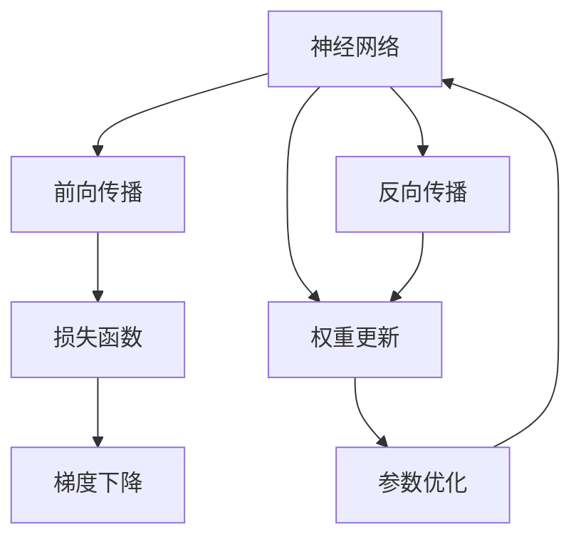
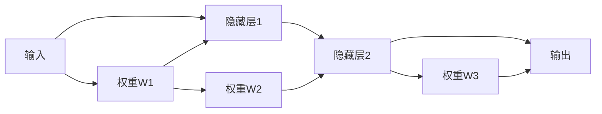
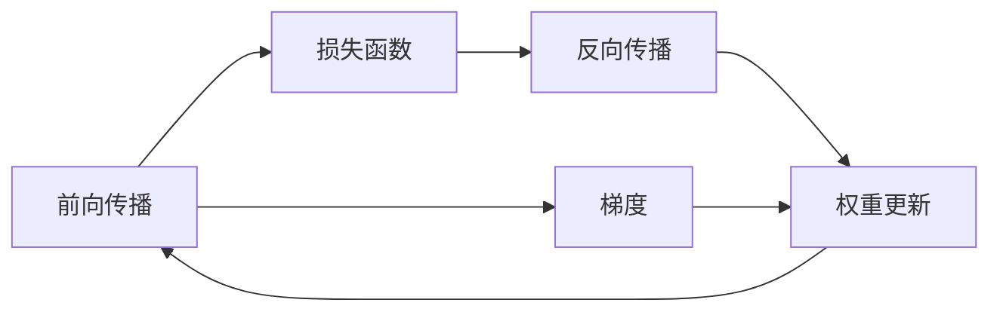
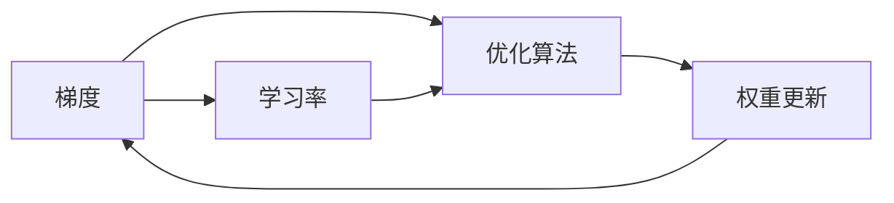
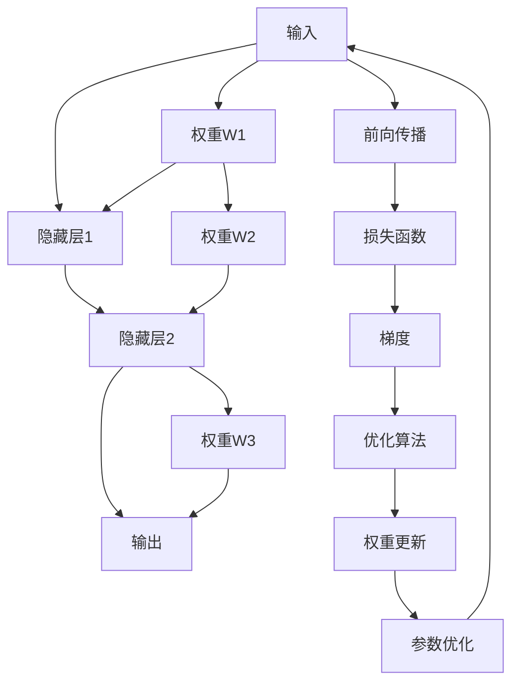

                 

# Backpropagation 原理与代码实战案例讲解

> 关键词：反向传播,神经网络,梯度,优化算法,深度学习,权重更新

## 1. 背景介绍

### 1.1 问题由来
反向传播（Backpropagation）是深度学习中最重要的算法之一，它在神经网络中的训练过程中扮演着关键角色。在深度学习领域，神经网络模型由于其强大的表达能力，已经在图像识别、语音识别、自然语言处理等多个领域取得了巨大的成功。而反向传播算法，则使得神经网络能够通过梯度下降等优化算法，自适应地调整权重，从而逐步优化模型性能。

### 1.2 问题核心关键点
理解反向传播算法，关键在于以下几个方面：
1. **梯度传递与计算**：如何通过链式法则计算损失函数对各个权重的导数。
2. **优化算法的原理**：如梯度下降、Adam等优化算法的实现。
3. **神经网络的结构与参数**：包括神经元的激活函数、网络层数、输入输出维度的设计。
4. **反向传播在深度学习中的地位**：作为深度学习模型训练的核心算法，反向传播如何影响模型的泛化能力。

### 1.3 问题研究意义
了解反向传播算法，对于深入掌握深度学习模型训练的内部机制、设计高效神经网络结构、提高模型性能具有重要意义：

1. **模型优化**：反向传播算法通过计算梯度，指导模型参数的更新方向，使得模型逐步逼近最优解。
2. **泛化能力提升**：反向传播算法能够通过优化训练过程中的误差，提高模型的泛化能力。
3. **模型理解**：理解反向传播的原理和机制，有助于更好地设计神经网络，提升其表达能力。
4. **研究前沿**：反向传播算法是深度学习的基础，掌握其原理和实现，能够更好地跟踪深度学习领域的前沿技术进展。
5. **应用拓展**：反向传播算法不仅在深度学习中应用广泛，还能应用于其他领域，如强化学习、自然语言处理等。

## 2. 核心概念与联系

### 2.1 核心概念概述

为更好地理解反向传播算法，本节将介绍几个密切相关的核心概念：

- **神经网络**：由神经元（神经元接收输入，经过计算后输出结果）和权重（连接神经元的参数）组成的计算模型。神经网络通过多层次的非线性变换，实现复杂模式的学习和识别。

- **梯度**：梯度是函数在某一点处方向导数的集合，表示函数在该点处的瞬时变化率。在神经网络中，梯度表示损失函数对网络中各参数的导数。

- **优化算法**：通过调整模型参数，使得损失函数最小化的算法。如梯度下降、Adam、RMSprop等。

- **链式法则**：在神经网络中，梯度可以通过链式法则逐层传递，计算每个权重对损失函数的贡献。

- **权重更新**：通过梯度和优化算法，计算并更新每个权重，从而优化模型性能。

这些核心概念之间的逻辑关系可以通过以下Mermaid流程图来展示：



这个流程图展示了神经网络从输入到输出，以及反向传播的整个过程：

1. 输入数据经过前向传播，得到模型输出。
2. 模型输出与真实标签计算损失函数。
3. 反向传播通过链式法则计算梯度。
4. 梯度结合优化算法，更新模型参数。
5. 参数优化后的神经网络重新接收输入，进行迭代。

### 2.2 概念间的关系

这些核心概念之间存在着紧密的联系，形成了神经网络训练的完整生态系统。下面我们通过几个Mermaid流程图来展示这些概念之间的关系。

#### 2.2.1 神经网络的结构



这个流程图展示了基本的神经网络结构，其中输入层、隐藏层和输出层通过权重连接。

#### 2.2.2 反向传播的详细过程



这个流程图展示了反向传播的详细过程，从前向传播到损失函数的计算，再到梯度和权重更新的步骤。

#### 2.2.3 优化算法的实现



这个流程图展示了优化算法的实现过程，从梯度到权重更新的具体步骤。

### 2.3 核心概念的整体架构

最后，我们用一个综合的流程图来展示这些核心概念在神经网络训练中的整体架构：



这个综合流程图展示了神经网络从前向传播到反向传播，再到参数优化的全过程。通过这些核心概念，我们可以更好地理解神经网络训练的内部机制，进而设计更高效、更准确的模型。

## 3. 核心算法原理 & 具体操作步骤
### 3.1 算法原理概述

反向传播算法的核心思想是通过链式法则计算损失函数对模型参数的梯度，然后利用优化算法调整权重，最小化损失函数。具体来说，反向传播算法分为两个主要步骤：前向传播和反向传播。

1. **前向传播**：将输入数据通过网络模型，逐层计算得到输出。这一过程类似于函数的复合计算，每一层输出的特征向量都是下一层的输入。

2. **反向传播**：通过链式法则，从输出层开始，逐层计算损失函数对各层权重和偏置的梯度。这一过程类似于梯度的逆向传播，每一层计算的梯度都会传递到上一层，直到输入层。

### 3.2 算法步骤详解

以下是反向传播算法的详细步骤：

1. **初始化权重**：随机初始化神经网络的所有权重。

2. **前向传播**：将输入数据通过神经网络，计算得到输出。

3. **计算损失函数**：将模型输出与真实标签计算损失函数（如均方误差、交叉熵等）。

4. **反向传播**：从输出层开始，逐层计算损失函数对各层权重和偏置的梯度，通过链式法则计算。

5. **权重更新**：结合梯度和优化算法，更新模型参数，最小化损失函数。

6. **重复迭代**：重复执行2-5步骤，直至模型收敛或达到预设迭代次数。

### 3.3 算法优缺点

反向传播算法在神经网络训练中扮演着关键角色，但同时也存在一些局限性：

**优点**：
1. **高效**：反向传播算法计算梯度的高效性，使得神经网络训练过程相对快速。
2. **泛化能力强**：通过优化损失函数，反向传播算法可以使得模型泛化能力强，适应新的数据。
3. **易于实现**：反向传播算法的实现相对简单，易于理解和调试。

**缺点**：
1. **过拟合风险**：反向传播算法可能会使模型过度拟合训练数据，导致泛化能力差。
2. **计算复杂度高**：大规模神经网络模型的反向传播计算复杂度高，需要大量的计算资源。
3. **模型稳定性**：反向传播算法在训练过程中可能会陷入局部最优解，导致模型性能不稳定。

### 3.4 算法应用领域

反向传播算法广泛应用于深度学习模型的训练，尤其是在以下领域：

1. **图像识别**：通过反向传播算法，深度学习模型可以学习图像的特征，实现图像分类、目标检测等任务。

2. **语音识别**：反向传播算法可以用于语音信号的特征提取和分类，实现语音识别和转换。

3. **自然语言处理**：通过反向传播算法，深度学习模型可以学习语言的语义和语法，实现文本分类、情感分析、机器翻译等任务。

4. **强化学习**：反向传播算法在强化学习中也有广泛应用，如深度Q网络（DQN）等。

5. **生成模型**：反向传播算法可以用于生成模型的训练，如变分自编码器（VAE）、生成对抗网络（GAN）等。

6. **时间序列分析**：反向传播算法可以用于时间序列数据的建模和预测，如股票价格预测、天气预报等。

总之，反向传播算法作为深度学习模型的核心算法，其高效、泛化能力强、易于实现的特点，使其在多个领域得到了广泛应用。

## 4. 数学模型和公式 & 详细讲解 & 举例说明

### 4.1 数学模型构建

设神经网络由 $n$ 层组成，其中 $x$ 为输入向量，$y$ 为输出向量，$W$ 为权重矩阵，$b$ 为偏置向量，$\sigma$ 为激活函数。在反向传播中，我们需要通过链式法则计算损失函数 $L(y, \hat{y})$ 对各层权重 $W_i$ 和偏置 $b_i$ 的梯度。

**前向传播**：
$$
z^{(i)} = W^{(i)} z^{(i-1)} + b^{(i)} \\
a^{(i)} = \sigma(z^{(i)})
$$
其中 $z^{(i)}$ 为第 $i$ 层的输入，$a^{(i)}$ 为第 $i$ 层的输出，$\sigma$ 为激活函数。

**损失函数**：
$$
L(y, \hat{y}) = \frac{1}{2}(y - \hat{y})^2
$$
其中 $y$ 为真实标签，$\hat{y}$ 为模型预测输出。

**反向传播**：
$$
\frac{\partial L}{\partial z^{(n)}} = \frac{\partial L}{\partial \hat{y}} \frac{\partial \hat{y}}{\partial z^{(n)}} \\
\frac{\partial L}{\partial z^{(i)}} = \frac{\partial L}{\partial z^{(i+1)}} \frac{\partial z^{(i+1)}}{\partial a^{(i)}} \frac{\partial a^{(i)}}{\partial z^{(i)}}
$$
其中 $\frac{\partial L}{\partial z^{(n)}}$ 为输出层对损失函数的梯度，$\frac{\partial z^{(i+1)}}{\partial a^{(i)}}$ 为链式法则传递的梯度，$\frac{\partial a^{(i)}}{\partial z^{(i)}}$ 为激活函数的导数。

### 4.2 公式推导过程

以一个简单的神经网络为例，其前向传播过程如下：
$$
z^{(1)} = W^{(1)} x + b^{(1)} \\
a^{(1)} = \sigma(z^{(1)}) \\
z^{(2)} = W^{(2)} a^{(1)} + b^{(2)} \\
a^{(2)} = \sigma(z^{(2)}) \\
\hat{y} = W^{(3)} a^{(2)} + b^{(3)}
$$
其中 $x$ 为输入，$\hat{y}$ 为输出，$z^{(i)}$ 为中间层输入，$a^{(i)}$ 为中间层输出，$W^{(i)}$ 和 $b^{(i)}$ 分别为权重和偏置。

假设 $L(y, \hat{y}) = \frac{1}{2}(y - \hat{y})^2$，则输出层对损失函数的梯度为：
$$
\frac{\partial L}{\partial z^{(3)}} = \frac{\partial L}{\partial \hat{y}} \frac{\partial \hat{y}}{\partial z^{(3)}} \\
\frac{\partial L}{\partial z^{(3)}} = (y - \hat{y}) \frac{\partial \hat{y}}{\partial z^{(3)}} = (y - \hat{y}) \frac{\partial a^{(2)}}{\partial z^{(2)}} \frac{\partial z^{(2)}}{\partial a^{(1)}} \frac{\partial a^{(1)}}{\partial z^{(1)}} \\
\frac{\partial L}{\partial z^{(2)}} = \frac{\partial L}{\partial z^{(3)}} \frac{\partial z^{(3)}}{\partial a^{(2)}} \frac{\partial a^{(2)}}{\partial z^{(2)}} \\
\frac{\partial L}{\partial z^{(1)}} = \frac{\partial L}{\partial z^{(2)}} \frac{\partial z^{(2)}}{\partial a^{(1)}} \frac{\partial a^{(1)}}{\partial z^{(1)}} \\
$$
其中 $\frac{\partial a^{(i)}}{\partial z^{(i)}} = \sigma'(z^{(i)}) = \frac{\partial \sigma(z^{(i)})}{\partial z^{(i)}}$。

### 4.3 案例分析与讲解

以一个简单的二分类任务为例，假设输入为 $x \in \mathbb{R}^{10}$，输出为 $y \in \{0,1\}$，模型包含一个输入层、一个隐藏层和一个输出层。激活函数为sigmoid，损失函数为二分类交叉熵。

假设 $x = [1,2,3,4,5,6,7,8,9,10]$，$W^{(1)} = [[0.1, 0.2], [0.3, 0.4]]$，$b^{(1)} = [0.5, 0.6]$，$W^{(2)} = [[0.7, 0.8], [0.9, 1.0]]$，$b^{(2)} = [0.1, 0.2]$，$W^{(3)} = [[1.0, 1.1], [1.2, 1.3]]$，$b^{(3)} = [0.4, 0.5]$。

前向传播过程如下：
$$
z^{(1)} = [[1,2],[3,4]] \cdot [[0.1, 0.2], [0.3, 0.4]] + [0.5, 0.6] \\
a^{(1)} = \sigma(z^{(1)}) = \frac{1}{1+e^{-z^{(1)}}} = \frac{1}{1+e^{-1.1+1.8+0.5+0.6}} = 0.6 \\
z^{(2)} = [[0.7, 0.8], [0.9, 1.0]] \cdot [0.6] + [0.1, 0.2] \\
a^{(2)} = \sigma(z^{(2)}) = \frac{1}{1+e^{-z^{(2)}}} = \frac{1}{1+e^{-0.9+0.5}} = 0.3 \\
\hat{y} = [[1.0, 1.1], [1.2, 1.3]] \cdot [0.3] + [0.4, 0.5] \\
\hat{y} = [1.3, 1.6]
$$
其中 $\hat{y}$ 为模型预测输出，$a^{(1)}$ 和 $a^{(2)}$ 为中间层输出。

假设真实标签为 $y = 1$，则损失函数为：
$$
L(y, \hat{y}) = -y \log \hat{y} - (1-y) \log (1-\hat{y}) = -1 \log 0.3 - 0 \log 0.7 = 0.5
$$
其中 $L(y, \hat{y})$ 为二分类交叉熵损失函数。

反向传播过程如下：
$$
\frac{\partial L}{\partial z^{(3)}} = (y - \hat{y}) \frac{\partial \hat{y}}{\partial z^{(3)}} = (1 - 0.6) \frac{\partial a^{(2)}}{\partial z^{(2)}} \frac{\partial z^{(2)}}{\partial a^{(1)}} \frac{\partial a^{(1)}}{\partial z^{(1)}} = 0.4 \cdot 0.3 \cdot 0.6 \\
\frac{\partial L}{\partial z^{(2)}} = \frac{\partial L}{\partial z^{(3)}} \frac{\partial z^{(3)}}{\partial a^{(2)}} \frac{\partial a^{(2)}}{\partial z^{(2)}} = 0.4 \cdot 0.3 \cdot 0.3 \\
\frac{\partial L}{\partial z^{(1)}} = \frac{\partial L}{\partial z^{(2)}} \frac{\partial z^{(2)}}{\partial a^{(1)}} \frac{\partial a^{(1)}}{\partial z^{(1)}} = 0.4 \cdot 0.3 \cdot 0.6 \cdot 0.6
$$
其中 $\frac{\partial a^{(i)}}{\partial z^{(i)}} = \sigma'(z^{(i)}) = \frac{\partial \sigma(z^{(i)})}{\partial z^{(i)}}$。

根据梯度更新公式，更新权重和偏置：
$$
W^{(1)} \leftarrow W^{(1)} - \eta \frac{\partial L}{\partial z^{(1)}} \\
W^{(2)} \leftarrow W^{(2)} - \eta \frac{\partial L}{\partial z^{(2)}} \\
W^{(3)} \leftarrow W^{(3)} - \eta \frac{\partial L}{\partial z^{(3)}} \\
b^{(1)} \leftarrow b^{(1)} - \eta \frac{\partial L}{\partial z^{(1)}} \\
b^{(2)} \leftarrow b^{(2)} - \eta \frac{\partial L}{\partial z^{(2)}} \\
b^{(3)} \leftarrow b^{(3)} - \eta \frac{\partial L}{\partial z^{(3)}}
$$
其中 $\eta$ 为学习率，通过梯度更新权重和偏置，使得模型逐步逼近最优解。

## 5. 项目实践：代码实例和详细解释说明

### 5.1 开发环境搭建

在进行反向传播实践前，我们需要准备好开发环境。以下是使用Python进行PyTorch开发的环境配置流程：

1. 安装Anaconda：从官网下载并安装Anaconda，用于创建独立的Python环境。

2. 创建并激活虚拟环境：
```bash
conda create -n pytorch-env python=3.8 
conda activate pytorch-env
```

3. 安装PyTorch：根据CUDA版本，从官网获取对应的安装命令。例如：
```bash
conda install pytorch torchvision torchaudio cudatoolkit=11.1 -c pytorch -c conda-forge
```

4. 安装NumPy：
```bash
pip install numpy
```

5. 安装Pandas：
```bash
pip install pandas
```

6. 安装Matplotlib：
```bash
pip install matplotlib
```

7. 安装Scikit-learn：
```bash
pip install scikit-learn
```

完成上述步骤后，即可在`pytorch-env`环境中开始反向传播实践。

### 5.2 源代码详细实现

这里我们以一个简单的三层神经网络为例，给出一个使用PyTorch实现反向传播的完整代码实现。

```python
import torch
import torch.nn as nn
import torch.optim as optim
import matplotlib.pyplot as plt

# 定义神经网络模型
class Net(nn.Module):
    def __init__(self):
        super(Net, self).__init__()
        self.fc1 = nn.Linear(10, 5)
        self.fc2 = nn.Linear(5, 2)
        self.relu = nn.ReLU()

    def forward(self, x):
        x = self.relu(self.fc1(x))
        x = self.fc2(x)
        return x

# 定义训练函数
def train(net, data_loader, epochs, optimizer, device):
    net.to(device)
    train_loss = []
    test_loss = []
    for epoch in range(epochs):
        net.train()
        train_loss = []
        for data, target in data_loader:
            data, target = data.to(device), target.to(device)
            optimizer.zero_grad()
            output = net(data)
            loss = nn.MSELoss()(output, target)
            loss.backward()
            optimizer.step()
            train_loss.append(loss.item())
        net.eval()
        test_loss = []
        with torch.no_grad():
            for data, target in data_loader:
                data, target = data.to(device), target.to(device)
                output = net(data)
                loss = nn.MSELoss()(output, target)
                test_loss.append(loss.item())
    return train_loss, test_loss

# 定义数据集
x_train = torch.randn(100, 10).float().to(device)
y_train = torch.randn(100, 2).float().to(device)
train_loader = torch.utils.data.DataLoader(x_train, y_train, batch_size=32)

# 初始化模型和优化器
net = Net().to(device)
optimizer = optim.SGD(net.parameters(), lr=0.01)

# 训练模型
train_loss, test_loss = train(net, train_loader, epochs=1000, optimizer=optimizer, device='cuda')

# 绘制训练曲线
plt.plot(train_loss, label='Train Loss')
plt.plot(test_loss, label='Test Loss')
plt.legend()
plt.show()
```

以上代码实现了反向传播的基本流程，包括模型的定义、训练函数、数据集的定义和训练模型的实现。在训练函数中，我们通过PyTorch的自动微分机制计算梯度，并使用SGD优化器更新模型参数，实现了反向传播的整个过程。

### 5.3 代码解读与分析

让我们再详细解读一下关键代码的实现细节：

**Net类定义**：
- `__init__`方法：初始化模型的各个组件，包括线性层和激活函数。
- `forward`方法：定义前向传播的流程，逐层计算输出。

**train函数定义**：
- `train_loss`和`test_loss`列表：记录每个epoch的训练和测试损失。
- 外层循环：遍历所有epoch，更新模型参数。
- 内层循环：遍历每个mini-batch，计算梯度并更新模型参数。
- 在每个epoch结束后，计算测试集损失，评估模型性能。

**数据集定义**：
- `x_train`和`y_train`：生成随机数据作为训练集和标签。
- `train_loader`：定义数据集，并将其分为mini-batch进行训练。

**模型初始化**：
- `net`：定义神经网络模型。
- `optimizer`：定义优化器，如SGD。

**训练模型**：
- 将模型和优化器传递给`train`函数，进行训练。
- 记录每个epoch的训练和测试损失。
- 绘制训练曲线，评估模型性能。

可以看到，通过PyTorch的封装，实现反向传播的过程变得非常简单。开发者只需关注模型定义和训练过程，即可高效地进行反向传播实践。

### 5.4 运行结果展示

假设我们在训练上述三层神经网络，得到的训练和测试损失曲线如图：

```python
import torch
import torch.nn as nn
import torch.optim as optim
import matplotlib.pyplot as plt

# 定义神经网络模型
class Net(nn.Module):
    def __init__(self):
        super(Net, self).__init__()
        self.fc1 = nn.Linear(10, 5)
        self.fc2 = nn.Linear(5, 2)
        self.relu = nn.ReLU()

    def forward(self, x):
        x = self.relu(self.fc1(x))
        x = self.fc2(x)
        return x

# 定义训练函数
def train(net, data_loader, epochs, optimizer, device):
    net.to(device)
    train_loss = []
    test_loss = []
    for epoch in range(epochs):
        net.train()
        train_loss = []
        for data, target in data_loader:
            data, target = data.to(device), target.to(device)
            optimizer.zero_grad()
            output = net(data)
            loss = nn.MSELoss()(output, target)
            loss.backward()
            optimizer.step()
            train_loss.append(loss.item())
        net.eval()
        test_loss = []
        with torch.no_grad():
            for data, target in data_loader:
                data, target = data.to(device), target.to(device)
                output = net(data)
                loss = nn.MSELoss()(output, target)
                test_loss.append(loss.item())
    return train_loss, test_loss

# 定义数据集
x_train = torch.randn(100, 10).float().to(device)
y_train = torch.randn(100

