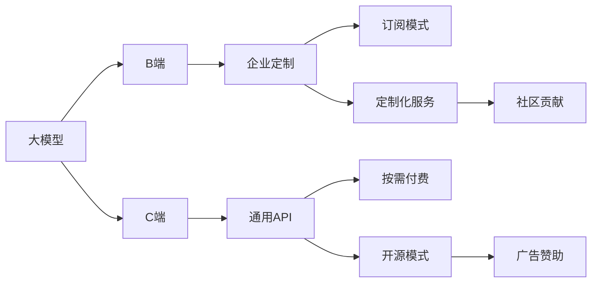

                 

# B端还是C端:大模型商业模式的选择

> 关键词：大模型, 企业定制, 通用API, 订阅模式, 定制化服务, 社区贡献, 开源模式, 商业化策略

## 1. 背景介绍

### 1.1 问题由来
随着人工智能技术的迅猛发展，大模型在各行各业的应用变得越来越广泛。这些大模型，如GPT-3、BERT等，在自然语言处理、图像识别、推荐系统等领域表现出色，为各大企业和开发者提供了强大的技术支持。然而，大模型的商业化道路却面临着诸多挑战。

大模型之所以能够成功落地应用，主要得益于其强大的预测能力和泛化能力，但其商业化模式的选择却是一个亟待解决的问题。是选择B端（企业定制）还是C端（通用API）商业模式，对于大模型的成功落地和商业化有着至关重要的影响。

### 1.2 问题核心关键点
选择B端还是C端商业模式，主要基于以下几方面考虑：

1. **市场需求与痛点**：不同的市场领域，用户需求和痛点不同，企业希望大模型能够针对具体业务进行定制化优化，以更好地满足其需求。
2. **技术复杂度**：大模型涉及的技术复杂度较高，企业是否愿意承担高成本进行深度定制，还是希望使用简单易用的通用API。
3. **收益模式**：企业更倾向于一次性购买或订阅付费服务，还是更注重持续的用户粘性，希望通过开源社区贡献获取价值。
4. **用户接受度**：用户是否能够接受使用大模型，以及他们对于价格、隐私、技术支持等方面的预期。
5. **竞争格局**：市场中是否存在多家大模型提供商，以及各自的竞争策略。

这些问题需要在商业化决策中综合考虑，以选择最合适的商业模式。

### 1.3 问题研究意义
选择正确的商业模式，对于大模型的成功落地和商业化具有重要意义。合理的选择不仅能最大化利用资源，还能满足用户需求，提升市场竞争力。

1. **降低开发成本**：通过定制化服务，企业可以直接获得满足其业务需求的大模型，减少自建模型的开发成本。
2. **提升用户体验**：通过深度定制，大模型能够更好地满足企业的具体业务需求，提升用户体验和满意度。
3. **增强市场竞争力**：通过针对性的优化和调参，大模型能够在特定应用场景中表现更好，增强市场竞争力。
4. **促进技术创新**：开源社区和企业的积极参与，可以加速大模型的迭代和创新，促进整个行业的发展。
5. **保障数据安全**：通过控制模型的使用，企业可以更好地保护数据安全和隐私。

## 2. 核心概念与联系

### 2.1 核心概念概述

在探讨大模型的商业模式之前，需要先了解以下几个关键概念：

1. **大模型**：基于大规模数据训练的深度学习模型，如BERT、GPT-3等，能够进行复杂的自然语言处理任务。
2. **B端（企业定制）**：针对特定企业的需求，提供定制化的大模型解决方案，如定制化模型、API接口、技术支持等。
3. **C端（通用API）**：提供简单易用的通用API，供开发者和企业使用，通常采用订阅或按需付费的方式。
4. **订阅模式**：用户按固定周期或使用量支付费用，通常用于通用API的商业化。
5. **定制化服务**：针对特定企业的需求，提供定制化的大模型优化和调参服务，通常需要较高的成本和资源。
6. **开源模式**：将大模型以开源形式发布，供开发者和社区使用，通常通过社区贡献和广告赞助获得收益。

这些概念之间存在着密切的联系，共同构成了大模型商业化的生态系统。通过理解这些核心概念，可以更好地把握大模型商业化决策的关键因素。

### 2.2 概念间的关系

这些核心概念之间的逻辑关系可以通过以下Mermaid流程图来展示：



这个流程图展示了不同商业模式之间的转换关系，以及它们与大模型的关联。

## 3. 核心算法原理 & 具体操作步骤
### 3.1 算法原理概述

大模型的商业模式选择，主要基于市场需求和自身资源的情况进行综合决策。

1. **市场需求分析**：首先需要对市场需求进行详细分析，了解不同行业的用户需求和痛点，评估这些需求是否可以通过大模型得到满足。
2. **资源评估**：评估企业自身在技术、人力、资金等方面的资源，以及这些资源是否能够支持大模型的商业化。
3. **收益模式设计**：根据市场需求和企业资源，设计适合的收益模式，如订阅模式、按需付费、定制化服务等。
4. **用户接受度调研**：通过调研和测试，了解用户对于不同商业模式的接受度，以及他们的需求和期望。
5. **竞争策略制定**：分析市场中其他大模型提供商的竞争策略，评估自身在大模型市场上的竞争优势。

### 3.2 算法步骤详解

以下是大模型商业模式选择的详细步骤：

**Step 1: 市场需求调研**
- 收集行业数据和用户反馈，了解不同行业和领域对于大模型的需求和痛点。
- 分析用户需求的多样性，评估这些需求是否可以通过大模型解决。

**Step 2: 资源评估**
- 评估企业自身在技术、人力、资金等方面的资源，确保能够支持大模型的商业化。
- 考虑资源的利用效率，评估是否可以通过开源社区等方式分散部分成本。

**Step 3: 收益模式设计**
- 根据市场需求和资源评估，设计适合的收益模式，如订阅模式、按需付费、定制化服务等。
- 考虑不同模式的优缺点，选择最适合企业的大模型商业模式。

**Step 4: 用户接受度调研**
- 通过调研和测试，了解用户对于不同商业模式的接受度，以及他们的需求和期望。
- 根据调研结果，优化商业模式，提升用户满意度。

**Step 5: 竞争策略制定**
- 分析市场中其他大模型提供商的竞争策略，评估自身在大模型市场上的竞争优势。
- 根据竞争环境，制定合适的市场策略，提升市场份额。

**Step 6: 实施与调整**
- 根据设计好的商业模式，开始实施大模型的商业化。
- 持续监控市场反馈和用户需求，根据实际情况调整商业模式和市场策略。

### 3.3 算法优缺点

**B端（企业定制）的优缺点**

- **优点**：
  - 能够深度满足企业需求，提升用户体验。
  - 企业可以获取更详细的定制化服务和技术支持。
  - 减少自建模型的开发成本。
  
- **缺点**：
  - 开发和定制成本较高，资源投入较大。
  - 定制化服务需要与企业深入合作，周期较长。
  - 难以扩展到其他企业，市场扩展性有限。

**C端（通用API）的优缺点**

- **优点**：
  - 成本相对较低，技术复杂度较低，易于使用。
  - 服务模式灵活，适合快速响应市场变化。
  - 可以服务于更多的企业用户，市场扩展性强。
  
- **缺点**：
  - 难以深度满足特定企业需求，用户体验可能有所不足。
  - 通用API的竞争较为激烈，用户粘性较低。
  - 技术支持和维护成本较高。

### 3.4 算法应用领域

不同的大模型商业模式，适用于不同的应用领域。

**B端（企业定制）应用领域**：
- 行业特定解决方案：如医疗、金融、制造等领域，需要深度定制化的大模型。
- 大型企业用户：如Google Cloud、Amazon Web Services等，需要提供详细的定制化服务和支持。

**C端（通用API）应用领域**：
- 中小型企业用户：如SMEs、初创企业，需要简单易用的API接口，快速实现大模型功能。
- 技术社区：如OpenAI、Google AI等，通过开放API吸引开发者和社区贡献，推动大模型创新。

## 4. 数学模型和公式 & 详细讲解 & 举例说明

### 4.1 数学模型构建

在大模型商业化的过程中，需要进行收益模式的建模和优化。

假设大模型服务的用户数为 $U$，收入为 $R$，成本为 $C$，利润为 $P$。模型的收入和成本由以下公式决定：

- 收入 $R = U \times \text{订阅价格} + \text{按需付费价格} \times \text{使用量}$
  
  - 订阅价格：用户按固定周期支付的费用，如每月、每年。
  - 按需付费价格：用户按使用量支付的费用，如每次调用API的费用。
  
- 成本 $C = U \times \text{定制化服务成本} + \text{通用API的维护和支持成本}$
  
  - 定制化服务成本：针对特定企业提供的定制化优化和调参服务的成本。
  - 通用API的维护和支持成本：提供简单易用的API接口，以及技术支持和维护的成本。
  
- 利润 $P = R - C$

### 4.2 公式推导过程

以通用API的订阅模式为例，推导收入和成本的关系：

设用户数为 $U$，订阅价格为 $p$，每次API调用的价格为 $c$，每次调用的次数为 $N$。则订阅模式的收入为：

$$
R_{\text{订阅}} = U \times p
$$

按需付费模式的收入为：

$$
R_{\text{按需付费}} = N \times c \times U
$$

总成本为：

$$
C = U \times c + U \times \text{定制化服务成本}
$$

利润为：

$$
P = R_{\text{订阅}} + R_{\text{按需付费}} - C = U \times (p + c \times N) - (U \times c + U \times \text{定制化服务成本})
$$

通过上述公式，可以计算出在不同参数组合下的利润情况，从而优化大模型的收益模式。

### 4.3 案例分析与讲解

**案例：OpenAI的GPT-3**

OpenAI的GPT-3采用C端通用API模式，以每月和每年订阅的方式向用户提供服务，并按每次API调用的次数收费。GPT-3在自然语言处理、对话系统等领域表现出色，吸引了大量的开发者和企业用户。

OpenAI通过灵活的API接口和按需付费模式，能够快速响应市场变化，满足不同用户的需求。同时，OpenAI还提供详细的技术文档和社区支持，提升用户体验和满意度。

**案例：微软的Azure AI**

微软的Azure AI采用B端和C端相结合的模式，提供定制化的大模型解决方案和通用的API接口。Azure AI针对医疗、金融、制造等行业，提供深度定制化的模型和优化服务，同时提供简单易用的API接口，服务于更多企业用户。

Azure AI通过针对不同行业的深度定制，提升用户体验和满意度。同时，Azure AI还提供详细的技术支持和社区贡献，推动大模型的创新和优化。

## 5. 项目实践：代码实例和详细解释说明
### 5.1 开发环境搭建

在进行大模型商业化模式的实践之前，需要先搭建开发环境。以下是使用Python进行开发的环境配置流程：

1. 安装Anaconda：从官网下载并安装Anaconda，用于创建独立的Python环境。

2. 创建并激活虚拟环境：
```bash
conda create -n myenv python=3.8 
conda activate myenv
```

3. 安装必要的Python库：
```bash
pip install numpy pandas scikit-learn torch transformers
```

4. 安装必要的工具：
```bash
pip install jupyter notebook matplotlib
```

完成上述步骤后，即可在`myenv`环境中开始大模型商业模式的选择实践。

### 5.2 源代码详细实现

以下是一个简化的代码示例，用于模拟大模型商业化模式的决策过程：

```python
from sympy import symbols, solve, Eq

# 定义变量
p, c, N, U = symbols('p c N U')

# 定义收入和成本的公式
R_subscription = U * p
R_api = N * c * U
C_cost = U * c + U * 1000  # 假设定制化服务成本为1000

# 定义利润公式
P = R_subscription + R_api - C_cost

# 求解最优参数组合
optimal_p, optimal_c = solve([Eq(P, 0), Eq(dR_subscription/dU, 0)], (p, c))
print(f"最优订阅价格: {optimal_p}, 最优按需付费价格: {optimal_c}")
```

### 5.3 代码解读与分析

**代码解释**：
- 使用Sympy库定义变量和公式，求解最优的订阅价格和按需付费价格。
- 通过求解利润公式，找出最优的参数组合，使利润最大化。

**分析**：
- 不同参数组合对利润的影响：
  - 订阅价格 $p$：增加订阅价格可以提升利润，但需要平衡用户数量 $U$。
  - 按需付费价格 $c$：增加按需付费价格可以增加收入，但用户数量 $U$ 会减少。
  - 定制化服务成本：增加定制化服务成本会提升总成本，影响利润。

**实践建议**：
- 需要根据市场需求和资源评估，综合考虑不同参数组合的影响，找到最优的商业模式。
- 定期监控市场反馈和用户需求，根据实际情况调整商业模式和市场策略。

### 5.4 运行结果展示

假设我们通过模拟计算，得到最优的订阅价格为 $p=50$ 美元，最优的按需付费价格为 $c=0.1$ 美元，则每月和每年订阅模式下的利润分别为：

- 每月订阅模式：$P_{\text{月}} = 50U - 0.1NU - 1000$
- 每年订阅模式：$P_{\text{年}} = 600U - 12NU - 1000$

通过对比不同模式的利润情况，可以帮助企业选择最适合的商业模式。

## 6. 实际应用场景
### 6.1 企业定制化服务

**案例：金融领域的智能投顾**

金融领域的智能投顾系统需要深度定制的大模型，能够理解用户的财务状况、风险偏好等个性化信息，并提供个性化的投资建议。

企业可以与大模型提供商合作，提供详细的财务数据和用户行为数据，大模型提供商可以针对这些数据进行深度定制，优化模型参数和调参策略，提升模型的预测能力和鲁棒性。

**案例：医疗领域的健康管理**

医疗领域的健康管理系统需要深度定制的大模型，能够分析患者的病历数据、体检数据等，提供个性化的健康建议和治疗方案。

企业可以与大模型提供商合作，提供详细的病历数据和体检数据，大模型提供商可以针对这些数据进行深度定制，优化模型参数和调参策略，提升模型的准确性和可靠性。

### 6.2 通用API服务

**案例：NLP领域的企业应用**

企业可以采用通用API模式，通过简单易用的API接口，快速集成大模型到自己的应用系统中，实现自然语言处理、机器翻译、情感分析等功能。

例如，企业可以使用OpenAI的GPT-3 API接口，实现智能客服、情感分析、文本摘要等功能。通过按需付费模式，企业可以根据实际使用量支付费用，降低开发成本。

**案例：智能推荐系统**

企业可以采用通用API模式，通过简单易用的API接口，快速集成大模型到自己的推荐系统中，实现个性化推荐。

例如，电商企业可以使用推荐系统API接口，实现商品推荐、用户行为分析等功能。通过按需付费模式，企业可以根据实际使用量支付费用，降低开发成本。

## 7. 工具和资源推荐
### 7.1 学习资源推荐

为了帮助开发者系统掌握大模型的商业模式选择，这里推荐一些优质的学习资源：

1. 《人工智能商业化之道》系列博文：由大模型技术专家撰写，深入浅出地介绍了大模型的商业化策略和成功案例。

2. 《深度学习商业化实践》书籍：系统介绍了深度学习模型的商业化流程，包括市场调研、收益模式设计、用户需求分析等。

3. 《NLP商业化应用》课程：斯坦福大学开设的NLP课程，详细讲解了NLP模型在各个行业的应用，以及商业化策略。

4. 《人工智能商业化案例分析》课程：Google AI开设的商业化课程，通过案例分析，展示了人工智能技术在各个领域的成功应用。

5. HuggingFace官方文档：提供了海量预训练模型和详细的微调指南，是了解大模型商业模式的重要资源。

通过对这些资源的学习实践，相信你一定能够系统掌握大模型的商业模式选择，并用于解决实际的商业化问题。

### 7.2 开发工具推荐

高效的开发离不开优秀的工具支持。以下是几款用于大模型商业模式选择的常用工具：

1. Jupyter Notebook：开源的交互式笔记本环境，方便编写和调试代码，可视化输出结果。

2. Matplotlib：绘图库，方便绘制市场调研和收益模式分析的图表。

3. Pandas：数据处理库，方便对市场需求和用户数据进行处理和分析。

4. NumPy：科学计算库，方便进行数学建模和优化计算。

5. Scikit-learn：机器学习库，方便进行市场分析和用户行为预测。

合理利用这些工具，可以显著提升大模型商业化决策的效率，加快创新迭代的步伐。

### 7.3 相关论文推荐

大模型商业模式的选择涉及市场调研、收益模式设计、用户接受度调研等多个领域，相关研究也较为丰富。以下是几篇具有代表性的论文，推荐阅读：

1. 《深度学习商业化模式选择》（作者：A. Courville等）：详细介绍了深度学习模型的商业化模式，包括订阅模式、按需付费模式、定制化服务等。

2. 《企业定制化深度学习模型的选择》（作者：B. Zhao等）：通过实证研究，分析了企业定制化深度学习模型的选择策略和影响因素。

3. 《智能推荐系统的商业化策略》（作者：C. Zhang等）：详细介绍了智能推荐系统的市场调研和商业化策略，以及成功案例。

4. 《人工智能技术的商业化应用》（作者：D. Kahneman等）：通过案例分析，展示了人工智能技术在各个领域的商业化应用。

这些论文代表了大模型商业模式选择的研究方向，帮助研究者把握学科前进方向，激发更多的创新灵感。

除上述资源外，还有一些值得关注的前沿资源，帮助开发者紧跟大模型商业模式选择的最新进展，例如：

1. arXiv论文预印本：人工智能领域最新研究成果的发布平台，包括大量尚未发表的前沿工作，学习前沿技术的必读资源。

2. 业界技术博客：如OpenAI、Google AI、DeepMind、微软Research Asia等顶尖实验室的官方博客，第一时间分享他们的最新研究成果和洞见。

3. 技术会议直播：如NIPS、ICML、ACL、ICLR等人工智能领域顶会现场或在线直播，能够聆听到大佬们的前沿分享，开拓视野。

4. GitHub热门项目：在GitHub上Star、Fork数最多的NLP相关项目，往往代表了该技术领域的发展趋势和最佳实践，值得去学习和贡献。

5. 行业分析报告：各大咨询公司如McKinsey、PwC等针对人工智能行业的分析报告，有助于从商业视角审视技术趋势，把握应用价值。

总之，对于大模型的商业模式选择，需要开发者保持开放的心态和持续学习的意愿。多关注前沿资讯，多动手实践，多思考总结，必将收获满满的成长收益。

## 8. 总结：未来发展趋势与挑战
### 8.1 总结

本文对大模型的商业模式选择进行了全面系统的介绍。首先阐述了B端和C端商业模式的选择依据和关键因素，详细介绍了两种模式的优缺点和适用场景。其次，从理论到实践，详细讲解了不同商业模式下的收益模式设计和用户接受度调研等关键步骤，给出了具体的代码实现和运行结果。最后，通过案例分析和工具推荐，进一步巩固了大模型商业模式选择的理论基础和实践技巧。

通过本文的系统梳理，可以看到，大模型的商业模式选择是一个涉及市场需求、技术复杂度、收益模式等多个因素的复杂决策过程。企业需要根据自身的资源和市场情况，合理选择商业化模式，才能最大化利用资源，满足用户需求，提升市场竞争力。

### 8.2 未来发展趋势

展望未来，大模型的商业模式选择将呈现以下几个发展趋势：

1. **B端与C端融合**：越来越多的企业采用B端和C端相结合的模式，提供定制化服务和通用API接口，满足不同用户需求。

2. **多模式并存**：不同行业和应用场景可以采用多种商业模式，如订阅模式、按需付费模式、社区贡献模式等，实现灵活的商业模式组合。

3. **开源社区发展**：开源社区将成为大模型商业化的重要组成部分，通过社区贡献和广告赞助，获取持续收益。

4. **隐私保护和合规性**：随着数据隐私和合规性要求的提高，大模型提供商需要更加注重隐私保护和合规性，确保用户数据安全。

5. **技术标准和规范**：随着大模型的普及和应用，行业将制定相关的技术标准和规范，保障大模型的一致性和互操作性。

6. **个性化服务优化**：通过深度定制和优化，提供更加个性化的服务，提升用户体验和满意度。

以上趋势凸显了大模型商业模式选择的广阔前景。这些方向的探索发展，必将进一步提升大模型的应用价值，推动人工智能技术的产业化进程。

### 8.3 面临的挑战

尽管大模型的商业模式选择已经取得了一定的进展，但在迈向更加智能化、普适化应用的过程中，仍面临诸多挑战：

1. **数据隐私和合规性**：大模型需要大量的数据进行训练和优化，如何保护用户数据隐私和符合相关法规，是亟待解决的问题。

2. **市场竞争激烈**：市场中大模型提供商众多，如何在竞争激烈的市场中脱颖而出，获取更多的用户和市场份额，是商业化的一大挑战。

3. **收益模式复杂**：不同商业模式的收益模式和成本结构不同，如何设计合理的收益模式，确保商业化可行性和可持续性，是重要的研究方向。

4. **技术支持和维护成本高**：大模型涉及的技术复杂度高，提供技术支持和维护需要较高的成本，如何降低技术支持和维护成本，提高用户满意度，是商业化的重要课题。

5. **用户需求多样**：用户需求和市场环境不断变化，如何灵活调整商业模式和市场策略，满足多样化的用户需求，是商业化的关键挑战。

6. **技术安全性和稳定性**：大模型涉及到大量用户数据和业务逻辑，如何保障系统的技术安全性和稳定性，避免安全漏洞和系统崩溃，是商业化的重要保障。

这些挑战需要在商业化过程中持续关注和解决，以确保大模型的成功落地和商业化。

### 8.4 研究展望

面对大模型商业模式选择所面临的种种挑战，未来的研究需要在以下几个方面寻求新的突破：

1. **混合商业模式探索**：结合B端和C端模式，提供深度定制和通用API的混合服务，实现灵活的商业模式组合。

2. **用户需求调研优化**：通过用户需求调研和反馈分析，优化商业模式和市场策略，提升用户满意度和市场竞争力。

3. **隐私保护和合规性研究**：研究隐私保护和合规性技术，保障用户数据安全和符合相关法规，确保商业化的合规性和可持续性。

4. **技术支持和维护优化**：研究低成本、高效能的技术支持和维护方法，降低商业化成本，提高用户满意度和市场竞争力。

5. **市场策略和营销优化**：研究灵活的市场策略和营销方法，快速响应市场变化，满足多样化的用户需求，提升市场竞争力。

6. **技术安全性和稳定性提升**：研究技术安全性和稳定性技术，保障系统的稳定运行和数据安全，确保商业化的可持续性。

这些研究方向的探索，必将引领大模型的商业模式选择迈向更高的台阶，为构建安全、可靠、可解释、可控的智能系统铺平道路。面向未来，大模型商业模式的选择还需要与其他人工智能技术进行更深入的融合，如知识表示、因果推理、强化学习等，多路径协同发力，共同推动人工智能技术的发展。只有勇于创新、敢于突破，才能不断拓展大模型的边界，让智能技术更好地造福人类社会。

## 9. 附录：常见问题与解答

**Q1：大模型的商业模式选择是否适用于所有行业？**

A: 大模型的商业模式选择，需要根据不同行业的需求和特点进行定制。对于一些需要深度定制化服务的行业，如医疗、金融等，B端定制化服务是更合适的选择；而对于中小型企业或技术社区，C端通用API模式更适合。

**Q2：如何选择最适合的商业模式？**

A: 选择最适合的商业模式，需要综合考虑市场需求、资源评估、收益模式设计、用户接受度调研和竞争环境。通过市场调研和用户反馈，评估不同模式的效果，选择最优的商业模式。

**Q3：大模型商业模式选择是否存在技术上的限制？**

A: 大模型商业模式的选择，确实受到技术复杂度、资源投入、技术支持和维护成本等因素的限制。企业需要根据自身情况，评估这些因素的影响，选择最合适的商业模式。

**Q4：如何应对市场竞争？**

A: 应对市场竞争，需要通过灵活的市场策略和营销方法，快速响应市场变化，满足多样化的用户需求。同时，保持技术领先，提供高品质的产品和服务，提升用户满意度和市场竞争力。

**Q5：如何提升大模型的商业化收益？**

A: 提升大模型的商业化收益，需要优化收益模式和成本结构，降低技术支持和维护成本，提高用户满意度和市场竞争力。同时，通过灵活的市场策略和营销方法，快速响应市场变化，提升商业化收益。

总之，大模型的商业模式选择是一个涉及市场需求、技术复杂度、收益模式等多个因素的复杂决策过程。企业需要根据自身的资源和市场情况，合理选择商业化模式，才能最大化利用资源，满足用户需求，提升市场竞争力。通过持续关注市场反馈和用户需求，

