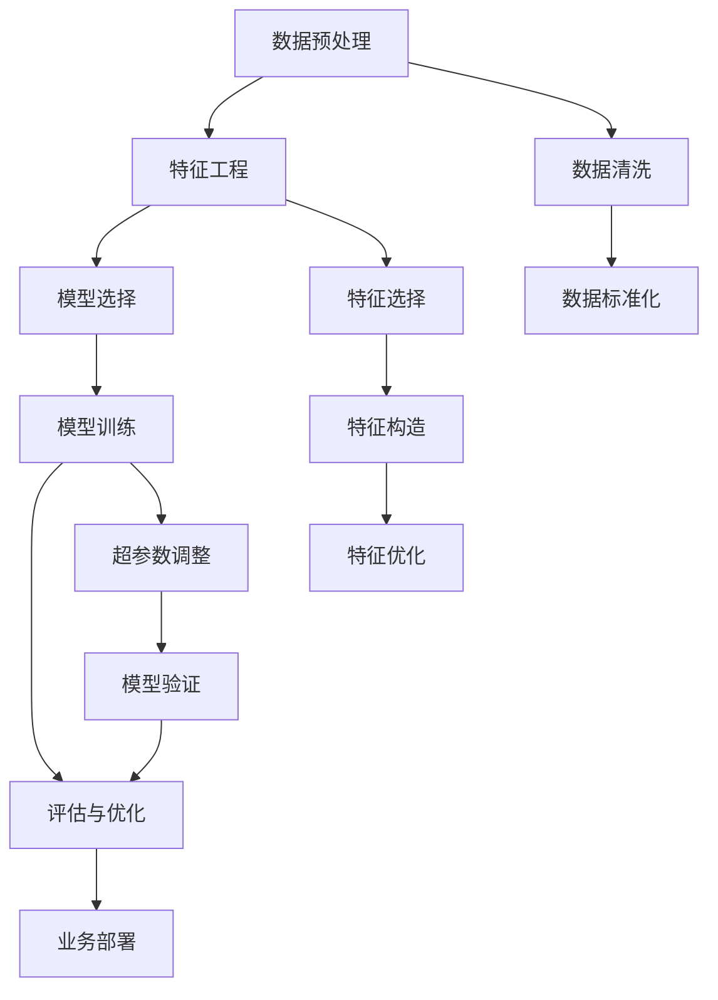

                 

# Data Science 原理与代码实战案例讲解

## 1. 背景介绍

### 1.1 问题由来
数据科学（Data Science）已经成为21世纪最热门的领域之一。随着大数据技术的发展，数据规模急剧增长，企业对于数据的挖掘和利用越来越依赖于高级的数据分析技术。然而，许多专业人士对于数据科学仍感到陌生，不知道如何从海量数据中挖掘出有价值的信息，更不知道如何将这些信息转化为可操作的决策。

### 1.2 问题核心关键点
数据科学的核心是利用统计学、机器学习、数据挖掘等技术，从数据中提取有价值的知识和信息，并结合业务场景做出科学的决策。数据科学的应用广泛，包括但不限于金融、医疗、零售、物流等领域。

### 1.3 问题研究意义
数据科学对于提升企业的决策水平、优化运营效率、降低风险等方面具有重要的现实意义。通过学习数据科学原理，掌握数据分析工具，能够帮助专业人士更好地应对数据挑战，提升企业竞争力。

## 2. 核心概念与联系

### 2.1 核心概念概述

数据科学涉及多个核心概念，它们之间紧密联系，形成一个完整的系统。

- **数据预处理**：清洗、处理数据，使其适用于后续的分析和建模。
- **特征工程**：选择、构造、优化特征，提升模型性能。
- **模型选择与训练**：根据数据特征选择合适的模型，并通过训练获取最优参数。
- **评估与优化**：使用验证集评估模型性能，根据评估结果进行模型优化。
- **业务部署**：将模型应用到实际业务中，提供决策支持。

这些核心概念构成了数据科学的基本流程，贯穿数据科学项目的始终。

### 2.2 概念间的关系

以下是数据科学核心概念之间的联系，可以通过Mermaid流程图来展示：



这个流程图展示了数据科学的核心流程，包括数据预处理、特征工程、模型选择与训练、评估与优化、业务部署等环节。通过这些环节的紧密联系和相互作用，最终形成完整的解决方案。

## 3. 核心算法原理 & 具体操作步骤

### 3.1 算法原理概述

数据科学的算法原理主要包括统计学、机器学习、数据挖掘等领域的核心技术。数据科学的核心目标是利用这些技术，从数据中提取有价值的知识和信息，以辅助决策。

- **统计学**：通过统计学方法，描述和分析数据的基本特征，如均值、方差、标准差等。
- **机器学习**：通过构建模型，学习数据的规律，并进行预测和分类。
- **数据挖掘**：通过算法挖掘数据中的隐含关系，如关联规则、聚类等。

### 3.2 算法步骤详解

数据科学的算法步骤主要包括以下几个环节：

1. **数据收集与清洗**：收集原始数据，并进行预处理，去除噪音和错误。
2. **特征选择与构造**：根据业务需求和数据特征，选择或构造最优的特征。
3. **模型选择与训练**：选择最适合的算法和模型，并通过训练得到最优参数。
4. **模型评估与优化**：使用验证集评估模型性能，根据评估结果进行模型优化。
5. **业务部署与使用**：将模型应用到实际业务中，提供决策支持。

每个环节都需要仔细设计，才能确保最终模型的效果和可靠性。

### 3.3 算法优缺点

数据科学的算法优点在于其能够自动化、客观地处理大量数据，发现数据中的规律和模式。然而，数据科学也存在一些缺点：

- **数据依赖**：数据科学的模型依赖于数据的分布和特征，数据偏差可能导致模型偏差。
- **模型复杂性**：复杂的模型需要更多的数据和计算资源，且难以解释。
- **业务理解不足**：数据科学模型缺乏人类专家的业务理解，可能导致错误的决策。

### 3.4 算法应用领域

数据科学在多个领域都有广泛应用，如金融风险管理、医疗诊断、推荐系统、客户分析等。通过数据科学，企业能够更准确地理解业务场景，优化决策过程，提升运营效率。

## 4. 数学模型和公式 & 详细讲解 & 举例说明

### 4.1 数学模型构建

数据科学的数学模型主要包括回归模型、分类模型、聚类模型等。这里以线性回归模型为例，介绍数据科学的数学模型构建过程。

### 4.2 公式推导过程

线性回归模型的目标是找到一个线性函数 $y = w_0 + w_1 x_1 + w_2 x_2 + \cdots + w_n x_n$，最小化实际值和预测值之间的误差。假设实际值 $y$ 和预测值 $\hat{y}$ 之间的误差服从正态分布，则最小化误差的目标函数为：

$$
\min_{w_0, w_1, \cdots, w_n} \frac{1}{2m} \sum_{i=1}^m (y_i - \hat{y}_i)^2
$$

其中 $m$ 为样本数量，$(y_i, x_{i1}, x_{i2}, \cdots, x_{in})$ 为第 $i$ 个样本的实际值和特征向量。

### 4.3 案例分析与讲解

假设我们有一组房屋价格数据，希望建立一个预测模型。特征包括房屋面积、房龄、地理位置等，目标是预测房屋价格。

首先，我们需要进行数据预处理，包括数据清洗、标准化等步骤。然后，选择最优的特征，如房屋面积、房龄等，并构建线性回归模型。通过训练模型，获取最优参数 $w_0, w_1, w_2, \cdots$。最后，使用验证集评估模型性能，并进行业务部署，预测新房屋的价格。

## 5. 项目实践：代码实例和详细解释说明

### 5.1 开发环境搭建

以下是使用Python进行数据科学开发的常见环境配置流程：

1. 安装Python：从官网下载并安装最新版本的Python。
2. 安装Jupyter Notebook：用于编写和运行代码。
3. 安装Scikit-learn、Pandas、NumPy等常用数据科学库。
4. 安装Jupyter扩展库：如IPython、JupyterLab等，提升开发体验。

完成上述步骤后，即可在Jupyter Notebook中开始数据科学开发。

### 5.2 源代码详细实现

以下是一个简单的线性回归模型实现示例：

```python
import numpy as np
from sklearn.linear_model import LinearRegression

# 假设数据集已经加载完成
X = np.array([[1, 2], [2, 3], [3, 4], [4, 5]])
y = np.array([2, 4, 6, 8])

# 建立线性回归模型
model = LinearRegression()
model.fit(X, y)

# 预测新数据
X_new = np.array([[5, 6]])
y_pred = model.predict(X_new)

print(y_pred)
```

### 5.3 代码解读与分析

以上代码实现了一个简单的线性回归模型，主要步骤包括：

1. 加载数据集：使用NumPy加载数据集，构建特征向量 $X$ 和目标变量 $y$。
2. 建立模型：使用Scikit-learn库的LinearRegression模型，建立线性回归模型。
3. 训练模型：使用训练数据 $X$ 和 $y$，训练线性回归模型。
4. 预测新数据：使用训练好的模型，预测新数据 $X_new$ 的输出。

## 6. 实际应用场景

### 6.1 金融风险管理

在金融风险管理中，数据科学被广泛应用。通过分析历史交易数据，构建风险评估模型，预测市场波动和信用风险，帮助金融机构做出更加科学的决策。

### 6.2 医疗诊断

在医疗诊断中，数据科学被用于分析和挖掘患者的病历数据，构建疾病预测模型，辅助医生进行诊断和治疗决策。

### 6.3 推荐系统

在推荐系统中，数据科学被用于分析和挖掘用户行为数据，构建推荐模型，推荐个性化的产品和服务。

### 6.4 未来应用展望

随着数据科学技术的不断发展，其在更多领域的应用前景将更加广阔。例如：

- 物联网（IoT）：通过分析海量传感器数据，预测设备故障和优化生产流程。
- 自动驾驶：通过分析交通数据和传感器数据，构建安全驾驶模型。
- 人工智能（AI）：通过分析人工智能数据，提升智能系统的决策能力。

## 7. 工具和资源推荐

### 7.1 学习资源推荐

以下是一些学习数据科学原理和实践的优质资源：

1. 《Python数据科学手册》：介绍了Python在数据科学中的应用，涵盖Pandas、NumPy、Scikit-learn等库的使用。
2. 《机器学习实战》：通过案例教学，介绍机器学习算法的基本原理和实现。
3. Kaggle平台：数据科学竞赛平台，提供大量公开数据集和代码，帮助学习者实践数据科学。
4. Coursera和edX：提供大量数据科学相关的在线课程，由顶尖高校和机构提供。

### 7.2 开发工具推荐

以下是一些常用的数据科学开发工具：

1. Jupyter Notebook：免费的开源开发工具，支持Python等语言。
2. PyCharm：商业化的Python IDE，提供丰富的开发和调试功能。
3. RStudio：R语言开发工具，支持数据可视化和大数据分析。
4. MATLAB：数学计算和数据处理工具，适合复杂的数据科学任务。

### 7.3 相关论文推荐

以下是一些重要的数据科学相关论文，建议阅读：

1. "The Elements of Statistical Learning"：介绍了统计学中的核心算法和技术。
2. "Introduction to Statistical Learning"：介绍了统计学习的基本原理和实现。
3. "Machine Learning Yearning"：介绍了机器学习的基本原理和实践经验。

## 8. 总结：未来发展趋势与挑战

### 8.1 研究成果总结

数据科学已经成为21世纪最热门的技术之一，其在金融、医疗、零售等领域的应用，已经显示出巨大的潜力。未来，随着数据量的增加和计算技术的进步，数据科学的应用前景将更加广阔。

### 8.2 未来发展趋势

数据科学的未来发展趋势包括：

1. 自动化和智能化：数据科学将更加自动化和智能化，能够自动处理大量数据，发现数据中的规律和模式。
2. 多模态数据融合：数据科学将融合多模态数据，提升数据挖掘和分析的精度和深度。
3. 深度学习的应用：深度学习将与数据科学深度融合，提升模型性能和解释性。

### 8.3 面临的挑战

数据科学的发展也面临一些挑战：

1. 数据隐私和安全：大数据时代，如何保护数据隐私和安全是一个重要问题。
2. 模型解释性：数据科学模型缺乏人类专家的业务理解，导致难以解释其决策过程。
3. 计算资源消耗：大数据分析需要大量的计算资源，如何高效利用资源是一个重要问题。

### 8.4 研究展望

未来，数据科学需要在以下几个方面进行深入研究：

1. 数据隐私保护：开发更加安全和高效的数据隐私保护技术，保护用户数据安全。
2. 模型解释性：提高数据科学模型的解释性，使其更加透明和可解释。
3. 计算资源优化：优化计算资源使用，提高数据科学模型的运行效率。

总之，数据科学是未来技术发展的重要方向，需要不断创新和优化，才能应对未来的挑战和机遇。

## 9. 附录：常见问题与解答

**Q1：数据科学与人工智能有什么区别？**

A: 数据科学和人工智能有重叠之处，但并不完全相同。数据科学主要关注数据的收集、处理和分析，而人工智能更多关注模型的构建和应用。数据科学是人工智能的重要基础，两者相互促进，共同推动技术进步。

**Q2：如何选择合适的数据科学算法？**

A: 选择合适的数据科学算法需要考虑多个因素，如数据类型、问题类型、业务需求等。一般来说，可以先尝试使用简单的算法，如线性回归、决策树等，再逐步尝试更复杂的算法，如深度学习、集成学习等。

**Q3：数据科学项目如何进行版本控制？**

A: 数据科学项目可以使用Git等版本控制工具进行版本管理。在项目开始时，首先需要创建仓库，并添加代码、数据集和文档等文件。在进行版本控制时，需要遵循一致的命名规范和提交信息，确保项目代码的整洁和可维护。

**Q4：数据科学项目如何进行性能评估？**

A: 数据科学项目的性能评估需要考虑多个指标，如准确率、召回率、F1分数、均方误差等。一般来说，可以使用交叉验证、ROC曲线等方法，评估模型的性能和稳定性。

**Q5：如何进行数据科学的模型优化？**

A: 数据科学的模型优化可以通过多个步骤进行，如特征选择、超参数调整、模型融合等。一般来说，可以先使用简单的模型进行训练，然后逐步尝试更复杂的模型和算法，寻找最优的解决方案。

---

作者：禅与计算机程序设计艺术 / Zen and the Art of Computer Programming

