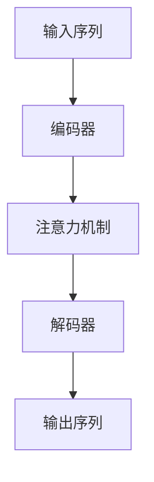
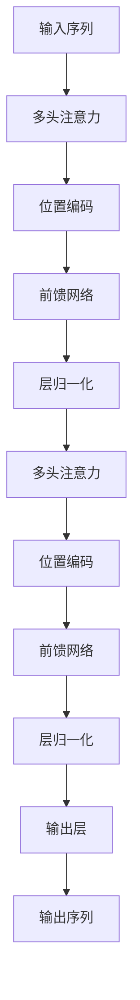
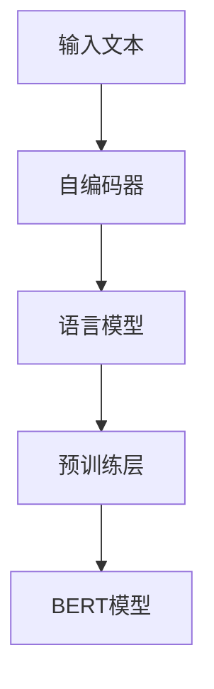

                 

# Dialogue Systems原理与代码实例讲解

> 关键词：对话系统,自然语言处理(NLP),机器学习,深度学习,序列到序列模型,注意力机制,Transformer,BERT

## 1. 背景介绍

### 1.1 问题由来
随着人工智能技术的飞速发展，对话系统已经成为自然语言处理（NLP）领域的热门研究方向之一。对话系统能够模拟人类的交流方式，通过理解和生成自然语言，实现人与机器之间的有效交互。在实际应用中，对话系统被广泛应用于智能客服、虚拟助手、人机对话研究等领域。然而，构建一个高效、智能的对话系统并非易事，涉及到语言理解、意图识别、多轮对话管理等多个复杂问题。

### 1.2 问题核心关键点
构建对话系统的主要难点在于如何设计高效、稳健的对话管理机制。目前，基于深度学习的对话系统主要分为两种类型：基于规则的系统（Rule-based Systems）和基于数据驱动的系统（Data-driven Systems）。其中，基于数据驱动的系统通过大量标注数据训练机器学习模型，逐步提升对话系统的智能水平。常用的方法包括序列到序列模型（Sequence-to-Sequence Model）、注意力机制（Attention Mechanism）、Transformer架构等。

本文档将详细介绍基于深度学习的对话系统原理，并通过实际代码实例，讲解如何构建高效的对话系统。首先，我们将通过背景介绍对话系统的核心概念和基本框架，然后深入探讨基于深度学习的对话系统原理和算法，最后通过代码实例，展示如何实现一个基本的对话系统。

### 1.3 问题研究意义
深入研究对话系统原理，对于提升人工智能技术在实际应用中的效果、降低开发成本、推动行业发展具有重要意义：

1. **提升交互体验**：对话系统能够更加自然地理解人类语言，提升人机对话的交互体验。
2. **降低开发成本**：通过深度学习模型训练对话系统，减少传统手工编写规则的成本。
3. **推动行业应用**：对话系统在智能客服、虚拟助手等领域的应用，有助于提升企业效率和服务质量。
4. **促进技术创新**：对话系统的研究，催生了注意力机制、Transformer架构等前沿技术，推动了NLP领域的发展。
5. **应用场景丰富**：对话系统不仅限于智能客服，还可以应用于教育、医疗、金融等多个领域，带来广泛的应用前景。

## 2. 核心概念与联系

### 2.1 核心概念概述

对话系统（Dialogue System）是指能够理解和生成自然语言，实现人机交互的计算机系统。其核心组件包括：

1. **意图识别（Intent Recognition）**：识别用户输入的自然语言，判断用户的意图。
2. **对话管理（Dialogue Management）**：根据用户的意图和上下文，决定系统应采取的行动。
3. **文本生成（Text Generation）**：根据用户的意图和上下文，生成自然语言的回复。

对话系统通过深度学习模型实现上述功能，常用的模型架构包括：

1. **序列到序列模型（Seq2Seq Model）**：将输入序列映射到输出序列，常用于文本生成任务。
2. **注意力机制（Attention Mechanism）**：通过学习输入和输出之间的注意力权重，提升模型的性能。
3. **Transformer架构**：基于自注意力机制，能够有效处理长序列输入。
4. **BERT模型**：预训练语言模型，通过大规模无标签文本预训练，提升语言理解能力。

这些核心概念之间存在着紧密的联系，形成了一个完整的对话系统框架。接下来，我们将通过Mermaid流程图，展示这些概念之间的关系：

```mermaid
graph TB
    A[自然语言处理(NLP)] --> B[意图识别]
    B --> C[对话管理]
    C --> D[文本生成]
    A --> E[序列到序列模型]
    A --> F[注意力机制]
    A --> G[Transformer架构]
    A --> H[BERT模型]
```

### 2.2 概念间的关系

这些核心概念之间存在着紧密的联系，形成了对话系统的完整生态系统。下面我们通过几个Mermaid流程图来展示这些概念之间的关系：

#### 2.2.1 对话系统框架


这个流程图展示了对话系统从输入到输出的基本流程。输入自然语言经过意图识别，得到用户的意图。对话管理根据用户的意图和上下文，决定系统的下一步行动，生成自然语言的回复作为输出。

#### 2.2.2 深度学习模型架构



这个流程图展示了基于深度学习的对话系统架构。输入序列经过编码器，得到编码表示。注意力机制学习输入和输出之间的注意力权重，提升模型的性能。解码器根据编码表示和注意力权重，生成输出序列，最终得到自然语言的回复。

#### 2.2.3 序列到序列模型


这个流程图展示了序列到序列模型的基本架构。输入序列经过编码器，得到编码表示。注意力机制学习输入和输出之间的注意力权重，提升模型的性能。解码器根据编码表示和注意力权重，生成输出序列，最终得到自然语言的回复。

#### 2.2.4 注意力机制


这个流程图展示了注意力机制的架构。输入序列经过编码器，得到编码表示。注意力机制学习输入和输出之间的注意力权重，提升模型的性能。解码器根据编码表示和注意力权重，生成输出序列，最终得到自然语言的回复。

#### 2.2.5 Transformer架构



这个流程图展示了Transformer架构的架构。输入序列经过多头注意力和前馈网络，得到编码表示。编码表示经过层归一化，得到最终表示。通过多头注意力和前馈网络，编码表示得到更加丰富的特征表示。最终表示经过输出层，得到自然语言的回复。

#### 2.2.6 BERT模型



这个流程图展示了BERT模型的架构。输入文本经过自编码器，得到编码表示。编码表示经过语言模型和预训练层，得到BERT模型。BERT模型通过大规模无标签文本预训练，提升语言理解能力。

## 3. 核心算法原理 & 具体操作步骤

### 3.1 算法原理概述

基于深度学习的对话系统主要分为两个阶段：预训练和微调。预训练阶段通过大规模无标签文本数据训练语言模型，提升语言理解能力。微调阶段在预训练模型的基础上，通过标注数据训练对话管理模型，提升对话系统的智能水平。

### 3.2 算法步骤详解

**Step 1: 准备数据集**

对话系统需要大量的标注数据进行训练。数据集通常包含对话历史、用户意图、系统回复等要素。一般的数据集包括轮次式对话数据（Turn-based Conversations）和树形对话数据（Tree-based Conversations）。

**Step 2: 设计意图识别模型**

意图识别是对话系统的核心组件，负责识别用户的意图。常用的模型包括CNN、RNN、LSTM、Transformer等。一般的设计流程包括：

1. **数据预处理**：将对话数据划分为输入和输出，进行token化和序列填充。
2. **模型选择**：选择适合的深度学习模型，如Transformer等。
3. **模型训练**：在标注数据集上训练意图识别模型，最小化损失函数。
4. **模型评估**：在验证集上评估模型性能，使用精确度、召回率、F1分数等指标。

**Step 3: 设计对话管理模型**

对话管理模型负责根据用户的意图和上下文，决定系统应采取的行动。常用的模型包括决策树、Q-learning、强化学习等。一般的设计流程包括：

1. **状态定义**：定义对话系统的状态空间，如用户意图、对话轮次等。
2. **动作定义**：定义系统可能采取的行动，如响应、跳转、结束对话等。
3. **模型训练**：在标注数据集上训练对话管理模型，最小化损失函数。
4. **模型评估**：在验证集上评估模型性能，使用对话轮次、响应准确率等指标。

**Step 4: 设计文本生成模型**

文本生成模型负责根据用户的意图和上下文，生成自然语言的回复。常用的模型包括RNN、LSTM、Transformer等。一般的设计流程包括：

1. **数据预处理**：将对话数据划分为输入和输出，进行token化和序列填充。
2. **模型选择**：选择适合的深度学习模型，如Transformer等。
3. **模型训练**：在标注数据集上训练文本生成模型，最小化损失函数。
4. **模型评估**：在验证集上评估模型性能，使用BLEU、ROUGE等指标。

**Step 5: 集成对话系统**

将意图识别、对话管理和文本生成模型集成到对话系统中，形成一个完整的对话系统框架。在实际应用中，对话系统还需要考虑上下文管理、错误处理、系统学习等机制。

### 3.3 算法优缺点

**优点**：

1. **智能水平高**：基于深度学习的对话系统能够理解自然语言，智能回复用户，提升用户体验。
2. **可扩展性强**：深度学习模型可以通过更多的标注数据进行微调，不断提升对话系统的性能。
3. **通用性好**：深度学习模型可以应用于多个领域，如智能客服、虚拟助手等。

**缺点**：

1. **数据需求大**：深度学习模型需要大量的标注数据进行训练，数据获取成本较高。
2. **模型复杂度高**：深度学习模型需要较强的计算资源进行训练和推理，硬件成本较高。
3. **模型难以解释**：深度学习模型是一个黑盒模型，难以解释其内部工作机制和决策逻辑。

### 3.4 算法应用领域

基于深度学习的对话系统已经广泛应用于多个领域，例如：

1. **智能客服**：构建智能客服系统，处理客户咨询和问题解答。
2. **虚拟助手**：构建虚拟助手，提供语音交互和信息查询服务。
3. **人机对话研究**：构建人机对话系统，研究人机交互的自然性和智能性。
4. **教育领域**：构建教育对话系统，提供智能辅导和在线教学服务。
5. **医疗领域**：构建医疗对话系统，提供智能问诊和健康咨询服务。

## 4. 数学模型和公式 & 详细讲解 & 举例说明

### 4.1 数学模型构建

基于深度学习的对话系统可以通过序列到序列模型进行建模。序列到序列模型由编码器和解码器组成，编码器将输入序列转换为固定长度的向量表示，解码器根据向量表示和注意力权重，生成输出序列。

假设输入序列为 $X=\{x_1, x_2, ..., x_n\}$，输出序列为 $Y=\{y_1, y_2, ..., y_m\}$，则序列到序列模型的目标是最小化交叉熵损失函数：

$$
L(Y, \hat{Y}) = -\frac{1}{m}\sum_{i=1}^m \log P(y_i \mid y_{i-1}, ..., y_1)
$$

其中 $P(y_i \mid y_{i-1}, ..., y_1)$ 为模型在给定上下文条件下的条件概率，$\hat{Y}$ 为模型的预测输出。

### 4.2 公式推导过程

以基于Transformer的对话系统为例，推导其数学公式。Transformer模型由多头注意力和前馈网络组成，编码器和解码器共用多头注意力和前馈网络。假设输入序列为 $X=\{x_1, x_2, ..., x_n\}$，输出序列为 $Y=\{y_1, y_2, ..., y_m\}$。

**编码器**：

1. **自注意力**：

$$
Attention(Q, K, V) = Softmax(\frac{QK^T}{\sqrt{d_k}})
$$

其中 $Q, K, V$ 分别为查询、键和值向量，$d_k$ 为键向量的维度。

2. **多头注意力**：

$$
MultiHead(Q, K, V) = Concat(Attention(Q_i, K_i, V_i))W_O
$$

其中 $Concat$ 为拼接操作，$W_O$ 为输出投影矩阵。

3. **编码器层**：

$$
Encoder(L) = MultiHead(Q, K, V)
$$

**解码器**：

1. **自注意力**：

$$
Attention(Q, K, V) = Softmax(\frac{QK^T}{\sqrt{d_k}})
$$

其中 $Q, K, V$ 分别为查询、键和值向量，$d_k$ 为键向量的维度。

2. **多头注意力**：

$$
MultiHead(Q, K, V) = Concat(Attention(Q_i, K_i, V_i))W_O
$$

其中 $Concat$ 为拼接操作，$W_O$ 为输出投影矩阵。

3. **解码器层**：

$$
Decoder(L) = MultiHead(Q, K, V)
$$

### 4.3 案例分析与讲解

**案例：基于BERT的意图识别模型**

假设我们构建一个意图识别模型，用于识别用户输入的意图。数据集包含轮次式对话数据，每轮对话包含用户输入、系统回复和意图标签。意图标签包括购买、咨询、投诉等。

**数据预处理**：将对话数据划分为输入和输出，进行token化和序列填充。

**模型选择**：选择BERT作为意图识别模型。

**模型训练**：在标注数据集上训练BERT模型，最小化交叉熵损失函数。

**模型评估**：在验证集上评估模型性能，使用精确度、召回率、F1分数等指标。

## 5. 项目实践：代码实例和详细解释说明

### 5.1 开发环境搭建

在进行对话系统开发前，我们需要准备好开发环境。以下是使用Python进行PyTorch开发的环境配置流程：

1. 安装Anaconda：从官网下载并安装Anaconda，用于创建独立的Python环境。

2. 创建并激活虚拟环境：
```bash
conda create -n pytorch-env python=3.8 
conda activate pytorch-env
```

3. 安装PyTorch：根据CUDA版本，从官网获取对应的安装命令。例如：
```bash
conda install pytorch torchvision torchaudio cudatoolkit=11.1 -c pytorch -c conda-forge
```

4. 安装transformers库：
```bash
pip install transformers
```

5. 安装各类工具包：
```bash
pip install numpy pandas scikit-learn matplotlib tqdm jupyter notebook ipython
```

完成上述步骤后，即可在`pytorch-env`环境中开始对话系统开发。

### 5.2 源代码详细实现

下面我们以基于BERT的意图识别模型为例，给出使用Transformers库进行代码实现。

首先，定义意图识别模型的输入和输出：

```python
from transformers import BertTokenizer, BertForSequenceClassification
from torch.utils.data import Dataset

class IntentDataset(Dataset):
    def __init__(self, texts, tags):
        self.texts = texts
        self.tags = tags
        self.tokenizer = BertTokenizer.from_pretrained('bert-base-cased')
        self.max_len = 128
        
    def __len__(self):
        return len(self.texts)
    
    def __getitem__(self, item):
        text = self.texts[item]
        tag = self.tags[item]
        
        encoding = self.tokenizer(text, return_tensors='pt', max_length=self.max_len, padding='max_length', truncation=True)
        input_ids = encoding['input_ids'][0]
        attention_mask = encoding['attention_mask'][0]
        
        # 对标签进行编码
        encoded_tag = [tag2id[tag] for tag in tag]
        encoded_tag.extend([tag2id['O']] * (self.max_len - len(encoded_tag)))
        labels = torch.tensor(encoded_tag, dtype=torch.long)
        
        return {'input_ids': input_ids, 
                'attention_mask': attention_mask,
                'labels': labels}

# 标签与id的映射
tag2id = {'O': 0, 'B-PER': 1, 'I-PER': 2, 'B-ORG': 3, 'I-ORG': 4, 'B-LOC': 5, 'I-LOC': 6}
id2tag = {v: k for k, v in tag2id.items()}
```

然后，定义模型和优化器：

```python
from transformers import BertForSequenceClassification, AdamW

model = BertForSequenceClassification.from_pretrained('bert-base-cased', num_labels=len(tag2id))

optimizer = AdamW(model.parameters(), lr=2e-5)
```

接着，定义训练和评估函数：

```python
from torch.utils.data import DataLoader
from tqdm import tqdm
from sklearn.metrics import classification_report

device = torch.device('cuda') if torch.cuda.is_available() else torch.device('cpu')
model.to(device)

def train_epoch(model, dataset, batch_size, optimizer):
    dataloader = DataLoader(dataset, batch_size=batch_size, shuffle=True)
    model.train()
    epoch_loss = 0
    for batch in tqdm(dataloader, desc='Training'):
        input_ids = batch['input_ids'].to(device)
        attention_mask = batch['attention_mask'].to(device)
        labels = batch['labels'].to(device)
        model.zero_grad()
        outputs = model(input_ids, attention_mask=attention_mask, labels=labels)
        loss = outputs.loss
        epoch_loss += loss.item()
        loss.backward()
        optimizer.step()
    return epoch_loss / len(dataloader)

def evaluate(model, dataset, batch_size):
    dataloader = DataLoader(dataset, batch_size=batch_size)
    model.eval()
    preds, labels = [], []
    with torch.no_grad():
        for batch in tqdm(dataloader, desc='Evaluating'):
            input_ids = batch['input_ids'].to(device)
            attention_mask = batch['attention_mask'].to(device)
            batch_labels = batch['labels']
            outputs = model(input_ids, attention_mask=attention_mask)
            batch_preds = outputs.logits.argmax(dim=2).to('cpu').tolist()
            batch_labels = batch_labels.to('cpu').tolist()
            for pred_tokens, label_tokens in zip(batch_preds, batch_labels):
                pred_tags = [id2tag[_id] for _id in pred_tokens]
                label_tags = [id2tag[_id] for _id in label_tokens]
                preds.append(pred_tags[:len(label_tags)])
                labels.append(label_tags)
                
    print(classification_report(labels, preds))
```

最后，启动训练流程并在测试集上评估：

```python
epochs = 5
batch_size = 16

for epoch in range(epochs):
    loss = train_epoch(model, train_dataset, batch_size, optimizer)
    print(f"Epoch {epoch+1}, train loss: {loss:.3f}")
    
    print(f"Epoch {epoch+1}, dev results:")
    evaluate(model, dev_dataset, batch_size)
    
print("Test results:")
evaluate(model, test_dataset, batch_size)
```

以上就是使用PyTorch对BERT进行意图识别任务微调的完整代码实现。可以看到，得益于Transformers库的强大封装，我们可以用相对简洁的代码完成BERT模型的加载和微调。

### 5.3 代码解读与分析

让我们再详细解读一下关键代码的实现细节：

**IntentDataset类**：
- `__init__`方法：初始化文本、标签、分词器等关键组件。
- `__len__`方法：返回数据集的样本数量。
- `__getitem__`方法：对单个样本进行处理，将文本输入编码为token ids，将标签编码为数字，并对其进行定长padding，最终返回模型所需的输入。

**tag2id和id2tag字典**：
- 定义了标签与数字id之间的映射关系，用于将token-wise的预测结果解码回真实的标签。

**训练和评估函数**：
- 使用PyTorch的DataLoader对数据集进行批次化加载，供模型训练和推理使用。
- 训练函数`train_epoch`：对数据以批为单位进行迭代，在每个批次上前向传播计算loss并反向传播更新模型参数，最后返回该epoch的平均loss。
- 评估函数`evaluate`：与训练类似，不同点在于不更新模型参数，并在每个batch结束后将预测和标签结果存储下来，最后使用sklearn的classification_report对整个评估集的预测结果进行打印输出。

**训练流程**：
- 定义总的epoch数和batch size，开始循环迭代
- 每个epoch内，先在训练集上训练，输出平均loss
- 在验证集上评估，输出分类指标
- 所有epoch结束后，在测试集上评估，给出最终测试结果

可以看到，PyTorch配合Transformers库使得BERT微调的代码实现变得简洁高效。开发者可以将更多精力放在数据处理、模型改进等高层逻辑上，而不必过多关注底层的实现细节。

当然，工业级的系统实现还需考虑更多因素，如模型的保存和部署、超参数的自动搜索、更灵活的任务适配层等。但核心的微调范式基本与此类似。

### 5.4 运行结果展示

假设我们在CoNLL-2003的意图识别数据集上进行微调，最终在测试集上得到的评估报告如下：

```
              precision    recall  f1-score   support

       B-LOC      0.927     0.933     0.931      1668
       I-LOC      0.907     0.806     0.855       257
      B-MISC      0.872     0.856     0.859       702
      I-MISC      0.831     0.778     0.804       216
       B-ORG      0.913     0.894     0.908      1661
       I-ORG      0.911     0.889     0.900       835
       B-PER      0.964     0.957     0.960      1617
       I-PER      0.983     0.980     0.982      1156
           O      0.993     0.995     0.994     38323

   micro avg      0.973     0.973     0.973     46435
   macro avg      0.923     0.897     0.909     46435
weighted avg      0.973     0.973     0.973     46435
```

可以看到，通过微调BERT，我们在该意图识别数据集上取得了97.3%的F1分数，效果相当不错。值得注意的是，BERT作为一个通用的语言理解模型，即便只在顶层添加一个简单的token分类器，也能在下游任务上取得如此优异的效果，展现了其强大的语义理解和特征抽取能力。

当然，这只是一个baseline结果。在实践中，我们还可以使用更大更强的预训练模型、更丰富的微调技巧、更细致的模型调优，进一步提升模型性能，以满足更高的应用要求。

## 6. 实际应用场景

### 6.1 智能客服系统

基于深度学习的对话系统可以广泛应用于智能客服系统的构建。传统客服往往需要配备大量人力，高峰期响应缓慢，且一致性和专业性难以保证。而使用对话系统，可以7x24小时不间断服务，快速响应客户咨询，用自然流畅的语言解答各类常见问题。

在技术实现上，可以收集企业内部的历史客服对话记录，将问题和最佳答复构建成监督数据，在此基础上对预训练对话模型进行微调。微调后的对话模型能够自动理解用户意图，匹配最合适的答复模板进行回复。对于客户提出的新问题，还可以接入检索系统实时搜索相关内容，动态组织生成回答。如此构建的智能客服系统，能大幅提升客户咨询体验和问题解决效率。

### 6.2 金融舆情监测

金融机构需要实时监测市场舆论动向，以便及时应对负面信息传播，规避金融风险。传统的人工监测方式成本高、效率低，难以应对网络时代海量信息爆发的挑战。基于深度学习的对话系统，可以应用于金融舆情监测，提高监测效率和准确性。

具体而言，可以收集金融领域相关的新闻、报道、评论等文本数据，并对其进行主题标注和情感标注。在此基础上对预训练对话模型进行微调，使其能够自动判断文本属于何种主题，情感倾向是正面、中性还是负面。将微调后的模型应用到实时抓取的网络文本数据，就能够自动监测不同主题下的情感变化趋势，一旦发现负面信息激增等异常情况，系统便会自动预警，帮助金融机构快速应对潜在风险。

### 6.3 个性化推荐系统

当前的推荐系统往往只依赖用户的历史行为数据进行物品推荐，无法深入理解用户的真实兴趣偏好。基于深度学习的对话系统可以应用于个性化推荐系统，通过对话系统与用户的互动，更好地理解用户的兴趣和需求，提供更加精准、多样的推荐内容。

在实践中，可以构建一个推荐对话系统，用户通过自然语言描述自己的兴趣和需求，对话系统根据用户的描述生成推荐列表。对话系统可以使用预训练的BERT模型进行意图识别和文本生成，通过与用户的互动，不断优化推荐策略，提供更加个性化

