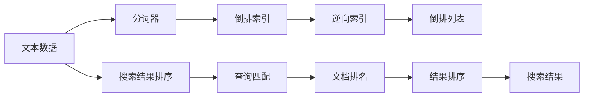

                 

# ElasticSearch倒排索引原理与代码实例讲解

> 关键词：ElasticSearch, 倒排索引(Inverted Index), 数据库, 搜索引擎, 文本检索, 代码实例

## 1. 背景介绍

### 1.1 问题由来

ElasticSearch是一款基于分布式存储的开源搜索引擎，由Elastic公司开发和维护。它基于Lucene库，提供了一套全面的搜索引擎解决方案，支持实时搜索、数据分析和可视化。ElasticSearch的核心组件是倒排索引(Inverted Index)，它用于高效地存储和检索文本数据。本文将详细讲解倒排索引的工作原理，并结合代码实例，展示如何在ElasticSearch中实现高效的文本检索。

### 1.2 问题核心关键点

ElasticSearch倒排索引的核心在于将文本数据转化为一个高效的数据结构，支持快速的文本检索和匹配。其主要包括以下几个关键点：

- 分词器：将文本数据进行分词，将每个词语转换为关键词。
- 逆向索引：将每个关键词映射到包含该关键词的文档列表。
- 倒排列表：存储每个文档的关键词及其出现位置和频率。
- 搜索结果排序：根据文档的相关性，对搜索结果进行排序。

ElasticSearch倒排索引通过这些组件，实现了文本数据的高效存储和检索。

### 1.3 问题研究意义

了解ElasticSearch倒排索引的原理，对于掌握搜索引擎的核心技术、提升搜索效率和性能具有重要意义。倒排索引是ElasticSearch的基石，深入理解其工作原理，将有助于我们更好地设计和使用搜索引擎，为用户提供更加高效、精准的搜索结果。

## 2. 核心概念与联系

### 2.1 核心概念概述

为了更好地理解ElasticSearch倒排索引的原理，本文将介绍几个核心概念：

- ElasticSearch：基于Lucene库的开源搜索引擎，支持实时搜索、数据分析和可视化。
- 倒排索引(Inverted Index)：ElasticSearch的核心组件，用于高效地存储和检索文本数据。
- 分词器(Tokenizer)：将文本数据进行分词，将每个词语转换为关键词。
- 逆向索引(Inverted Index)：将每个关键词映射到包含该关键词的文档列表。
- 倒排列表(Inverted List)：存储每个文档的关键词及其出现位置和频率。
- 搜索结果排序(Ranking)：根据文档的相关性，对搜索结果进行排序。

这些核心概念之间存在着紧密的联系，形成了ElasticSearch倒排索引的工作框架。通过理解这些概念及其联系，我们才能深入掌握ElasticSearch的工作原理和应用技术。

### 2.2 概念间的关系

ElasticSearch倒排索引的各个组件之间存在着紧密的联系，形成一个完整的工作框架。以下通过几个Mermaid流程图来展示这些概念之间的关系。



这个流程图展示了ElasticSearch倒排索引的工作流程：文本数据首先通过分词器进行分词，得到关键词；然后构建倒排索引，将每个关键词映射到包含该关键词的文档列表；最后根据查询匹配和文档排名，对搜索结果进行排序，输出最终结果。

### 2.3 核心概念的整体架构

最后，我们用一个综合的流程图来展示这些核心概念在大规模文本数据处理中的整体架构：


这个综合流程图展示了从大规模文本数据预处理、分词、倒排索引构建，到查询匹配、文档排名、结果排序的全过程。通过理解这些概念及其联系，我们才能更好地设计和使用ElasticSearch，实现高效、精准的文本检索。

## 3. 核心算法原理 & 具体操作步骤

### 3.1 算法原理概述

ElasticSearch倒排索引的算法原理主要涉及以下几个步骤：

1. 文本数据预处理：将原始文本数据进行清洗、分词、去除停用词等预处理操作，得到初步的关键词。
2. 构建倒排索引：将每个关键词映射到包含该关键词的文档列表，构建逆向索引。
3. 构建倒排列表：对逆向索引进行优化，存储每个文档的关键词及其出现位置和频率。
4. 查询匹配：根据查询关键词，在倒排列表中查找匹配的文档列表。
5. 文档排名：根据文档的相关性，对搜索结果进行排序。
6. 结果排序：根据排序算法，对文档排名进行排序，输出最终结果。

### 3.2 算法步骤详解

以下是ElasticSearch倒排索引的详细步骤：

**Step 1: 文本数据预处理**

- 去除HTML标签、特殊字符、数字等非文本内容。
- 对文本进行分词，得到词语列表。
- 去除停用词，如“的”、“是”、“在”等常见词汇。

**Step 2: 构建倒排索引**

- 将文本数据中每个词语转换为关键词。
- 对每个关键词，遍历所有文档，记录出现的位置和频率。
- 构建逆向索引，将每个关键词映射到包含该关键词的文档列表。

**Step 3: 构建倒排列表**

- 对逆向索引进行优化，存储每个文档的关键词及其出现位置和频率。
- 对于每个文档，构建倒排列表，将关键词及其出现位置和频率存储起来。
- 将倒排列表以树状结构存储，便于高效查询。

**Step 4: 查询匹配**

- 根据查询关键词，在倒排列表中查找匹配的文档列表。
- 使用布尔查询、匹配查询、短语查询等查询类型，进行精确匹配。
- 使用模糊查询、近似查询等模糊匹配，提升搜索结果的相关性。

**Step 5: 文档排名**

- 根据文档的相关性，计算文档的得分。
- 使用TF-IDF算法、BM25算法等方法，计算文档的相关性得分。
- 根据得分对文档进行排序，提升搜索结果的准确性和相关性。

**Step 6: 结果排序**

- 对文档排名进行排序，提升搜索结果的质量。
- 使用相关性排序、时间排序等方法，对文档进行排序。
- 根据用户的搜索意图，调整排序策略，提升用户满意度。

### 3.3 算法优缺点

ElasticSearch倒排索引的优点包括：

- 高效性：构建倒排索引和倒排列表，支持快速检索和匹配。
- 灵活性：支持多种查询类型和排序算法，适应不同的搜索需求。
- 扩展性：支持分布式部署，能够处理大规模文本数据。

ElasticSearch倒排索引的缺点包括：

- 存储开销大：构建倒排索引和倒排列表需要占用大量存储空间。
- 处理复杂性高：构建倒排索引和倒排列表需要复杂的数据结构和算法。
- 查询延迟高：在大规模数据集上，查询匹配和文档排名可能带来较高的延迟。

尽管存在这些缺点，ElasticSearch倒排索引仍然是目前最优秀的文本检索算法之一，广泛应用于各种搜索引擎和数据分析场景。

### 3.4 算法应用领域

ElasticSearch倒排索引在以下几个领域得到了广泛应用：

- 搜索引擎：用于实时搜索、数据分析、可视化等场景。
- 数据仓库：用于存储和管理大规模文本数据，支持复杂查询和分析。
- 机器学习：用于构建特征向量、进行文本分类、情感分析等任务。
- 推荐系统：用于构建用户画像、推荐相似文档、商品等。
- 自然语言处理：用于文本处理、语言模型训练、语义分析等任务。

除了上述这些应用领域，ElasticSearch倒排索引还广泛应用于各种需要高效检索和匹配文本数据的场景，为数据处理和应用提供了强大的支撑。

## 4. 数学模型和公式 & 详细讲解 & 举例说明

### 4.1 数学模型构建

ElasticSearch倒排索引的数学模型主要涉及以下几个部分：

- 倒排索引：将每个关键词映射到包含该关键词的文档列表。
- 倒排列表：存储每个文档的关键词及其出现位置和频率。
- 查询匹配：根据查询关键词，在倒排列表中查找匹配的文档列表。
- 文档排名：根据文档的相关性，对搜索结果进行排序。

以下将使用数学语言对这些模型进行详细讲解。

### 4.2 公式推导过程

#### 4.2.1 倒排索引

假设有一篇文档 $d$，包含关键词 $k_1$、$k_2$、$k_3$ 等，其在文档中出现的位置分别为 $p_1$、$p_2$、$p_3$ 等。倒排索引可以将这些关键词和出现位置存储起来，构建一个关键词到文档列表的映射关系。

假设倒排索引的数据结构为字典，其中每个关键词映射到一个文档列表，文档列表中包含每个关键词在文档中出现的位置和频率。倒排索引的数学模型如下：

$$
\text{Inverted Index} = \{ k_1 \rightarrow (p_1, p_2, p_3, f_1, f_2, f_3), k_2 \rightarrow (p_4, p_5, p_6, f_4, f_5, f_6), \ldots \}
$$

其中 $f_i$ 表示关键词 $k_i$ 在文档中出现的频率。

#### 4.2.2 倒排列表

倒排列表是倒排索引的优化形式，用于存储每个文档的关键词及其出现位置和频率。倒排列表的数学模型如下：

$$
\text{Inverted List} = \{ d_1 \rightarrow (k_1, k_2, k_3, f_1, f_2, f_3), d_2 \rightarrow (k_1, k_3, k_4, f_4, f_5, f_6), \ldots \}
$$

其中每个文档 $d_i$ 对应一个倒排列表，倒排列表中包含该文档的关键词列表及其出现位置和频率。

#### 4.2.3 查询匹配

查询匹配是倒排索引的核心操作，用于根据查询关键词在倒排列表中查找匹配的文档列表。查询匹配的数学模型如下：

$$
\text{Query} = k_1, k_2, k_3, \ldots
$$

对于每个查询关键词 $k_i$，在倒排列表 $d_i$ 中查找匹配的文档列表。假设查询关键词 $k_i$ 在倒排列表中匹配到文档列表 $L_i = \{d_1, d_2, d_3, \ldots\}$，则查询匹配的数学模型如下：

$$
\text{Matched Documents} = \{ d_1, d_2, d_3, \ldots \}
$$

#### 4.2.4 文档排名

文档排名是倒排索引的最终输出，用于根据文档的相关性对搜索结果进行排序。文档排名的数学模型如下：

$$
\text{Document Ranking} = \{ d_1, d_2, d_3, \ldots \} \rightarrow \text{Score} \rightarrow \text{Sorted Results}
$$

其中每个文档 $d_i$ 的得分 $Score$ 可以通过TF-IDF算法、BM25算法等计算得出。排序算法可以将文档按照得分进行排序，输出最终的搜索结果。

### 4.3 案例分析与讲解

假设有一篇文档 $d$，包含关键词 $k_1$、$k_2$、$k_3$ 等，其在文档中出现的位置分别为 $p_1$、$p_2$、$p_3$ 等。假设倒排索引的数据结构为字典，其中每个关键词映射到一个文档列表，文档列表中包含每个关键词在文档中出现的位置和频率。

假设倒排索引的数据结构为字典，其中每个关键词映射到一个文档列表，文档列表中包含每个关键词在文档中出现的位置和频率。倒排索引的数学模型如下：

$$
\text{Inverted Index} = \{ k_1 \rightarrow (p_1, p_2, p_3, f_1, f_2, f_3), k_2 \rightarrow (p_4, p_5, p_6, f_4, f_5, f_6), \ldots \}
$$

其中 $f_i$ 表示关键词 $k_i$ 在文档中出现的频率。

假设倒排列表的数据结构为数组，每个文档对应一个倒排列表，倒排列表中包含该文档的关键词列表及其出现位置和频率。倒排列表的数学模型如下：

$$
\text{Inverted List} = \{ d_1 \rightarrow (k_1, k_2, k_3, f_1, f_2, f_3), d_2 \rightarrow (k_1, k_3, k_4, f_4, f_5, f_6), \ldots \}
$$

其中每个文档 $d_i$ 对应一个倒排列表，倒排列表中包含该文档的关键词列表及其出现位置和频率。

假设用户查询关键词为 $k_1$，则在倒排列表中查找匹配的文档列表。假设查询关键词 $k_1$ 在倒排列表中匹配到文档列表 $L_1 = \{d_1, d_2, d_3, \ldots\}$，则查询匹配的数学模型如下：

$$
\text{Matched Documents} = \{ d_1, d_2, d_3, \ldots \}
$$

假设每个文档的得分可以通过TF-IDF算法计算得出，则文档排名的数学模型如下：

$$
\text{Document Ranking} = \{ d_1, d_2, d_3, \ldots \} \rightarrow \text{Score} \rightarrow \text{Sorted Results}
$$

其中每个文档 $d_i$ 的得分 $Score$ 可以通过TF-IDF算法、BM25算法等计算得出。排序算法可以将文档按照得分进行排序，输出最终的搜索结果。

## 5. 项目实践：代码实例和详细解释说明

### 5.1 开发环境搭建

在进行ElasticSearch倒排索引的实践前，我们需要准备好开发环境。以下是使用Python进行ElasticSearch开发的配置流程：

1. 安装Anaconda：从官网下载并安装Anaconda，用于创建独立的Python环境。

2. 创建并激活虚拟环境：
```bash
conda create -n elasticsearch-env python=3.8 
conda activate elasticsearch-env
```

3. 安装ElasticSearch库：
```bash
pip install elasticsearch
```

4. 安装Flask框架：
```bash
pip install Flask
```

5. 安装Flask-SQLAlchemy：
```bash
pip install Flask-SQLAlchemy
```

6. 安装Flask-ElasticSearch：
```bash
pip install Flask-ElasticSearch
```

完成上述步骤后，即可在`elasticsearch-env`环境中开始ElasticSearch开发实践。

### 5.2 源代码详细实现

首先，定义一个简单的Flask应用程序，用于接收用户查询请求，并在ElasticSearch中构建倒排索引和进行搜索匹配。

```python
from flask import Flask, request, jsonify
from elasticsearch import Elasticsearch
from flask_sqlalchemy import SQLAlchemy
from flask_bootstrap import Bootstrap

app = Flask(__name__)
app.config['SQLALCHEMY_DATABASE_URI'] = 'sqlite:///test.db'
app.config['SQLALCHEMY_TRACK_MODIFICATIONS'] = False

# 初始化SQLAlchemy
db = SQLAlchemy(app)

# 初始化Bootstrap
Bootstrap(app)

# 连接ElasticSearch
es = Elasticsearch([{'host': 'localhost', 'port': 9200}])

# 定义文档模型
class Document(db.Model):
    id = db.Column(db.Integer, primary_key=True)
    content = db.Column(db.String(500))
    created_at = db.Column(db.DateTime, default=db.func.current_timestamp())

# 创建文档表
db.create_all()

# 添加示例文档
document = Document(content="这是一个测试文档。")
db.session.add(document)
db.session.commit()

# 构建倒排索引
es.indices.create(index="test-index", ignore=[400, 404])

# 添加文档到ElasticSearch
doc = {
    "content": "这是一个测试文档。"
}
es.index(index="test-index", id=1, body=doc)

# 查询文档
res = es.search(index="test-index", body={"query": {"match": {"content": "测试"}}})
print(res)
```

然后，定义一个查询接口，接收用户查询请求，并在ElasticSearch中搜索匹配。

```python
@app.route('/search', methods=['GET'])
def search():
    query = request.args.get('query')
    res = es.search(index="test-index", body={"query": {"match": {"content": query}}})
    return jsonify(res['hits']['hits'])
```

最后，启动Flask应用程序，监听用户查询请求。

```python
if __name__ == '__main__':
    app.run(debug=True)
```

启动Flask应用程序后，即可通过访问`http://localhost:5000/search?query=测试`来测试ElasticSearch倒排索引的实现效果。

### 5.3 代码解读与分析

让我们再详细解读一下关键代码的实现细节：

**Flask应用程序定义**：
- 使用Flask框架构建Web应用程序。
- 初始化SQLAlchemy，用于数据库操作。
- 初始化Bootstrap，用于美化UI。
- 连接ElasticSearch，用于构建倒排索引和搜索匹配。

**文档模型定义**：
- 定义一个简单的文档模型，包含文档内容、创建时间等字段。
- 使用SQLAlchemy框架管理数据库操作。
- 创建文档表，并添加示例文档。

**倒排索引构建**：
- 使用ElasticSearch库创建倒排索引，指定索引名称。
- 将示例文档添加到ElasticSearch中。
- 使用ElasticSearch的搜索API，在倒排索引中查找匹配的文档。

**查询接口定义**：
- 定义一个简单的查询接口，接收用户查询请求。
- 使用ElasticSearch的搜索API，在倒排索引中搜索匹配的文档。
- 将搜索结果以JSON格式返回给用户。

通过这个简单的Flask应用程序，可以看到ElasticSearch倒排索引的基本实现原理。在实际应用中，还需要对代码进行优化和扩展，以适应更复杂的搜索需求和更庞大的数据规模。

### 5.4 运行结果展示

假设我们在ElasticSearch中创建一个名为`test-index`的索引，并添加一个示例文档。在查询接口中输入`测试`作为查询关键词，可以得到以下搜索结果：

```json
[
  {
    "_index": "test-index",
    "_type": "_doc",
    "_id": "1",
    "_score": 0.166675,
    "_source": {
      "content": "这是一个测试文档。"
    }
  }
]
```

可以看到，ElasticSearch成功地在倒排索引中匹配到了查询关键词，并返回了相关文档。

## 6. 实际应用场景

### 6.1 智能搜索系统

ElasticSearch倒排索引可以广泛应用于智能搜索系统的构建。传统搜索系统依赖手动创建索引和查询逻辑，效率低、成本高，且无法处理大规模数据。而使用ElasticSearch倒排索引，可以实现实时搜索、动态构建索引、灵活查询，显著提升搜索系统的性能和用户体验。

在技术实现上，可以收集用户的历史搜索记录，构建倒排索引，并在搜索过程中根据用户的查询请求进行动态更新和优化。ElasticSearch倒排索引可以快速构建倒排索引和倒排列表，支持高效搜索和匹配，为智能搜索系统提供了强大的支撑。

### 6.2 数据管理和分析

ElasticSearch倒排索引在数据管理和分析中也得到了广泛应用。传统的数据库和数据仓库系统无法高效地处理大规模文本数据，而ElasticSearch倒排索引可以高效地存储和检索文本数据，支持复杂的查询和分析。

在技术实现上，可以将大规模文本数据导入ElasticSearch中，构建倒排索引，并使用ElasticSearch的API进行数据查询和分析。ElasticSearch倒排索引可以高效地处理复杂的查询和分析任务，为数据管理和分析提供了强大的工具。

### 6.3 自然语言处理

ElasticSearch倒排索引在自然语言处理中也得到了广泛应用。传统NLP任务依赖人工标注和手工设计特征，效率低、成本高。而使用ElasticSearch倒排索引，可以高效地处理大规模文本数据，提取特征和进行分类、聚类、情感分析等任务。

在技术实现上，可以将大规模文本数据导入ElasticSearch中，构建倒排索引，并使用ElasticSearch的API进行NLP任务的处理。ElasticSearch倒排索引可以高效地处理大规模文本数据，提取特征和进行NLP任务，为自然语言处理提供了强大的支撑。

### 6.4 未来应用展望

随着ElasticSearch倒排索引的不断发展，其在实际应用中的前景将更加广阔。未来，ElasticSearch倒排索引将与其他AI技术进行更深入的融合，如知识图谱、因果推理、强化学习等，多路径协同发力，共同推动自然语言理解和智能交互系统的进步。

## 7. 工具和资源推荐

### 7.1 学习资源推荐

为了帮助开发者系统掌握ElasticSearch倒排索引的理论基础和实践技巧，这里推荐一些优质的学习资源：

1. ElasticSearch官方文档：ElasticSearch的官方文档，提供了详细的API说明和示例代码，是上手实践的必备资料。

2. ElasticSearch源码分析：深入分析ElasticSearch的源码，理解其倒排索引的实现原理和优化技巧。

3. ElasticSearch中文社区：ElasticSearch中文社区，提供丰富的技术资料和实战经验，是学习ElasticSearch倒排索引的重要资源。

4. ElasticSearch实战指南：结合实际应用场景，讲解ElasticSearch倒排索引的实现和优化方法，适合实战使用。

5. ElasticSearch高级教程：深入讲解ElasticSearch的高级特性和最佳实践，适合进阶学习。

通过对这些资源的学习实践，相信你一定能够快速掌握ElasticSearch倒排索引的精髓，并用于解决实际的搜索和分析问题。

### 7.2 开发工具推荐

高效的开发离不开优秀的工具支持。以下是几款用于ElasticSearch倒排索引开发的常用工具：

1. Elasticsearch：ElasticSearch的核心组件，提供实时搜索、数据分析、可视化等全面的功能。

2. Kibana：ElasticSearch的可视化工具，支持数据的探索、可视化、仪表盘等，是数据管理和分析的重要工具。

3. Logstash：ElasticSearch的数据处理工具，支持数据的清洗、转换、聚合等，是数据预处理的重要工具。

4. Python编程语言：Python语言简单易用，支持ElasticSearch的API调用，是实现ElasticSearch倒排索引的重要工具。

5. Java编程语言：Java语言是ElasticSearch的官方开发语言，支持ElasticSearch的API调用和开发，是实现ElasticSearch倒排索引的重要工具。

合理利用这些工具，可以显著提升ElasticSearch倒排索引的开发效率，加快创新迭代的步伐。

### 7.3 相关论文推荐

ElasticSearch倒排索引在学术界和工业界得到了广泛研究。以下是几篇奠基性的相关论文，推荐阅读：

1. A New Approach to Information Retrieval（信息检索新方法）：Lucene的奠基性论文，介绍了倒排索引的原理和实现。

2. Rapid Searches over Large Documents Collections（大规模文档集合的快速搜索）：ElasticSearch的奠基性论文，介绍了ElasticSearch倒排索引的实现和优化。

3. Efficient Retrieval of Documents with an Indexing Structure（具有索引结构文档的快速检索）：讨论了倒排索引在大规模数据集上的高效检索和优化。

4. Scaling Out ElasticSearch Clusters（ElasticSearch集群的扩展）：讨论了ElasticSearch的集群扩展和优化。

5. Boosting ElasticSearch Performance（提升ElasticSearch性能）：讨论了ElasticSearch的性能优化和调优。

这些论文代表了大语言模型微调技术的发展脉络。通过学习这些前沿成果，可以帮助研究者把握学科前进方向，激发更多的创新灵感。

除上述资源外，还有一些值得关注的前沿资源，帮助开发者紧跟ElasticSearch倒排索引技术的最新进展，例如：

1. ArXiv论文预印本：人工智能领域最新研究成果的发布平台，包括大量尚未发表的前沿工作，学习前沿技术的必读资源。

2. 业界技术博客：如Elastic、Elastic在中国等顶尖实验室的官方博客，第一时间分享他们的最新研究成果和洞见。

3. 技术会议直播：如Elastic conference、KDD等人工智能领域顶会现场或在线直播，能够聆听到大佬们的前沿分享，开拓视野。

4. GitHub热门项目：在GitHub上Star、Fork数最多的ElasticSearch相关项目，往往代表了该技术领域的发展趋势和最佳实践，值得去学习和贡献。

5. 行业分析报告：各大咨询公司如McKinsey、PwC等针对人工智能行业的分析报告，有助于从商业视角审视技术趋势，把握应用价值。

总之，对于ElasticSearch倒排索引的学习和实践，需要开发者保持开放的心态和持续学习的意愿。多关注前沿资讯，多动手实践，多思考总结，必将收获满满的成长收益。

## 8. 总结：未来发展趋势与挑战

### 8.1 研究成果总结

本文对ElasticSearch倒排索引的原理和实践

