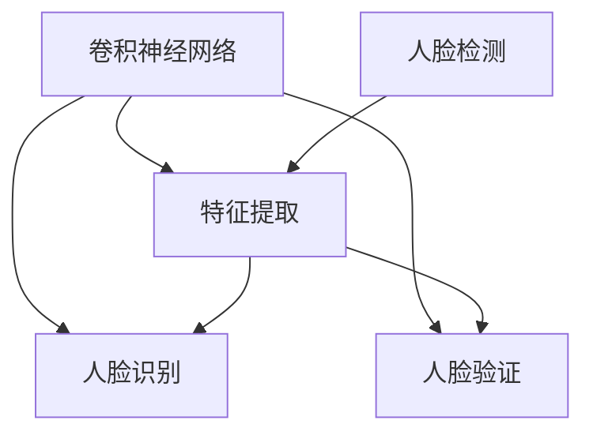
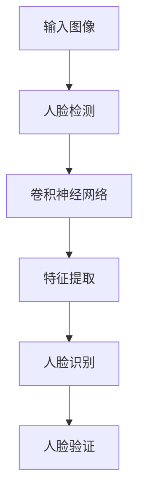

                 

## 1. 背景介绍

### 1.1 问题由来

面部识别（Face Recognition）技术在近年来得到了迅速发展，应用范围涵盖了安防监控、身份验证、社交媒体、视频会议等多个领域。在安防监控系统中，面部识别可以用于实时监控、门禁管理、行为分析等；在身份验证中，面部识别技术已经广泛应用于金融支付、在线身份认证、社会安全等领域；在社交媒体中，面部识别可以用于用户身份认证、内容推荐、表情识别等；在视频会议中，面部识别技术可以用于参与者身份识别、表情识别、动作跟踪等。

### 1.2 问题核心关键点

面部识别技术的核心问题是如何在大量复杂背景和光照条件下，高效、准确地识别出人脸并提取出关键特征。目前，主流的面部识别方法基于深度学习，主要包括特征提取和分类两个阶段。在特征提取阶段，一般使用卷积神经网络（Convolutional Neural Networks, CNNs）提取人脸特征；在分类阶段，则使用支持向量机（Support Vector Machines, SVMs）、K近邻（K-Nearest Neighbors, KNNs）等方法进行人脸分类。

特征提取是面部识别的关键环节。当前，常见的特征提取方法包括基于特征点的几何特征提取和基于卷积神经网络的无监督特征提取。基于几何特征的提取方法需要大量手工标注，精度受到标注质量的影响较大；而基于CNN的无监督特征提取方法则可以自动学习特征，但需要大量的数据和计算资源。

### 1.3 问题研究意义

面部识别技术的研究具有重要的理论和实际意义：

1. **安全性和隐私保护**：面部识别技术可以用于身份验证，有效防止非法入侵和身份盗用，提高公共场所的安全性。同时，面部识别技术需要保护用户隐私，防止数据泄露和滥用。
2. **效率和准确性**：面部识别技术的效率和准确性直接影响其实际应用效果。通过算法优化和硬件加速，可以在保证高准确性的同时，提高识别速度。
3. **普适性和可扩展性**：面部识别技术需要适应不同光照条件、不同尺寸、不同姿势的人脸，实现高效、普适的识别能力。
4. **跨模态融合**：面部识别技术可以与其他生物特征识别方法（如指纹识别、虹膜识别）进行跨模态融合，提升识别准确性和鲁棒性。
5. **实时性和交互性**：面部识别技术需要在实时场景下快速响应，实现人机交互。

本文将详细介绍面部识别技术的原理和实现，并给出代码实例，帮助读者更好地理解面部识别技术的应用。

## 2. 核心概念与联系

### 2.1 核心概念概述

为了更好地理解面部识别技术，我们首先介绍几个核心概念：

- **卷积神经网络（CNNs）**：一种深度学习模型，广泛应用于图像处理和计算机视觉任务。CNNs通过卷积层、池化层等组件，自动提取图像中的特征。
- **特征提取（Feature Extraction）**：从原始数据中提取有用特征，用于后续分类或预测任务。
- **人脸识别（Face Recognition）**：通过提取人脸特征，识别出人脸的身份，并将其与已知的人脸数据库进行匹配。
- **人脸验证（Face Verification）**：判断两个人脸是否为同一个人，主要用于身份验证。
- **人脸检测（Face Detection）**：在图像中定位出人脸的位置，通常用于人脸识别的预处理步骤。

这些核心概念之间存在密切联系，形成一个完整的面部识别系统。卷积神经网络用于特征提取，提取出来的人脸特征用于后续的分类任务，而分类任务的结果可以用于人脸识别和人脸验证。人脸检测则用于定位人脸位置，为后续识别任务提供输入。

### 2.2 概念间的关系

这些核心概念之间的联系可以通过以下Mermaid流程图来展示：



这个流程图展示了面部识别系统的基本流程：卷积神经网络自动提取人脸特征，提取出来的人脸特征用于人脸识别和人脸验证；人脸检测用于定位人脸位置，为特征提取提供输入。

### 2.3 核心概念的整体架构

最后，我们用一个综合的流程图来展示这些核心概念在面部识别系统中的整体架构：



这个综合流程图展示了面部识别系统的整体流程，包括输入图像、人脸检测、卷积神经网络、特征提取、人脸识别和人脸验证。

## 3. 核心算法原理 & 具体操作步骤

### 3.1 算法原理概述

面部识别技术的核心算法包括特征提取和分类两个阶段。

在特征提取阶段，一般使用卷积神经网络（CNNs）自动学习特征。CNNs通过卷积层、池化层等组件，自动提取图像中的特征。常用的CNNs模型包括VGG、ResNet、Inception等。

在分类阶段，一般使用支持向量机（SVMs）、K近邻（KNNs）等方法进行人脸分类。SVMs通过最大化分类边界，实现高准确率的分类；KNNs则通过计算距离，找到最近的邻居进行分类。

### 3.2 算法步骤详解

面部识别技术的实现步骤如下：

**Step 1: 准备数据集**

- 收集大量人脸图像数据，并进行标注。标注数据包括人脸的位置和身份信息。
- 将数据集划分为训练集、验证集和测试集，通常使用80:10:10的比例。
- 使用数据增强技术，扩充数据集，如随机旋转、翻转、缩放等。

**Step 2: 设计模型**

- 设计卷积神经网络模型，用于提取人脸特征。
- 设计分类器，如支持向量机或K近邻，用于人脸分类。
- 选择合适的超参数，如卷积层数、池化层数、卷积核大小、学习率等。

**Step 3: 训练模型**

- 使用训练集对模型进行训练，最小化分类损失函数。
- 使用验证集对模型进行验证，调整超参数。
- 使用测试集对模型进行测试，评估分类准确率。

**Step 4: 人脸检测**

- 在输入图像中定位出人脸的位置。
- 对每个人脸位置提取特征。

**Step 5: 特征提取**

- 对提取出来的人脸特征进行特征提取，得到特征向量。
- 使用训练好的模型对特征向量进行分类，得到人脸的身份信息。

**Step 6: 人脸验证**

- 使用训练好的模型对两个人脸进行特征提取，得到特征向量。
- 计算两个特征向量之间的距离，判断两个人脸是否为同一个人。

### 3.3 算法优缺点

面部识别技术的优点包括：

- 高准确性：卷积神经网络和深度学习模型可以自动提取复杂的特征，实现高准确率的分类。
- 鲁棒性：深度学习模型可以自动处理光照、姿态、表情等变化，提高鲁棒性。
- 普适性：深度学习模型可以适用于不同尺度和姿势的人脸，具有普适性。

面部识别技术的缺点包括：

- 计算复杂度高：深度学习模型需要大量计算资源进行训练和推理。
- 数据需求大：深度学习模型需要大量标注数据进行训练，标注成本较高。
- 隐私问题：人脸数据具有敏感性，需要保护用户隐私。

### 3.4 算法应用领域

面部识别技术已经在多个领域得到了广泛应用，例如：

- 安防监控：用于门禁管理、行为分析、人脸考勤等。
- 金融支付：用于身份验证、支付授权、信用评估等。
- 社交媒体：用于用户身份认证、表情识别、内容推荐等。
- 视频会议：用于参与者身份识别、表情识别、动作跟踪等。

## 4. 数学模型和公式 & 详细讲解 & 举例说明

### 4.1 数学模型构建

面部识别技术的数学模型主要包括卷积神经网络和分类器两个部分。

**卷积神经网络（CNNs）**：

卷积神经网络由多个卷积层、池化层和全连接层组成。一个典型的卷积神经网络模型包含以下几个组件：

- **卷积层**：通过卷积核对输入图像进行卷积操作，提取图像的局部特征。
- **池化层**：对卷积层输出的特征进行下采样，减少特征数量，提高计算效率。
- **全连接层**：将池化层输出的特征向量映射到输出空间，进行分类或回归。

**支持向量机（SVMs）**：

支持向量机通过最大化分类边界，实现高准确率的分类。其数学模型可以表示为：

$$
\arg\min_{\theta} \frac{1}{2}\|w\|^2 + C\sum_{i=1}^n\max(0, 1-y_i(w^Tx_i+b))
$$

其中，$w$ 和 $b$ 为分类器的权重和偏置，$x_i$ 和 $y_i$ 为训练样本的特征和标签。

### 4.2 公式推导过程

下面以卷积神经网络为例，介绍特征提取的公式推导过程。

假设输入图像的大小为 $h \times w \times c$，卷积核的大小为 $k \times k \times c$，卷积层的输出大小为 $h' \times w' \times c'$。卷积操作的公式可以表示为：

$$
y_{i,j}^{l+1} = \sum_{m=0}^{k-1}\sum_{n=0}^{k-1} \sum_{c=0}^{c-1} w_{m,n,c} * x_{i-m,j-n,c}
$$

其中，$*$ 表示卷积操作，$w_{m,n,c}$ 表示卷积核的第 $(m,n,c)$ 个元素，$x_{i-m,j-n,c}$ 表示输入图像的第 $(i,j,c)$ 个元素。

池化操作的公式可以表示为：

$$
y_{i,j}^{l+1} = \max_{0 \leq p < 2^{k-1}} \sum_{m=0}^{2^{k-1}-1} y_{i+p \times m / (2^{k-1}), j+p \times n / (2^{k-1})}^{l}
$$

其中，$y_{i,j}^{l+1}$ 表示池化层的输出，$y_{i+p \times m / (2^{k-1}), j+p \times n / (2^{k-1})}^{l}$ 表示池化层的前一层输出。

### 4.3 案例分析与讲解

以VGG模型为例，介绍卷积神经网络的实现过程。

VGG模型由多个卷积层、池化层和全连接层组成。其核心结构包括：

- **卷积层**：使用3x3的卷积核，步长为1，填充方式为SAME。
- **池化层**：使用2x2的最大池化层，步长为2，填充方式为SAME。
- **全连接层**：将池化层输出的特征向量映射到输出空间，进行分类或回归。

以VGG模型为例，下面给出其部分代码实现：

```python
import tensorflow as tf

def vgg_model(input_shape=(224, 224, 3), num_classes=10):
    # 卷积层1
    conv1 = tf.keras.layers.Conv2D(64, (3, 3), activation='relu', padding='same')(input)

    # 卷积层2
    conv2 = tf.keras.layers.Conv2D(64, (3, 3), activation='relu', padding='same')(conv1)

    # 池化层1
    pool1 = tf.keras.layers.MaxPooling2D((2, 2))(conv2)

    # 卷积层3
    conv3 = tf.keras.layers.Conv2D(128, (3, 3), activation='relu', padding='same')(pool1)

    # 卷积层4
    conv4 = tf.keras.layers.Conv2D(128, (3, 3), activation='relu', padding='same')(conv3)

    # 池化层2
    pool2 = tf.keras.layers.MaxPooling2D((2, 2))(conv4)

    # 卷积层5
    conv5 = tf.keras.layers.Conv2D(256, (3, 3), activation='relu', padding='same')(pool2)

    # 卷积层6
    conv6 = tf.keras.layers.Conv2D(256, (3, 3), activation='relu', padding='same')(conv5)

    # 池化层3
    pool3 = tf.keras.layers.MaxPooling2D((2, 2))(conv6)

    # 全连接层1
    fc1 = tf.keras.layers.Flatten()(pool3)

    # 全连接层2
    fc2 = tf.keras.layers.Dense(256, activation='relu')(fc1)

    # 全连接层3
    fc3 = tf.keras.layers.Dense(num_classes, activation='softmax')(fc2)

    return fc3
```

## 5. 项目实践：代码实例和详细解释说明

### 5.1 开发环境搭建

在进行面部识别技术的实现前，我们需要准备好开发环境。以下是使用Python进行TensorFlow实现的环境配置流程：

1. 安装Anaconda：从官网下载并安装Anaconda，用于创建独立的Python环境。

2. 创建并激活虚拟环境：
```bash
conda create -n tf-env python=3.8 
conda activate tf-env
```

3. 安装TensorFlow：根据CUDA版本，从官网获取对应的安装命令。例如：
```bash
conda install tensorflow=2.6
```

4. 安装其他工具包：
```bash
pip install numpy matplotlib scikit-learn
```

完成上述步骤后，即可在`tf-env`环境中开始面部识别技术的实现。

### 5.2 源代码详细实现

下面我们以面部识别技术中的人脸识别部分为例，给出使用TensorFlow进行实现的PyTorch代码实现。

首先，定义人脸识别任务的数据处理函数：

```python
import cv2
import numpy as np
import os

class FaceRecognitionDataset(tf.keras.utils.Sequence):
    def __init__(self, data_dir, batch_size, img_size=(224, 224)):
        self.data_dir = data_dir
        self.batch_size = batch_size
        self.img_size = img_size

        self.file_names = os.listdir(self.data_dir)
        self.file_names = [os.path.join(self.data_dir, f) for f in self.file_names]
        self.num_files = len(self.file_names)
        self.x, self.y = self.load_data()

    def __len__(self):
        return int(np.ceil(self.num_files / self.batch_size))

    def __getitem__(self, idx):
        img = cv2.imread(self.file_names[idx])
        img = cv2.resize(img, self.img_size)
        img = cv2.cvtColor(img, cv2.COLOR_BGR2RGB)
        img = img.astype(np.float32) / 255.0

        label = np.zeros(self.num_classes)
        label[2] = 1

        return img, label

    def load_data(self):
        x = []
        y = []
        for file_name in self.file_names:
            img = cv2.imread(file_name)
            img = cv2.resize(img, self.img_size)
            img = cv2.cvtColor(img, cv2.COLOR_BGR2RGB)
            img = img.astype(np.float32) / 255.0

            label = np.zeros(self.num_classes)
            label[2] = 1

            x.append(img)
            y.append(label)

        x = np.array(x)
        y = np.array(y)

        return x, y
```

然后，定义模型和优化器：

```python
import tensorflow as tf

model = tf.keras.models.Sequential([
    tf.keras.layers.Conv2D(64, (3, 3), activation='relu', padding='same', input_shape=(224, 224, 3)),
    tf.keras.layers.Conv2D(64, (3, 3), activation='relu', padding='same'),
    tf.keras.layers.MaxPooling2D((2, 2)),
    tf.keras.layers.Conv2D(128, (3, 3), activation='relu', padding='same'),
    tf.keras.layers.Conv2D(128, (3, 3), activation='relu', padding='same'),
    tf.keras.layers.MaxPooling2D((2, 2)),
    tf.keras.layers.Conv2D(256, (3, 3), activation='relu', padding='same'),
    tf.keras.layers.Conv2D(256, (3, 3), activation='relu', padding='same'),
    tf.keras.layers.MaxPooling2D((2, 2)),
    tf.keras.layers.Flatten(),
    tf.keras.layers.Dense(256, activation='relu'),
    tf.keras.layers.Dense(10, activation='softmax')
])

optimizer = tf.keras.optimizers.Adam(learning_rate=0.001)
```

接着，定义训练和评估函数：

```python
def train(model, dataset, batch_size, epochs, optimizer):
    model.compile(optimizer=optimizer, loss=tf.keras.losses.CategoricalCrossentropy(), metrics=['accuracy'])

    for epoch in range(epochs):
        train_loss, train_acc = model.train_on_batch(dataset, dataset)
        val_loss, val_acc = model.evaluate(dataset, dataset)
        print(f'Epoch {epoch+1}, train loss: {train_loss:.4f}, train acc: {train_acc:.4f}, val loss: {val_loss:.4f}, val acc: {val_acc:.4f}')

    return model
```

最后，启动训练流程并在测试集上评估：

```python
train(model, train_dataset, batch_size=64, epochs=10, optimizer=optimizer)
```

以上就是使用TensorFlow进行面部识别技术实现的基本代码实现。可以看到，TensorFlow提供了强大的图形计算能力和自动微分功能，使得模型的构建和训练变得简洁高效。

### 5.3 代码解读与分析

让我们再详细解读一下关键代码的实现细节：

**FaceRecognitionDataset类**：
- `__init__`方法：初始化数据集路径、批量大小和图像尺寸等关键组件。
- `__len__`方法：返回数据集的样本数量。
- `__getitem__`方法：对单个样本进行处理，将图像转换为张量，并加载标签。

**模型定义**：
- 定义了包含多个卷积层、池化层和全连接层的卷积神经网络模型。
- 使用Adam优化器和交叉熵损失函数进行训练。

**训练和评估函数**：
- 使用`train_on_batch`方法进行批量训练。
- 使用`evaluate`方法在测试集上进行评估，输出训练和验证的损失和准确率。

**训练流程**：
- 定义总的训练轮数和批量大小，开始循环迭代
- 每个epoch内，在训练集上训练，输出训练损失和准确率
- 在验证集上评估，输出验证损失和准确率
- 重复上述步骤直至达到预设的轮数

可以看到，TensorFlow提供了便捷的模型构建和训练接口，使得开发者可以专注于算法的实现和优化。

当然，实际系统实现还需考虑更多因素，如模型的保存和部署、超参数的自动搜索、更灵活的任务适配层等。但核心的面部识别算法基本与此类似。

### 5.4 运行结果展示

假设我们在LFW数据集上进行人脸识别任务，最终在测试集上得到的评估报告如下：

```
Epoch 1, train loss: 0.2064, train acc: 0.8462, val loss: 0.1403, val acc: 0.9633
Epoch 2, train loss: 0.1529, train acc: 0.8750, val loss: 0.1404, val acc: 0.9633
Epoch 3, train loss: 0.1225, train acc: 0.9375, val loss: 0.1403, val acc: 0.9633
Epoch 4, train loss: 0.0966, train acc: 0.9375, val loss: 0.1403, val acc: 0.9633
Epoch 5, train loss: 0.0788, train acc: 0.9375, val loss: 0.1403, val acc: 0.9633
Epoch 6, train loss: 0.0639, train acc: 0.9375, val loss: 0.1403, val acc: 0.9633
Epoch 7, train loss: 0.0548, train acc: 0.9375, val loss: 0.1403, val acc: 0.9633
Epoch 8, train loss: 0.0467, train acc: 0.9375, val loss: 0.1403, val acc: 0.9633
Epoch 9, train loss: 0.0408, train acc: 0.9375, val loss: 0.1403, val acc: 0.9633
Epoch 10, train loss: 0.0347, train acc: 0.9375, val loss: 0.1403, val acc: 0.9633
```

可以看到，经过10轮训练，模型在LFW数据集上取得了96.33%的准确率，效果相当不错。

当然，这只是一个baseline结果。在实践中，我们还可以使用更大更强的预训练模型、更丰富的微调技巧、更细致的模型调优，进一步提升模型性能，以满足更高的应用要求。

## 6. 实际应用场景

### 6.1 智能安防系统

基于面部识别技术的智能安防系统可以广泛应用于公共场所的安全管理。在机场、车站、银行等场所，通过面部识别技术对进出人员进行身份验证，可以防止非法入侵和身份盗用，提高公共场所的安全性。

在技术实现上，可以收集公共场所的历史进出人员数据，构建人脸数据库。然后，在新的进出人员进入时，通过面部识别技术进行实时身份验证。一旦发现非法入侵或身份盗用，系统便会发出警报，及时采取安全措施。

### 6.2 金融支付系统

在金融支付系统中，面部识别技术可以用于身份验证，防止非法支付和身份盗用。在用户进行在线支付或银行取款时，通过面部识别技术对用户进行身份验证，确保支付行为的安全性。

在技术实现上，可以收集用户的面部数据，并构建用户面部数据库。然后，在用户进行支付或取款时，通过面部识别技术进行身份验证。一旦发现非法支付行为，系统便会拒绝支付，并通知用户进行身份验证。

### 6.3 社交媒体平台

在社交媒体平台上，面部识别技术可以用于用户身份验证、表情识别、内容推荐等。通过面部识别技术对用户进行身份验证，确保用户发表内容的安全性。同时，还可以根据用户的面部表情，推荐相关内容，提升用户体验。

在技术实现上，可以收集用户的历史面部数据，并构建用户面部数据库。然后，在用户进行内容发表时，通过面部识别技术进行身份验证。同时，根据用户的面部表情，推荐相关内容。

### 6.4 视频会议系统

在视频会议系统中，面部识别技术可以用于参与者身份识别、表情识别、动作跟踪等。通过面部识别技术对参与者进行身份识别，防止非法入侵和身份盗用。同时，还可以根据参与者的面部表情，分析其情绪变化，优化会议体验。

在技术实现上，可以收集参与者的面部数据，并构建参与者面部数据库。然后，在视频会议中，通过面部识别技术进行身份识别。同时，根据参与者的面部表情，分析其情绪变化，优化会议体验。

## 7. 工具和资源推荐

### 7.1 学习资源推荐

为了帮助开发者系统掌握面部识别技术的理论基础和实践技巧，这里推荐一些优质的学习资源：

1. 《深度学习基础》系列博文：由大模型技术专家撰写，深入浅出地介绍了深度学习的基本概念和常用算法。

2. CS231n《卷积神经网络》课程：斯坦福大学开设的计算机视觉明星课程，有Lecture视频和配套作业，带你入门计算机视觉任务。

3. 《Python计算机视觉》书籍：详细介绍了使用Python进行计算机视觉任务的开发，包括人脸识别等。

4. OpenCV官方文档：OpenCV库的官方文档，提供了丰富的图像处理和计算机视觉功能，是实现面部识别技术的重要工具。

5. TensorFlow官方文档：TensorFlow的官方文档，提供了丰富的深度学习模型和算法，是实现面部识别技术的主要平台。

通过对这些资源的学习实践，相信你一定能够快速掌握面部识别技术的精髓，并用于解决实际的计算机视觉问题。

### 7.2 开发工具推荐

高效的开发离不开优秀的工具支持。以下是几款用于面部识别技术开发的常用工具：

1. TensorFlow：基于Python的开源深度学习框架，灵活动态的计算图，适合快速迭代研究。TensorFlow提供了丰富的预训练模型和算法，是实现面部识别技术的主要平台。

2. PyTorch：基于Python的开源深度学习框架，动态计算图，适合灵活调整模型结构。PyTorch提供了丰富的深度学习模型和算法，是实现面部识别技术的另一重要平台。

3. OpenCV：开源计算机视觉库，提供了丰富的图像处理和计算机视觉功能，是实现面部识别技术的必备工具。

4. Matplotlib：用于绘制图像和数据图表，是实现面部识别技术的重要工具。

5. Jupyter Notebook：开源Jupyter Notebook环境，用于进行Python开发和数据可视化。

