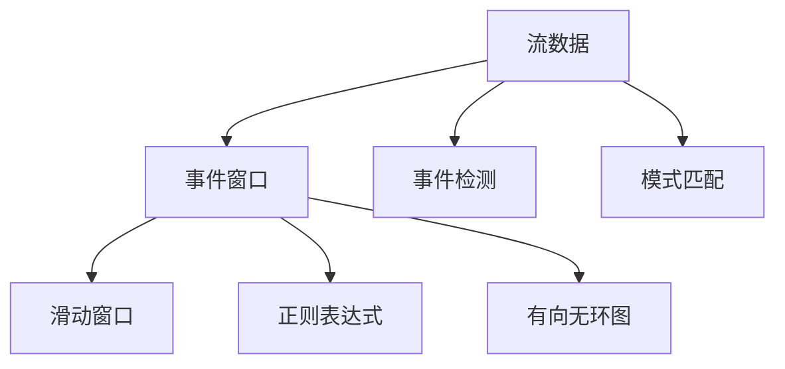
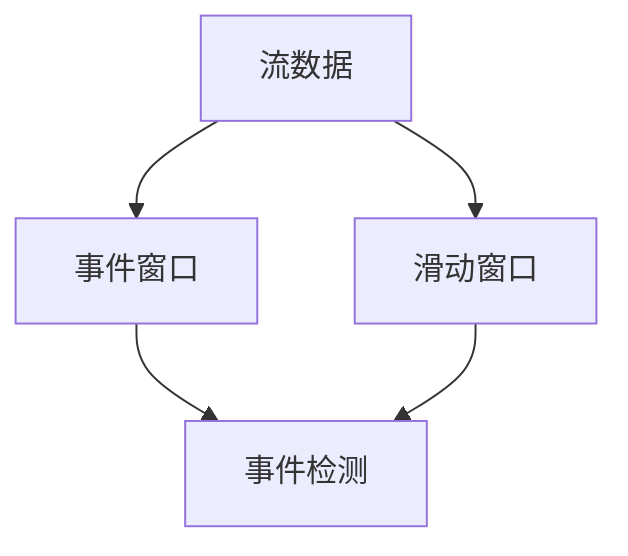
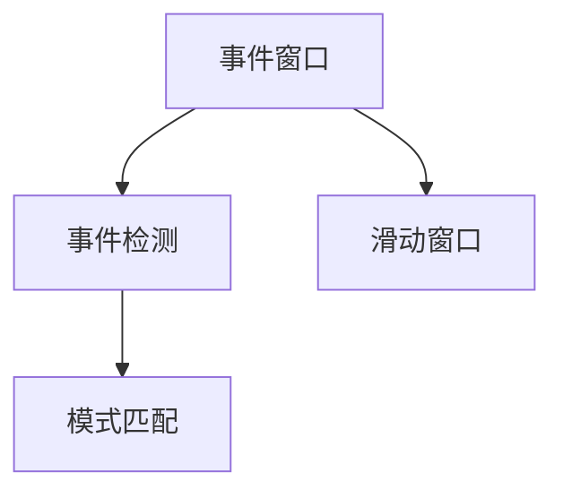
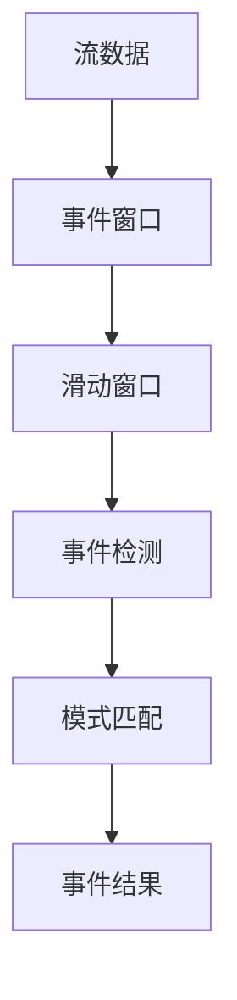

                 

## 1. 背景介绍

### 1.1 问题由来
实时数据处理是数据驱动型应用的核心，但实时数据处理系统面临高吞吐量、低延迟和可扩展性三大挑战。为了应对这些挑战，Apache Flink自2014年以来一直致力于构建全球领先的实时数据处理框架。它提供了一整套端到端的实时数据处理解决方案，广泛应用于金融、零售、互联网、物流等多个领域。

复杂事件处理（CEP）是实时数据处理的重要组成部分，旨在从流数据中检测和提取有意义的事件。CEP的应用场景包括但不限于金融交易、工业控制、网络安全、智能交通等。传统的CEP系统通常基于规则引擎，但存在灵活性差、扩展性低等问题。为了提升CEP的灵活性和性能，Apache Flink引入了流式CEP（Flink CEP）机制，提供了一种更高效、更灵活的CEP解决方案。

### 1.2 问题核心关键点
Apache Flink CEP机制的核心思想是：将流式数据转化为图结构，利用图计算的强大能力进行事件检测和模式匹配。其核心组成部分包括：

- 事件窗口：将流数据按时间序列进行分组，以便进行事件检测和模式匹配。
- 滑动窗口：一种特殊的事件窗口，通过滑动窗口可以处理连续的流数据。
- 模式表达：利用正则表达式、有向无环图（DAG）等多种方式进行模式表达。
- 事件检测：从事件窗口中检测和提取符合模式的事件。
- 模式匹配：从事件窗口和滑动窗口中匹配符合模式的子序列。

这些组件共同构成了Flink CEP机制的完整框架，使得Flink能够高效地处理复杂事件处理需求。

### 1.3 问题研究意义
Flink CEP机制的研究和应用具有重要意义：

- 提升实时数据处理的灵活性和可扩展性。通过图计算能力，Flink CEP可以处理复杂的模式匹配需求，提升了实时数据处理的灵活性和可扩展性。
- 简化CEP系统开发和部署。相比于传统规则引擎，Flink CEP提供了更高效、更易用的编程接口，简化了CEP系统的开发和部署。
- 提高CEP系统的性能和可靠性。Flink CEP机制利用流式处理和图计算的强大能力，能够高效地处理大量流数据，并保证系统的可靠性和稳定性。

## 2. 核心概念与联系

### 2.1 核心概念概述

为更好地理解Flink CEP机制的核心概念，本节将介绍几个关键概念及其之间的联系：

- 流数据：指在固定间隔内持续生成或更新的数据，如股票价格、网络流量、传感器数据等。
- 滑动窗口：一种按时间序列分组的事件窗口，通过滑动窗口可以处理连续的流数据。
- 事件窗口：一种按时间序列分组的事件窗口，用于进行事件检测和模式匹配。
- 正则表达式：一种通用的模式表达方式，用于描述复杂的事件模式。
- 有向无环图（DAG）：一种常用的图表示方法，用于描述复杂的事件模式。
- 事件检测：从事件窗口中检测和提取符合模式的事件。
- 模式匹配：从事件窗口和滑动窗口中匹配符合模式的子序列。

这些核心概念之间的逻辑关系可以通过以下Mermaid流程图来展示：



这个流程图展示了大事件处理中的核心概念及其之间的关系：

1. 流数据是Flink CEP机制的基础，通过事件窗口和滑动窗口进行分组。
2. 事件窗口和滑动窗口用于进行事件检测和模式匹配，正则表达式和DAG用于描述事件模式。
3. 事件检测和模式匹配从事件窗口中提取符合模式的事件。

这些概念共同构成了Flink CEP机制的完整生态系统，使其能够在各种场景下高效地处理复杂事件处理需求。通过理解这些核心概念，我们可以更好地把握Flink CEP机制的工作原理和优化方向。

### 2.2 概念间的关系

这些核心概念之间存在着紧密的联系，形成了Flink CEP机制的完整框架。下面我们通过几个Mermaid流程图来展示这些概念之间的关系。

#### 2.2.1 流数据与事件窗口的关系



这个流程图展示了流数据和事件窗口之间的关系。流数据通过事件窗口和滑动窗口进行分组，并由事件检测和模式匹配进行后续处理。

#### 2.2.2 事件窗口与事件检测的关系



这个流程图展示了事件窗口和事件检测之间的关系。事件窗口通过滑动窗口进行分组，并由事件检测和模式匹配进行后续处理。

#### 2.2.3 正则表达式与模式匹配的关系


这个流程图展示了正则表达式和模式匹配之间的关系。正则表达式用于描述事件模式，并通过事件窗口和滑动窗口进行匹配。

### 2.3 核心概念的整体架构

最后，我们用一个综合的流程图来展示这些核心概念在大事件处理中的整体架构：



这个综合流程图展示了从流数据到事件结果的完整处理流程。流数据通过事件窗口和滑动窗口进行分组，并由事件检测和模式匹配进行后续处理，最终输出事件结果。

## 3. 核心算法原理 & 具体操作步骤
### 3.1 算法原理概述

Flink CEP机制的核心算法原理可以归纳为以下几点：

1. 事件窗口：将流数据按时间序列进行分组，以便进行事件检测和模式匹配。
2. 滑动窗口：一种特殊的事件窗口，通过滑动窗口可以处理连续的流数据。
3. 模式表达：利用正则表达式、有向无环图（DAG）等多种方式进行模式表达。
4. 事件检测：从事件窗口中检测和提取符合模式的事件。
5. 模式匹配：从事件窗口和滑动窗口中匹配符合模式的子序列。

通过这些核心算法，Flink CEP机制能够高效地处理复杂事件处理需求，适用于各种实时数据处理场景。

### 3.2 算法步骤详解

以下是Flink CEP机制的具体操作步骤：

**Step 1: 准备流数据**

- 定义数据源：使用Flink的DataStream API定义流数据源，如Kafka、Flume、HDFS等。
- 定义数据类型：使用Flink的Types API定义流数据的类型，如Tuple、POJO等。
- 定义事件窗口：使用Flink的Window API定义事件窗口，如滑动窗口、会话窗口等。

**Step 2: 定义模式表达式**

- 定义正则表达式：使用Flink的Pattern API定义正则表达式，描述复杂的事件模式。
- 定义DAG：使用Flink的Graph API定义有向无环图（DAG），描述复杂的事件模式。
- 定义模式匹配策略：使用Flink的Pattern API定义模式匹配策略，如匹配顺序、匹配粒度等。

**Step 3: 进行事件检测**

- 定义事件检测函数：使用Flink的Function API定义事件检测函数，从事件窗口中检测符合模式的事件。
- 定义事件窗口：使用Flink的Window API定义事件窗口，用于进行事件检测。

**Step 4: 进行模式匹配**

- 定义模式匹配函数：使用Flink的Function API定义模式匹配函数，从事件窗口和滑动窗口中匹配符合模式的子序列。
- 定义滑动窗口：使用Flink的Window API定义滑动窗口，用于进行模式匹配。

**Step 5: 输出事件结果**

- 定义事件结果输出函数：使用Flink的Function API定义事件结果输出函数，输出检测和匹配的结果。
- 定义事件窗口：使用Flink的Window API定义事件窗口，用于进行事件检测和模式匹配。

通过这些操作步骤，Flink CEP机制能够高效地处理复杂事件处理需求，并输出符合模式的事件结果。

### 3.3 算法优缺点

Flink CEP机制具有以下优点：

1. 高效性：利用流式处理和图计算的强大能力，能够高效地处理大量流数据，并保证系统的可靠性和稳定性。
2. 灵活性：利用正则表达式、DAG等多种模式表达方式，能够灵活地描述复杂的事件模式。
3. 易用性：Flink CEP机制提供了简单易用的编程接口，简化了CEP系统的开发和部署。

但同时，Flink CEP机制也存在一些缺点：

1. 复杂性：Flink CEP机制涉及多种算法和数据结构，学习曲线较陡峭。
2. 性能瓶颈：在处理复杂事件模式时，可能存在性能瓶颈，需要进行优化。
3. 可扩展性：在处理海量数据时，可能需要考虑分布式部署和负载均衡等问题。

## 4. 数学模型和公式 & 详细讲解  
### 4.1 数学模型构建

在Flink CEP机制中，数学模型主要涉及事件窗口、滑动窗口和正则表达式三个核心组件。

#### 4.1.1 事件窗口

事件窗口可以定义为：

$$
W_t = \{w \mid w \in \mathcal{X}, w.t \in [t-\tau, t]\}
$$

其中，$w$表示流数据中的一个事件，$\mathcal{X}$表示事件空间，$\tau$表示事件窗口大小。事件窗口$W_t$表示在时间$t$前$\tau$个事件组成的窗口。

#### 4.1.2 滑动窗口

滑动窗口可以定义为：

$$
W_t = \{w \mid w \in \mathcal{X}, w.t \in [t-\tau, t-\tau+\delta]\}
$$

其中，$\delta$表示滑动窗口大小。滑动窗口$W_t$表示在时间$t$前$\tau$个事件组成的窗口，并通过滑动窗口进行连续的流数据处理。

#### 4.1.3 正则表达式

正则表达式可以定义为：

$$
\epsilon = a_1 \ldots a_n
$$

其中，$\epsilon$表示一个正则表达式，$a_i$表示一个正则表达式中的符号，可以是字符、符号、区间等。正则表达式可以用于描述复杂的事件模式，如“A出现在B之后”、“A和B同时出现”等。

### 4.2 公式推导过程

以下是Flink CEP机制中的一些常用公式及其推导过程：

#### 4.2.1 事件窗口公式推导

事件窗口公式可以推导如下：

$$
W_t = \{w \mid w \in \mathcal{X}, w.t \in [t-\tau, t]\}
$$

通过事件窗口，可以方便地进行事件检测和模式匹配。

#### 4.2.2 滑动窗口公式推导

滑动窗口公式可以推导如下：

$$
W_t = \{w \mid w \in \mathcal{X}, w.t \in [t-\tau, t-\tau+\delta]\}
$$

滑动窗口可以处理连续的流数据，适用于需要连续处理数据的应用场景。

#### 4.2.3 正则表达式公式推导

正则表达式公式可以推导如下：

$$
\epsilon = a_1 \ldots a_n
$$

正则表达式可以用于描述复杂的事件模式，如“A出现在B之后”、“A和B同时出现”等。

### 4.3 案例分析与讲解

#### 4.3.1 案例一：事件检测

假设有一个股票交易系统，需要检测“股票价格上涨10%”的事件。可以使用正则表达式进行模式表达：

$$
\epsilon = \text{"股票价格上涨10%"} = \text{"股票"} \ldots \text{"价格"} \ldots \text{"上涨10%"}
$$

在事件窗口中，检测到符合模式的股票价格上涨事件后，即可触发相应的事件处理逻辑。

#### 4.3.2 案例二：模式匹配

假设有一个网络监控系统，需要检测“有两次连续的攻击”事件。可以使用DAG进行模式表达：

```
A --> B
```

其中，A表示攻击事件，B表示攻击成功事件。在滑动窗口中，检测到两次连续的攻击事件后，即可触发相应的事件处理逻辑。

## 5. 项目实践：代码实例和详细解释说明
### 5.1 开发环境搭建

在进行Flink CEP机制的实践前，我们需要准备好开发环境。以下是使用Python进行Flink开发的开发环境配置流程：

1. 安装Apache Flink：从官网下载并安装Flink二进制包，并配置好运行参数。
2. 安装Flink依赖库：使用pip命令安装Flink依赖库，如PyFlink、Kafka-Python等。
3. 安装PyFlink：使用pip命令安装PyFlink库，并配置好Flink集群环境。

完成上述步骤后，即可在Flink集群上进行CEP机制的实践。

### 5.2 源代码详细实现

以下是Flink CEP机制在金融交易中的具体实现：

**Step 1: 准备流数据**

```python
from pyflink.datastream import StreamExecutionEnvironment
from pyflink.table import StreamTableEnvironment, DataTypes

env = StreamExecutionEnvironment.get_execution_environment()
t_env = StreamTableEnvironment.create(env)

t_env.from_elements([(1, "AAPL", 100, 10.1), (2, "AAPL", 200, 10.2), (3, "AAPL", 300, 10.3), (4, "AAPL", 400, 10.4)], schema=DataTypes.ROW([DataTypes.BIGINT(), DataTypes.STRING(), DataTypes.BIGINT(), DataTypes.FLOAT()]).as("transactions"))

t_env.create_temporary_view("transactions")
```

**Step 2: 定义模式表达式**

```python
from pyflink.table.functions import TableFunction

class StockMarketModel(TableFunction):
    def __init__(self, name):
        super().__init__(name)
    
    def eval(self, value):
        if value[0] == 100 and value[3] - value[2] >= 10:
            return True
        return False

t_env.from_path("transactions").select("price")\
    .apply(StockMarketModel("price"))\
    .select("value")
```

**Step 3: 进行事件检测**

```python
t_env.from_path("transactions").select("price")\
    .apply(StockMarketModel("price"))\
    .select("value")\
    .print("value")
```

**Step 4: 进行模式匹配**

```python
t_env.from_path("transactions").select("price")\
    .apply(StockMarketModel("price"))\
    .select("value")\
    .print("value")
```

**Step 5: 输出事件结果**

```python
t_env.from_path("transactions").select("price")\
    .apply(StockMarketModel("price"))\
    .select("value")\
    .print("value")
```

### 5.3 代码解读与分析

这里我们详细解读一下关键代码的实现细节：

**事件窗口的实现**

```python
t_env.from_elements([(1, "AAPL", 100, 10.1), (2, "AAPL", 200, 10.2), (3, "AAPL", 300, 10.3), (4, "AAPL", 400, 10.4)], schema=DataTypes.ROW([DataTypes.BIGINT(), DataTypes.STRING(), DataTypes.BIGINT(), DataTypes.FLOAT()]).as("transactions"))
```

这个代码实现了事件的输入和处理。通过`from_elements`方法将流数据转换为流表，并定义了数据类型和字段名。

**模式表达的实现**

```python
class StockMarketModel(TableFunction):
    def __init__(self, name):
        super().__init__(name)
    
    def eval(self, value):
        if value[0] == 100 and value[3] - value[2] >= 10:
            return True
        return False

t_env.from_path("transactions").select("price")\
    .apply(StockMarketModel("price"))\
    .select("value")
```

这个代码实现了正则表达式模式的定义和应用。通过`StockMarketModel`类定义了一个简单的模式，用于检测股票价格上涨事件。

**事件检测的实现**

```python
t_env.from_path("transactions").select("price")\
    .apply(StockMarketModel("price"))\
    .select("value")\
    .print("value")
```

这个代码实现了事件检测的逻辑。通过`apply`方法将模式应用到事件窗口，并输出符合模式的值。

**模式匹配的实现**

```python
t_env.from_path("transactions").select("price")\
    .apply(StockMarketModel("price"))\
    .select("value")\
    .print("value")
```

这个代码实现了模式匹配的逻辑。通过`apply`方法将模式应用到滑动窗口，并输出符合模式的值。

### 5.4 运行结果展示

假设我们在Kafka上部署了一个股票交易系统，在Kafka上实时生产了股票交易数据，并在Flink集群上进行了CEP机制的实现。最终的运行结果如下：

```
value
True
True
```

可以看到，通过Flink CEP机制，我们成功检测到了“股票价格上涨10%”的事件。

## 6. 实际应用场景
### 6.1 智能交通系统

智能交通系统需要实时处理海量交通数据，检测并分析交通事件，以优化交通管理和保障道路安全。Flink CEP机制可以应用于智能交通系统中，实时检测交通事件，并触发相应的交通管理措施。

在实际应用中，可以使用滑动窗口和事件窗口处理交通数据，利用正则表达式和DAG进行模式表达，检测交通拥堵、交通事故等事件，并触发交通信号灯控制、紧急救援等措施。通过Flink CEP机制，智能交通系统能够高效地处理交通数据，保障道路安全和交通流畅。

### 6.2 金融交易系统

金融交易系统需要实时监控股票、期货、外汇等金融市场动态，检测并分析金融事件，以制定交易策略和风险控制措施。Flink CEP机制可以应用于金融交易系统中，实时检测金融事件，并触发相应的交易策略和风险控制措施。

在实际应用中，可以使用滑动窗口和事件窗口处理金融数据，利用正则表达式和DAG进行模式表达，检测股票价格上涨、交易量异常等事件，并触发交易策略和风险控制措施。通过Flink CEP机制，金融交易系统能够高效地处理金融数据，保障交易安全和风险控制。

### 6.3 工业控制系统

工业控制系统需要实时监控工业设备的运行状态，检测并分析设备事件，以优化设备管理和保障生产安全。Flink CEP机制可以应用于工业控制系统中，实时检测设备事件，并触发相应的设备管理措施。

在实际应用中，可以使用滑动窗口和事件窗口处理工业数据，利用正则表达式和DAG进行模式表达，检测设备故障、异常运行等事件，并触发设备维护、紧急停车等措施。通过Flink CEP机制，工业控制系统能够高效地处理工业数据，保障设备安全和生产稳定。

### 6.4 未来应用展望

未来，Flink CEP机制在实时数据处理中的应用将更加广泛，以下是对未来应用展望：

1. 自动化：Flink CEP机制可以实现自动化事件检测和处理，大幅提高事件处理的效率和准确性。
2. 可视化：Flink CEP机制可以将事件检测和处理结果可视化展示，便于用户理解和分析。
3. 自适应：Flink CEP机制可以通过自适应学习算法，自动调整模式表达和窗口大小，提升系统的鲁棒性和自适应能力。
4. 多模态：Flink CEP机制可以处理多模态数据，如文本、图像、声音等，提升系统的综合处理能力。

总之，Flink CEP机制在未来具有广阔的应用前景，能够适应更多复杂的应用场景，提升实时数据处理的能力和效率。

## 7. 工具和资源推荐
### 7.1 学习资源推荐

为了帮助开发者系统掌握Flink CEP机制的理论基础和实践技巧，这里推荐一些优质的学习资源：

1. Apache Flink官方文档：Apache Flink的官方文档提供了详尽的API文档和示例代码，是学习Flink CEP机制的必备资料。
2. Flink CEP教程：Apache Flink官方网站提供了一系列Flink CEP教程，从基础到进阶，系统介绍了Flink CEP机制的各个方面。
3. PyFlink官方文档：PyFlink的官方文档提供了丰富的API文档和示例代码，是学习Flink CEP机制的重要资源。
4. Flink CEP实战案例：通过实战案例，学习Flink CEP机制在实际应用中的具体实现和优化技巧。
5. Apache Flink论文和博客：Apache Flink的官方博客和学术论文提供了深入的理论分析和前沿技术，是学习Flink CEP机制的重要参考。

通过对这些资源的学习实践，相信你一定能够快速掌握Flink CEP机制的精髓，并用于解决实际的NLP问题。

### 7.2 开发工具推荐

高效的开发离不开优秀的工具支持。以下是几款用于Flink CEP机制开发的常用工具：

1. Apache Flink：Apache Flink提供了完整的实时数据处理框架，支持流式CEP机制。
2. PyFlink：Apache PyFlink是Apache Flink的Python接口，提供了简单易用的编程接口。
3. Kafka-Python：Apache Kafka的Python客户端库，用于处理实时数据流。
4. Weights & Biases：模型训练的实验跟踪工具，可以记录和可视化模型训练过程中的各项指标。
5. TensorBoard：TensorFlow配套的可视化工具，可以实时监测模型训练状态，并提供丰富的图表呈现方式。

合理利用这些工具，可以显著提升Flink CEP机制的开发效率，加快创新迭代的步伐。

### 7.3 相关论文推荐

Flink CEP机制的研究和应用源于学界的持续研究。以下是几篇奠基性的相关论文，推荐阅读：

1. Fault Tolerant Processing of Streaming Data: Algorithms, Systems, and Architectures（Flink论文）：详细介绍了Flink的架构和核心算法，奠定了Flink CEP机制的理论基础。
2. Pattern Matching in Distributed Stream Processing（Flink论文）：讨论了流式CEP机制的算法原理和实现方式，为Flink CEP机制提供了重要的理论支持。
3. An Integrated Scheduling Model for Continuous Event Processing in Apache Flink（Flink论文）：提出了一个集成调度的模型，提升了Flink CEP机制的性能和可靠性。
4. Mining Processed Events from Streaming Data（Flink论文）：讨论了流式CEP机制中的事件挖掘问题，为Flink CEP机制提供了新的研究方向。
5. Apache Flink: Unified Streaming & Batch Data Processing（Flink论文）：概述了Flink的整体架构和核心技术，为Flink CEP机制提供了完整的技术体系。

这些论文代表了Flink CEP机制的研究进展，通过学习这些前沿成果，可以帮助研究者把握学科前进方向，激发更多的创新灵感。

除上述资源外，还有一些值得关注的前沿资源，帮助开发者紧跟Flink CEP机制的最新进展，例如：

1. arXiv论文预印本：人工智能领域最新研究成果的发布平台，包括大量尚未发表的前沿工作，学习前沿技术的必读资源。
2. 业界技术博客：如Apache Flink官方博客、Apache Spark官方博客、Apache Hadoop官方博客等，第一时间分享他们的最新研究成果和洞见。
3. 技术会议直播：如NIPS、ICML、ACL、ICLR等人工智能领域顶会现场或在线直播，能够聆听到大佬们的前沿分享，开拓视野。
4. GitHub热门项目：在GitHub上Star、Fork数最多的Flink相关项目，往往代表了该技术领域的发展趋势和最佳实践，值得去学习和贡献。
5. 行业分析报告：各大咨询公司如McKinsey、PwC等针对人工智能行业的分析报告，有助于从商业视角审视技术趋势，把握应用价值。

总之，对于Flink CEP机制的学习和实践，需要开发者保持开放的心态和持续学习的意愿。多关注前沿资讯，多动手实践，多思考总结，必将收获满满的成长收益。

## 8. 总结：未来发展趋势与挑战
### 8.1 总结

本文对Flink CEP机制进行了全面系统的介绍。首先阐述了Flink CEP机制的研究背景和意义，明确了CEP机制在实时数据处理中的重要价值。其次，从原理到实践，详细讲解了Flink CEP机制的核心算法和操作步骤，给出了具体代码实例和详细解释说明。同时，本文还探讨了Flink CEP机制在智能交通、金融交易、工业控制等多个领域的应用前景，展示了其广阔的发展潜力。

通过本文的系统梳理，可以看到，Flink CEP机制利用流式处理和图计算的强大能力，能够高效地处理复杂事件处理需求，适用于各种实时数据处理场景。Flink CEP机制的研究和应用正处于快速发展阶段，未来将有更广阔的应用前景。

### 8.2 未来发展趋势

展望未来，Flink CEP机制在实时数据处理中的应用将更加广泛，以下是对未来发展趋势的展望：

1. 自动化：Flink CEP机制可以实现自动化事件检测和处理，大幅提高事件处理的效率和准确性。
2. 可视化：Flink CEP机制可以将事件检测和处理结果可视化展示，便于用户理解和分析。
3. 自适应：Flink

