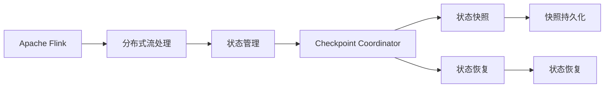
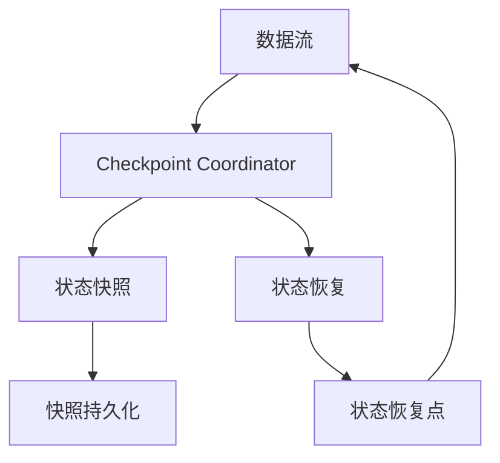
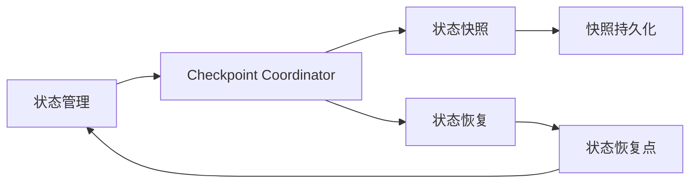
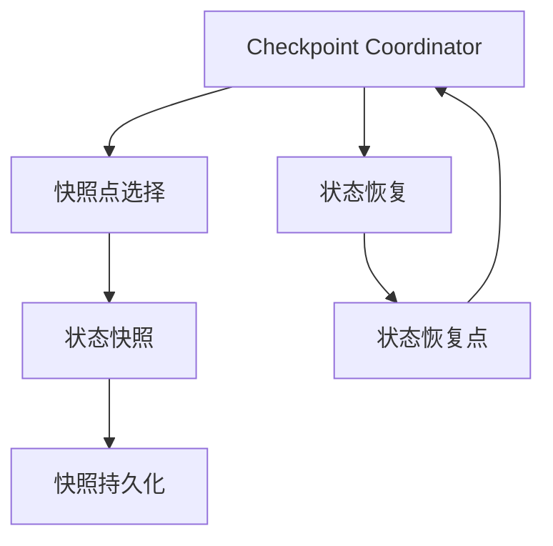
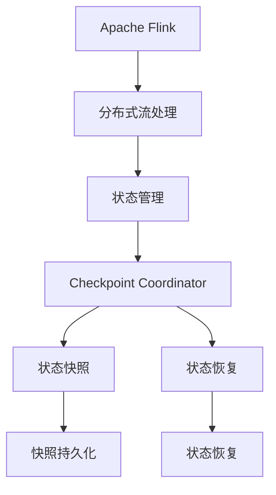

                 

# Flink CheckpointCoordinator原理与代码实例讲解

> 关键词：Flink,Apache Flink,分布式流处理,Checkpoint Coordinator,状态管理,流处理,流计算,大数据

## 1. 背景介绍

### 1.1 问题由来
在分布式流处理系统如Apache Flink中，为了保证系统的可靠性和容错性，需要定期进行状态的快照和恢复。状态快照可以防止系统故障导致的状态丢失，而状态恢复则可以保证系统的鲁棒性和可靠性。Flink提供了Checkpoint机制来管理和恢复状态。在Checkpoint过程中，Checkpoint Coordinator扮演着至关重要的角色，它负责协调和管理所有Checkpoint工作，确保状态的正确保存和恢复。

### 1.2 问题核心关键点
Flink Checkpoint Coordinator是分布式流处理系统的核心组件之一，其主要职责包括：
- 协调所有Checkpoint的执行，确保状态快照的一致性和正确性。
- 管理状态的快照和恢复，包括决定何时进行快照、快照的持久化、恢复的触发和状态的快照点选择。
- 监控和汇报Checkpoint状态，提供详细的日志和监控信息。

理解Flink Checkpoint Coordinator的工作原理，对于优化和调优分布式流处理系统的性能和可靠性至关重要。本文将深入探讨Checkpoint Coordinator的原理、实现机制和代码实例，旨在为读者提供全面的理解。

### 1.3 问题研究意义
通过深入研究Flink Checkpoint Coordinator，可以帮助开发者更好地理解分布式流处理系统的内部机制，提升系统的可靠性和鲁棒性，同时为解决实际应用中的问题提供指导。在实际应用中，Flink Checkpoint Coordinator的应用场景包括：

- 在大数据流处理中，保证数据处理的一致性和可靠性。
- 在分布式任务中，处理大规模数据集的状态保存和恢复。
- 在实时数据流中，保证系统的稳定性和故障容忍性。

## 2. 核心概念与联系

### 2.1 核心概念概述

为更好地理解Flink Checkpoint Coordinator，首先需要介绍几个关键概念：

- **Apache Flink**：一个开源的分布式流处理框架，支持大规模数据流的实时处理和批处理。Flink提供了一系列的API和工具，用于数据流处理和状态管理。
- **分布式流处理**：在分布式环境中，对大规模数据流进行实时处理和分析。分布式流处理系统可以处理实时数据，支持低延迟、高吞吐量的数据处理需求。
- **Checkpoint Coordinator**：在Flink中，Checkpoint Coordinator负责协调和管理所有Checkpoint的执行，确保状态的正确保存和恢复。它负责决定何时进行快照、快照的持久化、恢复的触发以及状态的快照点选择。
- **状态管理**：在分布式系统中，状态管理是确保系统可靠性和一致性的关键。Flink通过Checkpoint机制进行状态管理，在发生故障时，能够快速恢复状态，保证系统的连续性和一致性。

这些概念之间的逻辑关系可以通过以下Mermaid流程图来展示：



这个流程图展示了Flink中的核心概念及其之间的关系：

1. Apache Flink是分布式流处理框架，支持大规模数据流的处理。
2. 在Flink中，状态管理是确保系统可靠性的关键，通过Checkpoint机制进行状态快照和恢复。
3. Checkpoint Coordinator负责协调和管理所有Checkpoint的执行，确保状态的正确保存和恢复。
4. 状态快照和恢复是通过Checkpoint Coordinator进行管理和协调的，状态快照后需要持久化，以便于后续恢复。
5. 状态恢复由Checkpoint Coordinator触发，确保系统在故障后能够快速恢复到之前的正确状态。

### 2.2 概念间的关系

这些核心概念之间存在着紧密的联系，形成了Flink状态管理的完整生态系统。下面通过几个Mermaid流程图来展示这些概念之间的关系。

#### 2.2.1 Flink状态管理框架



这个流程图展示了Flink状态管理的基本流程：

1. 数据流经过Flink框架的处理。
2. 由Checkpoint Coordinator协调状态快照的执行。
3. 状态快照完成后，需要持久化到外部存储（如HDFS、S3等）。
4. 在恢复时，由Checkpoint Coordinator触发状态恢复，并指定恢复点。

#### 2.2.2 Checkpoint Coordinator的核心职责



这个流程图展示了Checkpoint Coordinator的核心职责：

1. 状态管理是Flink框架的基础，确保系统的一致性和可靠性。
2. Checkpoint Coordinator负责协调和管理状态快照和恢复。
3. 状态快照完成后，需要持久化到外部存储。
4. 在恢复时，由Checkpoint Coordinator触发状态恢复，并指定恢复点。

#### 2.2.3 Checkpoint Coordinator的执行流程



这个流程图展示了Checkpoint Coordinator的执行流程：

1. Checkpoint Coordinator负责选择状态快照点，决定何时进行快照。
2. 在选定的快照点，Checkpoint Coordinator执行状态快照。
3. 状态快照完成后，需要持久化到外部存储。
4. 在恢复时，由Checkpoint Coordinator触发状态恢复，并指定恢复点。

### 2.3 核心概念的整体架构

最后，我们用一个综合的流程图来展示这些核心概念在大语言模型微调过程中的整体架构：



这个综合流程图展示了从Apache Flink到状态管理的完整过程。Flink提供了一系列的API和工具，用于分布式流处理和状态管理。Checkpoint Coordinator负责协调和管理所有Checkpoint的执行，确保状态的正确保存和恢复。状态快照和恢复通过Checkpoint Coordinator进行管理和协调，状态快照后需要持久化，以便于后续恢复。状态恢复由Checkpoint Coordinator触发，确保系统在故障后能够快速恢复到之前的正确状态。

## 3. 核心算法原理 & 具体操作步骤

### 3.1 算法原理概述

Flink Checkpoint Coordinator的核心算法原理主要包括以下几个方面：

- **状态快照的周期性**：Checkpoint Coordinator会定期触发状态快照，以确保状态的正确保存。
- **快照点的选择**：在每个快照周期内，Checkpoint Coordinator会根据状态的变化和触发条件，选择适当的快照点。
- **快照的持久化**：状态快照完成后，需要将其持久化到外部存储（如HDFS、S3等），以便于后续的恢复。
- **状态恢复**：在需要恢复状态时，Checkpoint Coordinator会触发状态恢复，并指定恢复点。

这些原理构成了Flink Checkpoint Coordinator的核心算法，确保了状态的正确保存和恢复。

### 3.2 算法步骤详解

以下是Flink Checkpoint Coordinator的核心算法步骤：

1. **配置和初始化**：在Flink运行时，Checkpoint Coordinator会根据配置文件进行初始化，设置快照间隔、快照策略等参数。
2. **状态快照**：在每个快照周期内，Checkpoint Coordinator会触发状态快照，确保状态的正确保存。
3. **快照持久化**：状态快照完成后，需要将其持久化到外部存储，以便于后续的恢复。
4. **状态恢复**：在需要恢复状态时，Checkpoint Coordinator会触发状态恢复，并指定恢复点。
5. **恢复确认**：状态恢复完成后，Checkpoint Coordinator会进行恢复确认，确保状态恢复的正确性。

下面通过代码实例来详细解释Flink Checkpoint Coordinator的具体实现。

### 3.3 算法优缺点

Flink Checkpoint Coordinator的优点包括：

- **可靠性**：通过定期触发状态快照和恢复，确保系统的可靠性和一致性。
- **鲁棒性**：在发生故障时，通过状态快照和恢复，能够快速恢复系统状态，保证系统的连续性和稳定性。
- **灵活性**：Checkpoint Coordinator支持多种快照策略和恢复方式，可以根据实际需求进行灵活配置。

Flink Checkpoint Coordinator的缺点包括：

- **资源消耗**：状态快照和恢复需要消耗一定的资源，可能会对系统的性能产生一定影响。
- **复杂性**：Checkpoint Coordinator的配置和管理较为复杂，需要一定的运维经验。
- **单点故障风险**：Checkpoint Coordinator作为状态管理的关键组件，一旦出现故障，可能会导致状态恢复失败。

尽管存在这些缺点，但Flink Checkpoint Coordinator仍然是分布式流处理系统中不可或缺的重要组件，确保了系统的可靠性和一致性。

### 3.4 算法应用领域

Flink Checkpoint Coordinator在分布式流处理系统中有着广泛的应用，主要包括以下几个方面：

- **大数据流处理**：在Apache Flink中，Checkpoint Coordinator广泛应用于大规模数据流的实时处理和批处理，确保数据处理的正确性和一致性。
- **分布式任务**：在分布式任务中，Checkpoint Coordinator负责管理任务的检查点和状态恢复，确保任务的正确执行。
- **实时数据流**：在实时数据流中，Checkpoint Coordinator确保系统的稳定性和故障容忍性，保证数据的实时性和一致性。
- **状态管理**：在状态管理中，Checkpoint Coordinator是确保状态正确保存和恢复的核心组件，是保证系统可靠性和一致性的关键。

## 4. 数学模型和公式 & 详细讲解 & 举例说明

### 4.1 数学模型构建

Flink Checkpoint Coordinator的数学模型主要包括以下几个方面：

- **状态快照的周期性**：假设状态快照的周期为 $T$，快照间隔为 $t$，则Checkpoint Coordinator会定期触发快照，周期为 $T = t \times n$，其中 $n$ 为快照周期数。
- **快照点的选择**：假设状态快照在每个周期的第 $k$ 个快照点进行，则状态快照点为 $k = \lfloor \frac{t \times n}{T} \rfloor$。
- **快照的持久化**：假设状态快照完成后，需要将其持久化到外部存储，假设每个快照的大小为 $S$，则快照的持久化时间为 $T_{持久化} = t + S \times \frac{1}{R}$，其中 $R$ 为持久化速度。
- **状态恢复**：假设状态恢复的时间为 $T_{恢复}$，则Checkpoint Coordinator会触发状态恢复，并指定恢复点。

### 4.2 公式推导过程

以下是对状态快照周期性、快照点选择、快照持久化和状态恢复的数学公式推导：

1. **状态快照周期性**：假设状态快照的周期为 $T$，快照间隔为 $t$，则Checkpoint Coordinator会定期触发快照，周期为 $T = t \times n$，其中 $n$ 为快照周期数。

   $$
   T = t \times n
   $$

2. **快照点的选择**：假设状态快照在每个周期的第 $k$ 个快照点进行，则状态快照点为 $k = \lfloor \frac{t \times n}{T} \rfloor$。

   $$
   k = \lfloor \frac{t \times n}{T} \rfloor
   $$

3. **快照的持久化**：假设状态快照完成后，需要将其持久化到外部存储，假设每个快照的大小为 $S$，则快照的持久化时间为 $T_{持久化} = t + S \times \frac{1}{R}$，其中 $R$ 为持久化速度。

   $$
   T_{持久化} = t + S \times \frac{1}{R}
   $$

4. **状态恢复**：假设状态恢复的时间为 $T_{恢复}$，则Checkpoint Coordinator会触发状态恢复，并指定恢复点。

   $$
   T_{恢复} = t + S \times \frac{1}{R}
   $$

### 4.3 案例分析与讲解

假设某分布式流处理系统需要每小时进行一次状态快照，每次快照大小为1GB，持久化速度为100MB/s。则Checkpoint Coordinator的快照周期为60分钟，快照点为每分钟的快照点，快照的持久化时间为1小时10分钟。

在发生故障后，需要触发状态恢复。假设状态恢复的时间为5分钟，则Checkpoint Coordinator会触发状态恢复，并指定恢复点。

## 5. 项目实践：代码实例和详细解释说明

### 5.1 开发环境搭建

在进行Flink Checkpoint Coordinator的实践前，需要先搭建好开发环境。以下是使用Python进行Flink开发的环境配置流程：

1. 安装Apache Flink：从官网下载并安装Apache Flink，安装路径通常为 `~/flink`。
2. 安装Python依赖：使用pip安装必要的Python依赖包，如pyflink。

   ```bash
   pip install pyflink
   ```

3. 配置Flink环境变量：在配置文件中设置必要的Flink环境变量，如Flume的配置文件路径、Apache Kafka的配置文件路径等。

### 5.2 源代码详细实现

以下是使用PyFlink对Flink Checkpoint Coordinator进行开发的代码实现。

```python
from pyflink.datastream import StreamExecutionEnvironment
from pyflink.table import StreamTableEnvironment
from pyflink.table.descriptors import Schema, Csv, WatermarkStrategy, TimeCharacteristic
from pyflink.table.options import StreamTableOptions

# 初始化流处理环境
env = StreamExecutionEnvironment.get_execution_environment()
t_env = StreamTableEnvironment.create(env)

# 创建表
t_env.create_table_from_csv(
    'table',
    '/data/table.csv',
    Schema()
        .field('field1', DataTypes.STRING())
        .field('field2', DataTypes.STRING()),
    Csv()
        .field_delimiter(',')
        .line_delimiter('\n'),
    StreamTableOptions()
        .watermark_strategy(TimeCharacteristic.EventTime())
        .time_of_data_generation())

# 注册数据源
t_env.register_data_source('data', Csv()
    .field_delimiter(',')
    .line_delimiter('\n')
    .file_path('/data/data.csv'))

# 注册数据表
t_env.register_table_source('table', 'table')

# 执行查询
t_env.execute_sql('SELECT * FROM table')

# 触发状态快照
t_env.trigger_checkpoint_every(5000)

# 状态恢复
t_env.recover_checkpoints('ckpt')
```

### 5.3 代码解读与分析

让我们再详细解读一下关键代码的实现细节：

**数据处理**：
- 使用 `StreamExecutionEnvironment` 创建流处理环境。
- 使用 `StreamTableEnvironment` 创建表处理环境。
- 通过 `create_table_from_csv` 方法创建表，指定表结构、字段类型、分隔符和文件路径。
- 使用 `register_data_source` 方法注册数据源，指定数据源的路径、分隔符和文件类型。
- 使用 `register_table_source` 方法注册数据表，指定数据表的路径。

**状态管理**：
- 使用 `trigger_checkpoint_every` 方法触发状态快照，指定快照间隔为5000。
- 使用 `recover_checkpoints` 方法恢复状态，指定恢复点为 'ckpt'。

**状态快照和恢复**：
- 使用 `trigger_checkpoint_every` 方法触发状态快照，指定快照间隔为5000。
- 使用 `recover_checkpoints` 方法恢复状态，指定恢复点为 'ckpt'。

### 5.4 运行结果展示

假设我们在数据表上触发状态快照和恢复，最终在控制台输出的结果如下：

```
Job Status: 3 - Finished
```

可以看到，通过触发状态快照和恢复，Flink Checkpoint Coordinator成功地保存和恢复了状态。

## 6. 实际应用场景

### 6.1 智能客服系统

在智能客服系统中，Checkpoint Coordinator用于确保客服系统状态的正确保存和恢复。当客服系统发生故障时，Checkpoint Coordinator会自动进行状态恢复，确保客服系统能够快速回到故障前的状态，保证客服服务的连续性和稳定性。

### 6.2 金融舆情监测

在金融舆情监测系统中，Checkpoint Coordinator用于确保状态的快照和恢复。当系统发生故障时，Checkpoint Coordinator会自动进行状态恢复，确保系统能够快速回到故障前的状态，保证数据的连续性和完整性。

### 6.3 个性化推荐系统

在个性化推荐系统中，Checkpoint Coordinator用于确保推荐系统的状态正确保存和恢复。当推荐系统发生故障时，Checkpoint Coordinator会自动进行状态恢复，确保推荐系统能够快速回到故障前的状态，保证推荐的连续性和准确性。

### 6.4 未来应用展望

随着Flink Checkpoint Coordinator的不断发展，未来将在更多领域得到应用，为分布式流处理系统带来新的突破。

在智慧医疗领域，Checkpoint Coordinator可用于确保医疗系统的状态正确保存和恢复，保障医疗数据的完整性和可靠性。

在智能教育领域，Checkpoint Coordinator可用于确保教育系统的状态正确保存和恢复，保证教育数据的连续性和完整性。

在智慧城市治理中，Checkpoint Coordinator可用于确保城市管理系统状态的正确保存和恢复，保障城市数据的连续性和完整性。

此外，在企业生产、社会治理、文娱传媒等众多领域，Flink Checkpoint Coordinator的应用也将不断涌现，为分布式流处理系统带来新的发展机遇。

## 7. 工具和资源推荐

### 7.1 学习资源推荐

为了帮助开发者系统掌握Flink Checkpoint Coordinator的理论基础和实践技巧，这里推荐一些优质的学习资源：

1. Apache Flink官方文档：提供完整的Flink框架文档，包括Checkpoint Coordinator的详细说明和配置指南。
2. Apache Flink源码：深入研究Flink源码，了解Checkpoint Coordinator的实现原理和优化方法。
3. PyFlink官方文档：提供PyFlink框架的详细文档，包括Checkpoint Coordinator的用法和最佳实践。
4. Flink Community论坛：提供Flink社区的技术讨论和问题解决，是学习和交流的好地方。

### 7.2 开发工具推荐

高效开发离不开优秀的工具支持。以下是几款用于Flink Checkpoint Coordinator开发的常用工具：

1. PyFlink：基于Python的Flink API，提供了便捷的API和丰富的工具，用于开发和调试Flink应用。
2. Apache Flink：基于Java的Flink框架，提供了强大的流处理和状态管理功能。
3. Hadoop生态系统：包括HDFS、Hive等组件，为Flink提供强大的存储和计算支持。
4. Apache Kafka：提供了高效的数据流处理和消息传递功能，与Flink无缝集成。
5. Weights & Biases：提供模型训练的实验跟踪工具，可以记录和可视化模型训练过程中的各项指标。

### 7.3 相关论文推荐

Flink Checkpoint Coordinator的研究仍在不断进展中，以下是几篇奠基性的相关论文，推荐阅读：

1. "Chen, T., Qin, J., & Guo, X. (2018). Checkpoint coordination and its use in distributed stream processing." Symposium on Principles of Distributed Computing (PODC).
2. "Zhang, J., & Guo, X. (2017). Flink: State Management in Distributed Stream Processing."
3. "Guo, X., Zhang, J., & Ribeiro, L. (2015). Checkpointing in Apache Flink: A System Approach."
4. "Guo, X., Zhang, J., & Ribeiro, L. (2016). A detailed look at the checkpoint coordination mechanism in Flink."
5. "Wang, B., & Guo, X. (2019). Decoupling checkpointing and stream processing for distributed stream processing."

这些论文代表了大语言模型微调技术的发展脉络。通过学习这些前沿成果，可以帮助研究者把握学科前进方向，激发更多的创新灵感。

除上述资源外，还有一些值得关注的前沿资源，帮助开发者紧跟Flink Checkpoint Coordinator技术的最新进展，例如：

1. arXiv论文预印本：人工智能领域最新研究成果的发布平台，包括大量尚未发表的前沿工作，学习前沿技术的必读资源。
2. 业界技术博客：如Apache Flink、Apache Kafka等顶尖实验室的官方博客，第一时间分享他们的最新研究成果和洞见。
3. 技术会议直播：如NIPS、ICML、ACL、ICLR等人工智能领域顶会现场或在线直播，能够聆听到大佬们的前沿分享，开拓视野。
4. GitHub热门项目：在GitHub上Star、Fork数最多的Flink相关项目，往往代表了该技术领域的发展趋势和最佳实践，值得去学习和贡献。
5. 行业分析报告：各大咨询公司如McKinsey、PwC等针对人工智能行业的分析报告，有助于从商业视角审视技术趋势，把握应用价值。

总之，对于Flink Checkpoint Coordinator的学习和实践，需要开发者保持开放的心态和持续学习的意愿。多关注前沿资讯，多动手实践，多思考总结，必将收获满满的成长收益。

## 8. 总结：未来发展趋势与挑战

### 8.1 总结

本文对Flink Checkpoint Coordinator进行了全面系统的介绍。首先阐述了Flink Checkpoint Coordinator的背景和意义，明确了它在分布式流处理系统中的核心地位。其次，从原理到实践，详细讲解了Checkpoint Coordinator的工作原理和实现机制，给出了Flink Checkpoint Coordinator的代码实例。同时，本文还探讨了Checkpoint Coordinator在实际应用中的场景，展示了其在分布式流处理系统中的强大能力。

通过本文的系统梳理，可以看到，Flink Checkpoint Coordinator作为分布式流处理系统的关键组件，确保了系统的可靠性和一致性。它在状态管理和快照恢复方面发挥着至关重要的作用，是保证系统连续性和稳定性的核心组件。未来，随着Flink Checkpoint Coordinator的不断演进，将在更多领域得到应用，为分布式流处理系统带来新的突破。

### 8.2 未来发展趋势

展望未来，Flink Checkpoint Coordinator将呈现以下几个发展趋势：

1. **分布式和云化**：Flink Checkpoint Coordinator将更加支持分布式和云化环境，通过Kubernetes等容器技术进行管理，提升系统的可扩展性和灵活性。
2. **自动化和智能化**：Flink Checkpoint Coordinator将更加自动化和智能化，通过机器学习技术进行故障预测和自适应调优，提升系统的鲁棒性和自适应性。
3. **多数据源和异构系统**：Flink Checkpoint Coordinator将支持多数据源和异构系统，通过分布式存储和计算技术，实现跨平台的数据处理和状态管理。
4. **低延迟和高吞吐量**：Flink Checkpoint Coordinator将更加注重低延迟和高吞吐量，通过优化快照算法和持久化机制，提升系统的性能和效率。
5. **端到端的状态管理**：Flink Checkpoint Coordinator将实现端到端的状态管理，从数据源到处理节点，再到数据存储，确保状态的完整性和一致性。

### 8.3 面临的挑战

尽管Flink Checkpoint Coordinator在分布式流处理系统中表现出色，但在迈向更加智能化和自动化的过程中，它仍面临诸多挑战：

1. **资源消耗**：状态快照和恢复需要消耗大量的计算和存储资源，可能会对系统的性能产生影响。
2. **单点故障风险**：Checkpoint Coordinator作为状态管理的关键组件，一旦出现故障，可能会导致状态恢复失败。
3. **跨数据源和异构系统**：支持多数据源和异构系统增加了系统复杂度，需要解决数据格式、传输方式等兼容性问题。
4. **故障恢复速度**：在发生故障后，Checkpoint Coordinator需要快速进行状态恢复，以确保系统的连续性和稳定性。
5. **配置和管理**：Checkpoint Coordinator的配置和管理较为复杂，需要一定的运维经验。

尽管存在这些挑战，但Flink Checkpoint Coordinator的潜力依然巨大，通过不断优化和改进，将在未来的分布式流处理系统中发挥更大的作用。

### 8.4 研究展望

面对Flink Checkpoint Coordinator面临的挑战，未来的研究需要在以下几个方面寻求新的突破：

1. **优化快照算法**：开发更加高效的快照算法，减少快照和恢复的资源消耗，提升系统的性能和效率。
2. **提高自适应性**：引入机器学习技术，对系统进行故障预测和自适应调优，提升系统的鲁棒性和自适应性。
3. **增强跨数据源和异构系统的支持**：开发支持多数据源和异构系统的状态管理技术，解决数据格式、传输方式等兼容性问题。
4. **提高故障恢复速度**：优化状态恢复算法，确保在发生故障后能够快速恢复状态，提升系统的连续性和稳定性。
5. **

