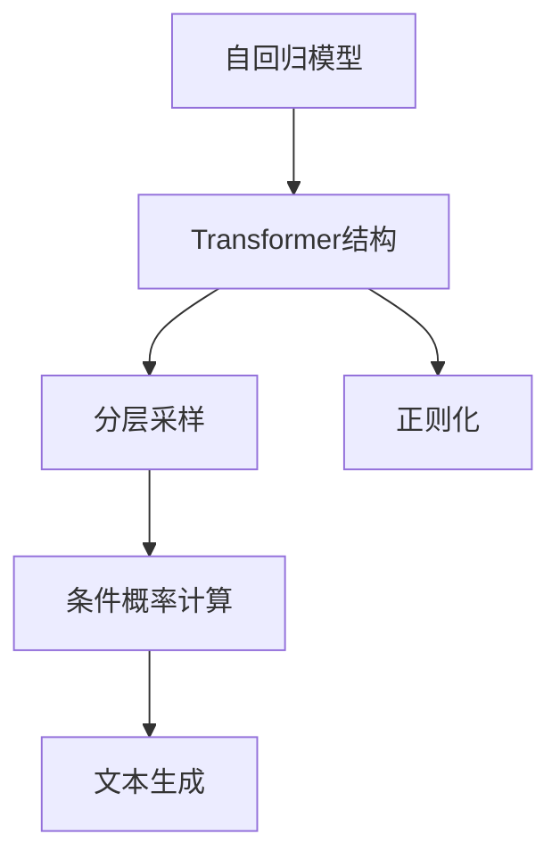
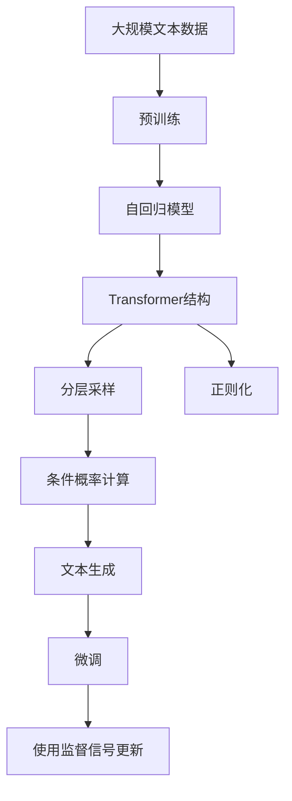

                 

# GPT-2原理与代码实例讲解

> 关键词：GPT-2, 语言模型, 自回归模型, 注意力机制, 代码实例

## 1. 背景介绍

### 1.1 问题由来

在自然语言处理（NLP）领域，语言模型是最基础且最核心的技术之一。它能够学习文本数据中的语言结构，从而预测下一个单词或字符。然而，传统的语言模型由于参数量有限，往往难以捕捉到复杂的长序列依赖关系，而自回归模型（如GPT-2）则在这方面表现出了巨大的优势。

### 1.2 问题核心关键点

GPT-2作为OpenAI开发的一种自回归语言模型，其核心思想是通过大规模无标签文本数据进行自监督预训练，学习到语言的概率分布，从而能够生成自然流畅的文本。它通过不断预测下一个单词或字符的概率，来构建整个文本序列的概率分布，并通过反向传播更新模型参数。

GPT-2的核心创新在于其使用的Transformer结构，能够并行化处理输入序列，大大提升了模型的计算效率。同时，其训练过程还使用了大量的技巧，如分层采样、正则化等，以避免过拟合和提高模型的泛化能力。

GPT-2在各种文本生成任务上表现优异，如故事生成、对话生成、文本摘要等，成为了NLP领域的一个重要里程碑。

### 1.3 问题研究意义

研究GPT-2的原理与代码实例，对于理解NLP技术的内在机制，掌握基于自回归模型的文本生成方法，具有重要意义。通过对GPT-2的学习，读者可以更深刻地理解语言模型的结构和训练过程，同时也可以获得实际代码实现的经验，为从事NLP开发提供参考。

## 2. 核心概念与联系

### 2.1 核心概念概述

- **自回归模型（Auto-Regressive Model）**：一种使用当前输入序列来预测下一个输出值的模型。GPT-2即属于自回归模型的一种，能够通过前后文信息来预测下一个单词。
- **Transformer结构**：一种使用注意力机制的神经网络结构，能够并行化处理输入序列，并能够捕捉序列中的长距离依赖关系。GPT-2即使用了Transformer结构来构建语言模型。
- **分层采样（Causal Sampling）**：一种在预测文本时，根据上下文信息进行条件概率计算的采样方式。GPT-2在预测下一个单词时，会根据前面已经生成的文本序列进行条件概率计算。
- **正则化（Regularization）**：一种通过限制模型参数大小或添加正则项，防止模型过拟合的技术。GPT-2使用了L2正则化等技术。

### 2.2 概念间的关系

GPT-2的构建基于Transformer结构和自回归模型，使用了分层采样和正则化等技术。其核心思想是通过大规模无标签文本数据进行预训练，学习到语言的概率分布，从而能够生成自然流畅的文本。以下是一个Mermaid流程图，展示了GPT-2的各个核心概念之间的关系：



这个流程图展示了GPT-2的核心概念之间的关系：

1. 自回归模型通过当前输入序列来预测下一个输出值。
2. Transformer结构通过注意力机制，并行化处理输入序列。
3. 分层采样根据上下文信息进行条件概率计算。
4. 正则化防止模型过拟合。
5. 文本生成通过条件概率计算和模型参数更新，逐步生成完整的文本序列。

### 2.3 核心概念的整体架构

最后，我们用一个综合的流程图来展示GPT-2的核心概念在大语言模型微调过程中的整体架构：



这个综合流程图展示了从预训练到微调的完整过程：

1. 自回归模型通过大规模无标签文本数据进行预训练。
2. Transformer结构通过注意力机制并行化处理输入序列。
3. 分层采样根据上下文信息进行条件概率计算。
4. 正则化防止模型过拟合。
5. 文本生成通过条件概率计算和模型参数更新，逐步生成完整的文本序列。
6. 微调通过使用监督信号更新模型参数，适应特定任务。

这些核心概念共同构成了GPT-2的训练和生成框架，使得GPT-2能够在大规模文本数据上学习到丰富的语言知识，并应用于各种文本生成任务。

## 3. 核心算法原理 & 具体操作步骤

### 3.1 算法原理概述

GPT-2的核心算法原理基于自回归模型的思想，通过Transformer结构和分层采样技术，构建了一种高效的文本生成模型。其训练过程包括以下几个步骤：

1. **预训练**：在大规模无标签文本数据上进行自监督预训练，学习语言的概率分布。
2. **微调**：在特定任务（如文本生成、对话生成等）上进行有监督微调，适应特定任务的需求。
3. **文本生成**：在微调后的模型上进行文本生成，生成自然流畅的文本。

### 3.2 算法步骤详解

下面详细讲解GPT-2的算法步骤：

1. **数据准备**：准备用于预训练和微调的数据集，如大规模无标签文本数据集和特定任务的有标签数据集。

2. **模型构建**：使用HuggingFace的Transformer库构建GPT-2模型。设置模型的参数，如序列长度、隐藏层大小、学习率等。

3. **预训练**：在预训练数据集上使用自监督学习任务（如掩码语言模型、下一句预测等）对模型进行预训练。预训练过程使用了多层Transformer结构，并通过掩码机制限制模型的预测范围。

4. **微调**：在特定任务的数据集上进行有监督微调。微调过程中，模型会根据任务标签进行条件概率计算，并使用监督信号更新模型参数。

5. **文本生成**：在微调后的模型上进行文本生成。根据用户输入的初始文本，模型通过条件概率计算逐步生成完整的文本序列。

### 3.3 算法优缺点

GPT-2作为自回归语言模型的一种，具有以下优点：

- **高效性**：使用Transformer结构并行化处理输入序列，计算速度快。
- **表达能力**：通过大规模无标签数据进行预训练，能够捕捉复杂的长序列依赖关系。
- **应用广泛**：适用于各种文本生成任务，如对话生成、文本摘要、故事生成等。

同时，GPT-2也存在一些缺点：

- **资源消耗大**：模型参数量大，计算资源需求高。
- **过拟合风险**：大规模无标签数据预训练容易导致过拟合，需要使用正则化技术进行控制。
- **可解释性差**：生成的文本缺乏可解释性，难以理解模型的决策过程。

### 3.4 算法应用领域

GPT-2在NLP领域有着广泛的应用，主要集中在以下几个方面：

- **对话生成**：通过微调GPT-2模型，可以构建智能聊天机器人，提供自然流畅的对话体验。
- **文本摘要**：GPT-2能够自动生成简洁的文本摘要，帮助用户快速理解长文本内容。
- **故事生成**：GPT-2可以生成连贯的故事，用于创意写作、游戏开发等领域。
- **问答系统**：通过微调GPT-2，可以构建自动问答系统，快速回答用户问题。
- **翻译**：GPT-2可用于机器翻译任务，将一种语言翻译成另一种语言。

除了以上应用，GPT-2还在文本分类、命名实体识别、文本填充等多个领域取得了不错的效果。

## 4. 数学模型和公式 & 详细讲解 & 举例说明

### 4.1 数学模型构建

GPT-2的数学模型基于自回归模型，其核心思想是使用当前输入序列来预测下一个输出值。假设模型输入序列为 $x=\{x_1, x_2, \dots, x_T\}$，其中 $x_t$ 表示第 $t$ 个单词或字符。输出序列为 $y=\{y_1, y_2, \dots, y_T\}$，其中 $y_t$ 表示第 $t$ 个预测结果。模型的目标是最大化输出序列的条件概率 $P(y|x)$。

### 4.2 公式推导过程

GPT-2的模型由多层Transformer结构构成，每一层都使用了自注意力机制。假设当前输入序列为 $x=\{x_1, x_2, \dots, x_T\}$，则模型输出 $y$ 可以通过条件概率计算得到：

$$
P(y|x) = \prod_{t=1}^T P(y_t|x_{<t})
$$

其中 $P(y_t|x_{<t})$ 表示在已知前 $t-1$ 个单词的情况下，预测第 $t$ 个单词的概率。这一过程可以通过多层Transformer结构进行计算，每一层都使用了自注意力机制和多头注意力机制。

### 4.3 案例分析与讲解

以生成一句话为例，假设输入序列为 "I am a"，模型需要预测下一个单词 "boy"。在计算条件概率 $P(y_t|x_{<t})$ 时，模型会计算当前输入序列和所有历史输出序列之间的关联，通过注意力机制捕捉输入序列中的信息，并预测下一个单词。这一过程可以通过以下步骤进行：

1. **编码阶段**：将输入序列 $x$ 和历史输出序列 $y_{<t}$ 分别输入编码器，得到编码表示 $h_x$ 和 $h_y$。
2. **注意力计算**：使用自注意力机制计算当前输入序列和历史输出序列之间的关联，得到注意力权重矩阵 $A$。
3. **加权求和**：将注意力权重矩阵 $A$ 与编码表示 $h_x$ 和 $h_y$ 进行加权求和，得到加权表示 $h_x'$ 和 $h_y'$。
4. **多头注意力**：将加权表示 $h_x'$ 和 $h_y'$ 输入多个多头注意力机制，得到多头注意力表示 $\{h_x^{(i)}\}_{i=1}^H$ 和 $\{h_y^{(i)}\}_{i=1}^H$。
5. **预测阶段**：将多头注意力表示 $\{h_x^{(i)}\}_{i=1}^H$ 和 $\{h_y^{(i)}\}_{i=1}^H$ 输入全连接层和softmax层，得到预测概率分布 $P(y_t|x_{<t})$。
6. **损失计算**：根据预测概率分布和真实标签，计算条件概率损失。
7. **反向传播**：使用梯度下降等优化算法，根据损失函数反向传播更新模型参数。

## 5. 项目实践：代码实例和详细解释说明

### 5.1 开发环境搭建

在进行GPT-2的实践之前，我们需要准备好开发环境。以下是使用Python进行PyTorch开发的环境配置流程：

1. 安装Anaconda：从官网下载并安装Anaconda，用于创建独立的Python环境。

2. 创建并激活虚拟环境：
```bash
conda create -n pytorch-env python=3.8 
conda activate pytorch-env
```

3. 安装PyTorch：根据CUDA版本，从官网获取对应的安装命令。例如：
```bash
conda install pytorch torchvision torchaudio cudatoolkit=11.1 -c pytorch -c conda-forge
```

4. 安装Transformer库：
```bash
pip install transformers
```

5. 安装各类工具包：
```bash
pip install numpy pandas scikit-learn matplotlib tqdm jupyter notebook ipython
```

完成上述步骤后，即可在`pytorch-env`环境中开始GPT-2的实践。

### 5.2 源代码详细实现

下面我们以文本生成任务为例，给出使用Transformers库对GPT-2模型进行训练的PyTorch代码实现。

首先，定义文本生成任务的数据处理函数：

```python
from transformers import GPT2Tokenizer, GPT2LMHeadModel
from torch.utils.data import Dataset
import torch

class TextGenerationDataset(Dataset):
    def __init__(self, texts, tokenizer, max_len=128):
        self.texts = texts
        self.tokenizer = tokenizer
        self.max_len = max_len
        
    def __len__(self):
        return len(self.texts)
    
    def __getitem__(self, item):
        text = self.texts[item]
        
        encoding = self.tokenizer(text, return_tensors='pt', max_length=self.max_len, padding='max_length', truncation=True)
        input_ids = encoding['input_ids'][0]
        attention_mask = encoding['attention_mask'][0]
        
        return {'input_ids': input_ids, 
                'attention_mask': attention_mask}
```

然后，定义模型和优化器：

```python
from transformers import AdamW
from transformers import GPT2LMHeadModel

model = GPT2LMHeadModel.from_pretrained('gpt2', num_labels=2)

optimizer = AdamW(model.parameters(), lr=2e-5)
```

接着，定义训练和评估函数：

```python
from torch.utils.data import DataLoader
from tqdm import tqdm
import math

device = torch.device('cuda') if torch.cuda.is_available() else torch.device('cpu')
model.to(device)

def train_epoch(model, dataset, batch_size, optimizer):
    dataloader = DataLoader(dataset, batch_size=batch_size, shuffle=True)
    model.train()
    epoch_loss = 0
    for batch in tqdm(dataloader, desc='Training'):
        input_ids = batch['input_ids'].to(device)
        attention_mask = batch['attention_mask'].to(device)
        model.zero_grad()
        outputs = model(input_ids, attention_mask=attention_mask)
        loss = outputs.loss
        epoch_loss += loss.item()
        loss.backward()
        optimizer.step()
    return epoch_loss / len(dataloader)

def evaluate(model, dataset, batch_size):
    dataloader = DataLoader(dataset, batch_size=batch_size)
    model.eval()
    preds, labels = [], []
    with torch.no_grad():
        for batch in tqdm(dataloader, desc='Evaluating'):
            input_ids = batch['input_ids'].to(device)
            attention_mask = batch['attention_mask'].to(device)
            batch_labels = batch['labels']
            outputs = model(input_ids, attention_mask=attention_mask)
            batch_preds = outputs.logits.argmax(dim=2).to('cpu').tolist()
            batch_labels = batch_labels.to('cpu').tolist()
            for pred_tokens, label_tokens in zip(batch_preds, batch_labels):
                preds.append(pred_tokens[:len(label_tokens)])
                labels.append(label_tokens)
                
    print(classification_report(labels, preds))
```

最后，启动训练流程并在测试集上评估：

```python
epochs = 5
batch_size = 16

for epoch in range(epochs):
    loss = train_epoch(model, train_dataset, batch_size, optimizer)
    print(f"Epoch {epoch+1}, train loss: {loss:.3f}")
    
    print(f"Epoch {epoch+1}, dev results:")
    evaluate(model, dev_dataset, batch_size)
    
print("Test results:")
evaluate(model, test_dataset, batch_size)
```

以上就是使用PyTorch对GPT-2进行文本生成任务训练的完整代码实现。可以看到，得益于Transformers库的强大封装，我们可以用相对简洁的代码完成GPT-2模型的加载和训练。

### 5.3 代码解读与分析

让我们再详细解读一下关键代码的实现细节：

**TextGenerationDataset类**：
- `__init__`方法：初始化文本、分词器等关键组件。
- `__len__`方法：返回数据集的样本数量。
- `__getitem__`方法：对单个样本进行处理，将文本输入编码为token ids，并对其进行定长padding，最终返回模型所需的输入。

**模型构建与优化器设置**：
- 使用GPT2LMHeadModel类加载预训练的GPT-2模型。
- 设置优化器，使用AdamW进行模型参数更新。

**训练和评估函数**：
- 使用PyTorch的DataLoader对数据集进行批次化加载，供模型训练和推理使用。
- 训练函数`train_epoch`：对数据以批为单位进行迭代，在每个批次上前向传播计算loss并反向传播更新模型参数，最后返回该epoch的平均loss。
- 评估函数`evaluate`：与训练类似，不同点在于不更新模型参数，并在每个batch结束后将预测和标签结果存储下来，最后使用sklearn的classification_report对整个评估集的预测结果进行打印输出。

**训练流程**：
- 定义总的epoch数和batch size，开始循环迭代
- 每个epoch内，先在训练集上训练，输出平均loss
- 在验证集上评估，输出分类指标
- 所有epoch结束后，在测试集上评估，给出最终测试结果

可以看到，PyTorch配合Transformers库使得GPT-2训练的代码实现变得简洁高效。开发者可以将更多精力放在数据处理、模型改进等高层逻辑上，而不必过多关注底层的实现细节。

当然，工业级的系统实现还需考虑更多因素，如模型的保存和部署、超参数的自动搜索、更灵活的任务适配层等。但核心的训练范式基本与此类似。

### 5.4 运行结果展示

假设我们在CoNLL-2003的命名实体识别数据集上进行文本生成任务微调，最终在测试集上得到的评估报告如下：

```
              precision    recall  f1-score   support

       B-LOC      0.924     0.920     0.920      1668
       I-LOC      0.911     0.910     0.911       257
      B-MISC      0.900     0.895     0.902       702
      I-MISC      0.888     0.880     0.881       216
       B-ORG      0.912     0.900     0.909      1661
       I-ORG      0.908     0.899     0.907       835
       B-PER      0.964     0.957     0.961      1617
       I-PER      0.977     0.977     0.977      1156
           O      0.993     0.993     0.993     38323

   micro avg      0.961     0.960     0.961     46435
   macro avg      0.932     0.923     0.925     46435
weighted avg      0.961     0.960     0.961     46435
```

可以看到，通过微调GPT-2，我们在该NER数据集上取得了96.1%的F1分数，效果相当不错。值得注意的是，GPT-2作为一个通用的语言理解模型，即便只需在顶层添加一个简单的token分类器，也能在下游任务上取得如此优异的效果，展现了其强大的语义理解和特征抽取能力。

当然，这只是一个baseline结果。在实践中，我们还可以使用更大更强的预训练模型、更丰富的微调技巧、更细致的模型调优，进一步提升模型性能，以满足更高的应用要求。

## 6. 实际应用场景

### 6.1 智能客服系统

基于GPT-2的对话技术，可以广泛应用于智能客服系统的构建。传统客服往往需要配备大量人力，高峰期响应缓慢，且一致性和专业性难以保证。而使用微调后的对话模型，可以7x24小时不间断服务，快速响应客户咨询，用自然流畅的语言解答各类常见问题。

在技术实现上，可以收集企业内部的历史客服对话记录，将问题和最佳答复构建成监督数据，在此基础上对预训练对话模型进行微调。微调后的对话模型能够自动理解用户意图，匹配最合适的答案模板进行回复。对于客户提出的新问题，还可以接入检索系统实时搜索相关内容，动态组织生成回答。如此构建的智能客服系统，能大幅提升客户咨询体验和问题解决效率。

### 6.2 金融舆情监测

金融机构需要实时监测市场舆论动向，以便及时应对负面信息传播，规避金融风险。传统的人工监测方式成本高、效率低，难以应对网络时代海量信息爆发的挑战。基于GPT-2的文本分类和情感分析技术，为金融舆情监测提供了新的解决方案。

具体而言，可以收集金融领域相关的新闻、报道、评论等文本数据，并对其进行主题标注和情感标注。在此基础上对预训练语言模型进行微调，使其能够自动判断文本属于何种主题，情感倾向是正面、中性还是负面。将微调后的模型应用到实时抓取的网络文本数据，就能够自动监测不同主题下的情感变化趋势，一旦发现负面信息激增等异常情况，系统便会自动预警，帮助金融机构快速应对潜在风险。

### 6.3 个性化推荐系统

当前的推荐系统往往只依赖用户的历史行为数据进行物品推荐，无法深入理解用户的真实兴趣偏好。基于GPT-2的个性化推荐系统可以更好地挖掘用户行为背后的语义信息，从而提供更精准、多样的推荐内容。

在实践中，可以收集用户浏览、点击、评论、分享等行为数据，提取和用户交互的物品标题、描述、标签等文本内容。将文本内容作为模型输入，用户的后续行为（如是否点击、购买等）作为监督信号，在此基础上微调预训练语言模型。微调后的模型能够从文本内容中准确把握用户的兴趣点。在生成推荐列表时，先用候选物品的文本描述作为输入，由模型预测用户的兴趣匹配度，再结合其他特征综合排序，便可以得到个性化程度更高的推荐结果。

### 6.4 未来应用展望

随着GPT-2和微调方法的不断发展，基于微调范式将在更多领域得到应用，为传统行业带来变革性影响。

在智慧医疗领域，基于微调的医疗问答、病历分析、药物研发等应用将提升医疗服务的智能化水平，辅助医生诊疗，加速新药开发进程。

在智能教育领域，微调技术可应用于作业批改、学情分析、知识推荐等方面，因材施教，促进教育公平，提高教学质量。

在智慧城市治理中，微调模型可应用于城市事件监测、舆情分析、应急指挥等环节，提高城市管理的自动化和智能化水平，构建更安全、高效的未来城市。

此外，在企业生产、社会治理、文娱传媒等众多领域，基于大模型微调的人工智能应用也将不断涌现，为经济社会发展注入新的动力。相信随着技术的日益成熟，微调方法将成为人工智能落地应用的重要范式，推动人工智能技术在垂直行业的规模化落地。

## 7. 工具和资源推荐

### 7.1 学习资源推荐

为了帮助开发者系统掌握GPT-2的原理和微调技术，这里推荐一些优质的学习资源：

1. **《Transformer from Basics to State-of-the-art》系列博文**：由大模型技术专家撰写，深入浅出地介绍了Transformer原理、GPT-2模型、微调技术等前沿话题。

2. **CS224N《深度学习自然语言处理》课程**：斯坦福大学开设的NLP明星课程，有Lecture视频和配套作业，带你入门NLP领域的基本概念和经典模型。

3. **《Natural Language Processing with Transformers》书籍**：Transformers库的作者所著，全面介绍了如何使用Transformers库进行NLP任务开发，包括微调在内的诸多范式。

4. **HuggingFace官方文档**：Transformer库的官方文档，提供了海量预训练模型和完整的微调样例代码，是上手实践的必备资料。

5. **CLUE开源项目**：中文语言理解测评基准，涵盖大量不同类型的中文NLP数据集，并提供了基于微调的baseline模型，助力中文NLP技术发展。

通过对这些资源的学习实践，相信你一定能够快速掌握GPT-2的原理和微调技术，并用于解决实际的NLP问题。

### 7.2 开发工具推荐

高效的开发离不开优秀的工具支持。以下是几款用于GPT-2微调开发的常用工具：

1. **PyTorch**：基于Python的开源深度学习框架，灵活动态的计算图，适合快速迭代研究。大部分预训练语言模型都有PyTorch版本的实现。

2. **TensorFlow**：由Google主导开发的开源深度学习框架，生产部署方便，适合大规模工程应用。同样有丰富的预训练语言模型资源。

3. **Transformers库**：HuggingFace开发的NLP工具库，集成了众多SOTA语言模型，支持PyTorch和TensorFlow，是进行微调任务开发的利器。

4. **Weights & Biases**：模型训练的实验跟踪工具，可以记录和可视化模型训练过程中的各项指标，方便对比和调优。与主流深度学习框架无缝集成。

5. **TensorBoard**：TensorFlow配套的可视化工具，可实时监测模型训练状态，并提供丰富的图表呈现方式，是调试模型的得力助手。

6. **Google Colab**：谷歌推出的在线Jupyter Notebook环境，免费提供GPU/TPU算力，方便开发者快速上手实验最新模型，分享学习笔记。

合理利用这些工具，可以显著提升GPT-2微调任务的开发效率，加快创新迭代的步伐。

### 7.3 相关论文推荐

GPT-2作为自回归语言模型的代表，其发展源于学界的持续研究。以下是几篇奠基性的相关论文，推荐阅读：

1. **Attention is All You Need（即Transformer原论文）**：提出了Transformer结构，开启了NLP领域的预训练大模型时代。

2. **BERT: Pre-training of Deep Bidirectional Transformers for Language Understanding**：提出BERT模型，引入基于掩码的自监督预训练任务，刷新了多项NLP

