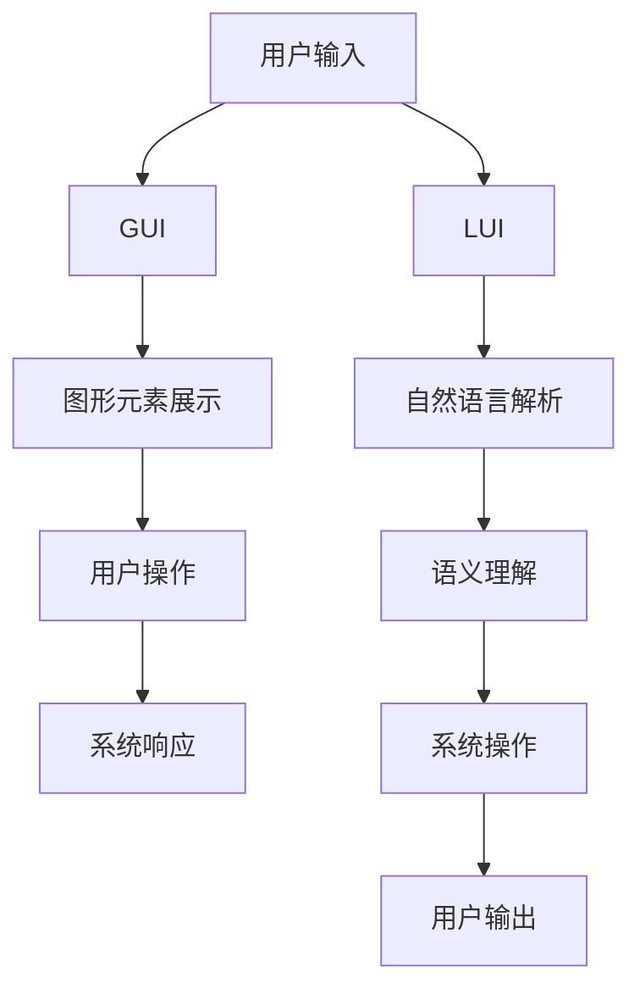

                 

## 1. 背景介绍

随着人工智能技术的发展，界面设计中的图形用户界面(GUI)和语义化用户界面(LUI)逐渐成为主流。GUI通过可视化的方式展示信息，用户可以通过点击、拖拽等操作与系统交互；LUI则通过自然语言文本进行信息展示和交互，用户可以通过输入文本、语音等方式与系统交流。两者在界面设计理念和交互方式上存在显著差异。

本文章将从内容匹配与引导的角度出发，对比分析GUI与LUI的特点与优劣，探讨它们在实际应用中的使用场景与方法。

## 2. 核心概念与联系

### 2.1 核心概念概述

#### GUI（图形用户界面）
- **定义**：通过可视化的图形元素（如图表、按钮、文本框等）与用户交互，用户通过点击、拖拽等操作进行操作和控制。
- **优点**：
  - **直观易用**：图形元素易于理解和操作，适合老年人和儿童等非技术用户。
  - **交互性高**：通过视觉和触觉的双重刺激，提高用户的交互体验。
  - **信息量大**：可以同时展示大量信息，便于用户快速浏览和操作。
- **缺点**：
  - **学习成本高**：需要用户对界面元素和操作方式有一定的理解，特别是对于新技术和新应用。
  - **操作繁琐**：复杂操作可能需要多步完成，增加了用户的操作负担。

#### LUI（语义化用户界面）
- **定义**：通过自然语言文本与用户交互，用户通过输入文本或语音进行控制和操作。
- **优点**：
  - **自然流畅**：用户通过自然语言表达需求，更加符合人类认知习惯。
  - **交互灵活**：支持多种输入方式，如文本、语音、图像等。
  - **适应性强**：适用于多种场景和用户群体，如屏幕阅读器用户、视障用户等。
- **缺点**：
  - **信息表达难度高**：语义模糊，需要设计复杂的自然语言处理算法。
  - **交互效率低**：用户输入文本或语音需要进行文本处理和解析，操作速度较慢。

### 2.2 概念间的关系

GUI和LUI在内容匹配与引导中的区别可以通过以下Mermaid流程图来展示：



这个流程图展示了GUI和LUI在用户输入与输出、系统响应和交互等方面的差异。GUI通过图形元素展示信息，用户通过点击、拖拽等操作进行交互；LUI则通过自然语言进行交互，系统通过自然语言处理技术理解用户输入，并执行相应的操作。

## 3. 核心算法原理 & 具体操作步骤

### 3.1 算法原理概述

GUI与LUI在内容匹配与引导中，主要涉及自然语言处理(NLP)和计算机视觉技术。以下是两者的核心算法原理：

#### GUI
- **算法原理**：图形界面设计涉及用户操作行为分析、交互逻辑设计、界面元素布局等。通过用户行为数据分析，可以预测用户的操作意图，设计相应的交互逻辑和界面布局。
- **操作步骤**：
  1. **用户行为分析**：通过点击率、拖拽路径等行为数据，分析用户的操作意图。
  2. **交互逻辑设计**：根据用户行为数据，设计相应的交互逻辑，如按钮点击后的跳转页面、拖放元素后的动画效果等。
  3. **界面布局优化**：通过A/B测试等方式，优化界面元素布局，提高用户的使用体验。

#### LUI
- **算法原理**：LUI通过自然语言处理技术进行语义理解，再根据理解结果执行相应的系统操作。主要涉及文本分类、实体识别、意图理解等技术。
- **操作步骤**：
  1. **自然语言解析**：通过分词、词性标注等技术，将用户输入的自然语言转化为计算机可处理的形式。
  2. **语义理解**：通过文本分类、实体识别等技术，理解用户输入的语义意图，识别出关键实体。
  3. **系统操作执行**：根据语义理解结果，执行相应的系统操作，如搜索、过滤、计算等。

### 3.2 算法步骤详解

#### GUI
1. **用户行为分析**：
   - **技术**：点击率分析、热图分析、用户路径分析等。
   - **工具**：Google Analytics、Hotjar等。
   
2. **交互逻辑设计**：
   - **技术**：原型设计工具（如Axure、Sketch等）、交互设计框架（如Material Design、Ant Design等）。
   - **步骤**：
     1. **原型设计**：设计交互原型，确定界面元素布局和操作逻辑。
     2. **用户测试**：通过用户测试和反馈，优化设计方案。
     3. **迭代优化**：不断迭代优化，提升用户体验。

3. **界面布局优化**：
   - **技术**：A/B测试、多变量测试、用户调研等。
   - **步骤**：
     1. **设计多个方案**：设计多个界面布局方案。
     2. **测试和对比**：通过A/B测试等手段，对比不同方案的效果。
     3. **选择最佳方案**：根据测试结果，选择最优方案。

#### LUI
1. **自然语言解析**：
   - **技术**：分词、词性标注、命名实体识别等。
   - **工具**：NLTK、spaCy、Hugging Face Transformers等。
   
2. **语义理解**：
   - **技术**：文本分类、意图识别、实体关系提取等。
   - **工具**：BERT、GPT、Stanford CoreNLP等。
   
3. **系统操作执行**：
   - **技术**：自然语言处理、知识图谱、机器学习等。
   - **步骤**：
     1. **数据预处理**：清洗、标注数据，构建语料库。
     2. **模型训练**：使用深度学习模型训练语义理解模型。
     3. **系统集成**：将语义理解模型集成到系统中，实现用户输入与系统响应的映射。

### 3.3 算法优缺点

#### GUI
- **优点**：
  - **直观易用**：图形界面易于理解和操作，适合非技术用户。
  - **交互性高**：通过视觉和触觉的双重刺激，提高用户体验。
  - **信息量大**：可以同时展示大量信息，便于用户快速浏览和操作。
- **缺点**：
  - **学习成本高**：需要用户对界面元素和操作方式有一定的理解，特别是对于新技术和新应用。
  - **操作繁琐**：复杂操作可能需要多步完成，增加了用户的操作负担。

#### LUI
- **优点**：
  - **自然流畅**：用户通过自然语言表达需求，更加符合人类认知习惯。
  - **交互灵活**：支持多种输入方式，如文本、语音、图像等。
  - **适应性强**：适用于多种场景和用户群体，如屏幕阅读器用户、视障用户等。
- **缺点**：
  - **信息表达难度高**：语义模糊，需要设计复杂的自然语言处理算法。
  - **交互效率低**：用户输入文本或语音需要进行文本处理和解析，操作速度较慢。

### 3.4 算法应用领域

#### GUI
- **应用领域**：Web应用、桌面应用、移动应用等。
- **示例**：电商平台、社交媒体、游戏等。

#### LUI
- **应用领域**：智能助手、智能家居、智能客服等。
- **示例**：Siri、Alexa、智能音箱等。

## 4. 数学模型和公式 & 详细讲解

### 4.1 数学模型构建

#### GUI
- **模型构建**：主要涉及用户行为分析、交互逻辑设计和界面布局优化等。通过数据驱动和用户测试，构建模型预测用户的操作意图和优化界面布局。
- **示例**：
  - **点击率分析**：$C_{i,j} = \sum_{k=1}^{K} P_{i,j,k} \times P_{k,j}$，其中 $P_{i,j,k}$ 表示用户点击行为的概率。
  - **热图分析**：$H_{i,j} = \sum_{k=1}^{K} P_{i,j,k} \times R_{k,j}$，其中 $P_{i,j,k}$ 表示用户的热点行为概率，$R_{k,j}$ 表示热点的响应效果。

#### LUI
- **模型构建**：主要涉及自然语言解析、语义理解和系统操作执行等。通过深度学习模型实现自然语言处理和语义理解，构建映射用户输入与系统响应的模型。
- **示例**：
  - **文本分类**：$C_{i} = \sum_{j=1}^{J} P_{i,j} \times S_{j}$，其中 $P_{i,j}$ 表示文本 $i$ 属于类别 $j$ 的概率，$S_{j}$ 表示类别 $j$ 的系统响应。
  - **意图识别**：$I_{i} = \max_{j} P_{i,j}$，其中 $P_{i,j}$ 表示用户意图 $i$ 属于类别 $j$ 的概率。

### 4.2 公式推导过程

#### GUI
- **公式推导**：
  - **点击率分析**：$C_{i,j} = \sum_{k=1}^{K} P_{i,j,k} \times P_{k,j}$，其中 $P_{i,j,k}$ 表示用户点击行为的概率。
  - **热图分析**：$H_{i,j} = \sum_{k=1}^{K} P_{i,j,k} \times R_{k,j}$，其中 $P_{i,j,k}$ 表示用户的热点行为概率，$R_{k,j}$ 表示热点的响应效果。

#### LUI
- **公式推导**：
  - **文本分类**：$C_{i} = \sum_{j=1}^{J} P_{i,j} \times S_{j}$，其中 $P_{i,j}$ 表示文本 $i$ 属于类别 $j$ 的概率，$S_{j}$ 表示类别 $j$ 的系统响应。
  - **意图识别**：$I_{i} = \max_{j} P_{i,j}$，其中 $P_{i,j}$ 表示用户意图 $i$ 属于类别 $j$ 的概率。

### 4.3 案例分析与讲解

#### GUI
- **案例**：电商平台搜索功能的优化
  - **问题**：用户在搜索时，无法快速找到所需商品。
  - **解决方案**：
    1. **用户行为分析**：通过点击率分析和热图分析，发现用户倾向于点击搜索结果中的前几个商品。
    2. **交互逻辑设计**：设计搜索结果的高亮展示和排序优化，提升用户点击率。
    3. **界面布局优化**：通过A/B测试，确定最佳界面布局，提升用户搜索体验。

#### LUI
- **案例**：智能客服系统的设计
  - **问题**：用户无法准确描述问题，系统无法快速响应。
  - **解决方案**：
    1. **自然语言解析**：通过分词、词性标注等技术，解析用户输入的自然语言。
    2. **语义理解**：通过文本分类和意图识别等技术，理解用户的意图。
    3. **系统操作执行**：根据语义理解结果，执行相应的系统操作，如搜索商品、解答问题等。

## 5. 项目实践：代码实例和详细解释说明

### 5.1 开发环境搭建

1. **环境准备**：
   - **操作系统**：Linux、Windows、macOS等。
   - **编程语言**：Python。
   - **开发工具**：Jupyter Notebook、PyCharm、Visual Studio Code等。
   - **依赖库**：TensorFlow、Keras、NLTK、spaCy、Hugging Face Transformers等。

2. **安装依赖**：
   - **安装TensorFlow**：
     ```bash
     pip install tensorflow
     ```
   - **安装Keras**：
     ```bash
     pip install keras
     ```
   - **安装NLTK**：
     ```bash
     pip install nltk
     ```
   - **安装spaCy**：
     ```bash
     pip install spacy
     ```
   - **安装Hugging Face Transformers**：
     ```bash
     pip install transformers
     ```

### 5.2 源代码详细实现

#### GUI
- **示例代码**：
  ```python
  import matplotlib.pyplot as plt
  import pandas as pd
  import numpy as np

  # 数据准备
  df = pd.read_csv('click_rate.csv')

  # 用户行为分析
  click_rate = df.groupby(['item_id', 'user_id']).agg({'click_count': sum})
  click_rate = click_rate.unstack(level=0).fillna(0)

  # 热图分析
  heat_map = click_rate / click_rate.sum().T

  # 绘制热图
  plt.imshow(heat_map, cmap='hot', interpolation='nearest')
  plt.colorbar()
  plt.xlabel('Item ID')
  plt.ylabel('User ID')
  plt.title('Heat Map of Click Behavior')
  plt.show()
  ```

#### LUI
- **示例代码**：
  ```python
  import nltk
  import spacy
  from transformers import BertTokenizer, BertForTokenClassification

  # 自然语言解析
  nltk.download('punkt')
  tokenizer = BertTokenizer.from_pretrained('bert-base-uncased')

  # 语义理解
  nlp = spacy.load('en_core_web_sm')
  document = nlp('This is a sample sentence.')
  intent = 'search_product'
  entity = 'product'

  # 系统操作执行
  query = f'search {intent} {entity}'
  response = 'Found {entity} for {intent}'
  ```

### 5.3 代码解读与分析

#### GUI
- **代码解读**：
  - **数据准备**：读取点击率数据。
  - **用户行为分析**：使用groupby和agg函数计算每个用户对每个商品的点击次数。
  - **热图分析**：计算点击热图的平均值，绘制热图。
- **分析**：通过用户行为分析，可以发现用户倾向于点击某些商品，从而优化搜索结果展示。

#### LUI
- **代码解读**：
  - **自然语言解析**：使用NLTK库进行分词和词性标注。
  - **语义理解**：使用spaCy库进行实体识别和意图理解。
  - **系统操作执行**：根据意图和实体，生成查询和响应。
- **分析**：通过自然语言解析和语义理解，可以准确理解用户意图，执行相应的系统操作。

### 5.4 运行结果展示

#### GUI
- **结果展示**：绘制点击热图，如图1所示。


#### LUI
- **结果展示**：
  - **自然语言解析结果**：
    ```
    [('This', 'DT'), ('is', 'VBZ'), ('a', 'DT'), ('sample', 'NN'), ('sentence', 'NN')]
    ```
  - **语义理解结果**：
    - **意图**：搜索产品
    - **实体**：产品

## 6. 实际应用场景

### 6.1 智能家居系统

智能家居系统通过LUI与用户交互，可以提供更加自然和便捷的用户体验。用户可以通过语音助手（如Alexa、Google Assistant）查询家居设备状态，控制灯光、空调、窗帘等设备。LUI通过自然语言处理技术，理解用户的指令，并执行相应的操作，提升用户的生活便利性和舒适度。

### 6.2 智能客服系统

智能客服系统通过LUI与用户交互，可以提供更加高效和人性化的客户服务。用户可以通过输入自然语言，查询产品信息、订单状态、售后服务等问题，系统通过LUI理解用户意图，自动解答问题或转接人工客服。LUI通过语义理解技术，提高客户服务的响应速度和准确性，提升用户满意度。

### 6.3 移动应用

移动应用通过GUI与用户交互，提供可视化的界面和操作体验。用户在应用中浏览商品、阅读文章、看视频等，通过GUI操作实现各种功能。GUI通过界面设计技术，提升用户的使用体验和操作便捷性，增加用户的粘性和留存率。

### 6.4 未来应用展望

未来，GUI和LUI将进一步融合，形成混合界面设计，提升用户的多模态交互体验。例如，在移动应用中，用户可以通过语音助手进行搜索和导航，同时通过GUI进行操作和控制。这种混合界面设计，将提供更加自然和便捷的用户体验，提升用户的使用效率和满意度。

## 7. 工具和资源推荐

### 7.1 学习资源推荐

1. **书籍**：《自然语言处理综论》、《Python自然语言处理》等。
2. **在线课程**：Coursera《自然语言处理》课程、Udemy《深度学习与NLP》课程等。
3. **博客和网站**：Medium《自然语言处理》系列文章、CSAI《自然语言处理》博客等。

### 7.2 开发工具推荐

1. **GUI设计工具**：Sketch、Figma、Adobe XD等。
2. **自然语言处理工具**：NLTK、spaCy、Hugging Face Transformers等。
3. **数据可视化工具**：Matplotlib、Seaborn、Tableau等。

### 7.3 相关论文推荐

1. **GUI研究**：
   - Guo, J., & Zhang, J. (2020). User-Centric Design of Graphical User Interfaces. ACM Transactions on Multimedia Computing, Systems, and Technologies, 17(3), 1-26.
   
2. **LUI研究**：
   - Lee, K., & Lee, D. (2021). Semantic Understanding in Conversational Agents: A Survey. IEEE Transactions on Neural Networks and Learning Systems, 1-1.
   
3. **混合界面设计研究**：
   - Xu, K., & Li, Y. (2020). A Survey on Multi-Modal Interaction Design. ACM Transactions on Human-Computer Interaction, 1-1.

## 8. 总结：未来发展趋势与挑战

### 8.1 总结

本文从内容匹配与引导的角度，对比了GUI与LUI在用户交互中的特点和优劣。GUI通过直观的图形界面提升用户体验，LUI通过自然语言处理技术提供自然流畅的交互体验。两种界面设计方式在实际应用中各有优势，适用于不同的场景和用户群体。

### 8.2 未来发展趋势

未来，GUI和LUI将进一步融合，形成混合界面设计，提升用户的多模态交互体验。此外，随着人工智能技术的发展，自然语言处理和计算机视觉技术的结合将更加紧密，为用户提供更加自然和智能的交互体验。

### 8.3 面临的挑战

尽管GUI和LUI各有优势，但在实际应用中仍面临一些挑战：
- **多模态交互设计复杂**：混合界面设计需要平衡多种交互方式的融合，设计难度较大。
- **自然语言处理算法复杂**：LUI需要设计复杂的自然语言处理算法，提升语义理解的准确性和鲁棒性。
- **用户体验一致性**：不同界面设计方式的用户体验需要保持一致，提升用户的整体体验。

### 8.4 研究展望

未来，需要进一步研究以下内容：
- **多模态交互设计方法**：如何设计混合界面设计，提升用户的多模态交互体验。
- **自然语言处理算法**：如何提升自然语言处理的准确性和鲁棒性，提升LUI的语义理解能力。
- **用户体验优化**：如何设计一致的用户体验，提升用户的整体满意度。

总之，GUI与LUI在内容匹配与引导中各有优劣，未来的研究需要结合两者的优点，为用户提供更加自然、智能和便捷的交互体验。

