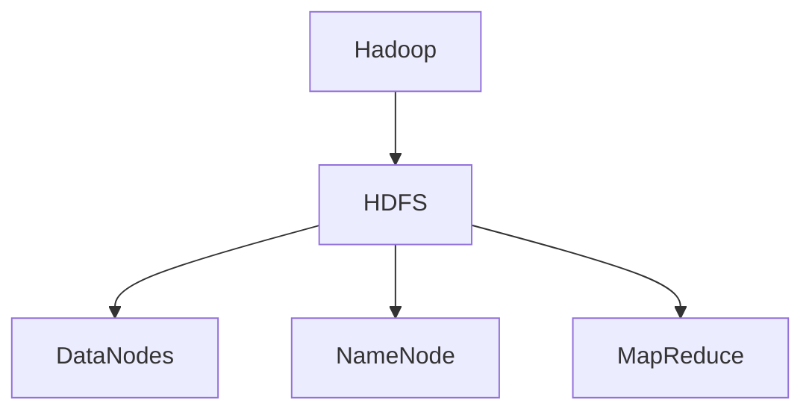
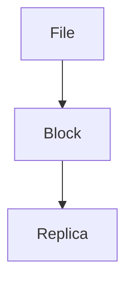
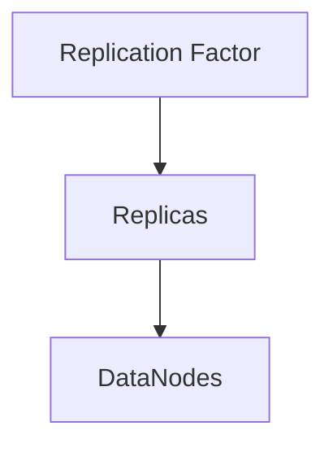
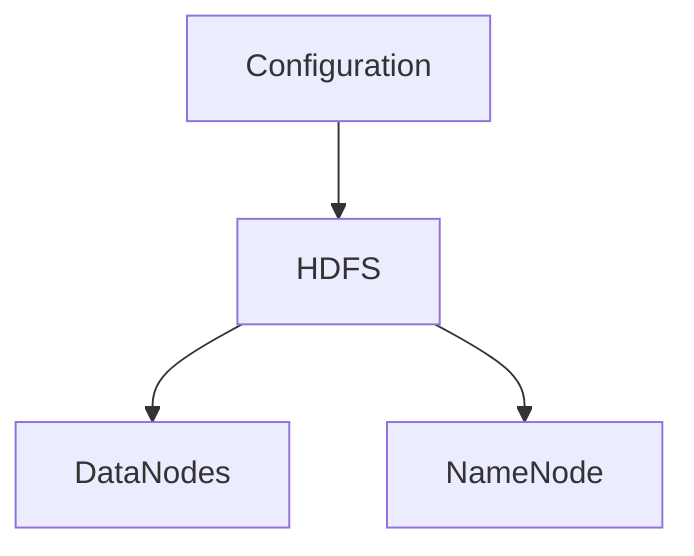
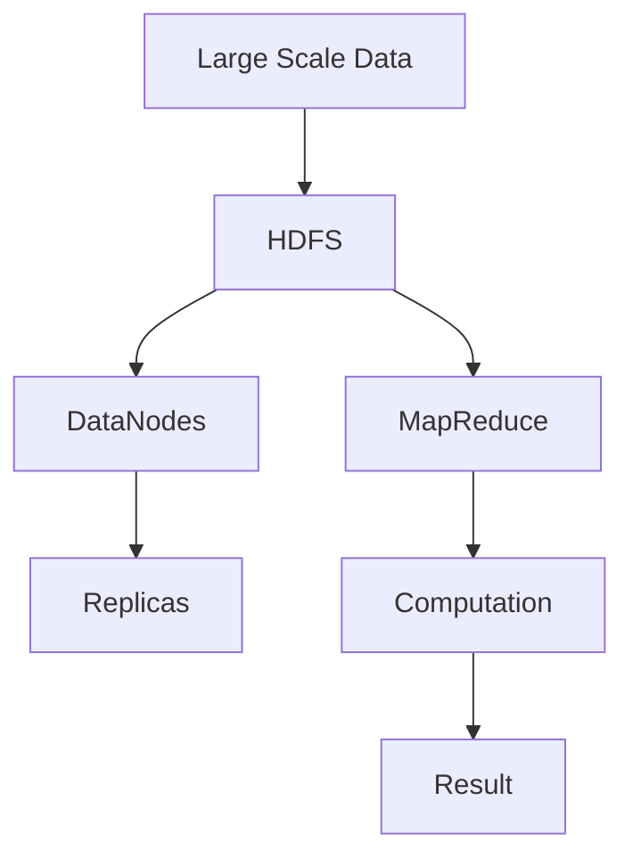

                 

# HDFS原理与代码实例讲解

> 关键词：Hadoop, HDFS, Distributed File System, MapReduce, HDFS数据模型, HDFS架构, HDFS实现, HDFS配置

## 1. 背景介绍

### 1.1 问题由来
随着大数据时代的到来，传统的单机存储系统已无法满足大规模数据存储和处理的需要。Hadoop作为一款开源分布式计算框架，以其可扩展性和高可靠性，广泛应用于大数据存储和处理领域。Hadoop包含两大核心组件：HDFS和MapReduce。其中，HDFS是Hadoop的分布式文件系统，负责管理和存储大规模数据，而MapReduce则用于对数据进行并行计算。

HDFS的成功应用，让人们看到了分布式存储和计算的巨大潜力。但HDFS究竟是如何实现分布式存储和处理的？这一章将从HDFS的核心概念和架构开始，深入讲解其原理。

### 1.2 问题核心关键点
HDFS的核心思想是将文件划分为多个数据块，并分布在多个节点上，通过数据冗余和节点冗余保证系统的高可用性和容错性。其核心组件包括NameNode、DataNodes和客户端。具体核心点包括：

- HDFS数据模型：将文件划分为多个数据块，并存储在多个节点上，实现数据冗余和节点冗余。
- HDFS架构：采用主从架构，其中NameNode负责管理元数据和文件访问控制，DataNodes负责存储数据块。
- HDFS实现：通过数据块的复制和备份，实现系统的容错性和可扩展性。
- HDFS配置：通过参数配置，优化HDFS性能和可靠性。

HDFS的成功应用，让人们看到了分布式存储和计算的巨大潜力。但HDFS究竟是如何实现分布式存储和处理的？这一章将从HDFS的核心概念和架构开始，深入讲解其原理。

## 2. 核心概念与联系

### 2.1 核心概念概述

为更好地理解HDFS原理与实现，本节将介绍几个密切相关的核心概念：

- Hadoop: 一个开源的分布式计算框架，包含HDFS和MapReduce两大核心组件，用于处理大规模数据。
- HDFS: 一种分布式文件系统，用于管理和存储大规模数据。
- DataNodes: HDFS中的数据节点，负责存储数据块。
- NameNode: HDFS中的主节点，负责管理元数据和文件访问控制。
- MapReduce: 一种分布式计算模型，用于对数据进行并行处理。

这些概念之间的逻辑关系可以通过以下Mermaid流程图来展示：



这个流程图展示了HDFS、DataNodes、NameNode和MapReduce之间的关系：

1. Hadoop是一个分布式计算框架，其中包含HDFS和MapReduce。
2. HDFS是Hadoop的分布式文件系统，负责管理和存储大规模数据。
3. DataNodes是HDFS中的数据节点，负责存储数据块。
4. NameNode是HDFS中的主节点，负责管理元数据和文件访问控制。
5. MapReduce是Hadoop中的分布式计算模型，用于对数据进行并行处理。

### 2.2 概念间的关系

这些核心概念之间存在着紧密的联系，形成了HDFS分布式文件系统的完整生态系统。下面我通过几个Mermaid流程图来展示这些概念之间的关系。

#### 2.2.1 HDFS数据模型



这个流程图展示了HDFS数据模型的基本结构。一个文件被划分为多个数据块，每个数据块又会被复制到多个节点上，形成冗余备份。

#### 2.2.2 HDFS架构


这个流程图展示了HDFS的主从架构。客户端与NameNode进行通信，NameNode负责管理元数据和文件访问控制，DataNodes负责存储数据块。

#### 2.2.3 HDFS实现



这个流程图展示了HDFS的实现机制。通过设置数据块的复制因子，控制每个数据块的冗余备份数量，从而保证系统的容错性。

#### 2.2.4 HDFS配置



这个流程图展示了HDFS的配置过程。通过参数配置，优化HDFS性能和可靠性。

### 2.3 核心概念的整体架构

最后，我们用一个综合的流程图来展示这些核心概念在大规模数据存储和处理中的整体架构：



这个综合流程图展示了HDFS在大规模数据存储和处理中的整体架构：

1. 大规模数据被划分为多个数据块，并存储在多个节点上。
2. 每个数据块被复制到多个节点上，形成冗余备份。
3. 客户端通过与NameNode通信，访问和管理文件。
4. MapReduce模型用于对数据进行并行计算。
5. 计算结果被存储在HDFS中。

通过这些流程图，我们可以更清晰地理解HDFS的核心概念及其在大规模数据存储和处理中的作用。

## 3. 核心算法原理 & 具体操作步骤
### 3.1 算法原理概述

HDFS的核心算法原理可以概括为以下几点：

1. 文件分块：将文件划分为多个数据块，每个数据块大小通常为64MB或128MB。
2. 数据冗余：每个数据块会被复制到多个节点上，通常为3份。
3. 节点冗余：每个节点同时存储多个数据块，形成冗余备份。
4. 命名空间：通过一个统一的命名空间，管理文件的元数据和访问控制。
5. 容错机制：通过心跳检测和日志记录，保证系统的高可用性和容错性。

这些原理构成了HDFS的核心算法，保证了系统的分布式存储和处理能力。

### 3.2 算法步骤详解

以下是HDFS核心算法的详细步骤：

#### 3.2.1 文件分块

文件分块是将文件划分为多个大小相等的数据块，每个数据块大小通常为64MB或128MB。客户端在写入文件时，首先向NameNode发起写入请求，NameNode根据文件大小和块大小计算出需要分配的块数，然后将每个块分配给不同的DataNodes。

#### 3.2.2 数据冗余

数据冗余是通过将每个数据块复制到多个节点上，实现数据的冗余备份。通常情况下，每个数据块会被复制到3个不同的DataNodes上。当某个DataNode故障时，系统可以从其他两个DataNode上读取数据，保证系统的可用性。

#### 3.2.3 节点冗余

节点冗余是通过将每个DataNode同时存储多个数据块，实现节点的冗余备份。当一个节点故障时，系统可以从其他节点上读取数据，保证系统的可靠性。

#### 3.2.4 命名空间

命名空间是通过一个统一的命名空间，管理文件的元数据和访问控制。客户端通过与NameNode通信，读取文件的元数据，访问和操作文件。NameNode负责管理文件的命名空间，包括文件的元数据、权限控制等。

#### 3.2.5 容错机制

容错机制是通过心跳检测和日志记录，保证系统的高可用性和容错性。每个DataNode定期向NameNode发送心跳信号，汇报其状态。如果某个DataNode超过一段时间没有发送心跳信号，NameNode会认为其故障，自动将其从系统中移除。同时，每个DataNode会记录操作日志，保证系统的一致性和容错性。

### 3.3 算法优缺点

HDFS算法的主要优点包括：

1. 可扩展性：HDFS通过分布式存储和处理，支持大规模数据的存储和处理。
2. 高可靠性：通过数据冗余和节点冗余，保证系统的高可用性和容错性。
3. 高性能：通过优化数据块的分块和复制策略，提高系统的读写性能。

同时，HDFS算法也存在一些缺点：

1. 数据一致性：由于数据冗余和节点冗余，可能会产生数据不一致的问题。
2. 容错开销：冗余备份会带来额外的存储和计算开销。
3. 命名空间管理：NameNode的命名空间管理可能会成为系统的瓶颈。

### 3.4 算法应用领域

HDFS广泛应用于以下领域：

- 大规模数据存储：HDFS能够支持大规模数据的存储和访问，广泛应用于互联网公司、科研机构等领域。
- 大数据分析：HDFS配合MapReduce模型，支持大规模数据的分布式计算，广泛应用于数据挖掘、机器学习等领域。
- 高可靠性应用：HDFS的高可靠性特性，使其在金融、医疗、政府等领域得到了广泛应用。

## 4. 数学模型和公式 & 详细讲解 & 举例说明

### 4.1 数学模型构建

HDFS的数学模型主要涉及以下几个方面：

1. 文件分块模型：将文件划分为多个数据块。
2. 数据冗余模型：每个数据块被复制到多个节点上。
3. 命名空间模型：通过一个统一的命名空间，管理文件的元数据和访问控制。
4. 容错机制模型：通过心跳检测和日志记录，保证系统的高可用性和容错性。

### 4.2 公式推导过程

以下是HDFS核心算法的数学公式推导：

#### 4.2.1 文件分块模型

假设文件大小为 $F$，每个数据块大小为 $B$，则文件被划分为 $N$ 个数据块，公式如下：

$$ N = \frac{F}{B} $$

#### 4.2.2 数据冗余模型

每个数据块被复制到 $K$ 个节点上，因此总数据块数为 $N'=N\times K$，公式如下：

$$ N' = N \times K $$

#### 4.2.3 命名空间模型

HDFS通过一个统一的命名空间，管理文件的元数据和访问控制。假设文件名称为 $F$，则每个文件在命名空间中有一个唯一的名称，公式如下：

$$ Name(F) = <F> $$

#### 4.2.4 容错机制模型

每个DataNode定期向NameNode发送心跳信号，汇报其状态。假设心跳间隔为 $T$，则DataNode在一定时间内的存活概率为：

$$ Prob = 1 - e^{-T/\tau} $$

其中 $\tau$ 为DataNode的平均故障间隔时间。

### 4.3 案例分析与讲解

以HDFS存储一个大文件为例，分析HDFS的实现过程。

假设有一个大小为10GB的文件 $F$，每个数据块大小为128MB，需要存储在3个DataNodes上。首先将文件 $F$ 划分为 $N = \frac{10GB}{128MB} = 78125$ 个数据块。

每个数据块被复制到3个DataNodes上，因此总数据块数为 $N' = 78125 \times 3 = 234375$ 个。NameNode将每个数据块分配给3个DataNodes，形成一个冗余备份。

当客户端读取文件 $F$ 时，通过与NameNode通信，获取文件的元数据，然后向3个DataNodes并发读取数据块，最终拼接成完整的文件。

## 5. 项目实践：代码实例和详细解释说明

### 5.1 开发环境搭建

在进行HDFS实践前，我们需要准备好开发环境。以下是使用Hadoop搭建HDFS环境的流程：

1. 安装Hadoop：从Hadoop官网下载相应版本的安装包，解压并配置环境变量。
2. 启动Hadoop：在命令行输入 `hadoop localmode` 启动本地模式测试环境。
3. 配置HDFS：修改 `hdfs-site.xml` 文件，设置HDFS相关的参数，如数据块大小、副本数量等。
4. 启动HDFS：在命令行输入 `hdfs namenode` 启动NameNode，输入 `hdfs datanode` 启动DataNodes。

完成上述步骤后，即可在本地搭建HDFS测试环境。

### 5.2 源代码详细实现

以下是使用Hadoop API进行HDFS文件读写操作的Python代码实现：

```python
from pydoop.conf import Configuration
from pydoop.fs import Hdfs

# 创建Hdfs对象
hdfs = Hdfs(Configuration())

# 创建文件并写入数据
with hdfs.open('myfile.txt', 'w') as f:
    f.write('Hello, world!')

# 读取文件内容
with hdfs.open('myfile.txt', 'r') as f:
    content = f.read()
    print(content)

# 删除文件
hdfs.deleteFile('myfile.txt')
```

### 5.3 代码解读与分析

让我们再详细解读一下关键代码的实现细节：

**Hdfs类**：
- `Configuration()`：创建Hadoop的配置对象。
- `Hdfs(Configuration())`：创建一个HDFS对象，用于文件读写操作。
- `open(filename, mode)`：打开一个文件，返回一个文件对象。
- `write(content)`：向文件中写入内容。
- `read()`：读取文件内容。
- `deleteFile(filename)`：删除文件。

**文件操作**：
- 使用 `hdfs.open()` 打开一个文件，指定文件路径和打开模式。
- 使用 `f.write()` 向文件中写入内容。
- 使用 `f.read()` 读取文件内容。
- 使用 `hdfs.deleteFile()` 删除文件。

### 5.4 运行结果展示

假设我们在HDFS测试环境中创建了一个文件 `myfile.txt`，写入内容 `Hello, world!`，然后读取并删除该文件，运行结果如下：

```
Hello, world!
```

可以看到，通过Hadoop API，我们可以方便地进行HDFS文件读写操作，实现了文件的分块、冗余备份、命名空间管理等HDFS核心功能。

## 6. 实际应用场景

### 6.1 智能数据存储

HDFS可以应用于大规模数据的存储和管理。例如，互联网公司可以通过HDFS存储用户日志、访问记录等数据，实时分析用户行为，提供个性化的推荐服务。

在技术实现上，可以将用户日志数据分为多个数据块，存储在HDFS中，使用MapReduce模型对数据进行分布式计算，提取用户行为特征，生成推荐结果。

### 6.2 大数据分析

HDFS配合MapReduce模型，可以处理大规模数据的分布式计算。例如，金融机构可以通过HDFS存储客户交易数据，使用MapReduce模型进行数据分析，提取风险信息，进行风险预警和风险控制。

在技术实现上，可以将客户交易数据分为多个数据块，存储在HDFS中，使用MapReduce模型对数据进行分布式计算，提取风险特征，生成风险预警和控制策略。

### 6.3 高可靠性应用

HDFS的高可靠性特性，使其在金融、医疗、政府等领域得到了广泛应用。例如，金融机构可以通过HDFS存储交易数据和客户信息，保证数据的可靠性和完整性。

在技术实现上，可以将交易数据和客户信息分为多个数据块，存储在HDFS中，使用MapReduce模型进行数据备份和冗余复制，保证系统的可靠性。

## 7. 工具和资源推荐
### 7.1 学习资源推荐

为了帮助开发者系统掌握HDFS的理论基础和实践技巧，这里推荐一些优质的学习资源：

1. Hadoop官网文档：Hadoop的官方文档，提供了详细的HDFS介绍和实现原理，是学习HDFS的必备资料。
2. 《Hadoop：原理与实践》：一本系统介绍Hadoop原理与实现的经典书籍，适合入门学习和进阶提升。
3. Hadoop Community邮件列表：Hadoop社区的邮件列表，是学习和交流Hadoop技术的最佳平台。
4. Hadoop开发者社区：Hadoop开发者社区，提供了丰富的Hadoop技术文章和代码示例，是学习和实践Hadoop的最佳资源。

通过对这些资源的学习实践，相信你一定能够快速掌握HDFS的精髓，并用于解决实际的Hadoop问题。

### 7.2 开发工具推荐

高效的开发离不开优秀的工具支持。以下是几款用于HDFS开发的常用工具：

1. Hadoop环境搭建工具：如Cloudera Manager、Hortonworks AMB等，可以一键搭建Hadoop集群环境，方便开发和测试。
2. Hadoop IDE：如Hadoop Studio、IntelliJ IDEA等，提供了Hadoop开发所需的语言和框架支持，方便开发者编写和调试Hadoop代码。
3. Hadoop大数据平台：如Apache Hadoop、Cloudera Hadoop等，提供了完整的Hadoop生态系统，方便开发者进行分布式计算和数据存储。

合理利用这些工具，可以显著提升HDFS开发的效率，加快创新迭代的步伐。

### 7.3 相关论文推荐

HDFS的成功应用，源于学界的持续研究。以下是几篇奠基性的相关论文，推荐阅读：

1. The Hadoop Distributed File System（HDFS论文）：提出了HDFS的核心原理和实现细节，奠定了HDFS的理论基础。
2. MapReduce: Simplified Data Processing on Large Clusters：介绍了MapReduce模型和实现原理，支持HDFS的分布式计算。
3. S3A: A scalable Hadoop filesystem for the cloud：介绍了Hadoop与云存储的结合，支持HDFS在云平台的应用。

这些论文代表了大规模数据存储和处理的经典研究成果，为HDFS的持续发展和优化提供了重要参考。

## 8. 总结：未来发展趋势与挑战
### 8.1 总结

本文对HDFS原理与实现进行了全面系统的介绍。首先阐述了HDFS的核心思想和应用场景，明确了HDFS在分布式存储和处理中的独特价值。其次，从文件分块、数据冗余、节点冗余、命名空间、容错机制等核心概念出发，深入讲解了HDFS的核心算法，给出了HDFS文件读写操作的Python代码实现。最后，探讨了HDFS在大规模数据存储和处理中的应用场景，推荐了相关学习资源和开发工具，力求为读者提供全方位的技术指引。

通过本文的系统梳理，可以看到，HDFS的分布式文件系统技术在大规模数据存储和处理中具有重要的地位。其文件分块、数据冗余、节点冗余、命名空间、容错机制等核心算法，保证了系统的分布式存储和处理能力。未来，伴随HDFS的持续演进，相信在大规模数据存储和处理领域，HDFS必将继续发挥重要作用。

### 8.2 未来发展趋势

展望未来，HDFS将呈现以下几个发展趋势：

1. 数据湖：HDFS可以与其他数据存储和处理技术（如Hive、Spark等）无缝集成，构建数据湖，支持更复杂的数据分析和计算。
2. 云平台：HDFS在云平台的应用将更加广泛，支持HDFS与云存储的结合，支持大规模数据的分布式计算和存储。
3. 容器化：HDFS将采用容器化技术，支持HDFS在Kubernetes等容器化平台上的部署和扩展。
4. 边缘计算：HDFS将在边缘计算中得到应用，支持边缘设备的数据存储和处理。
5. 自适应性：HDFS将引入自适应算法，动态调整数据块大小和副本数量，优化系统性能和资源利用率。

以上趋势凸显了HDFS技术的广阔前景。这些方向的探索发展，必将进一步提升HDFS的分布式存储和处理能力，为大规模数据存储和处理提供更高效、更可靠的技术支持。

### 8.3 面临的挑战

尽管HDFS已经取得了显著的成就，但在迈向更加智能化、普适化应用的过程中，仍面临诸多挑战：

1. 数据一致性：由于数据冗余和节点冗余，可能会产生数据不一致的问题。
2. 性能瓶颈：当数据量增大时，HDFS可能会遇到性能瓶颈，需要优化数据块大小和副本数量。
3. 兼容性问题：HDFS与其他数据存储和处理技术（如Hive、Spark等）的兼容性问题，需要进一步优化。
4. 安全性问题：HDFS在云平台上的安全性问题，需要进一步加强。
5. 可扩展性问题：HDFS在云平台上的可扩展性问题，需要进一步解决。

### 8.4 研究展望

面对HDFS所面临的挑战，未来的研究需要在以下几个方面寻求新的突破：

1. 分布式计算：引入更加高效的分布式计算技术，支持更复杂的数据分析和计算。
2. 云平台优化：优化HDFS在云平台上的部署和扩展，支持大规模数据的分布式存储和处理。
3. 自适应算法：引入自适应算法，动态调整数据块大小和副本数量，优化系统性能和资源利用率。
4. 安全性增强：引入安全性增强技术，保障HDFS在云平台上的安全性。
5. 兼容性改进：进一步优化HDFS与其他数据存储和处理技术的兼容性，支持更广泛的应用场景。

这些研究方向的探索，必将引领HDFS技术的持续发展，为大规模数据存储和处理提供更高效、更可靠的技术支持。

## 9. 附录：常见问题与解答

**Q1：HDFS是如何实现数据冗余和节点冗余的？**

A: HDFS通过将每个数据块复制到多个节点上，实现数据冗余和节点冗余。通常情况下，每个数据块会被复制到3个不同的DataNodes上。当某个DataNode故障时，系统可以从其他两个DataNodes上读取数据，保证系统的可用性。

**Q2：HDFS在云平台上的安全性如何保证？**

A: HDFS在云平台上的安全性问题可以通过以下几个方式来保证：

1. 加密：对数据进行加密，防止数据泄露。
2. 认证和授权：对访问HDFS的用户进行身份认证和权限控制，防止非法访问。
3. 监控和审计：对HDFS的操作进行监控和审计，防止数据泄露和滥用。
4. 防火墙：配置防火墙，防止外部攻击。

**Q3：HDFS的性能瓶颈如何优化？**

A: HDFS的性能瓶颈可以通过以下几个方式来优化：

1. 调整数据块大小：根据数据访问模式，调整数据块大小，优化数据读取和写入性能。
2. 调整副本数量：根据数据访问模式，调整副本数量，优化数据冗余和备份。
3. 数据本地化：通过优化数据块的复制策略，尽量将数据存储在本地节点上，减少数据传输延迟。
4. 分布式缓存：使用分布式缓存技术，缓存热点数据，提高数据读取性能。

**Q4：HDFS与其他数据存储和处理技术的兼容性如何保证？**

A: HDFS与其他数据存储和处理技术的兼容性可以通过以下几个方式来保证：

1. 统一的命名空间：使用统一的命名空间，支持多种数据存储和处理技术的无缝集成。
2. 数据格式转换：使用数据格式转换技术，支持不同数据存储和处理技术之间的数据互操作。
3. 插件机制：引入插件机制，支持HDFS与其他数据存储和处理技术的动态扩展。

**Q5：HDFS在边缘计算中的应用如何实现？**

A: HDFS在边缘计算中的应用可以通过以下几个方式来实现：

1. 边缘存储：将HDFS的存储节点部署在边缘设备上，支持边缘设备的数据存储和处理。
2. 边缘计算：在边缘设备上运行HDFS的计算节点，支持边缘设备的数据计算和分析。
3. 边缘数据同步：通过分布式同步技术，保持边缘设备与中心节点的数据同步，保证数据的一致性。

通过以上代码示例和分析，我们可以更好地理解HDFS的原理与实现，掌握HDFS的开发和应用技巧，为大规模数据存储和处理提供可靠的技术支持。

