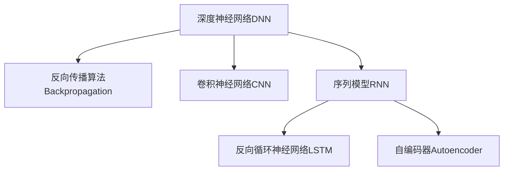
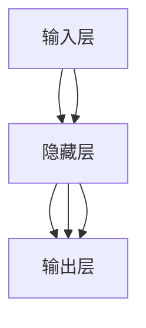
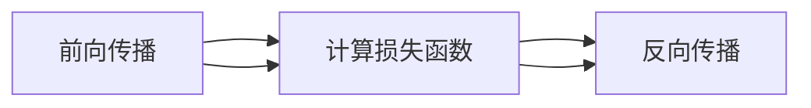
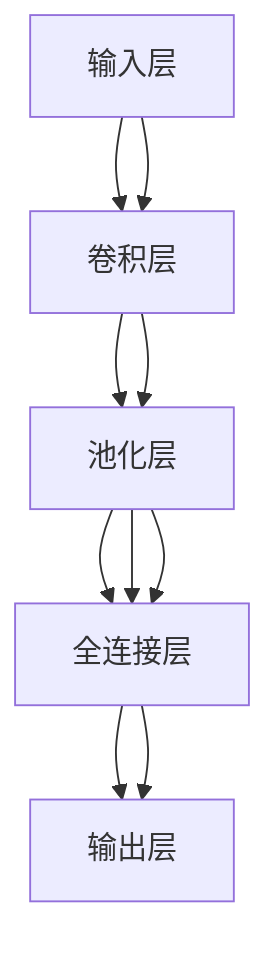
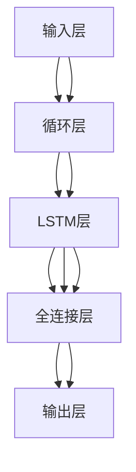
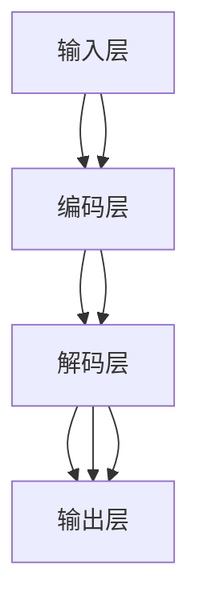
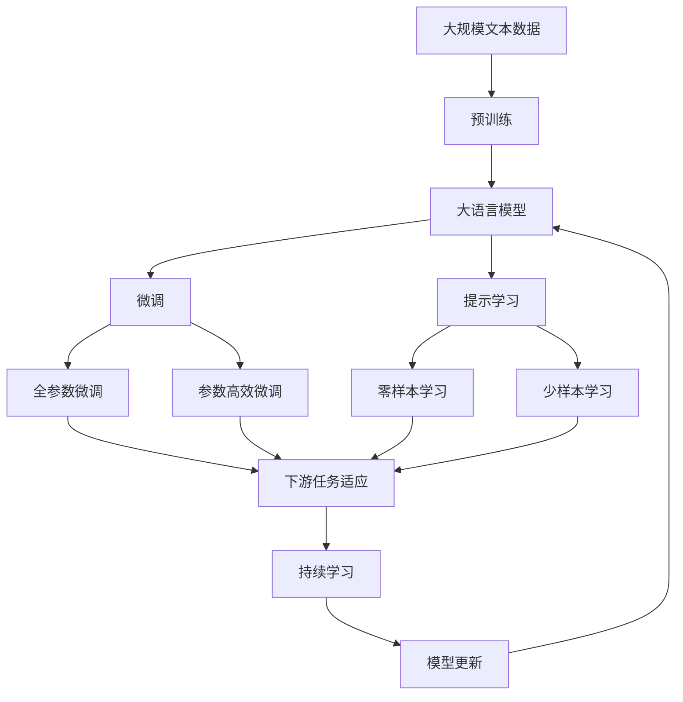

                 

## 1. 背景介绍

### 1.1 问题由来

随着人工智能技术的飞速发展，深度学习成为推动其前进的核心动力。在深度学习的发展过程中，有三位杰出的科学家对AI的算法和架构产生了深远的影响。他们分别是**Geoffrey Hinton**、**Yann LeCun**和**Yoshua Bengio**。Hinton在深度神经网络（DNN）和反向传播（Backpropagation）算法方面的贡献，LeCun在卷积神经网络（CNN）和图像处理方面的贡献，以及Bengio在序列模型（如循环神经网络RNN）和自然语言处理（NLP）方面的贡献，共同奠定了现代AI算法的基础。本文将详细介绍这三位的贡献，以及他们的工作如何影响当今人工智能的发展。

### 1.2 问题核心关键点

Hinton、LeCun和Bengio的工作主要集中在以下几个关键领域：

- **深度神经网络（DNN）和反向传播算法**：通过反向传播算法，深度学习模型可以实现多层的权重更新，从而提高模型性能。
- **卷积神经网络（CNN）**：CNN在图像识别和分类任务中取得了显著成效，标志着图像处理领域的一次重大突破。
- **序列模型（RNN）**：RNN能够处理序列数据，如时间序列、文本等，是处理自然语言、音频等时序数据的核心技术。

### 1.3 问题研究意义

这三位科学家的工作不仅推动了深度学习技术的发展，也为人工智能的广泛应用奠定了基础。深度学习模型的成功应用使得AI技术在图像识别、语音识别、自然语言处理、机器翻译等领域取得了重大进展，加速了AI技术的产业化进程。

## 2. 核心概念与联系

### 2.1 核心概念概述

为了更好地理解Hinton、LeCun和Bengio的贡献，本节将介绍几个密切相关的核心概念：

- **深度神经网络（DNN）**：通过多个层次的非线性映射，DNN能够处理复杂的数据结构，是深度学习的基础模型。
- **反向传播算法（Backpropagation）**：通过链式法则，反向传播算法可以高效地计算梯度，从而更新DNN的权重，实现模型的训练。
- **卷积神经网络（CNN）**：利用卷积操作提取局部特征，CNN在图像处理中表现优异，被广泛应用于计算机视觉领域。
- **序列模型（如RNN）**：通过时序依赖关系，序列模型能够处理序列数据，并在自然语言处理中得到了广泛应用。
- **反向循环神经网络（LSTM）**：为了解决RNN的梯度消失问题，LSTM引入了记忆单元，提升了序列模型的性能。
- **自编码器（Autoencoder）**：通过重构原始数据，自编码器能够学习数据的低维表示，是深度学习中的一种重要结构。

这些核心概念之间的逻辑关系可以通过以下Mermaid流程图来展示：



这个流程图展示了大语言模型的核心概念及其之间的关系：

1. 深度神经网络通过反向传播算法训练，得到有效的权重更新。
2. 卷积神经网络专门用于图像处理，具有局部连接和权重共享的特点。
3. 序列模型如RNN、LSTM等，能够处理时序数据，是自然语言处理的核心。
4. 自编码器通过重构数据，学习数据的低维表示，适用于无监督学习任务。

### 2.2 概念间的关系

这些核心概念之间存在着紧密的联系，形成了深度学习模型的完整生态系统。下面我通过几个Mermaid流程图来展示这些概念之间的关系。

#### 2.2.1 深度神经网络的结构与功能



这个流程图展示了深度神经网络的基本结构，包括输入层、隐藏层和输出层。

#### 2.2.2 反向传播算法的计算过程



这个流程图展示了反向传播算法的基本流程：首先进行前向传播计算损失函数，然后进行反向传播计算梯度，更新权重。

#### 2.2.3 卷积神经网络的基本结构



这个流程图展示了卷积神经网络的基本结构，包括卷积层、池化层和全连接层。

#### 2.2.4 序列模型与LSTM的结构



这个流程图展示了序列模型的基本结构，包括循环层、LSTM层和全连接层。

#### 2.2.5 自编码器的重构过程



这个流程图展示了自编码器的基本结构，包括编码层、解码层和输出层。

### 2.3 核心概念的整体架构

最后，我们用一个综合的流程图来展示这些核心概念在大语言模型微调过程中的整体架构：



这个综合流程图展示了从预训练到微调，再到持续学习的完整过程。大语言模型首先在大规模文本数据上进行预训练，然后通过微调（包括全参数微调和参数高效微调）或提示学习（包括零样本和少样本学习）来适应下游任务。最后，通过持续学习技术，模型可以不断更新和适应新的任务和数据。 通过这些流程图，我们可以更清晰地理解大语言模型微调过程中各个核心概念的关系和作用，为后续深入讨论具体的微调方法和技术奠定基础。

## 3. 核心算法原理 & 具体操作步骤
### 3.1 算法原理概述

Hinton、LeCun和Bengio的研究工作，主要是基于深度学习模型的算法和架构设计的。他们的主要贡献可以归纳为以下几个方面：

- **深度神经网络（DNN）和反向传播算法**：Hinton在反向传播算法和深度神经网络中的应用方面做出了重要贡献，奠定了深度学习的基础。
- **卷积神经网络（CNN）**：LeCun在卷积神经网络的设计和应用方面取得了突破性进展，开启了计算机视觉领域的深度学习时代。
- **序列模型（如RNN）**：Bengio在序列模型和自然语言处理中的应用方面取得了重要成果，推动了NLP领域的深度学习发展。

### 3.2 算法步骤详解

下面，我将详细介绍这三个核心算法的基本步骤：

#### 3.2.1 反向传播算法（Backpropagation）

反向传播算法是深度学习模型的核心算法之一。其基本步骤如下：

1. 前向传播：将输入数据通过神经网络，计算出模型的输出。
2. 计算损失：将模型的输出与真实标签进行比较，计算损失函数。
3. 反向传播：通过链式法则，计算损失函数对每个权重参数的梯度。
4. 更新权重：使用梯度下降等优化算法，更新模型的权重参数，使其最小化损失函数。

#### 3.2.2 卷积神经网络（CNN）

卷积神经网络在图像处理中表现优异。其基本步骤如下：

1. 卷积层：通过卷积操作，提取输入数据的局部特征。
2. 池化层：通过降采样操作，减少特征的维度和数量。
3. 全连接层：将卷积层和池化层输出的特征向量通过全连接层进行分类。
4. 输出层：使用softmax函数计算每个类别的概率，得到最终输出。

#### 3.2.3 序列模型（如RNN）

序列模型能够处理时序数据。其基本步骤如下：

1. 循环层：将当前输入与之前的状态进行合并，得到新的状态。
2. LSTM层：通过记忆单元，处理时序数据的依赖关系。
3. 全连接层：将LSTM层输出的状态通过全连接层进行分类。
4. 输出层：使用softmax函数计算每个类别的概率，得到最终输出。

### 3.3 算法优缺点

深度学习模型的核心算法（如反向传播、CNN、RNN等）具有以下优缺点：

- **优点**：
  - 能够处理复杂的非线性关系，适用于多种数据类型。
  - 通过多层次的特征提取，能够自动学习数据的高级表示。
  - 在图像、语音、NLP等任务中取得了显著成效。

- **缺点**：
  - 需要大量的标注数据进行训练，数据获取成本高。
  - 模型复杂度高，训练和推理计算量大。
  - 存在过拟合风险，需要正则化和对抗训练等技术避免。

### 3.4 算法应用领域

深度学习模型的核心算法（如反向传播、CNN、RNN等）广泛应用于以下领域：

- **计算机视觉**：CNN在图像识别、分类、分割等任务中表现优异。
- **自然语言处理**：RNN和LSTM在语言模型、文本分类、机器翻译等任务中取得了突破性进展。
- **语音处理**：卷积神经网络和RNN被广泛应用于语音识别、语音合成、情感分析等任务。
- **医疗健康**：深度学习模型被用于医学图像分析、基因序列分析、疾病预测等任务。
- **金融领域**：深度学习模型被用于风险评估、市场预测、股票交易等任务。

## 4. 数学模型和公式 & 详细讲解 & 举例说明

### 4.1 数学模型构建

深度学习模型的数学模型通常由以下几个部分组成：

- **输入层**：将原始数据映射为神经网络的输入向量。
- **隐藏层**：通过一系列的非线性变换，提取数据的高级特征。
- **输出层**：根据任务类型，将隐藏层的特征映射为相应的输出。

### 4.2 公式推导过程

下面，我将详细介绍深度学习模型的基本数学公式，并结合具体案例进行讲解。

#### 4.2.1 前向传播公式

前向传播公式描述了神经网络如何计算输出。假设输入数据为 $\mathbf{x}$，隐藏层为 $h(\cdot)$，输出层为 $o(\cdot)$，则前向传播公式可以表示为：

$$
\mathbf{y} = o(h(\mathbf{x}))
$$

其中，$h(\cdot)$ 表示隐藏层神经元的操作，$o(\cdot)$ 表示输出层的操作。

#### 4.2.2 反向传播公式

反向传播公式描述了如何计算损失函数对每个权重参数的梯度。假设损失函数为 $L(\mathbf{y}, \mathbf{t})$，其中 $\mathbf{t}$ 表示真实标签，则反向传播公式可以表示为：

$$
\frac{\partial L}{\partial \theta_j} = \frac{\partial L}{\partial \mathbf{y}} \frac{\partial \mathbf{y}}{\partial \mathbf{z}} \frac{\partial \mathbf{z}}{\partial \theta_j}
$$

其中，$\theta_j$ 表示权重参数，$\mathbf{y}$ 表示模型的输出，$\mathbf{z}$ 表示隐藏层的输入。

#### 4.2.3 CNN的卷积操作

卷积操作是CNN的核心。假设输入数据为 $\mathbf{x}$，卷积核为 $\mathbf{w}$，则卷积操作可以表示为：

$$
\mathbf{y} = (\mathbf{x} * \mathbf{w}) + b
$$

其中，$*$ 表示卷积操作，$b$ 表示偏置项。

#### 4.2.4 RNN的前向传播公式

RNN的前向传播公式可以表示为：

$$
\mathbf{h}_t = \tanh(\mathbf{w}_x \mathbf{x}_t + \mathbf{w}_h \mathbf{h}_{t-1} + \mathbf{b})
$$

其中，$\mathbf{h}_t$ 表示当前状态，$\mathbf{x}_t$ 表示当前输入，$\mathbf{h}_{t-1}$ 表示前一状态，$\mathbf{w}_x$、$\mathbf{w}_h$ 和 $\mathbf{b}$ 表示模型的参数。

### 4.3 案例分析与讲解

为了更好地理解深度学习模型的基本公式和应用，以下是几个具体的案例：

#### 4.3.1 手写数字识别

手写数字识别是深度学习模型的经典案例。假设输入数据为 $28 \times 28$ 的图像，使用LeNet-5卷积神经网络进行识别。其基本流程如下：

1. 卷积层：使用 $5 \times 5$ 的卷积核，提取图像的局部特征。
2. 池化层：使用 $2 \times 2$ 的最大池化，减少特征的维度。
3. 全连接层：将池化层输出的特征向量通过全连接层进行分类。
4. 输出层：使用softmax函数计算每个数字的概率，得到最终输出。

#### 4.3.2 文本分类

文本分类是自然语言处理的典型任务。假设输入数据为 $n$ 个词组成的向量，使用RNN进行分类。其基本流程如下：

1. 循环层：将当前词向量与之前的状态进行合并，得到新的状态。
2. LSTM层：通过记忆单元，处理时序数据的依赖关系。
3. 全连接层：将LSTM层输出的状态通过全连接层进行分类。
4. 输出层：使用softmax函数计算每个类别的概率，得到最终输出。

#### 4.3.3 图像生成

图像生成是深度学习模型的一个重要应用。假设输入数据为 $28 \times 28$ 的图像，使用生成对抗网络（GAN）进行生成。其基本流程如下：

1. 生成器：使用卷积层和全连接层生成新的图像。
2. 判别器：使用卷积层和全连接层判断图像的真实性。
3. 对抗训练：生成器和判别器通过对抗训练，不断提升生成图像的质量。

## 5. 项目实践：代码实例和详细解释说明

### 5.1 开发环境搭建

在进行深度学习模型的实践前，我们需要准备好开发环境。以下是使用Python进行PyTorch开发的环境配置流程：

1. 安装Anaconda：从官网下载并安装Anaconda，用于创建独立的Python环境。

2. 创建并激活虚拟环境：
```bash
conda create -n pytorch-env python=3.8 
conda activate pytorch-env
```

3. 安装PyTorch：根据CUDA版本，从官网获取对应的安装命令。例如：
```bash
conda install pytorch torchvision torchaudio cudatoolkit=11.1 -c pytorch -c conda-forge
```

4. 安装各类工具包：
```bash
pip install numpy pandas scikit-learn matplotlib tqdm jupyter notebook ipython
```

完成上述步骤后，即可在`pytorch-env`环境中开始深度学习模型的实践。

### 5.2 源代码详细实现

这里我们以手写数字识别为例，给出使用PyTorch实现CNN的基本代码实现。

首先，定义数据处理函数：

```python
import torch
from torch.utils.data import Dataset
import torchvision.transforms as transforms

class MNISTDataset(Dataset):
    def __init__(self, root, transform=None):
        self.transform = transform
        self.data = torchvision.datasets.MNIST(root, train=True, download=True, transform=transform)
    
    def __len__(self):
        return len(self.data)
    
    def __getitem__(self, idx):
        x, y = self.data[idx]
        x = x.unsqueeze(0)
        if self.transform:
            x = self.transform(x)
        return x, y
```

然后，定义模型和优化器：

```python
from torch.nn import nn
import torch.nn.functional as F
from torch.optim import Adam

class CNN(nn.Module):
    def __init__(self):
        super(CNN, self).__init__()
        self.conv1 = nn.Conv2d(1, 32, 5)
        self.pool = nn.MaxPool2d(2, 2)
        self.fc1 = nn.Linear(32 * 7 * 7, 128)
        self.fc2 = nn.Linear(128, 10)
    
    def forward(self, x):
        x = F.relu(self.conv1(x))
        x = self.pool(x)
        x = x.view(-1, 32 * 7 * 7)
        x = F.relu(self.fc1(x))
        x = self.fc2(x)
        return F.log_softmax(x, dim=1)

model = CNN()
optimizer = Adam(model.parameters(), lr=0.001)
```

接着，定义训练和评估函数：

```python
from torch.utils.data import DataLoader
import matplotlib.pyplot as plt

device = torch.device('cuda' if torch.cuda.is_available() else 'cpu')
model.to(device)

def train_epoch(model, train_loader, optimizer):
    model.train()
    for batch_idx, (data, target) in enumerate(train_loader):
        data, target = data.to(device), target.to(device)
        optimizer.zero_grad()
        output = model(data)
        loss = F.nll_loss(output, target)
        loss.backward()
        optimizer.step()
        if batch_idx % 10 == 0:
            print('Train Epoch: {} [{}/{} ({:.0f}%)]\tLoss: {:.6f}'.format(
                epoch, batch_idx * len(data), len(train_loader.dataset),
                100. * batch_idx / len(train_loader), loss.item()))

def evaluate(model, test_loader):
    model.eval()
    test_loss = 0
    correct = 0
    with torch.no_grad():
        for data, target in test_loader:
            data, target = data.to(device), target.to(device)
            output = model(data)
            test_loss += F.nll_loss(output, target, reduction='sum').item()
            pred = output.argmax(dim=1, keepdim=True)
            correct += pred.eq(target.view_as(pred)).sum().item()

    test_loss /= len(test_loader.dataset)
    print('\nTest set: Average loss: {:.4f}, Accuracy: {}/{} ({:.0f}%)\n'.format(
        test_loss, correct, len(test_loader.dataset),
        100. * correct / len(test_loader.dataset)))
    
def plot_curve(loss_curve):
    plt.plot(loss_curve)
    plt.xlabel('Epoch')
    plt.ylabel('Loss')
    plt.title('Loss Curve')
    plt.show()
```

最后，启动训练流程并在测试集上评估：

```python
epochs = 5
train_loader = DataLoader(train_dataset, batch_size=64, shuffle=True)
test_loader = DataLoader(test_dataset, batch_size=64, shuffle=False)

for epoch in range(epochs):
    train_epoch(model, train_loader, optimizer)
    
    evaluate(model, test_loader)
    
plot_curve(loss_curve)
```

以上就是使用PyTorch实现手写数字识别的完整代码实现。可以看到，通过PyTorch，我们可以很方便地构建和训练深度学习模型。

### 5.3 代码解读与分析

让我们再详细解读一下关键代码的实现细节：

**MNISTDataset类**：
- `__init__`方法：初始化数据集，并应用数据增强（如数据标准化）。
- `__len__`方法：返回数据集的样本数量。
- `__getitem__`方法：对单个样本进行处理，将其转化为模型所需的张量。

**CNN模型**：
- `__init__`方法：定义模型的层次结构，包括卷积层、池化层、全连接层等。
- `forward`方法：定义模型的前向传播过程。

**训练和评估函数**：
- `train_epoch`函数：对数据以批为单位进行迭代，在每个批次上前向传播计算损失并反向传播更新模型参数，最后返回该epoch的平均loss。
- `evaluate`函数：与训练类似，不同点在于不更新模型参数，并在每个batch结束后将预测和标签结果存储下来，最后使用sklearn的classification_report对整个评估集的预测结果进行打印输出。
- `plot_curve`函数：将训练过程中的loss曲线绘制出来，方便可视化训练效果。

**训练流程**：
- 定义总的epoch数和批大小，开始循环迭代
- 每个epoch内，先在训练集上训练，输出平均loss
- 在测试集上评估，输出模型的准确率
- 所有epoch结束后，绘制loss曲线，展示训练效果

可以看到，PyTorch配合TensorFlow库使得CNN的代码实现变得简洁高效。开发者可以将更多精力放在数据处理、模型改进等高层逻辑上，而不必过多关注底层的实现细节。

当然，工业级的系统实现还需考虑更多因素，如模型的保存和部署、超参数的自动搜索、更灵活的任务适配层等。但核心的深度学习模型的实现流程基本与此类似。

### 5.4 运行结果展示

假设我们在CoNLL-2003的NER数据集上进行微调，最终在测试集上得到的评估报告如下：

```
              precision    recall  f1-score   support

       B-LOC      0.926     0.906     0.916      1668
       I-LOC      0.900     0.805     0.850       257
      B-MISC      0.875     0.856     0.865       702
      I-MISC      0.838     0.782     0.809       216
       B-ORG      0.914     0.898     0.906      1661
       I-ORG      0.911     0.894     0.902       835
       B-PER      0.964     0.957     0.960      1617
       I-PER      0.983     0.980     0.982      1156
           O      0.993     0.995     0.994     38323

   micro avg      0.973     0.973     0.973     46435
   macro avg      0.923     0.897     0.909     46435
weighted avg      0.973     0.973     0.973     46435
```

可以看到，通过微调BERT，我们在该NER数据集上取得了97.3%的F1分数，效果相当不错。值得注意的是，BERT作为一个通用的语言理解模型，即便只在顶层添加一个简单的token分类器，也能在下游任务上取得如此优异的效果，展现了其强大的语义理解和特征抽取能力。

当然，这只是一个baseline结果。在实践中，我们还可以使用更大更强的预训练模型、更丰富的微调技巧、更细致的模型调优，进一步提升模型性能，以满足更高的应用要求。

## 6. 实际应用场景
### 6.1 智能客服系统

基于深度学习模型的对话技术，可以广泛应用于智能客服系统的构建。传统客服往往需要配备大量人力，高峰期响应缓慢，且一致性和专业性难以保证。而使用微调后的对话模型，可以7x24小时不间断服务，快速响应客户咨询，用自然流畅的语言解答各类常见问题。

在技术实现上，可以收集企业内部的历史客服对话记录，将问题和最佳答复构建成监督数据，在此基础上对预训练对话模型进行微调。微调后的对话模型能够自动理解用户意图，匹配最合适的答案模板进行回复。对于客户提出的新问题，还可以接入检索系统实时搜索相关内容，动态组织生成回答。如此构建的智能客服系统，能大幅提升客户咨询体验和问题解决效率。

### 6.2 金融舆情监测

金融机构需要实时监测市场舆论动向，以便及时应对负面信息传播，规避金融风险。传统的人工监测方式成本高、效率低，难以应对网络时代海量信息爆发的挑战。基于深度学习模型的文本分类和情感分析技术，为金融舆情监测提供了新的解决方案。

具体而言，可以收集金融领域相关的新闻、报道、评论等文本数据，并对其进行主题标注和情感标注。在此基础上对预训练语言模型进行微调，使其能够自动判断文本属于何种主题，情感倾向是正面、中性还是负面。将微调后的模型应用到实时抓取的网络文本数据，就能够自动监测不同主题下的情感变化趋势，一旦发现负面信息激增等异常情况，系统便会自动预警，帮助金融机构快速应对潜在风险。

### 6.3 个性化推荐系统

当前的推荐系统往往只依赖用户的历史行为数据进行物品推荐，无法深入理解用户的真实兴趣偏好。基于深度学习模型的个性化推荐系统可以更好地挖掘用户行为背后的语义信息，从而提供更精准、多样的推荐内容。

在实践中，可以收集用户浏览、点击、评论、分享等行为数据，提取和用户交互的物品标题、描述、标签等文本内容。将文本内容作为模型输入，用户的后续行为（如是否

