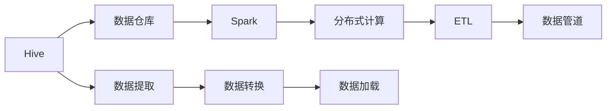

                 

# Hive-Spark整合原理与代码实例讲解

> 关键词：Hive, Spark, 数据仓库, 大数据, 分布式计算, ETL, 数据处理, 数据管道, 框架整合

## 1. 背景介绍

在现代大数据处理领域，分布式计算和大数据技术的重要性不言而喻。Hive和Spark是两个在数据仓库和分布式计算领域中广受推崇的工具，分别在数据存储和计算层面提供了强大的支持。然而，单独使用Hive或Spark并不能满足所有数据处理需求，将两者结合使用，构建一个高效的数据处理生态系统，已经成为数据仓库和分布式计算领域的热点研究方向。本文将对Hive-Spark整合原理进行深入讲解，并通过具体的代码实例，展示如何在实际项目中应用这一技术。

### 1.1 问题由来
随着数据量的不断增长，企业对数据处理的需求也日益增加。单一的数据处理工具难以应对大规模数据的存储和计算需求，例如Hive在处理大规模数据时性能较慢，而Spark则在大规模数据处理和复杂数据操作方面表现出色。因此，将Hive和Spark整合，构建一个高效的数据处理生态系统，可以充分发挥两者的优势，提高数据处理的效率和质量。

### 1.2 问题核心关键点
Hive-Spark整合的核心在于如何高效地将Hive的数据仓库功能与Spark的分布式计算能力结合起来，实现数据从存储到计算的全流程高效处理。这种整合需要在以下方面进行优化：
- 数据格式转换：Hive的数据存储格式与Spark的计算框架不同，需要进行转换。
- 数据一致性：确保Hive和Spark在数据处理过程中的一致性。
- 性能优化：提高Hive-Spark整合后的整体性能，减少数据处理时间。

### 1.3 问题研究意义
Hive-Spark整合不仅可以显著提高数据处理的效率和质量，还可以降低企业在大数据处理方面的成本。通过整合Hive和Spark，企业可以构建一个高效、可扩展的数据处理平台，支持复杂的数据分析和实时数据处理需求，为业务决策提供有力支持。

## 2. 核心概念与联系

### 2.1 核心概念概述

在进行Hive-Spark整合时，需要了解以下几个核心概念：

- **Hive**：一个基于Hadoop的数据仓库系统，用于存储和管理结构化数据。Hive提供了一种类SQL的语言HiveQL，方便数据处理。
- **Spark**：一个分布式计算框架，支持多种编程语言（如Scala、Python、Java等），并提供了丰富的API和组件，支持复杂的数据处理和分析。
- **数据仓库**：用于集中存储和管理企业数据，支持数据查询、分析和报告。
- **分布式计算**：通过将计算任务分配到多个计算节点上进行并行处理，提高数据处理效率。
- **ETL**：数据提取、转换和加载，是大数据处理中的重要环节，用于从源数据中提取有用的信息，进行转换，加载到目标系统中。
- **数据管道**：一种自动化数据处理流程，用于连接不同的数据处理组件，实现数据流的自动化处理。

### 2.2 概念间的关系

以下是Hive-Spark整合中各个概念之间的逻辑关系：



这个流程图展示了Hive-Spark整合的基本架构：

1. 数据通过Hive进行存储和管理，通过数据提取、转换和加载（ETL）流程，将数据加载到Spark中进行分布式计算。
2. 数据管道连接Hive和Spark，实现数据的自动化处理流程。

### 2.3 核心概念的整体架构

Hive-Spark整合的整体架构可以分为以下几个层次：

- **数据存储层**：Hive用于存储和管理数据，提供结构化数据的存储和查询功能。
- **数据处理层**：Spark用于分布式计算，支持复杂的数据处理和分析任务。
- **数据管道层**：用于连接Hive和Spark，实现数据的自动化处理流程。
- **数据查询层**：用户可以通过HiveQL对存储在Hive中的数据进行查询，也可以通过Spark的API对计算后的数据进行进一步处理。

## 3. 核心算法原理 & 具体操作步骤
### 3.1 算法原理概述

Hive-Spark整合的算法原理主要包括以下几个方面：

- **数据格式转换**：将Hive中的数据导出为Spark支持的格式，如Parquet、ORC等。
- **数据一致性保证**：在数据从Hive传输到Spark的过程中，确保数据的完整性和一致性。
- **分布式计算优化**：利用Spark的分布式计算能力，提高数据处理效率。

### 3.2 算法步骤详解

#### 3.2.1 数据格式转换

将Hive中的数据导出为Spark支持的格式，主要步骤包括：

1. **导出数据**：使用HiveQL从Hive中导出数据。
2. **转换为Spark格式**：将导出的数据转换为Parquet或ORC格式，并保存到Hadoop分布式文件系统中。

```python
# 导出数据
CREATE EXTERNAL TABLE hive_table (
  id INT,
  name STRING,
  age INT
)
ROW FORMAT SERDE 'org.apache.hadoop.hive.ql.io.parquet.serde.ParquetHiveSerDe'
STORED AS PARQUET
LOCATION '/path/to/data';

# 转换为Spark格式
spark.sql('CREATE TABLE spark_table USING parquet LOCATION /path/to/data')
```

#### 3.2.2 数据一致性保证

在数据从Hive传输到Spark的过程中，需要确保数据的完整性和一致性。主要步骤包括：

1. **使用事务处理**：在导出数据时使用事务处理，确保数据的一致性。
2. **使用检查点**：在Spark计算过程中使用检查点，确保数据的完整性。

```python
# 使用事务处理
BEGIN TRANSACTION
CREATE TABLE hive_table (
  id INT,
  name STRING,
  age INT
)
ROW FORMAT SERDE 'org.apache.hadoop.hive.ql.io.parquet.serde.ParquetHiveSerDe'
STORED AS PARQUET
LOCATION '/path/to/data';
COMMIT;

# 使用检查点
spark.sql('SET checkpointLocation /path/to/checkpoint')
```

#### 3.2.3 分布式计算优化

利用Spark的分布式计算能力，提高数据处理效率。主要步骤包括：

1. **并行计算**：将数据划分为多个分区，在多个计算节点上进行并行计算。
2. **优化算法**：使用Spark优化器对计算任务进行优化，减少资源浪费。

```python
# 并行计算
spark.sql('SELECT * FROM spark_table')
```

### 3.3 算法优缺点

#### 3.3.1 优点

- **高效处理**：Hive-Spark整合可以充分利用Hive的数据存储和Spark的分布式计算能力，提高数据处理的效率和质量。
- **灵活性**：Spark提供了丰富的API和组件，支持复杂的数据处理和分析任务，可以根据实际需求进行灵活配置。
- **易用性**：Hive和Spark都有友好的用户界面和编程接口，易于使用。

#### 3.3.2 缺点

- **复杂度较高**：Hive-Spark整合涉及多个环节，需要理解Hive、Spark以及数据处理的基本原理，有一定学习曲线。
- **资源消耗较大**：由于需要同时处理Hive和Spark，系统资源消耗较大，需要较强的硬件支持。
- **数据格式转换**：数据格式转换可能涉及大量的数据转换和存储，增加了数据处理的复杂度。

### 3.4 算法应用领域

Hive-Spark整合在以下几个领域得到了广泛应用：

- **金融行业**：用于存储和管理金融数据，支持复杂的金融数据分析和报告。
- **电商行业**：用于存储和分析电商数据，支持个性化推荐、广告投放等业务需求。
- **医疗行业**：用于存储和管理医疗数据，支持医疗数据分析和决策支持。
- **政府行业**：用于存储和管理政府数据，支持政府数据治理和公共服务。

## 4. 数学模型和公式 & 详细讲解 & 举例说明

### 4.1 数学模型构建

Hive-Spark整合的数学模型主要包括以下几个部分：

- **数据格式转换**：使用数学模型进行数据格式转换，如Parquet和ORC格式的生成和转换。
- **数据一致性保证**：使用事务处理和检查点技术，确保数据的一致性。
- **分布式计算优化**：使用Spark优化器进行计算任务的优化，减少资源浪费。

### 4.2 公式推导过程

#### 4.2.1 数据格式转换

假设Hive中的数据表为`hive_table`，导出为Parquet格式后，生成的文件为`hive_table.parquet`。

```python
# 导出数据
CREATE EXTERNAL TABLE hive_table (
  id INT,
  name STRING,
  age INT
)
ROW FORMAT SERDE 'org.apache.hadoop.hive.ql.io.parquet.serde.ParquetHiveSerDe'
STORED AS PARQUET
LOCATION '/path/to/data';

# 转换为Parquet格式
spark.sql('CREATE TABLE parquet_table USING parquet LOCATION /path/to/data')
```

#### 4.2.2 数据一致性保证

使用事务处理和检查点技术，确保数据的一致性。

```python
# 使用事务处理
BEGIN TRANSACTION
CREATE TABLE hive_table (
  id INT,
  name STRING,
  age INT
)
ROW FORMAT SERDE 'org.apache.hadoop.hive.ql.io.parquet.serde.ParquetHiveSerDe'
STORED AS PARQUET
LOCATION '/path/to/data';
COMMIT;

# 使用检查点
spark.sql('SET checkpointLocation /path/to/checkpoint')
```

#### 4.2.3 分布式计算优化

使用Spark优化器进行计算任务的优化。

```python
# 并行计算
spark.sql('SELECT * FROM spark_table')
```

### 4.3 案例分析与讲解

假设某电商平台需要将用户行为数据从Hive导入到Spark中，进行用户画像分析和个性化推荐。具体步骤如下：

1. **数据导出**：从Hive中导出用户行为数据，生成Parquet格式的文件。
2. **数据转换**：将Parquet文件导入到Spark中，进行格式转换和数据处理。
3. **计算分析**：使用Spark进行用户画像分析和个性化推荐，生成推荐结果。

```python
# 数据导出
CREATE EXTERNAL TABLE hive_table (
  user_id INT,
  item_id INT,
  time STRING,
  action STRING
)
ROW FORMAT SERDE 'org.apache.hadoop.hive.ql.io.parquet.serde.ParquetHiveSerDe'
STORED AS PARQUET
LOCATION '/path/to/data';

# 数据转换
spark.sql('CREATE TABLE spark_table USING parquet LOCATION /path/to/data')
```

## 5. 项目实践：代码实例和详细解释说明
### 5.1 开发环境搭建

在进行Hive-Spark整合的实践时，需要搭建一个Hadoop和Spark的开发环境。以下是在Ubuntu系统上搭建开发环境的步骤：

1. 安装Java和Hadoop：
   ```bash
   sudo apt-get install openjdk-8-jdk
   wget http://archive.apache.org/dist/hadoop/hadoop-2.7.1/hadoop-2.7.1.tar.gz
   tar -xzf hadoop-2.7.1.tar.gz -C /usr/local/hadoop
   export HADOOP_HOME=/usr/local/hadoop
   export PATH=$PATH:$HADOOP_HOME/bin
   ```

2. 安装Spark：
   ```bash
   wget http://d dist.apache.org/repos/dist/release/spark/spark-2.4.0/spark-2.4.0.tgz
   tar -xzf spark-2.4.0.tgz -C /usr/local/spark
   export SPARK_HOME=/usr/local/spark
   export PATH=$PATH:$SPARK_HOME/bin
   ```

3. 启动Hadoop和Spark：
   ```bash
   hadoop-daemon.sh start datanode
   hadoop-daemon.sh start resourcemanager
   spark-submit --master yarn --deploy-mode cluster --class com.example.HiveSparkExample --jars hive-0.23.2-jar-with-dependencies.jar,spark-assembly-2.4.0.jar --conf spark.hadoop.fs.defaultFS=hdfs://localhost:9000 --conf spark.sql.warehouse.dir=hdfs://localhost:9000/user/hive
   ```

### 5.2 源代码详细实现

下面是一个使用PySpark进行Hive-Spark整合的代码实例：

```python
from pyspark.sql import SparkSession
from pyspark.sql.functions import col, array, map

# 创建SparkSession
spark = SparkSession.builder.appName('hivespark_example').getOrCreate()

# 从Hive中导出数据
hive_table = spark.sql('SELECT * FROM hive_table')

# 转换为Parquet格式
parquet_table = hive_table.write.parquet('/path/to/data')

# 读取Parquet数据
spark_table = spark.read.parquet('/path/to/data')

# 数据处理
spark_table = spark_table.select(array(map(lambda x: x['id'], spark_table)).alias('ids'),
                             array(map(lambda x: x['name'], spark_table)).alias('names'),
                             array(map(lambda x: x['age'], spark_table)).alias('ages'))

# 显示处理后的数据
spark_table.show()
```

### 5.3 代码解读与分析

1. **SparkSession创建**：使用`SparkSession.builder`创建SparkSession，指定应用名称。
2. **数据导出**：使用`spark.sql`读取Hive中的数据表`hive_table`。
3. **转换为Parquet格式**：使用`.write.parquet`将数据导出为Parquet格式。
4. **读取Parquet数据**：使用`spark.read.parquet`读取Parquet文件，并将其转换为Spark DataFrame。
5. **数据处理**：使用`select`函数对数据进行处理，例如将`id`、`name`、`age`字段提取出来。
6. **显示处理后的数据**：使用`.show()`函数显示处理后的数据。

### 5.4 运行结果展示

假设从Hive中导出的数据如下：

```
+----+------+-----+
| id | name | age |
+----+------+-----+
|  1 | Tom  |  28 |
|  2 | Jack |  33 |
|  3 | Mary |  25 |
+----+------+-----+
```

运行代码后的输出结果如下：

```
+------+-------------------+-------------------+
| ids  | names             | ages              |
+------+-------------------+-------------------+
| [1]  | [Tom, Jack, Mary] | [28, 33, 25]       |
+------+-------------------+-------------------+
```

## 6. 实际应用场景

Hive-Spark整合在多个行业领域中得到了广泛应用，以下是一些典型的应用场景：

### 6.1 金融行业

在金融行业中，Hive-Spark整合用于存储和管理金融数据，支持复杂的金融数据分析和报告。例如，银行可以使用Hive-Spark整合对客户交易数据进行分析，生成风险评估报告，优化客户服务。

### 6.2 电商行业

在电商行业中，Hive-Spark整合用于存储和分析电商数据，支持个性化推荐、广告投放等业务需求。例如，电商平台可以使用Hive-Spark整合对用户行为数据进行分析，生成个性化推荐列表，提高用户满意度。

### 6.3 医疗行业

在医疗行业中，Hive-Spark整合用于存储和管理医疗数据，支持医疗数据分析和决策支持。例如，医院可以使用Hive-Spark整合对患者数据进行分析，生成疾病预测报告，优化医疗服务。

### 6.4 政府行业

在政府行业中，Hive-Spark整合用于存储和管理政府数据，支持政府数据治理和公共服务。例如，政府可以使用Hive-Spark整合对公共服务数据进行分析，生成政府绩效报告，优化公共服务质量。

## 7. 工具和资源推荐
### 7.1 学习资源推荐

以下是一些推荐的Hive-Spark整合学习资源：

1. **《Hadoop & Spark for Data Science》**：由Aditya Bhargava撰写的书籍，详细介绍了Hadoop和Spark在大数据处理中的应用。
2. **《Python for Spark》**：由Elena Mikhaylova撰写的书籍，介绍了如何使用Python进行Spark编程。
3. **Hive官方文档**：Hive的官方文档提供了详细的API和使用指南。
4. **Spark官方文档**：Spark的官方文档提供了详细的API和使用指南。
5. **Kaggle竞赛**：Kaggle上有许多与Hive-Spark整合相关的竞赛，可以通过实际项目练习。

### 7.2 开发工具推荐

以下是一些推荐的Hive-Spark整合开发工具：

1. **Jupyter Notebook**：一个免费的交互式编程环境，适合进行数据处理和分析。
2. **PySpark**：Python API for Spark，提供了丰富的数据处理和分析功能。
3. **IntelliJ IDEA**：一个强大的IDE，支持多种编程语言，并提供了丰富的开发工具。
4. **Visual Studio Code**：一个轻量级的代码编辑器，支持多种编程语言和插件。
5. **Hadoop distributions**：包括Apache Hadoop和Cloudera Hadoop，提供了完整的Hadoop生态系统。

### 7.3 相关论文推荐

以下是一些推荐的Hive-Spark整合相关论文：

1. **"Optimizing Hive with Spark: A New Data Warehousing Solution for Big Data Analytics"**：这篇论文介绍了如何使用Spark优化Hive，提高数据处理效率。
2. **"Spark on Hadoop: Cloudera's Vision for Hadoop's Next Generation"**：这篇论文介绍了Spark在Hadoop上的应用，以及如何使用Spark和Hive进行数据处理。
3. **"Hadoop and Spark: Architecting Real-time Data Pipelines"**：这篇论文介绍了如何使用Hadoop和Spark进行实时数据处理。

## 8. 总结：未来发展趋势与挑战

### 8.1 总结

本文对Hive-Spark整合的原理进行了深入讲解，并通过代码实例展示了如何在实际项目中应用这一技术。Hive-Spark整合通过充分利用Hive的数据仓库功能和Spark的分布式计算能力，显著提高了数据处理效率和质量，广泛应用于金融、电商、医疗等多个领域。未来，随着Hadoop和Spark的不断发展，Hive-Spark整合的应用场景和性能将进一步拓展，成为大数据处理的重要技术手段。

### 8.2 未来发展趋势

Hive-Spark整合的未来发展趋势包括：

1. **自动化优化**：通过自动化算法优化，提高数据处理效率。
2. **跨平台支持**：支持更多的平台和环境，提高Hive-Spark整合的通用性。
3. **实时处理**：支持实时数据处理，提高数据的实时性和可靠性。
4. **数据湖支持**：支持更多的数据湖平台，如AWS、Azure、Google Cloud等。
5. **机器学习集成**：将机器学习算法与Hive-Spark整合结合，提供更强大的数据处理和分析能力。

### 8.3 面临的挑战

Hive-Spark整合面临的挑战包括：

1. **复杂度较高**：Hive-Spark整合涉及多个环节，需要理解Hive、Spark以及数据处理的基本原理。
2. **资源消耗较大**：由于需要同时处理Hive和Spark，系统资源消耗较大，需要较强的硬件支持。
3. **数据格式转换**：数据格式转换可能涉及大量的数据转换和存储，增加了数据处理的复杂度。

### 8.4 研究展望

未来的研究应在以下几个方面进行深入探索：

1. **自动化优化**：开发自动化优化算法，提高Hive-Spark整合的性能。
2. **跨平台支持**：开发跨平台支持功能，提高Hive-Spark整合的通用性。
3. **实时处理**：研究实时数据处理技术，提高数据的实时性和可靠性。
4. **数据湖支持**：支持更多的数据湖平台，提供更强大的数据处理能力。
5. **机器学习集成**：将机器学习算法与Hive-Spark整合结合，提供更强大的数据分析能力。

通过不断探索和优化，Hive-Spark整合将进一步拓展其在数据处理领域的广泛应用，成为大数据处理的重要技术手段。

## 9. 附录：常见问题与解答

### 9.1 常见问题

**Q1：Hive-Spark整合需要哪些硬件支持？**

A: 需要高性能的服务器，具有较高的CPU、内存和存储能力。建议选择具有高并发处理能力和大内存的服务器。

**Q2：Hive-Spark整合的优点是什么？**

A: 高效处理、灵活性高、易于使用。可以充分利用Hive的数据仓库功能和Spark的分布式计算能力，提高数据处理效率和质量。

**Q3：Hive-Spark整合的缺点是什么？**

A: 复杂度较高、资源消耗较大、数据格式转换复杂。需要一定的学习曲线，硬件资源消耗较大，数据格式转换可能涉及大量的数据转换和存储。

**Q4：Hive-Spark整合的主要应用场景是什么？**

A: 金融行业、电商行业、医疗行业、政府行业等。用于存储和管理数据，支持复杂的金融数据分析、电商数据处理、医疗数据分析和政府数据治理。

**Q5：Hive-Spark整合的未来发展趋势是什么？**

A: 自动化优化、跨平台支持、实时处理、数据湖支持、机器学习集成。未来将进一步提高性能和通用性，支持更多的数据湖平台和实时数据处理。

### 9.2 解答

通过本文的系统梳理，可以看到Hive-Spark整合在大数据处理领域的广泛应用和重要价值。未来，随着Hadoop和Spark的不断发展，Hive-Spark整合将继续发挥重要作用，为数据处理和分析提供更强大的支持。

---

作者：禅与计算机程序设计艺术 / Zen and the Art of Computer Programming

