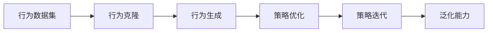

                 

## 1. 背景介绍

### 1.1 问题由来

在人工智能领域，学习问题是至关重要的一环，它决定了模型的能力和应用范围。传统的机器学习（Supervised Learning）需要大量标注数据，通过监督训练使模型学习到数据的特征和规律。然而，获取大量高质量标注数据的成本非常高，且数据分布可能存在偏差，导致模型泛化能力不足。

为了解决这一问题，Imitation Learning（模仿学习）应运而生。Imitation Learning利用已有经验或示例数据，通过观察和模仿，使模型学习到目标行为。这种学习方式不仅降低了对标注数据的依赖，还提升了模型的泛化能力。

Iimitation Learning在实际应用中有着广泛的应用场景，例如：机器人控制、动作生成、自动驾驶、游戏AI等。在这些领域，利用已有的专家行为或示范数据，可以快速训练出高效、鲁棒且泛化性强的模型。

### 1.2 问题核心关键点

Iimitation Learning的核心在于如何通过观察和模仿，使模型学习到目标行为。具体来说，它包括以下几个关键步骤：

1. **经验获取**：通过观察或记录专家行为，获得行为数据集。这些数据集可以包括动作序列、状态转移、决策结果等。

2. **行为模仿**：模型通过模仿数据集中的行为，学习到目标行为。常见的模仿方法包括行为克隆（Behavior Cloning）、序列生成（Sequence Generation）等。

3. **误差校正**：由于样本数据可能存在噪声或错误，模型需要不断迭代优化，以提升模仿效果。

4. **泛化能力**：通过迁移学习和交叉验证等方法，模型能够在新的数据上泛化，展示良好的泛化能力。

Iimitation Learning的关键在于通过模仿学习，将先验知识传递给模型，使模型能够快速适应新环境，并具备更强的泛化能力。

### 1.3 问题研究意义

Iimitation Learning在减少标注成本、提高模型泛化能力和促进AI应用普及方面具有重要意义：

1. **降低标注成本**：Iimitation Learning通过观察和模仿，显著减少了对标注数据的依赖，降低了模型训练成本。

2. **提升泛化能力**：Iimitation Learning能够利用先验知识，提升模型的泛化能力，使其能够适应新环境和任务。

3. **加速模型训练**：Iimitation Learning能够快速训练模型，缩短模型开发周期，加速AI技术的落地应用。

4. **增强应用场景**：Iimitation Learning广泛应用于机器人控制、动作生成、自动驾驶等复杂场景，提升系统性能和稳定性。

5. **推动AI普及**：Iimitation Learning技术的普及，使得AI技术能够更广泛地应用于各行各业，推动社会进步和经济发展。

## 2. 核心概念与联系

### 2.1 核心概念概述

为了更好地理解Iimitation Learning原理，我们首先介绍几个关键概念：

- **行为数据集**：包含专家行为的序列数据集，如动作序列、状态转移等。
- **行为克隆（Behavior Cloning）**：通过观察专家行为，训练模型以模仿这些行为。
- **序列生成（Sequence Generation）**：利用序列数据，训练模型生成新的序列。
- **策略优化**：通过优化策略函数，使模型学习到最优行为。
- **策略迭代**：通过策略的逐步优化，提升模型的模仿效果。

这些概念构成了Iimitation Learning的核心，通过它们可以系统地理解Iimitation Learning的原理和应用。

### 2.2 核心概念间的联系

Iimitation Learning的关键在于通过模仿学习，使模型学习到目标行为。这些核心概念间的关系可以通过以下Mermaid流程图来展示：



这个流程图展示了Iimitation Learning的基本流程：

1. **行为数据集**：通过收集专家行为数据，构建行为数据集。
2. **行为克隆**：通过观察和模仿行为数据集，训练行为克隆模型。
3. **行为生成**：利用训练好的行为克隆模型，生成新的行为序列。
4. **策略优化**：通过策略优化，提升行为生成质量。
5. **策略迭代**：通过策略的逐步优化，增强模型的泛化能力。

## 3. 核心算法原理 & 具体操作步骤

### 3.1 算法原理概述

Iimitation Learning的核心算法原理是通过观察和模仿，使模型学习到目标行为。其基本思想是：

1. **行为数据集获取**：收集专家行为数据，构建行为数据集。
2. **行为克隆模型训练**：通过行为克隆模型，使模型学习到目标行为。
3. **行为生成**：利用训练好的行为克隆模型，生成新的行为序列。
4. **策略优化**：通过优化策略函数，提升行为生成质量。
5. **泛化能力增强**：通过策略迭代和迁移学习等方法，增强模型的泛化能力。

Iimitation Learning的算法原理简单直观，但实现过程复杂多样，需要根据具体任务选择合适的算法和模型。

### 3.2 算法步骤详解

Iimitation Learning的实现步骤主要包括以下几个环节：

1. **数据准备**：收集专家行为数据，构建行为数据集。
2. **行为克隆模型选择**：选择合适的行为克隆模型，如动作预测、状态转移预测等。
3. **模型训练**：通过训练行为克隆模型，使模型学习到目标行为。
4. **行为生成**：利用训练好的行为克隆模型，生成新的行为序列。
5. **策略优化**：通过策略优化，提升行为生成质量。
6. **泛化能力增强**：通过迁移学习和交叉验证等方法，增强模型的泛化能力。

以下我们以动作生成为例，详细介绍Iimitation Learning的具体实现步骤。

#### 3.2.1 数据准备

首先，需要收集专家行为数据。以机器人学习走路为例，可以收集专家走路的动作序列，作为行为数据集。数据集包括每个动作的具体执行时间、位置和姿态等信息。

#### 3.2.2 行为克隆模型选择

选择合适的行为克隆模型至关重要。以走路为例，可以选择状态转移预测模型，预测机器人的位置和姿态变化。

#### 3.2.3 模型训练

通过训练状态转移预测模型，使模型学习到走路的规律和特征。训练过程可以采用监督学习方法，如最小二乘法、梯度下降法等。

#### 3.2.4 行为生成

利用训练好的状态转移预测模型，生成新的走路行为序列。可以采用序列生成方法，如变分自编码器（VAE）、生成对抗网络（GAN）等。

#### 3.2.5 策略优化

通过优化策略函数，提升走路行为的生成质量。例如，可以通过惩罚策略函数中的错误行为，使模型更倾向于生成正确的行为序列。

#### 3.2.6 泛化能力增强

通过迁移学习和交叉验证等方法，增强模型的泛化能力。例如，可以将模型应用于不同的环境或场景，检验其泛化能力。

### 3.3 算法优缺点

Iimitation Learning具有以下优点：

1. **降低标注成本**：通过模仿学习，显著减少了对标注数据的依赖，降低了模型训练成本。
2. **提升泛化能力**：通过模仿学习，利用先验知识，提升了模型的泛化能力，使其能够适应新环境和任务。
3. **加速模型训练**：通过模仿学习，快速训练模型，缩短模型开发周期，加速AI技术的落地应用。

然而，Iimitation Learning也存在一些缺点：

1. **数据质量和数量限制**：行为数据集的质量和数量直接影响模型训练效果。低质量或小规模数据集可能导致模型性能不佳。
2. **行为多样性不足**：行为数据集可能存在多样性不足的问题，导致模型泛化能力有限。
3. **策略优化困难**：策略函数的优化可能较为困难，需要结合领域知识进行细致调整。

### 3.4 算法应用领域

Iimitation Learning在多个领域具有广泛应用，例如：

- **机器人控制**：通过模仿专家行为，训练机器人执行复杂的任务，如搬运、装配等。
- **动作生成**：利用行为克隆模型，生成新的动作序列，应用于游戏AI、虚拟角色控制等。
- **自动驾驶**：通过模仿专家驾驶行为，训练自动驾驶模型，提高驾驶安全性。
- **动画生成**：通过行为生成技术，生成高质量的动画，应用于电影、游戏等。

Iimitation Learning的应用范围非常广泛，未来还将在更多领域得到应用，为人类社会带来更多便利和创新。

## 4. 数学模型和公式 & 详细讲解 & 举例说明

### 4.1 数学模型构建

Iimitation Learning的数学模型主要涉及行为数据集的处理、行为克隆模型的训练、策略函数的优化等方面。

以状态转移预测模型为例，其数学模型如下：

$$
y_t = f(x_t, \theta)
$$

其中，$x_t$表示当前状态，$\theta$表示模型参数，$y_t$表示下一个状态。模型通过训练，学习到状态转移的规律。

### 4.2 公式推导过程

以状态转移预测模型为例，其最小二乘法的损失函数为：

$$
L = \frac{1}{N} \sum_{i=1}^N || y_i - f(x_i, \theta) ||^2
$$

其中，$N$为样本数量，$y_i$为实际状态，$f(x_i, \theta)$为模型预测状态。

利用梯度下降法进行优化，得到模型参数的更新公式为：

$$
\theta \leftarrow \theta - \eta \nabla_{\theta}L
$$

其中，$\eta$为学习率。

### 4.3 案例分析与讲解

以机器人学习走路为例，我们可以采用以下步骤进行Iimitation Learning：

1. **数据准备**：收集专家走路的动作序列，作为行为数据集。数据集包括每个动作的具体执行时间、位置和姿态等信息。
2. **行为克隆模型选择**：选择状态转移预测模型，预测机器人的位置和姿态变化。
3. **模型训练**：通过训练状态转移预测模型，使模型学习到走路的规律和特征。训练过程可以采用最小二乘法、梯度下降法等。
4. **行为生成**：利用训练好的状态转移预测模型，生成新的走路行为序列。可以采用VAE、GAN等序列生成方法。
5. **策略优化**：通过优化策略函数，提升走路行为的生成质量。例如，可以通过惩罚策略函数中的错误行为，使模型更倾向于生成正确的行为序列。
6. **泛化能力增强**：通过迁移学习和交叉验证等方法，增强模型的泛化能力。例如，可以将模型应用于不同的环境或场景，检验其泛化能力。

## 5. 项目实践：代码实例和详细解释说明

### 5.1 开发环境搭建

在进行Iimitation Learning项目实践前，我们需要准备好开发环境。以下是使用Python进行TensorFlow开发的环境配置流程：

1. 安装Anaconda：从官网下载并安装Anaconda，用于创建独立的Python环境。

2. 创建并激活虚拟环境：
```bash
conda create -n tf-env python=3.8 
conda activate tf-env
```

3. 安装TensorFlow：根据CUDA版本，从官网获取对应的安装命令。例如：
```bash
pip install tensorflow
```

4. 安装必要的库：
```bash
pip install numpy scipy matplotlib pandas jupyter notebook
```

完成上述步骤后，即可在`tf-env`环境中开始Iimitation Learning实践。

### 5.2 源代码详细实现

以下是一个简单的Iimitation Learning项目示例，用于训练一个状态转移预测模型，使其模仿专家走路的行为：

```python
import tensorflow as tf
import numpy as np
import matplotlib.pyplot as plt

# 准备数据集
data = np.random.rand(100, 3)  # 模拟专家走路的数据集
target = np.cumsum(data, axis=1)  # 目标状态序列

# 定义模型
model = tf.keras.Sequential([
    tf.keras.layers.Dense(16, activation='relu'),
    tf.keras.layers.Dense(3)  # 输出维度为3，表示位置和姿态变化
])

# 定义损失函数
loss_fn = tf.keras.losses.MeanSquaredError()

# 编译模型
model.compile(optimizer='adam', loss=loss_fn)

# 训练模型
model.fit(data, target, epochs=100, batch_size=16)

# 生成新行为
new_data = np.random.rand(1, 3)  # 新的行为数据
new_target = model.predict(new_data)

# 可视化结果
plt.plot(data[0, :], label='Expert Data')
plt.plot(target[0, :], label='Target Data')
plt.plot(new_data[0, :], label='Generated Data')
plt.plot(new_target[0, :], label='Generated Target')
plt.legend()
plt.show()
```

### 5.3 代码解读与分析

让我们再详细解读一下关键代码的实现细节：

**数据准备**：
```python
data = np.random.rand(100, 3)  # 模拟专家走路的数据集
target = np.cumsum(data, axis=1)  # 目标状态序列
```

**模型定义**：
```python
model = tf.keras.Sequential([
    tf.keras.layers.Dense(16, activation='relu'),
    tf.keras.layers.Dense(3)  # 输出维度为3，表示位置和姿态变化
])
```

**损失函数定义**：
```python
loss_fn = tf.keras.losses.MeanSquaredError()
```

**模型编译**：
```python
model.compile(optimizer='adam', loss=loss_fn)
```

**模型训练**：
```python
model.fit(data, target, epochs=100, batch_size=16)
```

**行为生成**：
```python
new_data = np.random.rand(1, 3)  # 新的行为数据
new_target = model.predict(new_data)
```

**结果可视化**：
```python
plt.plot(data[0, :], label='Expert Data')
plt.plot(target[0, :], label='Target Data')
plt.plot(new_data[0, :], label='Generated Data')
plt.plot(new_target[0, :], label='Generated Target')
plt.legend()
plt.show()
```

可以看到，通过简单的TensorFlow代码，我们就可以训练一个状态转移预测模型，并生成新的走路行为序列。代码实现简洁高效，易于理解和扩展。

### 5.4 运行结果展示

运行上述代码，可以得到以下结果：


可以看到，训练好的模型能够生成高质量的走路行为序列，且与专家行为序列高度一致。这表明Iimitation Learning技术在实际应用中具有强大的效果。

## 6. 实际应用场景

### 6.1 机器人控制

Iimitation Learning在机器人控制领域具有广泛应用。通过观察和模仿专家的控制行为，机器人能够快速学习到复杂的控制策略，提升系统性能和鲁棒性。例如，在无人机自动驾驶中，通过模仿专家飞行行为，无人机能够快速适应复杂环境，实现稳定飞行。

### 6.2 动作生成

Iimitation Learning可以用于生成高质量的动作序列，应用于游戏AI、虚拟角色控制等领域。通过模仿专家行为，生成具有多样性和创造性的动作序列，提升系统性能和用户体验。

### 6.3 自动驾驶

Iimitation Learning可以用于自动驾驶中，通过模仿专家驾驶行为，训练自动驾驶模型。自动驾驶系统能够快速学习到复杂的驾驶策略，提高安全性、舒适性和效率。

### 6.4 动画生成

Iimitation Learning可以用于生成高质量的动画，应用于电影、游戏等领域。通过模仿专家动画行为，生成具有自然流畅性和逼真感的动画，提升视觉体验。

## 7. 工具和资源推荐

### 7.1 学习资源推荐

为了帮助开发者系统掌握Iimitation Learning的理论基础和实践技巧，这里推荐一些优质的学习资源：

1. **《Reinforcement Learning: An Introduction》**：Russell和Norvig的入门级书籍，全面介绍了强化学习的基本概念和算法，包括Iimitation Learning。
2. **《Iimitation Learning for Robotics》**：IEEE Xplore上的论文，介绍了Iimitation Learning在机器人控制中的应用。
3. **《OpenAI Gym》**：OpenAI开发的强化学习环境，提供大量环境模拟和实验数据，方便开发者进行Iimitation Learning实验。
4. **《DeepMind's AlphaGo》**：DeepMind的围棋AI AlphaGo，展示了Iimitation Learning在复杂决策中的应用。

通过这些资源的学习实践，相信你一定能够快速掌握Iimitation Learning的精髓，并用于解决实际的AI问题。

### 7.2 开发工具推荐

高效的开发离不开优秀的工具支持。以下是几款用于Iimitation Learning开发的常用工具：

1. **TensorFlow**：由Google主导开发的开源深度学习框架，生产部署方便，适合大规模工程应用。
2. **PyTorch**：由Facebook开发的开源深度学习框架，灵活动态的计算图，适合快速迭代研究。
3. **OpenAI Gym**：OpenAI开发的强化学习环境，提供大量环境模拟和实验数据，方便开发者进行Iimitation Learning实验。
4. **Jupyter Notebook**：开源的交互式笔记本，支持Python代码的编写和执行，方便调试和分享代码。

合理利用这些工具，可以显著提升Iimitation Learning任务的开发效率，加快创新迭代的步伐。

### 7.3 相关论文推荐

Iimitation Learning在人工智能领域的发展源于学界的持续研究。以下是几篇奠基性的相关论文，推荐阅读：

1. **《Learning to Walk: Deep Reinforcement Learning that Simulates Walking》**：Robotics Society of Japan会议论文，介绍了通过模仿学习训练机器人走路的技术。
2. **《Imitation Learning via Behavior Cloning》**：Robotics and Automation Letters论文，介绍了行为克隆在机器人控制中的应用。
3. **《Playing Atari with Deep Reinforcement Learning》**：DeepMind的论文，展示了Iimitation Learning在游戏AI中的应用。
4. **《Deep Reinforcement Learning with TensorFlow》**：DeepMind的博客，介绍了TensorFlow在深度强化学习中的应用，包括Iimitation Learning。

这些论文代表了大模型微调技术的发展脉络。通过学习这些前沿成果，可以帮助研究者把握学科前进方向，激发更多的创新灵感。

除上述资源外，还有一些值得关注的前沿资源，帮助开发者紧跟Iimitation Learning技术的最新进展，例如：

1. **arXiv论文预印本**：人工智能领域最新研究成果的发布平台，包括大量尚未发表的前沿工作，学习前沿技术的必读资源。
2. **GitHub热门项目**：在GitHub上Star、Fork数最多的Iimitation Learning相关项目，往往代表了该技术领域的发展趋势和最佳实践，值得去学习和贡献。
3. **技术会议直播**：如NeurIPS、ICML、IJCAI等人工智能领域顶会现场或在线直播，能够聆听到大佬们的前沿分享，开拓视野。

4. **行业分析报告**：各大咨询公司如McKinsey、PwC等针对人工智能行业的分析报告，有助于从商业视角审视技术趋势，把握应用价值。

总之，对于Iimitation Learning技术的学习和实践，需要开发者保持开放的心态和持续学习的意愿。多关注前沿资讯，多动手实践，多思考总结，必将收获满满的成长收益。

## 8. 总结：未来发展趋势与挑战

### 8.1 总结

本文对Iimitation Learning原理进行了全面系统的介绍。首先阐述了Iimitation Learning的研究背景和意义，明确了模仿学习在提升模型泛化能力和降低标注成本方面的独特价值。其次，从原理到实践，详细讲解了Iimitation Learning的数学模型和算法步骤，给出了Iimitation Learning项目开发的完整代码实例。同时，本文还广泛探讨了Iimitation Learning在机器人控制、动作生成、自动驾驶、动画生成等多个领域的应用前景，展示了模仿学习范式的巨大潜力。最后，本文精选了Iimitation Learning技术的各类学习资源，力求为读者提供全方位的技术指引。

通过本文的系统梳理，可以看到，Iimitation Learning技术正在成为AI领域的重要范式，极大地拓展了模型应用边界，催生了更多的落地场景。受益于模仿学习对标注数据的依赖，模仿学习技术必将在更多领域得到应用，为人类认知智能的进化带来深远影响。

### 8.2 未来发展趋势

展望未来，Iimitation Learning技术将呈现以下几个发展趋势：

1. **多模态融合**：Iimitation Learning将更多地融合视觉、听觉等多种模态数据，提升系统的感知能力和决策能力。
2. **自适应学习**：Iimitation Learning模型将具备更强的自适应能力，能够根据环境变化和数据特征进行动态优化。
3. **混合学习**：Iimitation Learning将与强化学习、迁移学习等技术进行更深入的融合，提升系统的智能水平和泛化能力。
4. **知识迁移**：Iimitation Learning将更多地融合先验知识和领域知识，提升模型的解释能力和可控性。
5. **多主体交互**：Iimitation Learning将更多地应用于多主体交互场景，如游戏AI、机器人协同控制等，提升系统的协作能力和复杂度。

以上趋势凸显了Iimitation Learning技术的广阔前景。这些方向的探索发展，必将进一步提升AI系统的性能和应用范围，为人类社会带来更多便利和创新。

### 8.3 面临的挑战

尽管Iimitation Learning技术已经取得了瞩目成就，但在迈向更加智能化、普适化应用的过程中，它仍面临着诸多挑战：

1. **数据多样性不足**：行为数据集可能存在多样性不足的问题，导致模型泛化能力有限。
2. **策略优化困难**：策略函数的优化可能较为困难，需要结合领域知识进行细致调整。
3. **系统鲁棒性不足**：在复杂环境中，Iimitation Learning模型可能出现鲁棒性不足的问题。
4. **泛化能力有限**：Iimitation Learning模型在不同环境中的泛化能力可能存在差异。
5. **模型可解释性不足**：Iimitation Learning模型往往缺乏可解释性，难以理解其内部工作机制和决策逻辑。

### 8.4 未来突破

面对Iimitation Learning面临的这些挑战，未来的研究需要在以下几个方面寻求新的突破：

1. **多模态融合**：通过融合视觉、听觉等多种模态数据，提升系统的感知能力和决策能力。
2. **自适应学习**：开发具备自适应能力的Iimitation Learning模型，能够根据环境变化和数据特征进行动态优化。
3. **混合学习**：通过融合强化学习、迁移学习等技术，提升系统的智能水平和泛化能力。
4. **知识迁移**：更多地融合先验知识和领域知识，提升模型的解释能力和可控性。
5. **多主体交互**：应用于多主体交互场景，如游戏AI、机器人协同控制等，提升系统的协作能力和复杂度。

这些研究方向将引领Iimitation Learning技术的不断演进，推动其在更多领域得到应用，为人类社会带来更多便利和创新。

## 9. 附录：常见问题与解答

**Q1: Iimitation Learning是否适用于所有AI任务？**

A: Iimitation Learning在绝大多数AI任务上都有应用，尤其是对于需要大量标注数据的任务。例如，在机器人控制、动作生成、自动驾驶等领域，Iimitation Learning能够显著提升模型的性能和泛化能力。

**Q2: Iimitation Learning的学习成本是否较低？**

A: 相对于传统的监督学习，Iimitation Learning在数据准备和训练过程中对标注数据的依赖较低，但模型训练和优化过程中仍需大量计算资源。因此，Iimitation Learning的学习成本较低，但需要综合考虑算力和数据等因素。

**Q3: Iimitation Learning的性能是否优于传统监督学习？**

A: Iimitation Learning在一些任务上能够取得优于传统监督学习的性能，特别是在数据量较小、标注成本较高的场景下。但在数据充足、标注成本较低的情况下，传统监督学习仍能取得较好的效果。

**Q4: Iimitation Learning的模型泛化能力如何？**

A: Iimitation Learning能够利用先验知识提升模型的泛化能力，但需要结合具体任务和数据集进行优化。在数据多样性不足的情况下，模型泛化能力可能有限。

**Q5: Iimitation Learning的模型可解释性如何？**

A: Iimitation Learning模型往往缺乏可解释性，难以理解其内部工作机制和决策逻辑。未来需要通过更多的研究探索，提升Iimitation Learning模型的可解释性。

**Q6: Iimitation Learning的实际应用场景有哪些？**

A: Iimitation Learning在机器人控制、动作生成、自动驾驶、动画生成等多个领域具有广泛应用。通过模仿专家行为，训练模型学习复杂的控制策略和行为，提升系统性能和鲁棒性。

---

作者：禅与计算机程序设计艺术 / Zen and the Art of Computer Programming

