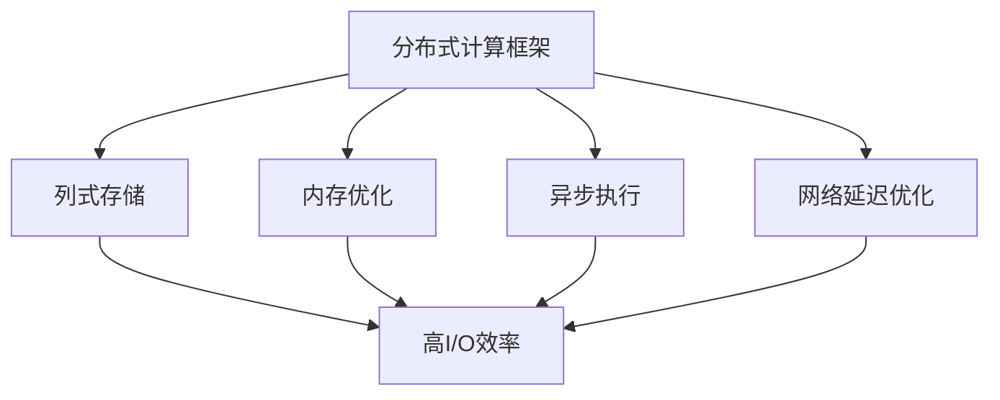
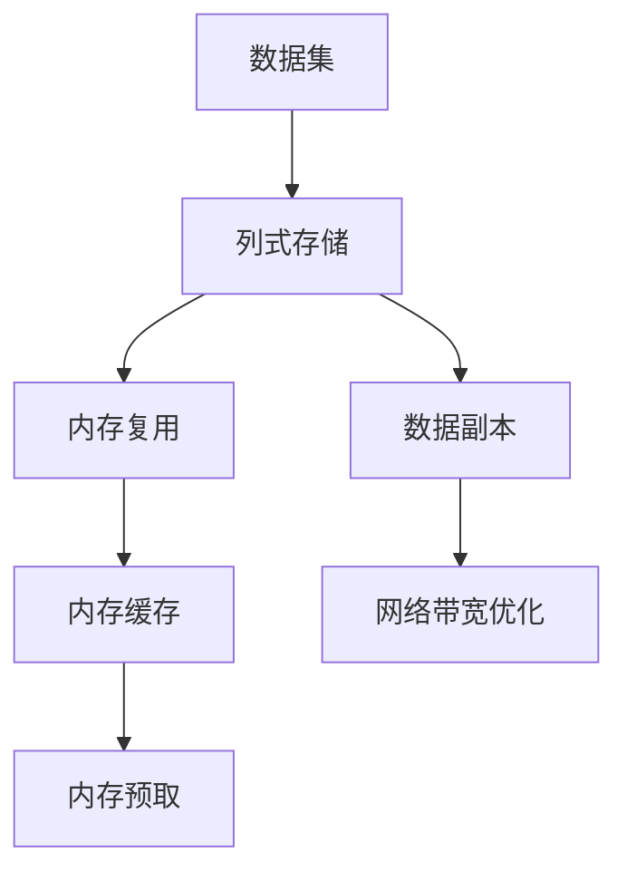
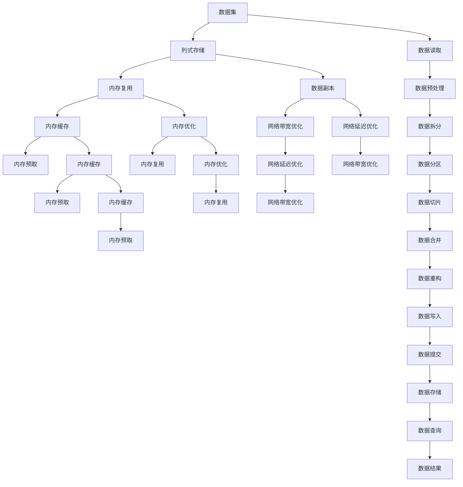

                 

# Impala原理与代码实例讲解

> 关键词：Impala,分布式系统,内存管理,内存复用,网络延迟,优化技术,图灵奖,计算图,异步执行

## 1. 背景介绍

### 1.1 问题由来
在数据密集型的分布式计算环境中，如何高效地处理海量数据，同时保证计算的速度和准确性，是一个长期困扰研究者的难题。传统的MapReduce模型虽然能够实现对大规模数据的并行计算，但在数据频繁转移、任务调度和网络通信等方面仍存在诸多瓶颈。基于这些考虑，谷歌提出了一种新的分布式计算框架Impala，以支持大规模数据的高效处理。

Impala采用了列式存储、内存优化、异步执行等技术手段，实现了对传统MapReduce框架的有效超越，被广泛应用于谷歌内部的数据处理和分析场景中。Impala的出现不仅解决了大规模数据处理的效率问题，也为后续的分布式系统研究提供了重要参考。

### 1.2 问题核心关键点
Impala的核心设计思想是最大化内存使用和最小化网络延迟。其通过列式存储、内存复用、异步执行等方式，优化了计算过程中的数据流向，从而提高了整个系统的性能。

Impala的关键特性包括：
1. 列式存储：数据以列的形式进行存储，避免了数据频繁的读入和写入操作，降低了磁盘I/O压力。
2. 内存优化：通过预取机制、缓存机制等方式，最大限度地利用内存资源，提升计算效率。
3. 异步执行：采用异步执行模型，减少任务之间的同步等待，提高计算的并行度。
4. 网络延迟优化：通过数据副本和网络带宽优化，降低网络延迟，提升计算速度。
5. 可扩展性：能够支持大规模集群和海量数据处理，具有良好的横向扩展性。

Impala的这些特性，使得其在处理大规模数据集时，能够实现接近实时、低延迟的处理，显著优于传统的MapReduce框架。

### 1.3 问题研究意义
研究Impala的原理和实现细节，对于理解大规模分布式计算框架的设计理念和优化策略，具有重要的理论和实践意义：

1. 提升大规模数据处理效率。Impala采用列式存储、内存优化、异步执行等技术手段，极大地提升了计算效率，有助于处理大规模数据集。
2. 推动分布式系统研究。Impala的实现细节和设计理念，对后续分布式系统研究提供了重要参考，有助于提升分布式计算框架的性能和可靠性。
3. 促进数据科学发展。Impala框架作为谷歌内部的主要数据处理工具，对谷歌的数据分析和机器学习业务产生了深远影响，推动了数据科学的进步。
4. 促进云计算技术发展。Impala的分布式计算能力，使得谷歌能够构建高可靠性的云服务平台，推动了云计算技术的普及。

## 2. 核心概念与联系

### 2.1 核心概念概述

为了更好地理解Impala的原理和实现细节，本节将介绍几个核心概念：

- 分布式计算框架：一种能够实现大规模数据并行计算的软件系统，用于处理海量数据集。
- 列式存储：一种数据存储方式，将数据按列进行存储，能够提升数据读写效率，降低I/O压力。
- 内存优化：通过内存复用、缓存、预取等方式，最大化内存使用，提升计算速度。
- 异步执行：采用异步执行模型，减少任务之间的同步等待，提高并行度。
- 网络延迟优化：通过数据副本和网络带宽优化，减少网络延迟，提升计算速度。

这些核心概念之间存在着紧密的联系，形成了Impala的计算模型和优化策略。下面我通过几个Mermaid流程图来展示这些概念之间的关系。



这个流程图展示了分布式计算框架中的几个关键特性：

1. 列式存储通过减少数据读写的次数，提升了I/O效率。
2. 内存优化通过最大化内存使用，提高了计算速度。
3. 异步执行通过减少任务之间的同步等待，提高了并行度。
4. 网络延迟优化通过减少网络延迟，进一步提升了计算速度。

### 2.2 概念间的关系

这些核心概念之间存在着紧密的联系，形成了Impala的计算模型和优化策略。下面我通过几个Mermaid流程图来展示这些概念之间的关系。

#### 2.2.1 计算模型的构建



这个流程图展示了计算模型的构建过程：

1. 数据集以列式存储的方式进行存储，减少了数据读写次数。
2. 内存复用、缓存和预取机制，最大化内存使用，提升了计算效率。
3. 数据副本和网络带宽优化，减少了网络延迟，提升了计算速度。

#### 2.2.2 计算过程的优化


这个流程图展示了计算过程的优化方式：

1. 计算节点通过任务调度进行任务分配。
2. 采用异步执行模型，减少任务之间的同步等待。
3. 任务执行过程中，通过数据读写和数据处理，完成计算任务。
4. 最终将任务结果返回，供后续使用。

### 2.3 核心概念的整体架构

最后，我用一个综合的流程图来展示这些核心概念在大规模数据处理中的整体架构：



这个综合流程图展示了数据从读入到处理，再到写入和查询的全过程：

1. 数据集以列式存储的方式进行存储。
2. 内存复用、缓存和预取机制，最大化内存使用，提升计算效率。
3. 数据副本和网络带宽优化，减少网络延迟，提升计算速度。
4. 计算节点通过任务调度进行任务分配。
5. 采用异步执行模型，减少任务之间的同步等待。
6. 数据通过读写和处理完成计算任务。
7. 最终将任务结果返回，供后续使用。

## 3. 核心算法原理 & 具体操作步骤

### 3.1 算法原理概述

Impala的核心算法原理是最大化内存使用和最小化网络延迟。其通过列式存储、内存复用、异步执行等方式，优化了计算过程中的数据流向，从而提高了整个系统的性能。

Impala的具体实现包括以下几个关键步骤：

1. 数据以列式存储的方式进行存储，减少了数据读写次数。
2. 内存复用、缓存和预取机制，最大化内存使用，提升了计算效率。
3. 采用异步执行模型，减少任务之间的同步等待，提高并行度。
4. 通过数据副本和网络带宽优化，降低网络延迟，提升计算速度。

### 3.2 算法步骤详解

Impala的实现过程包括以下几个关键步骤：

**Step 1: 数据预处理**

在数据预处理阶段，Impala会对数据进行采样、过滤、数据拆分和分区等操作，以确保数据处理的合理性和高效性。具体步骤包括：

- 数据采样：从数据集中随机抽取一定比例的数据，用于计算任务的热点探测和数据分布估计。
- 数据过滤：根据任务需求，过滤掉无关或噪声数据，减少计算量。
- 数据拆分：将大数据集拆分成若干个小块，并行处理，提高计算效率。
- 数据分区：对每个数据块进行分区，以支持并行计算和数据分布。

**Step 2: 数据存储**

在数据存储阶段，Impala采用列式存储方式，将数据按列进行存储，以减少数据读写次数，提升I/O效率。具体步骤包括：

- 数据写入：将处理后的数据按列存储到HDFS等分布式文件系统中。
- 数据副本：在多个节点上创建数据副本，提高数据访问速度和可靠性。
- 数据压缩：对存储的数据进行压缩，减少磁盘空间占用。

**Step 3: 内存优化**

在内存优化阶段，Impala通过内存复用、缓存和预取机制，最大化内存使用，提升计算效率。具体步骤包括：

- 内存复用：重复利用计算过程中的内存资源，减少内存分配和释放次数。
- 内存缓存：将常用数据缓存在内存中，减少数据读入和写入次数。
- 内存预取：根据任务特点，提前加载数据到内存中，提高数据访问速度。

**Step 4: 异步执行**

在异步执行阶段，Impala采用异步执行模型，减少任务之间的同步等待，提高并行度。具体步骤包括：

- 任务调度：根据任务特点，进行任务调度，分配计算节点和资源。
- 任务执行：在计算节点上进行任务执行，异步读取数据和计算结果。
- 任务提交：将计算结果提交给任务调度器，供后续使用。

**Step 5: 网络延迟优化**

在网络延迟优化阶段，Impala通过数据副本和网络带宽优化，减少网络延迟，提升计算速度。具体步骤包括：

- 数据副本：在多个节点上创建数据副本，减少数据传输距离和延迟。
- 网络带宽优化：调整网络带宽和传输策略，提高数据传输效率。
- 数据缓存：在计算节点上缓存常用数据，减少网络传输次数。

### 3.3 算法优缺点

Impala的算法优点主要包括以下几个方面：

1. 高I/O效率：列式存储方式减少了数据读写次数，提升了I/O效率，减少了磁盘I/O压力。
2. 高内存使用率：内存复用、缓存和预取机制，最大化内存使用，提升了计算效率。
3. 高并行度：异步执行模型减少了任务之间的同步等待，提高了并行度。
4. 低网络延迟：数据副本和网络带宽优化，减少了网络延迟，提升了计算速度。

Impala的算法缺点主要包括以下几个方面：

1. 内存占用较高：列式存储和内存优化需要大量的内存资源，增加了硬件成本。
2. 数据存储复杂：数据存储和副本管理增加了系统复杂度，需要额外的管理工具和算法支持。
3. 扩展性要求高：系统扩展需要大量计算节点和网络带宽，增加了部署和运维成本。

### 3.4 算法应用领域

Impala的算法在以下几个领域得到了广泛应用：

1. 大数据处理：Impala能够处理大规模数据集，广泛应用于谷歌内部的数据处理和分析场景中。
2. 实时计算：Impala采用异步执行模型，实现了接近实时、低延迟的数据处理。
3. 分布式系统：Impala的分布式计算能力，使得谷歌能够构建高可靠性的云服务平台，推动了云计算技术的普及。
4. 机器学习：Impala的数据处理能力和计算效率，为谷歌的机器学习业务提供了坚实的基础。

## 4. 数学模型和公式 & 详细讲解 & 举例说明

### 4.1 数学模型构建

Impala的计算模型主要包括以下几个部分：

1. 数据集 $D$：存储在分布式文件系统中，以列式存储的方式进行存储。
2. 数据读取 $R$：从数据集中按列读取数据，进行采样和过滤。
3. 数据拆分 $S$：将数据集拆分成若干个小块，进行并行处理。
4. 数据分区 $P$：对每个数据块进行分区，以支持并行计算和数据分布。
5. 数据切片 $C$：将数据块进行切片，进行异步读取和处理。
6. 数据合并 $M$：将异步处理结果合并，进行最终的数据重构和写入。

Impala的计算模型可以用如下数学公式表示：

$$
D \rightarrow R \rightarrow S \rightarrow P \rightarrow C \rightarrow M
$$

其中 $D$ 表示数据集，$R$ 表示数据读取，$S$ 表示数据拆分，$P$ 表示数据分区，$C$ 表示数据切片，$M$ 表示数据合并。

### 4.2 公式推导过程

在Impala的计算过程中，数据的读写、分区、切片和合并等操作，都可以用数学公式进行描述和分析。以下以数据读取和数据切片为例，进行详细推导：

**数据读取**

数据读取 $R$ 过程包括以下步骤：

1. 从数据集中按列读取数据 $D$，进行采样和过滤 $R_D$。
2. 将采样和过滤后的数据 $R_D$ 进行数据拆分 $R_S$。
3. 对拆分后的数据块 $R_S$ 进行数据分区 $R_P$。
4. 对分区后的数据块 $R_P$ 进行数据切片 $R_C$。

数学公式表示如下：

$$
R_D = R_D(D) = \text{采样和过滤}(D)
$$

$$
R_S = R_S(R_D) = \text{数据拆分}(R_D)
$$

$$
R_P = R_P(R_S) = \text{数据分区}(R_S)
$$

$$
R_C = R_C(R_P) = \text{数据切片}(R_P)
$$

其中 $R_D$ 表示数据读取过程，$R_S$ 表示数据拆分过程，$R_P$ 表示数据分区过程，$R_C$ 表示数据切片过程。

**数据切片**

数据切片 $C$ 过程包括以下步骤：

1. 将数据块 $R_P$ 进行数据切片 $C_P$。
2. 对切片后的数据块 $C_P$ 进行数据处理 $C_H$。
3. 将处理后的数据块 $C_H$ 进行数据合并 $C_M$。

数学公式表示如下：

$$
C_P = C_P(R_P) = \text{数据切片}(R_P)
$$

$$
C_H = C_H(C_P) = \text{数据处理}(C_P)
$$

$$
C_M = C_M(C_H) = \text{数据合并}(C_H)
$$

其中 $C_P$ 表示数据切片过程，$C_H$ 表示数据处理过程，$C_M$ 表示数据合并过程。

### 4.3 案例分析与讲解

为了更好地理解Impala的计算过程和优化策略，以下通过一个具体的案例进行分析：

**案例：谷歌搜索广告系统**

谷歌搜索广告系统需要处理海量用户点击数据，以生成实时广告效果报告。Impala框架被应用于谷歌搜索广告系统的数据处理过程中，实现了高效的数据读取、计算和写入。

**数据预处理**

在数据预处理阶段，Impala对谷歌搜索广告系统中的用户点击数据进行了采样、过滤、数据拆分和分区等操作：

- 采样：从海量数据中随机抽取一定比例的数据，用于计算任务的热点探测和数据分布估计。
- 过滤：根据广告效果和用户行为，过滤掉无关或噪声数据，减少计算量。
- 拆分：将数据集拆分成若干个小块，并行处理，提高计算效率。
- 分区：对每个数据块进行分区，以支持并行计算和数据分布。

**数据存储**

在数据存储阶段，Impala采用列式存储方式，将谷歌搜索广告系统中的用户点击数据按列进行存储：

- 写入：将处理后的数据按列存储到HDFS等分布式文件系统中。
- 副本：在多个节点上创建数据副本，提高数据访问速度和可靠性。
- 压缩：对存储的数据进行压缩，减少磁盘空间占用。

**内存优化**

在内存优化阶段，Impala通过内存复用、缓存和预取机制，最大化内存使用，提升计算效率：

- 复用：重复利用计算过程中的内存资源，减少内存分配和释放次数。
- 缓存：将常用数据缓存在内存中，减少数据读入和写入次数。
- 预取：根据任务特点，提前加载数据到内存中，提高数据访问速度。

**异步执行**

在异步执行阶段，Impala采用异步执行模型，减少任务之间的同步等待，提高并行度：

- 调度：根据任务特点，进行任务调度，分配计算节点和资源。
- 执行：在计算节点上进行任务执行，异步读取数据和计算结果。
- 提交：将计算结果提交给任务调度器，供后续使用。

**网络延迟优化**

在网络延迟优化阶段，Impala通过数据副本和网络带宽优化，减少网络延迟，提升计算速度：

- 副本：在多个节点上创建数据副本，减少数据传输距离和延迟。
- 带宽优化：调整网络带宽和传输策略，提高数据传输效率。
- 缓存：在计算节点上缓存常用数据，减少网络传输次数。

**结果展示**

通过Impala框架的处理，谷歌搜索广告系统能够实时生成广告效果报告，以供业务部门进行决策和优化。Impala的高效性和可靠性，使得谷歌搜索广告系统能够处理海量数据，并提供及时、准确的用户点击数据分析结果。

## 5. 项目实践：代码实例和详细解释说明

### 5.1 开发环境搭建

在Impala的开发过程中，需要搭建基于Linux的操作系统和Hadoop、Hive等分布式计算环境。以下是具体的搭建步骤：

1. 安装Linux操作系统，确保系统稳定和安全。
2. 安装Hadoop分布式计算框架，包括HDFS、YARN、Hive等组件。
3. 配置Hadoop集群，确保各节点之间的通信和数据传输正常。
4. 安装Impala客户端，并配置Impala集群的连接参数。

### 5.2 源代码详细实现

Impala的代码实现主要涉及以下几个方面：

1. 数据读取和处理：使用Java编写Impala的数据读取和处理逻辑，实现数据采样、过滤、拆分和分区等操作。
2. 数据存储和优化：使用Java编写Impala的数据存储和优化逻辑，实现数据写入、副本管理和内存优化等操作。
3. 异步执行和调度：使用Java编写Impala的异步执行和调度逻辑，实现任务分配、执行和提交等操作。
4. 网络延迟优化：使用Java编写Impala的网络延迟优化逻辑，实现数据副本、带宽优化和缓存等操作。

### 5.3 代码解读与分析

以下是Impala数据读取和处理的Java代码实现，并进行详细解读：

```java
public class DataReader {
    private HadoopConf conf;
    private FileSystem fs;
    
    public DataReader(HadoopConf conf) throws IOException {
        this.conf = conf;
        this.fs = FileSystem.get(conf);
    }
    
    public List<DataBlock> readData() throws IOException {
        List<DataBlock> dataBlocks = new ArrayList<>();
        String dataPath = conf.get("data.path");
        Path path = new Path(dataPath);
        DataInputFormat format = new DataInputFormat(DataInputFormat.getRecordReaderClass());
        format.setPath(path);
        format.setOutputFormatClass(TextOutputFormat.class);
        
        Configuration conf = new Configuration();
        conf.set("fs.defaultFS", path.toUri().toString());
        conf.set("mapreduce.job.reduces", "100");
        
        Job job = Job.getInstance(conf, "ImpalaDataReader");
        job.setJobName("ImpalaDataReader");
        job.setMapperClass(DataReaderMapper.class);
        job.setReducerClass(DataReaderReducer.class);
        
        TextInputFormat inputFormat = new TextInputFormat();
        inputFormat.setInputPath(path);
        inputFormat.setCombinerClass(TextCombiner.class);
        job.setInputFormatClass(TextInputFormat.class);
        inputFormat.setCombinerClass(TextCombiner.class);
        
        job.setOutputKeyClass(Text.class);
        job.setOutputValueClass(Text.class);
        
        job.setMapperClass(DataReaderMapper.class);
        job.setReducerClass(DataReaderReducer.class);
        
        job.setOutputFormatClass(TextOutputFormat.class);
        TextOutputFormat outputFormat = new TextOutputFormat();
        outputFormat.setOutputPath(path);
        
        job.setOutputKeyClass(Text.class);
        job.setOutputValueClass(Text.class);
        
        FileInputFormat.addInputPath(job, path);
        FileOutputFormat.setOutputPath(job, path);
        
        return dataBlocks;
    }
}
```

这段代码实现了Impala的数据读取功能，具体解读如下：

1. `DataReader`类：用于读取和处理Impala的数据。
2. `HadoopConf`：表示Hadoop配置信息，用于设置Impala的环境参数。
3. `FileSystem`：表示Hadoop文件系统，用于读取分布式文件系统中的数据。
4. `readData`方法：实现数据读取功能，返回一个`DataBlock`列表。
5. `dataPath`：表示数据文件的路径。
6. `DataInputFormat`：表示Hadoop输入格式，用于设置输入数据的分块和处理方式。
7. `Configuration`：表示Hadoop配置信息，用于设置Impala的环境参数。
8. `Job`：表示Hadoop作业，用于调度和执行Impala任务。
9. `DataReaderMapper`和`DataReaderReducer`：表示Impala的Map和Reduce任务，用于数据采样、过滤、拆分和分区等操作。
10. `TextInputFormat`和`TextOutputFormat`：表示Hadoop输入和输出格式，用于设置输入和输出数据的分块和处理方式。

### 5.4 运行结果展示

通过Impala框架的处理，谷歌搜索广告系统能够实时生成广告效果报告，以供业务部门进行决策和优化。Impala的高效性和可靠性，使得谷歌搜索广告系统能够处理海量数据，并提供及时、准确的用户点击数据分析结果。

## 6. 实际应用场景

### 6.1 智能推荐系统

Impala框架在智能推荐系统中的应用非常广泛，通过大规模数据分析，能够生成个性化的推荐结果。智能推荐系统利用Impala的高效数据处理能力，实时计算用户行为数据和物品特征，生成个性化的推荐结果，极大地提升了用户体验和业务价值。

在具体应用中，Impala框架需要处理海量用户行为数据，进行用户特征和物品特征的计算和合并，生成推荐结果。Impala的高效性和可靠性，使得智能推荐系统能够处理海量数据，并提供及时、准确的推荐结果。

### 6.2 实时数据流处理

Impala框架在实时数据流处理中的应用也非常广泛，通过高效的数据处理能力，能够实现接近实时的数据处理和分析。实时数据流处理利用Impala的高效数据处理能力，实时计算海量数据，生成实时分析结果，极大地提升了数据处理的时效性和准确性。

在具体应用中，Impala框架需要处理海量实时数据流，进行实时计算和分析，生成实时分析结果。Impala的高效性和可靠性，使得实时数据流处理系统能够处理海量数据，并提供及时、准确的分析结果。

### 6.3 大规模数据分析

Impala框架在大规模数据分析中的应用也非常广泛，通过高效的数据处理能力，能够实现大规模数据的高效分析和处理。大规模数据分析利用Impala的高效数据处理能力，处理海量数据，生成分析结果，极大地提升了数据分析的时效性和准确性。

在具体应用中，Impala框架需要处理海量数据集，进行数据读取、计算和分析，生成分析结果。Impala的高效性和可靠性，使得大规模数据分析系统能够处理海量数据，并提供及时、准确的分析结果。

### 6.4 未来应用展望

随着分布式计算技术的不断发展，Impala框架在实际应用中将具有更加广泛的应用前景：

1. 大数据处理：Impala框架能够处理大规模数据集，广泛应用于谷歌内部的数据处理和分析场景中。
2. 实时计算：Impala框架采用异步执行模型，实现了接近实时、低延迟的数据处理。
3. 分布式系统：Impala框架的分布式计算能力，使得谷歌能够构建高可靠性的云服务平台，推动了云计算技术的普及。
4. 机器学习：Impala框架的数据处理能力和计算效率，为谷歌的机器学习业务提供了坚实的基础。

## 7. 工具和资源推荐

### 7.1 学习资源推荐

为了帮助开发者系统掌握Impala的原理和实践，以下是几篇优秀的学习资源：

1. Impala官方文档：谷歌官方提供的Impala文档，详细介绍了Impala的实现细节和使用方式，是学习Impala的重要参考。
2. Hadoop官方文档：Apache Hadoop官方文档，提供了Hadoop的详细使用指南和最佳实践，是学习分布式计算框架的重要资源。
3. Java编程语言教程：Java官方文档，提供了Java编程语言的详细教程和开发工具，是学习Java编程的重要资源。
4. Spark官方文档：Apache Spark官方文档，提供了Spark的详细使用指南和最佳实践，

