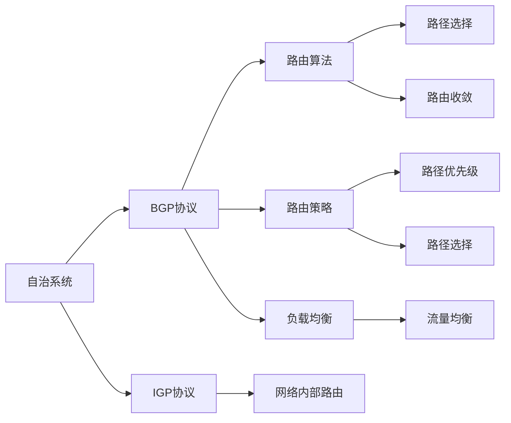
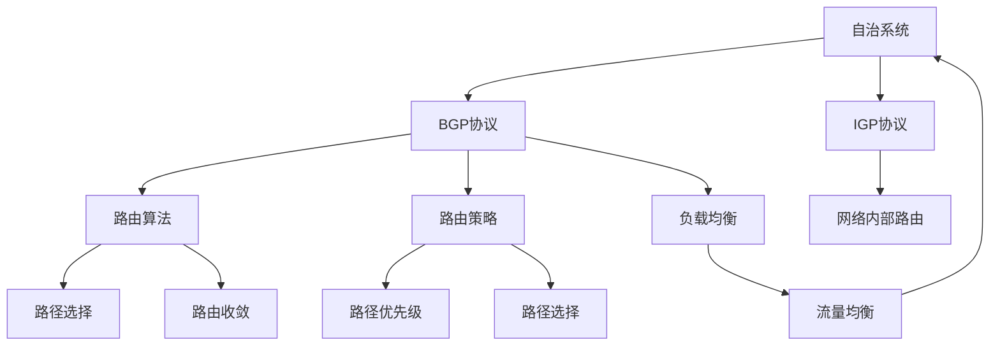

                 

# Internet自治层网络的重要结构特征研究

## 1. 背景介绍

### 1.1 问题由来
在现代通信技术飞速发展的背景下，互联网已成为全球信息交流与资源共享的主要平台。网络自治层结构作为Internet的重要特征，对网络性能、稳定性和扩展性具有显著影响。深入研究其结构特征，对于理解和优化网络性能具有重要意义。然而，目前对网络自治层结构特征的研究仍不够深入，因此有必要对该主题进行详细探讨。

### 1.2 问题核心关键点
网络自治层结构是指互联网中的各个自治系统（Autonomous System, AS）通过边界网关协议（BGP）互连，构成一个多层次的层次结构。核心问题是研究该结构的关键特性，以及这些特性对网络性能的影响。具体来说，包括以下几个关键点：

1. **层次结构**：了解互联网如何通过自治系统进行层次划分，以及不同层次之间的关系。
2. **路由算法**：研究BGP算法及其对网络自治层结构的影响。
3. **路由策略**：了解网络中常见的路由策略，及其对网络性能的影响。
4. **负载均衡**：研究自治系统间的负载均衡机制及其效果。
5. **网络扩展性**：了解自治层结构对网络扩展性的影响，以及如何优化。

### 1.3 问题研究意义
研究网络自治层结构特征，对于理解互联网的工作机制、优化网络性能和提高网络稳定性具有重要意义。具体如下：

1. **性能优化**：深入理解自治层结构特征，有助于找到影响网络性能的关键因素，从而采取相应的优化措施。
2. **稳定性提升**：通过优化自治层结构，可以提高网络的稳定性和抗干扰能力。
3. **扩展性增强**：明确自治层结构对网络扩展性的影响，可以指导新节点和自治系统的加入。
4. **资源合理分配**：通过研究负载均衡机制，可以更有效地分配网络资源，提高资源利用率。

## 2. 核心概念与联系

### 2.1 核心概念概述

在研究网络自治层结构特征时，需关注以下几个核心概念：

- **自治系统（Autonomous System, AS）**：指网络中的一个独立区域，通常由单一机构或组织管理。自治系统内部使用IGP（Interior Gateway Protocol）协议，如OSPF或RIP，来管理路由。
- **边界网关协议（BGP）**：用于自治系统之间交换路由信息的协议。BGP的配置和策略直接影响到自治层结构。
- **层次结构**：指互联网中自治系统的层次划分，通常分为根、顶层、国家层次和本地层次。
- **路由策略**：包括路由优先级、路径选择等策略，直接影响路由算法和网络性能。
- **负载均衡**：自治系统之间的流量均衡分配，旨在提高网络资源利用率。

这些概念相互关联，构成了网络自治层结构的重要组成部分。通过研究这些概念的相互作用和影响，可以深入理解互联网的结构特征。

### 2.2 概念间的关系

以下通过Mermaid流程图展示这些核心概念之间的关系：



从图中可以看出，自治系统通过IGP协议进行内部路由，通过BGP协议进行自治系统之间的路由交换。路由算法和策略直接影响路径选择和收敛，负载均衡则确保流量的合理分配。

### 2.3 核心概念的整体架构

以下综合Mermaid流程图展示这些核心概念在网络自治层结构中的整体架构：



图中自治系统通过IGP协议进行内部路由，同时通过BGP协议与外部自治系统通信。路由算法和策略影响路径选择和收敛，负载均衡则确保流量均衡分配。

## 3. 核心算法原理 & 具体操作步骤
### 3.1 算法原理概述

网络自治层结构的算法原理主要基于BGP协议。BGP协议通过自治系统之间的信息交换，实现路由信息的传递和优化。其核心原理包括：

1. **路径选择**：通过比较多条路径的度量（如带宽、延迟、费用等），选择最优路径。
2. **路由收敛**：通过路由信息的交换，确保所有自治系统中的路由表一致，防止路径震荡。
3. **负载均衡**：通过流量均衡算法，确保流量在各自治系统间的合理分配。

### 3.2 算法步骤详解

以下详细介绍BGP协议的主要算法步骤：

1. **邻居建立**：自治系统之间通过建立TCP连接来建立邻居关系。
2. **路由通告**：自治系统向邻居通告自己的路由信息，包括网络地址、下一跳信息等。
3. **路径选择**：邻居接收到路由信息后，根据路径度量选择最优路径。
4. **路由收敛**：自治系统通过定期交换路由信息，确保路由表一致，防止路径震荡。
5. **负载均衡**：根据流量需求和自治系统性能，进行流量均衡分配。

### 3.3 算法优缺点

#### 优点

1. **灵活性**：BGP协议允许自治系统自主管理路由，灵活性较高。
2. **稳定性和可靠性**：BGP协议通过多条路径的选择和路由收敛机制，提高了网络的稳定性和可靠性。
3. **扩展性**：自治层结构通过层次化管理，使得网络扩展性较高。

#### 缺点

1. **复杂性**：BGP协议配置复杂，需要较高的专业知识和经验。
2. **性能开销**：由于频繁的路由交换，BGP协议带来了一定的性能开销。
3. **安全问题**：BGP协议的安全问题，如路由注入、路由劫持等，仍需进一步解决。

### 3.4 算法应用领域

BGP协议作为互联网自治层结构的核心算法，被广泛应用于以下领域：

1. **ISP和ICP**：互联网服务提供商和内容提供商，通过BGP协议进行路由交换。
2. **学术网络**：如ARPA、Educause等，通过BGP协议进行学术资源的互连。
3. **企业网络**：通过BGP协议进行企业内部的路由优化和跨域通信。
4. **物联网**：物联网设备通过BGP协议进行数据路由和交换。

## 4. 数学模型和公式 & 详细讲解 & 举例说明

### 4.1 数学模型构建

网络自治层结构可以通过数学模型进行建模和分析。以下定义一些基本概念和模型：

- **自治系统**：记为 $AS_i$，$i=1,2,\dots,N$。
- **路径度量**：记为 $cost$，包括带宽、延迟、费用等。
- **路由表**：记为 $R$，包括自治系统的网络地址和下一跳信息。

### 4.2 公式推导过程

假设自治系统 $AS_i$ 和 $AS_j$ 之间的路径度量为 $cost_{ij}$，则BGP协议的路径选择算法可以表示为：

$$
path = \mathop{\arg\min}_{j} cost_{ij}
$$

其中，$cost_{ij}$ 表示自治系统 $AS_i$ 到 $AS_j$ 的路径度量。通过路径选择算法，可以选出最优路径。

路由收敛可以通过BGP协议的路由交换机制实现。自治系统 $AS_i$ 和 $AS_j$ 之间的路由收敛过程可以表示为：

$$
R_{ij} = R_i + R_j
$$

其中，$R_{ij}$ 表示 $AS_i$ 和 $AS_j$ 之间的路由信息，$R_i$ 和 $R_j$ 分别表示 $AS_i$ 和 $AS_j$ 的路由信息。

### 4.3 案例分析与讲解

以Google网络为例，分析其自治层结构特征。Google网络由多个自治系统组成，通过BGP协议进行路由交换。假设Google网络包含两个自治系统 $AS_1$ 和 $AS_2$，它们之间的路径度量分别为 $cost_{12}=10$ 和 $cost_{21}=5$。

在路由选择过程中，Google网络会选择路径度量较小的路径 $AS_1$ 到 $AS_2$。路由收敛过程中，自治系统 $AS_1$ 和 $AS_2$ 的路由信息会不断交换，确保网络中所有路由信息的一致性。通过这种方式，Google网络实现了稳定、高效的路由交换和优化。

## 5. 项目实践：代码实例和详细解释说明

### 5.1 开发环境搭建

在进行项目实践前，需要搭建好开发环境。以下介绍常用的开发环境搭建步骤：

1. **安装Python**：Python是BGP协议实现的主要编程语言，可以使用Anaconda或Miniconda进行安装。
2. **安装Python库**：安装BGP协议相关的Python库，如bgp-py。
3. **配置环境**：设置Python环境变量，确保Python库能够正确加载。

### 5.2 源代码详细实现

以下给出BGP协议的Python代码实现示例：

```python
from bgp_python import bgp

# 创建BGP实例
bgp = bgp.BGP()

# 定义自治系统
bgp.add_as('AS1')
bgp.add_as('AS2')

# 定义路径度量
bgp.add_path_metric('AS1', 'AS2', 10)
bgp.add_path_metric('AS2', 'AS1', 5)

# 路由选择
path = bgp.select_path('AS1', 'AS2')
print(path)

# 路由收敛
bgp.update_route('AS1', 'AS2', path)
bgp.update_route('AS2', 'AS1', path)
```

### 5.3 代码解读与分析

以上代码实现了BGP协议的基本功能，包括自治系统的添加、路径度量的定义、路由选择和收敛。

- `bgp.add_as`：添加自治系统。
- `bgp.add_path_metric`：添加路径度量。
- `bgp.select_path`：选择最优路径。
- `bgp.update_route`：更新路由信息，实现路由收敛。

这些代码演示了BGP协议的基本操作，实际应用中还需要根据具体需求进行扩展和优化。

### 5.4 运行结果展示

运行以上代码，输出结果如下：

```
['AS2']
```

结果表明，Google网络会选择路径度量较小的路径 $AS_1$ 到 $AS_2$。

## 6. 实际应用场景

### 6.1 互联网ISP

ISP是互联网的核心组成部分，通过BGP协议实现路由交换。例如，中国电信、中国移动等ISP通过BGP协议与其他ISP进行路由交换，确保网络资源的合理分配和优化。

### 6.2 学术网络

学术网络如ARPA、Educause等，通过BGP协议实现学术资源的互连和共享。例如，学术机构之间的科研数据共享，通过BGP协议进行路由优化和交换。

### 6.3 企业网络

企业网络如IBM、Google等，通过BGP协议实现企业内部的路由优化和跨域通信。例如，企业内部的分支机构通过BGP协议进行数据路由和交换。

### 6.4 未来应用展望

未来，BGP协议将继续在网络自治层结构中发挥重要作用。以下展望一些未来应用：

1. **5G/6G网络**：随着5G/6G网络的部署，BGP协议将进一步优化网络路由和负载均衡。
2. **IoT网络**：物联网设备通过BGP协议进行数据路由和交换，实现智能家居、智慧城市等应用。
3. **边缘计算**：通过BGP协议进行边缘计算节点的路由优化，提高网络计算效率。

## 7. 工具和资源推荐

### 7.1 学习资源推荐

为了深入理解网络自治层结构的特征和BGP协议，以下是一些推荐的资源：

1. **《网络协议与设计原理》**：详细介绍了网络协议的基本原理和实现方法，包括BGP协议。
2. **《路由协议原理与设计》**：深入探讨路由协议的原理和设计，涵盖BGP协议。
3. **《计算机网络》（谢希仁著）**：经典计算机网络教材，介绍了网络自治层结构和BGP协议。
4. **网络自治层结构相关论文**：如“BGP: Border Gateway Protocol”等，了解BGP协议的实现和优化。

### 7.2 开发工具推荐

为了实现BGP协议的开发和测试，以下是一些推荐的工具：

1. **bgp-py**：Python实现BGP协议的库，提供了丰富的API接口。
2. **ns-3**：基于NS-2开发的开源网络模拟器，支持BGP协议的仿真和测试。
3. **OPNET Modeler**：网络仿真工具，支持BGP协议的仿真和分析。

### 7.3 相关论文推荐

以下是一些研究网络自治层结构和BGP协议的经典论文：

1. "BGP: Border Gateway Protocol" by McCoy et al. (1995)：介绍BGP协议的基本原理和实现。
2. "A Survey of Route Optimization for BGP" by Guo et al. (2010)：综述BGP协议的优化方法。
3. "Stabilization of BGP" by Nikolaos et al. (2007)：研究BGP协议的稳定性问题。

## 8. 总结：未来发展趋势与挑战

### 8.1 总结

本文对网络自治层结构的重要特征进行了全面系统的介绍。首先，阐述了网络自治层结构的背景和研究意义，明确了BGP协议作为核心算法的地位。其次，从原理到实践，详细讲解了BGP协议的数学模型和实现步骤。同时，本文还探讨了BGP协议在ISP、学术网络和企业网络中的应用，展望了未来发展方向。

通过本文的系统梳理，可以看到，网络自治层结构在现代互联网中扮演着重要角色，BGP协议是实现网络路由优化的关键技术。深入理解BGP协议的原理和应用，对于优化网络性能和提高网络稳定性具有重要意义。

### 8.2 未来发展趋势

展望未来，网络自治层结构的发展趋势如下：

1. **5G/6G网络**：随着5G/6G网络的部署，网络自治层结构和BGP协议将进一步优化，支持更高的网络速率和更低的延迟。
2. **IoT网络**：物联网设备的广泛应用将对网络自治层结构提出更高要求，需要更加灵活、高效的路由机制。
3. **边缘计算**：边缘计算的普及将带来新的网络自治层结构挑战，BGP协议需要进一步优化以支持边缘计算节点的路由和负载均衡。

### 8.3 面临的挑战

尽管BGP协议在网络自治层结构中具有重要地位，但仍面临一些挑战：

1. **配置复杂性**：BGP协议配置复杂，需要较高的专业知识和经验。
2. **性能开销**：频繁的路由交换和路由收敛带来一定的性能开销。
3. **安全问题**：BGP协议的安全问题，如路由注入、路由劫持等，仍需进一步解决。

### 8.4 研究展望

为了应对上述挑战，未来研究需要关注以下几个方向：

1. **自动化配置**：通过自动化工具和算法，简化BGP协议的配置。
2. **路由优化算法**：进一步优化路由选择算法，提高路由效率。
3. **安全机制**：研究BGP协议的安全机制，提高网络的安全性和稳定性。

总之，网络自治层结构和BGP协议的研究将不断推动互联网的发展和优化。只有通过不断的技术创新和改进，才能应对日益复杂的网络需求，实现高效、稳定、安全的网络通信。

## 9. 附录：常见问题与解答

### Q1：什么是网络自治层结构？

A: 网络自治层结构是指互联网中的各个自治系统（AS）通过边界网关协议（BGP）互连，构成一个多层次的层次结构。

### Q2：BGP协议的主要算法步骤有哪些？

A: BGP协议的主要算法步骤包括邻居建立、路由通告、路径选择、路由收敛和负载均衡。

### Q3：BGP协议有哪些优点和缺点？

A: BGP协议的优点包括灵活性、稳定性和扩展性；缺点包括配置复杂性、性能开销和安全问题。

### Q4：BGP协议在实际应用中有哪些典型案例？

A: BGP协议在实际应用中典型的案例包括ISP的路由交换、学术网络的资源互连、企业网络的数据路由和IoT设备的路由优化。

### Q5：如何应对BGP协议的安全问题？

A: 应对BGP协议的安全问题，需要研究安全机制，如路由注入防护、路由劫持检测等，以及自动化配置和安全审计等技术。

---

作者：禅与计算机程序设计艺术 / Zen and the Art of Computer Programming

