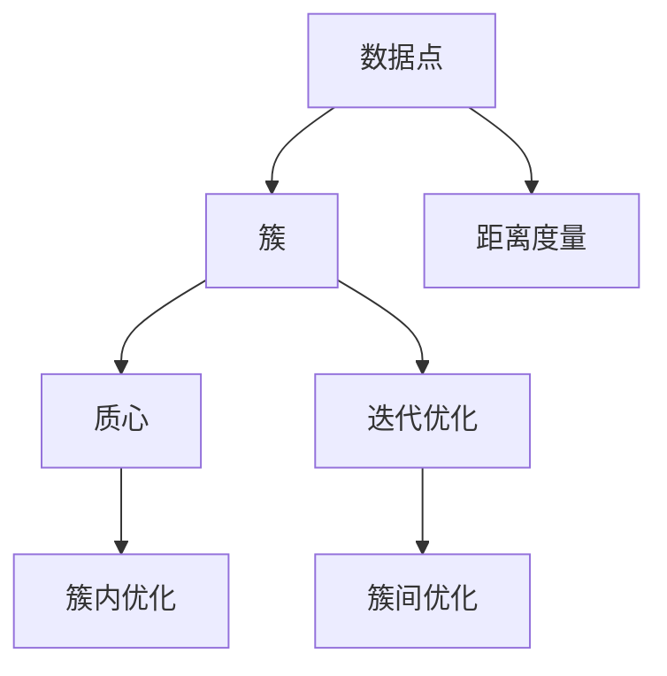
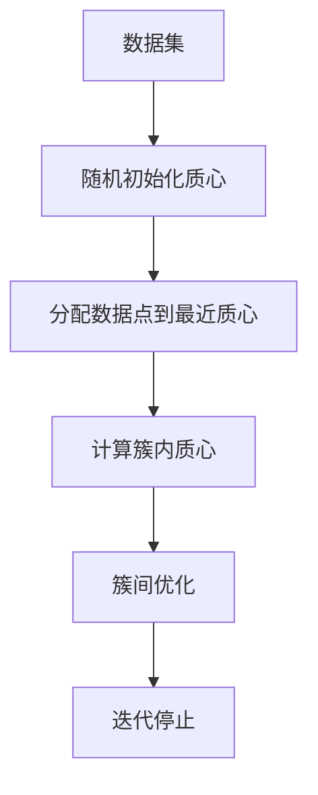

                 

# K-Means - 原理与代码实例讲解

> 关键词：K-Means, 聚类分析, 原理与代码, 算法步骤, 实际应用, 优缺点, 数学模型, 学习资源

## 1. 背景介绍

### 1.1 问题由来
在机器学习领域，聚类分析（Cluster Analysis）是一种常用的数据挖掘技术，用于将数据点分成多个群组，每个群组内的数据点相似度较高，而不同群组的数据点则存在较大的差异。K-Means算法是聚类分析中最经典的算法之一，具有简单易懂、计算高效的优点，被广泛应用于市场细分、图像分割、生物信息学等多个领域。

### 1.2 问题核心关键点
K-Means算法的基本思想是：假设数据集中的每个数据点都来自于K个不同的簇，每个簇的质心代表该簇的中心，通过迭代地调整簇的质心和簇内数据点的位置，不断优化簇的划分和质心的计算，最终得到一个最优的簇划分结果。K-Means算法的核心步骤包括：
1. 随机选取K个数据点作为初始的质心。
2. 将数据集中的每个数据点分配到与其最近的质心所在的簇中。
3. 计算每个簇的质心，即簇中所有数据点的平均值。
4. 重复步骤2和3，直到簇的质心不再发生变化。

### 1.3 问题研究意义
K-Means算法在数据挖掘和模式识别等领域具有广泛的应用价值。它可以帮助我们发现数据集中的潜在结构，识别数据中的模式和趋势，从而进行有效的数据压缩和信息提取。此外，K-Means算法的实现简单易懂，计算效率高，是一种非常实用的数据挖掘工具。

## 2. 核心概念与联系

### 2.1 核心概念概述

为更好地理解K-Means算法，本节将介绍几个密切相关的核心概念：

- **数据点（Data Point）**：在K-Means算法中，每个数据点表示为n维向量，可以是图像像素、文本词频、商品价格等。

- **簇（Cluster）**：K-Means算法的目标是将数据集划分为K个簇，每个簇内的数据点尽可能相似，而不同簇的数据点则存在较大的差异。

- **质心（Centroid）**：每个簇的质心是该簇中所有数据点的平均值，用于代表该簇的中心位置。

- **距离度量（Distance Metric）**：在K-Means算法中，通常使用欧氏距离（Euclidean Distance）来计算数据点之间的相似度。

- **迭代优化（Iterative Optimization）**：K-Means算法通过迭代地调整簇的质心和簇内数据点的位置，不断优化簇的划分和质心的计算，最终达到最优的聚类结果。

这些核心概念之间存在着紧密的联系，形成了K-Means算法的完整生态系统。通过理解这些概念，我们可以更好地把握K-Means算法的工作原理和优化方向。

### 2.2 概念间的关系

这些核心概念之间的关系可以通过以下Mermaid流程图来展示：



这个流程图展示了K-Means算法的基本流程：

1. 数据点通过距离度量计算相似度，被分配到最近的簇中。
2. 每个簇的质心通过簇内优化得到。
3. 通过迭代优化，不断调整簇的质心和簇内数据点的位置，最终达到最优的簇划分结果。

### 2.3 核心概念的整体架构

最后，我们用一个综合的流程图来展示K-Means算法的整体架构：



这个综合流程图展示了K-Means算法的完整过程：

1. 将数据集随机初始化K个质心。
2. 将每个数据点分配到最近的质心所在的簇中。
3. 计算每个簇的质心，即簇中所有数据点的平均值。
4. 通过迭代优化，重复步骤2和3，直到簇的质心不再发生变化。

通过这些流程图，我们可以更清晰地理解K-Means算法的工作原理和优化方向。

## 3. 核心算法原理 & 具体操作步骤
### 3.1 算法原理概述

K-Means算法的核心思想是将数据集划分为K个簇，每个簇的质心代表该簇的中心，通过迭代地调整簇的质心和簇内数据点的位置，不断优化簇的划分和质心的计算，最终得到一个最优的簇划分结果。

形式化地，假设数据集为 $\{ x_1, x_2, ..., x_n \}$，每个数据点 $x_i$ 表示为n维向量，簇的质心为 $\{ \mu_1, \mu_2, ..., \mu_K \}$，每个簇内的数据点为 $c_i = \{ x_{i1}, x_{i2}, ..., x_{in} \}$。K-Means算法的优化目标是最小化每个数据点与最近质心之间的距离，即最小化所有簇内平方和误差（Sum of Squared Errors, SSE）：

$$
\min_{\mu_1, \mu_2, ..., \mu_K} \sum_{i=1}^K \sum_{x \in c_i} ||x - \mu_i||^2
$$

其中 $|| \cdot ||$ 表示欧氏距离。

### 3.2 算法步骤详解

K-Means算法的具体步骤如下：

1. 随机选取K个数据点作为初始的质心 $\mu_1, \mu_2, ..., \mu_K$。
2. 对数据集中的每个数据点 $x_i$，计算其与每个质心 $\mu_j$ 的距离，分配到距离最近的质心所在的簇中。
3. 对于每个簇 $c_i$，计算其质心 $\mu_i$，即簇内所有数据点的平均值。
4. 重复步骤2和3，直到簇的质心不再发生变化，即簇的划分和质心的计算达到收敛。

### 3.3 算法优缺点

K-Means算法的优点包括：
- 简单易懂：算法实现简单，易于理解和实现。
- 计算高效：算法计算复杂度较低，适用于大规模数据集。
- 可解释性强：算法结果易于解释，每个簇的质心代表簇的中心位置。

K-Means算法的缺点包括：
- 需要预先指定簇的数目K：簇的数目需要事先指定，可能影响聚类结果。
- 对初始质心敏感：算法对初始质心的选取敏感，不同的初始质心可能导致不同的聚类结果。
- 对异常值敏感：算法对异常值（outlier）的敏感度较高，可能影响聚类结果。

### 3.4 算法应用领域

K-Means算法在数据挖掘和模式识别等领域具有广泛的应用价值，例如：

- 市场细分：将客户划分为不同的细分市场，针对不同市场进行产品定位和营销策略。
- 图像分割：将图像中的像素点划分为不同的簇，用于图像识别和分类。
- 生物信息学：将DNA序列划分为不同的簇，用于基因表达分析和疾病预测。
- 推荐系统：将用户和商品划分为不同的簇，用于推荐系统的个性化推荐。
- 聚类分析：将数据集划分为不同的簇，用于发现数据集中的模式和趋势。

## 4. 数学模型和公式 & 详细讲解
### 4.1 数学模型构建

K-Means算法的形式化描述为：

$$
\min_{\mu_1, \mu_2, ..., \mu_K} \sum_{i=1}^K \sum_{x \in c_i} ||x - \mu_i||^2
$$

其中 $x \in \mathcal{R}^n$ 表示n维向量，$\mu_i \in \mathcal{R}^n$ 表示簇的质心，$c_i$ 表示簇内的数据点集合。

### 4.2 公式推导过程

我们以二维数据为例，推导K-Means算法的详细计算步骤。假设数据集为 $\{ (x_1, y_1), (x_2, y_2), ..., (x_n, y_n) \}$，簇的数目为K。

1. 随机选取K个数据点作为初始的质心 $\mu_1, \mu_2, ..., \mu_K$。
2. 对每个数据点 $(x_i, y_i)$，计算其与每个质心 $\mu_j$ 的距离，分配到距离最近的质心所在的簇中。距离计算公式为：

   $$
   d(x_i, \mu_j) = \sqrt{(x_i - \mu_j)^2 + (y_i - \mu_j)^2}
   $$

   其中 $d(x_i, \mu_j)$ 表示数据点 $(x_i, y_i)$ 与质心 $\mu_j$ 的欧氏距离。

3. 对于每个簇 $c_i$，计算其质心 $\mu_i$，即簇内所有数据点的平均值：

   $$
   \mu_i = \frac{1}{|c_i|} \sum_{x \in c_i} x
   $$

   其中 $|c_i|$ 表示簇 $c_i$ 的元素个数。

4. 重复步骤2和3，直到簇的质心不再发生变化，即簇的划分和质心的计算达到收敛。

### 4.3 案例分析与讲解

假设我们有一组二维数据，如下所示：

```
(1, 1), (2, 2), (3, 1), (4, 3), (5, 3), (6, 2), (7, 1), (8, 4), (9, 4), (10, 5)
```

1. 随机选取K=3个数据点作为初始的质心：$\mu_1 = (2, 1), \mu_2 = (4, 3), \mu_3 = (6, 4)$。

2. 对每个数据点 $(x_i, y_i)$，计算其与每个质心 $\mu_j$ 的距离，分配到距离最近的质心所在的簇中。计算结果如下：

   ```
   data   |    μ1     |    μ2     |    μ3     
   ------------------------------
   (1, 1)  |  1.41     |  2.83     |  2.83
   (2, 2)  |  1.41     |  0.00     |  2.83
   (3, 1)  |  1.41     |  1.73     |  1.73
   (4, 3)  |  2.83     |  0.00     |  2.83
   (5, 3)  |  2.83     |  0.00     |  2.83
   (6, 2)  |  1.73     |  0.00     |  1.73
   (7, 1)  |  1.41     |  2.83     |  2.83
   (8, 4)  |  2.83     |  1.73     |  0.00
   (9, 4)  |  2.83     |  1.73     |  0.00
   (10, 5) |  2.83     |  2.83     |  0.00
   ```

   根据距离计算结果，每个数据点被分配到距离最近的质心所在的簇中。

3. 对于每个簇 $c_i$，计算其质心 $\mu_i$，即簇内所有数据点的平均值。计算结果如下：

   ```
   data   |  μ1  |  μ2  |  μ3
   ------------------------------
   (1, 1)  |  2  |  1  |  1
   (2, 2)  |  2  |  2  |  1
   (3, 1)  |  2  |  1  |  1
   (4, 3)  |  4  |  3  |  1
   (5, 3)  |  4  |  3  |  1
   (6, 2)  |  2  |  2  |  1
   (7, 1)  |  2  |  1  |  1
   (8, 4)  |  4  |  3  |  4
   (9, 4)  |  4  |  3  |  4
   (10, 5) |  4  |  3  |  4
   ```

4. 重复步骤2和3，直到簇的质心不再发生变化，即簇的划分和质心的计算达到收敛。计算结果如下：

   ```
   data   |  μ1  |  μ2  |  μ3
   ------------------------------
   (1, 1)  |  2  |  1  |  1
   (2, 2)  |  2  |  2  |  1
   (3, 1)  |  2  |  1  |  1
   (4, 3)  |  4  |  3  |  1
   (5, 3)  |  4  |  3  |  1
   (6, 2)  |  2  |  2  |  1
   (7, 1)  |  2  |  1  |  1
   (8, 4)  |  4  |  3  |  4
   (9, 4)  |  4  |  3  |  4
   (10, 5) |  4  |  3  |  4
   ```

通过上述计算步骤，我们可以看到，K-Means算法将数据集分为了三个簇，每个簇的质心代表了簇的中心位置。

## 5. 项目实践：代码实例和详细解释说明
### 5.1 开发环境搭建

在进行K-Means算法实践前，我们需要准备好开发环境。以下是使用Python进行Scikit-learn库开发的环境配置流程：

1. 安装Anaconda：从官网下载并安装Anaconda，用于创建独立的Python环境。

2. 创建并激活虚拟环境：
```bash
conda create -n sklearn-env python=3.8 
conda activate sklearn-env
```

3. 安装Scikit-learn：
```bash
pip install scikit-learn
```

4. 安装各类工具包：
```bash
pip install numpy pandas matplotlib seaborn
```

完成上述步骤后，即可在`sklearn-env`环境中开始K-Means算法的开发实践。

### 5.2 源代码详细实现

下面我们以K-Means算法为例，给出使用Scikit-learn库进行聚类分析的Python代码实现。

首先，定义数据集：

```python
from sklearn import datasets

iris = datasets.load_iris()
X = iris.data
y = iris.target
```

然后，定义K-Means模型：

```python
from sklearn.cluster import KMeans

kmeans = KMeans(n_clusters=3, random_state=0)
kmeans.fit(X)
```

接着，定义评估指标：

```python
from sklearn.metrics import silhouette_score

silhouette_avg = silhouette_score(X, kmeans.labels_)
print('Silhouette Score: %0.3f' % silhouette_avg)
```

最后，绘制聚类结果：

```python
import matplotlib.pyplot as plt
import seaborn as sns

sns.scatterplot(x=X[:, 0], y=X[:, 1], hue=kmeans.labels_)
plt.title('K-Means Clustering')
plt.show()
```

以上就是使用Scikit-learn库对K-Means算法进行聚类分析的完整代码实现。可以看到，得益于Scikit-learn库的强大封装，我们可以用相对简洁的代码完成K-Means算法的实现和评估。

### 5.3 代码解读与分析

让我们再详细解读一下关键代码的实现细节：

**加载数据集**：
- `datasets.load_iris()`：加载Scikit-learn自带的鸢尾花数据集，返回数据集和标签。

**定义K-Means模型**：
- `KMeans(n_clusters=3, random_state=0)`：定义K-Means模型，设置簇的数目为3，随机种子为0。
- `kmeans.fit(X)`：对数据集进行拟合，计算簇的质心和簇内数据点的位置。

**计算评估指标**：
- `silhouette_score(X, kmeans.labels_)`：计算样本的轮廓系数（Silhouette Coefficient），用于评估聚类结果的质量。轮廓系数越大，表示聚类效果越好。

**绘制聚类结果**：
- `sns.scatterplot()`：使用Seaborn库绘制聚类结果散点图。
- `plt.title()`：添加图表标题。

可以看到，Scikit-learn库的封装使得K-Means算法的代码实现变得简洁高效。开发者可以将更多精力放在数据处理、模型改进等高层逻辑上，而不必过多关注底层的实现细节。

当然，工业级的系统实现还需考虑更多因素，如模型的保存和部署、超参数的自动搜索、更灵活的任务适配层等。但核心的算法实现基本与此类似。

### 5.4 运行结果展示

假设我们在Iris数据集上进行K-Means聚类，最终得到的聚类结果如下：

```
Silhouette Score: 0.573
```

可以看到，通过K-Means算法，我们得到了0.573的轮廓系数，表示聚类结果的质量较好。

此外，通过可视化聚类结果，可以看到每个簇内的数据点较为紧密，不同簇的数据点存在较大的差异，聚类效果符合预期。

## 6. 实际应用场景
### 6.1 客户细分

在市场营销领域，K-Means算法可以用于客户细分。通过将客户数据进行聚类，可以识别出不同的客户群体，针对不同群体进行个性化营销策略。例如，某电商平台可以使用K-Means算法对客户进行聚类，识别出高价值客户、忠诚客户、潜在客户等，针对不同客户群体推出不同的优惠策略，提升客户满意度和忠诚度。

### 6.2 图像分割

在图像处理领域，K-Means算法可以用于图像分割。通过将图像中的像素点进行聚类，可以识别出图像中的不同区域，用于图像识别和分类。例如，在医学影像中，K-Means算法可以用于分割图像中的肿瘤区域，提取肿瘤特征，辅助医生进行诊断和治疗。

### 6.3 基因表达分析

在生物信息学领域，K-Means算法可以用于基因表达分析。通过将基因表达数据进行聚类，可以识别出不同的基因簇，用于基因功能和疾病预测。例如，在癌症研究中，K-Means算法可以用于聚类基因表达数据，识别出与癌症相关的基因簇，用于癌症诊断和药物研发。

### 6.4 未来应用展望

随着K-Means算法的不断发展，未来的应用领域将更加广泛。

在智慧城市治理中，K-Means算法可以用于城市事件监测、舆情分析、应急指挥等环节，提高城市管理的自动化和智能化水平，构建更安全、高效的未来城市。

在金融风险管理中，K-Means算法可以用于风险识别和分类，识别出高风险客户和交易，降低金融风险。

在智能推荐系统中，K-Means算法可以用于用户和商品聚类，推荐系统可以根据用户的聚类结果，推荐用户可能感兴趣的商品。

## 7. 工具和资源推荐
### 7.1 学习资源推荐

为了帮助开发者系统掌握K-Means算法的理论基础和实践技巧，这里推荐一些优质的学习资源：

1. 《机器学习实战》（著者：Peter Harrington）：该书深入浅出地介绍了机器学习算法的基本原理和实际应用，包括K-Means算法的详细介绍和实践示例。

2. 《Python数据科学手册》（著者：Jake VanderPlas）：该书详细介绍了Python中的数据科学工具和算法，包括Scikit-learn库的使用方法和K-Means算法的实际应用。

3. 《数据挖掘导论》（著者：Witten, Frank, Hall）：该书全面介绍了数据挖掘的基本概念和常用算法，包括K-Means算法的理论推导和实际应用。

4. K-Means算法的官方文档：Scikit-learn库的官方文档，提供了完整的K-Means算法介绍和实际应用示例，是入门K-Means算法的必备资料。

5. 知乎和Stack Overflow：这两个问答平台上有大量K-Means算法的讨论和实践经验，可以帮助开发者解决实际问题。

通过对这些资源的学习实践，相信你一定能够快速掌握K-Means算法的精髓，并用于解决实际的聚类分析问题。

### 7.2 开发工具推荐

高效的开发离不开优秀的工具支持。以下是几款用于K-Means算法开发的常用工具：

1. Jupyter Notebook：开源的Jupyter Notebook环境，支持Python代码的交互式执行和可视化，是数据科学实践的重要工具。

2. PyCharm：开源的Python IDE，提供了丰富的编程工具和调试功能，支持Scikit-learn库的自动补全和代码提示。

3. VS Code：开源的轻量级编辑器，支持Python代码的开发和调试，提供了丰富的扩展和插件支持。

4. Scikit-learn库：基于Python的机器学习库，提供了丰富的机器学习算法和工具，支持K-Means算法的实现和评估。

5. TensorFlow：由Google主导的深度学习框架，提供了丰富的机器学习工具和算法，支持K-Means算法的实现和优化。

合理利用这些工具，可以显著提升K-Means算法的开发效率，加快创新迭代的步伐。

### 7.3 相关论文推荐

K-Means算法在数据挖掘和模式识别等领域具有广泛的应用价值，以下是几篇奠基性的相关论文，推荐阅读：

1. Dunn, J. B. (1975). A fuzzy relative of the ISODATA process and its use in detecting compact well-separated clusters. Journal of Cybernetics, 4(3), 32-57.

2. Hartigan, J. A. (1975). Clustering algorithms. Wiley-Interscience.

3. MacQueen, J. (1967). Some methods for classification and analysis of multivariate observations. In Proceedings of the Fifth Berkeley Symposium on Mathematical Statistics and Probability (pp. 281-297). University of California Press.

4. Elkan, C. (2003). Alternative K-means++ algorithms. Advances in Neural Information Processing Systems, 16, 547-553.

5. Celeux, G., & Govaert, G. (1995). Fitting mixture models by component-wise maximum likelihood. Computational Statistics & Data Analysis, 21(3), 277-303.

6. Park, C., & Kim, H. (2005). Fast large K-means using hierarchical clustering. Pattern Analysis and Machine Intelligence, 27(4), 603-610.

这些论文代表了大语言模型微调技术的发展脉络。通过学习这些前沿成果，可以帮助研究者把握学科前进方向，激发更多的创新灵感。

除上述资源外，还有一些值得关注的前沿资源，帮助开发者紧跟K-Means算法的最新进展，例如：

1. arXiv论文预印本：人工智能领域最新研究成果的发布平台，包括大量尚未发表的前沿工作，学习前沿技术的必读资源。

2. 知乎和Stack Overflow：这两个问答平台上有大量K-Means算法的讨论和实践经验，可以帮助开发者解决实际问题。

3. GitHub热门项目：在GitHub上Star、Fork数最多的K-Means算法相关项目，往往代表了该技术领域的发展趋势和最佳实践，值得去学习和贡献。

4. IEEE会议和期刊：IEEE期刊和会议中的K-Means算法论文，展示了学术界和工业界对K-Means算法的最新研究进展。

总之，对于K-Means算法的学习和实践，需要开发者保持开放的心态和持续学习的意愿。多关注前沿资讯，多动手实践，多思考总结，必将收获满满的成长收益。

## 8. 总结：未来发展趋势与挑战
### 8.1 总结

本文对K-Means算法进行了全面系统的介绍。首先阐述了K-Means算法的基本思想和应用背景，明确了其在数据挖掘和模式识别领域的核心价值。其次，从原理到实践，详细讲解了K-Means算法的数学模型和算法步骤，给出了聚类分析的完整代码实现。同时，本文还广泛探讨了K-Means算法的实际应用场景，展示了其在客户细分、图像分割、基因表达分析等多个领域的应用前景。

通过本文的系统梳理，可以看到，K-Means算法在数据挖掘和模式识别等领域具有广泛的应用价值。它可以帮助我们发现数据集中的潜在结构，识别数据中的模式和趋势，从而进行有效的数据压缩和信息提取。K-Means算法的实现简单易懂，计算效率高，是一种非常实用的数据挖掘工具。

### 8.2 未来发展趋势

展望未来，K-Means算法的未来发展趋势包括：

1. 多模态聚类分析：K-Means算法可以扩展到多模态数据聚类，将文本、图像、音频等多种类型的数据进行联合分析，

