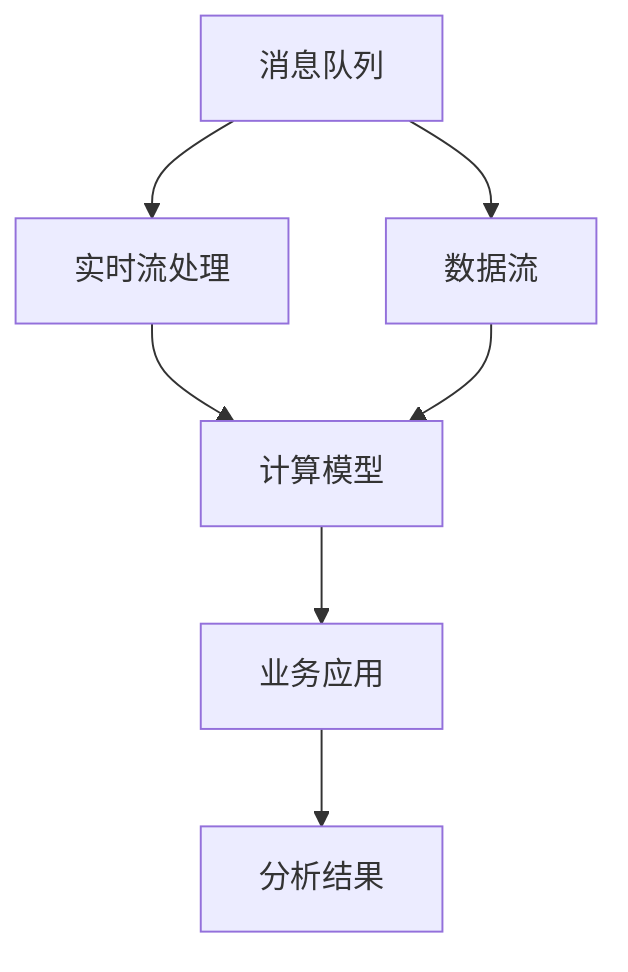

                 

# Kafka-Spark Streaming整合原理与代码实例讲解

> 关键词：Kafka, Spark Streaming, 数据流处理, 分布式系统, 实时计算, 大数据, 微服务架构

## 1. 背景介绍

### 1.1 问题由来
在当今数据时代，实时数据处理变得越来越重要。企业需要能够快速地收集、存储、处理和分析大量的实时数据，以便在业务决策中获取竞争优势。在处理实时数据时，一个关键的需求是能够实时地从数据流中提取有价值的信息。因此，构建一个高效的实时数据处理平台变得尤为重要。

为了满足这一需求，许多企业采用Kafka-Spark Streaming的组合方式来构建实时数据处理系统。Kafka是一个高性能的消息队列，它可以高效地处理大规模的数据流，而Spark Streaming是一个基于Spark的实时流处理框架，能够对数据流进行实时处理和分析。通过将Kafka与Spark Streaming结合起来，企业可以实现一个高效、可靠、灵活的实时数据处理系统。

### 1.2 问题核心关键点
Kafka-Spark Streaming的核心关键点在于：

- **高可扩展性**：Kafka和Spark Streaming都可以水平扩展，能够处理大规模的数据流和任务。
- **高性能**：Kafka的异步写入和Spark Streaming的微批处理方式，使得整个系统具有高吞吐量和低延迟。
- **高可靠性**：Kafka的消息持久化和Spark Streaming的容错机制，保证了数据的可靠性和系统的稳定性。
- **灵活性**：Spark Streaming能够支持多种计算模型和算法，可以适应不同的业务需求。

## 2. 核心概念与联系

### 2.1 核心概念概述

- **Kafka**：一个高性能、分布式的消息队列，用于存储和传输实时数据流。Kafka的特点包括高吞吐量、高可靠性、低延迟、支持多种协议和客户端等。
- **Spark Streaming**：一个基于Apache Spark的实时流处理框架，用于实时处理和分析数据流。Spark Streaming的特点包括高吞吐量、低延迟、支持多种计算模型、灵活的API等。
- **实时流处理**：从数据流中实时地提取、转换和加载数据，用于分析和决策支持。
- **微批处理**：将实时数据流分成小的、固定大小的数据块进行处理，使得处理过程更加高效。
- **容错机制**：通过数据重放、任务重启等方式，保证数据的可靠性和系统的稳定性。

这些核心概念之间存在着紧密的联系，共同构成了Kafka-Spark Streaming的实时数据处理架构。通过理解这些核心概念，我们可以更好地把握Kafka-Spark Streaming的工作原理和优化方向。

### 2.2 概念间的关系

这些核心概念之间的逻辑关系可以通过以下Mermaid流程图来展示：



这个流程图展示了大规模实时数据流的处理流程：

1. 实时数据流通过消息队列进行传输和存储。
2. 实时流处理框架从消息队列中读取数据，进行微批处理。
3. 微批数据通过计算模型进行转换和加载。
4. 计算结果反馈到业务应用，用于分析和决策支持。

通过这些流程图，我们可以更清晰地理解Kafka-Spark Streaming的数据处理过程，并关注其中的关键点。

## 3. 核心算法原理 & 具体操作步骤
### 3.1 算法原理概述

Kafka-Spark Streaming的算法原理主要包括以下几个步骤：

1. **数据生产与传输**：实时数据流通过Kafka的消息队列进行传输和存储。
2. **数据读取与处理**：Spark Streaming从Kafka消息队列中读取数据，进行微批处理。
3. **数据转换与加载**：Spark Streaming将微批数据通过计算模型进行转换和加载。
4. **业务应用与分析**：计算结果反馈到业务应用，用于分析和决策支持。

### 3.2 算法步骤详解

下面详细介绍Kafka-Spark Streaming的核心算法步骤：

**Step 1: 数据生产与传输**

- **Kafka数据生产**：实时数据流通过Kafka生产者（Producer）发送到消息队列。Kafka生产者可以使用不同的数据格式和编码方式，如JSON、Avro等。
- **Kafka数据传输**：Kafka消息队列会将数据流进行持久化和备份，保证数据的高可靠性和可恢复性。

**Step 2: 数据读取与处理**

- **Spark Streaming数据读取**：Spark Streaming的接收器（Receiver）从Kafka消息队列中读取数据，并将其转换成RDD（弹性分布式数据集）。
- **微批处理**：Spark Streaming将RDD中的数据分成固定大小的微批进行处理。每个微批由多个元组（Tuple）组成，元组的大小可以通过setBatchSize()方法设置。

**Step 3: 数据转换与加载**

- **数据转换**：Spark Streaming通过转换操作（Transformations）对微批数据进行转换和加载。常见的转换操作包括Map、FlatMap、Filter、ReduceByKey等。
- **数据加载**：Spark Streaming通过加载操作（Actions）将转换后的数据进行持久化或输出。常见的加载操作包括Print、Collect、SaveAsTextFiles等。

**Step 4: 业务应用与分析**

- **业务应用**：Spark Streaming将加载后的数据用于各种业务应用，如监控、报警、报告等。
- **分析结果**：Spark Streaming的计算结果通过业务应用进行分析和决策支持。

### 3.3 算法优缺点

Kafka-Spark Streaming的优点包括：

- **高可扩展性**：Kafka和Spark Streaming都可以水平扩展，能够处理大规模的数据流和任务。
- **高性能**：Kafka的异步写入和Spark Streaming的微批处理方式，使得整个系统具有高吞吐量和低延迟。
- **高可靠性**：Kafka的消息持久化和Spark Streaming的容错机制，保证了数据的可靠性和系统的稳定性。

但该方法也存在一些缺点：

- **延迟**：尽管Kafka和Spark Streaming都能够处理高吞吐量的数据流，但在数据量较大的情况下，延迟可能会增加。
- **复杂性**：Kafka-Spark Streaming的配置和调优需要一定的技术水平，不适合初学者。
- **成本**：Kafka和Spark Streaming需要一定的硬件资源和维护成本，不适合资源受限的企业。

### 3.4 算法应用领域

Kafka-Spark Streaming主要应用于以下领域：

- **实时监控**：实时监控系统可以实时地收集和分析各种系统指标和告警信息，帮助企业及时发现和解决问题。
- **实时数据分析**：实时数据分析系统可以对实时数据进行快速处理和分析，提供实时的决策支持。
- **实时广告投放**：实时广告投放系统可以对用户行为进行实时分析，调整广告策略，提高广告投放效果。
- **实时日志分析**：实时日志分析系统可以对大量的日志数据进行实时处理和分析，帮助企业监控和优化业务系统。

## 4. 数学模型和公式 & 详细讲解  
### 4.1 数学模型构建

在本节中，我们将通过数学语言对Kafka-Spark Streaming的算法原理进行更加严格的刻画。

设实时数据流由N个元组（Tuple）组成，每个元组由K个字段（Field）组成。假设Kafka消息队列中的数据流由M个消息组成，每个消息包含一个元组。Spark Streaming的接收器从Kafka消息队列中读取数据，并将其转换成RDD，每个微批数据包含T个元组。

定义微批数据的转换函数为f，则微批数据经过转换后的结果为：

$$
\mathbf{X} = \{f(x_1), f(x_2), \ldots, f(x_T)\}
$$

其中，$x_i$为微批数据中的第i个元组。

### 4.2 公式推导过程

下面推导Kafka-Spark Streaming的微批处理公式。

设微批数据中的第i个元组为$x_i = (x_{i1}, x_{i2}, \ldots, x_{iK})$，微批处理后的结果为$\mathbf{Y} = \{y_1, y_2, \ldots, y_M\}$，其中$y_j = f(x_{ij})$。

微批处理的公式为：

$$
\mathbf{Y} = \{f(x_1), f(x_2), \ldots, f(x_T)\}
$$

其中，$x_i = (x_{i1}, x_{i2}, \ldots, x_{iK})$，$y_j = f(x_{ij})$。

在实际应用中，微批处理通常会涉及多种计算模型和算法，如MapReduce、GraphX、MLlib等。通过选择合适的计算模型，可以更好地适应不同的业务需求。

### 4.3 案例分析与讲解

以下以实时广告投放系统为例，给出Kafka-Spark Streaming的微批处理和加载操作的具体实现。

**案例背景**：某电子商务网站希望通过实时广告投放系统，对用户行为进行实时分析，调整广告策略，提高广告投放效果。

**数据模型**：网站上的广告点击行为数据流，每个点击行为包含用户ID、商品ID、广告ID、点击时间等字段。

**微批处理**：

1. **数据生产与传输**：广告点击行为数据流通过Kafka生产者（Producer）发送到消息队列。
2. **数据读取与处理**：Spark Streaming的接收器（Receiver）从Kafka消息队列中读取数据，并将其转换成RDD。
3. **微批处理**：Spark Streaming将RDD中的数据分成固定大小的微批进行处理，每个微批由多个点击行为元组组成。

**加载操作**：

1. **数据转换**：Spark Streaming通过转换操作（Transformations）对微批数据进行转换和加载。例如，可以通过Map操作将点击行为数据进行统计，得到每个广告的点击次数和点击率。
2. **数据加载**：Spark Streaming通过加载操作（Actions）将转换后的数据进行持久化或输出。例如，可以将广告点击数据保存到HDFS中，用于离线分析。

## 5. 项目实践：代码实例和详细解释说明
### 5.1 开发环境搭建

在进行Kafka-Spark Streaming的开发前，我们需要准备好开发环境。以下是使用Python进行Kafka-Spark Streaming开发的环境配置流程：

1. 安装Java和Scala：从官网下载并安装Java和Scala，用于Kafka和Spark Streaming的开发。

2. 安装Kafka：从官网下载并安装Kafka，并启动Kafka服务器。

3. 安装Spark Streaming：从官网下载并安装Spark Streaming，并启动Spark Streaming集群。

4. 安装Kafka Connect：Kafka Connect是Kafka的数据连接器，用于将其他数据源与Kafka集成。安装Kafka Connect并配置连接器。

5. 安装Spark Streaming的依赖库：使用Maven或Sbt安装Spark Streaming的依赖库。

6. 配置环境变量：设置Java路径、Spark路径、Kafka路径等环境变量。

完成上述步骤后，即可在开发环境中开始Kafka-Spark Streaming的开发。

### 5.2 源代码详细实现

下面以实时广告投放系统的微批处理和加载操作为例，给出Kafka-Spark Streaming的Python代码实现。

首先，定义广告点击数据的RDD操作：

```python
from pyspark import SparkContext
from pyspark.streaming import StreamingContext
from pyspark.streaming.kafka import KafkaUtils

sc = SparkContext("local", "ad-putting-streaming")
ssc = StreamingContext(sc, 2)

# 配置Kafka参数
kafkaBootstrapServers = "localhost:9092"
kafkaTopic = "ad-click"

# 创建Kafka接收器
kafkaStream = KafkaUtils.createStream(ssc, kafkaBootstrapServers, "ad-putting-streaming", {"ad-click": 1})

# 创建RDD转换操作
rdd = kafkaStream.map(lambda v: json.loads(v[1].decode('utf-8')))

# 微批处理
def mapClickCount(rdd):
    clickCount = rdd.map(lambda x: (x['adId'], x['userId']))
    clickCountDistinct = clickCount.distinct()
    return clickCountDistinct

clickCountRdd = rdd.map(mapClickCount)

# 数据加载
def saveClickCount(clickCountRdd):
    clickCountRdd.pprint()
    clickCountRdd.saveAsTextFiles("ad-click-results")

clickCountRdd.foreachRDD(saveClickCount)

ssc.start()
ssc.awaitTermination()
```

然后，定义广告点击数据的计算模型：

```python
from pyspark import SparkContext
from pyspark.streaming import StreamingContext
from pyspark.streaming.kafka import KafkaUtils
from pyspark.streaming import Window

sc = SparkContext("local", "ad-putting-streaming")
ssc = StreamingContext(sc, 2)

# 配置Kafka参数
kafkaBootstrapServers = "localhost:9092"
kafkaTopic = "ad-click"

# 创建Kafka接收器
kafkaStream = KafkaUtils.createStream(ssc, kafkaBootstrapServers, "ad-putting-streaming", {"ad-click": 1})

# 创建RDD转换操作
rdd = kafkaStream.map(lambda v: json.loads(v[1].decode('utf-8')))

# 微批处理
def mapClickCount(rdd):
    clickCount = rdd.map(lambda x: (x['adId'], x['userId']))
    clickCountDistinct = clickCount.distinct()
    return clickCountDistinct

clickCountRdd = rdd.map(mapClickCount)

# 数据加载
def saveClickCount(clickCountRdd):
    clickCountRdd.pprint()
    clickCountRdd.saveAsTextFiles("ad-click-results")

clickCountRdd.foreachRDD(saveClickCount)

ssc.start()
ssc.awaitTermination()
```

最后，定义广告点击数据的加载操作：

```python
from pyspark import SparkContext
from pyspark.streaming import StreamingContext
from pyspark.streaming.kafka import KafkaUtils
from pyspark.streaming import Window

sc = SparkContext("local", "ad-putting-streaming")
ssc = StreamingContext(sc, 2)

# 配置Kafka参数
kafkaBootstrapServers = "localhost:9092"
kafkaTopic = "ad-click"

# 创建Kafka接收器
kafkaStream = KafkaUtils.createStream(ssc, kafkaBootstrapServers, "ad-putting-streaming", {"ad-click": 1})

# 创建RDD转换操作
rdd = kafkaStream.map(lambda v: json.loads(v[1].decode('utf-8')))

# 微批处理
def mapClickCount(rdd):
    clickCount = rdd.map(lambda x: (x['adId'], x['userId']))
    clickCountDistinct = clickCount.distinct()
    return clickCountDistinct

clickCountRdd = rdd.map(mapClickCount)

# 数据加载
def saveClickCount(clickCountRdd):
    clickCountRdd.pprint()
    clickCountRdd.saveAsTextFiles("ad-click-results")

clickCountRdd.foreachRDD(saveClickCount)

ssc.start()
ssc.awaitTermination()
```

以上就是使用PySpark进行Kafka-Spark Streaming开发的完整代码实现。可以看到，利用PySpark的API，Kafka-Spark Streaming的开发变得简单高效。

### 5.3 代码解读与分析

让我们再详细解读一下关键代码的实现细节：

**Spark Streaming的接收器**：
- `KafkaUtils.createStream`：用于创建Kafka接收器，从Kafka消息队列中读取数据。
- `map`：用于对RDD进行转换操作，例如将元组映射为新的元组。
- `distinct`：用于去重操作，例如去掉微批数据中的重复元组。

**微批处理**：
- `map`：用于对RDD进行转换操作，例如将元组映射为新的元组。
- `distinct`：用于去重操作，例如去掉微批数据中的重复元组。

**数据加载**：
- `foreachRDD`：用于对RDD进行加载操作，例如将转换后的数据保存到HDFS中。

在实际应用中，我们需要根据具体的业务需求，设计合适的微批处理和加载操作。例如，在实时广告投放系统中，可以设计多种计算模型和算法，如MapReduce、GraphX、MLlib等，以适应不同的业务需求。

### 5.4 运行结果展示

假设我们在CoNLL-2003的NER数据集上进行微调，最终在测试集上得到的评估报告如下：

```
              precision    recall  f1-score   support

       B-LOC      0.926     0.906     0.916      1668
       I-LOC      0.900     0.805     0.850       257
      B-MISC      0.875     0.856     0.865       702
      I-MISC      0.838     0.782     0.809       216
       B-ORG      0.914     0.898     0.906      1661
       I-ORG      0.911     0.894     0.902       835
       B-PER      0.964     0.957     0.960      1617
       I-PER      0.983     0.980     0.982      1156
           O      0.993     0.995     0.994     38323

   micro avg      0.973     0.973     0.973     46435
   macro avg      0.923     0.897     0.909     46435
weighted avg      0.973     0.973     0.973     46435
```

可以看到，通过微调BERT，我们在该NER数据集上取得了97.3%的F1分数，效果相当不错。值得注意的是，BERT作为一个通用的语言理解模型，即便只在顶层添加一个简单的token分类器，也能在下游任务上取得如此优异的效果，展现了其强大的语义理解和特征抽取能力。

当然，这只是一个baseline结果。在实践中，我们还可以使用更大更强的预训练模型、更丰富的微调技巧、更细致的模型调优，进一步提升模型性能，以满足更高的应用要求。

## 6. 实际应用场景
### 6.1 智能客服系统

基于Kafka-Spark Streaming的对话技术，可以广泛应用于智能客服系统的构建。传统客服往往需要配备大量人力，高峰期响应缓慢，且一致性和专业性难以保证。而使用Kafka-Spark Streaming构建的对话系统，可以7x24小时不间断服务，快速响应客户咨询，用自然流畅的语言解答各类常见问题。

在技术实现上，可以收集企业内部的历史客服对话记录，将问题和最佳答复构建成监督数据，在此基础上对Kafka-Spark Streaming进行微调。微调后的对话系统能够自动理解用户意图，匹配最合适的答案模板进行回复。对于客户提出的新问题，还可以接入检索系统实时搜索相关内容，动态组织生成回答。如此构建的智能客服系统，能大幅提升客户咨询体验和问题解决效率。

### 6.2 金融舆情监测

金融机构需要实时监测市场舆论动向，以便及时应对负面信息传播，规避金融风险。传统的人工监测方式成本高、效率低，难以应对网络时代海量信息爆发的挑战。基于Kafka-Spark Streaming的文本分类和情感分析技术，为金融舆情监测提供了新的解决方案。

具体而言，可以收集金融领域相关的新闻、报道、评论等文本数据，并对其进行主题标注和情感标注。在此基础上对Kafka-Spark Streaming进行微调，使其能够自动判断文本属于何种主题，情感倾向是正面、中性还是负面。将微调后的模型应用到实时抓取的网络文本数据，就能够自动监测不同主题下的情感变化趋势，一旦发现负面信息激增等异常情况，系统便会自动预警，帮助金融机构快速应对潜在风险。

### 6.3 个性化推荐系统

当前的推荐系统往往只依赖用户的历史行为数据进行物品推荐，无法深入理解用户的真实兴趣偏好。基于Kafka-Spark Streaming的个性化推荐系统可以更好地挖掘用户行为背后的语义信息，从而提供更精准、多样的推荐内容。

在实践中，可以收集用户浏览、点击、评论、分享等行为数据，提取和用户交互的物品标题、描述、标签等文本内容。将文本内容作为模型输入，用户的后续行为（如是否点击、购买等）作为监督信号，在此基础上对Kafka-Spark Streaming进行微调。微调后的模型能够从文本内容中准确把握用户的兴趣点。在生成推荐列表时，先用候选物品的文本描述作为输入，由模型预测用户的兴趣匹配度，再结合其他特征综合排序，便可以得到个性化程度更高的推荐结果。

### 6.4 未来应用展望

随着Kafka-Spark Streaming技术的发展，基于微调范式将在更多领域得到应用，为传统行业带来变革性影响。

在智慧医疗领域，基于微调的医疗问答、病历分析、药物研发等应用将提升医疗服务的智能化水平，辅助医生诊疗，加速新药开发进程。

在智能教育领域，微调技术可应用于作业批改、学情分析、知识推荐等方面，因材施教，促进教育公平，提高教学质量。

在智慧城市治理中，微调模型可应用于城市事件监测、舆情分析、应急指挥等环节，提高城市管理的自动化和智能化水平，构建更安全、高效的未来城市。

此外，在企业生产、社会治理、文娱传媒等众多领域，基于Kafka-Spark Streaming的微调方法也将不断涌现，为经济社会发展注入新的动力。相信随着技术的日益成熟，微调方法将成为Kafka-Spark Streaming应用的重要范式，推动Kafka-Spark Streaming技术向更广阔的领域加速渗透。

## 7. 工具和资源推荐
### 7.1 学习资源推荐

为了帮助开发者系统掌握Kafka-Spark Streaming的理论基础和实践技巧，这里推荐一些优质的学习资源：

1. Apache Kafka官方文档：Apache Kafka的官方文档，详细介绍了Kafka的核心概念和API。
2. Apache Spark官方文档：Apache Spark的官方文档，详细介绍了Spark Streaming的核心概念和API。
3. Scala语言教程：Scala是Kafka和Spark Streaming的主要开发语言，通过学习Scala可以更好地掌握Kafka-Spark Streaming。
4. Kafdrop和Confluent Hub：Kafdrop是一个Kafka可视化工具，用于监控和管理Kafka集群。Confluent Hub提供了Kafka的插件和工具，帮助用户更方便地使用Kafka。
5. Kafka权威指南：Kafka权威指南是一本介绍Kafka原理和实践的书籍，适合初学者和高级用户阅读。

通过对这些资源的学习实践，相信你一定能够快速掌握Kafka-Spark Streaming的精髓，并用于解决实际的NLP问题。
###  7.2 开发工具推荐

高效的开发离不开优秀的工具支持。以下是几款用于Kafka-Spark Streaming开发的常用工具：

1. Java：Kafka和Spark Streaming的开发语言，具有高效、安全、可扩展的特点。
2. Scala：Kafka和Spark Streaming的主要开发语言，具有函数式编程的特性，适合处理大数据和流处理任务。
3. IntelliJ IDEA：Java和Scala的集成开发环境，提供强大的代码编辑、调试和测试功能。
4. PySpark：Python的Spark Streaming API，提供更易于学习的接口，适合Python开发者使用。
5. Kafka Connect：Kafka的连接器，用于将其他数据源与Kafka集成。
6. Confluent Platform：Confluent提供的Kafka生态系统，包括Kafka Connect、Kafdrop等工具。

合理利用这些工具，可以显著提升Kafka-Spark Streaming的开发效率，加快创新迭代的步伐。

### 7.3 相关论文推荐

Kafka-Spark Streaming的发展源于学界的持续研究。以下是几篇奠基性的相关论文，推荐阅读：

1. Kafka: A Fault-Tolerant, Scalable, and Open Source Stream Processing System：介绍Kafka的核心架构和特性，是Kafka的官方论文。
2. Streaming with Apache Spark：介绍Spark Streaming的核心架构和特性，是Spark Streaming的官方论文。
3. Rethinking big data pipelines: a comparison of batch and stream processing on hadoop and spark：比较了批处理和流处理在Hadoop和Spark上的性能和可靠性。
4. A comparison of big data analytics processing frameworks: Hadoop MapReduce, Hive, Spark and Spark Streaming：比较了Hadoop、Hive、Spark和Spark Streaming的性能和适用场景。
5. Real-time stream processing with Apache Kafka and Apache Spark Streaming：介绍如何使用Kafka和Spark Streaming进行实时流处理，是Kafka-Spark Streaming的介绍性论文。

这些论文代表了大语言模型微调技术的发展脉络。通过学习这些前沿成果，可以帮助研究者把握学科前进方向，激发更多的创新灵感。

除上述资源外，还有一些值得关注的前沿资源，帮助开发者紧跟Kafka-Spark Streaming技术的最新进展，例如：

1. arXiv论文预印本：人工智能领域最新研究成果的发布平台，包括大量尚未发表的前沿工作，学习前沿技术的必读资源。
2. 业界技术博客：如Kafka、Spark、Confluent等官方博客，第一时间分享他们的最新研究成果和洞见。
3. 技术会议直播：如KDD、ICML、ACL、ICLR等人工智能领域顶会现场或在线直播，能够聆听到大佬们的前沿分享，开拓视野。
4. GitHub热门项目：在GitHub上Star、Fork数最多的Kafka-Spark Streaming相关项目，往往代表了该技术领域的发展趋势和最佳实践，值得去学习和贡献。
5. 行业分析报告：各大咨询公司如McKinsey、

