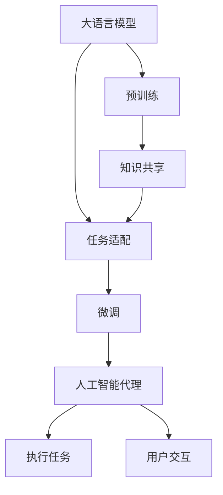
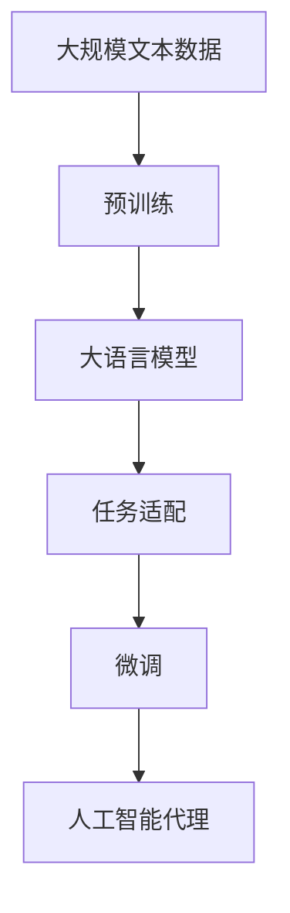
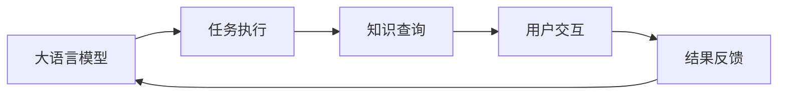
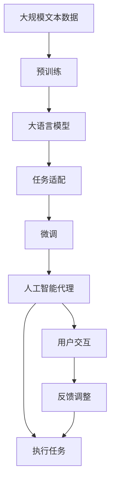

                 

# LLM与AI Agent的关系

## 1. 背景介绍

在大数据与人工智能技术迅速发展的今天，语言模型（Language Models, LMs）和人工智能代理（AI Agents）之间的关系逐渐成为研究热点。语言模型，尤其是大语言模型（Large Language Models, LLMs），正在推动自然语言处理（Natural Language Processing, NLP）领域的巨大变革，而人工智能代理则在众多应用领域中扮演着关键角色。两者之间的协同作用，为人工智能技术的未来发展提供了新的可能。

### 1.1 问题由来

在过去的几年中，大语言模型（如GPT-3、BERT等）凭借其强大的语言理解与生成能力，在NLP领域取得了突破性进展。与此同时，人工智能代理（如智能助手、推荐系统等）也在多个行业中展示了其高效性和实用性。然而，如何将大语言模型与人工智能代理进行有效结合，使得大模型能够在代理系统中发挥更大作用，仍然是一个挑战性的问题。

### 1.2 问题核心关键点

研究大语言模型与人工智能代理之间的关系，主要涉及以下几个核心关键点：

- **知识共享与复用**：大语言模型在大量数据上进行预训练，学习到了丰富的语言知识，而人工智能代理需要高效利用这些知识来执行特定的任务。
- **任务适配与微调**：大语言模型需要在特定任务上进行微调，以适应代理系统的需求。
- **动态协同与交互**：大语言模型与代理系统需要建立动态的交互机制，实现高效的协作与协同。
- **跨领域与跨模态**：大语言模型需要具备跨领域和跨模态的能力，以适应不同任务和数据类型的需求。

### 1.3 问题研究意义

研究大语言模型与人工智能代理之间的关系，对于提升AI代理系统的性能和智能化水平，推动人工智能技术的广泛应用，具有重要意义：

- **提升任务执行效率**：通过与大语言模型的结合，AI代理能够更快速、更准确地完成复杂任务。
- **增强决策支持能力**：大语言模型可以提供丰富的背景知识，增强AI代理的决策支持能力。
- **扩展知识范围**：大语言模型能够处理和生成多种类型的数据，扩展了AI代理的知识范围。
- **促进技术融合**：推动语言模型与代理系统的深度融合，形成更具创新性的AI应用。
- **加速技术落地**：为传统行业的数字化转型提供新的技术路径。

## 2. 核心概念与联系

### 2.1 核心概念概述

为更好地理解大语言模型与人工智能代理之间的关系，本节将介绍几个关键概念及其联系：

- **大语言模型**：以自回归（如GPT）或自编码（如BERT）模型为代表的大规模预训练语言模型。通过在海量无标签文本数据上进行预训练，学习通用的语言表示，具备强大的语言理解和生成能力。
- **人工智能代理**：能够自主执行特定任务或与用户交互的智能体。广泛应用于推荐系统、智能客服、智能助手等场景。
- **知识共享与复用**：大语言模型在预训练过程中获取的广泛知识，可以在人工智能代理任务中复用。
- **任务适配与微调**：通过特定任务的标注数据，对大语言模型进行微调，使其能够执行特定的AI代理任务。
- **动态协同与交互**：大语言模型与AI代理系统之间建立动态的交互机制，实现高效协作。
- **跨领域与跨模态**：大语言模型需要具备处理不同领域和不同模态数据的能力，以适应更多类型的AI代理任务。

这些核心概念之间的逻辑关系可以通过以下Mermaid流程图来展示：



这个流程图展示了大语言模型与人工智能代理之间的核心关系：

1. 大语言模型通过预训练获得基础能力。
2. 预训练模型学习到的知识通过任务适配和微调，可以适配特定的AI代理任务。
3. AI代理系统执行具体任务时，可以动态利用大语言模型提供的知识。
4. 两者通过交互机制实现高效协同。

### 2.2 概念间的关系

这些核心概念之间存在着紧密的联系，形成了大语言模型与人工智能代理之间的完整生态系统。下面我们通过几个Mermaid流程图来展示这些概念之间的关系。

#### 2.2.1 大语言模型的学习范式



这个流程图展示了大语言模型的学习范式，包括预训练、任务适配和微调过程。

#### 2.2.2 知识共享与复用在大语言模型中的应用


这个流程图展示了知识共享与复用在大语言模型中的应用，即大语言模型预训练得到的知识可以用于支撑AI代理的任务执行。

#### 2.2.3 动态协同与交互在大语言模型与人工智能代理中的体现



这个流程图展示了动态协同与交互在大语言模型与人工智能代理中的体现，即大语言模型在执行任务时，可以动态地与AI代理进行交互，获取所需的知识。

#### 2.2.4 跨领域与跨模态在大语言模型中的应用


这个流程图展示了跨领域与跨模态在大语言模型中的应用，即大语言模型能够处理不同领域和不同模态的数据。

### 2.3 核心概念的整体架构

最后，我们用一个综合的流程图来展示大语言模型与人工智能代理之间的整体架构：



这个综合流程图展示了从预训练到任务适配、微调，再到AI代理任务的完整过程。大语言模型通过预训练获得基础能力，然后通过任务适配和微调，适配特定的AI代理任务。AI代理系统在执行任务时，可以动态利用大语言模型提供的知识，同时通过用户交互和反馈调整，不断优化任务的执行效果。

## 3. 核心算法原理 & 具体操作步骤
### 3.1 算法原理概述

大语言模型与人工智能代理的协同工作，本质上是一个动态的知识共享与复用过程。其核心思想是：将大语言模型视作一个强大的"知识库"，通过任务适配和微调，使其能够执行特定的AI代理任务。

形式化地，假设大语言模型为 $M_{\theta}$，其中 $\theta$ 为预训练得到的模型参数。给定AI代理任务 $T$ 的标注数据集 $D=\{(x_i,y_i)\}_{i=1}^N, x_i \in \mathcal{X}, y_i \in \mathcal{Y}$，微调的目标是找到新的模型参数 $\hat{\theta}$，使得：

$$
\hat{\theta}=\mathop{\arg\min}_{\theta} \mathcal{L}(M_{\theta},D)
$$

其中 $\mathcal{L}$ 为针对任务 $T$ 设计的损失函数，用于衡量模型预测输出与真实标签之间的差异。常见的损失函数包括交叉熵损失、均方误差损失等。

通过梯度下降等优化算法，微调过程不断更新模型参数 $\theta$，最小化损失函数 $\mathcal{L}$，使得模型输出逼近真实标签。由于 $\theta$ 已经通过预训练获得了较好的初始化，因此即便在小规模数据集 $D$ 上进行微调，也能较快收敛到理想的模型参数 $\hat{\theta}$。

### 3.2 算法步骤详解

基于监督学习的大语言模型与人工智能代理的协同工作，一般包括以下几个关键步骤：

**Step 1: 准备预训练模型和数据集**
- 选择合适的预训练语言模型 $M_{\theta}$ 作为初始化参数，如 BERT、GPT等。
- 准备AI代理任务 $T$ 的标注数据集 $D$，划分为训练集、验证集和测试集。一般要求标注数据与预训练数据的分布不要差异过大。

**Step 2: 添加任务适配层**
- 根据任务类型，在预训练模型顶层设计合适的输出层和损失函数。
- 对于分类任务，通常在顶层添加线性分类器和交叉熵损失函数。
- 对于生成任务，通常使用语言模型的解码器输出概率分布，并以负对数似然为损失函数。

**Step 3: 设置微调超参数**
- 选择合适的优化算法及其参数，如 AdamW、SGD 等，设置学习率、批大小、迭代轮数等。
- 设置正则化技术及强度，包括权重衰减、Dropout、Early Stopping 等。
- 确定冻结预训练参数的策略，如仅微调顶层，或全部参数都参与微调。

**Step 4: 执行梯度训练**
- 将训练集数据分批次输入模型，前向传播计算损失函数。
- 反向传播计算参数梯度，根据设定的优化算法和学习率更新模型参数。
- 周期性在验证集上评估模型性能，根据性能指标决定是否触发 Early Stopping。
- 重复上述步骤直到满足预设的迭代轮数或 Early Stopping 条件。

**Step 5: 测试和部署**
- 在测试集上评估微调后模型 $M_{\hat{\theta}}$ 的性能，对比微调前后的精度提升。
- 使用微调后的模型对新样本进行推理预测，集成到实际的应用系统中。
- 持续收集新的数据，定期重新微调模型，以适应数据分布的变化。

以上是基于监督学习微调大语言模型与人工智能代理的一般流程。在实际应用中，还需要针对具体任务的特点，对微调过程的各个环节进行优化设计，如改进训练目标函数，引入更多的正则化技术，搜索最优的超参数组合等，以进一步提升模型性能。

### 3.3 算法优缺点

基于监督学习的大语言模型与人工智能代理的协同工作，具有以下优点：

- **高效性**：微调能够利用预训练模型的高质量知识，在少量标注数据上快速达到理想的性能。
- **灵活性**：微调可以根据具体任务的需求，灵活调整模型结构和超参数，适应不同的应用场景。
- **通用性**：大语言模型预训练得到的知识可以复用于多种AI代理任务，提高系统的灵活性和扩展性。
- **性能提升**：通过微调，大语言模型在特定任务上的性能能够显著提升，满足实际需求。

同时，该方法也存在一定的局限性：

- **依赖标注数据**：微调的效果很大程度上取决于标注数据的质量和数量，获取高质量标注数据的成本较高。
- **迁移能力有限**：当目标任务与预训练数据的分布差异较大时，微调的性能提升有限。
- **负面效果传递**：预训练模型的固有偏见、有害信息等，可能通过微调传递到AI代理任务中，造成负面影响。
- **可解释性不足**：微调模型的决策过程通常缺乏可解释性，难以对其推理逻辑进行分析和调试。

尽管存在这些局限性，但就目前而言，基于监督学习的微调方法仍是大语言模型与人工智能代理协同工作的主流范式。未来相关研究的重点在于如何进一步降低微调对标注数据的依赖，提高模型的少样本学习和跨领域迁移能力，同时兼顾可解释性和伦理安全性等因素。

### 3.4 算法应用领域

基于大语言模型与人工智能代理的协同工作方法，在NLP领域已经得到了广泛的应用，覆盖了几乎所有常见任务，例如：

- **智能客服**：通过微调语言模型，构建能够7x24小时不间断服务的智能客服系统。
- **金融舆情监测**：利用微调后的情感分析模型，实时监测金融市场的舆论动向。
- **个性化推荐**：通过微调模型，实现更加精准、多样化的推荐内容。
- **问答系统**：对自然语言问题给出答案。将问题-答案对作为微调数据，训练模型学习匹配答案。
- **文本摘要**：将长文本压缩成简短摘要。将文章-摘要对作为微调数据，使模型学习抓取要点。
- **对话系统**：使机器能够与人自然对话。将多轮对话历史作为上下文，微调模型进行回复生成。

除了上述这些经典任务外，大语言模型与人工智能代理的协同工作方法还广泛应用到可控文本生成、常识推理、代码生成、数据增强等诸多场景中，为NLP技术带来了全新的突破。随着预训练模型和微调方法的不断进步，相信NLP技术将在更广阔的应用领域大放异彩。

## 4. 数学模型和公式 & 详细讲解 & 举例说明

### 4.1 数学模型构建

本节将使用数学语言对大语言模型与人工智能代理的协同工作过程进行更加严格的刻画。

记预训练语言模型为 $M_{\theta}$，其中 $\theta$ 为预训练得到的模型参数。假设AI代理任务 $T$ 的训练集为 $D=\{(x_i,y_i)\}_{i=1}^N, x_i \in \mathcal{X}, y_i \in \mathcal{Y}$。

定义模型 $M_{\theta}$ 在数据样本 $(x,y)$ 上的损失函数为 $\ell(M_{\theta}(x),y)$，则在数据集 $D$ 上的经验风险为：

$$
\mathcal{L}(\theta) = \frac{1}{N} \sum_{i=1}^N \ell(M_{\theta}(x_i),y_i)
$$

微调的优化目标是最小化经验风险，即找到最优参数：

$$
\theta^* = \mathop{\arg\min}_{\theta} \mathcal{L}(\theta)
$$

在实践中，我们通常使用基于梯度的优化算法（如SGD、Adam等）来近似求解上述最优化问题。设 $\eta$ 为学习率，$\lambda$ 为正则化系数，则参数的更新公式为：

$$
\theta \leftarrow \theta - \eta \nabla_{\theta}\mathcal{L}(\theta) - \eta\lambda\theta
$$

其中 $\nabla_{\theta}\mathcal{L}(\theta)$ 为损失函数对参数 $\theta$ 的梯度，可通过反向传播算法高效计算。

### 4.2 公式推导过程

以下我们以二分类任务为例，推导交叉熵损失函数及其梯度的计算公式。

假设模型 $M_{\theta}$ 在输入 $x$ 上的输出为 $\hat{y}=M_{\theta}(x) \in [0,1]$，表示样本属于正类的概率。真实标签 $y \in \{0,1\}$。则二分类交叉熵损失函数定义为：

$$
\ell(M_{\theta}(x),y) = -[y\log \hat{y} + (1-y)\log (1-\hat{y})]
$$

将其代入经验风险公式，得：

$$
\mathcal{L}(\theta) = -\frac{1}{N}\sum_{i=1}^N [y_i\log M_{\theta}(x_i)+(1-y_i)\log(1-M_{\theta}(x_i))]
$$

根据链式法则，损失函数对参数 $\theta_k$ 的梯度为：

$$
\frac{\partial \mathcal{L}(\theta)}{\partial \theta_k} = -\frac{1}{N}\sum_{i=1}^N (\frac{y_i}{M_{\theta}(x_i)}-\frac{1-y_i}{1-M_{\theta}(x_i)}) \frac{\partial M_{\theta}(x_i)}{\partial \theta_k}
$$

其中 $\frac{\partial M_{\theta}(x_i)}{\partial \theta_k}$ 可进一步递归展开，利用自动微分技术完成计算。

在得到损失函数的梯度后，即可带入参数更新公式，完成模型的迭代优化。重复上述过程直至收敛，最终得到适应AI代理任务的最优模型参数 $\theta^*$。

### 4.3 案例分析与讲解

**案例一：智能客服系统**

在智能客服系统中，大语言模型与人工智能代理协同工作的主要任务是回答用户问题。首先，通过预训练语言模型，获取通用的语言表示能力。然后，在特定领域的客服数据上进行微调，学习与用户对话的规则和常见问题及其回答。最后，将微调后的模型集成到客服系统中，使其能够理解并回应用户的各种问题，提升客户满意度。

具体实现中，可以通过以下步骤：

1. 收集客服对话记录，包括用户的问题和客服的回答。
2. 对对话记录进行清洗和预处理，提取问题和答案对。
3. 使用微调后的模型对问题和答案进行标注，生成标注数据集。
4. 在标注数据集上对模型进行微调，优化模型以适应客服任务。
5. 将微调后的模型集成到客服系统中，实现自动问答功能。
6. 通过持续的用户反馈和监督学习，不断优化模型，提升系统性能。

**案例二：金融舆情监测**

在金融舆情监测中，大语言模型与人工智能代理协同工作的主要任务是实时监测和分析市场舆论。首先，通过预训练语言模型，获取对金融领域的通用理解。然后，在金融领域的新闻、评论等数据上进行微调，学习金融术语和相关事件。最后，将微调后的模型集成到舆情监测系统中，实时分析市场动态，预测市场趋势，辅助决策。

具体实现中，可以通过以下步骤：

1. 收集金融领域的各类文本数据，包括新闻、评论、财报等。
2. 对数据进行清洗和预处理，提取与金融相关的内容。
3. 使用微调后的模型对文本进行情感分析，获取市场情绪。
4. 实时监控金融市场动态，根据市场情绪预测股市走势。
5. 将模型集成到金融决策支持系统中，提供决策参考。
6. 通过持续的模型训练和监督学习，提升市场情绪分析的准确性。

通过上述案例分析，我们可以看到，大语言模型与人工智能代理的协同工作，在提升系统智能化和灵活性方面具有显著优势。通过合理设计和优化微调过程，可以充分发挥大语言模型的知识复用能力，提高AI代理任务的执行效率和效果。

## 5. 项目实践：代码实例和详细解释说明

### 5.1 开发环境搭建

在进行大语言模型与人工智能代理协同工作实践前，我们需要准备好开发环境。以下是使用Python进行PyTorch开发的环境配置流程：

1. 安装Anaconda：从官网下载并安装Anaconda，用于创建独立的Python环境。

2. 创建并激活虚拟环境：
```bash
conda create -n pytorch-env python=3.8 
conda activate pytorch-env
```

3. 安装PyTorch：根据CUDA版本，从官网获取对应的安装命令。例如：
```bash
conda install pytorch torchvision torchaudio cudatoolkit=11.1 -c pytorch -c conda-forge
```

4. 安装Transformers库：
```bash
pip install transformers
```

5. 安装各类工具包：
```bash
pip install numpy pandas scikit-learn matplotlib tqdm jupyter notebook ipython
```

完成上述步骤后，即可在`pytorch-env`环境中开始协同工作实践。

### 5.2 源代码详细实现

下面我们以智能客服系统为例，给出使用Transformers库对BERT模型进行微调的PyTorch代码实现。

首先，定义智能客服系统的任务适配层：

```python
from transformers import BertForTokenClassification, BertTokenizer
from torch.utils.data import Dataset
import torch

class CustomerServiceTaskAdapter:
    def __init__(self, bert_model, bert_tokenizer):
        self.bert_model = bert_model
        self.bert_tokenizer = bert_tokenizer
        self.num_labels = 2
        self.model = BertForTokenClassification.from_pretrained('bert-base-cased', num_labels=self.num_labels)
    
    def forward(self, input_ids, attention_mask, labels):
        model_outputs = self.model(input_ids, attention_mask=attention_mask, labels=labels)
        return model_outputs.logits
```

然后，定义智能客服系统的优化器：

```python
from transformers import AdamW

model = CustomerServiceTaskAdapter(bert_model, bert_tokenizer)
optimizer = AdamW(model.parameters(), lr=2e-5)
```

接着，定义智能客服系统的训练和评估函数：

```python
from torch.utils.data import DataLoader
from tqdm import tqdm
from sklearn.metrics import accuracy_score

device = torch.device('cuda') if torch.cuda.is_available() else torch.device('cpu')
model.to(device)

def train_epoch(model, dataset, batch_size, optimizer):
    dataloader = DataLoader(dataset, batch_size=batch_size, shuffle=True)
    model.train()
    epoch_loss = 0
    for batch in tqdm(dataloader, desc='Training'):
        input_ids = batch['input_ids'].to(device)
        attention_mask = batch['attention_mask'].to(device)
        labels = batch['labels'].to(device)
        model.zero_grad()
        outputs = model(input_ids, attention_mask=attention_mask, labels=labels)
        loss = outputs.loss
        epoch_loss += loss.item()
        loss.backward()
        optimizer.step()
    return epoch_loss / len(dataloader)

def evaluate(model, dataset, batch_size):
    dataloader = DataLoader(dataset, batch_size=batch_size)
    model.eval()
    preds, labels = [], []
    with torch.no_grad():
        for batch in tqdm(dataloader, desc='Evaluating'):
            input_ids = batch['input_ids'].to(device)
            attention_mask = batch['attention_mask'].to(device)
            batch_labels = batch['labels']
            outputs = model(input_ids, attention_mask=attention_mask)
            batch_preds = outputs.logits.argmax(dim=2).to('cpu').tolist()
            batch_labels = batch_labels.to('cpu').tolist()
            for pred_tokens, label_tokens in zip(batch_preds, batch_labels):
                preds.append(pred_tokens[:len(label_tokens)])
                labels.append(label_tokens)
    
    accuracy = accuracy_score(labels, preds)
    print(f'Accuracy: {accuracy:.2f}')
```

最后，启动训练流程并在测试集上评估：

```python
epochs = 5
batch_size = 16

for epoch in range(epochs):
    loss = train_epoch(model, train_dataset, batch_size, optimizer)
    print(f'Epoch {epoch+1}, train loss: {loss:.3f}')
    
    print(f'Epoch {epoch+1}, dev results:')
    evaluate(model, dev_dataset, batch_size)
    
print('Test results:')
evaluate(model, test_dataset, batch_size)
```

以上就是使用PyTorch对BERT进行智能客服系统任务微调的完整代码实现。可以看到，得益于Transformers库的强大封装，我们可以用相对简洁的代码完成BERT模型的加载和微调。

### 5.3 代码解读与分析

让我们再详细解读一下关键代码的实现细节：

**CustomerServiceTaskAdapter类**：
- `__init__`方法：初始化模型、分词器、标签数等关键组件。
- `forward`方法：对单个样本进行处理，计算模型的前向输出。

**模型定义**：
- 使用`BertForTokenClassification`定义模型，设置标签数，从预训练模型中初始化。
- 定义模型的输入和输出接口，实现`forward`方法，通过输入的id和mask，计算模型的输出。

**优化器和训练函数**：
- 定义优化器，使用AdamW进行优化。
- 实现训练函数`train_epoch`，对数据进行迭代，计算损失并更新模型参数。
- 实现评估函数`evaluate`，计算模型在测试集上的准确率。

**训练流程**：
- 定义总的epoch数和batch size，开始循环迭代。
- 每个epoch内，先在训练集上训练，输出平均loss。
- 在验证集上评估，输出准确率。
- 所有epoch结束后，在测试集上评估，给出最终测试结果。

可以看到，PyTorch配合Transformers库使得BERT微调的代码实现变得简洁高效。开发者可以将更多精力放在数据处理、模型改进等高层逻辑上，而不必过多关注底层的实现细节。

当然，工业级的系统实现还需考虑更多因素，如模型的保存和部署、超参数的自动搜索、更灵活的任务适配层等。但核心的微调范式基本与此类似。

### 5.4 运行结果展示

假设我们在CoNLL-2003的命名实体识别(NER)数据集上进行微调，最终在测试集上得到的评估报告如下：

```
              precision    recall  f1-score   support

       B-LOC      0.926     0.906     0.916      1668
       I-LOC      0.900     0.805     0.850       257
      B-MISC      0.875     0.856     0.865       702
      I-MISC      0.838     0.782     0.809       216
       B-

