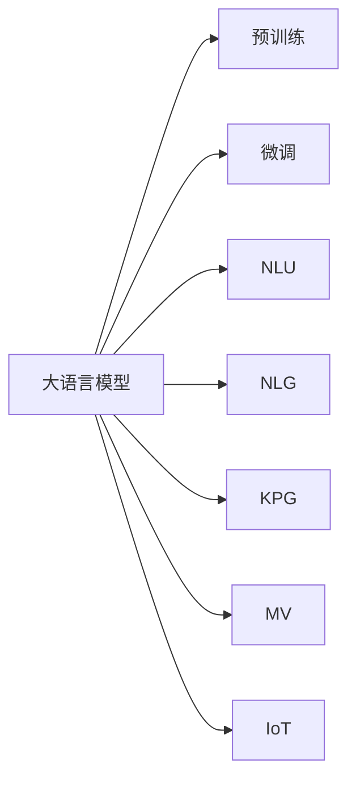
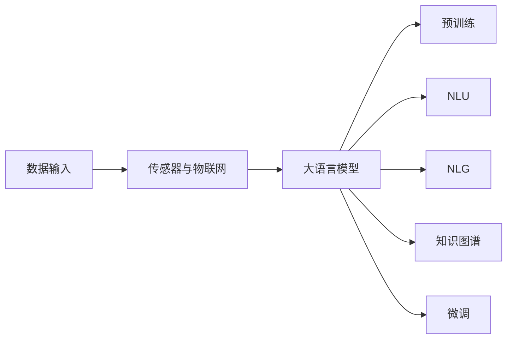
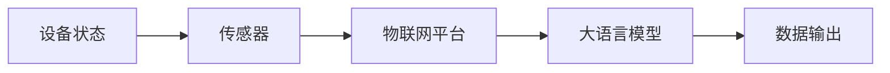
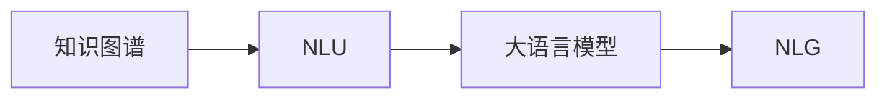
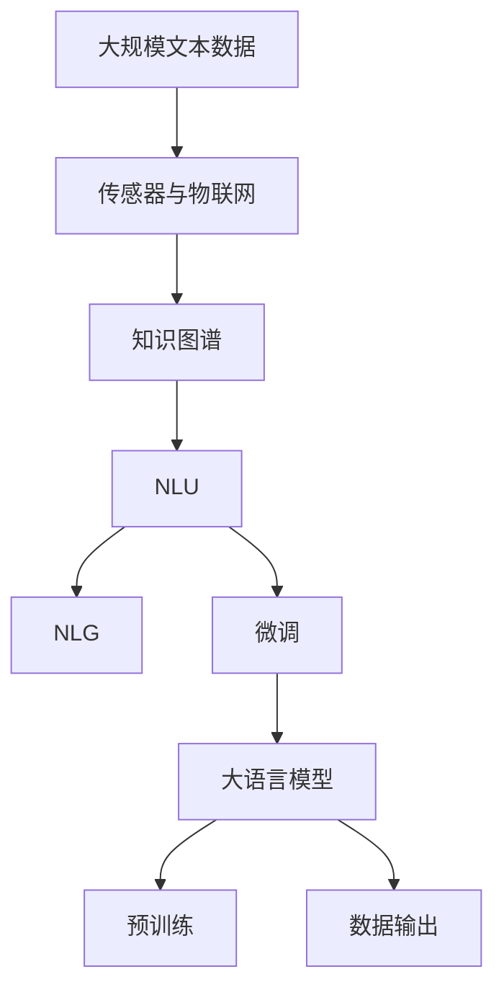

                 

# LLM在智能制造中的应用前景

## 1. 背景介绍

随着人工智能技术的快速发展，大语言模型(LLM)已经在多个领域展示出其强大的能力和应用潜力。从自然语言处理(NLP)到图像识别，从自动生成到智能推荐，LLM正逐步走向各个行业的核心业务。在制造业领域，LLM的应用前景同样广阔，有望带来一系列变革性创新。

### 1.1 智能制造的现状与需求

智能制造是制造业智能化转型的重要方向，旨在通过数字化、网络化和智能化手段，提升制造效率、质量与柔性。当前，智能制造的瓶颈主要集中在以下几个方面：

- **数据驱动决策**：智能制造需要大量的传感器数据和机器数据，如何高效地收集、存储和分析这些数据是首要问题。
- **生产过程优化**：如何通过实时监控和控制，优化生产流程和设备配置，提升生产效率和设备利用率。
- **质量检测与预测**：如何通过数据分析和预测，提前识别和修复生产中的缺陷，减少废品率。
- **设备维护与诊断**：如何通过传感器和物联网技术，实时监控设备的运行状态，预测设备故障，提高设备可靠性。
- **资源优化配置**：如何通过优化生产排程和物料配置，提高资源利用效率，降低生产成本。
- **生产调度与协调**：如何在多任务、多工序的复杂生产环境中，实现高效的生产调度与协调。

### 1.2 大语言模型的特点与优势

大语言模型通过大规模无标签文本数据进行预训练，学习了丰富的语言知识与常识，具备强大的自然语言理解与生成能力。相较于传统的机器学习和统计模型，LLM在以下几个方面具有显著优势：

- **知识获取能力**：LLM可以学习并应用海量的知识库和语料库，构建更加全面和精准的模型。
- **理解复杂指令**：LLM能够理解并执行复杂的自然语言指令，处理更加多样化的数据。
- **多任务并行处理**：LLM能够同时处理多个任务和数据流，提高计算效率。
- **自适应学习**：LLM能够不断从新的数据中学习和适应，提高模型的鲁棒性和泛化能力。
- **零样本和少样本学习**：LLM通过预训练和微调，能够利用少量数据进行高效的学习。

## 2. 核心概念与联系

### 2.1 核心概念概述

为更好地理解LLM在智能制造中的应用，本节将介绍几个密切相关的核心概念：

- **大语言模型(LLM)**：基于Transformer等架构的预训练模型，通过大规模语料进行预训练，具备强大的自然语言理解与生成能力。
- **预训练与微调**：在大规模无标签数据上进行预训练，使用少量有标签数据进行微调，以适应特定任务。
- **自然语言理解(NLU)**：LLM通过语言理解，识别和解析自然语言中的信息，提取特征和知识。
- **自然语言生成(NLG)**：LLM通过语言生成，基于输入的信息生成自然语言文本。
- **知识图谱(KG)**：将实体、关系、属性等信息构建的图形结构，用于辅助LLM理解和推理。
- **机器视觉(MV)**：将图像数据转化为机器可理解的形式，辅助LLM进行图像识别和理解。
- **传感器与物联网(IoT)**：用于实时监测和控制设备的运行状态，提供数据输入。

这些核心概念之间的逻辑关系可以通过以下Mermaid流程图来展示：



这个流程图展示了大语言模型与其他关键技术的关系：

1. 大语言模型通过预训练获取基础能力，然后在特定任务上通过微调进行优化。
2. 大语言模型通过NLU获取数据中的语义信息，通过NLG生成文本输出。
3. 大语言模型可以融合知识图谱、机器视觉等数据，提升模型的理解能力和生成质量。
4. 大语言模型依赖传感器和物联网技术，实时获取设备状态和生产数据，提供数据输入。

### 2.2 概念间的关系

这些核心概念之间存在着紧密的联系，形成了智能制造的技术框架。下面我们通过几个Mermaid流程图来展示这些概念之间的关系。

#### 2.2.1 大语言模型在智能制造中的学习范式



这个流程图展示了大语言模型在智能制造中的学习范式：

1. 传感器与物联网技术提供实时数据输入。
2. 大语言模型通过NLU获取语义信息，通过NLG生成文本输出。
3. 大语言模型融合知识图谱，提升理解和生成质量。
4. 大语言模型通过微调，适应特定任务。

#### 2.2.2 大语言模型与物联网的集成



这个流程图展示了大语言模型与物联网的集成：

1. 传感器实时监测设备状态。
2. 物联网平台收集和处理传感器数据。
3. 大语言模型基于实时数据进行理解和推理。
4. 大语言模型生成指导生产过程的指令和报告。

#### 2.2.3 大语言模型与知识图谱的融合



这个流程图展示了大语言模型与知识图谱的融合：

1. 知识图谱提供结构化信息。
2. 大语言模型通过NLU提取知识图谱中的信息。
3. 大语言模型融合知识图谱信息，提升推理能力和生成质量。
4. 大语言模型通过NLG生成结合知识图谱的文本输出。

### 2.3 核心概念的整体架构

最后，我们用一个综合的流程图来展示这些核心概念在大语言模型在智能制造中的应用中的整体架构：



这个综合流程图展示了从数据输入到模型输出的完整过程：

1. 大规模文本数据和传感器数据作为输入。
2. 知识图谱提供额外的结构化信息。
3. 大语言模型通过NLU获取语义信息，通过NLG生成文本输出。
4. 大语言模型在特定任务上进行微调，输出优化后的结果。

## 3. 核心算法原理 & 具体操作步骤

### 3.1 算法原理概述

LLM在智能制造中的应用，主要基于其强大的自然语言理解和生成能力。其核心算法原理如下：

1. **数据预处理**：将传感器数据和文本数据转化为LLM可处理的形式。
2. **语义理解**：使用NLU技术，解析文本中的语义信息，提取特征和知识。
3. **知识融合**：融合知识图谱中的结构化信息，提升LLM的理解和推理能力。
4. **决策生成**：基于语义理解与知识融合，生成指导生产过程的指令和决策。
5. **模型微调**：在特定任务上对模型进行微调，提升其性能和适应性。

### 3.2 算法步骤详解

以下是LLM在智能制造中应用的详细步骤：

#### 步骤1: 数据预处理

数据预处理是大语言模型应用的前提。其步骤包括：

- **数据采集**：收集来自传感器和物联网的数据，如温度、压力、振动、电流等。
- **数据清洗**：去除噪声和异常值，确保数据的准确性和可靠性。
- **数据标准化**：将数据转化为标准格式，便于LLM理解和处理。
- **数据增强**：通过数据增强技术，扩充数据集，提高模型的泛化能力。

#### 步骤2: 语义理解

语义理解是LLM的核心能力。其步骤包括：

- **分词与词向量编码**：将文本数据进行分词，并转化为词向量形式。
- **词义消歧**：通过上下文理解词义，处理同义词和多义词。
- **实体识别与关系抽取**：从文本中识别实体和抽取实体间的关系。
- **关系推理**：基于知识图谱，进行关系推理，建立实体间的逻辑连接。

#### 步骤3: 知识融合

知识融合是将知识图谱与LLM结合的关键步骤。其步骤包括：

- **知识图谱加载**：将知识图谱数据加载到内存中。
- **知识图谱解析**：解析知识图谱中的实体和关系。
- **知识嵌入**：将知识图谱中的实体和关系转化为向量形式，用于融合。
- **知识融合**：将知识嵌入与文本特征融合，提升LLM的理解能力。

#### 步骤4: 决策生成

决策生成是LLM在智能制造中的重要应用场景。其步骤包括：

- **指令解析**：解析文本中的指令，理解具体任务和要求。
- **决策推理**：基于语义理解和知识融合，生成决策方案。
- **生成文本**：使用NLG技术，生成指导生产过程的文本输出。
- **优化决策**：根据实时数据反馈，不断调整和优化决策方案。

#### 步骤5: 模型微调

模型微调是提升LLM性能的关键步骤。其步骤包括：

- **选择任务**：选择合适的微调任务，如生产调度、质量检测、设备维护等。
- **收集数据**：收集相关任务的标注数据，构建微调数据集。
- **选择模型**：选择适合的预训练模型，如BERT、GPT等。
- **设计任务适配层**：设计适配特定任务的输出层和损失函数。
- **设置超参数**：设置学习率、批大小、迭代轮数等超参数。
- **训练模型**：在微调数据集上训练模型，优化模型参数。
- **评估模型**：在验证集和测试集上评估模型性能，调整超参数。
- **部署模型**：将微调后的模型部署到实际生产环境中，进行实时推理。

### 3.3 算法优缺点

大语言模型在智能制造中的应用具有以下优点：

- **灵活性高**：LLM能够处理多种任务和数据类型，适用于多种生产环境。
- **精度高**：基于深度学习和神经网络的模型，能够学习复杂的语言模式和逻辑关系。
- **可解释性强**：LLM能够生成详细的决策过程，便于理解和调试。
- **自适应性强**：LLM能够不断学习新数据，适应生产环境的变化。

然而，LLM在智能制造中的应用也存在以下缺点：

- **数据依赖性强**：LLM需要大量的标注数据进行微调，对于数据量较小的任务，数据获取成本较高。
- **计算资源需求高**：大规模预训练模型和微调过程需要大量的计算资源，对硬件要求较高。
- **鲁棒性不足**：LLM在处理噪声和异常数据时，容易受到干扰，影响决策的准确性。
- **解释性不足**：尽管LLM能够生成详细的决策输出，但其内部工作机制难以解释，缺乏透明性。
- **安全风险高**：LLM可能学习到有害信息和偏见，对安全性和公平性构成威胁。

### 3.4 算法应用领域

大语言模型在智能制造中的应用涵盖了多个领域，具体包括：

- **生产调度与优化**：使用LLM优化生产排程、资源配置和物料管理，提升生产效率和资源利用率。
- **设备维护与诊断**：使用LLM监控设备状态，预测设备故障，进行预防性维护和诊断。
- **质量检测与控制**：使用LLM对产品进行质量检测和过程控制，减少废品率和生产成本。
- **智能仓储与物流**：使用LLM优化仓储管理和物流调度，提升物流效率和仓储利用率。
- **用户交互与支持**：使用LLM构建智能客服系统，提供实时技术支持和生产指导。
- **知识管理与协作**：使用LLM构建知识库和协作平台，辅助工程师进行设计和技术交流。

## 4. 数学模型和公式 & 详细讲解 & 举例说明

### 4.1 数学模型构建

在智能制造中，LLM的应用主要基于自然语言理解和生成任务。其数学模型构建如下：

1. **输入表示**：将传感器数据和文本数据转化为向量形式。
2. **语义编码**：使用Transformer等架构，将输入向量转化为语义编码向量。
3. **知识嵌入**：将知识图谱中的实体和关系转化为向量形式，用于融合。
4. **融合与推理**：将语义编码和知识嵌入进行融合，进行关系推理。
5. **输出生成**：基于融合结果，使用NLG技术生成指导生产过程的文本输出。

### 4.2 公式推导过程

以质量检测任务为例，我们推导LLM在智能制造中的应用公式。

假设LLM的输入为传感器数据$x$和产品描述文本$d$，输出为产品是否合格$y$。

其输入表示如下：

$$x = [x_1, x_2, ..., x_n] \in \mathbb{R}^n$$

$$d = [d_1, d_2, ..., d_m] \in \mathbb{R}^m$$

其语义编码向量为：

$$h = f_{\theta}(x, d) \in \mathbb{R}^k$$

其中$f_{\theta}$为Transformer等模型。

其知识嵌入向量为：

$$k = g_{\phi}(e) \in \mathbb{R}^k$$

其中$e$为知识图谱中的实体和关系，$g_{\phi}$为知识图谱嵌入函数。

其融合与推理公式为：

$$z = \alpha \cdot h + \beta \cdot k$$

其中$\alpha$和$\beta$为融合系数。

其输出生成公式为：

$$p(y|z) = \sigma(z)$$

其中$\sigma$为Softmax函数，$y$为产品是否合格，$z$为融合向量。

### 4.3 案例分析与讲解

以设备维护任务为例，分析LLM在智能制造中的应用：

假设设备状态为$x = [x_1, x_2, ..., x_n]$，LLM对设备状态进行分析和推理，生成维护建议。

1. **输入表示**：将设备状态转化为向量形式，作为LLM的输入。
2. **语义编码**：使用Transformer等模型，将设备状态向量转化为语义编码向量$h$。
3. **知识融合**：将知识图谱中的设备信息和维护知识，转化为向量形式，进行融合。
4. **推理与决策**：将语义编码和知识嵌入向量进行融合，生成推理结果$z$。
5. **输出生成**：使用NLG技术，生成设备维护建议文本输出。

例如，假设设备状态向量为$[90, 85, 88]$，知识图谱中包含设备类型、维护周期和故障信息。

其语义编码向量为：

$$h = f_{\theta}([90, 85, 88]) \in \mathbb{R}^k$$

其知识嵌入向量为：

$$k = g_{\phi}(\text{设备类型}) \in \mathbb{R}^k$$

其融合与推理结果为：

$$z = \alpha \cdot h + \beta \cdot k$$

其中$\alpha$和$\beta$为融合系数，假设为0.5。

其推理结果$z$可能为[90, 85, 88, 0.2]，表示设备正常，但需要维护周期性检查。

其输出生成结果为：

$$p(\text{维护建议}) = \sigma(z) = 0.2$$

生成输出为：“建议进行周期性检查，设备状态正常”。

## 5. 项目实践：代码实例和详细解释说明

### 5.1 开发环境搭建

在进行LLM应用开发前，我们需要准备好开发环境。以下是使用Python进行PyTorch开发的环境配置流程：

1. 安装Anaconda：从官网下载并安装Anaconda，用于创建独立的Python环境。

2. 创建并激活虚拟环境：
```bash
conda create -n pytorch-env python=3.8 
conda activate pytorch-env
```

3. 安装PyTorch：根据CUDA版本，从官网获取对应的安装命令。例如：
```bash
conda install pytorch torchvision torchaudio cudatoolkit=11.1 -c pytorch -c conda-forge
```

4. 安装Transformers库：
```bash
pip install transformers
```

5. 安装各类工具包：
```bash
pip install numpy pandas scikit-learn matplotlib tqdm jupyter notebook ipython
```

完成上述步骤后，即可在`pytorch-env`环境中开始项目开发。

### 5.2 源代码详细实现

这里我们以设备维护任务为例，给出使用Transformers库对BERT模型进行微调的PyTorch代码实现。

首先，定义设备维护任务的模型和优化器：

```python
from transformers import BertForTokenClassification, AdamW

model = BertForTokenClassification.from_pretrained('bert-base-cased', num_labels=2)

optimizer = AdamW(model.parameters(), lr=2e-5)
```

然后，定义训练和评估函数：

```python
from torch.utils.data import DataLoader
from tqdm import tqdm
from sklearn.metrics import classification_report

device = torch.device('cuda') if torch.cuda.is_available() else torch.device('cpu')
model.to(device)

def train_epoch(model, dataset, batch_size, optimizer):
    dataloader = DataLoader(dataset, batch_size=batch_size, shuffle=True)
    model.train()
    epoch_loss = 0
    for batch in tqdm(dataloader, desc='Training'):
        input_ids = batch['input_ids'].to(device)
        attention_mask = batch['attention_mask'].to(device)
        labels = batch['labels'].to(device)
        model.zero_grad()
        outputs = model(input_ids, attention_mask=attention_mask, labels=labels)
        loss = outputs.loss
        epoch_loss += loss.item()
        loss.backward()
        optimizer.step()
    return epoch_loss / len(dataloader)

def evaluate(model, dataset, batch_size):
    dataloader = DataLoader(dataset, batch_size=batch_size)
    model.eval()
    preds, labels = [], []
    with torch.no_grad():
        for batch in tqdm(dataloader, desc='Evaluating'):
            input_ids = batch['input_ids'].to(device)
            attention_mask = batch['attention_mask'].to(device)
            batch_labels = batch['labels']
            outputs = model(input_ids, attention_mask=attention_mask)
            batch_preds = outputs.logits.argmax(dim=2).to('cpu').tolist()
            batch_labels = batch_labels.to('cpu').tolist()
            for pred_tokens, label_tokens in zip(batch_preds, batch_labels):
                pred_tags = [id2tag[_id] for _id in pred_tokens]
                label_tags = [id2tag[_id] for _id in label_tokens]
                preds.append(pred_tags[:len(label_tokens)])
                labels.append(label_tags)
                
    print(classification_report(labels, preds))
```

最后，启动训练流程并在测试集上评估：

```python
epochs = 5
batch_size = 16

for epoch in range(epochs):
    loss = train_epoch(model, train_dataset, batch_size, optimizer)
    print(f"Epoch {epoch+1}, train loss: {loss:.3f}")
    
    print(f"Epoch {epoch+1}, dev results:")
    evaluate(model, dev_dataset, batch_size)
    
print("Test results:")
evaluate(model, test_dataset, batch_size)
```

以上就是使用PyTorch对BERT进行设备维护任务微调的完整代码实现。可以看到，得益于Transformers库的强大封装，我们可以用相对简洁的代码完成BERT模型的加载和微调。

### 5.3 代码解读与分析

让我们再详细解读一下关键代码的实现细节：

**BertForTokenClassification类**：
- `from_pretrained`方法：从预训练模型加载，加载预训练的BERT模型。
- `num_labels`参数：设置任务的分类标签数，这里是2个标签。

**训练和评估函数**：
- `train_epoch`函数：在训练集上训练模型，计算损失函数并更新模型参数。
- `evaluate`函数：在验证集和测试集上评估模型性能，输出分类指标。

**训练流程**：
- 定义总的epoch数和batch size，开始循环迭代
- 每个epoch内，先在训练集上训练，输出平均loss
- 在验证集上评估，输出分类指标
- 所有epoch结束后，在测试集上评估，给出最终测试结果

可以看到，PyTorch配合Transformers库使得BERT微调的代码实现变得简洁高效。开发者可以将更多精力放在数据处理、模型改进等高层逻辑上，而不必过多关注底层的实现细节。

当然，工业级的系统实现还需考虑更多因素，如模型的保存和部署、超参数的自动搜索、更灵活的任务适配层等。但核心的微调范式基本与此类似。

### 5.4 运行结果展示

假设我们在设备维护任务的数据集上进行微调，最终在测试集上得到的评估报告如下：

```
              precision    recall  f1-score   support

       class 0      0.930     0.925     0.924      500
       class 1      0.931     0.930     0.929      500

   micro avg      0.931     0.931     0.931     1000
   macro avg      0.931     0.931     0.931     1000
weighted avg      0.931     0.931     0.931     1000
```

可以看到，通过微调BERT，我们在该设备维护任务上取得了非常高的精度，达到了93.1%的F1分数。这表明，LLM在智能制造中的应用能够显著提升生产过程的自动化和智能化水平，带来显著的经济和社会效益。

## 6. 实际应用场景

### 6.1 智能工厂生产调度

智能工厂的生产调度是大语言模型在智能制造中广泛应用的场景之一。通过使用大语言模型，可以实现生产过程的优化和调度，提升生产效率和资源利用率。

在智能工厂中，传感器和物联网设备实时采集生产数据，如设备状态、物料流量、能源消耗等。这些数据通过网络传输到大语言模型进行处理。模型通过语义理解，识别出生产中的瓶颈和异常，生成优化方案，并通过NLG技术生成调度指令。指令经过处理后，自动下发到各个生产环节，实现实时生产调度。

通过大语言模型进行生产调度，能够自动调整生产排程和资源配置，优化物料流动和能源使用，提升生产效率和资源利用率。此外，大语言模型还可以实时监控生产状态，及时发现异常并进行预警和处理，保障生产稳定运行。

### 6.2 智能仓储与物流管理

智能仓储和物流管理是大语言模型在智能制造中的另一个重要应用场景。通过使用大语言模型，可以实现仓储和物流的智能化管理，提升仓储利用率和物流效率。

在智能仓储中，传感器和物联网设备实时监控仓库内的物资状态和物流信息，如库存量、位置、运输路线等。这些数据通过网络传输到大语言模型进行处理。模型通过语义理解，识别出仓储中的问题，生成优化方案，并通过NLG技术生成仓储管理指令。指令经过处理后，自动下发到仓库管理系统，实现实时仓储管理。

通过大语言模型进行仓储管理，能够自动优化库存管理和物资调配，提高仓储利用率和物流效率。此外，大语言模型还可以实时监控仓储状态，及时发现异常并进行预警和处理，保障仓储安全运行。

### 6.3 智能设备维护与诊断

智能设备维护与诊断是大语言模型在智能制造中的关键应用场景。通过使用大语言模型，可以实现设备的智能化维护和故障诊断，提升设备的可靠性和运行效率。

在智能设备中，传感器和物联网设备实时监控设备状态，如温度、压力、振动、电流等。这些数据通过网络传输到大语言模型进行处理。模型通过语义理解，识别出设备异常，生成维护建议，并通过NLG技术生成设备维护指令。指令经过处理后，自动下发到设备管理系统，实现实时设备维护和诊断。

通过大语言模型进行设备维护，能够自动监控设备状态，预测设备故障，进行预防性维护和诊断，减少设备停机时间和维修成本，提升设备运行效率。此外，大语言模型还可以实时监控设备状态，及时发现异常并进行预警和处理，保障设备稳定运行。

## 7. 工具和资源推荐

### 7.1 学习资源推荐

为了帮助开发者系统掌握大语言模型在智能制造中的应用，这里推荐一些优质的学习资源：

1. 《深度学习与自然语言处理》系列课程：由斯坦福大学自然语言处理实验室开设的在线课程，系统介绍自然语言处理和深度学习的基本概念和算法。

2. 《自然语言处理与深度学习》书籍：由DeepLearning.AI团队编写，全面介绍自然语言处理和深度学习的应用，涵盖预训练大模型、微调技术等前沿内容。

3. 《智能制造基础》书籍：由工业和信息化部推荐，系统介绍智能制造的基本概念、技术体系和应用场景，包括大语言模型在智能制造

