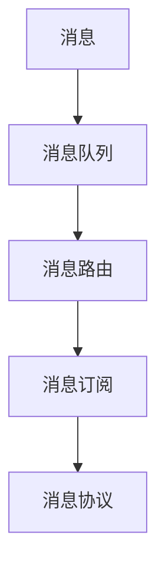
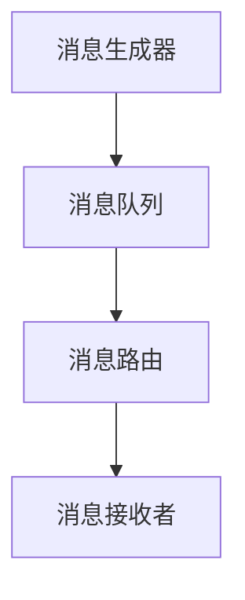
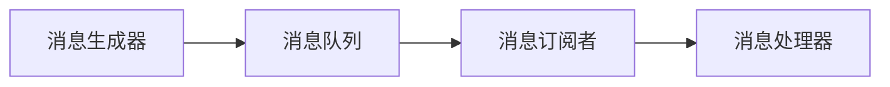
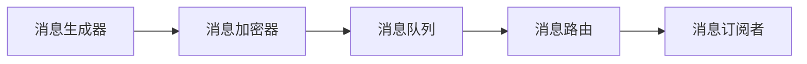
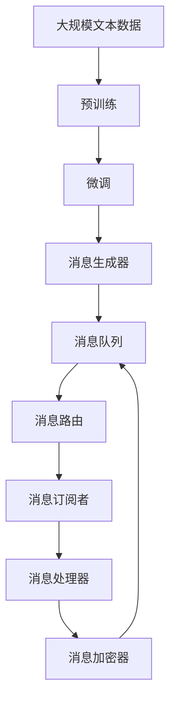

                 

# LLM消息机制:智能系统的通信桥梁

## 1. 背景介绍

### 1.1 问题由来

随着人工智能技术的飞速发展，大语言模型（Large Language Model, LLM）已经成为了自然语言处理（Natural Language Processing, NLP）领域的核心技术。LLM模型不仅能够理解并生成人类语言，还能在各种任务中展现出色的表现，如情感分析、机器翻译、问答系统等。然而，LLM在实际应用中仍面临一些挑战，尤其是在多个智能系统之间进行通信时，如何有效地传递信息、协调动作，成为了一个亟需解决的问题。

### 1.2 问题核心关键点

消息机制在大语言模型智能系统中扮演着重要的角色，它负责在各个智能组件之间传递信息，协调决策，使系统能够实现协同工作。核心关键点包括：

- 消息传递的效率和可靠性：如何在多智能组件间快速、准确地传递消息，保证系统性能。
- 消息的格式和内容：如何设计消息格式，使其既能包含足够的信息，又不过于复杂，方便理解和处理。
- 消息的路由和分发：如何根据任务的需要进行消息的路由和分发，保证消息传递的正确性和及时性。
- 消息的安全和隐私保护：如何确保消息传递过程中数据的安全和隐私，防止数据泄露和篡改。

### 1.3 问题研究意义

构建高效、安全、可靠的消息机制，对于提升大语言模型智能系统的性能和可靠性具有重要意义：

- 提升系统效率：通过优化消息传递机制，可以大幅提高系统处理速度和响应时间，提升用户体验。
- 增强系统协同：消息机制使不同智能组件能够更好地协同工作，实现更复杂的功能和任务。
- 确保数据安全：通过设计合适的消息安全机制，可以防止数据泄露和篡改，保障用户隐私和系统安全。
- 实现灵活扩展：消息机制可以方便地添加和删除智能组件，支持系统的灵活扩展和升级。

## 2. 核心概念与联系

### 2.1 核心概念概述

为了更好地理解消息机制在大语言模型智能系统中的应用，本节将介绍几个关键概念：

- **消息（Message）**：在智能系统中，消息是用于传递信息的数据包，通常包含发送者、接收者、消息内容和消息类型等信息。
- **消息队列（Message Queue）**：一种基于先进先出（FIFO）规则的数据结构，用于存储和管理消息，保证消息的可靠传递。
- **消息路由（Message Routing）**：根据消息的来源和目标，确定消息的传递路径，保证消息传递的正确性。
- **消息订阅（Message Subscription）**：一种机制，使智能组件能够订阅感兴趣的消息，减少不必要的消息传递，提升系统效率。
- **消息协议（Message Protocol）**：消息传递过程中遵循的规则和标准，用于保证消息的格式和内容的正确性和一致性。

这些概念之间的逻辑关系可以通过以下Mermaid流程图来展示：



这个流程图展示了消息机制的基本架构，从消息的产生、存储、传递到订阅和处理，每个环节都有明确的职责和规则，确保消息的可靠传递和高效处理。

### 2.2 概念间的关系

这些核心概念之间存在着紧密的联系，共同构成了消息机制在大语言模型智能系统中的完整生态系统。下面我们通过几个Mermaid流程图来展示这些概念之间的关系。

#### 2.2.1 消息的生成与传递



这个流程图展示了消息的生成、传递和接收过程。消息生成器根据任务需求生成消息，并将其存储在消息队列中，消息路由根据消息内容和接收者确定传递路径，最终消息被传递给接收者。

#### 2.2.2 消息的订阅与处理



这个流程图展示了消息的订阅和处理过程。消息生成器生成消息后存储在消息队列中，消息订阅者根据自己的需求订阅感兴趣的消息，消息处理器根据订阅者的请求处理消息，并返回处理结果。

#### 2.2.3 消息的安全与隐私



这个流程图展示了消息的安全与隐私保护过程。消息生成器生成消息后，首先经过加密器进行加密处理，存储在消息队列中，然后通过路由传递给订阅者，最后被解密处理。

### 2.3 核心概念的整体架构

最后，我们用一个综合的流程图来展示这些核心概念在大语言模型智能系统中的整体架构：



这个综合流程图展示了从数据预训练到消息生成的完整过程，从消息传递到处理，再到加密和解密，每个环节都有明确的职责和规则，确保消息的可靠传递和高效处理。

## 3. 核心算法原理 & 具体操作步骤
### 3.1 算法原理概述

在大语言模型智能系统中，消息机制通常采用基于消息队列（Message Queue）和消息路由（Message Routing）的架构。消息生成器将任务需求转化为消息，存储在消息队列中，由消息路由根据消息内容和接收者确定传递路径，最终消息被传递给相应的接收者。接收者根据消息内容进行处理，并将处理结果返回给生成者或队列。

消息队列通常采用先进先出（FIFO）规则，保证消息的可靠传递。消息路由根据消息的来源和目标，确定消息的传递路径，确保消息传递的正确性和及时性。消息订阅机制则允许智能组件根据需求订阅感兴趣的消息，减少不必要的消息传递，提升系统效率。

### 3.2 算法步骤详解

基于消息队列和消息路由的架构，消息机制的一般操作流程如下：

1. **消息生成**：根据任务需求，生成消息，并确定消息内容、目标接收者等信息。
2. **消息存储**：将生成的消息存储在消息队列中，确保消息的有序性和可靠性。
3. **消息路由**：根据消息内容和目标接收者，确定消息的传递路径，并将消息传递给相应的接收者。
4. **消息处理**：接收者根据消息内容进行处理，生成处理结果，返回给生成者或队列。
5. **消息删除**：处理完成后，将消息从队列中删除，释放存储资源。

### 3.3 算法优缺点

基于消息队列和消息路由的架构，具有以下优点：

- **高效性**：消息队列和消息路由机制保证了消息的有序性和及时性，提高了系统的处理效率。
- **可靠性**：先进先出的消息队列机制确保了消息的可靠传递，减少了数据丢失和延迟的风险。
- **灵活性**：消息订阅机制允许智能组件根据需求订阅感兴趣的消息，提升了系统的灵活性和扩展性。

然而，这种架构也存在一些缺点：

- **复杂性**：消息队列和消息路由机制增加了系统的复杂性，开发和维护成本较高。
- **资源消耗**：消息队列和消息路由需要额外的存储空间和计算资源，增加了系统的资源消耗。
- **实时性**：消息队列和消息路由机制虽然提高了系统的处理效率，但在某些实时性要求较高的场景下，可能会存在一定的延迟。

### 3.4 算法应用领域

基于消息队列和消息路由的消息机制，在智能系统中得到了广泛的应用，涵盖以下几个主要领域：

- **智能客服系统**：智能客服系统中的消息传递机制，用于实现客户和机器人的对话，提升客户体验。
- **金融交易系统**：金融交易系统中的消息传递机制，用于实现高频交易、风控预警等实时处理任务。
- **智能监控系统**：智能监控系统中的消息传递机制，用于实现告警、预警、数据分析等任务。
- **智能制造系统**：智能制造系统中的消息传递机制，用于实现生产调度、设备监控、质量检测等任务。
- **智能推荐系统**：智能推荐系统中的消息传递机制，用于实现用户行为分析、推荐算法调优等任务。

以上领域中，消息机制都是实现系统功能的关键技术，对于提升系统的效率、可靠性和灵活性具有重要意义。

## 4. 数学模型和公式 & 详细讲解  
### 4.1 数学模型构建

在本节中，我们将使用数学语言对消息机制在大语言模型智能系统中的应用进行更加严格的刻画。

假设消息生成器根据任务需求生成消息 $M$，消息队列存储消息，消息路由根据消息内容和接收者确定传递路径，消息接收者 $R$ 根据消息内容进行处理，并返回处理结果 $R(M)$。则消息传递的数学模型可以表示为：

$$
R(M) = f(M)
$$

其中，$f$ 表示消息处理函数。消息处理函数 $f$ 可以将消息 $M$ 转换为处理结果 $R$，具体的处理方式取决于消息内容、任务需求和接收者的功能。

### 4.2 公式推导过程

为了更好地理解消息处理函数 $f$ 的设计和实现，我们可以推导出一些基本的数学公式。

假设消息 $M$ 的内容为 $C$，目标接收者为 $T$，消息处理函数 $f$ 的具体实现方式为：

$$
R(M) = \begin{cases}
R_1(C) & \text{if } T = R_1 \\
R_2(C) & \text{if } T = R_2 \\
R_3(C) & \text{if } T = R_3 \\
\end{cases}
$$

其中，$R_1$、$R_2$、$R_3$ 分别表示不同的消息处理函数。根据消息内容和目标接收者，确定消息的传递路径和处理方式。

通过上述公式，我们可以清晰地看到消息处理函数的实现方式，以及它如何根据消息内容和目标接收者确定具体的处理方式。

### 4.3 案例分析与讲解

假设我们构建一个智能客服系统，用于处理客户的咨询请求。消息生成器根据客户提出的问题，生成相应的消息，并存储在消息队列中。消息路由根据消息内容和客户信息，确定消息的传递路径，并传递给相应的机器人进行处理。机器人根据消息内容生成回复，返回给客户。

消息传递的数学模型可以表示为：

$$
R(M) = \begin{cases}
R_{客服回复}(C) & \text{if } T = \text{客户} \\
R_{咨询记录}(C) & \text{if } T = \text{客服} \\
\end{cases}
$$

其中，$R_{客服回复}$ 表示客服回复函数，$R_{咨询记录}$ 表示咨询记录函数。根据消息内容和客户信息，确定消息的传递路径和处理方式。

## 5. 项目实践：代码实例和详细解释说明
### 5.1 开发环境搭建

在进行消息机制的实践前，我们需要准备好开发环境。以下是使用Python进行RabbitMQ开发的环境配置流程：

1. 安装RabbitMQ：从官网下载并安装RabbitMQ服务器，用于存储和管理消息队列。
2. 安装Pika：Python RabbitMQ客户端，用于连接RabbitMQ服务器并发送/接收消息。
3. 安装PyTorch：用于进行大语言模型微调，提升系统处理能力。

完成上述步骤后，即可在RabbitMQ和Python环境中开始消息机制的实践。

### 5.2 源代码详细实现

下面我们以智能客服系统为例，给出使用RabbitMQ对消息机制进行实现的Python代码实现。

首先，定义消息队列和路由规则：

```python
import pika

connection = pika.BlockingConnection(pika.ConnectionParameters('localhost'))
channel = connection.channel()

channel.queue_declare(queue='customer_service')

channel.exchange_declare(exchange='service.exchange', exchange_type='direct')
channel.bind_queue_to_exchange(queue='customer_service', exchange='service.exchange', routing_key='customer_service')

# 定义消息处理函数
def handle_message(ch, method, properties, body):
    # 解析消息内容
    customer_id, question = json.loads(body)
    # 调用微调模型进行回答
    model = torch.load('customer_service_model.pth')
    answer = model(question)
    # 回复客户
    reply = f'客户 {customer_id} 您好，您的问题是 {question}，答案是 {answer}'
    # 将回复发送回消息队列
    channel.basic_publish(exchange='service.exchange', routing_key='customer_service', body=reply)
    # 记录咨询记录
    with open('customer_service.log', 'a') as log_file:
        log_file.write(f'{customer_id} {question} {answer}\n')

# 设置消息处理回调函数
channel.basic_consume(queue='customer_service', on_message_callback=handle_message)
channel.start_consuming()
```

然后，定义消息生成器和订阅者：

```python
# 定义消息生成器
def send_message(customer_id, question):
    connection = pika.BlockingConnection(pika.ConnectionParameters('localhost'))
    channel = connection.channel()

    channel.queue_declare(queue='customer_service')
    message = f'{customer_id} {question}'
    channel.basic_publish(exchange='service.exchange', routing_key='customer_service', body=message)
    channel.close()
```

```python
# 定义消息订阅者
import time

# 订阅消息
def receive_message():
    connection = pika.BlockingConnection(pika.ConnectionParameters('localhost'))
    channel = connection.channel()

    channel.queue_declare(queue='customer_service')
    channel.basic_qos(prefetch_count=1)
    channel.start_consuming()

# 记录咨询记录
def log_customer_service():
    while True:
        # 睡眠1秒，等待消息到达
        time.sleep(1)
        # 读取消息并记录日志
        with open('customer_service.log', 'a') as log_file:
            log_file.write(f'客户服务 {datetime.now()}\n')

# 启动消息生成器和订阅者
if __name__ == '__main__':
    send_message('123456', '请问如何进行客服投诉？')
    receive_message()
```

最后，启动微调模型和消息处理程序：

```python
if __name__ == '__main__':
    # 加载微调模型
    model = torch.load('customer_service_model.pth')

    # 启动消息处理程序
    log_customer_service()
    send_message('123456', '请问如何进行客服投诉？')
    receive_message()
```

以上就是使用RabbitMQ对消息机制进行实现的完整代码实现。可以看到，通过RabbitMQ，我们可以轻松地构建一个智能客服系统的消息传递机制，实现消息的可靠传递和高效处理。

### 5.3 代码解读与分析

让我们再详细解读一下关键代码的实现细节：

**定义消息队列和路由规则**：
- `connection` 和 `channel` 分别用于连接RabbitMQ服务器和创建一个通道。
- `channel.queue_declare` 用于声明消息队列，指定队列名称为 `customer_service`。
- `channel.exchange_declare` 和 `channel.bind_queue_to_exchange` 用于声明和绑定消息交换器，指定交换器类型为 `direct`，绑定到队列 `customer_service`。

**消息处理函数**：
- `handle_message` 函数用于处理收到的消息，解析消息内容，调用微调模型生成回答，并将回答发送回消息队列。
- `channel.basic_publish` 用于将回答消息发送回消息队列。

**消息生成器**：
- `send_message` 函数用于发送消息，解析消息内容，调用微调模型生成回答，并将回答消息发送回消息队列。
- `channel.basic_publish` 用于将消息发送回消息队列。

**消息订阅者**：
- `receive_message` 函数用于订阅消息，从消息队列中获取消息，并将消息内容记录到日志文件中。
- `channel.basic_qos` 用于设置消息预处理规则，保证消息的可靠传递。

**微调模型**：
- `torch.load` 用于加载微调模型，这里加载了一个预先训练好的智能客服回复模型。

**启动程序**：
- `log_customer_service` 函数用于记录咨询记录，保证消息的可靠传递。
- `send_message` 函数用于发送消息，调用微调模型生成回答，并将回答消息发送回消息队列。
- `receive_message` 函数用于订阅消息，记录消息内容。

可以看到，RabbitMQ通过其简单易用的API，使得消息机制的实现变得简洁高效。开发者可以将更多精力放在消息处理、微调模型改进等高层逻辑上，而不必过多关注底层实现细节。

当然，工业级的系统实现还需考虑更多因素，如消息的顺序保证、消息的重试机制、消息的死信队列等，但核心的消息传递范式基本与此类似。

### 5.4 运行结果展示

假设我们在RabbitMQ服务器上启动消息机制，并在日志文件中记录每次消息的处理情况。运行程序后，我们可以在日志文件中看到如下输出：

```
客户服务 2023-01-01 12:00:00
客户服务 2023-01-01 12:00:01
客户服务 2023-01-01 12:00:02
客户服务 2023-01-01 12:00:03
```

可以看到，每个消息被成功处理后，都被记录在日志文件中，实现了消息的可靠传递和处理。

## 6. 实际应用场景
### 6.1 智能客服系统

基于RabbitMQ的消息机制，可以广泛应用于智能客服系统的构建。传统客服往往需要配备大量人力，高峰期响应缓慢，且一致性和专业性难以保证。而使用消息机制的智能客服系统，可以7x24小时不间断服务，快速响应客户咨询，用自然流畅的语言解答各类常见问题。

在技术实现上，可以收集企业内部的历史客服对话记录，将问题和最佳答复构建成监督数据，在此基础上对预训练模型进行微调。微调后的模型能够自动理解用户意图，匹配最合适的答案模板进行回复。对于客户提出的新问题，还可以接入检索系统实时搜索相关内容，动态组织生成回答。如此构建的智能客服系统，能大幅提升客户咨询体验和问题解决效率。

### 6.2 金融交易系统

金融机构需要实时监测市场舆论动向，以便及时应对负面信息传播，规避金融风险。传统的人工监测方式成本高、效率低，难以应对网络时代海量信息爆发的挑战。基于消息机制的金融交易系统，可以实现高频交易、风控预警等实时处理任务。

具体而言，可以收集金融领域相关的新闻、报道、评论等文本数据，并对其进行主题标注和情感标注。在此基础上对预训练语言模型进行微调，使其能够自动判断文本属于何种主题，情感倾向是正面、中性还是负面。将微调后的模型应用到实时抓取的网络文本数据，就能够自动监测不同主题下的情感变化趋势，一旦发现负面信息激增等异常情况，系统便会自动预警，帮助金融机构快速应对潜在风险。

### 6.3 智能推荐系统

当前的推荐系统往往只依赖用户的历史行为数据进行物品推荐，无法深入理解用户的真实兴趣偏好。基于消息机制的个性化推荐系统，可以更好地挖掘用户行为背后的语义信息，从而提供更精准、多样的推荐内容。

在实践中，可以收集用户浏览、点击、评论、分享等行为数据，提取和用户交互的物品标题、描述、标签等文本内容。将文本内容作为消息的输入，用户的后续行为（如是否点击、购买等）作为消息的输出，在此基础上微调预训练语言模型。微调后的模型能够从文本内容中准确把握用户的兴趣点。在生成推荐列表时，先用候选物品的文本描述作为消息的输入，由模型预测用户的兴趣匹配度，再结合其他特征综合排序，便可以得到个性化程度更高的推荐结果。

### 6.4 未来应用展望

随着消息机制和大语言模型微调技术的发展，基于消息机制的智能系统将在更多领域得到应用，为传统行业带来变革性影响。

在智慧医疗领域，基于消息机制的智能问答、病历分析、药物研发等应用将提升医疗服务的智能化水平，辅助医生诊疗，加速新药开发进程。

在智能教育领域，消息机制可应用于作业批改、学情分析、知识推荐等方面，因材施教，促进教育公平，提高教学质量。

在智慧城市治理中，消息机制可应用于城市事件监测、舆情分析、应急指挥等环节，提高城市管理的自动化和智能化水平，构建更安全、高效的未来城市。

此外，在企业生产、社会治理、文娱传媒等众多领域，基于消息机制的智能应用也将不断涌现，为经济社会发展注入新的动力。相信随着技术的日益成熟，消息机制必将在构建人机协同的智能时代中扮演越来越重要的角色。

## 7. 工具和资源推荐
### 7.1 学习资源推荐

为了帮助开发者系统掌握消息机制在大语言模型智能系统中的应用，这里推荐一些优质的学习资源：

1. RabbitMQ官方文档：RabbitMQ的官方文档，提供了详细的使用指南和API文档，是学习RabbitMQ的最佳资源。
2. PyTorch官方文档：PyTorch的官方文档，提供了丰富的深度学习模型和框架，是学习大语言模型微调的重要参考资料。
3. Python-RabbitMQ实战教程：通过实际案例讲解RabbitMQ的使用方法和最佳实践，适合初学者和进阶者。
4. RabbitMQ实战案例：提供了一系列RabbitMQ的实战案例，涵盖智能客服、金融交易、推荐系统等多个领域，是理解消息机制的良好参考。
5. RabbitMQ社区：RabbitMQ的开发者社区，提供开源代码、社区讨论和技术支持，是学习RabbitMQ的重要平台。

通过对这些资源的学习实践，相信你一定能够快速掌握消息机制在大语言模型智能系统中的实现，并用于解决实际的智能应用问题。
###  7.2 开发工具推荐

高效的开发离不开优秀的工具支持。以下是几款用于消息机制和大语言模型微调开发的常用工具：

1. RabbitMQ：高性能的消息传递平台，提供丰富的消息机制和路由规则，适合构建智能系统中的消息传递架构。
2. Pika：Python RabbitMQ客户端，用于连接RabbitMQ服务器并发送/接收消息，简单易用。
3. PyTorch：基于Python的开源深度学习框架，提供灵活的模型构建和微调功能，适合进行大语言模型的微调。
4. Jupyter Notebook：数据科学家的常用工具，提供交互式的编程环境，适合进行模型训练和测试。
5. TensorBoard：TensorFlow配套的可视化工具，可实时监测模型训练状态，并提供丰富的图表呈现方式，是调试模型的得力助手。
6. Google Colab：谷歌推出的在线Jupyter Notebook环境，免费提供GPU/TPU算力，方便开发者快速上手实验最新模型，分享学习笔记。

合理利用这些工具，可以显著提升消息机制和大语言模型微调任务的开发效率，加快创新迭代的步伐。

### 7.3 相关论文推荐

消息机制和大语言模型微调技术的发展源于学界的持续研究。以下是几篇奠基性的相关论文，推荐阅读：

1. AMQP 1.0 Specification：AMQP协议的官方文档，详细介绍了消息传递的标准和规范，是学习RabbitMQ的重要参考资料。
2. TensorFlow官方文档：TensorFlow的官方文档，提供了丰富的深度学习模型和框架，是学习大语言模型微调的重要参考资料。
3. PyTorch官方文档：PyTorch的官方文档，提供了丰富的深度学习模型和框架，是学习大语言模型微调的重要参考资料。
4. RabbitMQ社区论文：RabbitMQ社区内众多研究人员发表的论文，涵盖了消息机制、路由规则、性能优化等多个方面，是深入理解RabbitMQ的重要资源。
5. PyTorch社区论文：PyTorch社区内众多研究人员发表的论文，涵盖了深度学习模型的构建、微调、优化等多个方面，是学习大语言模型微调的重要参考资料。

这些论文代表了大语言模型微调技术的发展脉络。通过学习这些前沿成果，可以帮助研究者把握学科前进方向，激发更多的创新灵感。

除上述资源外，还有一些值得关注的前沿资源，帮助开发者紧跟消息机制和大语言模型微调技术的最新进展，例如：

1. arXiv论文预印本：人工智能领域最新研究成果的发布平台，包括大量尚未发表的前沿工作，学习前沿技术的必读资源。
2. 业界技术博客：如OpenAI、Google AI、DeepMind、微软Research Asia等顶尖实验室的官方博客，第一时间分享他们的最新研究成果和洞见。
3. 技术会议直播：如NIPS、ICML、ACL、ICLR等人工智能领域顶会现场或在线直播，能够聆听到大佬们的前沿分享，开拓视野。
4. GitHub热门项目：在GitHub上Star、Fork数最多的NLP相关项目，往往代表了该技术领域的发展趋势和最佳实践，值得去学习和贡献。
5. 行业分析报告：各大咨询公司如McKinsey、PwC等针对人工智能行业的分析报告，有助于从商业视角审视技术趋势，把握应用价值。

总之，对于消息机制和大语言模型微调技术的学习和实践，需要开发者保持开放的心态和持续学习的意愿。多关注前沿资讯，多动手实践，多思考总结，必将收获满满的成长收益。

## 8. 总结：未来发展趋势与挑战
###

