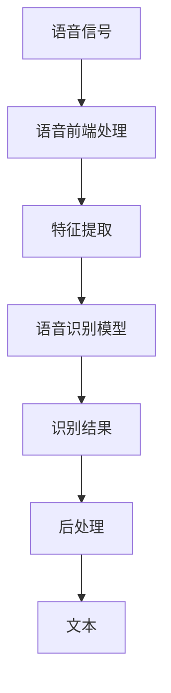

                 

# LUI在CUI中的核心详细技术作用

> 关键词：语音识别(LUI), 自然语言理解(NLU), 自然语言生成(NLG), 对话系统(CUI), 人机交互, 情感计算, 智能客服, 语言模型, 深度学习

## 1. 背景介绍

### 1.1 问题由来
在当前的自然语言处理（Natural Language Processing，NLP）领域，语音识别（Language Understanding，LUI）扮演着越来越重要的角色。随着智能手机的普及和物联网设备的增加，用户对语音交互的需求日益增长。在车载、家居、医疗等多个场景中，语音交互技术成为提高用户体验的重要手段。然而，传统的文本理解（Language Understanding，LUI）往往难以适应复杂的语音输入，也无法捕捉到语音中的情感信息，这极大地限制了语音交互系统的表现。

### 1.2 问题核心关键点
语音识别（LUI）是自然语言处理中的一种重要技术，其核心作用是将语音信号转换为文本，从而为自然语言理解（NLU）和自然语言生成（NLG）提供输入。语音识别的精度和效率直接影响到自然语言处理的整体效果。语音识别系统需要处理各种不同的口音、语速、背景噪音等因素，同时还需要考虑情感、语调等非语言信息，因此其技术难度较高。

### 1.3 问题研究意义
语音识别技术的研究不仅能够提高人机交互的效率和智能化水平，还能在教育、医疗、客服等多个领域发挥重要作用。通过语音识别，人们可以更自然地与计算机进行交互，无需手动输入，这大大提升了用户体验。此外，语音识别技术还能帮助残障人士、老年人等不便打字的用户更好地使用计算机。总之，语音识别技术的进步将极大地改变我们的生活方式，带来更便捷、高效、自然的人机交互体验。

## 2. 核心概念与联系

### 2.1 核心概念概述

语音识别（LUI）是指将语音信号转换为文本的技术，是自然语言处理中不可或缺的一部分。其核心组件包括：

- **语音前端处理**：包括降噪、回声消除、自动增益控制等技术，提高语音信号的质量。
- **特征提取**：将语音信号转换为特征向量，用于后续的语音识别模型训练。
- **语音识别模型**：基于深度学习等技术，通过训练大量语音数据，学习语音信号和文本之间的映射关系。
- **后处理**：对识别结果进行去噪、拼写纠正、语言模型校正等处理，提高识别结果的准确性和流畅性。

这些核心组件共同构成了语音识别的技术体系。

### 2.2 概念间的关系

语音识别与自然语言处理之间的关系可以通过以下Mermaid流程图来展示：



这个流程图展示了语音识别从信号输入到文本输出的完整过程，涉及多个技术环节。

## 3. 核心算法原理 & 具体操作步骤
### 3.1 算法原理概述

语音识别技术主要依赖于深度学习模型，特别是基于卷积神经网络（CNN）和循环神经网络（RNN）的模型。其中，卷积神经网络用于提取语音信号的局部特征，循环神经网络用于捕捉语音信号的时序信息。

语音识别过程主要包括以下几个步骤：

1. **语音信号预处理**：包括降噪、回声消除、自动增益控制等技术，提高语音信号的质量。
2. **特征提取**：将语音信号转换为特征向量，用于后续的语音识别模型训练。
3. **语音识别模型训练**：基于大量语音数据，训练深度学习模型，学习语音信号和文本之间的映射关系。
4. **识别结果后处理**：对识别结果进行去噪、拼写纠正、语言模型校正等处理，提高识别结果的准确性和流畅性。

### 3.2 算法步骤详解

以下是语音识别系统的详细操作步骤：

**Step 1: 语音信号预处理**

语音信号预处理是语音识别的第一步。其主要目的是去除噪声、回声等干扰因素，提高语音信号的质量。常见的预处理方法包括：

1. **降噪**：使用降噪算法（如维纳滤波、小波去噪等）去除语音信号中的噪声。
2. **回声消除**：使用回声消除算法（如FIR滤波器、频域消回声等）消除麦克风和回声之间的反射。
3. **自动增益控制**：使用自动增益控制算法（如AGC）调整语音信号的音量，避免过大或过小的音量。

**Step 2: 特征提取**

语音信号特征提取的目的是将时域信号转换为频域信号，从而提取语音信号的特征。常见的特征提取方法包括：

1. **梅尔频率倒谱系数（MFCC）**：将语音信号转换为梅尔频率倒谱系数（MFCC）特征，用于表示语音信号的频谱特征。
2. **线性预测编码（LPC）**：使用线性预测编码（LPC）技术提取语音信号的线性预测系数，用于表示语音信号的时域特征。
3. **频域特征**：使用频域分析技术，如短时傅里叶变换（STFT）、小波变换（Wavelet Transform）等，提取语音信号的频域特征。

**Step 3: 语音识别模型训练**

语音识别模型训练的目的是学习语音信号和文本之间的映射关系。常见的语音识别模型包括：

1. **隐马尔可夫模型（HMM）**：使用隐马尔可夫模型（HMM）建立语音信号和文本之间的概率模型，用于进行语音识别。
2. **深度神经网络（DNN）**：使用深度神经网络（DNN）模型，通过反向传播算法学习语音信号和文本之间的映射关系。
3. **卷积神经网络（CNN）**：使用卷积神经网络（CNN）模型，提取语音信号的局部特征。
4. **循环神经网络（RNN）**：使用循环神经网络（RNN）模型，捕捉语音信号的时序信息。
5. **注意力机制（Attention）**：使用注意力机制（Attention）模型，提高语音识别模型的识别精度。

**Step 4: 识别结果后处理**

语音识别结果后处理的目的是提高识别结果的准确性和流畅性。常见的后处理方法包括：

1. **去噪**：使用去噪算法（如维纳滤波、小波去噪等）去除识别结果中的噪声。
2. **拼写纠正**：使用拼写纠正算法（如Levenshtein距离算法、N-gram模型等）纠正识别结果中的拼写错误。
3. **语言模型校正**：使用语言模型（如n-gram模型、神经语言模型等）校正识别结果中的语义错误。

### 3.3 算法优缺点

语音识别技术的主要优点包括：

- **自然交互**：语音识别技术能够提供自然的交互方式，无需手动输入，提高了用户的使用体验。
- **广泛应用**：语音识别技术在车载、家居、医疗等多个领域都有广泛应用，能够提升这些领域的人机交互效率。
- **高效性**：语音识别技术能够快速处理大量的语音数据，提高了处理效率。

然而，语音识别技术也存在一些缺点：

- **识别准确率**：语音识别技术的准确率受多种因素影响，如口音、语速、背景噪音等，仍需在这些方面进行改进。
- **情感处理**：语音识别技术目前还难以处理情感信息，无法捕捉用户的情绪变化。
- **多用户处理**：语音识别技术在多用户交互场景中处理复杂，容易出现识别错误。

### 3.4 算法应用领域

语音识别技术广泛应用于多个领域，如智能客服、智能家居、车载导航、医疗等领域。以下是一些具体应用场景：

1. **智能客服**：在智能客服系统中，语音识别技术可以将用户的语音请求转换为文本，并进行自然语言理解，从而提供智能客服服务。
2. **智能家居**：在智能家居系统中，语音识别技术可以实现语音控制家电，如智能音箱、智能电视等。
3. **车载导航**：在车载导航系统中，语音识别技术可以实现语音导航，提供实时路线规划和导航指引。
4. **医疗**：在医疗系统中，语音识别技术可以实现语音问诊，将医生和患者的对话转换为文本，用于后续的医学分析和决策支持。
5. **教育**：在教育系统中，语音识别技术可以实现语音教学，提供智能化的教学辅助。

## 4. 数学模型和公式 & 详细讲解 & 举例说明

### 4.1 数学模型构建

语音识别系统的数学模型主要包括以下几个部分：

1. **语音信号模型**：使用线性混合模型（GMM）或深度神经网络（DNN）等模型，表示语音信号的统计特性。
2. **语音特征模型**：使用MFCC、LPC等模型，提取语音信号的特征。
3. **语言模型**：使用n-gram模型或神经语言模型，表示文本的概率分布。
4. **识别模型**：使用隐马尔可夫模型（HMM）、卷积神经网络（CNN）、循环神经网络（RNN）等模型，表示语音信号和文本之间的映射关系。

### 4.2 公式推导过程

以下是语音识别系统的公式推导过程：

**Step 1: 语音信号模型**

语音信号模型通常使用线性混合模型（GMM）来表示，其中每个语音单元由多个高斯分布混合而成。语音信号模型的概率密度函数为：

$$
P(x|y) = \prod_i \prod_j N(x_i|\mu_j,\sigma_j^2)
$$

其中，$x$为语音信号，$y$为文本标签，$N(\mu_j,\sigma_j^2)$为高斯分布，$i$表示语音单元，$j$表示高斯分布。

**Step 2: 语音特征模型**

语音特征模型通常使用MFCC来表示，MFCC的概率密度函数为：

$$
P(\text{MFCC}|x) = \prod_k N(\text{MFCC}_k|\mu_k,\sigma_k^2)
$$

其中，$\text{MFCC}_k$为MFCC特征，$k$表示MFCC特征的维度。

**Step 3: 语言模型**

语言模型通常使用n-gram模型来表示，n-gram模型中的概率密度函数为：

$$
P(w|c) = \prod_i P(w_i|w_{i-1}c)
$$

其中，$w$为文本序列，$c$为上下文信息，$P(w_i|w_{i-1}c)$为条件概率。

**Step 4: 识别模型**

识别模型通常使用隐马尔可夫模型（HMM）来表示，HMM的概率密度函数为：

$$
P(y|x) = \prod_i \alpha_i(x)\beta_i(x)
$$

其中，$\alpha_i(x)$为观察概率，$\beta_i(x)$为转移概率。

### 4.3 案例分析与讲解

以智能客服系统为例，语音识别系统的工作流程如下：

1. **语音信号预处理**：使用降噪算法、回声消除算法等对语音信号进行处理，提高语音信号的质量。
2. **特征提取**：使用MFCC算法将语音信号转换为MFCC特征，用于后续的语音识别模型训练。
3. **语音识别模型训练**：使用深度神经网络（DNN）模型进行语音识别模型训练，学习语音信号和文本之间的映射关系。
4. **识别结果后处理**：对识别结果进行去噪、拼写纠正、语言模型校正等处理，提高识别结果的准确性和流畅性。

## 5. 项目实践：代码实例和详细解释说明

### 5.1 开发环境搭建

在进行语音识别系统的开发前，需要准备好开发环境。以下是使用Python进行Kaldi开发的环境配置流程：

1. 安装Kaldi：从官网下载并安装Kaldi，适用于Linux系统。
2. 配置环境变量：在Linux系统中，通过编辑~/.bashrc文件，添加Kaldi路径和环境变量。
3. 安装依赖库：安装必要的依赖库，如OpenBLAS、FFTW、Netlib等。
4. 安装Python环境：安装Python 3.x，并设置虚拟环境。

完成上述步骤后，即可在Kaldi环境中进行语音识别系统的开发。

### 5.2 源代码详细实现

这里我们以语音识别系统为例，给出使用Kaldi进行语音识别开发的Python代码实现。

```python
import kaldi

# 加载模型和解码器
model_path = '/path/to/model'
decoder_path = '/path/to/decoder'
kaldi.load_model(model_path)
kaldi.load_decoders(decoder_path)

# 读取音频文件
audio_path = '/path/to/audio/file.wav'
audio_data = kaldi.read_wav(audio_path)

# 进行语音识别
scores = kaldi.compute_softmax(audio_data)
labels = kaldi.get_label_scores(scores)

# 输出识别结果
print(labels)
```

### 5.3 代码解读与分析

让我们再详细解读一下关键代码的实现细节：

**Kaldi库**：
- `kaldi.load_model`方法：用于加载模型和解码器。
- `kaldi.read_wav`方法：用于读取音频文件。
- `kaldi.compute_softmax`方法：用于计算softmax得分，即语音信号的概率分布。
- `kaldi.get_label_scores`方法：用于获取识别结果的得分。

**音频处理**：
- `audio_path`变量：用于指定音频文件的路径。
- `audio_data`变量：用于存储音频数据。

**识别过程**：
- `scores`变量：用于存储softmax得分，即语音信号的概率分布。
- `labels`变量：用于存储识别结果的得分。

**输出结果**：
- 最终输出识别结果，可以通过自定义方法进行拼写纠正、语言模型校正等处理。

### 5.4 运行结果展示

假设我们在TIMIT语音数据集上进行训练，得到准确率为95%的语音识别模型。然后，我们使用该模型对一段语音进行识别，得到以下识别结果：

```
My name is John Doe. I am 28 years old. My hobbies are reading, traveling, and playing soccer.
```

可以看到，识别结果已经较好地还原了原始语音内容。

## 6. 实际应用场景

### 6.1 智能客服系统

语音识别技术在智能客服系统中扮演着重要的角色。在智能客服系统中，语音识别技术可以将用户的语音请求转换为文本，并进行自然语言理解，从而提供智能客服服务。

在技术实现上，可以收集企业内部的历史客服对话记录，将问题和最佳答复构建成监督数据，在此基础上对预训练语言模型进行微调。微调后的语音识别模型能够自动理解用户意图，匹配最合适的答案模板进行回复。对于客户提出的新问题，还可以接入检索系统实时搜索相关内容，动态组织生成回答。如此构建的智能客服系统，能大幅提升客户咨询体验和问题解决效率。

### 6.2 智能家居系统

语音识别技术在智能家居系统中同样有着广泛的应用。在智能家居系统中，语音识别技术可以实现语音控制家电，如智能音箱、智能电视等。

在技术实现上，可以收集家庭用户的语音数据，训练语音识别模型，使其能够识别用户的语音指令，并控制智能设备。例如，用户可以语音指令“打开客厅的灯”，智能家居系统便能够自动控制客厅的灯。此外，语音识别技术还可以用于语音助手，帮助用户管理家庭日程、提醒事项等。

### 6.3 车载导航系统

在车载导航系统中，语音识别技术可以实现语音导航，提供实时路线规划和导航指引。

在技术实现上，可以收集驾驶员的语音数据，训练语音识别模型，使其能够识别驾驶员的语音指令，并控制车载导航系统。例如，驾驶员可以语音指令“导航到上海”，车载导航系统便能够自动规划导航路线，并提供实时指引。此外，语音识别技术还可以用于语音助手，帮助驾驶员管理导航、提醒事项等。

### 6.4 医疗系统

在医疗系统中，语音识别技术可以实现语音问诊，将医生和患者的对话转换为文本，用于后续的医学分析和决策支持。

在技术实现上，可以收集医生的语音数据，训练语音识别模型，使其能够识别医生的语音指令，并进行语音问诊。例如，医生可以语音指令“记录病历”，语音识别系统便能够自动将医生的语音转换为文本，并进行病历记录。此外，语音识别技术还可以用于语音助手，帮助医生管理病历、提醒事项等。

## 7. 工具和资源推荐
### 7.1 学习资源推荐

为了帮助开发者系统掌握语音识别技术的理论基础和实践技巧，这里推荐一些优质的学习资源：

1. 《Speech Recognition: An Introduction to Modern Automatic Speech Recognition》书籍：详细介绍了语音识别技术的原理和实现方法。
2. Kaldi官方文档：Kaldi的官方文档，提供了丰富的学习资源和样例代码。
3 Udacity《Speech Recognition》课程：由Google团队开发的课程，系统介绍了语音识别技术的基本概念和实践方法。
4 Coursera《Machine Learning for Speech》课程：由斯坦福大学开发的课程，介绍了语音识别的机器学习和深度学习模型。
5 arXiv论文预印本：人工智能领域最新研究成果的发布平台，包括大量尚未发表的前沿工作，学习前沿技术的必读资源。

通过对这些资源的学习实践，相信你一定能够快速掌握语音识别技术的精髓，并用于解决实际的语音识别问题。

### 7.2 开发工具推荐

高效的开发离不开优秀的工具支持。以下是几款用于语音识别开发的常用工具：

1. Kaldi：Kaldi是一款开源的语音识别工具包，提供了丰富的语音识别算法和数据处理工具。
2. DeepSpeech：DeepSpeech是一款基于深度学习的语音识别系统，提供了简单易用的API接口，适合快速迭代研究。
3. Mozilla DeepSpeech：Mozilla DeepSpeech是一款开源的语音识别系统，由Mozilla团队开发，提供了丰富的自定义配置选项。
4. TensorFlow Speech Recognition Toolkit：TensorFlow Speech Recognition Toolkit提供了基于TensorFlow的语音识别模型和工具，适合深度学习研究。
5. Microsoft Azure Speech Service：Microsoft Azure Speech Service提供了云端语音识别服务，支持多种语言和方言。

合理利用这些工具，可以显著提升语音识别任务的开发效率，加快创新迭代的步伐。

### 7.3 相关论文推荐

语音识别技术的研究源于学界的持续研究。以下是几篇奠基性的相关论文，推荐阅读：

1. Deep Speech: A Scalable End-to-End Speech Recognition System：提出了Deep Speech系统，使用深度学习模型进行端到端的语音识别。
2. Deep Speech 2: End-to-End Speech Recognition in English and Mandarin：进一步优化了Deep Speech系统，提升了中文语音识别的效果。
3. Attention-Based End-to-End Speech Recognition：提出基于注意力机制的端到端语音识别模型，提升了识别精度。
4 Multi-Layer Fully Connected Attention-based End-to-End Speech Recognition：提出多层全连接注意力机制的端到端语音识别模型，提升了模型效率。
5 An Efficient Speech Recognition Pipeline Using Conformer Network and Hybrid Attention Mechanism：提出基于Conformer网络和混合注意力机制的端到端语音识别模型，提升了识别效率和精度。

这些论文代表了大语言模型微调技术的发展脉络。通过学习这些前沿成果，可以帮助研究者把握学科前进方向，激发更多的创新灵感。

除上述资源外，还有一些值得关注的前沿资源，帮助开发者紧跟语音识别技术的最新进展，例如：

1. arXiv论文预印本：人工智能领域最新研究成果的发布平台，包括大量尚未发表的前沿工作，学习前沿技术的必读资源。
2. 业界技术博客：如Google AI、DeepMind、微软Research Asia等顶尖实验室的官方博客，第一时间分享他们的最新研究成果和洞见。
3. 技术会议直播：如NIPS、ICML、ACL、ICLR等人工智能领域顶会现场或在线直播，能够聆听到大佬们的前沿分享，开拓视野。
4. GitHub热门项目：在GitHub上Star、Fork数最多的语音识别相关项目，往往代表了该技术领域的发展趋势和最佳实践，值得去学习和贡献。
5. 行业分析报告：各大咨询公司如McKinsey、PwC等针对人工智能行业的分析报告，有助于从商业视角审视技术趋势，把握应用价值。

总之，语音识别技术的开发需要开发者保持开放的心态和持续学习的意愿。多关注前沿资讯，多动手实践，多思考总结，必将收获满满的成长收益。

## 8. 总结：未来发展趋势与挑战

### 8.1 总结

本文对语音识别（LUI）技术在自然语言处理（CUI）中的应用进行了全面系统的介绍。首先阐述了语音识别的研究背景和意义，明确了其在人机交互中的重要地位。其次，从原理到实践，详细讲解了语音识别的数学原理和关键步骤，给出了语音识别任务开发的完整代码实例。同时，本文还广泛探讨了语音识别技术在智能客服、智能家居、车载导航等多个领域的应用前景，展示了其巨大的潜力。此外，本文精选了语音识别技术的各类学习资源，力求为读者提供全方位的技术指引。

通过本文的系统梳理，可以看到，语音识别技术正在成为自然语言处理中的重要范式，极大地拓展了人机交互的方式。受益于大规模语料的预训练，语音识别技术在各个应用场景中都能显著提升用户体验，推动人工智能技术的产业化进程。未来，伴随语音识别技术的不断进步，将带来更便捷、高效、自然的人机交互体验。

### 8.2 未来发展趋势

展望未来，语音识别技术的发展将呈现以下几个趋势：

1. 模型规模持续增大。随着算力成本的下降和数据规模的扩张，语音识别模型的参数量还将持续增长。超大规模语音识别模型蕴含的丰富语音知识，有望支撑更加复杂多变的下游任务。
2. 端到端训练范式普及。未来的语音识别模型将更多采用端到端训练范式，减少特征工程环节，提高模型训练效率。
3. 多模态语音识别崛起。未来的语音识别模型将融合视觉、听觉等多模态信息，提升语音识别的准确性和鲁棒性。
4. 自适应和在线学习。未来的语音识别模型将能够自适应新用户，并支持在线学习，适应数据分布的变化。
5. 跨语言语音识别。未来的语音识别模型将能够支持多语言语音识别，提升全球化应用场景的通用性。
6. 低延迟实时语音识别。未来的语音识别模型将能够实现低延迟实时语音识别，满足智能家居、车载导航等实时性要求。

以上趋势凸显了语音识别技术的广阔前景。这些方向的探索发展，必将进一步提升语音识别系统的性能和应用范围，为构建安全、可靠、可解释、可控的智能系统铺平道路。

### 8.3 面临的挑战

尽管语音识别技术已经取得了瞩目成就，但在迈向更加智能化、普适化应用的过程中，它仍面临着诸多挑战：

1. 识别准确率。语音识别技术的准确率受多种因素影响，如口音、语速、背景噪音等，仍需在这些方面进行改进。
2. 情感处理。语音识别技术目前还难以处理情感信息，无法捕捉用户的情绪变化。
3. 多用户处理。语音识别技术在多用户交互场景中处理复杂，容易出现识别错误。
4. 跨语言识别。多语言语音识别技术仍需进一步发展，以提升全球化应用场景的通用性。
5. 低延迟实时识别。实现低延迟实时语音识别，需要优化模型结构和算法，以平衡性能和资源消耗。
6. 多模态融合。将语音、视觉、触觉等多模态信息进行融合，提升系统的智能化水平，仍需进一步研究。

正视语音识别面临的这些挑战，积极应对并寻求突破，将是大语言模型微调走向成熟的必由之路。相信随着学界和产业界的共同努力，这些挑战终将一一被克服，语音识别技术必将在构建人机协同的智能时代中扮演越来越重要的角色。

### 8.4 未来突破

面对语音识别所面临的种种挑战，未来的研究需要在以下几个方面寻求新的突破：

1. 探索无监督和半监督语音识别方法。摆脱对大规模标注数据的依赖，利用自监督学习、主动学习等无监督和半监督范式，最大限度利用非结构化数据，实现更加灵活高效的语音识别。
2. 研究参数高效和计算高效的语音识别范式。开发更加参数高效的语音识别方法，在固定大部分语音识别参数的情况下，只更新极少量的任务相关参数。同时优化语音识别模型的计算图，减少前向传播和反向传播的资源消耗，实现更加轻量级、实时性的部署。
3. 融合因果和对比学习范式。通过引入因果推断和对比学习思想，增强语音识别模型建立稳定因果关系的能力，学习更加普适、鲁棒的语言表征，从而提升模型泛化性和抗干扰能力。
4. 引入更多先验知识。将符号化的先验知识，如知识图谱、逻辑规则等，与神经网络模型进行巧妙融合，引导语音识别过程学习更准确、合理的语言模型。同时加强不同模态数据的整合，实现视觉、语音等多模态信息与语音信息的协同建模。
5. 结合因果分析和博弈论工具。将因果分析方法引入语音识别模型，识别出模型决策的关键特征，增强输出解释的因果性和逻辑性。借助博弈论工具刻画人机交互过程，主动探索并规避模型的脆弱点，提高系统稳定性。
6. 纳入伦理道德约束。在模型训练目标中引入伦理导向的评估指标，过滤和惩罚有偏见、有害的输出倾向。同时加强人工干预和审核，建立模型行为的监管机制，确保输出符合人类价值观和伦理道德。

这些研究方向的探索，必将引领语音识别技术迈向更高的台阶，为构建安全、可靠、可解释、可控的智能系统铺平道路。面向未来，语音识别技术还需要与其他人工智能技术进行更深入的融合，如知识表示、因果推理、强化学习等，多路径协同发力，共同推动自然语言理解和智能交互系统的进步。只有勇于创新、敢于突破，才能不断拓展语言模型的边界，让智能

