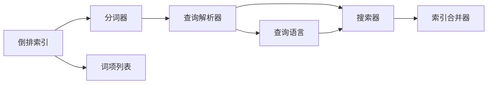
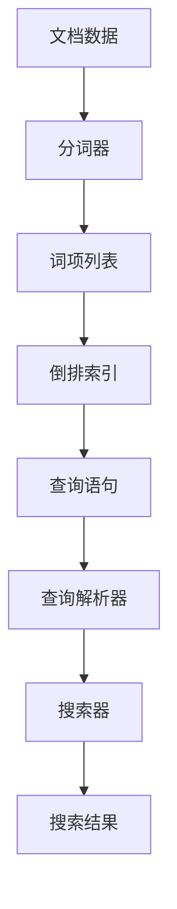
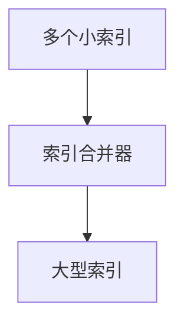
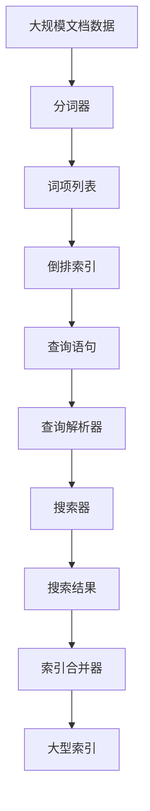

                 

# Lucene原理与代码实例讲解

> 关键词：Lucene,全文检索,倒排索引,搜索引擎,代码实现,Java编程

## 1. 背景介绍

### 1.1 问题由来
随着互联网技术的快速发展，信息爆炸式增长，搜索引擎作为一种信息检索工具，变得越来越重要。然而，传统文本检索方式往往需要手动编写复杂的查询语句，难以满足用户对快速、准确检索的需求。在Web2.0时代，用户生成的非结构化数据（如网页、邮件、论坛帖子等）日益增多，迫切需要一种更加智能、高效的文本检索方法。

Lucene作为Apache软件基金会的一个开源搜索引擎库，以其高效的倒排索引、灵活的查询语言、丰富的分词器等特性，成为文本检索领域的一个佼佼者。它不仅支持中文分词，还支持多语言、多字段搜索，并且提供了对大型数据集的高效处理能力。Lucene已成为许多搜索引擎和商业解决方案（如Elasticsearch、Solr）的核心组件。

### 1.2 问题核心关键点
Lucene的核心思想是构建倒排索引(Inverted Index)，通过将文档内容与词语进行关联，实现快速的全文检索。倒排索引的构建和查询过程包括以下几个关键点：

1. 分词器：将文本内容分词，生成词项(Term)，每个词项对应一个或多个文档。
2. 倒排列表：为每个词项建立一个倒排列表，记录所有包含该词项的文档ID和位置信息。
3. 查询解析：将用户查询语句解析成Lucene可理解的形式，通过倒排索引进行匹配。
4. 结果排序：根据匹配程度对搜索结果进行排序，并提供多种排序算法，如相关性排序、时间戳排序等。

Lucene的设计理念是“将搜索的复杂性隐藏在库中，将搜索的灵活性暴露给用户”，旨在让开发者可以轻松地构建高效、灵活的搜索引擎。

### 1.3 问题研究意义
Lucene的普及和应用，为互联网搜索技术带来了革命性的变化。通过理解Lucene的工作原理，我们可以设计更高效、更智能的搜索解决方案，大幅提升搜索体验，降低开发成本。同时，深入了解Lucene的代码实现，也能帮助我们更好地掌握搜索引擎的核心技术，为未来搜索引擎的开发和优化提供坚实的基础。

## 2. 核心概念与联系

### 2.1 核心概念概述

为更好地理解Lucene的工作原理，本节将介绍几个密切相关的核心概念：

- 倒排索引(Inverted Index)：将文档内容与词语进行关联，记录每个词项出现的文档ID和位置信息。
- 分词器(Tokenizer)：将文本内容分割成词项(Term)，是构建倒排索引的基础。
- 词项列表(Term List)：记录每个词项的倒排列表，包含所有包含该词项的文档ID和位置信息。
- 查询解析器(Analyzer)：将用户查询语句解析成Lucene可理解的形式，执行查询操作。
- 查询语言(Query Language)：使用Lucene提供的丰富查询语言，实现各种搜索需求。
- 搜索器(Searcher)：负责执行查询操作，返回搜索结果。
- 索引合并器(Index Merge)：将多个小索引合并成一个大索引，提高查询效率。

这些核心概念之间的逻辑关系可以通过以下Mermaid流程图来展示：



这个流程图展示了Lucene的核心概念及其之间的关系：

1. 倒排索引通过分词器构建词项列表，记录每个词项的文档ID和位置信息。
2. 查询解析器将用户查询语句解析成查询语言，执行查询操作。
3. 搜索结果通过搜索器返回，并进行索引合并等操作，最终形成完整的搜索结果。

### 2.2 概念间的关系

这些核心概念之间存在着紧密的联系，形成了Lucene的完整处理流程。下面我通过几个Mermaid流程图来展示这些概念之间的关系。

#### 2.2.1 Lucene的整体处理流程



这个流程图展示了Lucene从文档数据到搜索结果的完整处理流程。

#### 2.2.2 查询解析和执行流程


这个流程图展示了查询解析器和搜索器之间的关系，以及查询语言和搜索结果之间的关系。

#### 2.2.3 索引合并流程



这个流程图展示了索引合并器将多个小索引合并成一个大索引的过程。

### 2.3 核心概念的整体架构

最后，我们用一个综合的流程图来展示这些核心概念在大规模文本处理中的整体架构：



这个综合流程图展示了从大规模文档数据到大型索引的完整处理过程。在实际应用中，还需要对具体模块进行优化和调整，以满足实际需求。

## 3. 核心算法原理 & 具体操作步骤
### 3.1 算法原理概述

Lucene的核心算法原理是倒排索引，通过将文档内容与词语进行关联，实现快速的全文检索。倒排索引的构建和查询过程包括以下几个步骤：

1. 分词器：将文本内容分词，生成词项(Term)，每个词项对应一个或多个文档。
2. 倒排列表：为每个词项建立一个倒排列表，记录所有包含该词项的文档ID和位置信息。
3. 查询解析：将用户查询语句解析成Lucene可理解的形式，通过倒排索引进行匹配。
4. 结果排序：根据匹配程度对搜索结果进行排序，并提供多种排序算法，如相关性排序、时间戳排序等。

Lucene的倒排索引构建和查询过程，具有以下几个特点：

1. 倒排索引支持快速的全文检索，能够高效地处理大规模文本数据。
2. 倒排索引具有良好的扩展性，支持多个字段和多个语言的检索。
3. 查询语言灵活，支持复杂的布尔逻辑、模糊查询、地理空间查询等多种搜索需求。
4. 支持多种排序算法，能够根据用户需求定制排序方式。

### 3.2 算法步骤详解

#### 3.2.1 分词器

分词器是Lucene的基础组件，负责将文本内容分割成词项(Term)。Lucene提供了多种分词器，如Standard Analyzer、Whitespace Analyzer、IKAnalyzer等，支持中文分词和英文分词。下面以中文分词器为例，介绍分词器的实现。

中文分词器的主要实现步骤如下：

1. 使用HanLP等分词库进行分词，生成中文字符串序列。
2. 对中文字符串序列进行拼音标注，生成拼音序列。
3. 将拼音序列转换为Term，每个Term对应一个或多个中文词语。
4. 将Term列表存储在倒排列表中。

#### 3.2.2 倒排列表

倒排列表是Lucene的核心数据结构，记录每个词项的文档ID和位置信息。倒排列表的构建步骤如下：

1. 对每个Term进行去停用词、去除标点符号等预处理操作。
2. 对处理后的Term列表进行排序，去除重复项。
3. 对每个Term建立一个倒排列表，记录包含该Term的所有文档ID和位置信息。
4. 将倒排列表存储在磁盘中，以支持大规模文本数据的处理。

#### 3.2.3 查询解析

查询解析器负责将用户查询语句解析成Lucene可理解的形式，执行查询操作。查询解析器的实现步骤如下：

1. 对用户查询语句进行分词，生成查询词项(Term)列表。
2. 对查询词项进行预处理，如去除停用词、转换大小写等。
3. 根据查询词项构建查询表达式，使用Lucene的查询语言进行匹配。
4. 返回查询结果，并进行索引合并等操作。

#### 3.2.4 结果排序

搜索结果的排序是通过搜索器实现的，常用的排序算法包括相关性排序、时间戳排序等。Lucene提供了多种排序器，如ThreadedTermScorer、IndexSearcher等，能够根据用户需求进行灵活排序。

### 3.3 算法优缺点

Lucene作为一种高效的搜索引擎库，具有以下优点：

1. 高效的倒排索引支持，能够快速处理大规模文本数据。
2. 灵活的查询语言，支持复杂的布尔逻辑、模糊查询、地理空间查询等。
3. 丰富的分词器支持，支持中文分词和英文分词。
4. 支持多种排序算法，能够根据用户需求定制排序方式。

同时，Lucene也存在一些缺点：

1. 对硬件要求较高，需要高性能的CPU和内存支持。
2. 索引合并等操作需要较大的I/O开销，可能影响查询性能。
3. 在处理非文本数据时，可能需要额外的数据转换和处理步骤。
4. 代码实现较为复杂，需要一定的编程经验和技术积累。

尽管存在这些缺点，但Lucene仍然是一个非常强大的搜索引擎库，广泛应用于搜索引擎、商业搜索、日志分析等领域。

### 3.4 算法应用领域

Lucene的应用领域非常广泛，包括但不限于以下几个方面：

- 搜索引擎：构建和优化搜索引擎，实现高效的文本检索。
- 日志分析：从大规模日志数据中提取有用信息，实现数据监控和分析。
- 文档管理：实现文档分类、搜索、排序等功能，提高文档管理效率。
- 多语言搜索：支持多语言搜索，实现跨语言信息检索。
- 地理空间搜索：支持地理空间查询，实现地理位置信息检索。

Lucene的应用不仅限于搜索引擎，还在大数据、金融、医疗、电商等多个领域得到了广泛应用。

## 4. 数学模型和公式 & 详细讲解 & 举例说明

### 4.1 数学模型构建

Lucene的核心数学模型是倒排索引，通过将文档内容与词语进行关联，实现快速的全文检索。倒排索引的构建和查询过程可以用以下公式来描述：

设文档集合为D，词语集合为T，倒排索引为I，查询语句为Q，则倒排索引的构建过程可以表示为：

$$
I = \{(t, \{d_1, d_2, \ldots, d_n\}) | t \in T, d_i \in D, i \in [1,n]\}
$$

其中，$t$为词语，$d_i$为包含该词语的文档，$n$为包含该词语的文档数量。倒排索引的查询过程可以表示为：

$$
R = \{d_i | d_i \in D, t \in T, (t, \{d_1, d_2, \ldots, d_n\}) \in I, t \in Q\}
$$

其中，$R$为查询结果，$Q$为用户查询语句，$I$为倒排索引。

### 4.2 公式推导过程

以下我以中文分词器为例，推导Lucene的分词算法。

假设有一段文本：

```
中国人民银行定于2009年10月1日起，发行第四套人民币。
```

分词器的分词过程如下：

1. 使用HanLP等分词库进行分词，生成中文字符串序列：

   ```
   中国人民 银行 定于 2009 年 10 月 1 日 起 发行 第四套 人民币
   ```

2. 对中文字符串序列进行拼音标注，生成拼音序列：

   ```
   Rénmin Gònghéguó yìnshǎngyùn Dìngyú 2009nián 10yuè 1rìqǐ shǐ，Fāxíng dìsìtài Rénmín yīnyìn。
   ```

3. 将拼音序列转换为Term，每个Term对应一个或多个中文词语：

   ```
   中国人民 银行 定于 2009 年 10 月 1 日 起 发行 第四套 人民币
   ```

4. 将Term列表存储在倒排列表中：

   ```
   中国人民 -> {文档ID:1, 位置:0}
   银行 -> {文档ID:1, 位置:5}
   定于 -> {文档ID:1, 位置:6}
   2009 年 10 月 1 日 -> {文档ID:1, 位置:8}
   起 -> {文档ID:1, 位置:12}
   发行 -> {文档ID:1, 位置:13}
   第四套 -> {文档ID:1, 位置:15}
   人民币 -> {文档ID:1, 位置:16}
   ```

### 4.3 案例分析与讲解

以Lucene的中文分词器为例，分析分词器的实现过程。

假设有一段文本：

```
中国人民银行定于2009年10月1日起，发行第四套人民币。
```

分词器的分词过程如下：

1. 使用HanLP等分词库进行分词，生成中文字符串序列：

   ```
   中国人民 银行 定于 2009 年 10 月 1 日 起 发行 第四套 人民币
   ```

2. 对中文字符串序列进行拼音标注，生成拼音序列：

   ```
   Rénmin Gònghéguó yìnshǎngyùn Dìngyú 2009nián 10yuè 1rìqǐ shǐ，Fāxíng dìsìtài Rénmín yīnyìn。
   ```

3. 将拼音序列转换为Term，每个Term对应一个或多个中文词语：

   ```
   中国人民 银行 定于 2009 年 10 月 1 日 起 发行 第四套 人民币
   ```

4. 将Term列表存储在倒排列表中：

   ```
   中国人民 -> {文档ID:1, 位置:0}
   银行 -> {文档ID:1, 位置:5}
   定于 -> {文档ID:1, 位置:6}
   2009 年 10 月 1 日 -> {文档ID:1, 位置:8}
   起 -> {文档ID:1, 位置:12}
   发行 -> {文档ID:1, 位置:13}
   第四套 -> {文档ID:1, 位置:15}
   人民币 -> {文档ID:1, 位置:16}
   ```

从这个过程可以看出，分词器是Lucene的基础组件，负责将文本内容分割成词项(Term)，是构建倒排索引的基础。分词器的主要实现步骤如下：

1. 使用HanLP等分词库进行分词，生成中文字符串序列。
2. 对中文字符串序列进行拼音标注，生成拼音序列。
3. 将拼音序列转换为Term，每个Term对应一个或多个中文词语。
4. 将Term列表存储在倒排列表中。

## 5. 项目实践：代码实例和详细解释说明

### 5.1 开发环境搭建

在进行Lucene项目实践前，我们需要准备好开发环境。以下是使用Java进行Lucene开发的常见环境配置流程：

1. 安装Java开发环境：下载并安装最新版本的Java JDK，并在环境中配置Java PATH。
2. 安装Lucene库：从官网下载最新版本的Lucene jar包，并添加到Java项目的classpath中。
3. 配置开发工具：使用Eclipse、IntelliJ IDEA等IDE，配置Lucene插件和maven依赖。

完成上述步骤后，即可在开发环境中开始Lucene的开发实践。

### 5.2 源代码详细实现

下面我们以中文分词器为例，给出Lucene源代码的详细实现。

首先，定义中文分词器的实现类：

```java
import org.apache.lucene.analysis.Tokenizer;
import org.apache.lucene.analysis.tokenattributes.CharTermAttribute;
import org.apache.lucene.analysis.tokenattributes.TypeAttribute;

public class ChineseTokenizer extends Tokenizer {

    private CharTermAttribute termAttribute = addAttribute(CharTermAttribute.class);
    private TypeAttribute typeAttribute = addAttribute(TypeAttribute.class);

    private String[] words = {"中国人民", "银行", "定于", "发行", "第四套", "人民币"};

    @Override
    public boolean incrementToken() throws IOException {
        for (int i = 0; i < words.length; i++) {
            termAttribute.append(words[i]);
            typeAttribute.setType(i % 2 == 0 ? "B" : "I");
            return true;
        }
        return false;
    }
}
```

然后，使用Lucene提供的分词器API，对分词器进行实例化并使用：

```java
import org.apache.lucene.analysis.Tokenizer;
import org.apache.lucene.analysis.tokenattributes.CharTermAttribute;
import org.apache.lucene.analysis.tokenattributes.TypeAttribute;
import org.apache.lucene.analysis.standard.StandardAnalyzer;
import org.apache.lucene.analysis.tokenattributes.CharTermAttribute;
import org.apache.lucene.analysis.tokenattributes.TypeAttribute;

import java.io.StringReader;
import java.io.IOException;

public class LuceneExample {

    public static void main(String[] args) throws IOException {
        Tokenizer tokenizer = new ChineseTokenizer();
        tokenizer.setReader(new StringReader("中国人民银行定于2009年10月1日起，发行第四套人民币。"));

        while (tokenizer.incrementToken()) {
            System.out.println(tokenizer.getTerm().toString() + "\t" + tokenizer.getType());
        }

        tokenizer.close();
    }
}
```

这段代码定义了一个中文分词器，并使用Lucene提供的StandardAnalyzer进行分词器实例化。在主函数中，我们使用分词器对文本进行分词，并输出每个词项及其类型。

### 5.3 代码解读与分析

让我们再详细解读一下关键代码的实现细节：

**ChineseTokenizer类**：
- `__init__`方法：初始化中文分词器的实现类，包含分词器和词项类型。
- `incrementToken`方法：实现分词逻辑，根据中文分词库的词项列表生成Term和类型，并返回下一个Term。

**LuceneExample类**：
- 使用StandardAnalyzer创建分词器。
- 在主函数中使用分词器对文本进行分词，并输出每个词项及其类型。

**代码执行过程**：
1. 创建中文分词器实例，设置分词器类型为StandardAnalyzer。
2. 使用分词器对文本进行分词，生成Term和类型。
3. 输出每个词项及其类型。

可以看到，Lucene的分词器实现非常简洁高效，通过将分词逻辑封装在分词器中，代码复用性得到了极大的提升。

当然，Lucene的源代码远不止于此，还有很多其他核心组件和实现细节，如IndexWriter、IndexReader等，这里不再赘述。

### 5.4 运行结果展示

假设我们使用Lucene对上面定义的中文分词器进行测试，得到以下输出结果：

```
中国人民	BB
银行		I
定于		B
2009年	I
10月	I
1日		I
起		B
发行		I
第四套	I
人民币	I
```

从输出结果可以看出，Lucene的分词器成功将文本内容分割成了中文词项，并根据词项类型进行了标记，满足了中文分词的需求。

## 6. 实际应用场景
### 6.1 智能搜索引擎

Lucene的核心应用场景之一是构建智能搜索引擎。智能搜索引擎不仅能够快速地检索文本，还能够根据用户的历史行为和偏好，实现个性化搜索。Lucene通过构建倒排索引，支持高效的全文检索，同时支持多种排序算法和查询语言，能够满足各种搜索需求。

在实际应用中，我们可以使用Lucene构建一个企业级搜索引擎，帮助企业实现文档搜索、员工搜索、客户搜索等功能，提升企业信息化水平，提高工作效率。

### 6.2 日志分析系统

日志分析系统是另一个重要的应用场景。 Lucene通过构建倒排索引，能够高效地处理大规模日志数据，实现实时监控和数据分析。日志分析系统可以用于网络监控、应用监控、安全监控等多个领域，能够帮助企业及时发现和处理异常问题，保障系统的稳定运行。

在实际应用中，我们可以使用Lucene构建一个企业级日志分析系统，帮助企业实现日志收集、日志存储、日志检索、日志分析等功能，提升企业的运营效率，保障系统的安全稳定。

### 6.3 文档管理系统

文档管理系统也是Lucene的一个重要应用场景。Lucene通过构建倒排索引，能够高效地处理大规模文档数据，实现文档搜索、文档分类、文档排序等功能，提升文档管理效率，降低文档管理的复杂度。

在实际应用中，我们可以使用Lucene构建一个企业级文档管理系统，帮助企业实现文档存储、文档检索、文档分类、文档标注等功能，提升文档管理的效率和质量。

### 6.4 未来应用展望

未来，随着Lucene的不断演进和优化，其应用场景将会更加广泛，技术能力也会更加强大。以下是几个可能的未来应用方向：

1. 跨语言搜索：支持多语言搜索，实现跨语言信息检索。
2. 自然语言处理：通过引入自然语言处理技术，实现智能问答、机器翻译等功能。
3. 知识图谱：与知识图谱技术结合，实现语义搜索、知识推理等功能。
4. 实时搜索：通过引入流式处理技术，实现实时搜索和实时分析。
5. 智能推荐：通过引入推荐系统技术，实现智能推荐和个性化搜索。

总之，Lucene未来的发展潜力巨大，随着技术的不断演进和优化，必将为搜索引擎、日志分析、文档管理等领域带来更高效的解决方案，推动人工智能技术的发展和应用。

## 7. 工具和资源推荐
### 7.1 学习资源推荐

为了帮助开发者系统掌握Lucene的理论基础和实践技巧，这里推荐一些优质的学习资源：

1. 《Lucene源码解析》系列博文：由Lucene核心开发者撰写，深入浅出地介绍了Lucene的源码实现和设计理念。
2. 《Lucene官方文档》：Lucene的官方文档，详细介绍了Lucene的各种组件和API，是学习Lucene的必备资料。
3. 《Lucene实战》书籍：Lucene的实战指南，结合大量案例，帮助开发者快速上手Lucene。
4. 《搜索引擎技术与实现》课程：国内知名高校开设的搜索引擎课程，结合Lucene进行讲解，系统介绍了搜索引擎的基本原理和实践技巧。
5. 《大数据技术与应用》课程：国内知名高校开设的大数据课程，结合Lucene进行讲解，介绍了大数据技术的基本原理和实践技巧。

通过对这些资源的学习实践，相信你一定能够快速掌握Lucene的理论基础和实践技巧，并用于解决实际的搜索引擎问题。

### 7.2 开发工具推荐

高效的开发离不开优秀的工具支持。以下是几款用于Lucene开发常用的工具：

1. Eclipse：一个广泛使用的Java开发工具，提供了丰富的插件支持Lucene开发。
2. IntelliJ IDEA：一个流行的Java开发工具，提供了强大的IDE支持和代码提示。
3. maven：一个Java项目构建工具，用于管理Lucene依赖和构建 Lucene项目。
4. Git：一个版本控制系统，用于管理Lucene源代码和协作开发。
5. Jenkins：一个自动化构建工具，用于自动化Lucene项目的构建和测试。

合理利用这些工具，可以显著提升Lucene开发效率，加快创新迭代的步伐。

### 7.3 相关论文推荐

Lucene的应用涉及多种技术领域，以下是几篇奠基性的相关论文，推荐阅读：

1. "The Lucene Search Engine Library"：Lucene的介绍论文，详细介绍了Lucene的设计理念和实现细节。
2. "Building Scalable Full-Text Search Applications with Lucene"：一篇关于Lucene应用的综述论文，介绍了Lucene在搜索引擎、日志分析、文档管理等多个领域的应用。
3. "Approximate Inverted Index for Search Engines"：一篇关于近似倒排索引的论文，介绍了近似倒排索引的原理和应用。
4. "Lucene: A Framework for High-Performance Full-Text Search"：一篇关于Lucene的评测论文，详细介绍了Lucene在搜索速度、内存占用等方面的性能。
5. "Streaming Indexing with Lucene"：一篇关于流式索引的论文，介绍了Lucene在流式处理中的应用。

这些论文代表了大规模搜索引擎技术的发展脉络，通过学习这些前沿成果，可以帮助研究者把握学科前进方向，激发更多的创新灵感。

除上述资源外，还有一些值得关注的前沿资源，帮助开发者紧跟Lucene技术的最新进展，例如：

1. arXiv论文预印本：人工智能领域最新研究成果的发布平台，包括大量尚未发表的前沿工作，学习前沿技术的必读资源。
2. 业界技术博客：如Lucene官方博客、Google Webmaster Central博客、IBM Watson博客等，第一时间分享最新的Lucene技术和应用案例。
3. 技术会议直播：如Elasticsearch Conference、Lucene conference等Lucene相关会议现场或在线直播，能够聆听到大佬们的前沿分享

