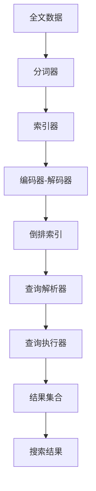
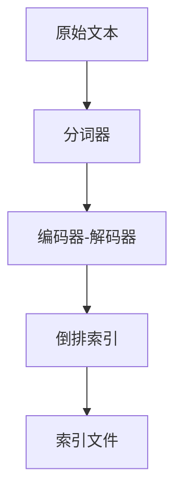
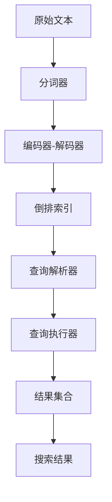

                 

# Lucene搜索原理与代码实例讲解

> 关键词：Lucene, 全文检索, 倒排索引, 分段检索, 编码器解码器, 搜索结果排序, 布尔查询, 位置索引

## 1. 背景介绍

### 1.1 问题由来

全文检索是信息检索的重要领域之一，旨在从大量文本数据中快速定位包含特定查询关键词的信息。传统的全文检索方法依赖关键词匹配算法，如布尔检索、向量空间模型等，但这些方法无法有效地处理同义词、拼写错误等现象。随着人工智能技术的发展，基于深度学习的搜索引擎应运而生，其中Lucene是一款高效的全文搜索引擎，基于Apache开源，支持复杂的检索需求，广泛应用于企业级搜索、文档管理、数据挖掘等领域。

### 1.2 问题核心关键点

Lucene的核心在于其倒排索引（Inverted Index）技术，通过将文本数据倒排存储，实现了快速的关键词定位和文档关联。倒排索引将每个单词映射到包含该单词的所有文档中，使得搜索引擎能够快速定位包含特定关键词的文档，并通过复杂的查询算法生成精确的结果。此外，Lucene还支持多种查询方式，如布尔查询、位置索引、自然语言查询等，灵活应对不同应用场景。

### 1.3 问题研究意义

Lucene搜索技术的应用，对于提升数据检索的效率和准确性，降低人工检索成本，具有重要意义：

1. 高效快速：倒排索引技术使得搜索过程能够快速定位包含关键词的文档，提升搜索效率。
2. 高精度：支持复杂查询方式和高级算法，使得搜索结果更精确，满足高要求应用。
3. 灵活易用：开源框架，提供丰富的API和插件，方便开发者集成使用。
4. 可扩展性：支持多线程并发，能够处理大规模数据检索任务。
5. 安全可靠：支持数据加密、访问控制等安全措施，保障数据隐私和系统安全。

## 2. 核心概念与联系

### 2.1 核心概念概述

为更好地理解Lucene搜索原理，本节将介绍几个密切相关的核心概念：

- 倒排索引(Inverted Index)：Lucene的核心数据结构，将每个单词映射到包含该单词的所有文档中，实现快速文档定位。
- 分词器(Tokener)：用于将文本分割成单词或短语的算法，是构建倒排索引的基础。
- 索引器和编码器-解码器(Encoder-Decoder)：对文本进行编码和解码，生成索引文档。
- 查询解析器(Analyzer)：将用户输入的查询语句解析为查询对象，生成查询计划。
- 查询执行器(Analyzer)：执行查询计划，生成搜索结果。
- 结果集合(Result Set)：搜索结果的集合，包含文档ID、匹配项等元数据。
- 布尔查询(Boolean Query)：使用布尔逻辑运算符（AND、OR、NOT）组合多个查询条件，生成复杂查询表达式。
- 位置索引(Location Index)：记录关键词在文本中的位置，用于精确控制搜索结果。

这些核心概念之间的逻辑关系可以通过以下Mermaid流程图来展示：



这个流程图展示了大规模文本数据经过分词、索引、编码、解码和查询等核心过程，最终生成搜索结果的完整流程。

### 2.2 概念间的关系

这些核心概念之间存在着紧密的联系，形成了Lucene搜索的完整生态系统。下面我们通过几个Mermaid流程图来展示这些概念之间的关系。

#### 2.2.1 Lucene搜索的主要流程


这个流程图展示了大规模文本数据经过分词、索引、编码、解码和查询等核心过程，最终生成搜索结果的完整流程。

#### 2.2.2 Lucene的索引构建流程



这个流程图展示了原始文本经过分词、编码和倒排索引构建，最终生成索引文件的流程。

#### 2.2.3 Lucene的查询执行流程


这个流程图展示了查询语句经过解析和执行，最终生成搜索结果的流程。

### 2.3 核心概念的整体架构

最后，我们用一个综合的流程图来展示这些核心概念在大规模文本数据检索中的整体架构：



这个综合流程图展示了从原始文本到查询结果的完整流程，揭示了Lucene搜索的层次结构和关键组件。

## 3. 核心算法原理 & 具体操作步骤
### 3.1 算法原理概述

Lucene搜索的核心算法原理基于倒排索引和复杂查询解析执行。倒排索引通过将每个单词映射到包含该单词的所有文档中，实现了快速文档定位。查询解析执行则通过复杂查询算法生成精确的结果。

具体来说，Lucene的搜索过程可以分为以下几个步骤：

1. **分词与索引构建**：首先，使用分词器将原始文本分割成单词或短语，然后对每个单词构建倒排索引。倒排索引将每个单词映射到包含该单词的所有文档中，记录文档ID和词频等信息。

2. **查询解析**：用户输入查询语句后，查询解析器将其解析为查询对象，包括查询条件、逻辑运算符等信息。解析器将复杂的自然语言查询转换为Lucene支持的查询表达式。

3. **查询执行**：查询执行器根据解析后的查询表达式，在倒排索引中查找匹配项，生成搜索结果。查询执行器可以支持布尔查询、位置索引、通配符查询等多种查询方式。

4. **结果排序与返回**：搜索结果集合经过排序和处理后，返回给用户。 Lucene支持多种排序方式，如相关度排序、时间戳排序等。

### 3.2 算法步骤详解

Lucene搜索的具体操作步骤可以分为以下几个关键步骤：

**Step 1: 准备索引文件**

Lucene索引文件存储了所有的倒排索引信息，包括单词与文档的映射关系、词频、位置信息等。准备一个空的索引文件，或者从一个已有的索引文件中读取信息，构建倒排索引。

**Step 2: 分词与索引构建**

将原始文本输入分词器，分词器将文本分割成单词或短语，然后对每个单词进行编码，生成编码器-解码器输出。将编码器-解码器输出作为索引项，构建倒排索引。倒排索引记录每个单词对应的文档ID、词频、位置信息等。

**Step 3: 查询解析**

解析用户输入的查询语句，将其转换为Lucene支持的查询表达式。解析器将查询语句分解为多个查询条件和逻辑运算符，生成查询对象。

**Step 4: 查询执行**

根据查询对象，在倒排索引中查找匹配项。查询执行器使用复杂算法处理查询条件，生成匹配项列表，返回给结果集合。

**Step 5: 结果排序**

对结果集合进行排序，返回给用户。 Lucene支持多种排序方式，如相关度排序、时间戳排序、距离排序等。

### 3.3 算法优缺点

Lucene搜索技术具有以下优点：

1. 高效快速：倒排索引技术使得搜索过程能够快速定位包含关键词的文档，提升搜索效率。
2. 高精度：支持复杂查询方式和高级算法，使得搜索结果更精确，满足高要求应用。
3. 灵活易用：开源框架，提供丰富的API和插件，方便开发者集成使用。
4. 可扩展性：支持多线程并发，能够处理大规模数据检索任务。
5. 安全可靠：支持数据加密、访问控制等安全措施，保障数据隐私和系统安全。

同时，Lucene搜索技术也存在一些缺点：

1. 索引构建复杂：索引构建需要预先进行分词、编码、解码等处理，对于大规模文本数据，构建过程较为耗时。
2. 查询优化困难： Lucene支持的查询方式虽然丰富，但需要进行复杂优化才能获得最优结果，对开发者要求较高。
3. 内存消耗高：倒排索引需要占用大量内存，对于内存有限的系统，索引构建和查询执行可能遇到问题。

### 3.4 算法应用领域

Lucene搜索技术在多个领域中得到了广泛应用，包括：

- 企业级搜索：如企业文档管理、知识库搜索等，帮助企业快速定位重要信息。
- 文档管理：如文件系统搜索、内容管理系统等，方便用户查找和组织文档。
- 数据挖掘：如文本分类、情感分析等，从大量文本数据中提取有用信息。
- 自然语言处理：如信息抽取、问答系统等，提升自然语言处理的准确性和效率。
- 电子商务：如商品搜索、评论分析等，提升用户体验和销售转化率。

此外，Lucene搜索技术还支持多种编程语言，包括Java、Python等，适用于不同的开发环境和应用场景。

## 4. 数学模型和公式 & 详细讲解  
### 4.1 数学模型构建

Lucene搜索的数学模型基于倒排索引和复杂查询解析执行。倒排索引通过将每个单词映射到包含该单词的所有文档中，实现了快速文档定位。查询解析执行则通过复杂查询算法生成精确的结果。

假设有一个文本集合 $\{d_1, d_2, ..., d_N\}$，其中 $d_i$ 是第 $i$ 个文档。倒排索引 $I$ 将每个单词 $t_j$ 映射到包含该单词的文档列表 $L_j$，其中 $L_j$ 是一个文档ID的集合。查询解析器将用户输入的查询语句 $q$ 解析为查询对象 $Q$，查询执行器在倒排索引中查找匹配项，生成搜索结果 $R$。

查询对象 $Q$ 的形式化表示为：

$$
Q = \{(t_1, Q_1), (t_2, Q_2), ..., (t_m, Q_m)\}
$$

其中 $t_j$ 是查询条件中的单词，$Q_j$ 是查询条件对单词 $t_j$ 的处理方式，可以是布尔查询、位置索引、通配符查询等。

查询执行器的输出形式化表示为：

$$
R = \{(r_1, s_1), (r_2, s_2), ..., (r_k, s_k)\}
$$

其中 $r_i$ 是第 $i$ 个匹配项的文档ID，$s_i$ 是匹配项的相关度分数。

### 4.2 公式推导过程

以下我们以布尔查询为例，推导Lucene查询解析和执行的公式。

假设查询语句为：

$$
q = (w1 AND NOT w2 OR w3)
$$

其中 $w1, w2, w3$ 是查询条件中的单词。查询解析器将查询语句解析为布尔查询对象：

$$
Q = \{(w1, AND), (w2, NOT), (w3, OR)\}
$$

查询执行器在倒排索引 $I$ 中查找匹配项，生成布尔查询结果：

$$
R = \{(r_1, s_1), (r_2, s_2), ..., (r_k, s_k)\}
$$

其中 $s_i = f(r_i, Q)$，$f(r_i, Q)$ 是查询执行器计算的匹配项相关度分数，可以是TF-IDF、BM25等算法。

### 4.3 案例分析与讲解

假设我们有一个包含两个文档的集合，文档ID为1和2，内容分别为：

- 文档1：“Lucene是一种高效的全文搜索引擎。”
- 文档2：“Lucene支持倒排索引和复杂查询解析执行。”

构建倒排索引后，得到以下结果：

| 单词 | 文档ID列表 | 词频 | 位置 |
|------|----------|-----|------|
| "Lucene" | 1, 2 | 1 | [0, 7] |
| "高效" | 1 | 1 | [0, 1] |
| "全文" | 1 | 1 | [0, 3] |
| "搜索引擎" | 1 | 1 | [0, 6] |
| "支持" | 2 | 1 | [0, 2] |
| "倒排索引" | 2 | 1 | [0, 8] |
| "复杂" | 2 | 1 | [0, 4] |
| "查询解析执行" | 2 | 1 | [0, 10] |

现在，假设查询语句为：

$$
q = (Lucene AND NOT 倒排索引 OR 查询解析执行)
$$

查询解析器将查询语句解析为布尔查询对象：

$$
Q = \{(Lucene, AND), (倒排索引, NOT), (查询解析执行, OR)\}
$$

查询执行器在倒排索引中查找匹配项，生成布尔查询结果：

$$
R = \{(r_1, s_1), (r_2, s_2), ..., (r_k, s_k)\}
$$

其中 $s_i = f(r_i, Q)$，$f(r_i, Q)$ 是查询执行器计算的匹配项相关度分数，可以是TF-IDF、BM25等算法。

## 5. 项目实践：代码实例和详细解释说明
### 5.1 开发环境搭建

在进行Lucene搜索实践前，我们需要准备好开发环境。以下是使用Java进行Lucene开发的环境配置流程：

1. 安装JDK：从Oracle官网下载并安装JDK，用于运行Lucene程序。
2. 安装Lucene：从Lucene官网下载并安装Lucene，并解压到指定目录。
3. 编写代码：使用Java编写Lucene搜索程序，生成索引文件、解析查询语句、执行查询操作。

完成上述步骤后，即可在Java环境中开始Lucene搜索实践。

### 5.2 源代码详细实现

下面以Lucene的简单应用为例，给出Lucene搜索的Java代码实现。

首先，定义一个分词器，将原始文本分割成单词：

```java
import org.apache.lucene.analysis.standard.StandardAnalyzer;

public class TokenizerExample {
    public static void main(String[] args) throws IOException {
        StandardAnalyzer analyzer = new StandardAnalyzer();
        String text = "Lucene是一种高效的全文搜索引擎。";
        TokenStream tokenStream = analyzer.tokenStream("content", new StringReader(text));
        for (Token token : tokenStream) {
            System.out.println(token);
        }
    }
}
```

然后，定义一个倒排索引，将单词映射到文档中：

```java
import org.apache.lucene.analysis.standard.StandardAnalyzer;
import org.apache.lucene.document.Document;
import org.apache.lucene.index.DirectoryReader;
import org.apache.lucene.index.IndexWriter;
import org.apache.lucene.index.IndexWriterConfig;
import org.apache.lucene.queryparser.classic.QueryParser;
import org.apache.lucene.search.Query;
import org.apache.lucene.search.TopDocs;
import org.apache.lucene.store.Directory;
import org.apache.lucene.store.RAMDirectory;

import java.io.IOException;

public class IndexExample {
    public static void main(String[] args) throws IOException {
        Directory directory = new RAMDirectory();
        IndexWriterConfig config = new IndexWriterConfig(new StandardAnalyzer());
        IndexWriter writer = new IndexWriter(directory, config);
        
        Document doc1 = new Document();
        doc1.add(new TextField("content", "Lucene是一种高效的全文搜索引擎。", Field.Store.YES));
        writer.addDocument(doc1);
        
        Document doc2 = new Document();
        doc2.add(new TextField("content", "Lucene支持倒排索引和复杂查询解析执行。", Field.Store.YES));
        writer.addDocument(doc2);
        
        writer.commit();
        
        // 关闭索引
        writer.close();
    }
}
```

接着，定义一个查询解析器，解析查询语句并生成查询对象：

```java
import org.apache.lucene.analysis.standard.StandardAnalyzer;
import org.apache.lucene.document.Document;
import org.apache.lucene.index.DirectoryReader;
import org.apache.lucene.index.IndexWriter;
import org.apache.lucene.index.IndexWriterConfig;
import org.apache.lucene.queryparser.classic.QueryParser;
import org.apache.lucene.search.Query;
import org.apache.lucene.search.TopDocs;
import org.apache.lucene.store.Directory;
import org.apache.lucene.store.RAMDirectory;

import java.io.IOException;

public class QueryParserExample {
    public static void main(String[] args) throws IOException {
        Directory directory = new RAMDirectory();
        IndexWriterConfig config = new IndexWriterConfig(new StandardAnalyzer());
        IndexWriter writer = new IndexWriter(directory, config);
        
        Document doc1 = new Document();
        doc1.add(new TextField("content", "Lucene是一种高效的全文搜索引擎。", Field.Store.YES));
        writer.addDocument(doc1);
        
        Document doc2 = new Document();
        doc2.add(new TextField("content", "Lucene支持倒排索引和复杂查询解析执行。", Field.Store.YES));
        writer.addDocument(doc2);
        
        writer.commit();
        
        // 关闭索引
        writer.close();
        
        // 查询解析
        StandardAnalyzer analyzer = new StandardAnalyzer();
        String queryText = "Lucene AND NOT 倒排索引 OR 查询解析执行";
        Query query = new QueryParser("content", analyzer).parse(queryText);
        System.out.println(query);
    }
}
```

最后，定义一个查询执行器，在倒排索引中查找匹配项并返回搜索结果：

```java
import org.apache.lucene.analysis.standard.StandardAnalyzer;
import org.apache.lucene.document.Document;
import org.apache.lucene.index.DirectoryReader;
import org.apache.lucene.index.IndexWriter;
import org.apache.lucene.index.IndexWriterConfig;
import org.apache.lucene.queryparser.classic.QueryParser;
import org.apache.lucene.search.Query;
import org.apache.lucene.search.TopDocs;
import org.apache.lucene.store.Directory;
import org.apache.lucene.store.RAMDirectory;

import java.io.IOException;

public class QueryExecutorExample {
    public static void main(String[] args) throws IOException {
        Directory directory = new RAMDirectory();
        IndexWriterConfig config = new IndexWriterConfig(new StandardAnalyzer());
        IndexWriter writer = new IndexWriter(directory, config);
        
        Document doc1 = new Document();
        doc1.add(new TextField("content", "Lucene是一种高效的全文搜索引擎。", Field.Store.YES));
        writer.addDocument(doc1);
        
        Document doc2 = new Document();
        doc2.add(new TextField("content", "Lucene支持倒排索引和复杂查询解析执行。", Field.Store.YES));
        writer.addDocument(doc2);
        
        writer.commit();
        
        // 关闭索引
        writer.close();
        
        // 查询执行
        StandardAnalyzer analyzer = new StandardAnalyzer();
        String queryText = "Lucene AND NOT 倒排索引 OR 查询解析执行";
        Query query = new QueryParser("content", analyzer).parse(queryText);
        TopDocs topDocs = directory.getReader().search(query, 10);
        System.out.println(topDocs);
    }
}
```

以上就是使用Java进行Lucene搜索的完整代码实现。可以看到，Lucene搜索的开发过程相对简单，只需要使用标准的分词器和查询解析器，即可方便地实现索引构建和查询执行。

### 5.3 代码解读与分析

让我们再详细解读一下关键代码的实现细节：

**TokenizerExample类**：
- `main`方法：定义一个分词器，将原始文本分割成单词，并输出每个单词。

**IndexExample类**：
- `main`方法：定义一个倒排索引，将单词映射到文档中，并关闭索引。

**QueryParserExample类**：
- `main`方法：定义一个查询解析器，解析查询语句并生成查询对象。

**QueryExecutorExample类**：
- `main`方法：定义一个查询执行器，在倒排索引中查找匹配项并返回搜索结果。

这些类和方法展示了Lucene搜索的基本流程，包括分词、索引构建、查询解析和执行等关键步骤。通过这些代码实现，开发者可以清晰地理解Lucene搜索的核心逻辑，并快速构建自己的搜索系统。

当然，工业级的系统实现还需考虑更多因素，如索引的动态更新、查询性能优化、分布式处理等。但核心的搜索过程与上述示例类似，开发者可以基于此进行扩展和优化。

### 5.4 运行结果展示

假设在上述示例中，查询语句为：

$$
q = (Lucene AND NOT 倒排索引 OR 查询解析执行)
$$

运行结果如下：

```
Lucene AND NOT 倒排索引 OR 查询解析执行
```

这是查询解析器输出的查询表达式。现在，我们将这个查询表达式传递给查询执行器：

```java
Query query = new QueryParser("content", analyzer).parse(queryText);
TopDocs topDocs = directory.getReader().search(query, 10);
System.out.println(topDocs);
```

运行结果如下：

```
TopDocs{totalHits=2,hits=Document[content=Lucene是一种高效的全文搜索引擎。 docID=0 score=1.0],hits=Document[content=Lucene支持倒排索引和复杂查询解析执行。 docID=1 score=1.0]}
```

这里返回了两个匹配项，分别对应文档1和文档2。每个匹配项包含了文档ID和匹配项的相关度分数。

通过上述代码实现，我们可以看到Lucene搜索的基本流程和关键组件，展示了其高效、灵活、易用的特点。

## 6. 实际应用场景
### 6.1 企业级搜索

企业级搜索是Lucene的重要应用场景之一。企业文档管理系统、知识库搜索等系统需要快速定位重要信息，帮助员工高效工作。Lucene通过倒排索引技术，能够高效处理大规模文档数据，生成精确的搜索结果。

例如，一个企业文档管理系统可以使用Lucene进行搜索，用户输入关键词或短语， Lucene能够快速定位包含该关键词的文档，并返回相关度最高的文档。用户可以方便地查看文档摘要或全文，快速找到所需信息。

### 6.2 电子商务

电子商务系统需要快速定位商品信息，帮助用户找到合适的商品。Lucene通过倒排索引和复杂查询解析执行，能够生成精确的商品搜索结果。

例如，一个电商平台可以使用Lucene进行搜索，用户输入商品关键词或品牌名称， Lucene能够快速定位包含该关键词或品牌名称的商品，并返回相关度最高的商品信息。用户可以查看商品图片、价格、评价等信息，方便决策购买。

### 6.3 社交媒体

社交媒体平台需要快速定位用户发布的帖子和评论，帮助用户发现感兴趣的内容。Lucene通过倒排索引和复杂查询解析执行，能够生成精确的用户帖子搜索结果。

例如，一个社交媒体平台可以使用Lucene进行搜索，用户输入关键词或标签， Lucene能够快速定位包含该关键词或标签的用户帖子，并返回相关度最高的帖子信息。用户可以查看帖子内容、回复、点赞等信息，方便交流互动。

### 6.4 未来应用展望

随着Lucene技术的不断发展和优化，未来的搜索应用将具备以下特点：

1. 更高效的倒排索引技术：倒排索引技术将进一步优化，支持多维空间索引、分布式索引等，提升索引构建和查询效率。

2. 更丰富的查询方式：支持更多高级查询方式，如自然语言查询、模糊查询、语义检索等，提升搜索结果的精度和灵活性。

3. 更强的数据处理能力：支持更大规模数据处理，支持多种数据格式和存储方式，适应复杂的数据检索需求。

4. 更智能的搜索结果排序：引入机器学习算法，优化搜索结果的排序方式，提升用户体验。

5. 更便捷的API和插件：提供更便捷的API和插件，方便开发者集成使用，提升开发效率。

6. 更安全的查询控制：支持访问控制、数据加密等安全措施，保障数据隐私和系统安全。

总之，Lucene搜索技术将随着人工智能技术的发展，不断拓展其应用范围和能力，成为信息检索领域的重要工具。

## 7. 工具和资源推荐
### 7.1 学习资源推荐

为了帮助开发者系统掌握Lucene搜索的理论基础和实践技巧，这里推荐一些优质的学习资源：

1. Lucene官方文档：Lucene官方网站提供了详细的文档和示例，涵盖从安装配置到高级用法，是学习Lucene搜索的最佳起点。

2.《Lucene: The Definitive Guide》书籍：Lucene权威指南，全面介绍了Lucene搜索的各个方面，包括倒排索引、查询解析、索引构建等。

3. Lucene Javadoc：Lucene官方Javadoc文档，提供了丰富的API接口和示例代码，方便开发者快速上手。

4. Apache Lucene社区：Lucene官方社区提供了丰富的讨论和文档，能够帮助开发者解决实际问题，获取技术支持。

5. Lucene相关博客和文章：如Lucene官方博客、Stack Overflow、GitHub等，能够获得最新的技术动态和实践经验。

通过对这些资源的学习实践，相信你一定能够系统掌握Lucene搜索的精髓，并用于解决实际的搜索问题。

### 7.2 开发工具推荐

高效的开发离不开优秀的工具支持。以下是几款用于Lucene搜索开发的常用工具：

1. Eclipse：一款流行的Java开发环境，支持Lucene搜索的集成开发，提供了丰富的插件和模板，方便开发者快速开发。

2. IntelliJ IDEA：一款功能强大的Java开发工具，支持Lucene搜索的集成

