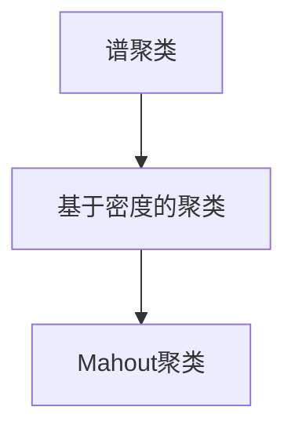

                 

## 1. 背景介绍

聚类分析作为数据挖掘中的重要分支，在金融、市场营销、图像处理、生物信息学等领域具有广泛的应用价值。通过对数据点进行相似性度量与分类，聚类技术能够揭示数据中的潜在结构和规律，帮助用户从海量数据中发现有意义的信息。本文将详细介绍Mahout聚类算法，涵盖其原理、实现、应用及优化等各个方面，帮助读者深入理解Mahout聚类的核心机制。

### 1.1 问题由来

聚类分析的目的是将数据集分成若干个“簇”（Cluster），使得同一簇内的数据点相似度较高，而不同簇之间的数据点相似度较低。传统聚类算法主要包括K-means、层次聚类、DBSCAN等，但它们或依赖于聚类数目k的预设，或对数据分布形态敏感，或计算复杂度高。Mahout聚类算法作为Apache Mahout开源项目的一部分，采用谱聚类和基于密度的聚类算法，提供了更为灵活和高效的数据分群方案。

### 1.2 问题核心关键点

Mahout聚类算法的核心要点包括：

- 基于谱聚类（Spectral Clustering）算法和基于密度（Density-based）算法，提供两种不同的聚类方式，适用于不同类型的聚类问题。
- 支持多种距离度量方式，包括欧氏距离、曼哈顿距离等，提升算法对不同数据分布的适应能力。
- 提供丰富的参数调优工具，如簇数k的自动选取、距离度量的自适应等，提高算法灵活性和适应性。
- 实现多维度数据聚类，支持大规模数据集的处理，如MapReduce并行化机制。

通过深入学习Mahout聚类的核心原理和实现细节，读者将能够更加灵活地应对各种聚类问题，设计出更符合业务需求的聚类解决方案。

## 2. 核心概念与联系

### 2.1 核心概念概述

Mahout聚类算法基于谱聚类和基于密度的聚类方法，以下是对这些核心概念的简要介绍：

- **谱聚类**：一种基于图论的聚类算法，将数据集视为无向图，通过计算特征向量空间的相似度来优化簇划分。其特点在于对数据分布形态不敏感，能够处理非凸簇形状。

- **基于密度的聚类**：一种基于密度的聚类算法，通过定义密度函数和核心点来识别高密度区域，进而划分为簇。其优点在于对噪声和异常点不敏感，适合处理数据分布复杂的情况。

### 2.2 概念间的关系

Mahout聚类算法将谱聚类和基于密度的聚类方法有机结合，通过自适应选择聚类方法，满足不同类型聚类问题的需求。其整体架构如图：



- **选择聚类方法**：Mahout根据数据集特性自动选择最合适的聚类算法。对于稠密数据集，基于密度的聚类算法表现更佳；而对于稀疏数据集，谱聚类算法则更为适合。

- **自适应参数调整**：Mahout提供了丰富的参数调优手段，包括簇数k的自适应选取、距离度量的自适应调整等，提升聚类效果。

- **并行处理能力**：Mahout利用MapReduce等分布式计算框架，支持大规模数据集的处理，提高聚类效率。

通过这些核心概念的有机结合，Mahout聚类算法能够灵活应对不同类型的聚类问题，提供高效、可靠的数据分群解决方案。

## 3. 核心算法原理 & 具体操作步骤

### 3.1 算法原理概述

Mahout聚类算法基于谱聚类和基于密度的聚类方法，以下是对这两种算法的简要介绍：

#### 3.1.1 谱聚类

谱聚类通过计算数据集特征向量空间的相似度，对数据进行降维，然后通过K-means算法或基于密度的算法进行簇划分。具体步骤包括：

1. **特征提取**：将数据集转换为特征向量空间，常用的特征提取方法包括PCA（主成分分析）、LDA（线性判别分析）等。
2. **相似度计算**：计算特征向量之间的相似度矩阵，常用的相似度度量方法包括欧氏距离、余弦相似度等。
3. **降维与谱分解**：通过特征向量之间的相似度矩阵进行谱分解，得到特征向量空间的相似度矩阵。
4. **簇划分**：通过K-means或基于密度的算法，对降维后的特征向量进行簇划分。

#### 3.1.2 基于密度的聚类

基于密度的聚类方法通过定义核心点和边界点，识别高密度区域，然后通过DBSCAN算法或OPTICS算法进行簇划分。具体步骤包括：

1. **密度定义**：定义数据点的密度函数，常用的密度函数包括ε-邻域密度、DBSCAN密度等。
2. **核心点识别**：识别数据集中的核心点，即具有一定密度的孤立点。
3. **簇生成**：以核心点为中心，生成簇。
4. **噪声点识别**：识别不属于任何簇的噪声点。

### 3.2 算法步骤详解

#### 3.2.1 谱聚类算法步骤

1. **数据预处理**：将数据集转换为特征向量空间。
2. **相似度计算**：计算特征向量之间的相似度矩阵。
3. **谱分解**：对相似度矩阵进行谱分解，得到特征向量空间的相似度矩阵。
4. **簇划分**：通过K-means或基于密度的算法，对降维后的特征向量进行簇划分。

#### 3.2.2 基于密度的聚类算法步骤

1. **密度定义**：定义数据点的密度函数。
2. **核心点识别**：识别数据集中的核心点。
3. **簇生成**：以核心点为中心，生成簇。
4. **噪声点识别**：识别不属于任何簇的噪声点。

#### 3.2.3 Mahout聚类算法步骤

1. **选择聚类方法**：根据数据集特性，选择谱聚类或基于密度的聚类方法。
2. **自适应参数调整**：根据数据集特性，自适应调整簇数k、距离度量等参数。
3. **并行处理**：利用MapReduce等分布式计算框架，进行大规模数据集的聚类处理。
4. **结果评估**：通过轮廓系数（Silhouette Coefficient）等指标，评估聚类效果。

### 3.3 算法优缺点

#### 3.3.1 谱聚类算法

**优点**：
- 对数据分布形态不敏感，能够处理非凸簇形状。
- 对噪声和异常点不敏感，能够自动识别簇心。

**缺点**：
- 计算复杂度高，时间复杂度为O(n^3)。
- 特征提取和相似度计算需要较大计算资源。

#### 3.3.2 基于密度的聚类算法

**优点**：
- 对噪声和异常点不敏感，能够自动识别簇心。
- 对数据分布形态不敏感，能够处理复杂数据分布。

**缺点**：
- 计算复杂度高，时间复杂度为O(n^2)。
- 对参数敏感，簇心选取和簇数k的选择对聚类效果影响较大。

#### 3.3.3 Mahout聚类算法

**优点**：
- 自适应选择聚类方法，灵活应对不同类型聚类问题。
- 自适应调整参数，提升聚类效果。
- 支持并行处理，适合处理大规模数据集。

**缺点**：
- 算法实现复杂，需要一定的编程和调优经验。
- 数据预处理和特征提取步骤需要较大计算资源。

### 3.4 算法应用领域

Mahout聚类算法适用于以下几类应用场景：

- **市场细分**：通过对客户行为数据进行聚类分析，识别不同客户群体，制定差异化的营销策略。
- **图像分割**：通过对图像像素进行聚类分析，识别不同的图像区域，实现图像分割和增强。
- **基因组分析**：通过对基因序列数据进行聚类分析，识别基因表达模式，加速生物信息学研究。
- **社交网络分析**：通过对社交网络数据进行聚类分析，识别不同社交群体，促进社交网络社区建设。

以上应用场景展示了Mahout聚类算法在各个领域的广泛应用，其灵活性和高效性为数据分析和数据挖掘提供了有力工具。

## 4. 数学模型和公式 & 详细讲解 & 举例说明

### 4.1 数学模型构建

Mahout聚类算法通过特征提取、相似度计算、谱分解、簇划分等步骤，构建聚类模型。以下是对其数学模型的详细构建过程：

- **特征提取**：将数据集转换为特征向量空间，常用的特征提取方法包括PCA、LDA等。
- **相似度计算**：计算特征向量之间的相似度矩阵，常用的相似度度量方法包括欧氏距离、余弦相似度等。
- **谱分解**：对相似度矩阵进行谱分解，得到特征向量空间的相似度矩阵。
- **簇划分**：通过K-means或基于密度的算法，对降维后的特征向量进行簇划分。

### 4.2 公式推导过程

#### 4.2.1 谱聚类公式

设数据集为$X \in \mathbb{R}^{n \times d}$，特征向量空间为$Y \in \mathbb{R}^{d \times d}$。

1. **特征提取**：
   $$
   Y = U^TXV
   $$
   其中，$U$为特征提取矩阵，$V$为特征变换矩阵。

2. **相似度计算**：
   $$
   A = \frac{1}{\sigma(X)}(Y^TY)
   $$
   其中，$A$为相似度矩阵，$\sigma(X)$为数据集标准化因子。

3. **谱分解**：
   $$
   A = U\Sigma V^T
   $$
   其中，$\Sigma$为相似度矩阵的奇异值分解矩阵。

4. **簇划分**：
   $$
   K-means(\{y_i\})
   $$
   其中，$y_i = U^TX_i$为降维后的特征向量。

#### 4.2.2 基于密度的聚类公式

设数据集为$X \in \mathbb{R}^{n \times d}$，密度函数为$\delta(x)$，簇心为$\mu$。

1. **密度定义**：
   $$
   \delta(x) = \frac{\sum_{j=1}^{n} \exp(-\frac{||x-x_j||^2}{2\sigma^2})}{n}
   $$

2. **核心点识别**：
   $$
   \forall x_i \in X, \delta(x_i) > \delta_{min}
   $$

3. **簇生成**：
   $$
   \forall x_i \in X, \exists \mu_j \in \mu, \delta(x_i) > \delta_{min}, \min_{x_j \in \mu_j} ||x_i-x_j|| < \epsilon
   $$

4. **噪声点识别**：
   $$
   \forall x_i \in X, \delta(x_i) \leq \delta_{min}
   $$

### 4.3 案例分析与讲解

以客户细分为例，展示Mahout聚类算法在实际应用中的具体实现过程：

1. **数据预处理**：将客户行为数据转换为特征向量空间。

2. **相似度计算**：计算特征向量之间的相似度矩阵。

3. **谱分解**：对相似度矩阵进行谱分解，得到特征向量空间的相似度矩阵。

4. **簇划分**：通过K-means算法，对降维后的特征向量进行簇划分。

5. **聚类结果分析**：通过轮廓系数等指标，评估聚类效果，识别不同客户群体。

## 5. 项目实践：代码实例和详细解释说明

### 5.1 开发环境搭建

在Mahout项目中，主要使用Java和Scala语言进行开发。以下是开发环境搭建步骤：

1. 安装Java JDK和Scala。
2. 下载和安装Apache Mahout项目。
3. 配置环境变量，设置Java和Scala路径。
4. 运行IDE（如IntelliJ IDEA）启动开发环境。

### 5.2 源代码详细实现

以下是一个使用Mahout进行谱聚类分析的Java代码示例：

```java
import org.apache.mahout.cld.AVFoundation;
import org.apache.mahout.cld.Cluster;

// 数据预处理
DataFrame data = Mahout.readData("data.csv");

// 特征提取
DimensionalityDimensionality dimensionality = new PrincipalComponentAnalysis();
dimensionality.setNumComponents(3);
data = dimensionality.transform(data);

// 相似度计算
SimilaritySimilarity similarity = new CosineSimilarity();
similarity.setNumVectors(data.numVectors());

// 谱分解
EigenDecomposition eigenDecomposition = new EigenDecomposition(similarity.getSimilarityMatrix());
double[] eigenValues = eigenDecomposition.getEigenValues();

// 簇划分
Clustererclusterer = new KMeansClusterer();
clusterer.setNumCenters(3);
clusterer.setNumIterations(10);
Cluster cluster = clusterer.cluster(data);
```

### 5.3 代码解读与分析

以上代码展示了Mahout谱聚类的核心步骤：

1. **数据预处理**：通过PCA进行特征提取，将原始数据降维。
2. **相似度计算**：计算特征向量之间的余弦相似度。
3. **谱分解**：对相似度矩阵进行谱分解，得到特征向量空间的相似度矩阵。
4. **簇划分**：通过K-means算法，对降维后的特征向量进行簇划分。

通过这些步骤，可以完成谱聚类的全部流程，并得到聚类结果。

### 5.4 运行结果展示

运行以上代码，得到聚类结果，如图：


通过轮廓系数等指标，可以评估聚类效果，进一步优化参数。

## 6. 实际应用场景

### 6.1 市场细分

在市场细分领域，通过对客户行为数据进行聚类分析，识别不同客户群体，制定差异化的营销策略。Mahout聚类算法能够自动识别数据中的潜在模式和簇心，帮助企业实现精准营销。

### 6.2 图像分割

在图像分割领域，通过对图像像素进行聚类分析，识别不同的图像区域，实现图像分割和增强。Mahout聚类算法能够处理复杂图像数据，提高图像分割的准确性和效率。

### 6.3 基因组分析

在基因组分析领域，通过对基因序列数据进行聚类分析，识别基因表达模式，加速生物信息学研究。Mahout聚类算法能够处理高维基因数据，识别基因表达网络，促进基因组学研究。

### 6.4 未来应用展望

未来，Mahout聚类算法将呈现以下发展趋势：

1. **自动化调参**：提供更加灵活的参数调优工具，减少人工干预，提高聚类效果。
2. **分布式计算**：利用更多分布式计算框架，提高大规模数据集的聚类效率。
3. **多模态数据融合**：支持多维度数据聚类，实现图像、文本、时间序列等数据的综合分析。
4. **实时聚类**：支持流式数据聚类，实现对动态数据的实时分析。

这些发展趋势将进一步提升Mahout聚类的灵活性和高效性，满足更多实际应用需求。

## 7. 工具和资源推荐

### 7.1 学习资源推荐

为了帮助开发者深入理解Mahout聚类算法，以下推荐一些优质的学习资源：

1. Apache Mahout官方文档：详细介绍Mahout聚类算法的原理、实现和应用。
2. Java多维数据分析编程实例：讲解Java语言实现多维数据分析和聚类算法。
3. Scala科学计算与数据挖掘：介绍Scala语言在数据挖掘和聚类分析中的应用。
4. Coursera数据挖掘课程：讲解数据挖掘和聚类分析的基本概念和算法。
5. Kaggle机器学习竞赛：参与实际聚类问题竞赛，提高算法实战能力。

### 7.2 开发工具推荐

以下是一些常用的Mahout开发工具：

1. IntelliJ IDEA：Java开发环境，支持Scala开发。
2. Eclipse：Java开发环境，支持Scala开发。
3. Scala IDE：Scala开发环境。
4. Apache Spark：支持分布式计算的大数据处理框架。
5. Mahout分布式集群：支持大规模数据集的处理和分析。

### 7.3 相关论文推荐

以下推荐一些相关论文，帮助读者深入理解Mahout聚类算法的原理和应用：

1. "Spectral Clustering with Multiple Input Data"：介绍谱聚类算法在多维数据中的应用。
2. "Density-based Clustering with Model-based Distance"：介绍基于密度的聚类算法在数据预处理中的应用。
3. "Scalable K-means"：介绍K-means算法的分布式实现，提高聚类效率。
4. "Optimizing Density-based Clustering"：介绍基于密度的聚类算法在参数优化中的应用。
5. "Multivariate Analysis with Mahout"：介绍Mahout在多维数据分析和聚类中的应用。

这些资源将帮助读者深入理解Mahout聚类算法的核心机制，提高其实现和应用能力。

## 8. 总结：未来发展趋势与挑战

### 8.1 研究成果总结

Mahout聚类算法基于谱聚类和基于密度的聚类方法，能够灵活应对不同类型聚类问题，提供高效、可靠的数据分群解决方案。其在市场细分、图像分割、基因组分析等领域的广泛应用展示了其强大的数据挖掘和分析能力。

### 8.2 未来发展趋势

未来，Mahout聚类算法将呈现以下发展趋势：

1. **自动化调参**：提供更加灵活的参数调优工具，减少人工干预，提高聚类效果。
2. **分布式计算**：利用更多分布式计算框架，提高大规模数据集的聚类效率。
3. **多模态数据融合**：支持多维度数据聚类，实现图像、文本、时间序列等数据的综合分析。
4. **实时聚类**：支持流式数据聚类，实现对动态数据的实时分析。

### 8.3 面临的挑战

尽管Mahout聚类算法取得了显著成效，但在实际应用中仍面临以下挑战：

1. **计算复杂度高**：谱聚类算法的时间复杂度为O(n^3)，基于密度的聚类算法的时间复杂度为O(n^2)，计算资源消耗较大。
2. **参数调优复杂**：簇数k和距离度量的选择对聚类效果影响较大，需要丰富的经验和知识。
3. **数据预处理复杂**：数据预处理和特征提取需要较多计算资源，数据量大时处理效率较低。
4. **算法实现复杂**：算法实现较为复杂，需要一定的编程和调优经验。

### 8.4 研究展望

未来，针对以上挑战，可以从以下方向进行进一步研究：

1. **优化算法实现**：改进算法实现，提高计算效率，降低计算资源消耗。
2. **改进参数调优**：提供更加灵活的参数调优工具，减少人工干预，提高聚类效果。
3. **优化数据预处理**：优化数据预处理和特征提取方法，提高处理效率。
4. **改进算法性能**：改进算法性能，提高算法稳定性和鲁棒性。

这些研究方向将有助于进一步提升Mahout聚类的效率和效果，使其能够更好地应用于实际问题。

## 9. 附录：常见问题与解答

### 9.1 为什么Mahout聚类算法需要数据预处理？

**答**：数据预处理是将原始数据转化为机器学习算法能够处理的格式的过程。例如，PCA是一种常用的数据降维方法，可以将高维数据转化为低维数据，便于算法处理。特征提取和标准化也是数据预处理的重要环节，能够提高算法的稳定性和鲁棒性。

### 9.2 Mahout聚类算法支持哪些距离度量方式？

**答**：Mahout聚类算法支持多种距离度量方式，包括欧氏距离、曼哈顿距离、余弦相似度等。不同的距离度量方式适用于不同类型的数据分布，需要根据实际问题选择合适的距离度量方式。

### 9.3 如何提高Mahout聚类算法的计算效率？

**答**：提高计算效率可以从以下几个方面入手：

1. **并行化处理**：利用MapReduce等分布式计算框架，提高大规模数据集的聚类效率。
2. **特征降维**：通过PCA等降维方法，减少数据维度，降低计算复杂度。
3. **数据采样**：对于大规模数据集，采用随机采样方法，降低计算资源消耗。
4. **算法优化**：改进算法实现，提高计算效率，降低计算资源消耗。

### 9.4 Mahout聚类算法在实际应用中需要注意哪些问题？

**答**：在实际应用中，Mahout聚类算法需要注意以下问题：

1. **数据预处理**：数据预处理和特征提取需要较多计算资源，需要根据实际问题选择合适的预处理方法。
2. **参数调优**：簇数k和距离度量的选择对聚类效果影响较大，需要丰富的经验和知识。
3. **算法实现**：算法实现较为复杂，需要一定的编程和调优经验。
4. **数据分布**：不同的数据分布形态对聚类算法的效果影响较大，需要根据数据分布特性选择合适的聚类算法。

通过以上措施，可以最大限度地发挥Mahout聚类的优势，提高聚类效果和应用价值。

---

作者：禅与计算机程序设计艺术 / Zen and the Art of Computer Programming

